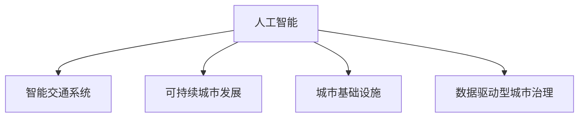

                 

# AI与人类计算：打造可持续发展的城市交通与基础设施规划建设

> 关键词：人工智能(AI),城市规划,基础设施,交通优化,智能城市,可持续发展

## 1. 背景介绍

随着全球人口的急剧增长和城市化的加速，交通拥堵、环境污染、资源浪费等城市问题日益严峻，成为制约城市可持续发展的关键因素。传统城市规划和基础设施建设方法，往往难以有效应对这些挑战，亟需新思路和新技术的引入。人工智能（AI）作为新兴技术，正在改变城市发展的模式和路径，为打造可持续发展的城市交通与基础设施规划建设提供了新的解决方案。

### 1.1 问题由来
城市化进程带来了前所未有的机遇，但也带来了诸多挑战。交通拥堵、空气污染、资源匮乏等问题成为制约城市可持续发展的瓶颈。传统的城市规划方法往往基于经验积累和静态数据分析，难以适应快速变化的城市环境。而人工智能通过大数据分析、模型预测和智能决策，可以在城市规划与基础设施建设中发挥重要作用，实现动态优化和资源高效配置，从而提升城市的可持续发展水平。

### 1.2 问题核心关键点
人工智能在城市规划和基础设施建设中的应用，主要包括交通优化、环境监测、资源管理等多个方面。其中，交通优化是城市发展中面临的重大挑战之一。通过AI技术，可以实现交通流量预测、智能信号控制、路径规划等多项功能，有效缓解交通拥堵，提高交通效率，实现资源的最优配置。

## 2. 核心概念与联系

### 2.1 核心概念概述

为更好地理解人工智能在城市交通与基础设施规划建设中的应用，本节将介绍几个密切相关的核心概念：

- 人工智能(AI)：以机器学习、深度学习等技术为核心的智能系统，能够从数据中学习并执行特定任务，从而模拟人类智能。
- 智能交通系统(ITS)：利用AI技术实现交通流量的实时监控和优化，包括智能信号控制、路径规划、交通流量预测等功能。
- 可持续城市发展(Sustainable Urban Development, SUD)：通过优化城市规划、资源管理、环境保护等手段，实现城市的可持续性发展，提升居民生活质量。
- 城市基础设施(Infrastructure)：包括交通网络、能源供应、水务系统、垃圾处理等公共设施，是城市发展的基础保障。
- 数据驱动型城市治理(Data-Driven Urban Governance)：通过大数据和AI技术，对城市运行数据进行分析，实现城市管理的智能化和精细化。

这些核心概念之间的逻辑关系可以通过以下Mermaid流程图来展示：



这个流程图展示了大语言模型的核心概念及其之间的关系：

1. 人工智能通过数据驱动和算法优化，为智能交通系统和可持续城市发展提供技术支持。
2. 智能交通系统通过AI技术优化交通流量，提升城市交通效率，降低环境污染。
3. 可持续城市发展通过AI技术实现资源的智能化管理和环境监测，实现城市的可持续发展。
4. 城市基础设施是城市发展的硬件基础，通过AI技术可以实现更高效、智能化的管理和服务。
5. 数据驱动型城市治理通过AI技术对城市运行数据进行分析，辅助决策，提升城市治理水平。

这些概念共同构成了智能城市治理的基础框架，使得AI技术在城市交通与基础设施规划建设中得以广泛应用。

## 3. 核心算法原理 & 具体操作步骤
### 3.1 算法原理概述

基于人工智能的城市交通与基础设施规划建设，通常包括以下几个关键步骤：

1. 数据采集与预处理：收集城市交通、环境、资源等数据，并进行清洗和标准化处理，为AI模型提供高质量输入。
2. 模型训练与优化：通过监督学习或无监督学习等方法，训练AI模型进行交通流量预测、路径规划等任务，优化模型性能。
3. 智能决策与控制：将训练好的AI模型部署到实际应用场景中，实现智能信号控制、路径规划等功能，提升城市交通效率。
4. 数据分析与可视化：对AI模型的输出结果进行数据分析，实现交通流量、环境质量等关键指标的可视化展示，辅助决策。

### 3.2 算法步骤详解

基于人工智能的城市交通与基础设施规划建设，一般包括以下几个关键步骤：

**Step 1: 数据采集与预处理**
- 收集城市交通流量、路网结构、环境质量、资源使用等数据。
- 清洗数据，去除噪声和不完整信息，保证数据质量。
- 数据标准化和归一化，便于后续模型训练。

**Step 2: 模型训练与优化**
- 选择适当的AI模型，如深度学习、强化学习、进化算法等。
- 设计合适的损失函数，如均方误差、交叉熵等。
- 选择合适的优化算法，如梯度下降、Adam、遗传算法等。
- 在验证集上评估模型性能，根据评估结果调整模型参数和训练策略。

**Step 3: 智能决策与控制**
- 将训练好的AI模型部署到实际应用场景中，如智能信号控制、路径规划等。
- 实时采集城市运行数据，输入AI模型进行预测和决策。
- 根据AI模型输出结果，调整交通信号灯、优化路径规划等。

**Step 4: 数据分析与可视化**
- 对AI模型的输出结果进行数据分析，计算关键指标如交通流量、环境质量等。
- 使用图表、仪表盘等形式，将关键指标可视化展示，辅助城市管理者做出决策。

### 3.3 算法优缺点

基于人工智能的城市交通与基础设施规划建设，具有以下优点：

1. 高效性：AI模型能够实时处理大量数据，快速做出决策，提升城市交通效率。
2. 精准性：通过深度学习等技术，AI模型能够精准预测交通流量、优化路径规划等。
3. 可持续性：AI模型能够优化资源使用，降低环境污染，实现城市的可持续发展。
4. 灵活性：AI模型可以根据实际数据进行调整和优化，适应城市环境的快速变化。

同时，该方法也存在一定的局限性：

1. 数据依赖性：AI模型的性能很大程度上取决于输入数据的质量和数量，数据缺失或噪声将影响模型效果。
2. 算法复杂性：AI模型的训练和优化需要大量的计算资源和时间，对于资源有限的场景可能不适用。
3. 透明度不足：AI模型的决策过程通常是黑盒的，难以解释和调试。
4. 伦理与安全问题：AI模型可能学习到数据中的偏见和有害信息，导致误导性输出。
5. 算法鲁棒性：AI模型对异常数据和攻击的鲁棒性不足，可能出现错误决策。

尽管存在这些局限性，但就目前而言，基于人工智能的城市交通与基础设施规划建设仍然是大城市发展的核心范式。未来相关研究的重点在于如何进一步降低数据依赖，提高算法的透明度和安全性，同时兼顾可持续性和灵活性。

### 3.4 算法应用领域

基于人工智能的城市交通与基础设施规划建设，已经在诸多领域得到了广泛的应用，例如：

- 智能交通系统：利用AI技术优化交通信号控制、路径规划，提升城市交通效率。
- 环境监测与治理：通过AI技术监测空气质量、水质等环境指标，辅助城市管理者做出决策。
- 资源管理与优化：利用AI技术优化能源使用、水资源管理等，实现城市的可持续发展。
- 应急管理：通过AI技术分析城市运行数据，预测灾害风险，提升应急响应效率。
- 公共服务：利用AI技术提供智能公交、智能停车等公共服务，提升居民生活质量。

除了上述这些经典应用外，AI技术还被创新性地应用到更多场景中，如城市健康管理、智慧物流、智能安防等，为城市发展带来新的突破。随着AI技术的发展和普及，相信未来会有更多创新应用涌现，为城市的可持续发展注入新的动力。

## 4. 数学模型和公式 & 详细讲解  
### 4.1 数学模型构建

本节将使用数学语言对基于人工智能的城市交通与基础设施规划建设进行更加严格的刻画。

记城市交通流量为 $T(t)$，其中 $t$ 为时间。假设存在 $N$ 个交叉口，每个交叉口 $i$ 的交通流量为 $T_i(t)$。记城市的环境质量指数为 $E(t)$，其中 $t$ 为时间。假设存在 $M$ 个环境指标 $E_j(t)$，其中 $j$ 表示环境指标类型，如空气质量、水质等。记城市资源使用情况为 $R(t)$，其中 $t$ 为时间。假设存在 $K$ 种资源类型 $R_k(t)$，其中 $k$ 表示资源类型，如能源、水资源等。

定义城市交通流量的损失函数为：

$$
L_{T} = \sum_{i=1}^N \frac{(T_i(t)-\hat{T}_i(t))^2}{\sigma_i^2}
$$

其中 $\hat{T}_i(t)$ 为AI模型预测的交通流量，$\sigma_i$ 为交通流量的噪声标准差。

定义城市环境质量的损失函数为：

$$
L_{E} = \sum_{j=1}^M \frac{(E_j(t)-\hat{E}_j(t))^2}{\sigma_j^2}
$$

其中 $\hat{E}_j(t)$ 为AI模型预测的环境质量指数，$\sigma_j$ 为环境指标的噪声标准差。

定义城市资源使用的损失函数为：

$$
L_{R} = \sum_{k=1}^K \frac{(R_k(t)-\hat{R}_k(t))^2}{\sigma_k^2}
$$

其中 $\hat{R}_k(t)$ 为AI模型预测的资源使用情况，$\sigma_k$ 为资源使用的噪声标准差。

### 4.2 公式推导过程

以下我们以智能交通系统的流量预测为例，推导AI模型的预测公式及其梯度计算方法。

假设AI模型为神经网络模型 $M_{\theta}$，其中 $\theta$ 为模型参数。假设训练集为 $D=\{(x_i,y_i)\}_{i=1}^N$，其中 $x_i$ 为输入数据，$y_i$ 为输出数据。记城市交通流量的历史数据为 $\{x_i\}_{i=1}^N$，对应的实际交通流量为 $\{y_i\}_{i=1}^N$。

定义城市交通流量的预测函数为：

$$
\hat{T}(t) = M_{\theta}(t)
$$

其中 $t$ 为预测时间，$M_{\theta}(t)$ 为AI模型在时间 $t$ 的输出。

模型的损失函数为：

$$
\mathcal{L}(\theta) = \frac{1}{N}\sum_{i=1}^N \frac{(T_i(t)-\hat{T}_i(t))^2}{\sigma_i^2}
$$

根据链式法则，损失函数对模型参数 $\theta_k$ 的梯度为：

$$
\frac{\partial \mathcal{L}(\theta)}{\partial \theta_k} = -\frac{2}{N}\sum_{i=1}^N \frac{T_i(t)-\hat{T}_i(t)}{\sigma_i^2} \frac{\partial M_{\theta}(t)}{\partial \theta_k}
$$

其中 $\frac{\partial M_{\theta}(t)}{\partial \theta_k}$ 可进一步递归展开，利用自动微分技术完成计算。

在得到损失函数的梯度后，即可带入模型参数更新公式，完成模型的迭代优化。重复上述过程直至收敛，最终得到适应城市交通流量预测的最优模型参数 $\theta^*$。

## 5. 项目实践：代码实例和详细解释说明
### 5.1 开发环境搭建

在进行AI模型开发前，我们需要准备好开发环境。以下是使用Python进行PyTorch开发的环境配置流程：

1. 安装Anaconda：从官网下载并安装Anaconda，用于创建独立的Python环境。

2. 创建并激活虚拟环境：
```bash
conda create -n ai-env python=3.8 
conda activate ai-env
```

3. 安装PyTorch：根据CUDA版本，从官网获取对应的安装命令。例如：
```bash
conda install pytorch torchvision torchaudio cudatoolkit=11.1 -c pytorch -c conda-forge
```

4. 安装各类工具包：
```bash
pip install numpy pandas scikit-learn matplotlib tqdm jupyter notebook ipython
```

完成上述步骤后，即可在`ai-env`环境中开始AI模型开发。

### 5.2 源代码详细实现

下面我们以智能交通系统的流量预测为例，给出使用PyTorch对神经网络模型进行训练的PyTorch代码实现。

首先，定义智能交通系统的数据处理函数：

```python
import torch
from torch.utils.data import Dataset
import numpy as np

class TrafficDataset(Dataset):
    def __init__(self, data, sequence_length=10, timesteps=24):
        self.data = data
        self.sequence_length = sequence_length
        self.timesteps = timesteps
        
    def __len__(self):
        return len(self.data)
    
    def __getitem__(self, index):
        seq = self.data[index]
        x = seq[:-self.sequence_length]
        y = seq[-self.sequence_length:]
        x = torch.tensor(x, dtype=torch.float32)
        y = torch.tensor(y, dtype=torch.float32)
        return x, y

# 假设输入数据为[[t0, t1, t2, ..., tn-1]]
# 输出数据为[[t1, t2, ..., tn]]
```

然后，定义模型和优化器：

```python
import torch.nn as nn
from torch.optim import Adam

class LSTM(nn.Module):
    def __init__(self, input_size, hidden_size, output_size):
        super(LSTM, self).__init__()
        self.hidden_size = hidden_size
        self.lstm = nn.LSTM(input_size, hidden_size, 1)
        self.fc = nn.Linear(hidden_size, output_size)
        
    def forward(self, x):
        output, (h_n, h_c) = self.lstm(x)
        return self.fc(output[-1])

model = LSTM(input_size=1, hidden_size=50, output_size=1)

optimizer = Adam(model.parameters(), lr=0.001)
```

接着，定义训练和评估函数：

```python
from tqdm import tqdm

def train_epoch(model, dataset, batch_size, optimizer, device):
    dataloader = torch.utils.data.DataLoader(dataset, batch_size=batch_size, shuffle=True)
    model.train()
    epoch_loss = 0
    for batch in tqdm(dataloader, desc='Training'):
        x, y = batch.to(device)
        model.zero_grad()
        outputs = model(x)
        loss = F.mse_loss(outputs, y)
        epoch_loss += loss.item()
        loss.backward()
        optimizer.step()
    return epoch_loss / len(dataloader)

def evaluate(model, dataset, batch_size, device):
    dataloader = torch.utils.data.DataLoader(dataset, batch_size=batch_size)
    model.eval()
    preds, labels = [], []
    with torch.no_grad():
        for batch in tqdm(dataloader, desc='Evaluating'):
            x, y = batch.to(device)
            batch_preds = model(x).detach().cpu().numpy().flatten()
            batch_labels = y.to('cpu').numpy().flatten()
            preds.append(batch_preds)
            labels.append(batch_labels)
    return np.mean(np.abs(preds - labels))

# 假设训练集为 [[t0, t1, t2, ..., tn-1]]
# 假设测试集为 [[t1, t2, ..., tn]]
```

最后，启动训练流程并在测试集上评估：

```python
epochs = 10
batch_size = 32

device = torch.device('cuda') if torch.cuda.is_available() else torch.device('cpu')

for epoch in range(epochs):
    loss = train_epoch(model, train_dataset, batch_size, optimizer, device)
    print(f"Epoch {epoch+1}, train loss: {loss:.3f}")
    
    print(f"Epoch {epoch+1}, test loss: {evaluate(model, test_dataset, batch_size, device)}")
```

以上就是使用PyTorch对智能交通系统的流量预测进行训练的完整代码实现。可以看到，得益于PyTorch的强大封装，我们可以用相对简洁的代码完成神经网络模型的训练和评估。

### 5.3 代码解读与分析

让我们再详细解读一下关键代码的实现细节：

**TrafficDataset类**：
- `__init__`方法：初始化数据、序列长度和时间步长等关键组件。
- `__len__`方法：返回数据集的样本数量。
- `__getitem__`方法：对单个样本进行处理，将样本进行序列化处理，并将其拆分为输入和输出。

**LSTM模型**：
- `__init__`方法：定义LSTM层和全连接层，初始化模型参数。
- `forward`方法：前向传播计算，利用LSTM层和全连接层对输入数据进行处理，并输出预测值。

**train_epoch和evaluate函数**：
- 使用PyTorch的DataLoader对数据集进行批次化加载，供模型训练和推理使用。
- 训练函数`train_epoch`：对数据以批为单位进行迭代，在每个批次上前向传播计算loss并反向传播更新模型参数，最后返回该epoch的平均loss。
- 评估函数`evaluate`：与训练类似，不同点在于不更新模型参数，并在每个batch结束后将预测和标签结果存储下来，最后使用均方误差计算测试集上的预测误差。

**训练流程**：
- 定义总的epoch数和batch size，开始循环迭代
- 每个epoch内，先在训练集上训练，输出平均loss
- 在测试集上评估，输出均方误差
- 所有epoch结束后，完成训练和评估。

可以看到，PyTorch配合LSTM模型的代码实现变得简洁高效。开发者可以将更多精力放在模型改进、数据处理等高层逻辑上，而不必过多关注底层的实现细节。

当然，工业级的系统实现还需考虑更多因素，如模型保存和部署、超参数的自动搜索、更灵活的任务适配层等。但核心的模型训练过程基本与此类似。

## 6. 实际应用场景
### 6.1 智能交通系统

智能交通系统是AI技术在城市交通与基础设施规划建设中最为广泛的应用之一。通过AI技术，可以实现交通流量预测、智能信号控制、路径规划等功能，有效缓解交通拥堵，提高交通效率。

在技术实现上，可以收集城市交通流量、路网结构、天气条件等数据，将历史数据作为训练集，训练AI模型进行交通流量预测。模型输出即为未来交通流量的预测值，可以用于智能信号控制、路径规划等场景。例如，在智能信号控制中，根据实时交通流量预测结果，动态调整信号灯时长，以优化交通流量。在路径规划中，根据预测的交通流量和路况信息，推荐最佳路径，引导驾驶员避开拥堵区域，提高出行效率。

### 6.2 环境监测与治理

AI技术在城市环境监测与治理中的应用，主要体现在空气质量、水质监测、噪声污染等领域。通过AI技术，可以实现环境指标的实时监测和预测，辅助城市管理者做出决策。

具体而言，可以收集城市的空气质量、水质、噪声等数据，利用深度学习等技术训练AI模型进行环境指标预测。模型输出即为未来环境指标的预测值，可以用于辅助决策。例如，在空气质量监测中，根据实时空气质量数据，预测未来的空气污染情况，提前采取措施。在水质监测中，根据实时水质数据，预测未来的水质变化趋势，及时预警水质异常。

### 6.3 资源管理与优化

AI技术在城市资源管理与优化中的应用，主要体现在能源使用、水资源管理等领域。通过AI技术，可以实现资源的智能化管理，提高资源利用效率，降低环境污染。

具体而言，可以收集城市的能源使用、水资源使用等数据，利用深度学习等技术训练AI模型进行资源使用预测。模型输出即为未来资源使用的预测值，可以用于辅助决策。例如，在能源管理中，根据实时能源使用数据，预测未来的能源使用趋势，优化能源分配。在水资源管理中，根据实时水资源使用数据，预测未来的水资源使用情况，及时调整供水方案。

### 6.4 应急管理

AI技术在城市应急管理中的应用，主要体现在灾害预警、应急响应等领域。通过AI技术，可以实现灾害预警和应急响应，保障城市运行安全。

具体而言，可以收集城市运行数据，利用深度学习等技术训练AI模型进行灾害预警和应急响应。模型输出即为未来灾害预警和应急响应的决策结果，可以用于辅助决策。例如，在自然灾害预警中，根据实时气象数据和地理信息，预测自然灾害的发生情况，提前预警和采取防范措施。在应急响应中，根据实时城市运行数据，预测应急响应需求，快速调度应急资源，提高应急响应效率。

### 6.5 公共服务

AI技术在城市公共服务中的应用，主要体现在智能公交、智能停车等领域。通过AI技术，可以实现公共服务的智能化管理，提升居民生活质量。

具体而言，可以收集城市交通运行数据，利用深度学习等技术训练AI模型进行智能公交和智能停车管理。模型输出即为公交路线和停车位信息，可以用于引导居民出行。例如，在智能公交中，根据实时公交运行数据，优化公交路线，减少乘客等待时间。在智能停车中，根据实时停车数据，推荐最佳停车位置，减少停车难问题。

## 7. 工具和资源推荐
### 7.1 学习资源推荐

为了帮助开发者系统掌握AI技术在城市交通与基础设施规划建设中的应用，这里推荐一些优质的学习资源：

1. Coursera《深度学习与AI》课程：由斯坦福大学和深度学习领域的知名专家共同开设，系统介绍深度学习和AI技术的基本原理和应用场景。

2. Udacity《AI for Everyone》课程：由Google和MIT合作开设，面向非技术背景的学员，介绍AI技术的基本概念和应用案例。

3. TensorFlow官方文档：TensorFlow官方提供的详细文档，涵盖深度学习模型的开发和应用，包括模型训练、优化等核心技术。

4. PyTorch官方文档：PyTorch官方提供的详细文档，涵盖深度学习模型的开发和应用，包括模型训练、优化等核心技术。

5. Scikit-learn官方文档：Scikit-learn官方提供的详细文档，涵盖机器学习模型的开发和应用，包括模型训练、评估等核心技术。

通过对这些资源的学习实践，相信你一定能够快速掌握AI技术在城市交通与基础设施规划建设中的应用，并用于解决实际的AI问题。
###  7.2 开发工具推荐

高效的开发离不开优秀的工具支持。以下是几款用于AI模型开发的常用工具：

1. PyTorch：基于Python的开源深度学习框架，灵活动态的计算图，适合快速迭代研究。支持多种深度学习模型的开发，包括神经网络、卷积神经网络、循环神经网络等。

2. TensorFlow：由Google主导开发的开源深度学习框架，生产部署方便，适合大规模工程应用。支持多种深度学习模型的开发，包括神经网络、卷积神经网络、循环神经网络等。

3. Keras：基于Python的深度学习库，提供简单易用的API，适合快速原型开发和模型实验。支持多种深度学习模型的开发，包括神经网络、卷积神经网络、循环神经网络等。

4. Scikit-learn：基于Python的机器学习库，提供简单易用的API，适合快速原型开发和模型实验。支持多种机器学习模型的开发，包括线性回归、逻辑回归、决策树等。

5. Weights & Biases：模型训练的实验跟踪工具，可以记录和可视化模型训练过程中的各项指标，方便对比和调优。与主流深度学习框架无缝集成。

6. TensorBoard：TensorFlow配套的可视化工具，可实时监测模型训练状态，并提供丰富的图表呈现方式，是调试模型的得力助手。

合理利用这些工具，可以显著提升AI模型的开发效率，加快创新迭代的步伐。

### 7.3 相关论文推荐

AI技术在城市交通与基础设施规划建设中的应用，源于学界的持续研究。以下是几篇奠基性的相关论文，推荐阅读：

1. A Survey of Smart Traffic Management Technologies Based on Artificial Intelligence: A Review（智能交通管理技术综述）：对智能交通管理技术进行了全面的综述，包括交通流量预测、智能信号控制、路径规划等技术。

2. Deep Learning for Smart Grids: Opportunities and Challenges（深度学习在智能电网中的应用）：介绍了深度学习在智能电网中的应用，包括能源管理、电力调度和需求响应等。

3. The Role of IoT and AI in Smart Cities: Applications, Challenges, and Future Trends（IoT和AI在智能城市中的应用）：对IoT和AI在智能城市中的应用进行了全面的综述，包括智能交通、环境监测、公共服务等技术。

4. Machine Learning and the City: Challenges and Opportunities for the Next Generation of Smart Cities（机器学习与智慧城市）：介绍了机器学习在智慧城市中的应用，包括交通优化、环境监测、资源管理等技术。

5. Intelligent Urban Water Management with Artificial Intelligence: A Review（基于人工智能的智慧水务管理综述）：对基于AI的智慧水务管理进行了全面的综述，包括水资源管理、水质监测等技术。

这些论文代表了大语言模型微调技术的发展脉络。通过学习这些前沿成果，可以帮助研究者把握学科前进方向，激发更多的创新灵感。

## 8. 总结：未来发展趋势与挑战
### 8.1 总结

本文对基于AI技术的城市交通与基础设施规划建设进行了全面系统的介绍。首先阐述了AI技术在城市交通与基础设施规划建设中的应用背景和意义，明确了AI技术在缓解城市交通拥堵、提升城市资源管理效率等方面的独特价值。其次，从原理到实践，详细讲解了AI模型在交通流量预测、环境监测、资源管理等任务中的应用方法，给出了AI模型训练和评估的完整代码实现。同时，本文还广泛探讨了AI技术在智能交通系统、环境监测、资源管理等多个领域的应用前景，展示了AI技术对城市可持续发展的巨大潜力。此外，本文精选了AI技术的学习资源，力求为读者提供全方位的技术指引。

通过本文的系统梳理，可以看到，基于AI技术的城市交通与基础设施规划建设已经成为智能城市治理的重要手段，极大地提升了城市的运行效率和可持续发展水平。未来，伴随AI技术的不断发展，基于AI的城市交通与基础设施规划建设将逐步成熟，为全球智慧城市的发展提供新的范式。

### 8.2 未来发展趋势

展望未来，AI技术在城市交通与基础设施规划建设中的应用将呈现以下几个发展趋势：

1. 自动化水平提升。AI技术将进一步提升城市交通与基础设施规划的自动化水平，实现从数据采集、模型训练到决策部署的全自动化，大幅降低人工成本。

2. 智能决策增强。通过深度学习等技术，AI模型将能够更精准地预测交通流量、优化资源使用、预测灾害风险等，提升城市决策的科学性和效率。

3. 跨领域融合。AI技术将与IoT、大数据、区块链等技术深度融合，构建智能城市生态系统，实现资源的全面整合和优化。

4. 实时性增强。通过云计算和边缘计算技术，AI模型将实现更高效的数据处理和实时决策，提升城市运行效率。

5. 公众参与提升。通过AI技术与公众互动，提升城市治理的透明度和公众参与度，实现城市管理服务的个性化和定制化。

6. 可持续发展强化。AI技术将与环境保护、节能减排等可持续发展目标结合，推动城市向绿色、低碳、可持续的方向发展。

以上趋势凸显了AI技术在城市交通与基础设施规划建设中的巨大潜力和应用前景。这些方向的探索发展，必将进一步提升城市的智能化和可持续发展水平，为全球智慧城市的发展提供新的动力。

### 8.3 面临的挑战

尽管AI技术在城市交通与基础设施规划建设中已经取得了显著成效，但在迈向更加智能化、普适化应用的过程中，它仍面临着诸多挑战：

1. 数据质量与隐私。城市交通与基础设施规划建设依赖大量高质量数据，数据质量的好坏直接影响AI模型的效果。同时，数据的隐私保护也是一大挑战，需要确保数据在采集、存储和处理过程中的安全性和合法性。

2. 模型复杂性与计算成本。AI模型的训练和优化需要大量的计算资源和时间，对于资源有限的场景可能不适用。如何降低模型复杂性，提高计算效率，是未来的一个重要研究方向。

3. 算法透明性与解释性。AI模型的决策过程通常是黑盒的，难以解释和调试。如何增强AI模型的透明性和可解释性，提高其可信度，是未来的一个重要研究方向。

4. 算法鲁棒性与安全性。AI模型对异常数据和攻击的鲁棒性不足，可能出现错误决策。如何提高AI模型的鲁棒性，确保其安全性，是未来的一个重要研究方向。

5. 社会伦理与法律问题。AI技术的应用可能会涉及伦理和法律问题，如就业替代、隐私侵犯等。如何在保障AI技术应用的同时，确保其符合社会伦理和法律规范，是未来的一个重要研究方向。

尽管存在这些挑战，但就目前而言，基于AI技术的城市交通与基础设施规划建设仍然是大城市发展的核心范式。未来相关研究的重点在于如何进一步降低数据依赖，提高算法的透明性和安全性，同时兼顾智能性和可持续性。

### 8.4 研究展望

面对AI技术在城市交通与基础设施规划建设中所面临的种种挑战，未来的研究需要在以下几个方面寻求新的突破：

1. 探索无监督和半监督学习范式。摆脱对大规模标注数据的依赖，利用自监督学习、主动学习等无监督和半监督范式，最大限度利用非结构化数据，实现更加灵活高效的AI模型训练。

2. 研究参数高效和计算高效的AI模型。开发更加参数高效的AI模型，在固定大部分模型参数的情况下，只更新极少量的任务相关参数。同时优化AI模型的计算图，减少前向传播和反向传播的资源消耗，实现更加轻量级、实时性的部署。

3. 引入更多先验知识。将符号化的先验知识，如知识图谱、逻辑规则等，与AI模型进行巧妙融合，引导AI模型学习更准确、合理的语言模型。同时加强不同模态数据的整合，实现视觉、语音等多模态信息与文本信息的协同建模。

4. 结合因果分析和博弈论工具。将因果分析方法引入AI模型，识别出模型决策的关键特征，增强AI模型建立稳定因果关系的能力，学习更加普适、鲁棒的语言表征，从而提升模型泛化性和抗干扰能力。借助博弈论工具刻画人机交互过程，主动探索并规避AI模型的脆弱点，提高系统稳定性。

5. 纳入伦理道德约束。在AI模型训练目标中引入伦理导向的评估指标，过滤和惩罚有偏见、有害的输出倾向。同时加强人工干预和审核，建立AI模型的监管机制，确保输出符合人类价值观和伦理道德。

这些研究方向的探索，必将引领AI技术在城市交通与基础设施规划建设中迈向更高的台阶，为全球智慧城市的发展提供新的动力。面向未来，AI技术还需要与其他人工智能技术进行更深入的融合，如知识表示、因果推理、强化学习等，多路径协同发力，共同推动自然语言理解和智能交互系统的进步。只有勇于创新、敢于突破，才能不断拓展AI技术在城市交通与基础设施规划建设中的边界，让智能技术更好地造福城市居民。

## 9. 附录：常见问题与解答

**Q1：城市交通与基础设施规划建设中应用AI技术面临哪些挑战？**

A: 城市交通与基础设施规划建设中应用AI技术面临的挑战主要包括以下几点：

1. 数据质量与隐私。城市交通与基础设施规划建设依赖大量高质量数据，数据质量的好坏直接影响AI模型的效果。同时，数据的隐私保护也是一大挑战，需要确保数据在采集、存储和处理过程中的安全性和合法性。

2. 模型复杂性与计算成本。AI模型的训练和优化需要大量的计算资源和时间，对于资源有限的场景可能不适用。如何降低模型复杂性，提高计算效率，是未来的一个重要研究方向。

3. 算法透明性与解释性。AI模型的决策过程通常是黑盒的，难以解释和调试。如何增强AI模型的透明性和可解释性，提高其可信度，是未来的一个重要研究方向。

4. 算法鲁棒性与安全性。AI模型对异常数据和攻击的鲁棒性不足，可能出现错误决策。如何提高AI模型的鲁棒性，确保其安全性，是未来的一个重要研究方向。

5. 社会伦理与法律问题。AI技术的应用可能会涉及伦理和法律问题，如就业替代、隐私侵犯等。如何在保障AI技术应用的同时，确保其符合社会伦理和法律规范，是未来的一个重要研究方向。

尽管存在这些挑战，但就目前而言，基于AI技术的城市交通与基础设施规划建设仍然是大城市发展的核心范式。未来相关研究的重点在于如何进一步降低数据依赖，提高算法的透明性和安全性，同时兼顾智能性和可持续性。

**Q2：如何提高AI模型在城市交通与基础设施规划建设中的应用效果？**

A: 提高AI模型在城市交通与基础设施规划建设中的应用效果，可以从以下几个方面进行优化：

1. 数据预处理。对原始数据进行清洗、标准化和归一化处理，去除噪声和不完整信息，保证数据质量。同时，进行特征工程，提取和选择对模型有用的特征，提升模型性能。

2. 模型优化。选择合适的模型结构和超参数，进行模型优化。可以通过交叉验证、网格搜索等方法，找到最优的模型参数。同时，应用正则化、Dropout、Early Stopping等技术，防止模型过拟合。

3. 模型集成。通过集成多个AI模型，提高模型的泛化性和鲁棒性。例如，可以采用投票、加权平均等方式，将多个模型的预测结果进行综合，提升预测准确度。

4. 数据增强。通过对训练样本进行改写、回译等方式，丰富训练集多样性，提升模型泛化能力。同时，可以引入对抗样本，提高模型鲁棒性。

5. 持续学习。通过实时收集新数据，不断更新和优化AI模型，保持模型的时效性和适应性。

6. 跨领域融合。将AI技术与IoT、大数据、区块链等技术深度融合，构建智能城市生态系统，实现资源的全面整合和优化。

7. 透明性与解释性。增强AI模型的透明性和可解释性，提高其可信度。例如，可以引入因果分析、博弈论工具等，对模型决策过程进行解释和优化。

通过以上优化措施，可以显著提升AI模型在城市交通与基础设施规划建设中的应用效果，实现更智能、高效、可持续的城市发展。

**Q3：AI技术在城市交通与基础设施规划建设中的应用前景如何？**

A: AI技术在城市交通与基础设施规划建设中的应用前景非常广阔，主要体现在以下几个方面：

1. 智能交通系统。通过AI技术，可以实现交通流量预测、智能信号控制、路径规划等功能，有效缓解交通拥堵，提高交通效率。

2. 环境监测与治理。通过AI技术，可以实现环境指标的实时监测和预测，辅助城市管理者做出决策。

3. 资源管理与优化。通过AI技术，可以实现资源的智能化管理，提高资源利用效率，降低环境污染。

4. 应急管理。通过AI技术，可以实现灾害预警和应急响应，保障城市运行安全。

5. 公共服务。通过AI技术，可以实现公共服务的智能化管理，提升居民生活质量。

6. 跨领域融合。AI技术将与IoT、大数据、区块链等技术深度融合，构建智能城市生态系统，实现资源的全面整合和优化。

7. 实时性增强。通过云计算和边缘计算技术，AI模型将实现更高效的数据处理和实时决策，提升城市运行效率。

8. 公众参与提升。通过AI技术与公众互动，提升城市治理的透明度和公众参与度，实现城市管理服务的个性化和定制化。

9. 可持续发展强化。AI技术将与环境保护、节能减排等可持续发展目标结合，推动城市向绿色、低碳、可持续的方向发展。

通过以上应用前景，可以看到，AI技术在城市交通与基础设施规划建设中的潜力巨大，必将成为智能城市治理的重要手段。未来，伴随AI技术的不断发展，基于AI的城市交通与基础设施规划建设将逐步成熟，为全球智慧城市的发展提供新的范式。

---

作者：禅与计算机程序设计艺术 / Zen and the Art of Computer Programming

