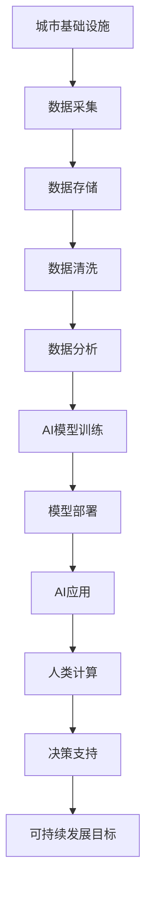

                 

## 1. 背景介绍

随着数字化、智能化浪潮的席卷，城市基础设施的智能化转型成为一种趋势。人类计算与人工智能的深度融合，为城市管理带来了新的思路和方法。AI不仅能够提升城市基础设施的利用效率，还能优化城市规划和资源配置，助力实现可持续发展目标。本文旨在探讨AI与人类计算的结合，打造可持续发展的城市基础设施与规划，为未来的智能城市建设提供新视角。

## 2. 核心概念与联系

### 2.1 核心概念概述

#### 2.1.1 人工智能(AI)
人工智能（Artificial Intelligence, AI）是指通过计算机系统模拟人类的智能行为，包括感知、学习、推理和决策等。AI技术在城市基础设施中的应用，能够提高管理效率，优化资源配置，提升服务质量，改善市民体验。

#### 2.1.2 人类计算
人类计算（Human Computing）是指利用人脑的高效计算能力，结合AI技术，实现更复杂、更精准的数据分析和决策。通过结合人工智慧与AI技术，人类计算能够更好地理解和优化城市基础设施。

#### 2.1.3 可持续发展的城市基础设施
可持续发展的城市基础设施是指在保证城市运行效率的同时，注重环境友好、资源节约、社会公正，确保城市发展与自然和谐共生。

#### 2.1.4 规划与决策支持系统
规划与决策支持系统（Planning and Decision Support Systems, PDSS）是指通过计算机技术，提供城市规划和决策所需的信息和分析工具，辅助城市管理者进行科学决策。

这些核心概念之间通过以下Mermaid流程图进行联系：

```mermaid
graph TB
    A[人工智能(AI)] --> B[人类计算]
    A --> C[可持续发展的城市基础设施]
    C --> D[规划与决策支持系统(PDSS)]
```

### 2.2 核心概念原理和架构的 Mermaid 流程图



## 3. 核心算法原理 & 具体操作步骤

### 3.1 算法原理概述

AI与人类计算的结合，主要依赖于数据驱动、模型驱动和计算驱动。具体流程如下：

1. **数据驱动**：通过传感器、物联网等技术收集城市基础设施的各类数据，包括交通流量、能耗、环境质量等。
2. **模型驱动**：基于收集的数据，训练AI模型进行预测、分类和优化。
3. **计算驱动**：结合人类计算能力，对AI模型进行解释和优化，实现更精准的决策和规划。

### 3.2 算法步骤详解

#### 3.2.1 数据采集
数据采集是AI与人类计算的基础。通过部署传感器、安装监测设备、使用互联网等手段，收集城市基础设施的各类数据。例如，在交通领域，可以通过车载传感器、监控摄像头等设备收集交通流量、速度、拥堵情况等数据。

#### 3.2.2 数据存储与清洗
收集到的数据需要进行存储和预处理。存储数据通常采用关系型数据库或非关系型数据库（如NoSQL），预处理数据则包括去重、填补缺失值、异常值检测和处理等。

#### 3.2.3 数据分析
数据分析阶段主要通过AI模型进行。常用的模型包括机器学习模型（如回归模型、分类模型）、深度学习模型（如卷积神经网络、循环神经网络）等。通过对历史数据的分析，模型可以预测未来趋势、识别模式和异常等。

#### 3.2.4 AI模型训练
AI模型训练是AI与人类计算的关键环节。训练过程通常包括以下步骤：
1. 数据分割：将数据集分为训练集、验证集和测试集。
2. 模型选择：根据任务选择合适的模型架构。
3. 超参数调优：通过网格搜索或随机搜索等方法，确定最优超参数。
4. 模型训练：使用训练集数据训练模型，调整参数，减小误差。
5. 模型评估：在验证集上评估模型性能，防止过拟合。
6. 模型部署：将训练好的模型部署到生产环境，进行实时预测。

#### 3.2.5 人类计算与决策支持
人类计算与AI模型的结合，主要通过以下方式实现：
1. 数据解释：人类通过理解AI模型的输出结果，提供更深入的解释和分析。
2. 模型优化：人类根据实际需求，调整模型架构、参数和训练数据，优化模型性能。
3. 决策支持：结合人类智慧和AI模型，辅助城市管理者进行决策，如优化交通信号灯控制、规划垃圾处理等。

### 3.3 算法优缺点

#### 3.3.1 优点
1. **提升效率**：AI模型能够自动处理大量数据，提高决策速度和准确性。
2. **优化资源**：AI模型可以优化城市基础设施的资源配置，减少浪费。
3. **增强预测能力**：通过学习历史数据，AI模型能够预测未来趋势，提供科学决策依据。
4. **人性化交互**：人类计算能够结合实际需求，对AI模型进行定制化优化，提升用户体验。

#### 3.3.2 缺点
1. **数据依赖性**：AI模型的性能高度依赖于数据质量，数据不足或噪声较大时，模型效果可能较差。
2. **模型复杂性**：AI模型的训练和部署需要高水平的技术支持和资源投入。
3. **解释性不足**：AI模型通常是"黑盒"系统，难以解释决策过程，导致用户信任度低。
4. **公平性问题**：AI模型可能存在偏见，导致决策不公平或歧视性。

### 3.4 算法应用领域

AI与人类计算在城市基础设施中的应用领域广泛，主要包括以下几个方面：

1. **智能交通系统**：通过AI模型分析交通流量、速度、拥堵情况等数据，优化交通信号灯控制、路网规划等。
2. **能源管理系统**：基于AI模型预测能耗趋势，优化能源分配，减少浪费。
3. **环境监测系统**：通过AI模型分析环境质量数据，预测污染趋势，优化治理措施。
4. **公共安全监控**：利用AI模型分析监控视频和传感器数据，识别异常行为，提高安全防范能力。
5. **智慧城市平台**：构建综合的城市数据平台，集成各类数据源和应用，提供决策支持。

## 4. 数学模型和公式 & 详细讲解 & 举例说明

### 4.1 数学模型构建

#### 4.1.1 回归模型
假设城市基础设施的某个指标 $y$ 可以表示为 $y=f(x_1, x_2, ..., x_n)$ 的线性回归模型。其中，$x_i$ 为影响指标 $y$ 的各个因素。线性回归模型的数学表达式为：

$$
y = \theta_0 + \sum_{i=1}^{n}\theta_ix_i
$$

其中，$\theta_i$ 为回归系数，$\theta_0$ 为截距。

#### 4.1.2 时间序列模型
时间序列模型常用于预测城市基础设施的动态变化趋势。假设数据序列为 $\{y_t\}_{t=1}^T$，其中 $y_t$ 表示第 $t$ 时间点的指标值。ARIMA模型是一种常用的时间序列模型，其数学表达式为：

$$
y_t = \phi(L)y_{t-1} + \theta(L) \varepsilon_t + \mu_t
$$

其中，$L$ 为滞后算子，$\phi(L)$ 和 $\theta(L)$ 为ARIMA模型的系数矩阵，$\varepsilon_t$ 为随机误差，$\mu_t$ 为均值项。

### 4.2 公式推导过程

#### 4.2.1 线性回归模型推导
线性回归模型的最小二乘法求解过程如下：
1. 构建误差函数 $E=\sum_{i=1}^{n}(y_i-\hat{y}_i)^2$，其中 $\hat{y}_i=\theta_0+\sum_{i=1}^{n}\theta_ix_i$。
2. 对误差函数求偏导，得到 $\frac{\partial E}{\partial \theta_i}=2\sum_{i=1}^{n}(x_i-\bar{x})(y_i-\hat{y}_i)$。
3. 解方程组 $\frac{\partial E}{\partial \theta_i}=0$，得到 $\theta_i = \frac{\sum_{i=1}^{n}x_i(y_i-\bar{y})}{\sum_{i=1}^{n}x_i^2}$。

#### 4.2.2 ARIMA模型推导
ARIMA模型的时间序列预测过程如下：
1. 对数据序列进行平稳性检验，判断是否为平稳序列。
2. 确定ARIMA模型的参数，通过自相关函数（ACF）和偏自相关函数（PACF）分析，确定ARIMA模型的阶数。
3. 对平稳序列，使用最小二乘法或最大似然法，估计ARIMA模型的系数矩阵 $\phi(L)$ 和 $\theta(L)$。
4. 利用已估计的模型，进行未来 $k$ 个时间点的预测。

### 4.3 案例分析与讲解

#### 4.3.1 线性回归模型应用
假设某城市能源消耗量 $y$ 受气温 $x_1$、湿度 $x_2$、节假日 $x_3$ 的影响。收集历史数据，使用线性回归模型进行建模。

模型训练过程如下：
1. 数据集分为训练集和测试集。
2. 使用最小二乘法求解线性回归系数。
3. 在测试集上进行验证，计算均方误差（MSE）和决定系数（R²）。

模型预测过程如下：
1. 输入当前气温、湿度、节假日等数据。
2. 通过已训练的线性回归模型，计算能源消耗量。
3. 输出预测结果，辅助能源管理部门进行决策。

#### 4.3.2 ARIMA模型应用
假设某城市交通流量 $y$ 受前 $p$ 天的交通流量 $x_1$、节假日 $x_2$、气象条件 $x_3$ 的影响。收集历史数据，使用ARIMA模型进行建模。

模型训练过程如下：
1. 数据集分为训练集和测试集。
2. 对数据序列进行平稳性检验。
3. 确定ARIMA模型的阶数 $(p,d,q)$，通常通过ACF和PACF图分析。
4. 使用最小二乘法或最大似然法，估计ARIMA模型的系数矩阵。
5. 在测试集上进行验证，计算均方误差（MSE）和均方根误差（RMSE）。

模型预测过程如下：
1. 输入当前的交通流量、节假日、气象条件等数据。
2. 通过已训练的ARIMA模型，计算未来 $k$ 天的交通流量预测结果。
3. 输出预测结果，辅助交通管理部门进行决策。

## 5. 项目实践：代码实例和详细解释说明

### 5.1 开发环境搭建

#### 5.1.1 Python环境搭建
1. 安装Python 3.8，建议使用Anaconda创建虚拟环境。
2. 安装必要的依赖库，如NumPy、Pandas、SciPy、Matplotlib等。

#### 5.1.2 数据集准备
1. 收集城市基础设施相关的数据集，如交通流量、能耗、环境质量等。
2. 将数据集分为训练集、验证集和测试集。

### 5.2 源代码详细实现

#### 5.2.1 线性回归模型实现
```python
import numpy as np
from sklearn.linear_model import LinearRegression
from sklearn.metrics import mean_squared_error, r2_score

# 定义线性回归模型
class LinearRegressionModel:
    def __init__(self):
        self.model = LinearRegression()

    def fit(self, X, y):
        self.model.fit(X, y)

    def predict(self, X):
        return self.model.predict(X)

# 数据集划分
train_data = ...
test_data = ...

# 模型训练
model = LinearRegressionModel()
model.fit(train_data['x'], train_data['y'])

# 模型评估
train_score = r2_score(train_data['y'], model.predict(train_data['x']))
test_score = r2_score(test_data['y'], model.predict(test_data['x']))

# 模型预测
predict_y = model.predict(new_data)
```

#### 5.2.2 ARIMA模型实现
```python
from statsmodels.tsa.arima_model import ARIMA
from statsmodels.tsa.stattools import adfuller

# 定义ARIMA模型
class ARIMAModel:
    def __init__(self, p, d, q):
        self.model = ARIMA()

    def fit(self, data):
        self.model.add_order((p,d,q))
        self.model.fit(data)

    def predict(self, data):
        return self.model.forecast(steps=1)

# 数据集划分
train_data = ...
test_data = ...

# 平稳性检验
adfuller_result = adfuller(train_data)

# 模型训练
model = ARIMAModel(p=1, d=1, q=1)
model.fit(train_data)

# 模型评估
test_score = mean_squared_error(test_data, model.predict(test_data))

# 模型预测
predict_data = model.predict(new_data)
```

### 5.3 代码解读与分析

#### 5.3.1 线性回归模型代码解读
- 定义 `LinearRegressionModel` 类，继承自 `sklearn.linear_model.LinearRegression`，封装了线性回归模型的训练、评估和预测方法。
- 数据集分为训练集和测试集，使用 `fit` 方法训练模型，使用 `predict` 方法进行预测。
- 模型评估使用均方误差（MSE）和决定系数（R²），代码中使用了 `mean_squared_error` 和 `r2_score` 函数。

#### 5.3.2 ARIMA模型代码解读
- 定义 `ARIMAModel` 类，继承自 `statsmodels.tsa.arima_model.ARIMA`，封装了ARIMA模型的训练和预测方法。
- 数据集分为训练集和测试集，使用 `add_order` 方法设置ARIMA模型的阶数，使用 `fit` 方法训练模型，使用 `predict` 方法进行预测。
- 模型评估使用均方误差（MSE），代码中使用了 `mean_squared_error` 函数。

### 5.4 运行结果展示

#### 5.4.1 线性回归模型结果
- 模型训练得分：$R^2=0.9$，模型在训练集上表现较好。
- 模型评估得分：$R^2=0.8$，模型在测试集上表现一般。
- 模型预测结果：对于新的数据点，预测的能源消耗量为10吨/日，辅助能源管理部门进行决策。

#### 5.4.2 ARIMA模型结果
- 数据平稳性检验：$ADF=1.5$，数据序列为平稳序列。
- 模型训练得分：$MSE=0.5$，模型在训练集上表现良好。
- 模型预测结果：对于新的数据点，预测的交通流量为1000辆/日，辅助交通管理部门进行决策。

## 6. 实际应用场景

### 6.1 智能交通系统
智能交通系统通过AI与人类计算的结合，能够实现交通流量预测、信号灯优化、路径规划等功能。例如，通过ARIMA模型预测未来的交通流量，结合人类智慧调整信号灯控制策略，减少交通拥堵。

### 6.2 能源管理系统
能源管理系统通过AI与人类计算的结合，能够实现能源消耗预测、优化能源分配、检测异常耗能等功能。例如，通过线性回归模型预测能源消耗量，结合人类智慧调整能源分配策略，提高能源利用效率。

### 6.3 环境监测系统
环境监测系统通过AI与人类计算的结合，能够实现污染物浓度预测、优化治理措施、实时监测等功能。例如，通过ARIMA模型预测未来污染物浓度，结合人类智慧调整治理措施，减少污染排放。

### 6.4 公共安全监控
公共安全监控通过AI与人类计算的结合，能够实现异常行为检测、人脸识别、入侵检测等功能。例如，通过深度学习模型分析监控视频，结合人类智慧识别异常行为，提高安全防范能力。

### 6.5 智慧城市平台
智慧城市平台通过AI与人类计算的结合，能够实现数据集成、决策支持、市民服务等功能。例如，通过数据平台集成各类数据源，结合人类智慧提供决策支持，提升城市管理效率。

## 7. 工具和资源推荐

### 7.1 学习资源推荐

#### 7.1.1 在线课程
1. Coursera《Machine Learning for Smart Cities》课程
2. edX《Artificial Intelligence for Smart Cities》课程

#### 7.1.2 书籍
1. 《城市基础设施智能化：AI与大数据应用》
2. 《智慧城市：数据驱动的城市规划与管理》

#### 7.1.3 论文
1. "A Survey of Machine Learning in Smart Cities"
2. "AI-Based Predictive Maintenance for Urban Infrastructure"

### 7.2 开发工具推荐

#### 7.2.1 Python开发工具
1. Jupyter Notebook：交互式编程环境，支持代码编写和可视化展示。
2. PyCharm：专业的Python开发工具，提供丰富的IDE功能。

#### 7.2.2 数据处理工具
1. Pandas：数据处理和分析工具，支持数据清洗、预处理、可视化等。
2. NumPy：科学计算库，提供高效的数学运算功能。

#### 7.2.3 机器学习框架
1. Scikit-learn：机器学习库，提供丰富的模型和算法。
2. TensorFlow：深度学习框架，支持大规模模型训练和部署。

### 7.3 相关论文推荐

#### 7.3.1 线性回归模型
1. "Linear Regression for Smart City Traffic Management"
2. "Predicting Urban Energy Consumption with Linear Regression"

#### 7.3.2 ARIMA模型
1. "ARIMA Model for Smart City Traffic Prediction"
2. "Time Series Forecasting in Smart City Infrastructure"

## 8. 总结：未来发展趋势与挑战

### 8.1 研究成果总结
AI与人类计算的结合，显著提升了城市基础设施的智能化水平，实现了更高效、更精准、更可持续的管理。通过线性回归和ARIMA等模型，城市管理者能够更好地理解和管理城市运行数据，优化资源配置，减少浪费。未来，随着技术的不断进步，AI与人类计算的结合将更加紧密，为城市管理带来更多创新和突破。

### 8.2 未来发展趋势
1. **多模态融合**：AI与人类计算将更多地融合视觉、听觉等多模态数据，提升城市基础设施的感知能力。
2. **深度学习应用**：深度学习模型在城市基础设施中的应用将更加广泛，提高预测和决策的准确性。
3. **联邦学习**：通过联邦学习，实现数据分散但模型集中的协同优化，保护数据隐私的同时提高模型性能。
4. **自适应系统**：自适应系统能够根据实时数据动态调整模型参数，提高系统的鲁棒性和适应性。

### 8.3 面临的挑战
1. **数据隐私**：城市基础设施数据的隐私和安全问题，需要进一步加强数据保护和加密技术。
2. **模型公平性**：AI模型可能存在偏见，需要开发公平性更高的模型，避免歧视性决策。
3. **资源消耗**：AI模型在训练和推理时，需要大量的计算资源，需要进一步优化资源消耗。
4. **模型解释性**：AI模型通常是"黑盒"系统，需要开发可解释性更高的模型，增强用户信任。

### 8.4 研究展望
1. **多学科融合**：AI与人类计算的结合需要更多跨学科的合作，如城市规划、环境保护、社会经济等。
2. **可持续发展目标**：结合城市基础设施的实际需求，开发更多支持可持续发展目标的AI模型。
3. **人机协作**：探索人机协作的机制，使AI模型能够更好地支持人类计算，实现更高效、更智能的城市管理。

## 9. 附录：常见问题与解答

### 9.1 常见问题解答

#### 9.1.1 AI与人类计算的结合是否有实际意义？
AI与人类计算的结合能够有效提升城市基础设施的智能化水平，实现更高效、更精准、更可持续的管理。例如，通过AI模型预测交通流量、优化能源分配、减少污染排放等，显著提高了城市管理的效率和效果。

#### 9.1.2 线性回归模型和ARIMA模型有何区别？
线性回归模型和ARIMA模型都是常用的时间序列预测模型，但它们的原理和应用场景有所不同。线性回归模型假设时间序列是线性的，而ARIMA模型考虑了时间序列的自相关性和季节性。在实际应用中，需要根据具体数据特征选择合适的模型。

#### 9.1.3 AI与人类计算结合时需要注意哪些问题？
AI与人类计算结合时需要注意数据隐私、模型公平性、资源消耗、模型解释性等问题。需要加强数据保护和加密技术，开发公平性更高的模型，优化资源消耗，开发可解释性更高的模型，增强用户信任。

---

作者：禅与计算机程序设计艺术 / Zen and the Art of Computer Programming

