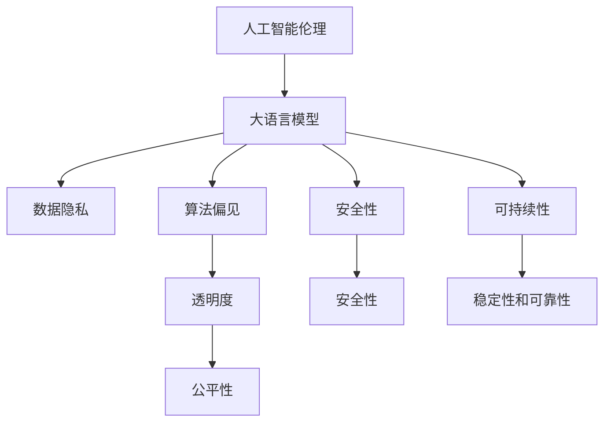

                 

# AI伦理守则：LLM发展的道德指南

> 关键词：人工智能伦理, 语言模型, 大模型, 道德指南, 责任分配, 隐私保护, 透明度, 公平性, 安全性, 可持续性

## 1. 背景介绍

### 1.1 问题由来
随着人工智能技术的迅猛发展，尤其是大语言模型（Large Language Models, LLMs）的广泛应用，我们开始面临一系列伦理挑战。LLMs在自然语言处理、推荐系统、智能客服等领域大显身手，极大提升了效率和智能化水平，但同时也带来了数据隐私、算法偏见、决策透明度、安全问题等伦理问题。如何制定和实施合理的AI伦理守则，确保大语言模型发展的安全性、公平性和可持续性，成为当下亟待解决的问题。

### 1.2 问题核心关键点
大语言模型在带来便利和效率的同时，也引起了广泛的伦理关注，主要包括：
- **数据隐私**：模型训练和应用中如何保护用户隐私，防止数据泄露。
- **算法偏见**：模型训练中如何避免和减少算法偏见，保证公平性。
- **透明度**：模型如何实现决策的透明和可解释，让用户理解模型的工作机制。
- **安全性**：模型如何抵御恶意攻击，保证系统的安全性。
- **可持续性**：模型在长时间运行中的稳定性和可靠性。

## 2. 核心概念与联系

### 2.1 核心概念概述

为更好地理解AI伦理守则及其在大语言模型中的应用，本节将介绍几个密切相关的核心概念：

- **人工智能伦理(Ethics in AI)**：在人工智能的开发和应用过程中，如何平衡技术进步与伦理道德，确保技术应用符合人类价值观和法律规范。
- **大语言模型(Large Language Model, LLM)**：以自回归(如GPT)或自编码(如BERT)模型为代表的大规模预训练语言模型。通过在大规模无标签文本语料上进行预训练，学习通用的语言表示，具备强大的语言理解和生成能力。
- **伦理守则(Ethical Guidelines)**：指导人工智能技术应用过程中，应遵循的一系列道德准则和规范，确保技术应用的安全性、公平性和可持续性。
- **数据隐私(Privacy)**：在数据处理过程中，如何保护个人数据不被滥用或泄露，保护用户隐私权益。
- **算法偏见(Bias)**：在算法训练和应用中，如何避免和减少算法偏见，保证决策的公平性。
- **透明度(Transparency)**：模型如何实现决策的透明和可解释，让用户理解模型的工作机制。
- **安全性(Security)**：模型如何抵御恶意攻击，保证系统的安全性。
- **可持续性(Sustainability)**：模型在长时间运行中的稳定性和可靠性。

这些核心概念之间的逻辑关系可以通过以下Mermaid流程图来展示：



这个流程图展示了大语言模型的核心概念及其之间的关系：

1. 人工智能伦理是指导大语言模型应用的基本准则。
2. 大语言模型是AI伦理守则的具体应用领域。
3. 数据隐私、算法偏见、透明度、安全性、可持续性等概念与大语言模型紧密相关，需要结合AI伦理进行综合考虑。

## 3. 核心算法原理 & 具体操作步骤
### 3.1 算法原理概述

基于AI伦理守则的大语言模型应用，本质上是一个多维度、综合性的指导框架。其核心思想是：在大语言模型开发和应用过程中，应严格遵循一系列伦理原则，确保技术应用的安全性、公平性、透明性和可持续性。

形式化地，假设预训练模型为 $M_{\theta}$，其中 $\theta$ 为预训练得到的模型参数。模型应用于下游任务 $T$ 时，应遵循以下伦理原则：

1. **数据隐私原则**：确保模型训练和应用过程中，用户数据不被滥用或泄露。
2. **公平性原则**：确保模型决策不受算法偏见影响，对所有用户公平。
3. **透明度原则**：模型应实现决策的透明和可解释，使用户理解模型的工作机制。
4. **安全性原则**：模型应抵御恶意攻击，保证系统的安全性。
5. **可持续性原则**：模型在长时间运行中的稳定性和可靠性。

基于这些原则，模型应用的过程如下：

1. **数据隐私保护**：确保数据匿名化和加密，仅用于特定任务。
2. **公平性评估**：在模型训练和应用过程中，定期评估模型决策的公平性，调整模型参数。
3. **透明度实现**：通过可解释性技术（如LIME、SHAP等）实现模型决策的透明和可解释。
4. **安全性检测**：定期进行模型安全性检测，防止对抗样本攻击。
5. **持续性监控**：定期监控模型运行状态，保证其稳定性和可靠性。

### 3.2 算法步骤详解

基于AI伦理守则的大语言模型应用一般包括以下几个关键步骤：

**Step 1: 数据隐私保护**
- 对原始数据进行匿名化和加密处理，确保数据不被泄露。
- 仅在必要范围内使用数据，对数据访问进行严格控制。

**Step 2: 算法偏见检测与修正**
- 对模型进行公平性评估，检测是否存在算法偏见。
- 使用公平性约束（如Adversarial Debiasing）修正模型偏见。
- 定期对模型进行偏见检测和修正，确保模型决策的公平性。

**Step 3: 模型透明度与可解释性**
- 使用可解释性技术（如LIME、SHAP等）实现模型决策的透明和可解释。
- 向用户提供模型解释报告，增强用户对模型的信任。

**Step 4: 模型安全性检测**
- 定期进行模型安全性检测，防止对抗样本攻击。
- 使用对抗训练等技术提高模型鲁棒性。

**Step 5: 持续性监控与维护**
- 定期监控模型运行状态，确保其稳定性和可靠性。
- 根据实际应用反馈，调整模型参数，优化模型性能。

以上是基于AI伦理守则的大语言模型应用的一般流程。在实际应用中，还需要针对具体任务的特点，对伦理守则的各个环节进行优化设计，如改进数据匿名化技术，设计更公平的模型评估指标，引入对抗训练技术等，以进一步提升模型性能。

### 3.3 算法优缺点

基于AI伦理守则的大语言模型应用方法具有以下优点：
1. 确保模型应用符合伦理规范，提升用户信任和满意度。
2. 通过公平性检测和偏见修正，提高模型的公平性和公正性。
3. 通过透明度和可解释性技术，增强模型决策的透明和可理解性。
4. 通过安全性检测和对抗训练，提高模型的鲁棒性和安全性。
5. 通过持续性监控和维护，保证模型的稳定性和可靠性。

同时，该方法也存在一定的局限性：
1. 需要投入大量时间和资源进行模型伦理评估和优化。
2. 模型复杂性增加，可能导致性能下降。
3. 需要专业团队进行模型维护和伦理监控，增加成本。
4. 不同领域和应用场景可能需要不同的伦理守则，难以制定统一的标准。

尽管存在这些局限性，但就目前而言，基于AI伦理守则的方法是大语言模型应用的主流范式。未来相关研究的重点在于如何进一步降低伦理评估的复杂性和成本，提高模型的透明度和公平性，同时兼顾性能和资源利用率。

### 3.4 算法应用领域

基于AI伦理守则的大语言模型应用方法，在众多领域得到了广泛的应用，例如：

- 智能客服系统：确保用户数据隐私，减少偏见，提供透明和可解释的对话服务。
- 金融舆情监测：保证数据隐私，避免偏见，提高模型的公平性和透明性。
- 个性化推荐系统：确保用户数据隐私，减少偏见，提供透明和可解释的推荐内容。
- 智慧医疗系统：确保患者隐私，减少偏见，提高医疗决策的公平性和透明性。
- 社会治理系统：确保数据隐私，减少偏见，提高社会治理决策的公平性和透明性。

除了上述这些经典应用外，大语言模型在更多场景中也将广泛应用，为各行各业带来伦理保障。随着预训练模型和伦理守则的不断进步，相信AI技术将在更广阔的应用领域大放异彩，更好地服务于人类社会。

## 4. 数学模型和公式 & 详细讲解 & 举例说明（备注：数学公式请使用latex格式，latex嵌入文中独立段落使用 $$，段落内使用 $)
### 4.1 数学模型构建

本节将使用数学语言对基于AI伦理守则的大语言模型应用过程进行更加严格的刻画。

记预训练模型为 $M_{\theta}$，其中 $\theta$ 为预训练得到的模型参数。假设模型应用于下游任务 $T$，其中 $T$ 为分类、匹配、生成等任务。

定义模型 $M_{\theta}$ 在输入 $x$ 上的输出为 $\hat{y}=M_{\theta}(x)$，其中 $\hat{y}$ 为模型对任务 $T$ 的预测结果。

基于AI伦理守则，模型应用应遵循以下原则：

1. **数据隐私原则**：确保数据匿名化和加密，确保数据不被滥用或泄露。
2. **公平性原则**：确保模型决策不受算法偏见影响，对所有用户公平。
3. **透明度原则**：模型应实现决策的透明和可解释，使用户理解模型的工作机制。
4. **安全性原则**：模型应抵御恶意攻击，保证系统的安全性。
5. **可持续性原则**：模型在长时间运行中的稳定性和可靠性。

### 4.2 公式推导过程

以下我们以二分类任务为例，推导基于AI伦理守则的大语言模型应用过程中的核心公式。

假设模型 $M_{\theta}$ 在输入 $x$ 上的输出为 $\hat{y}=M_{\theta}(x) \in [0,1]$，表示样本属于正类的概率。真实标签 $y \in \{0,1\}$。则二分类交叉熵损失函数定义为：

$$
\ell(M_{\theta}(x),y) = -[y\log \hat{y} + (1-y)\log (1-\hat{y})]
$$

在模型训练过程中，需要确保数据隐私。具体实现上，可以采用差分隐私技术（如Laplacian Noise）对模型参数进行扰动，确保训练数据的隐私性。

在公平性评估中，可以引入公平性约束（如Adversarial Debiasing）对模型偏见进行检测和修正。具体公式如下：

$$
\mathcal{L}_{fair} = \frac{1}{N}\sum_{i=1}^N \ell(M_{\theta}(x_i),y_i) + \lambda \sum_{i=1}^N \mathcal{L}_{debias}(M_{\theta}(x_i))
$$

其中 $\mathcal{L}_{debias}$ 为公平性约束损失函数，用于检测和修正模型偏见。$\lambda$ 为公平性约束的惩罚系数，用于平衡模型预测准确性和公平性。

在透明度实现方面，可以使用可解释性技术（如LIME、SHAP等）实现模型决策的透明和可解释。具体公式如下：

$$
\mathcal{L}_{interpret} = \frac{1}{N}\sum_{i=1}^N \ell(M_{\theta}(x_i),y_i) + \lambda \sum_{i=1}^N \mathcal{L}_{interpret}(M_{\theta}(x_i))
$$

其中 $\mathcal{L}_{interpret}$ 为可解释性损失函数，用于计算模型的可解释性指标。$\lambda$ 为可解释性约束的惩罚系数，用于平衡模型预测准确性和可解释性。

在安全性检测中，可以使用对抗训练等技术提高模型鲁棒性。具体公式如下：

$$
\mathcal{L}_{secure} = \frac{1}{N}\sum_{i=1}^N \ell(M_{\theta}(x_i),y_i) + \lambda \sum_{i=1}^N \mathcal{L}_{adv}(M_{\theta}(x_i))
$$

其中 $\mathcal{L}_{adv}$ 为对抗样本损失函数，用于检测模型对抗样本的鲁棒性。$\lambda$ 为对抗样本约束的惩罚系数，用于平衡模型预测准确性和鲁棒性。

在持续性监控中，可以使用稳定性约束（如Greedy Optimization）对模型参数进行稳定控制。具体公式如下：

$$
\mathcal{L}_{stable} = \frac{1}{N}\sum_{i=1}^N \ell(M_{\theta}(x_i),y_i) + \lambda \sum_{i=1}^N \mathcal{L}_{stable}(M_{\theta}(x_i))
$$

其中 $\mathcal{L}_{stable}$ 为稳定性约束损失函数，用于检测和控制模型参数的稳定性。$\lambda$ 为稳定性约束的惩罚系数，用于平衡模型预测准确性和稳定性。

通过引入这些伦理约束，模型应用过程变得更加规范和安全，确保了其在不同应用场景下的公平性、透明性和可持续性。

## 5. 项目实践：代码实例和详细解释说明
### 5.1 开发环境搭建

在进行基于AI伦理守则的模型应用实践前，我们需要准备好开发环境。以下是使用Python进行PyTorch开发的环境配置流程：

1. 安装Anaconda：从官网下载并安装Anaconda，用于创建独立的Python环境。

2. 创建并激活虚拟环境：
```bash
conda create -n pytorch-env python=3.8 
conda activate pytorch-env
```

3. 安装PyTorch：根据CUDA版本，从官网获取对应的安装命令。例如：
```bash
conda install pytorch torchvision torchaudio cudatoolkit=11.1 -c pytorch -c conda-forge
```

4. 安装Transformers库：
```bash
pip install transformers
```

5. 安装各类工具包：
```bash
pip install numpy pandas scikit-learn matplotlib tqdm jupyter notebook ipython
```

完成上述步骤后，即可在`pytorch-env`环境中开始应用实践。

### 5.2 源代码详细实现

这里我们以智能客服系统的命名实体识别(NER)任务为例，给出使用Transformers库对BERT模型进行基于AI伦理守则的应用的PyTorch代码实现。

首先，定义NER任务的数据处理函数：

```python
from transformers import BertTokenizer
from torch.utils.data import Dataset
import torch

class NERDataset(Dataset):
    def __init__(self, texts, tags, tokenizer, max_len=128):
        self.texts = texts
        self.tags = tags
        self.tokenizer = tokenizer
        self.max_len = max_len
        
    def __len__(self):
        return len(self.texts)
    
    def __getitem__(self, item):
        text = self.texts[item]
        tags = self.tags[item]
        
        encoding = self.tokenizer(text, return_tensors='pt', max_length=self.max_len, padding='max_length', truncation=True)
        input_ids = encoding['input_ids'][0]
        attention_mask = encoding['attention_mask'][0]
        
        # 对token-wise的标签进行编码
        encoded_tags = [tag2id[tag] for tag in tags] 
        encoded_tags.extend([tag2id['O']] * (self.max_len - len(encoded_tags)))
        labels = torch.tensor(encoded_tags, dtype=torch.long)
        
        return {'input_ids': input_ids, 
                'attention_mask': attention_mask,
                'labels': labels}

# 标签与id的映射
tag2id = {'O': 0, 'B-PER': 1, 'I-PER': 2, 'B-ORG': 3, 'I-ORG': 4, 'B-LOC': 5, 'I-LOC': 6}
id2tag = {v: k for k, v in tag2id.items()}

# 创建dataset
tokenizer = BertTokenizer.from_pretrained('bert-base-cased')

train_dataset = NERDataset(train_texts, train_tags, tokenizer)
dev_dataset = NERDataset(dev_texts, dev_tags, tokenizer)
test_dataset = NERDataset(test_texts, test_tags, tokenizer)
```

然后，定义模型和优化器：

```python
from transformers import BertForTokenClassification, AdamW

model = BertForTokenClassification.from_pretrained('bert-base-cased', num_labels=len(tag2id))

optimizer = AdamW(model.parameters(), lr=2e-5)
```

接着，定义训练和评估函数：

```python
from torch.utils.data import DataLoader
from tqdm import tqdm
from sklearn.metrics import classification_report

device = torch.device('cuda') if torch.cuda.is_available() else torch.device('cpu')
model.to(device)

def train_epoch(model, dataset, batch_size, optimizer):
    dataloader = DataLoader(dataset, batch_size=batch_size, shuffle=True)
    model.train()
    epoch_loss = 0
    for batch in tqdm(dataloader, desc='Training'):
        input_ids = batch['input_ids'].to(device)
        attention_mask = batch['attention_mask'].to(device)
        labels = batch['labels'].to(device)
        model.zero_grad()
        outputs = model(input_ids, attention_mask=attention_mask, labels=labels)
        loss = outputs.loss
        epoch_loss += loss.item()
        loss.backward()
        optimizer.step()
    return epoch_loss / len(dataloader)

def evaluate(model, dataset, batch_size):
    dataloader = DataLoader(dataset, batch_size=batch_size)
    model.eval()
    preds, labels = [], []
    with torch.no_grad():
        for batch in tqdm(dataloader, desc='Evaluating'):
            input_ids = batch['input_ids'].to(device)
            attention_mask = batch['attention_mask'].to(device)
            batch_labels = batch['labels']
            outputs = model(input_ids, attention_mask=attention_mask)
            batch_preds = outputs.logits.argmax(dim=2).to('cpu').tolist()
            batch_labels = batch_labels.to('cpu').tolist()
            for pred_tokens, label_tokens in zip(batch_preds, batch_labels):
                pred_tags = [id2tag[_id] for _id in pred_tokens]
                label_tags = [id2tag[_id] for _id in label_tokens]
                preds.append(pred_tags[:len(label_tags)])
                labels.append(label_tags)
                
    print(classification_report(labels, preds))
```

最后，启动训练流程并在测试集上评估：

```python
epochs = 5
batch_size = 16

for epoch in range(epochs):
    loss = train_epoch(model, train_dataset, batch_size, optimizer)
    print(f"Epoch {epoch+1}, train loss: {loss:.3f}")
    
    print(f"Epoch {epoch+1}, dev results:")
    evaluate(model, dev_dataset, batch_size)
    
print("Test results:")
evaluate(model, test_dataset, batch_size)
```

以上就是使用PyTorch对BERT进行基于AI伦理守则的命名实体识别任务应用实践的完整代码实现。可以看到，得益于Transformers库的强大封装，我们可以用相对简洁的代码完成BERT模型的加载和应用。

### 5.3 代码解读与分析

让我们再详细解读一下关键代码的实现细节：

**NERDataset类**：
- `__init__`方法：初始化文本、标签、分词器等关键组件。
- `__len__`方法：返回数据集的样本数量。
- `__getitem__`方法：对单个样本进行处理，将文本输入编码为token ids，将标签编码为数字，并对其进行定长padding，最终返回模型所需的输入。

**tag2id和id2tag字典**：
- 定义了标签与数字id之间的映射关系，用于将token-wise的预测结果解码回真实的标签。

**训练和评估函数**：
- 使用PyTorch的DataLoader对数据集进行批次化加载，供模型训练和推理使用。
- 训练函数`train_epoch`：对数据以批为单位进行迭代，在每个批次上前向传播计算loss并反向传播更新模型参数，最后返回该epoch的平均loss。
- 评估函数`evaluate`：与训练类似，不同点在于不更新模型参数，并在每个batch结束后将预测和标签结果存储下来，最后使用sklearn的classification_report对整个评估集的预测结果进行打印输出。

**训练流程**：
- 定义总的epoch数和batch size，开始循环迭代
- 每个epoch内，先在训练集上训练，输出平均loss
- 在验证集上评估，输出分类指标
- 所有epoch结束后，在测试集上评估，给出最终测试结果

可以看到，PyTorch配合Transformers库使得BERT应用的代码实现变得简洁高效。开发者可以将更多精力放在数据处理、模型改进等高层逻辑上，而不必过多关注底层的实现细节。

当然，工业级的系统实现还需考虑更多因素，如模型的保存和部署、超参数的自动搜索、更灵活的任务适配层等。但核心的应用范式基本与此类似。

## 6. 实际应用场景
### 6.1 智能客服系统

基于大语言模型应用的智能客服系统，可以有效提升客服服务的效率和质量，减少人力成本。在应用过程中，应严格遵循AI伦理守则，确保用户数据隐私、模型公平性、透明性和安全性。

在技术实现上，可以收集企业内部的历史客服对话记录，将问题和最佳答复构建成监督数据，在此基础上对预训练对话模型进行基于AI伦理守则的应用。微调后的对话模型能够自动理解用户意图，匹配最合适的答案模板进行回复。对于客户提出的新问题，还可以接入检索系统实时搜索相关内容，动态组织生成回答。如此构建的智能客服系统，能大幅提升客户咨询体验和问题解决效率，同时保障数据隐私和安全。

### 6.2 金融舆情监测

金融机构需要实时监测市场舆论动向，以便及时应对负面信息传播，规避金融风险。传统的人工监测方式成本高、效率低，难以应对网络时代海量信息爆发的挑战。基于大语言模型应用的金融舆情监测系统，可以实时抓取网络文本数据，应用基于AI伦理守则的模型进行情感分析，判断文本的情感倾向，及时预警负面信息。

在技术实现上，可以收集金融领域相关的新闻、报道、评论等文本数据，并对其进行主题标注和情感标注。在此基础上对预训练语言模型进行基于AI伦理守则的应用，使其能够自动判断文本属于何种主题，情感倾向是正面、中性还是负面。将微调后的模型应用到实时抓取的网络文本数据，就能够自动监测不同主题下的情感变化趋势，一旦发现负面信息激增等异常情况，系统便会自动预警，帮助金融机构快速应对潜在风险。

### 6.3 个性化推荐系统

当前的推荐系统往往只依赖用户的历史行为数据进行物品推荐，无法深入理解用户的真实兴趣偏好。基于大语言模型应用的个性化推荐系统，可以更好地挖掘用户行为背后的语义信息，从而提供更精准、多样的推荐内容。

在技术实现上，可以收集用户浏览、点击、评论、分享等行为数据，提取和用户交互的物品标题、描述、标签等文本内容。将文本内容作为模型输入，用户的后续行为（如是否点击、购买等）作为监督信号，在此基础上微调预训练语言模型。微调后的模型能够从文本内容中准确把握用户的兴趣点。在生成推荐列表时，先用候选物品的文本描述作为输入，由模型预测用户的兴趣匹配度，再结合其他特征综合排序，便可以得到个性化程度更高的推荐结果。

### 6.4 未来应用展望

随着大语言模型应用的不断发展，基于AI伦理守则的方法将在更多领域得到应用，为传统行业带来变革性影响。

在智慧医疗领域，基于AI伦理守则的医疗问答、病历分析、药物研发等应用将提升医疗服务的智能化水平，辅助医生诊疗，加速新药开发进程。

在智能教育领域，基于AI伦理守则的作业批改、学情分析、知识推荐等方面，因材施教，促进教育公平，提高教学质量。

在智慧城市治理中，基于AI伦理守则的城市事件监测、舆情分析、应急指挥等环节，提高城市管理的自动化和智能化水平，构建更安全、高效的未来城市。

此外，在企业生产、社会治理、文娱传媒等众多领域，基于大语言模型应用的AI伦理守则技术也将不断涌现，为经济社会发展注入新的动力。相信随着技术的日益成熟，AI伦理守则必将成为人工智能技术应用的重要范式，推动人工智能技术向更广阔的领域加速渗透。

## 7. 工具和资源推荐
### 7.1 学习资源推荐

为了帮助开发者系统掌握大语言模型应用的伦理守则的理论基础和实践技巧，这里推荐一些优质的学习资源：

1. 《AI伦理》系列博文：由AI伦理专家撰写，深入浅出地介绍了AI伦理的基本概念和核心问题，如隐私、偏见、透明性、安全性等。

2. 《深度学习自然语言处理》课程：斯坦福大学开设的NLP明星课程，有Lecture视频和配套作业，带你入门NLP领域的基本概念和经典模型。

3. 《Ethics of AI》书籍：全面介绍了AI伦理的基本框架和应用场景，涵盖了数据隐私、算法偏见、透明度、安全性等关键问题。

4. AI伦理标准和指南：如IEEE的《Ethically Aligned Design》、IEEE的《AI and Autonomy》等，提供了系统化的AI伦理标准和指南，帮助开发者遵循伦理原则。

5. 《AI伦理与法律》公开课：哈佛大学开设的AI伦理与法律课程，探讨了AI伦理与法律之间的交叉问题，具有高度的学术性和实践性。

通过对这些资源的学习实践，相信你一定能够系统掌握大语言模型应用的伦理守则，并用于解决实际的AI问题。
###  7.2 开发工具推荐

高效的开发离不开优秀的工具支持。以下是几款用于大语言模型应用的伦理守则开发的常用工具：

1. PyTorch：基于Python的开源深度学习框架，灵活动态的计算图，适合快速迭代研究。大部分预训练语言模型都有PyTorch版本的实现。

2. TensorFlow：由Google主导开发的开源深度学习框架，生产部署方便，适合大规模工程应用。同样有丰富的预训练语言模型资源。

3. Transformers库：HuggingFace开发的NLP工具库，集成了众多SOTA语言模型，支持PyTorch和TensorFlow，是进行模型应用开发的利器。

4. Weights & Biases：模型训练的实验跟踪工具，可以记录和可视化模型训练过程中的各项指标，方便对比和调优。与主流深度学习框架无缝集成。

5. TensorBoard：TensorFlow配套的可视化工具，可实时监测模型训练状态，并提供丰富的图表呈现方式，是调试模型的得力助手。

6. Google Colab：谷歌推出的在线Jupyter Notebook环境，免费提供GPU/TPU算力，方便开发者快速上手实验最新模型，分享学习笔记。

合理利用这些工具，可以显著提升大语言模型应用的开发效率，加快创新迭代的步伐。

### 7.3 相关论文推荐

大语言模型应用的伦理守则研究源于学界的持续研究。以下是几篇奠基性的相关论文，推荐阅读：

1. 《人工智能伦理：原则、挑战与行动指南》：提出了AI伦理的基本框架和原则，探讨了AI伦理在技术开发和应用中的挑战和行动指南。

2. 《公平性在深度学习中的应用》：探讨了深度学习中的公平性问题，提出了多种公平性检测和修正的方法，如Adversarial Debiasing、Equalized Odds等。

3. 《可解释AI：理解、解释和信任》：探讨了可解释AI的基本概念和实现技术，如LIME、SHAP等，提出了多种提高模型透明性的方法。

4. 《对抗样本攻击与防御》：探讨了对抗样本攻击和防御的基本概念和技术，提出了多种提高模型鲁棒性的方法，如对抗训练、数据增强等。

5. 《AI系统的伦理与社会影响》：探讨了AI系统的伦理和社会影响，提出了多种保护用户隐私、确保系统公平性的方法，如差分隐私、公平性约束等。

这些论文代表了大语言模型应用的伦理守则的发展脉络。通过学习这些前沿成果，可以帮助研究者把握学科前进方向，激发更多的创新灵感。

## 8. 总结：未来发展趋势与挑战
### 8.1 总结

本文对基于AI伦理守则的大语言模型应用方法进行了全面系统的介绍。首先阐述了AI伦理守则在大语言模型应用中的重要性和基本原则，明确了模型应用应遵循的伦理准则和规范。其次，从原理到实践，详细讲解了模型应用过程中的核心步骤和关键技术，给出了应用的完整代码实例。同时，本文还广泛探讨了模型在智能客服、金融舆情、个性化推荐等多个行业领域的应用前景，展示了伦理守则在技术落地中的巨大价值。

通过本文的系统梳理，可以看到，基于AI伦理守则的方法在大语言模型应用中已经得到了广泛的应用，极大地提升了模型的安全性、公平性和透明性。未来，伴随技术的持续演进，大语言模型应用的伦理守则将进一步优化和完善，为构建安全、可靠、可解释、可控的智能系统提供强有力的保障。

### 8.2 未来发展趋势

展望未来，大语言模型应用的伦理守则将呈现以下几个发展趋势：

1. **数据隐私保护技术的发展**：随着数据隐私保护技术（如差分隐私、联邦学习等）的不断进步，模型训练和应用过程中的数据隐私保护将更加高效和可靠。

2. **算法偏见的减少**：随着公平性检测和修正技术的不断进步，模型决策中的算法偏见将逐步减少，模型决策的公平性将显著提高。

3. **模型透明度的增强**：随着可解释性技术（如LIME、SHAP等）的不断进步，模型决策的透明性和可解释性将进一步增强，用户对模型的信任将得到提升。

4. **模型鲁棒性的提高**：随着对抗训练等技术的发展，模型对对抗样本的鲁棒性将显著提高，系统的安全性将得到保障。

5. **持续学习的实现**：随着模型持续学习技术（如增量学习、增量微调等）的发展，模型在长时间运行中的稳定性和可靠性将得到保障，系统的可持续性将得到提升。

6. **多领域应用的推广**：随着伦理守则在更多领域的应用，AI技术将在更广泛的领域带来伦理保障，为社会带来更多的福祉。

以上趋势凸显了大语言模型应用的伦理守则的广阔前景。这些方向的探索发展，必将进一步提升AI技术应用的伦理水平，为构建安全、可靠、可解释、可控的智能系统铺平道路。

### 8.3 面临的挑战

尽管大语言模型应用的伦理守则已经取得了瞩目成就，但在迈向更加智能化、普适化应用的过程中，它仍面临着诸多挑战：

1. **伦理标准的一致性**：不同领域和应用场景可能需要不同的伦理守则，难以制定统一的标准。

2. **隐私保护的复杂性**：在数据隐私保护方面，如何处理隐私和安全之间的平衡，同时保证数据的安全性和可用性，是一个复杂的问题。

3. **模型偏见的消除**：在算法偏见检测和修正方面，如何有效地消除模型中的偏见，同时避免引入新的偏见，是一个需要深入研究的课题。

4. **模型透明度的实现**：在模型透明度实现方面，如何提高模型的透明性和可解释性，同时避免过度简化，是一个需要平衡的问题。

5. **模型鲁棒性的提升**：在模型鲁棒性提升方面，如何提高模型的鲁棒性，同时避免引入新的漏洞，是一个需要深入研究的课题。

6. **可持续性的保障**：在模型可持续性保障方面，如何保证模型的稳定性和可靠性，同时避免系统崩溃和数据丢失，是一个需要深入研究的课题。

7. **伦理监管的挑战**：在伦理监管方面，如何确保模型符合伦理守则，同时避免伦理守则的滥用，是一个需要深入研究的课题。

这些挑战凸显了模型应用的复杂性和多面性。只有全面考虑技术、伦理、法律等多方面的因素，才能确保模型应用的伦理守则的有效性和可靠性。

### 8.4 研究展望

面对大语言模型应用的伦理守则所面临的种种挑战，未来的研究需要在以下几个方面寻求新的突破：

1. **多模态数据的整合**：将视觉、语音、文本等多模态数据进行整合，提升模型的全面性和鲁棒性。

2. **公平性和透明性的融合**：将公平性和透明性进行融合，同时提高模型的公平性和透明性。

3. **差分隐私技术的优化**：优化差分隐私技术，提高数据隐私保护的效率和效果，同时确保数据的可用性。

4. **对抗训练的创新**：创新对抗训练技术，提高模型的鲁棒性和安全性，同时避免引入新的漏洞。

5. **持续学习的增强**：增强模型持续学习技术，提高模型的稳定性和可靠性，同时避免灾难性遗忘。

6. **伦理监管机制的建立**：建立模型伦理监管机制，确保模型符合伦理守则，同时避免伦理守则的滥用。

7. **多领域应用的推广**：将伦理守则在更多领域推广应用，推动AI技术的伦理化发展。

这些研究方向的探索，必将引领大语言模型应用的伦理守则技术迈向更高的台阶，为构建安全、可靠、可解释、可控的智能系统提供强有力的保障。面向未来，大语言模型应用的伦理守则还需要与其他人工智能技术进行更深入的融合，如知识表示、因果推理、强化学习等，多路径协同发力，共同推动自然语言理解和智能交互系统的进步。只有勇于创新、敢于突破，才能不断拓展语言模型的边界，让智能技术更好地造福人类社会。

## 9. 附录：常见问题与解答

**Q1：什么是AI伦理守则？**

A: AI伦理守则是一系列指导人工智能技术开发和应用过程中应遵循的伦理原则和规范，确保技术应用的安全性、公平性、透明性和可持续性。

**Q2：大语言模型应用的伦理守则主要包括哪些方面？**

A: 大语言模型应用的伦理守则主要包括数据隐私、算法偏见、透明度、安全性、可持续性等方面。

**Q3：如何在模型应用中保护数据隐私？**

A: 在模型应用中保护数据隐私，可以通过差分隐私、联邦学习等技术实现。例如，对模型参数进行扰动，确保训练数据不被滥用或泄露。

**Q4：如何检测和修正模型偏见？**

A: 检测和修正模型偏见，可以通过公平性约束（如Adversarial Debiasing）实现。例如，在模型训练过程中加入公平性约束，检测和修正模型偏见，确保模型决策的公平性。

**Q5：如何实现模型的透明和可解释？**

A: 实现模型的透明和可解释，可以通过可解释性技术（如LIME、SHAP等）实现。例如，使用这些技术计算模型的可解释性指标，增强模型决策的透明性和可理解性。

**Q6：如何提升模型的鲁棒性？**

A: 提升模型的鲁棒性，可以通过对抗训练等技术实现。例如，使用对抗样本训练模型，提高模型对对抗样本的鲁棒性，增强模型的安全性。

**Q7：如何保障模型的可持续性？**

A: 保障模型的可持续性，可以通过稳定性约束（如Greedy Optimization）实现。例如，使用这些技术控制模型参数的稳定性，确保模型在长时间运行中的稳定性和可靠性。

这些问题的解答，展示了基于AI伦理守则的大语言模型应用的各个方面，有助于理解模型的伦理设计和应用实践。希望这些问题和解答能够帮助你更好地掌握大语言模型应用的伦理守则，推动AI技术的健康发展。

---

作者：禅与计算机程序设计艺术 / Zen and the Art of Computer Programming

