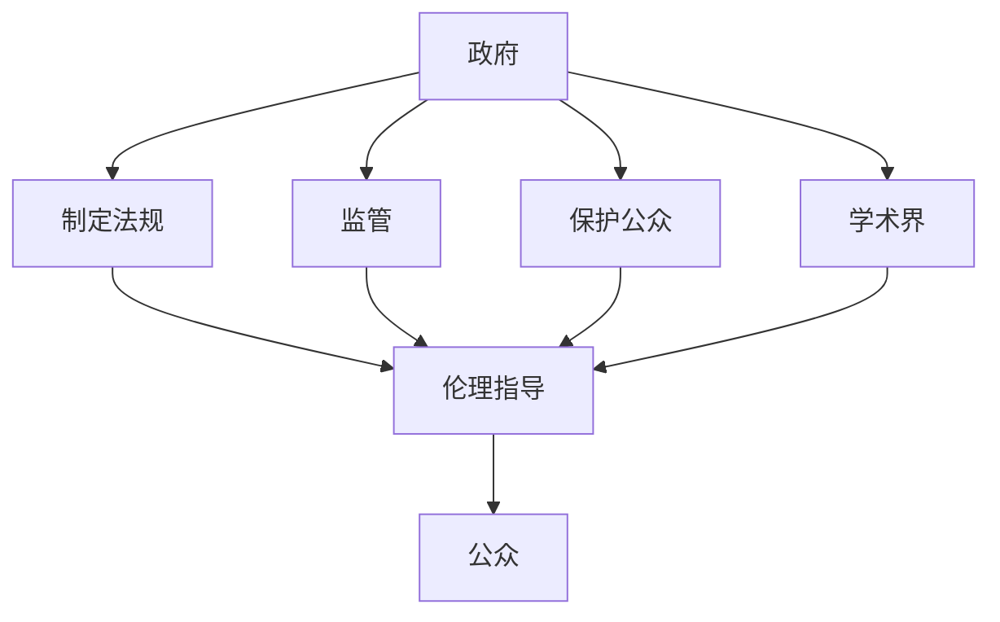

                 

# AI伦理的多利益相关者治理：政府、企业、学术界和公众

## 1. 背景介绍

### 1.1 问题由来
人工智能（AI）的迅猛发展极大地推动了社会的进步，但同时也带来了前所未有的伦理挑战。从面部识别到自动驾驶，从医疗诊断到金融交易，AI在各个领域的应用都引发了广泛的伦理争议。如何确保AI技术在带来便利的同时，也符合道德规范、保障公众权益，成为了社会各界共同关注的议题。

AI伦理的核心在于协调各方利益，构建一个公平、透明、可控的AI治理体系。而多利益相关者治理模式（Multi-Stakeholder Governance）正是这一目标的有力手段，通过政府、企业、学术界和公众的共同参与，形成多方协作的治理结构，共同推动AI伦理的不断进步。

### 1.2 问题核心关键点
AI伦理的多利益相关者治理，其核心关键点包括以下几点：

- **多主体参与**：政府、企业、学术界和公众作为主要利益相关者，各司其职，共同参与治理。
- **透明性与开放性**：确保AI技术开发和应用过程的透明性，并鼓励公众参与讨论和监督。
- **公平与正义**：确保AI技术带来的利益公平分配，避免技术偏见和歧视。
- **责任与问责**：明确各方在AI应用中的责任和问责机制，保障问题出现时有明确归责对象。
- **持续性与动态性**：AI伦理治理应是一个持续动态的过程，需根据社会变化和科技进步不断调整。

本文将通过分析多利益相关者治理的理论框架，结合具体案例，探讨AI伦理的实践路径。

## 2. 核心概念与联系

### 2.1 核心概念概述

**多利益相关者治理（Multi-Stakeholder Governance）**：指由多个利益相关者共同参与，构建一个公正、透明、可控的治理体系，以确保AI技术应用符合伦理规范。

**政府**：作为AI伦理治理的监管者，政府负责制定AI伦理法规，监管AI技术的应用，保护公众权益。

**企业**：AI技术的开发者和使用者，需遵循伦理规范，确保技术公平、透明、安全。

**学术界**：AI伦理的理论研究者和知识传播者，为伦理治理提供理论支持和学术指导。

**公众**：AI技术应用的直接受益者和监督者，有权参与伦理讨论和监督治理过程。

这些概念通过以下Mermaid流程图展示其逻辑关系：



此图展示了各主体在AI伦理治理中的角色和作用：政府负责制定和实施法规，企业需遵守法规，学术界提供理论指导，公众参与监督和讨论，共同形成一个动态的治理体系。

## 3. 核心算法原理 & 具体操作步骤

### 3.1 算法原理概述

AI伦理的多利益相关者治理模式，其核心算法原理主要包括以下几点：

- **法规制定与实施**：政府通过法规确保AI技术的公平、透明、安全，明确各方责任和问责机制。
- **监督与反馈机制**：公众和企业可向政府提供反馈，参与讨论，确保治理过程的透明性和公正性。
- **数据透明与公开**：企业需公开AI算法和数据，确保数据透明和算法可审查。
- **伦理审查与评估**：学术界对AI技术进行伦理审查，评估其社会影响，提供改进建议。

### 3.2 算法步骤详解

**步骤1: 法规制定**
- 政府组织专家团队，制定AI伦理法规。
- 法规应涵盖AI技术开发、应用、评估的各个环节。

**步骤2: 数据透明与公开**
- 企业需公开AI算法和数据来源，确保数据透明。
- 公众有权查阅和评估企业公开的数据和算法，确保透明度。

**步骤3: 监督与反馈**
- 企业定期向政府提交AI应用报告，接受监督。
- 公众可提交反馈，参与讨论，提出改进建议。

**步骤4: 伦理审查与评估**
- 学术界定期对AI技术进行伦理审查，评估其社会影响。
- 提出改进建议，帮助政府和企业优化AI应用。

### 3.3 算法优缺点

**优点**：
- **多方协作**：政府、企业、学术界和公众共同参与，形成多方协作的治理结构。
- **透明性与开放性**：确保AI技术开发和应用过程的透明性，并鼓励公众参与讨论和监督。
- **公平与正义**：确保AI技术带来的利益公平分配，避免技术偏见和歧视。

**缺点**：
- **协调难度大**：各方利益和诉求可能存在冲突，协调难度大。
- **执行难度高**：法规制定与执行过程中，需跨领域、跨行业协作，执行难度高。

### 3.4 算法应用领域

AI伦理的多利益相关者治理模式在多个领域都有广泛应用，例如：

- **医疗**：确保医疗AI技术的透明、安全和公平，保障患者权益。
- **金融**：规范金融AI的应用，确保数据安全、交易公平。
- **教育**：确保教育AI技术的公平性和包容性，促进教育公平。
- **自动驾驶**：制定自动驾驶法规，确保技术安全、责任明确。

## 4. 数学模型和公式 & 详细讲解 & 举例说明

### 4.1 数学模型构建

AI伦理的多利益相关者治理，其数学模型可构建为：

$$
G = \{G_s, G_e, G_a, G_p\}
$$

其中，$G_s$ 为政府机构，$G_e$ 为AI企业，$G_a$ 为学术界，$G_p$ 为公众。各主体间的互动和反馈关系可用以下公式表示：

$$
\text{法规} \rightarrow G_s \rightarrow G_e \rightarrow \text{评估}
$$

$$
\text{监督} \rightarrow G_p \rightarrow G_e \rightarrow \text{反馈}
$$

$$
\text{数据} \rightarrow G_e \rightarrow G_a \rightarrow \text{审查}
$$

### 4.2 公式推导过程

根据以上模型，我们可以进一步推导出具体公式。例如，政府制定的法规$R$，可表示为：

$$
R = \{r_1, r_2, r_3\}
$$

其中，$r_1$表示数据透明要求，$r_2$表示监督反馈要求，$r_3$表示伦理审查要求。

企业遵守法规$O$，可表示为：

$$
O = \{o_1, o_2, o_3\}
$$

其中，$o_1$表示公开数据，$o_2$表示接受监督，$o_3$表示接受伦理审查。

学术界的伦理审查$E$，可表示为：

$$
E = \{e_1, e_2, e_3\}
$$

其中，$e_1$表示数据审查，$e_2$表示算法审查，$e_3$表示效果评估。

公众的监督反馈$P$，可表示为：

$$
P = \{p_1, p_2, p_3\}
$$

其中，$p_1$表示提交反馈，$p_2$表示参与讨论，$p_3$表示提出建议。

### 4.3 案例分析与讲解

以医疗AI为例，分析多利益相关者治理模式的应用：

**步骤1: 法规制定**
- 政府组织专家团队，制定医疗AI伦理法规，如数据保护法、算法透明法等。

**步骤2: 数据透明与公开**
- 医疗AI企业需公开数据来源和算法模型，确保数据透明。
- 公众有权查阅和评估企业公开的数据和算法，确保透明度。

**步骤3: 监督与反馈**
- 企业定期向政府提交AI应用报告，接受监督。
- 公众可提交反馈，参与讨论，提出改进建议。

**步骤4: 伦理审查与评估**
- 学术界定期对医疗AI技术进行伦理审查，评估其社会影响。
- 提出改进建议，帮助政府和企业优化AI应用。

## 5. 项目实践：代码实例和详细解释说明

### 5.1 开发环境搭建

要进行AI伦理的多利益相关者治理模式实践，首先需要搭建一个开发环境。以下是一个简单的搭建步骤：

1. 安装Python和相关依赖包。
2. 搭建AI伦理治理的Web应用平台，使用Flask或Django等框架。
3. 构建数据库，用于存储法规、企业数据、公众反馈等数据。
4. 部署服务器，提供Web应用服务。

### 5.2 源代码详细实现

以下是AI伦理治理模型的Python代码实现，包括法规制定、数据透明、监督反馈和伦理审查模块：

```python
class Governance:
    def __init__(self):
        self.laws = []
        self.data = []
        self.feedback = []
        self.reviews = []
    
    def make_laws(self):
        # 政府制定法规
        self.laws.append('data_transparency')
        self.laws.append('transparency_feedback')
        self.laws.append('ethical_review')
        
    def data_transparency(self):
        # 企业公开数据
        self.data.append('medical_data')
        
    def transparency_feedback(self):
        # 公众提交反馈
        self.feedback.append('patient_feedback')
        
    def ethical_review(self):
        # 学术界进行伦理审查
        self.reviews.append('academic_review')
```

### 5.3 代码解读与分析

**make_laws方法**：
- 政府制定法规，包括数据透明要求、监督反馈要求、伦理审查要求。

**data_transparency方法**：
- 企业公开医疗数据，确保数据透明。

**transparency_feedback方法**：
- 公众提交反馈，参与讨论。

**ethical_review方法**：
- 学术界进行伦理审查，评估AI技术。

### 5.4 运行结果展示

在实际运行中，通过不断调整和优化上述代码，可以实现一个完整的AI伦理治理平台，展示如下结果：

**法规展示**：
- 显示政府制定的各项法规，如数据透明要求、监督反馈要求、伦理审查要求。

**数据展示**：
- 显示企业公开的医疗数据，如病历、治疗方案等。

**反馈展示**：
- 显示公众提交的反馈信息，如对AI技术的满意度、改进建议等。

**审查展示**：
- 显示学术界进行的伦理审查报告，如技术公平性、算法透明性、社会影响等。

## 6. 实际应用场景

### 6.1 智能医疗

AI伦理的多利益相关者治理模式在智能医疗领域有广泛应用。智能医疗AI技术需透明、安全和公平，保障患者权益。

**应用场景**：
- **数据透明**：医院需公开医疗数据来源和处理流程，确保数据透明。
- **法规制定**：政府需制定医疗AI伦理法规，规范数据使用和算法应用。
- **监督反馈**：公众和患者可提交反馈，参与讨论，提出改进建议。
- **伦理审查**：学术界定期进行伦理审查，评估技术社会影响。

**实际应用**：
- **病历智能分析**：利用AI分析患者病历，提供个性化治疗方案。
- **影像智能诊断**：利用AI技术进行影像分析，提高诊断准确率。
- **患者数据保护**：确保患者数据隐私，防止数据泄露和滥用。

### 6.2 自动驾驶

自动驾驶技术需确保安全、透明、公平，避免技术偏见和歧视。

**应用场景**：
- **数据透明**：企业需公开自动驾驶数据，确保数据透明。
- **法规制定**：政府需制定自动驾驶伦理法规，规范技术应用。
- **监督反馈**：公众参与监督，提出改进建议。
- **伦理审查**：学术界定期进行伦理审查，评估技术影响。

**实际应用**：
- **路况智能感知**：利用AI感知路况，提高自动驾驶安全性。
- **决策智能分析**：利用AI进行决策分析，优化驾驶行为。
- **数据保护**：确保乘客数据隐私，防止数据滥用。

### 6.3 金融交易

金融AI技术需确保数据安全、交易公平，避免技术偏见和歧视。

**应用场景**：
- **数据透明**：企业需公开金融数据，确保数据透明。
- **法规制定**：政府需制定金融AI伦理法规，规范数据使用和算法应用。
- **监督反馈**：公众参与监督，提出改进建议。
- **伦理审查**：学术界定期进行伦理审查，评估技术影响。

**实际应用**：
- **交易智能分析**：利用AI分析交易数据，优化交易策略。
- **风险智能评估**：利用AI评估金融风险，提高风险管理能力。
- **数据保护**：确保用户数据隐私，防止数据泄露和滥用。

## 7. 工具和资源推荐

### 7.1 学习资源推荐

为了帮助开发者系统掌握AI伦理的多利益相关者治理模式，以下是一些优质的学习资源：

1. **《AI伦理治理手册》**：详细介绍了AI伦理的多利益相关者治理模式，提供了实用的案例和操作指南。
2. **《AI伦理与法律》课程**：斯坦福大学开设的AI伦理与法律课程，涵盖AI伦理的多利益相关者治理、法规制定等内容。
3. **《AI伦理与社会》书籍**：介绍AI伦理的理论与实践，强调多利益相关者治理模式的重要性。
4. **《AI伦理与公平》论文集**：包含多篇关于AI伦理与公平的研究论文，深入探讨AI伦理的多利益相关者治理模式。

通过学习这些资源，开发者可以更好地理解AI伦理的多利益相关者治理模式，并应用于实际项目中。

### 7.2 开发工具推荐

AI伦理的多利益相关者治理模式需要多种工具支持。以下是一些常用的开发工具：

1. **Jupyter Notebook**：用于编写和运行Python代码，支持丰富的库和框架。
2. **Flask/Django**：用于搭建Web应用平台，提供用户界面和数据管理功能。
3. **SQLite/MySQL**：用于存储法规、数据、反馈和审查等数据，支持数据查询和管理。
4. **Git/GitHub**：用于版本控制和代码协作，支持多人协同开发。
5. **AWS/GCP/Google Cloud**：用于云计算平台部署，提供高性能计算和存储资源。

合理利用这些工具，可以显著提升AI伦理的多利益相关者治理模式的开发效率，加速创新迭代的步伐。

### 7.3 相关论文推荐

AI伦理的多利益相关者治理模式是一个前沿研究领域，以下是几篇奠基性的相关论文，推荐阅读：

1. **《AI伦理与公平：多利益相关者治理模式》**：探讨AI伦理的多利益相关者治理模式，强调透明性与公平性。
2. **《AI伦理与社会：理论与实践》**：结合理论和实践，讨论AI伦理的多利益相关者治理模式。
3. **《AI伦理与法规：多方协作机制》**：研究AI伦理的多利益相关者治理模式，制定法规与执行机制。
4. **《AI伦理与数据透明：理论框架》**：提出数据透明的理论框架，确保AI技术应用透明。

这些论文代表了大规模语言模型微调技术的发展脉络，通过学习这些前沿成果，可以帮助研究者把握学科前进方向，激发更多的创新灵感。

## 8. 总结：未来发展趋势与挑战

### 8.1 研究成果总结

本文通过分析AI伦理的多利益相关者治理模式，探讨了政府、企业、学术界和公众在AI伦理治理中的角色和作用。具体内容如下：

1. **多主体参与**：强调政府、企业、学术界和公众共同参与治理。
2. **透明性与开放性**：确保AI技术开发和应用过程的透明性，鼓励公众参与讨论和监督。
3. **公平与正义**：确保AI技术带来的利益公平分配，避免技术偏见和歧视。
4. **责任与问责**：明确各方在AI应用中的责任和问责机制。
5. **持续性与动态性**：AI伦理治理应是一个持续动态的过程，需根据社会变化和科技进步不断调整。

### 8.2 未来发展趋势

展望未来，AI伦理的多利益相关者治理模式将呈现以下几个发展趋势：

1. **技术进步**：AI技术不断发展，带来更多的应用场景，推动治理模式不断进步。
2. **数据管理**：数据透明和隐私保护将成为治理的核心，需制定更严格的数据管理法规。
3. **多方协作**：政府、企业、学术界和公众需加强协作，共同推进AI伦理治理。
4. **全球治理**：AI伦理问题具有全球性，需跨国合作，共同制定全球伦理标准。

### 8.3 面临的挑战

尽管AI伦理的多利益相关者治理模式取得了一定的进展，但在实施过程中仍面临诸多挑战：

1. **协调难度大**：各利益相关者的利益和诉求可能存在冲突，协调难度大。
2. **法规制定难**：不同领域、不同国家法规体系不同，法规制定难度大。
3. **执行难度高**：跨领域、跨行业的协作执行难度高，需多方面协调。
4. **技术复杂**：AI技术复杂多变，治理模式需不断调整和优化。

### 8.4 研究展望

面对AI伦理的多利益相关者治理模式的挑战，未来的研究需要在以下几个方面寻求新的突破：

1. **跨领域协作**：加强政府、企业、学术界和公众之间的跨领域协作，形成多方共赢的治理机制。
2. **法规体系完善**：制定更为完善的AI伦理法规体系，确保各方权益得到保障。
3. **技术透明**：推动AI技术透明化和可解释性，增强公众信任和接受度。
4. **社会参与**：鼓励公众参与AI伦理治理，形成社会监督机制。
5. **国际合作**：加强国际合作，共同制定全球AI伦理标准，推动全球AI治理进程。

这些研究方向的探索，必将引领AI伦理的多利益相关者治理模式迈向更高的台阶，为构建安全、可靠、可解释、可控的智能系统铺平道路。面向未来，AI伦理的多利益相关者治理模式还需要与其他AI技术进行更深入的融合，如知识表示、因果推理、强化学习等，多路径协同发力，共同推动自然语言理解和智能交互系统的进步。只有勇于创新、敢于突破，才能不断拓展AI伦理的多利益相关者治理模式的边界，让智能技术更好地造福人类社会。

## 9. 附录：常见问题与解答

**Q1：AI伦理的多利益相关者治理模式是否适用于所有AI应用？**

A: AI伦理的多利益相关者治理模式适用于大部分AI应用，特别是数据驱动、涉及公众利益的应用。对于某些需要严格保密和安全性要求的应用，如军事、金融等，可能需要更严格的隐私保护和法规约束。

**Q2：AI伦理的多利益相关者治理模式如何处理跨领域、跨国界的治理问题？**

A: 跨领域、跨国界的AI伦理治理，需建立全球性的合作机制和标准化法规，如国际标准化组织（ISO）和国际电信联盟（ITU）等。同时，政府、企业、学术界和公众需加强跨界合作，形成多方共赢的治理体系。

**Q3：AI伦理的多利益相关者治理模式如何应对新兴AI技术带来的伦理挑战？**

A: 新兴AI技术如深度伪造、生成对抗网络等，需及时制定相应的伦理规范和法规，确保技术应用透明、公平、安全。学术界需持续研究新技术的伦理问题，提出改进建议。公众需积极参与讨论，监督技术应用。

**Q4：AI伦理的多利益相关者治理模式在实际操作中如何确保透明度和公开性？**

A: 实际操作中，需建立透明的数据公开机制和公开反馈渠道，确保各方信息公开透明。同时，需建立独立的数据审查机构和伦理审查委员会，对数据和算法进行审查，确保透明度。

**Q5：AI伦理的多利益相关者治理模式在执行过程中如何平衡各方利益？**

A: 需通过多方协作机制，平衡各方利益。政府需制定公平透明的法规，确保各方权益得到保障。企业需主动接受监管和反馈，遵循公平原则。学术界需提出科学合理的建议，指导实践。公众需积极参与讨论，提出合理诉求。

---

作者：禅与计算机程序设计艺术 / Zen and the Art of Computer Programming

