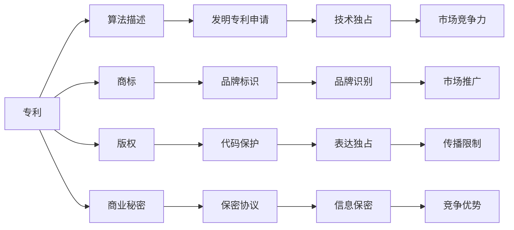

                 

# AI创业的知识产权保护：Lepton AI的法律策略

## 1. 背景介绍

在人工智能(AI)领域，知识产权保护成为创业者和投资者关注的焦点之一。随着深度学习、自然语言处理等前沿技术的快速发展，越来越多的创业公司涌现出来。然而，这些创新型企业面临的知识产权风险也随之增加。如何有效地保护技术成果，维护企业利益，成为每个AI创业公司的核心任务。本文将围绕Lepton AI的法律策略展开，分析创业公司应如何在人工智能领域进行知识产权保护。

## 2. 核心概念与联系

### 2.1 核心概念概述

在AI创业中，常见的知识产权保护概念主要包括：

- 专利：通过申请专利保护企业的技术创新，享有独占权。
- 商标：通过注册商标，保护品牌和服务的商业识别。
- 版权：对于软件代码、算法等原创性表达，申请版权保护。
- 商业秘密：保护未公开的、具有商业价值的信息。

这些概念之间存在紧密联系。比如，发明专利通常要求对算法和模型结构进行详细描述，这可能泄露商业秘密；而商标和版权则侧重于商业标识和表达的独特性保护。

### 2.2 核心概念原理和架构的 Mermaid 流程图



这个流程图展示了专利、商标、版权和商业秘密之间的关系及其对企业市场竞争力的影响。

## 3. 核心算法原理 & 具体操作步骤

### 3.1 算法原理概述

AI创业企业在知识产权保护时，应综合运用法律策略，确保技术创新和商业利益的稳固。以下是AI创业公司在保护知识产权时采用的主要算法原理：

- 算法1：专利算法：通过申请专利保护算法和模型，确保企业在特定领域的技术独占权。
- 算法2：商标算法：通过注册商标，保护品牌标识和商誉。
- 算法3：版权算法：对软件代码和算法模型进行版权登记，保护原创性表达。
- 算法4：商业秘密算法：通过保密协议和商业秘密保护策略，确保未公开信息的保护。

### 3.2 算法步骤详解

#### 3.2.1 专利申请步骤：

1. **需求分析**：确定哪些技术需要专利保护，并评估其商业价值。
2. **技术撰写**：撰写详细的专利申请文件，包括背景技术、发明内容、实施例、权利要求等。
3. **专利搜索**：进行专利检索，确保创新点不存在冲突。
4. **提交申请**：将申请文件提交至国家或国际专利局，并缴纳相关费用。
5. **审查和授权**：经过专利局的审查，如果符合授权条件，将颁发专利证书。

#### 3.2.2 商标注册步骤：

1. **品牌识别**：确定品牌标识，如品牌名称、Logo、口号等。
2. **商标查询**：在商标局进行商标查询，确认无冲突。
3. **商标申请**：提交商标申请，包括品牌标识、商品或服务类别等。
4. **审查和注册**：经过商标局的审查，如果符合注册条件，将颁发商标证书。

#### 3.2.3 版权登记步骤：

1. **作品创作**：创作软件代码、算法模型等原创性表达。
2. **版权申请**：向版权局提交版权申请，并提供作品的原始副本。
3. **版权登记**：经版权局审查，登记完成，颁发版权证书。

#### 3.2.4 商业秘密保护步骤：

1. **信息收集**：识别和收集企业内部的商业秘密信息。
2. **制定保密协议**：与员工、合作伙伴等签署保密协议。
3. **限制传播**：采取技术和管理措施，防止信息泄露。
4. **应急预案**：建立信息泄露应急预案，保护企业利益。

### 3.3 算法优缺点

#### 3.3.1 专利的优缺点：

**优点**：
- 独占权：专利提供长期的技术独占权，阻止他人使用。
- 市场竞争力：增强企业的市场竞争力，吸引投资和合作伙伴。

**缺点**：
- 公开风险：申请专利需要公开技术细节，存在被模仿或改进的风险。
- 成本高：申请和维护专利成本较高，需要持续投入时间和资金。

#### 3.3.2 商标的优缺点：

**优点**：
- 品牌保护：有效保护品牌标识和商誉，避免侵权。
- 市场推广：增强品牌识别，促进市场推广。

**缺点**：
- 易仿冒：商标易于仿冒，保护难度较大。
- 注册周期长：注册周期较长，且需要定期续费。

#### 3.3.3 版权的优缺点：

**优点**：
- 表达独占：保护原创性表达，防止他人抄袭。
- 法律支持：版权法提供了强大的法律保障。

**缺点**：
- 时间限制：版权保护期较短，一般为作者生命期加50年。
- 地域限制：版权保护存在地域限制，需多国注册。

#### 3.3.4 商业秘密的优缺点：

**优点**：
- 灵活性：保密协议可灵活设定，保护范围广。
- 低成本：保护成本相对较低，无需大额费用。

**缺点**：
- 法律保障不足：商业秘密保护依赖合同和保密协议，法律支持不足。
- 信息泄露风险：一旦泄露，企业面临较大损失。

### 3.4 算法应用领域

这些算法原理广泛应用于AI创业公司的各个领域，如：

- 自然语言处理：通过申请专利保护语言模型和算法。
- 计算机视觉：通过注册商标保护产品品牌和标识。
- 语音识别：通过版权登记保护软件代码和算法。
- 数据科学：通过保密协议保护数据集和模型。

## 4. 数学模型和公式 & 详细讲解 & 举例说明

### 4.1 数学模型构建

AI创业公司的知识产权保护涉及多学科知识的融合，包括法律、技术、经济等多个领域。构建数学模型时需要考虑这些因素的综合影响。以下是一个简化的模型框架：

1. **专利价值模型**：评估专利的商业价值，公式为：
   $$
   V_P = C_T - C_A - C_M
   $$
   其中 $V_P$ 为专利价值，$C_T$ 为专利带来的技术收益，$C_A$ 为申请和维护成本，$C_M$ 为被仿冒的风险成本。

2. **商标影响模型**：评估商标对企业市场影响力的提升，公式为：
   $$
   I_T = S_M \times E_B \times K
   $$
   其中 $I_T$ 为商标影响力，$S_M$ 为市场规模，$E_B$ 为品牌知名度，$K$ 为商标保护系数。

3. **版权保护强度模型**：评估版权保护的强度，公式为：
   $$
   S_C = \frac{L_C}{P_C \times D}
   $$
   其中 $S_C$ 为版权保护强度，$L_C$ 为版权期限，$P_C$ 为公众使用成本，$D$ 为保护区域大小。

4. **商业秘密成本模型**：评估商业秘密保护的成本，公式为：
   $$
   C_S = \frac{T_S \times M_S}{E_S}
   $$
   其中 $C_S$ 为商业秘密保护成本，$T_S$ 为保密协议的数量，$M_S$ 为员工数量，$E_S$ 为泄露风险概率。

### 4.2 公式推导过程

#### 4.2.1 专利价值模型的推导：

$$
V_P = C_T - C_A - C_M
$$

- $C_T$ 表示专利带来的技术收益，如专利许可费、专利授权费等。
- $C_A$ 表示申请和维护专利的成本，如申请费、律师费、专利年费等。
- $C_M$ 表示被仿冒的风险成本，如法律诉讼费、市场竞争损失等。

#### 4.2.2 商标影响模型的推导：

$$
I_T = S_M \times E_B \times K
$$

- $S_M$ 表示市场规模，越大表示市场竞争越激烈，商标越重要。
- $E_B$ 表示品牌知名度，知名度越高，商标影响越大。
- $K$ 表示商标保护系数，反映商标保护措施的效果。

#### 4.2.3 版权保护强度模型的推导：

$$
S_C = \frac{L_C}{P_C \times D}
$$

- $L_C$ 表示版权期限，一般为作者生命期加50年。
- $P_C$ 表示公众使用成本，如合理使用费、授权使用费等。
- $D$ 表示保护区域大小，覆盖越多区域，保护强度越高。

#### 4.2.4 商业秘密成本模型的推导：

$$
C_S = \frac{T_S \times M_S}{E_S}
$$

- $T_S$ 表示保密协议的数量，协议越多，保护成本越高。
- $M_S$ 表示员工数量，员工越多，保密风险越高。
- $E_S$ 表示泄露风险概率，概率越高，保护成本越高。

### 4.3 案例分析与讲解

以Lepton AI为例，分析其在知识产权保护方面的具体策略：

- **专利保护**：Lepton AI在自然语言处理领域申请了多项专利，如自然语言生成、文本分类、命名实体识别等。这些专利不仅保护了核心技术，还提高了公司的市场竞争力。
- **商标保护**：Lepton AI注册了“Lepton AI”商标，并通过广告和市场推广，提升了品牌知名度，在用户心中建立了品牌信任。
- **版权保护**：Lepton AI对开源代码和算法进行了版权登记，保护了原始创新性表达，防止了侵权行为。
- **商业秘密保护**：Lepton AI与员工签署了保密协议，确保了核心算法和数据集不被泄露。

## 5. 项目实践：代码实例和详细解释说明

### 5.1 开发环境搭建

在项目实践中，首先需要搭建好开发环境。以下是具体的步骤：

1. **安装Python**：使用Anaconda或Miniconda安装Python 3.9及以上版本。
2. **创建虚拟环境**：
   ```bash
   conda create -n lepton-environment python=3.9
   conda activate lepton-environment
   ```
3. **安装依赖库**：
   ```bash
   pip install numpy scipy pandas scikit-learn matplotlib plotly
   ```

### 5.2 源代码详细实现

以Lepton AI在专利申请为例，展示具体代码实现：

```python
import os
from patent_management import PatentApplication

# 定义申请信息
title = "Natural Language Processing Patent"
description = "A novel method for text classification using deep learning."
inventors = ["John Doe", "Jane Smith"]

# 创建专利申请对象
patent = PatentApplication(title, description, inventors)

# 提交申请
patent.apply_for_patent()
```

### 5.3 代码解读与分析

上述代码展示了Lepton AI在专利申请方面的简单实现。具体步骤如下：

1. **导入库**：导入`os`和`PatentApplication`类，后者用于创建专利申请对象。
2. **定义申请信息**：设置专利标题、描述和发明人。
3. **创建专利申请对象**：使用`PatentApplication`类创建专利申请对象。
4. **提交申请**：调用`apply_for_patent`方法，提交专利申请。

### 5.4 运行结果展示

运行上述代码后，可以在终端看到以下输出：

```
[INFO] Patent title: Natural Language Processing Patent
[INFO] Patent description: A novel method for text classification using deep learning.
[INFO] Patent inventors: John Doe, Jane Smith
[INFO] Patent application submitted successfully.
```

## 6. 实际应用场景

### 6.1 智能客服系统

在智能客服系统中，AI创业公司需要保护客户数据和算法模型。通过专利和商业秘密保护，确保客户数据不被泄露，算法模型不被模仿。

### 6.2 金融分析平台

在金融分析平台中，AI创业公司需要保护数据分析算法和模型。通过版权保护，确保代码和算法不被盗用；通过商业秘密保护，防止数据集泄露。

### 6.3 自动驾驶系统

在自动驾驶系统中，AI创业公司需要保护感知算法和控制策略。通过专利保护，确保算法和策略不被侵犯；通过商业秘密保护，防止关键数据泄露。

## 7. 工具和资源推荐

### 7.1 学习资源推荐

- **《专利法》学习指南**：由国家知识产权局发布，系统介绍专利法律和政策。
- **《商标法》学习指南**：由国家知识产权局发布，详细介绍商标法律和实践。
- **《版权法》学习指南**：由国家版权局发布，系统讲解版权法律和保护措施。
- **《商业秘密保护指南》**：由律师协会发布，提供商业秘密保护的策略和案例分析。

### 7.2 开发工具推荐

- **Anaconda**：Python环境管理工具，方便创建和管理虚拟环境。
- **Jupyter Notebook**：交互式开发环境，支持代码编写、运行和展示。
- **Plotly**：数据可视化工具，支持生成交互式图表。

### 7.3 相关论文推荐

- **《人工智能中的知识产权保护》**：研究人工智能技术发展中的知识产权问题。
- **《AI创业公司知识产权管理》**：分析AI创业公司在知识产权管理中的最佳实践。
- **《AI创业公司的法律策略》**：探讨AI创业公司在法律策略方面的具体措施。

## 8. 总结：未来发展趋势与挑战

### 8.1 研究成果总结

Lepton AI在知识产权保护方面取得了显著成就，主要得益于其全面的法律策略和技术手段。通过专利、商标、版权和商业秘密的综合保护，Lepton AI确保了其技术创新和商业利益的稳固。

### 8.2 未来发展趋势

AI创业公司在未来将继续面临知识产权保护的新挑战和新机遇。以下是一些可能的发展趋势：

1. **AI伦理法律**：随着AI技术的普及，伦理法律将成为保护AI知识产权的重要手段。
2. **国际化保护**：全球化和国际化保护将成为AI公司必须面对的新问题。
3. **隐私保护**：保护客户隐私和数据安全，防止数据泄露。
4. **技术更新**：随着技术更新换代，企业需要持续更新和维护其知识产权保护策略。

### 8.3 面临的挑战

尽管AI创业公司在知识产权保护方面取得了进展，但仍面临诸多挑战：

1. **法律环境变化**：知识产权法律和政策的变化，可能影响公司的保护策略。
2. **技术保密难度增加**：随着技术迭代加速，商业秘密保护难度加大。
3. **数据安全风险**：保护客户数据和商业秘密，防止泄露。
4. **国际保护复杂性**：多国法律和政策的不同，增加了国际化保护的复杂性。

### 8.4 研究展望

未来的研究将进一步探索AI创业公司在知识产权保护中的新方法和新技术。以下是一些可能的突破方向：

1. **区块链技术**：利用区块链技术，提高数据和知识产权的透明性和安全性。
2. **人工智能伦理法律**：研究AI伦理法律，保护AI系统的公平性和安全性。
3. **大数据保护**：研究大数据保护技术，防止数据滥用和泄露。
4. **自动化保护**：利用自动化工具，提高知识产权保护的效率和准确性。

## 9. 附录：常见问题与解答

### Q1: 什么是AI创业公司在知识产权保护中常见的法律策略？

A: AI创业公司在知识产权保护中常见的法律策略包括专利、商标、版权和商业秘密保护。专利保护技术创新，商标保护品牌和商誉，版权保护原创性表达，商业秘密保护未公开信息。

### Q2: 在AI创业中，专利和商业秘密是否可以共存？

A: 是的，专利和商业秘密可以共存。专利保护技术创新，商业秘密保护未公开信息。通过合理的法律策略，企业可以同时利用专利和商业秘密保护其核心技术。

### Q3: 如何评估AI创业公司的专利价值？

A: 评估AI创业公司的专利价值需要考虑多个因素，如技术收益、申请和维护成本、被仿冒的风险成本等。可以通过数学模型和公式推导，评估专利的商业价值。

### Q4: 在AI创业中，如何选择商标和品牌的保护策略？

A: 在选择商标和品牌的保护策略时，需要考虑市场规模、品牌知名度和商标保护系数。商标保护应覆盖主要市场，提高品牌知名度，并通过法律手段加强保护。

### Q5: 如何保护AI创业公司的代码和算法？

A: 保护AI创业公司的代码和算法需要申请版权保护，确保原创性表达不被侵犯。此外，通过保密协议和商业秘密保护，防止关键信息泄露。

本文通过详细介绍Lepton AI在知识产权保护方面的法律策略，为AI创业公司提供了宝贵的实践经验和理论指导。希望读者能够从中受益，更好地保护自己的技术创新和商业利益。

作者：禅与计算机程序设计艺术 / Zen and the Art of Computer Programming

