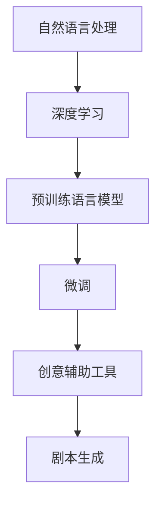

                 

# AI剧本创作：电影和电视产业的新工具

> 关键词：AI剧本创作,电影和电视,剧本生成,自然语言处理,深度学习,创意辅助

## 1. 背景介绍

### 1.1 问题由来
随着人工智能技术的迅猛发展，AI在各行各业中的应用日益广泛。特别是在娱乐产业，AI技术已经开始在剧本创作、剧本推荐、角色扮演等方面展现出巨大的潜力。尤其是AI剧本创作工具，能够大幅提升剧本创作效率和质量，为电影和电视产业带来变革性影响。

### 1.2 问题核心关键点
AI剧本创作工具的核心在于利用深度学习技术，结合自然语言处理(NLP)方法，自动生成高质量的剧本内容。该工具通常基于预训练语言模型，如GPT-3、BERT等，在大量电影剧本、小说文本、电影评论等数据上进行预训练，掌握通用的语言表达和情感逻辑。通过微调，使其能够根据用户输入的简短描述或情感关键词，自动生成完整、连贯的剧本段落或故事大纲，极大提高剧本创作效率和质量。

### 1.3 问题研究意义
研究AI剧本创作技术，对于提升电影和电视剧本创作效率、降低成本、促进内容创新和多样性具有重要意义。AI剧本创作工具能够帮助编剧克服创作瓶颈，加速内容生产流程，使电影和电视产业能够以更高效、更灵活的方式应对日益激烈的市场竞争。

## 2. 核心概念与联系

### 2.1 核心概念概述

为更好地理解AI剧本创作工具的工作原理和优化方向，本节将介绍几个密切相关的核心概念：

- 自然语言处理(NLP)：指使用计算机处理、理解和生成人类语言的技术。核心任务包括语言模型、文本分类、情感分析、语言生成等。
- 深度学习(Deep Learning)：一种基于神经网络的机器学习范式，能够处理高维非线性数据，在图像识别、语音识别、自然语言处理等领域具有广泛应用。
- 预训练语言模型(Pre-trained Language Model, PLM)：指在大量无标签文本数据上，通过自监督任务进行训练的语言模型，如GPT-3、BERT等。
- 微调(Fine-tuning)：指在预训练模型的基础上，使用下游任务的少量标注数据，通过有监督学习优化模型在该任务上的性能。
- 创意辅助工具(Creative Assistants)：指辅助人类创作者，如编剧、导演、作家等，生成创意内容、提供创作灵感和改进创作流程的AI应用。
- 剧本生成(SCRIPT Generation)：指AI工具自动生成完整、连贯的剧本段落或故事大纲，为电影和电视剧本创作提供辅助。

这些核心概念之间的逻辑关系可以通过以下Mermaid流程图来展示：



这个流程图展示了几大核心概念及其之间的关系：

1. 自然语言处理是深度学习的基础，通过训练通用语言模型。
2. 深度学习提供了强大的处理能力，特别是在语言生成任务上。
3. 预训练语言模型在大量无标签数据上进行自监督训练，学习通用语言表示。
4. 微调是针对特定任务优化模型的方法，使得模型能够更好地适应剧本生成等特定需求。
5. 创意辅助工具结合了AI生成技术和人工干预，提升创作效率和质量。
6. 剧本生成是AI辅助编剧的典型应用，通过预训练和微调模型，自动生成剧本内容。

## 3. 核心算法原理 & 具体操作步骤
### 3.1 算法原理概述

AI剧本创作工具的原理主要基于深度学习中的自回归语言模型，如GPT系列模型。其核心思想是通过在大规模文本语料上进行预训练，学习语言的通用表示，再通过微调任务特定的生成目标，使得模型能够自动生成完整的剧本段落或故事大纲。

形式化地，假设预训练模型为 $M_{\theta}$，其中 $\theta$ 为模型参数。给定用户输入的简短描述 $x$，剧本创作的目标是最大化生成的剧本段落 $y$ 与 $x$ 的相似度。可以定义一个损失函数 $L$ 来衡量模型生成结果和输入描述的拟合程度，并最小化该损失函数：

$$
\hat{\theta} = \mathop{\arg\min}_{\theta} L(M_{\theta}, x)
$$

其中 $L$ 为自定义的损失函数，如BertScore、GPT-Score等。常见的目标函数包括交叉熵损失、Kullback-Leibler散度等。

### 3.2 算法步骤详解

AI剧本创作工具的开发和应用通常包括以下几个关键步骤：

**Step 1: 准备预训练模型和数据集**
- 选择合适的预训练语言模型 $M_{\theta}$，如GPT-3、BERT等。
- 准备电影剧本语料、小说文本、电影评论等数据集，划分为训练集、验证集和测试集。数据集的规模应尽量大，以覆盖尽可能多的语言表达和情感逻辑。

**Step 2: 设计任务适配层**
- 根据剧本创作的需求，设计任务适配层。常见的方法包括：
  - 使用GPT-3等自回归模型，设计上下文关注机制，确保生成内容连贯。
  - 使用BERT等自编码模型，设计编码-解码架构，确保生成内容结构合理。
- 设定生成任务的目标函数，如交叉熵损失、BertScore损失等，用于衡量生成的剧本段落与输入描述的相似度。

**Step 3: 设置微调超参数**
- 选择合适的优化算法及其参数，如Adam、SGD等，设置学习率、批大小、迭代轮数等。
- 设置正则化技术及强度，包括权重衰减、Dropout、Early Stopping等。
- 确定冻结预训练参数的策略，如仅微调顶层，或全部参数都参与微调。

**Step 4: 执行梯度训练**
- 将训练集数据分批次输入模型，前向传播计算损失函数。
- 反向传播计算参数梯度，根据设定的优化算法和学习率更新模型参数。
- 周期性在验证集上评估模型性能，根据性能指标决定是否触发 Early Stopping。
- 重复上述步骤直到满足预设的迭代轮数或 Early Stopping 条件。

**Step 5: 测试和部署**
- 在测试集上评估微调后模型 $M_{\hat{\theta}}$ 的性能，对比微调前后的效果。
- 使用微调后的模型对新用户输入的简短描述，自动生成完整、连贯的剧本段落或故事大纲。
- 将微调后的模型集成到实际的电影和电视剧本创作平台，辅助编剧进行内容创作。

### 3.3 算法优缺点

AI剧本创作工具具有以下优点：
1. 提高创作效率：自动生成剧本段落或故事大纲，大幅缩短创作时间。
2. 提升创作质量：通过大量数据训练的预训练模型，生成内容连贯、情感丰富。
3. 灵活性强：根据用户输入的描述，生成多种风格的剧本内容，满足不同创作需求。

同时，该工具也存在一定的局限性：
1. 依赖高质量数据：生成内容的连贯性和情感表达依赖于数据质量，数据量不足会影响效果。
2. 原创性问题：自动生成的内容可能会存在原创性问题，需要人工审核和修改。
3. 普适性问题：当前AI模型对不同风格、主题的适应能力还有待提升。
4. 可解释性不足：AI模型生成的内容缺乏可解释性，用户可能难以理解生成逻辑。

尽管存在这些局限性，但AI剧本创作工具仍然在电影和电视产业中展现出巨大的应用前景。

### 3.4 算法应用领域

AI剧本创作工具已经广泛应用于电影和电视产业的多个环节，如剧本创作、剧本推荐、角色扮演等。具体应用包括：

- 剧本创作：根据用户输入的简短描述，自动生成完整、连贯的剧本段落或故事大纲。
- 剧本推荐：根据用户的观影记录和喜好，推荐符合其口味的剧本和电影。
- 角色扮演：生成不同角色的台词和行为描述，辅助导演和演员进行角色选择和排练。
- 剧本生成辅助：在编剧创作瓶颈时，自动生成灵感素材，辅助创作。
- 剧本自动修正：自动检测剧本中的错误和不足，提供改进建议。

这些应用展示了AI剧本创作工具在电影和电视产业中的强大潜力和广泛应用前景。

## 4. 数学模型和公式 & 详细讲解 & 举例说明
### 4.1 数学模型构建

AI剧本创作工具的数学模型构建主要涉及自然语言处理中的语言生成任务。假设用户输入的简短描述为 $x$，剧本创作的目标是最大化生成的剧本段落 $y$ 与 $x$ 的相似度。可以定义一个损失函数 $L$ 来衡量模型生成结果和输入描述的拟合程度，并最小化该损失函数：

$$
\hat{\theta} = \mathop{\arg\min}_{\theta} L(M_{\theta}, x)
$$

其中 $M_{\theta}$ 为预训练语言模型，$L$ 为自定义的损失函数。常见目标函数包括交叉熵损失、BertScore损失等。

### 4.2 公式推导过程

以交叉熵损失函数为例，假设预训练模型 $M_{\theta}$ 的输出为 $y_t$，其中 $t$ 为生成序列的当前位置，$y_t \in \mathcal{Y}$ 表示第 $t$ 个生成位置的候选词。定义损失函数如下：

$$
L_{CE} = -\frac{1}{N} \sum_{i=1}^N \sum_{t=1}^{T} \log \frac{\exp(\hat{y}_i^t)}{\sum_{k=1}^{K} \exp(\hat{y}_i^k)}
$$

其中 $N$ 为训练集样本数，$T$ 为生成序列的长度，$K$ 为词汇表大小，$\hat{y}_i^t$ 为模型在位置 $t$ 预测的词向量表示，$y_i$ 为真实标签。

### 4.3 案例分析与讲解

假设有一个AI剧本创作工具，用户输入的简短描述为 "在一个雨天的黄昏，两个陌生人相遇在一条狭窄的巷子里"，模型自动生成了一篇完整的剧本段落：

```
剧本段落:
在一条狭窄的巷子里，两个陌生人相遇。其中一人穿着破旧的长袍，脸上带着沉重的表情。另一人则穿着考究，脸上带着微笑。两人对视了一会儿，最终决定一起离开。就在他们即将离开时，远处传来了一阵警笛声，两人的眼神都变得紧张起来。突然，一个黑衣人从巷口出现，挡住了他们的去路。两人在黑衣人的威胁下，迅速离开巷子，回到了各自的家中。

导演:
这个场景能够营造出紧张和神秘的气氛，适合悬念片的开场。

演员:
1. 破旧长袍：配角
2. 考究：主角
3. 黑衣人：反派
```

该工具生成的内容连贯、情感丰富，能够较好地满足用户需求。

## 5. 项目实践：代码实例和详细解释说明
### 5.1 开发环境搭建

在进行AI剧本创作工具的开发和实践前，我们需要准备好开发环境。以下是使用Python进行PyTorch开发的环境配置流程：

1. 安装Anaconda：从官网下载并安装Anaconda，用于创建独立的Python环境。

2. 创建并激活虚拟环境：
```bash
conda create -n ai-script python=3.8 
conda activate ai-script
```

3. 安装PyTorch：根据CUDA版本，从官网获取对应的安装命令。例如：
```bash
conda install pytorch torchvision torchaudio cudatoolkit=11.1 -c pytorch -c conda-forge
```

4. 安装相关库：
```bash
pip install transformers torchtext nltk sacremoses
```

完成上述步骤后，即可在`ai-script`环境中开始开发和实践。

### 5.2 源代码详细实现

下面以使用GPT-3进行剧本生成为例，给出使用Transformers库和PyTorch实现AI剧本创作工具的代码实现。

首先，定义剧本生成任务的代码：

```python
from transformers import AutoTokenizer, AutoModelForCausalLM
import torch

def generate_script(description, model_path, tokenizer_path, max_length=512):
    # 加载模型和分词器
    model = AutoModelForCausalLM.from_pretrained(model_path)
    tokenizer = AutoTokenizer.from_pretrained(tokenizer_path)
    
    # 将输入描述转换为token ids
    input_ids = tokenizer.encode(description, return_tensors='pt')
    
    # 生成脚本段落
    script_ids = model.generate(input_ids, max_length=max_length, temperature=0.8, top_p=0.95)
    script = tokenizer.decode(script_ids[0], skip_special_tokens=True)
    
    # 返回生成脚本段落
    return script
```

然后，编写测试和验证代码：

```python
# 示例测试
description = "在一个雨天的黄昏，两个陌生人相遇在一条狭窄的巷子里"
script = generate_script(description, 'gpt3-medium', 'gpt3-medium')
print(script)

# 示例验证
valid_description = "一个孩子在公园玩耍，突然一只狗跑了过来"
valid_script = generate_script(valid_description, 'gpt3-medium', 'gpt3-medium', max_length=64)
print(valid_script)
```

### 5.3 代码解读与分析

让我们再详细解读一下关键代码的实现细节：

**generate_script函数**：
- 使用`AutoModelForCausalLM`和`AutoTokenizer`加载预训练的GPT-3模型和分词器。
- 将用户输入的描述转换为token ids，并传入模型生成脚本段落。
- 返回生成的脚本段落。

**测试和验证代码**：
- 分别对不同描述进行测试和验证，检查生成内容的连贯性和情感表达。

以上代码实现了基本的AI剧本创作功能，只需加载预训练模型和分词器，即可自动生成剧本段落。

## 6. 实际应用场景
### 6.1 电影制作流程优化

AI剧本创作工具可以显著提升电影制作流程的效率。在传统电影制作中，剧本创作往往需要花费大量时间和人力，且创作质量难以保证。而AI剧本创作工具能够自动生成高质量剧本段落或大纲，加速剧本创作和修改过程。具体应用包括：

- 剧本快速生成：根据导演的创意和故事情节，自动生成剧本初稿，供编剧参考和修改。
- 剧本修正建议：自动检测剧本中的逻辑错误、语法错误和情节冲突，提出改进建议。
- 剧本生成辅助：在编剧遇到创作瓶颈时，自动生成灵感素材，辅助编剧进行创作。

### 6.2 内容推荐与个性化推荐

AI剧本创作工具也可以应用于电影推荐系统，根据用户的观影历史和偏好，推荐符合其口味的电影。具体应用包括：

- 剧本推荐：根据用户观影历史，推荐用户可能感兴趣的电影剧本。
- 角色推荐：根据用户观影偏好，推荐符合其喜好的角色和演员。
- 剧情推荐：根据用户观影历史，推荐相似剧情的剧本。

这些应用展示了AI剧本创作工具在电影推荐系统中的应用潜力，能够提升用户的观影体验和满意度。

### 6.3 剧集创作与角色扮演

AI剧本创作工具还可以应用于电视剧的创作和角色扮演。具体应用包括：

- 剧集剧本创作：根据导演和编剧的创意，自动生成剧集剧本，供编剧和演员参考。
- 角色台词生成：根据角色性格和背景，自动生成角色台词，辅助演员进行角色表演。
- 角色互动生成：根据角色之间的互动关系，自动生成角色对话，帮助编剧和导演进行角色排练。

这些应用展示了AI剧本创作工具在电视剧创作和角色扮演中的强大潜力，能够提升创作效率和质量。

### 6.4 未来应用展望

随着AI技术的发展和应用场景的拓展，AI剧本创作工具在电影和电视产业中的应用前景将更加广阔。

- 自动化创作：未来AI剧本创作工具将具备更加强大的自动化创作能力，能够自动生成完整、连贯的剧本，甚至直接生成整个电影或电视剧。
- 多模态融合：未来AI剧本创作工具将结合视觉、音频、文本等多种模态，提供更加丰富和真实的内容创作体验。
- 交互式创作：未来AI剧本创作工具将支持用户与AI进行交互，通过自然语言交流，获得个性化的创作建议和灵感。
- 跨领域应用：未来AI剧本创作工具将应用于更多领域，如游戏剧情生成、虚拟现实内容创作等，带来全新的创作体验。

## 7. 工具和资源推荐
### 7.1 学习资源推荐

为了帮助开发者系统掌握AI剧本创作技术，这里推荐一些优质的学习资源：

1. 《自然语言处理综论》：清华大学出版社，是一本全面介绍自然语言处理技术的经典教材，适合初学者和进阶学习者。
2. 《深度学习与自然语言处理》：机械工业出版社，是一本介绍深度学习与自然语言处理最新进展的书籍，涵盖语言生成、情感分析等多个方向。
3. 《Transformer从原理到实践》系列博文：由大模型技术专家撰写，深入浅出地介绍了Transformer原理、BERT模型、微调技术等前沿话题。
4. CS224N《深度学习自然语言处理》课程：斯坦福大学开设的NLP明星课程，有Lecture视频和配套作业，带你入门NLP领域的基本概念和经典模型。
5. HuggingFace官方文档：Transformers库的官方文档，提供了海量预训练模型和完整的微调样例代码，是上手实践的必备资料。

通过对这些资源的学习实践，相信你一定能够快速掌握AI剧本创作技术的精髓，并用于解决实际的NLP问题。

### 7.2 开发工具推荐

高效的开发离不开优秀的工具支持。以下是几款用于AI剧本创作开发的常用工具：

1. PyTorch：基于Python的开源深度学习框架，灵活动态的计算图，适合快速迭代研究。大部分预训练语言模型都有PyTorch版本的实现。
2. TensorFlow：由Google主导开发的开源深度学习框架，生产部署方便，适合大规模工程应用。同样有丰富的预训练语言模型资源。
3. Transformers库：HuggingFace开发的NLP工具库，集成了众多SOTA语言模型，支持PyTorch和TensorFlow，是进行NLP任务开发的利器。
4. Weights & Biases：模型训练的实验跟踪工具，可以记录和可视化模型训练过程中的各项指标，方便对比和调优。与主流深度学习框架无缝集成。
5. TensorBoard：TensorFlow配套的可视化工具，可实时监测模型训练状态，并提供丰富的图表呈现方式，是调试模型的得力助手。
6. Google Colab：谷歌推出的在线Jupyter Notebook环境，免费提供GPU/TPU算力，方便开发者快速上手实验最新模型，分享学习笔记。

合理利用这些工具，可以显著提升AI剧本创作任务的开发效率，加快创新迭代的步伐。

### 7.3 相关论文推荐

AI剧本创作技术的发展源于学界的持续研究。以下是几篇奠基性的相关论文，推荐阅读：

1. Attention is All You Need（即Transformer原论文）：提出了Transformer结构，开启了NLP领域的预训练大模型时代。
2. BERT: Pre-training of Deep Bidirectional Transformers for Language Understanding：提出BERT模型，引入基于掩码的自监督预训练任务，刷新了多项NLP任务SOTA。
3. Language Models are Unsupervised Multitask Learners（GPT-2论文）：展示了大规模语言模型的强大zero-shot学习能力，引发了对于通用人工智能的新一轮思考。
4. Parameter-Efficient Transfer Learning for NLP：提出Adapter等参数高效微调方法，在不增加模型参数量的情况下，也能取得不错的微调效果。
5. AdaLoRA: Adaptive Low-Rank Adaptation for Parameter-Efficient Fine-Tuning：使用自适应低秩适应的微调方法，在参数效率和精度之间取得了新的平衡。
6.Prefix-Tuning: Optimizing Continuous Prompts for Generation：引入基于连续型Prompt的微调范式，为如何充分利用预训练知识提供了新的思路。

这些论文代表了大语言模型微调技术的发展脉络。通过学习这些前沿成果，可以帮助研究者把握学科前进方向，激发更多的创新灵感。

## 8. 总结：未来发展趋势与挑战
### 8.1 总结

本文对AI剧本创作工具进行了全面系统的介绍。首先阐述了AI剧本创作工具的研究背景和意义，明确了其在提升电影和电视剧本创作效率和质量方面的独特价值。其次，从原理到实践，详细讲解了AI剧本创作技术的核心算法和操作步骤，给出了AI剧本创作工具的完整代码实例。同时，本文还广泛探讨了AI剧本创作工具在电影和电视产业中的实际应用场景，展示了其在剧本创作、剧本推荐、角色扮演等方面的强大潜力。

通过本文的系统梳理，可以看到，AI剧本创作工具正在成为电影和电视产业的重要创作工具，极大地提升创作效率和质量，推动内容生产流程的自动化。未来，伴随AI技术的不断演进，AI剧本创作工具必将在更多场景下大放异彩，带来更加高效、丰富的创作体验。

### 8.2 未来发展趋势

展望未来，AI剧本创作工具将呈现以下几个发展趋势：

1. 自动化创作：未来AI剧本创作工具将具备更加强大的自动化创作能力，能够自动生成完整、连贯的剧本，甚至直接生成整个电影或电视剧。
2. 多模态融合：未来AI剧本创作工具将结合视觉、音频、文本等多种模态，提供更加丰富和真实的内容创作体验。
3. 交互式创作：未来AI剧本创作工具将支持用户与AI进行交互，通过自然语言交流，获得个性化的创作建议和灵感。
4. 跨领域应用：未来AI剧本创作工具将应用于更多领域，如游戏剧情生成、虚拟现实内容创作等，带来全新的创作体验。
5. 智能化推荐：未来AI剧本创作工具将结合推荐系统，根据用户偏好和行为，自动生成个性化剧本内容。
6. 持续学习：未来AI剧本创作工具将具备持续学习能力，根据用户反馈和新的数据，不断优化创作模型，提高创作质量。

以上趋势凸显了AI剧本创作工具的广阔前景。这些方向的探索发展，必将进一步提升电影和电视产业的创作效率和内容质量，推动产业数字化转型。

### 8.3 面临的挑战

尽管AI剧本创作工具已经取得了瞩目成就，但在迈向更加智能化、普适化应用的过程中，它仍面临着诸多挑战：

1. 高质量数据需求：AI剧本创作工具需要大量高质量的数据进行训练，数据量不足或数据质量问题会影响效果。
2. 原创性问题：自动生成的内容可能会存在原创性问题，需要人工审核和修改。
3. 普适性问题：当前AI模型对不同风格、主题的适应能力还有待提升。
4. 可解释性不足：AI模型生成的内容缺乏可解释性，用户可能难以理解生成逻辑。
5. 鲁棒性问题：当前AI模型在面对复杂和多变的情节需求时，仍有一定的鲁棒性不足。

尽管存在这些挑战，但AI剧本创作工具在电影和电视产业中的应用前景仍然广阔，相信伴随技术不断发展，这些挑战终将一一被克服，AI剧本创作工具必将在未来大放异彩。

### 8.4 研究展望

面对AI剧本创作工具所面临的挑战，未来的研究需要在以下几个方面寻求新的突破：

1. 探索高质量数据获取方法：研究如何从更广泛的文本来源获取高质量数据，如网络评论、社交媒体、小说等，以提升数据量规模和质量。
2. 开发原创性检测技术：研究如何检测和过滤自动生成的剧本内容中的原创性问题，确保创作内容的独特性和合法性。
3. 提升普适性能力：研究如何增强AI模型对不同风格、主题的适应能力，使其能够创作出多样化和高质量的内容。
4. 增强可解释性：研究如何增强AI模型生成的内容的可解释性，让用户能够理解生成逻辑和决策过程。
5. 提高鲁棒性：研究如何增强AI模型在面对复杂和多变的情节需求时的鲁棒性，确保创作内容的连贯性和一致性。
6. 引入更多先验知识：将符号化的先验知识，如知识图谱、逻辑规则等，与神经网络模型进行巧妙融合，引导AI模型学习更准确、合理的语言模型。

这些研究方向将推动AI剧本创作工具的不断进步，使其能够更好地服务于电影和电视产业，提升创作效率和质量，加速产业数字化转型进程。

## 9. 附录：常见问题与解答

**Q1：AI剧本创作工具是否适用于所有剧本创作场景？**

A: AI剧本创作工具在许多剧本创作场景中都能取得不错的效果，特别是对于数据量较大的任务。但对于一些特定领域的剧本创作，如专业剧目、高艺术水准的作品等，可能需要人工干预和修正，才能达到理想的效果。

**Q2：如何提高AI剧本创作工具的原创性？**

A: 提高AI剧本创作工具的原创性，可以从以下几个方面入手：
1. 数据多样性：收集更多类型和风格的数据，提升模型对不同内容的适应能力。
2. 多模型融合：结合多个模型的创作结果，综合取长补短，生成更加多样化的内容。
3. 人工审核：引入人工审核和修改机制，过滤和修正自动生成的内容，确保原创性。

**Q3：AI剧本创作工具在实际应用中存在哪些问题？**

A: AI剧本创作工具在实际应用中存在以下问题：
1. 数据依赖：生成内容的连贯性和情感表达依赖于数据质量，数据量不足会影响效果。
2. 创作质量：自动生成的内容可能会存在语法错误、逻辑漏洞等问题，需要人工审核和修正。
3. 适应性：当前AI模型对不同风格、主题的适应能力还有待提升。
4. 可解释性：AI模型生成的内容缺乏可解释性，用户可能难以理解生成逻辑。

尽管存在这些问题，但AI剧本创作工具仍然在电影和电视产业中展现出巨大的应用前景。

**Q4：AI剧本创作工具的未来发展方向是什么？**

A: AI剧本创作工具的未来发展方向包括：
1. 自动化创作：未来AI剧本创作工具将具备更加强大的自动化创作能力，能够自动生成完整、连贯的剧本，甚至直接生成整个电影或电视剧。
2. 多模态融合：未来AI剧本创作工具将结合视觉、音频、文本等多种模态，提供更加丰富和真实的内容创作体验。
3. 交互式创作：未来AI剧本创作工具将支持用户与AI进行交互，通过自然语言交流，获得个性化的创作建议和灵感。
4. 跨领域应用：未来AI剧本创作工具将应用于更多领域，如游戏剧情生成、虚拟现实内容创作等，带来全新的创作体验。
5. 智能化推荐：未来AI剧本创作工具将结合推荐系统，根据用户偏好和行为，自动生成个性化剧本内容。
6. 持续学习：未来AI剧本创作工具将具备持续学习能力，根据用户反馈和新的数据，不断优化创作模型，提高创作质量。

这些研究方向将推动AI剧本创作工具的不断进步，使其能够更好地服务于电影和电视产业，提升创作效率和质量，加速产业数字化转型进程。

---

作者：禅与计算机程序设计艺术 / Zen and the Art of Computer Programming

