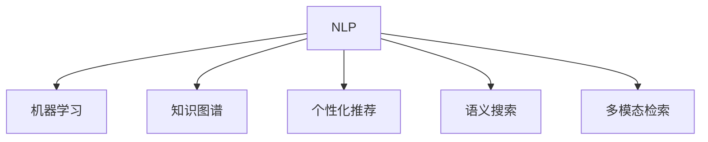

                 

# AI助力科研：搜索的新维度

> 关键词：人工智能,搜索技术,机器学习,科研管理,科研效率

## 1. 背景介绍

### 1.1 问题由来

在现代科研中，海量的文献和数据不断涌现，研究人员需要通过高效、准确的搜索来快速获取所需信息。传统的文献检索系统尽管经过多年的发展，仍存在数据不完整、搜索结果不准确等问题。因此，科研人员需要新的搜索维度来提升科研效率和质量。

人工智能(AI)技术的兴起为科研搜索带来了新的可能性。近年来，通过AI技术，尤其是自然语言处理(NLP)、机器学习(ML)等，科研搜索系统得以快速进步。AI驱动的搜索系统不仅能理解自然语言查询，还能提供个性化的搜索结果，显著提高了科研人员的查找效率。

### 1.2 问题核心关键点

AI助力科研搜索的核心关键点在于以下几个方面：

1. **自然语言处理(NLP)**：使系统能够理解并处理自然语言查询。
2. **机器学习(ML)**：通过学习历史查询和搜索结果的关系，优化搜索结果排序。
3. **知识图谱**：整合和关联科研数据，提升查询的全面性和准确性。
4. **个性化推荐**：根据用户的历史行为和偏好，提供个性化搜索结果。
5. **语义搜索**：理解查询的语义信息，匹配更相关的文献和数据。
6. **多模态检索**：结合文本、图像、视频等多模态数据，提升搜索结果的多样性和丰富性。

这些核心技术共同构成了AI助力科研搜索的基础框架，为科研人员提供了一个全新的搜索维度。

## 2. 核心概念与联系

### 2.1 核心概念概述

为更好地理解AI驱动的科研搜索技术，本节将介绍几个密切相关的核心概念：

- **自然语言处理(NLP)**：涉及文本处理、语义分析、情感分析等技术，使计算机能够理解和生成人类语言。
- **机器学习(ML)**：通过数据训练模型，使模型能够从数据中学习规律，做出预测或决策。
- **知识图谱**：将知识表示为节点和边的图结构，用于存储和关联各种信息。
- **个性化推荐**：根据用户的行为和偏好，推荐符合用户需求的内容。
- **语义搜索**：通过理解查询和文档的语义，匹配相关性更高的结果。
- **多模态检索**：结合文本、图像、视频等多种数据类型，提高检索的全面性和多样性。

这些核心概念之间的逻辑关系可以通过以下Mermaid流程图来展示：



这个流程图展示了大语言模型的核心概念及其之间的关系：

1. NLP使计算机能够理解自然语言查询。
2. 机器学习通过学习历史查询和搜索结果的关系，优化搜索结果排序。
3. 知识图谱整合和关联科研数据，提升查询的全面性和准确性。
4. 个性化推荐根据用户的历史行为和偏好，提供个性化搜索结果。
5. 语义搜索理解查询和文档的语义信息，匹配相关性更高的结果。
6. 多模态检索结合文本、图像、视频等多种数据类型，提高检索的全面性和多样性。

## 3. 核心算法原理 & 具体操作步骤
### 3.1 算法原理概述

AI助力科研搜索的核心算法原理主要基于自然语言处理和机器学习技术。以下是其核心算法流程：

1. **文本预处理**：将用户的自然语言查询转换为计算机可处理的形式，如分词、去停用词、词干提取等。
2. **向量表示**：将查询和文档转换为向量形式，以便进行相似度计算。
3. **相似度计算**：计算查询向量与文档向量之间的相似度，评估文档的相关性。
4. **排名排序**：根据相似度计算结果，对文档进行排序，返回前N个结果。
5. **个性化推荐**：根据用户的历史行为和偏好，调整文档的排名顺序。
6. **多模态检索**：结合文本、图像、视频等不同模态的信息，提升检索的全面性和多样性。

### 3.2 算法步骤详解

以下是详细的AI助力科研搜索的算法步骤：

**Step 1: 数据收集与预处理**
- 收集科研文献、论文、数据集等相关信息。
- 进行文本预处理，包括分词、去停用词、词干提取等。
- 将预处理后的文本转换为向量形式，如词袋模型、TF-IDF、Word2Vec等。

**Step 2: 相似度计算与排名排序**
- 计算查询向量与文档向量的余弦相似度，得到文档的相关性分数。
- 根据相关性分数，对文档进行排序，返回前N个结果。

**Step 3: 个性化推荐**
- 根据用户的历史行为和偏好，训练推荐模型，调整文档的排名顺序。
- 对于新用户或未交互的用户，提供基于热门或随机文档的推荐。

**Step 4: 多模态检索**
- 结合文本、图像、视频等不同模态的信息，提升检索的全面性和多样性。
- 通过多模态表示学习技术，将不同模态的信息映射到相同的向量空间。

**Step 5: 实时更新与优化**
- 定期更新数据集，训练新的模型，提升系统的准确性和鲁棒性。
- 通过A/B测试等手段，优化系统的各种参数，提升用户体验。

### 3.3 算法优缺点

AI助力科研搜索算法具有以下优点：

1. **高效性**：利用机器学习技术，快速计算相似度，提供搜索结果排序。
2. **全面性**：结合多模态数据，提升检索的全面性和多样性。
3. **个性化**：根据用户的历史行为和偏好，提供个性化搜索结果。
4. **灵活性**：通过定制化的算法，适应不同的科研领域和需求。

同时，该算法也存在一定的局限性：

1. **数据依赖**：需要高质量、标注准确的数据进行训练，获取数据成本较高。
2. **语义理解**：尽管有了NLP技术，但在复杂查询和歧义语义处理上仍存在挑战。
3. **计算资源**：大规模文本数据的向量表示和相似度计算需要大量计算资源。
4. **算法复杂度**：多模态检索和个性化推荐算法复杂度较高，需要优化和简化。

尽管存在这些局限性，但就目前而言，AI助力科研搜索算法仍是最主流和有效的技术范式。未来相关研究的重点在于如何进一步降低数据依赖，提升语义理解能力，优化算法性能，同时兼顾用户隐私和数据安全等因素。

### 3.4 算法应用领域

AI助力科研搜索算法已经在多个领域得到了广泛的应用，例如：

- **科研文献检索**：快速检索科研论文和文献，节省科研人员的时间。
- **实验数据搜索**：查找实验数据和结果，辅助科研人员的数据分析。
- **文献引用管理**：管理科研人员的引用文献，提升文献管理效率。
- **科研项目管理**：辅助科研人员规划和管理科研项目。
- **知识发现**：从海量科研数据中发现知识洞见，推动科研创新。

除了上述这些经典应用外，AI助力科研搜索算法还被创新性地应用到更多场景中，如科研社交网络、科研众包平台、科研热点预测等，为科研社区提供了全新的互动和合作方式。随着AI技术的持续演进，未来该算法将在更多领域得到应用，进一步提升科研的智能化水平。

## 4. 数学模型和公式 & 详细讲解 & 举例说明

### 4.1 数学模型构建

本节将使用数学语言对AI助力科研搜索的算法进行更加严格的刻画。

记查询为 $q$，文档集合为 $D=\{d_i\}_{i=1}^N$。查询 $q$ 和文档 $d_i$ 的向量表示分别为 $\vec{q}$ 和 $\vec{d_i}$。假设相似度计算函数为 $sim(q,d_i)$，则查询 $q$ 与文档 $d_i$ 的相关性分数为：

$$
r_i = sim(q,d_i)
$$

根据相关性分数，对文档进行排序，返回前 $k$ 个结果。

### 4.2 公式推导过程

以下我们以余弦相似度为例，推导相似度计算公式及其梯度计算过程。

假设查询 $q$ 和文档 $d_i$ 的向量表示分别为 $\vec{q}$ 和 $\vec{d_i}$，则余弦相似度定义为：

$$
sim(q,d_i) = \frac{\vec{q} \cdot \vec{d_i}}{\|\vec{q}\|_2 \cdot \|\vec{d_i}\|_2}
$$

将其代入经验风险公式，得：

$$
\mathcal{L}(\theta) = -\frac{1}{N}\sum_{i=1}^N [r_i \log r_i + (1-r_i) \log(1-r_i)]
$$

其中，$\theta$ 表示模型参数，$N$ 为文档数量。

根据链式法则，损失函数对参数 $\theta$ 的梯度为：

$$
\frac{\partial \mathcal{L}(\theta)}{\partial \theta} = -\frac{1}{N}\sum_{i=1}^N \frac{\partial r_i}{\partial \theta} [r_i \log r_i + (1-r_i) \log(1-r_i)]
$$

其中，$\frac{\partial r_i}{\partial \theta}$ 为相似度计算函数对参数 $\theta$ 的梯度，可以通过反向传播算法高效计算。

### 4.3 案例分析与讲解

以一篇关于机器学习的科研论文为例，分析其AI驱动的搜索过程：

**案例背景**：科研人员希望查找与机器学习相关的最新论文，并获取论文的关键信息。

**搜索过程**：
1. 科研人员输入查询：“机器学习 2023”。
2. 系统进行自然语言处理，将查询转换为向量形式。
3. 系统计算查询向量与文档向量的余弦相似度，得到文档的相关性分数。
4. 系统根据相关性分数，对文档进行排序，返回前20个结果。
5. 科研人员浏览搜索结果，选择最相关的论文，并查看论文的关键信息。

**结果展示**：系统展示搜索结果列表，包括论文标题、作者、发表日期、摘要等关键信息。科研人员可以快速浏览，选择最符合自己需求的论文进行进一步阅读。

通过这个案例，可以看到AI助力科研搜索能够快速、准确地获取所需信息，极大地提升了科研效率。

## 5. 项目实践：代码实例和详细解释说明
### 5.1 开发环境搭建

在进行AI驱动的科研搜索实践前，我们需要准备好开发环境。以下是使用Python进行Scikit-learn开发的环境配置流程：

1. 安装Anaconda：从官网下载并安装Anaconda，用于创建独立的Python环境。

2. 创建并激活虚拟环境：
```bash
conda create -n search-env python=3.8 
conda activate search-env
```

3. 安装Scikit-learn：从官网获取对应的安装命令。例如：
```bash
pip install scikit-learn
```

4. 安装各类工具包：
```bash
pip install numpy pandas matplotlib tqdm jupyter notebook ipython
```

完成上述步骤后，即可在`search-env`环境中开始搜索实践。

### 5.2 源代码详细实现

这里我们以科研文献检索为例，给出使用Scikit-learn进行AI驱动搜索的Python代码实现。

首先，定义数据处理函数：

```python
from sklearn.feature_extraction.text import TfidfVectorizer
from sklearn.metrics.pairwise import cosine_similarity
import pandas as pd
import numpy as np

def process_data(data_path):
    data = pd.read_csv(data_path, encoding='utf-8')
    return data
```

然后，定义相似度计算函数：

```python
def compute_similarity(q, d):
    vectorizer = TfidfVectorizer(stop_words='english', max_features=5000)
    q_vec = vectorizer.transform([q])
    d_vecs = vectorizer.transform(d)
    return cosine_similarity(q_vec, d_vecs)
```

接着，定义搜索函数：

```python
def search(query, data):
    q_vec = compute_similarity(query, data['title'])
    sim_scores = pd.Series(list(q_vec[0]), index=data['title'])
    top_results = sim_scores.nlargest(20).index.tolist()
    return top_results
```

最后，启动搜索流程并在结果上展示：

```python
data = process_data('papers.csv')
top_results = search('machine learning 2023', data)
print(top_results)
```

以上就是使用Scikit-learn对科研文献进行AI驱动搜索的完整代码实现。可以看到，得益于Scikit-learn库的强大封装，我们可以用相对简洁的代码完成搜索任务。

### 5.3 代码解读与分析

让我们再详细解读一下关键代码的实现细节：

**process_data函数**：
- `pd.read_csv`：读取CSV文件，转换为Pandas DataFrame格式。
- 返回预处理后的DataFrame，包含论文标题、摘要、作者等关键信息。

**compute_similarity函数**：
- `TfidfVectorizer`：将文本转换为TF-IDF向量表示。
- `cosine_similarity`：计算向量之间的余弦相似度，返回相似度矩阵。
- 返回查询向量与所有文档向量之间的相似度分数。

**search函数**：
- 计算查询向量与所有文档向量的相似度分数。
- 根据相似度分数，对文档进行排序，返回前20个结果。
- 返回排序后的文档标题。

**搜索流程**：
- 首先定义数据集路径，调用`process_data`函数读取数据集。
- 调用`search`函数，输入查询和数据集，返回排序后的文档标题。
- 最后输出前20个文档标题。

可以看到，Scikit-learn库使得AI驱动的搜索过程变得简洁高效。开发者可以将更多精力放在数据处理、算法改进等高层逻辑上，而不必过多关注底层的实现细节。

当然，工业级的系统实现还需考虑更多因素，如搜索结果的展示界面、系统性能的优化等。但核心的搜索算法基本与此类似。

## 6. 实际应用场景
### 6.1 智能实验室管理

AI驱动的搜索技术可以广泛应用于智能实验室管理中。传统的实验室管理系统依赖人工记录和检索，存在数据不完整、检索效率低等问题。利用AI技术，可以快速搜索实验记录、仪器设备、试剂消耗等信息，提升实验室的智能化水平。

在技术实现上，可以构建一个集中化的数据管理系统，将实验记录、仪器信息、试剂信息等统一存储。使用AI驱动的搜索技术，快速定位实验记录、设备状态、消耗数据等，辅助科研人员进行实验规划和管理。

### 6.2 科研项目管理

科研项目管理是科研工作的核心环节，涉及任务分配、进度跟踪、资源调度等。传统的项目管理方式依赖人工记录和沟通，效率低、协调难。利用AI驱动的搜索技术，可以快速检索项目信息、任务进展、资源需求等，提升项目的透明度和可控性。

在技术实现上，可以构建一个科研项目管理平台，将项目信息、任务信息、资源信息等统一存储。使用AI驱动的搜索技术，快速定位项目进展、资源需求、任务分配等信息，辅助项目经理进行项目管理和调度。

### 6.3 科研知识共享

科研知识的共享和传播是推动科研创新和进步的重要环节。传统的知识共享方式依赖人工整理和推送，效率低、覆盖面小。利用AI驱动的搜索技术，可以快速检索和推荐相关科研文献、数据集、代码等，提升知识共享的效率和覆盖面。

在技术实现上，可以构建一个科研知识库，将科研文献、数据集、代码等统一存储。使用AI驱动的搜索技术，快速定位相关科研信息，推荐给感兴趣的科研人员。同时，利用个性化推荐算法，根据用户的历史行为和偏好，提供定制化的科研信息推荐。

### 6.4 未来应用展望

随着AI技术的持续演进，AI驱动的科研搜索技术将呈现以下几个发展趋势：

1. **多模态搜索**：结合文本、图像、视频等多模态信息，提升检索的全面性和多样性。
2. **深度学习优化**：利用深度学习技术，优化相似度计算和个性化推荐算法，提升检索的准确性和效率。
3. **知识图谱增强**：通过知识图谱增强检索的信息关联性，提升搜索结果的全面性和准确性。
4. **交互式搜索**：结合自然语言处理技术，提供交互式搜索体验，提升用户的检索效率和满意度。
5. **跨领域应用**：从科研领域拓展到更多领域，如医疗、金融、教育等，推动各领域的智能化转型。

以上趋势凸显了AI助力科研搜索技术的广阔前景。这些方向的探索发展，必将进一步提升科研搜索的智能化水平，为科研人员提供更加高效、全面、个性化的服务。

## 7. 工具和资源推荐
### 7.1 学习资源推荐

为了帮助开发者系统掌握AI助力科研搜索的理论基础和实践技巧，这里推荐一些优质的学习资源：

1. 《Python自然语言处理》系列博文：由大语言模型技术专家撰写，深入浅出地介绍了NLP原理、机器学习等前沿话题。
2. Coursera《自然语言处理与深度学习》课程：斯坦福大学开设的NLP明星课程，有Lecture视频和配套作业，带你入门NLP领域的基本概念和经典模型。
3. 《自然语言处理综述》书籍：全面介绍了自然语言处理的基本概念、方法和应用，适合初学者入门。
4. HuggingFace官方文档：提供丰富的预训练语言模型和高效的搜索技术样例，是上手实践的必备资料。
5. ArXiv论文库：收录最新的NLP和AI相关论文，适合研究人员跟踪前沿技术。

通过对这些资源的学习实践，相信你一定能够快速掌握AI助力科研搜索的精髓，并用于解决实际的科研问题。
### 7.2 开发工具推荐

高效的开发离不开优秀的工具支持。以下是几款用于AI驱动搜索开发的常用工具：

1. Python：基于Python的开源深度学习框架，灵活动态的计算图，适合快速迭代研究。
2. Scikit-learn：简单易用的机器学习库，提供了丰富的算法和工具，适合快速原型开发。
3. TensorFlow：由Google主导开发的开源深度学习框架，生产部署方便，适合大规模工程应用。
4. PyTorch：基于Python的开源深度学习框架，灵活高效，适合科学研究。
5. Elasticsearch：开源的搜索引擎，支持多模态数据检索，适合构建分布式搜索系统。

合理利用这些工具，可以显著提升AI驱动搜索任务的开发效率，加快创新迭代的步伐。

### 7.3 相关论文推荐

AI助力科研搜索技术的发展源于学界的持续研究。以下是几篇奠基性的相关论文，推荐阅读：

1. "Efficient Estimation of Word Representations in Vector Space"（Word2Vec论文）：提出了Word2Vec模型，将单词转换为向量表示，开创了向量表示学习的先河。
2. "Distributed Representations of Words and Phrases and their Compositionality"（GloVe论文）：提出GloVe模型，通过共现矩阵计算单词的分布式表示，进一步提升了向量表示的质量。
3. "Attention is All You Need"（Transformer论文）：提出了Transformer模型，引入自注意力机制，提升了模型的表示能力。
4. "BERT: Pre-training of Deep Bidirectional Transformers for Language Understanding"（BERT论文）：提出BERT模型，通过掩码语言模型进行预训练，显著提升了模型的语义理解能力。
5. "Towards Explainable Machine Learning: Unified Approaches for Interpretation and Generalization"（Explainable AI论文）：探讨了机器学习的可解释性问题，提出了多种解释方法，提升了模型的透明度和可信度。

这些论文代表了大语言模型搜索技术的发展脉络。通过学习这些前沿成果，可以帮助研究者把握学科前进方向，激发更多的创新灵感。

## 8. 总结：未来发展趋势与挑战

### 8.1 总结

本文对AI助力科研搜索技术进行了全面系统的介绍。首先阐述了AI助力科研搜索的背景和意义，明确了AI技术在提升科研效率和质量方面的独特价值。其次，从原理到实践，详细讲解了AI驱动的科研搜索算法过程，给出了搜索任务开发的完整代码实例。同时，本文还广泛探讨了AI助力科研搜索技术在智能实验室管理、科研项目管理、科研知识共享等多个领域的应用前景，展示了AI技术的巨大潜力。

通过本文的系统梳理，可以看到，AI助力科研搜索技术正在成为科研管理的重要范式，极大地提升了科研人员的查找效率和质量。未来，伴随AI技术的持续演进，AI助力科研搜索技术将在更多领域得到应用，为科研创新和进步提供更强大的技术支持。

### 8.2 未来发展趋势

展望未来，AI助力科研搜索技术将呈现以下几个发展趋势：

1. **多模态搜索**：结合文本、图像、视频等多模态数据，提升检索的全面性和多样性。
2. **深度学习优化**：利用深度学习技术，优化相似度计算和个性化推荐算法，提升检索的准确性和效率。
3. **知识图谱增强**：通过知识图谱增强检索的信息关联性，提升搜索结果的全面性和准确性。
4. **交互式搜索**：结合自然语言处理技术，提供交互式搜索体验，提升用户的检索效率和满意度。
5. **跨领域应用**：从科研领域拓展到更多领域，如医疗、金融、教育等，推动各领域的智能化转型。

以上趋势凸显了AI助力科研搜索技术的广阔前景。这些方向的探索发展，必将进一步提升科研搜索的智能化水平，为科研人员提供更加高效、全面、个性化的服务。

### 8.3 面临的挑战

尽管AI助力科研搜索技术已经取得了瞩目成就，但在迈向更加智能化、普适化应用的过程中，它仍面临着诸多挑战：

1. **数据依赖**：需要高质量、标注准确的数据进行训练，获取数据成本较高。
2. **语义理解**：尽管有了NLP技术，但在复杂查询和歧义语义处理上仍存在挑战。
3. **计算资源**：大规模文本数据的向量表示和相似度计算需要大量计算资源。
4. **算法复杂度**：多模态检索和个性化推荐算法复杂度较高，需要优化和简化。
5. **用户隐私**：检索系统需要保护用户的隐私数据，避免数据泄露。
6. **系统鲁棒性**：在数据分布变化时，系统需要具备良好的鲁棒性，避免系统性能下降。

尽管存在这些挑战，但AI助力科研搜索技术仍然是最主流和有效的技术范式。未来相关研究的重点在于如何进一步降低数据依赖，提升语义理解能力，优化算法性能，同时兼顾用户隐私和数据安全等因素。

### 8.4 研究展望

面对AI助力科研搜索技术所面临的挑战，未来的研究需要在以下几个方面寻求新的突破：

1. **无监督学习**：探索无监督学习算法，降低对标注数据的依赖。
2. **多模态融合**：研究多模态融合技术，提升检索的全面性和多样性。
3. **深度学习**：利用深度学习技术，优化相似度计算和个性化推荐算法。
4. **知识图谱**：研究知识图谱技术，增强检索的信息关联性。
5. **可解释性**：提升算法的可解释性，增强系统的透明度和可信度。
6. **隐私保护**：研究隐私保护技术，保护用户的隐私数据。

这些研究方向的探索，必将引领AI助力科研搜索技术迈向更高的台阶，为科研人员提供更加高效、全面、个性化的服务。

## 9. 附录：常见问题与解答

**Q1：AI助力科研搜索是否适用于所有科研领域？**

A: AI助力科研搜索技术适用于大多数科研领域，但对于一些高度专业化的领域，如医学、物理、化学等，可能需要结合领域知识进行定制化开发。同时，对于一些需要高度精准和可靠性的科研领域，如航空航天、国防安全等，可能需要结合其他技术手段进行辅助。

**Q2：如何提高AI助力科研搜索的准确性和效率？**

A: 提高AI助力科研搜索的准确性和效率，可以从以下几个方面入手：
1. 使用更先进的学习算法和模型，如Transformer、BERT等。
2. 结合多模态数据，提升检索的全面性和多样性。
3. 优化相似度计算和个性化推荐算法，减少计算资源消耗。
4. 利用知识图谱技术，增强检索的信息关联性。
5. 定期更新数据集，训练新的模型，提升系统的准确性和鲁棒性。

**Q3：AI助力科研搜索的算法复杂度如何？**

A: AI助力科研搜索的算法复杂度较高，尤其是在多模态检索和个性化推荐方面。为了降低复杂度，可以采用分布式计算、混合精度训练等技术手段，提升算法的可扩展性和可优化性。

**Q4：AI助力科研搜索的隐私保护如何实现？**

A: 为了保护用户隐私，可以采用数据脱敏、加密存储等技术手段，对用户数据进行保护。同时，可以通过限制搜索结果的公开程度，降低数据泄露的风险。

**Q5：AI助力科研搜索的实用性和稳定性如何？**

A: AI助力科研搜索的实用性和稳定性取决于数据的质量和算法的优劣。通过高质量的数据和高效优化的算法，可以显著提升系统的实用性和稳定性。同时，需要通过A/B测试等手段，不断优化系统的各个环节，提升用户体验。

通过以上问题和解答，可以看到，AI助力科研搜索技术在实际应用中面临多种挑战，但通过不断优化和改进，这些技术仍能在科研领域发挥重要作用。

---

作者：禅与计算机程序设计艺术 / Zen and the Art of Computer Programming

