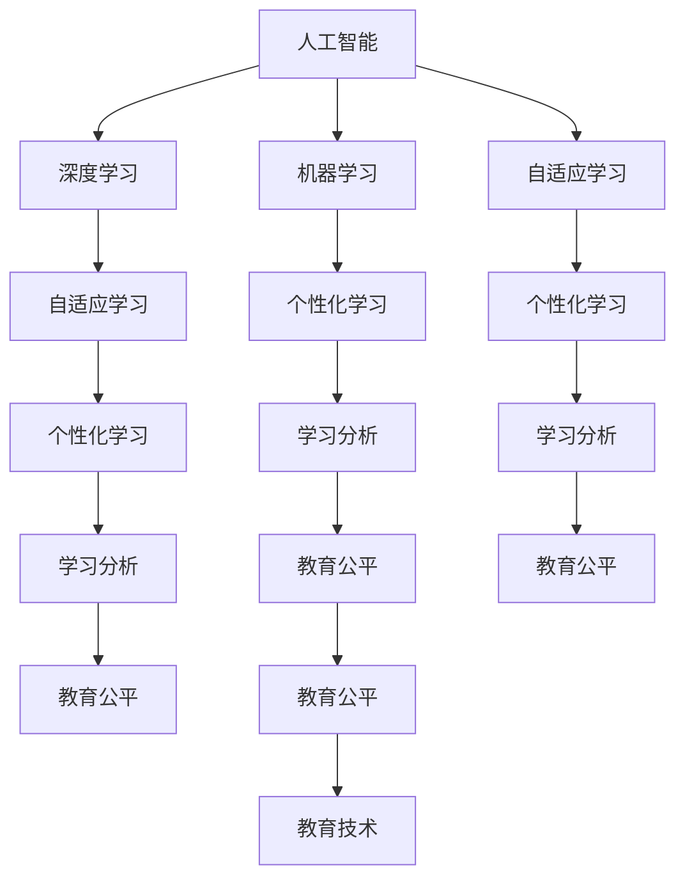

                 

# AI在教育领域的应用：个性化学习

> 关键词：人工智能,个性化学习,教育技术,机器学习,深度学习,自适应学习,数据驱动,教育公平,学生分析,学习推荐

## 1. 背景介绍

### 1.1 问题由来

随着信息技术在教育领域的不断渗透，教育智能化水平显著提升，各类教育技术产品层出不穷。从传统的教育软件，到如今的在线教育平台，再到智能教育硬件，教育技术正在逐步重塑教育生态。其中，个性化学习作为教育技术的核心应用之一，近年来得到了广泛的关注和应用。

个性化学习是指根据学生不同的学习特点、认知水平和兴趣偏好，定制化的设计和推送学习内容、学习路径和评估反馈，以促进每个学生的最佳发展。这种学习方式不仅可以提升学生的学习效果和满意度，还能够推动教育公平，缓解教师资源紧张的问题，具有广阔的发展前景。

然而，尽管个性化学习理念早已提出，但在实际应用中仍面临诸多挑战。传统的个性化学习系统往往依赖于人工设计和经验积累，难以全面覆盖复杂的教学需求。近年来，随着人工智能和大数据技术的发展，通过深度学习和机器学习等技术，实现更加智能、高效的个性化学习成为了可能。

## 2. 核心概念与联系

### 2.1 核心概念概述

为了更好地理解基于AI的个性化学习系统，本节将介绍几个密切相关的核心概念：

- 人工智能(AI)：通过机器学习、深度学习等技术模拟人类智能，实现问题求解和决策过程。
- 个性化学习：根据学生个体差异，定制化设计和推送学习内容，提升学习效果。
- 教育技术：应用信息技术手段，提升教育资源利用率和教学效果。
- 深度学习(Deep Learning)：基于多层神经网络，通过大量数据学习特征表示和模型参数。
- 机器学习(Machine Learning)：通过算法和模型，从数据中提取规律，进行预测和决策。
- 自适应学习(Adaptive Learning)：根据学习者行为和反馈，动态调整学习内容和策略。
- 学习分析(Learning Analytics)：收集、分析和可视化学习数据，提供个性化学习支持。
- 教育公平(Education Equity)：提供平等的教育机会，缩小不同背景学生之间的差距。

这些概念之间的逻辑关系可以通过以下Mermaid流程图来展示：



这个流程图展示了人工智能、个性化学习、教育技术等概念之间的关联：

1. 人工智能通过深度学习和机器学习等技术，构建特征表示和模型，支撑个性化学习和教育公平。
2. 深度学习和大规模数据训练，提高了模型的表示能力和泛化性能。
3. 自适应学习根据学生行为和反馈动态调整学习内容，提升个性化学习的实效性。
4. 学习分析通过数据收集和分析，提供个性化学习支持和教育公平评估。
5. 教育技术提供平台和工具支持，促进个性化学习系统的应用。

这些概念共同构成了基于AI的个性化学习系统的基础架构，有助于提升教育质量和学习效率。

## 3. 核心算法原理 & 具体操作步骤

### 3.1 算法原理概述

基于AI的个性化学习系统，主要依赖深度学习和机器学习技术，通过数据驱动的方式实现对学习者的个性化支持。其核心思想是通过对学生的学习行为和结果进行建模，识别学生的知识水平、学习偏好和困难点，然后根据模型预测结果，提供个性化的学习资源和路径。

具体而言，系统一般包括数据收集、特征提取、模型训练和应用反馈四个环节。其中，数据收集和特征提取通过学习分析工具完成，模型训练和应用反馈通过机器学习算法实现。整个过程可以概括为以下公式：

$$
\theta^* = \mathop{\arg\min}_{\theta} \mathcal{L}(\theta, D)
$$

其中 $\theta$ 表示模型参数，$D$ 表示训练数据集，$\mathcal{L}$ 表示损失函数。

### 3.2 算法步骤详解

基于AI的个性化学习系统的构建主要分为以下几步：

**Step 1: 数据收集与特征提取**
- 收集学生的学习数据，包括学习行为数据（如点击、阅读时间、答题记录等）和结果数据（如测试成绩、评价反馈等）。
- 使用学习分析工具，对数据进行清洗、转换和归一化，提取关键特征。
- 将特征数据划分为训练集、验证集和测试集，供后续模型训练和评估使用。

**Step 2: 模型训练**
- 选择合适的深度学习模型或机器学习算法，如神经网络、决策树、支持向量机等。
- 定义模型的输入和输出，根据训练数据进行模型训练，最小化损失函数。
- 通过交叉验证等技术，选择最优的模型参数和超参数。

**Step 3: 应用反馈与个性化推荐**
- 使用训练好的模型对学生的新数据进行预测，生成个性化推荐结果。
- 根据学生的学习行为和反馈，动态调整推荐内容，形成个性化学习路径。
- 实时监测和分析学生的学习效果和满意度，不断优化推荐算法。

**Step 4: 评估与迭代**
- 在测试集上评估推荐模型的准确性和鲁棒性，对比基线模型的性能。
- 根据评估结果，进行模型调优和迭代，提升个性化学习效果。
- 持续收集新数据，不断更新模型，保持系统的适应性和有效性。

### 3.3 算法优缺点

基于AI的个性化学习系统具有以下优点：
1. 数据驱动：通过大数据和机器学习技术，实现对学生学习行为的精准建模，提供科学化的个性化学习支持。
2. 实时响应：系统可以实时监测和分析学生行为，动态调整推荐，提升学习效果。
3. 通用性强：算法可以应用于多种学习场景，如图书阅读、视频观看、编程学习等。
4. 可扩展性强：模型可以根据数据量和任务需求进行扩展，适应不断变化的教育环境。
5. 提高学习效率：个性化学习能够有效提升学生学习兴趣和效果，减少时间浪费。

同时，该系统也存在一些局限性：
1. 数据隐私：收集和分析学生数据，可能涉及隐私问题，需要采取严格的保护措施。
2. 算法复杂：模型训练和优化需要强大的计算资源，算法实现也较为复杂。
3. 数据质量：推荐结果依赖于数据质量和特征提取的准确性，数据噪声和偏差可能影响模型性能。
4. 公平性问题：基于算法的个性化学习可能加剧教育不平等，需要考虑不同学生之间的公平性。
5. 过度依赖技术：过分依赖算法和模型，可能忽视教师和家长在教育中的重要作用。

尽管存在这些局限性，但基于AI的个性化学习系统已经在教育领域取得了显著成效，成为推动教育技术发展的核心力量。

### 3.4 算法应用领域

基于AI的个性化学习系统，可以应用于教育领域的多个场景，具体包括：

- 在线教育平台：根据学生的学习行为和成绩，个性化推荐课程和学习资源，提升学习效果。
- 智能辅导系统：通过学生提问和回答，实时评估学生理解程度，提供个性化指导和反馈。
- 课堂教学辅助：根据学生课堂互动和作业表现，调整教学内容和难度，实现因材施教。
- 考试和评估系统：分析学生答题过程和结果，提供个性化解析和建议，帮助学生提升解题能力。
- 职业培训系统：根据学员的学习路径和反馈，推荐个性化的培训内容和资源，提升职业技能。

除了这些经典应用外，基于AI的个性化学习系统还可以进一步拓展到更多场景中，如智能测评、个性化阅读、虚拟实验室等，为教育技术带来新的突破。

## 4. 数学模型和公式 & 详细讲解 & 举例说明

### 4.1 数学模型构建

本节将使用数学语言对基于AI的个性化学习系统进行更加严格的刻画。

假设收集到的学生数据集为 $D=\{(x_i,y_i)\}_{i=1}^N$，其中 $x_i$ 为输入特征，$y_i$ 为学生评价或成绩。定义模型 $M_{\theta}$ 为神经网络模型，其中 $\theta$ 为模型参数。

定义损失函数 $\mathcal{L}(\theta)$ 为：

$$
\mathcal{L}(\theta) = \frac{1}{N}\sum_{i=1}^N \ell(M_{\theta}(x_i),y_i)
$$

其中 $\ell$ 为损失函数，可以选取均方误差、交叉熵等。

### 4.2 公式推导过程

以神经网络模型为例，推导其训练过程和损失函数的梯度计算公式。

假设神经网络模型 $M_{\theta}$ 由 $L$ 层构成，每层神经元数为 $n_l$。设第 $l$ 层的输入为 $z_l^{[l]}$，输出为 $h_l^{[l]}$，激活函数为 $a$，损失函数为 $\mathcal{L}$。则前向传播和反向传播的计算过程如下：

1. 前向传播：
   $$
   z_l^{[l]} = W_l^{[l]} h_{l-1}^{[l-1]} + b_l^{[l]}
   $$
   $$
   h_l^{[l]} = a(z_l^{[l]})
   $$

2. 计算损失函数：
   $$
   \mathcal{L}(\theta) = \frac{1}{N}\sum_{i=1}^N \ell(M_{\theta}(x_i),y_i)
   $$

3. 反向传播：
   $$
   \frac{\partial \mathcal{L}}{\partial W_l^{[l]}} = \frac{\partial \mathcal{L}}{\partial z_l^{[l]}} \frac{\partial z_l^{[l]}}{\partial W_l^{[l]}}
   $$
   $$
   \frac{\partial \mathcal{L}}{\partial b_l^{[l]}} = \frac{\partial \mathcal{L}}{\partial z_l^{[l]}}
   $$
   $$
   \frac{\partial \mathcal{L}}{\partial h_l^{[l]}} = \frac{\partial \mathcal{L}}{\partial z_l^{[l]}} \frac{\partial z_l^{[l]}}{\partial h_l^{[l]}}
   $$

其中 $\frac{\partial \mathcal{L}}{\partial z_l^{[l]}}$ 为链式法则的推导过程，通过反向传播计算得到。

### 4.3 案例分析与讲解

以智能辅导系统为例，解释如何使用深度学习模型进行个性化推荐。

假设智能辅导系统收集了学生的提问数据 $D=\{(x_i,y_i)\}_{i=1}^N$，其中 $x_i$ 为问题描述，$y_i$ 为学生对回答的满意度。可以设计一个基于LSTM的序列模型 $M_{\theta}$，输入为 $x_i$，输出为学生满意度 $y_i$。模型的训练过程如下：

1. 收集和清洗数据，划分为训练集、验证集和测试集。
2. 设计LSTM模型，定义输入层、LSTM层、输出层等组件。
3. 使用反向传播算法，最小化损失函数 $\mathcal{L}(\theta)$，得到模型参数 $\theta$。
4. 对新的问题 $x$ 进行前向传播，计算模型的预测值 $\hat{y}$。
5. 根据预测值 $\hat{y}$，推荐学生最满意的答案。

通过这种基于深度学习的智能辅导系统，可以显著提升学生的学习效果和满意度，同时减轻教师的工作负担。

## 5. 项目实践：代码实例和详细解释说明

### 5.1 开发环境搭建

在进行基于AI的个性化学习系统开发前，我们需要准备好开发环境。以下是使用Python进行TensorFlow开发的环境配置流程：

1. 安装Anaconda：从官网下载并安装Anaconda，用于创建独立的Python环境。

2. 创建并激活虚拟环境：
```bash
conda create -n ai-env python=3.8 
conda activate ai-env
```

3. 安装TensorFlow：根据CUDA版本，从官网获取对应的安装命令。例如：
```bash
conda install tensorflow=2.8 -c conda-forge -c pytorch -c anaconda
```

4. 安装Keras：
```bash
pip install keras
```

5. 安装TensorBoard：
```bash
pip install tensorboard
```

6. 安装TensorFlow Addons：
```bash
pip install tensorflow-addons
```

完成上述步骤后，即可在`ai-env`环境中开始项目实践。

### 5.2 源代码详细实现

下面我们以智能辅导系统为例，给出使用TensorFlow进行基于LSTM的个性化推荐系统的PyTorch代码实现。

首先，定义LSTM模型：

```python
from tensorflow.keras.models import Sequential
from tensorflow.keras.layers import LSTM, Dense, Dropout

model = Sequential()
model.add(LSTM(128, input_shape=(None, 1)))
model.add(Dropout(0.5))
model.add(Dense(1, activation='sigmoid'))
```

然后，定义数据预处理函数：

```python
def preprocess_data(data):
    data = data.reshape(-1, 1)
    data = data.astype('float32') / 255.0
    return data
```

接着，定义数据生成器：

```python
def generate_data():
    while True:
        data = preprocess_data(np.random.rand(1, 100, 1))
        yield data
```

最后，进行模型训练和测试：

```python
epochs = 10
batch_size = 32

for epoch in range(epochs):
    model.fit_generator(generator=generate_data(), 
                       steps_per_epoch=1000, 
                       epochs=1, 
                       validation_data=validation_data,
                       validation_steps=500,
                       batch_size=batch_size,
                       verbose=1)
    score = model.evaluate(test_data, test_labels, batch_size=batch_size, verbose=0)
    print(f'Epoch {epoch+1}: Loss - {score[0]:.4f}, Accuracy - {score[1]:.4f}')
```

以上就是使用TensorFlow对LSTM模型进行智能辅导系统开发的完整代码实现。可以看到，TensorFlow提供了简单易用的接口，使得模型开发和训练变得高效便捷。

### 5.3 代码解读与分析

让我们再详细解读一下关键代码的实现细节：

**LSTM模型定义**：
- 定义了包含一个LSTM层、一个Dropout层和一个Dense层的序列模型，其中LSTM层负责提取序列特征，Dropout层防止过拟合，Dense层输出学生满意度。

**数据预处理函数**：
- 对数据进行形状变换和归一化，将输入数据转化为[样本数, 时间步, 特征数]的TensorFlow张量。

**数据生成器**：
- 生成无限长度的随机数据流，供模型进行无限次的训练和验证。

**模型训练和测试**：
- 使用`fit_generator`方法，将生成器作为数据源进行训练，以支持无限数据流。
- 使用`evaluate`方法，在测试集上评估模型的性能。

**代码输出**：
- 每轮训练结束后，输出训练的损失和准确率。

通过这些代码实现，可以全面了解基于AI的个性化学习系统的开发流程和技术细节。

## 6. 实际应用场景

### 6.1 智能课堂

智能课堂是教育技术的一个重要应用场景，通过智能化手段提升课堂教学效果。基于AI的个性化学习系统可以在智能课堂中发挥重要作用，帮助教师实时掌握学生的学习情况，并提供个性化的教学支持。

例如，使用智能辅导系统对学生提问进行实时评估和推荐，根据学生的学习状态调整教学内容和难度，实现因材施教。智能测评系统可以根据学生的答题情况，生成个性化的练习题和学习路径，帮助学生巩固知识点，提升学习效果。

### 6.2 在线学习平台

在线学习平台是教育技术的重要载体，通过互联网提供高质量的教育资源和服务。基于AI的个性化学习系统可以与在线学习平台深度融合，提供更加智能和高效的学习体验。

例如，推荐系统可以根据学生的学习行为和成绩，推荐个性化的课程和学习资源，提升学习效果。智能搜索系统可以根据学生的搜索历史和兴趣，推荐相关的学习内容，节省学生查找资源的时间。

### 6.3 教育管理

教育管理是教育领域的一个重要环节，通过智能化手段提升管理效率和效果。基于AI的个性化学习系统可以在教育管理中发挥重要作用，帮助管理者实时掌握学生的学习情况，并进行有效的干预和支持。

例如，学生分析系统可以根据学生的学习数据，识别出学习困难的学生，并提供个性化的辅导和支持。课堂监控系统可以实时监测学生的课堂表现，并生成行为报告，帮助教师及时发现和解决学生的问题。

### 6.4 未来应用展望

随着AI和大数据技术的不断发展，基于AI的个性化学习系统将会在教育领域得到更广泛的应用，带来更多的创新和突破。

未来，AI教育技术有望在以下几个方面取得更大进展：

1. 自适应学习：通过深度学习和自适应算法，实时调整学习内容和策略，提升学习效果。
2. 智能辅导：使用自然语言处理和机器翻译技术，提供全天候智能辅导服务，帮助学生解决学习问题。
3. 教育游戏：开发基于AI的教育游戏，通过互动和游戏化学习，提升学生的学习兴趣和效果。
4. 数据驱动：利用大数据和机器学习技术，深入分析学生的学习行为和效果，提供科学的个性化支持。
5. 教育公平：通过AI技术，缩小不同背景学生之间的差距，促进教育公平。
6. 多模态学习：结合图像、视频、语音等多模态数据，提升学习体验和效果。

这些方向的探索发展，必将进一步推动教育技术的创新和应用，让每个学生都能享受到高质量的教育服务。

## 7. 工具和资源推荐

### 7.1 学习资源推荐

为了帮助开发者系统掌握基于AI的个性化学习系统的理论和实践技术，这里推荐一些优质的学习资源：

1. Coursera《深度学习》课程：由斯坦福大学开设的深度学习经典课程，涵盖深度学习的基本概念和经典模型。
2. edX《人工智能与机器学习》课程：由哈佛大学和微软联合开设的课程，全面介绍AI和ML的理论和技术。
3. Udacity《人工智能工程师》纳米学位：涵盖AI的各个方面，从深度学习到自然语言处理，再到机器学习和强化学习。
4. TensorFlow官方文档：提供TensorFlow的详细文档和示例代码，帮助你快速上手和实现AI项目。
5. TensorFlow Addons官方文档：提供TensorFlow Addons的详细文档和示例代码，丰富了TensorFlow的功能和易用性。
6. Keras官方文档：提供Keras的详细文档和示例代码，帮助你高效实现深度学习模型。
7. Kaggle数据集：提供丰富的数据集和竞赛平台，帮助你对AI技术进行实际应用和验证。

通过对这些资源的学习实践，相信你一定能够快速掌握基于AI的个性化学习系统的精髓，并用于解决实际的AI教育技术问题。

### 7.2 开发工具推荐

高效的开发离不开优秀的工具支持。以下是几款用于AI教育技术开发的常用工具：

1. Jupyter Notebook：提供强大的数据可视化、代码执行和交互功能，是数据科学和机器学习开发的首选工具。
2. TensorFlow：基于Python的开源深度学习框架，提供灵活的计算图和模型构建功能。
3. Keras：基于TensorFlow的高级API，简化模型构建和训练过程，适合快速迭代研究。
4. PyTorch：基于Python的开源深度学习框架，提供动态计算图和丰富的模型实现。
5. TensorBoard：TensorFlow配套的可视化工具，实时监测模型训练状态，提供丰富的图表呈现方式。
6. Scikit-Learn：基于Python的机器学习库，提供丰富的算法和工具，支持模型训练和评估。
7. Matplotlib：基于Python的数据可视化库，提供灵活和强大的图表绘制功能。

合理利用这些工具，可以显著提升AI教育技术开发效率，加快创新迭代的步伐。

### 7.3 相关论文推荐

基于AI的个性化学习系统的发展得益于学界的持续研究。以下是几篇奠基性的相关论文，推荐阅读：

1. "Courses for Deep Learning"（Deep Learning for AI）：Andrew Ng等人，介绍深度学习的理论基础和应用。
2. "Learning Deep Architectures for AI"：Yoshua Bengio，探讨深度学习模型的设计和训练。
3. "Neural Network Learning and Generalization"：Christopher Bishop，深入分析神经网络的训练和泛化。
4. "Superintelligence: Paths, Dangers, Strategies"：Nick Bostrom，讨论人工智能的未来趋势和风险。
5. "Artificial General Intelligence"：Ian Goodfellow，探讨通用人工智能的概念和实现。
6. "Machine Learning: A Probabilistic Perspective"：Kevin Murphy，提供机器学习的基本理论和算法。
7. "Deep Learning with TensorFlow 2"：Eric Mirzoeff，介绍TensorFlow 2的原理和应用。

这些论文代表了大AI教育技术的发展脉络。通过学习这些前沿成果，可以帮助研究者把握学科前进方向，激发更多的创新灵感。

## 8. 总结：未来发展趋势与挑战

### 8.1 总结

本文对基于AI的个性化学习系统进行了全面系统的介绍。首先阐述了个性化学习在教育技术中的重要地位和应用前景，明确了AI技术在提升学习效果和教育公平中的关键作用。其次，从原理到实践，详细讲解了基于AI的个性化学习系统的构建方法和关键技术，给出了具体的代码实现和分析。同时，本文还广泛探讨了该系统在智能课堂、在线学习平台和教育管理等多个领域的应用前景，展示了AI教育技术的前景和潜力。此外，本文精选了AI教育技术的各类学习资源，力求为读者提供全方位的技术指引。

通过本文的系统梳理，可以看到，基于AI的个性化学习系统正在成为教育技术的重要范式，极大地提升了教学效果和教育公平性。AI技术通过深度学习、自适应学习和数据驱动等手段，实现了对学生学习行为的精准建模和个性化支持，推动了教育技术的进步和应用。未来，随着技术的不断发展和应用的深入，基于AI的个性化学习系统必将在教育领域发挥更大的作用，成为教育技术的核心推动力。

### 8.2 未来发展趋势

展望未来，基于AI的个性化学习系统将呈现以下几个发展趋势：

1. 自适应学习：通过深度学习和自适应算法，实时调整学习内容和策略，提升学习效果。
2. 智能辅导：使用自然语言处理和机器翻译技术，提供全天候智能辅导服务，帮助学生解决学习问题。
3. 教育游戏：开发基于AI的教育游戏，通过互动和游戏化学习，提升学生的学习兴趣和效果。
4. 数据驱动：利用大数据和机器学习技术，深入分析学生的学习行为和效果，提供科学的个性化支持。
5. 教育公平：通过AI技术，缩小不同背景学生之间的差距，促进教育公平。
6. 多模态学习：结合图像、视频、语音等多模态数据，提升学习体验和效果。

这些趋势凸显了基于AI的个性化学习系统的广阔前景。这些方向的探索发展，必将进一步推动教育技术的创新和应用，为每个学生提供高质量的教育服务。

### 8.3 面临的挑战

尽管基于AI的个性化学习系统已经取得了显著成效，但在迈向更加智能化、普适化应用的过程中，它仍面临诸多挑战：

1. 数据隐私：收集和分析学生数据，可能涉及隐私问题，需要采取严格的保护措施。
2. 算法复杂：模型训练和优化需要强大的计算资源，算法实现也较为复杂。
3. 数据质量：推荐结果依赖于数据质量和特征提取的准确性，数据噪声和偏差可能影响模型性能。
4. 公平性问题：基于算法的个性化学习可能加剧教育不平等，需要考虑不同学生之间的公平性。
5. 过度依赖技术：过分依赖算法和模型，可能忽视教师和家长在教育中的重要作用。
6. 技术壁垒：AI教育技术的开发和应用需要跨学科知识，存在较高的技术门槛。

尽管存在这些挑战，但基于AI的个性化学习系统已经在教育领域取得了显著成效，成为推动教育技术发展的核心力量。未来，需要在隐私保护、公平性、教师参与等方面进行更多的探索和优化，以实现更加智能、普适、公平的教育技术应用。

### 8.4 研究展望

面向未来，基于AI的个性化学习系统的研究还需要在以下几个方面进行深入探索：

1. 数据隐私保护：研究数据匿名化和加密技术，保障学生数据的隐私和安全。
2. 算法公平性：设计公平的算法和评估指标，确保不同学生之间的公平性。
3. 教师和家长的参与：建立人机协同的教育模式，充分利用教师和家长的智慧和资源。
4. 教育游戏化：结合游戏化设计，提升学生的学习兴趣和效果。
5. 多模态学习：研究多模态数据的整合和融合，提升学习体验和效果。
6. 教育技术创新：结合AI和其它前沿技术，如区块链、区块链等，推动教育技术的创新和应用。

这些研究方向将进一步推动基于AI的个性化学习系统的发展，为实现高质量、普适化的教育提供有力支持。

## 9. 附录：常见问题与解答

**Q1：如何实现基于AI的个性化学习系统的数据隐私保护？**

A: 实现数据隐私保护的关键在于数据匿名化和加密技术。常用的方法包括：
1. 数据去标识化：删除或掩盖学生的个人信息，如姓名、地址等。
2. 差分隐私：在数据收集和分析过程中加入噪声，保护数据隐私。
3. 加密存储：使用加密技术，保护存储在数据库中的数据安全。
4. 访问控制：限制对数据的访问权限，防止未经授权的数据泄露。

这些技术可以结合使用，构建多层隐私保护体系，保障学生数据的安全和隐私。

**Q2：如何提升基于AI的个性化学习系统的公平性？**

A: 提升基于AI的个性化学习系统的公平性，可以从以下几个方面入手：
1. 数据公平：收集多样化的数据，避免数据偏见。
2. 算法公平：设计公平的评估指标和算法，避免算法偏见。
3. 教师参与：充分利用教师和家长的智慧和资源，确保教育公平。
4. 教育干预：针对不同背景学生，进行有针对性的教育和支持。

通过这些措施，可以最大程度地提升基于AI的个性化学习系统的公平性，确保每个学生都能享受到高质量的教育。

**Q3：如何实现基于AI的个性化学习系统的自适应学习？**

A: 实现自适应学习，需要结合深度学习、自适应算法和动态反馈机制，具体步骤包括：
1. 收集学生的学习数据，包括答题情况、学习时间等。
2. 使用深度学习模型，对学生数据进行建模和预测。
3. 根据预测结果，动态调整学习内容和策略。
4. 实时监测和分析学生的学习效果，不断优化推荐算法。

通过自适应学习，可以更好地满足学生个性化需求，提升学习效果和满意度。

**Q4：如何结合游戏化设计，提升基于AI的个性化学习系统的学习兴趣？**

A: 结合游戏化设计，可以提升学生的学习兴趣和效果，具体方法包括：
1. 设计趣味性强的学习内容，如游戏、互动故事等。
2. 设置挑战性任务，激发学生的学习动力。
3. 及时反馈和奖励，增强学生的学习成就感。
4. 利用AR/VR技术，提供沉浸式学习体验。

通过游戏化设计，可以营造良好的学习氛围，提升学生的学习兴趣和效果。

**Q5：如何实现基于AI的个性化学习系统的多模态学习？**

A: 实现多模态学习，需要结合图像、视频、语音等多模态数据，具体方法包括：
1. 收集多种类型的数据，如视频、图片、音频等。
2. 设计多模态模型，对不同类型的数据进行融合和整合。
3. 使用深度学习模型，对多模态数据进行建模和预测。
4. 结合多模态数据，提升学习效果和体验。

通过多模态学习，可以更好地整合多源数据，提升学习效果和体验，为每个学生提供更加全面和个性化的教育服务。

通过这些问题的解答，可以更全面地了解基于AI的个性化学习系统的开发和应用，为教育技术的未来发展提供有力支持。

---

作者：禅与计算机程序设计艺术 / Zen and the Art of Computer Programming

