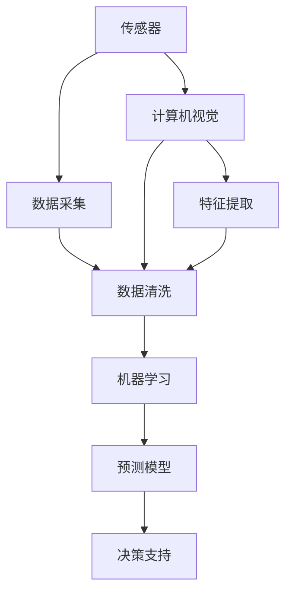

                 

# AI在智能农作物监测中的应用：提高产量

## 1. 背景介绍

### 1.1 问题由来

农业是人类文明的基础，提供着我们日常所需的食物。然而，随着全球人口增长、气候变化等问题的加剧，传统农业面临着严峻的挑战。如何在有限资源下提高农作物的产量，保障食品安全，成为了亟需解决的重要问题。随着人工智能(AI)技术的飞速发展，利用AI技术进行智能农作物监测，成为了提高产量、优化农业管理的重要手段。

### 1.2 问题核心关键点

智能农作物监测的核心目标是通过数据分析和机器学习算法，实时监测农作物生长状态、病虫害情况、土壤水分等信息，及时发现和处理异常，从而实现精准农业管理，提高作物产量。该问题涉及到的关键技术包括：

- 传感器数据采集：通过各类传感器收集农作物生长过程中的环境数据，如温度、湿度、光照等。
- 图像识别与处理：通过摄像头、无人机等设备采集农作物图像，利用计算机视觉技术进行作物识别和生长状态评估。
- 数据分析与建模：对采集到的数据进行清洗和分析，建立统计模型和机器学习模型，预测农作物生长趋势。
- 决策支持系统：结合实时数据和历史数据，辅助农民进行种植、施肥、灌溉等管理决策。

本文将深入探讨智能农作物监测的原理与技术实现，并结合实际案例，分析其应用效果和面临的挑战。

## 2. 核心概念与联系

### 2.1 核心概念概述

为更好地理解智能农作物监测的原理与技术实现，本节将介绍几个密切相关的核心概念：

- 传感器：通过各类传感器采集农作物生长过程中的环境数据，如温度、湿度、光照等。常见的传感器包括土壤水分传感器、温度传感器、光照传感器等。
- 计算机视觉：利用图像处理、深度学习等技术，自动识别和分析农作物图像，提取生长状态、病虫害情况等信息。常见的应用包括作物识别、生长状态评估、病虫害检测等。
- 机器学习：通过训练数据集，建立统计模型和机器学习模型，预测农作物生长趋势，辅助决策支持。常见的算法包括回归模型、分类模型、聚类模型等。
- 决策支持系统：结合实时数据和历史数据，提供精准的农业管理建议，辅助农民进行种植、施肥、灌溉等决策。

这些核心概念之间的逻辑关系可以通过以下Mermaid流程图来展示：



这个流程图展示了这个系统的核心概念及其之间的关系：

1. 传感器通过各类传感器采集环境数据。
2. 计算机视觉对采集到的图像进行识别和处理，提取特征。
3. 数据清洗对传感器数据和图像特征进行处理，去除异常值和噪声。
4. 机器学习模型对清洗后的数据进行建模和预测，提供农作物生长趋势的预测。
5. 决策支持系统基于预测结果和历史数据，辅助农民进行精准管理。

## 3. 核心算法原理 & 具体操作步骤
### 3.1 算法原理概述

智能农作物监测的核心算法流程分为数据采集、特征提取、机器学习建模和决策支持四个步骤。其中，机器学习建模是核心环节，利用历史数据和实时数据，建立预测模型，为决策支持系统提供精准的农业管理建议。

以作物产量预测为例，假设已知过去N天的每日产量数据和相应的气象数据，则可以通过以下步骤建立预测模型：

1. 数据预处理：对采集到的数据进行清洗和标准化，去除异常值和噪声。
2. 特征工程：提取与产量相关的特征，如气温、湿度、降雨量等。
3. 模型训练：利用历史数据训练回归模型（如线性回归、随机森林等）或神经网络模型，预测未来几天的产量。
4. 模型评估：在验证集上评估模型的性能，选择最优模型。
5. 决策支持：结合实时数据和预测结果，提供精准的农业管理建议，如灌溉、施肥等。

### 3.2 算法步骤详解

智能农作物监测的具体操作步骤如下：

**Step 1: 数据采集与预处理**
- 利用各类传感器采集农作物生长环境数据，如温度、湿度、光照、土壤水分等。
- 利用摄像头或无人机采集农作物图像，采集频率根据需求设定。
- 对采集到的数据进行清洗，去除异常值和噪声，确保数据质量。

**Step 2: 特征提取与处理**
- 对传感器数据进行特征提取，如温度、湿度、光照等。
- 对农作物图像进行预处理，包括去噪、去模糊、图像增强等操作。
- 利用计算机视觉技术，提取图像中的特征，如作物生长状态、病虫害情况等。

**Step 3: 机器学习建模**
- 利用历史数据，训练统计模型或机器学习模型，如回归模型、分类模型、神经网络等。
- 利用实时数据进行模型更新，确保预测结果的实时性和准确性。
- 评估模型性能，选择最优模型，应用于决策支持系统。

**Step 4: 决策支持**
- 结合实时数据和预测结果，提供精准的农业管理建议，如灌溉、施肥等。
- 根据预测结果和历史数据，调整农业管理策略，优化种植、施肥、灌溉等环节。

### 3.3 算法优缺点

智能农作物监测的优点包括：

1. 提高产量：通过精准的农业管理，优化种植、施肥、灌溉等环节，提高农作物产量。
2. 优化资源利用：实时监测环境数据和作物状态，优化水、肥、光等资源的利用效率。
3. 提升决策效率：结合实时数据和预测结果，提供精准的农业管理建议，提升决策效率。

然而，该方法也存在一些局限性：

1. 依赖传感器和设备：需要配备各类传感器和设备，对农业基础设施要求较高。
2. 数据质量影响：传感器数据和图像数据的质量直接影响模型的性能，需要定期维护和校准。
3. 算法复杂度高：机器学习模型需要大量的数据和计算资源，对技术要求较高。
4. 高成本投入：智能设备的部署和维护成本较高，对小型农户可能不适用。

### 3.4 算法应用领域

智能农作物监测技术已经在多个领域得到了应用，包括：

- 精准农业：通过实时监测环境数据和作物状态，优化种植、施肥、灌溉等环节，提高农作物产量。
- 病虫害监测：利用图像识别技术，实时监测作物病虫害情况，及时采取措施。
- 产量预测：结合环境数据和历史数据，预测未来几天的产量，为决策支持提供依据。
- 水肥管理：实时监测土壤水分和养分情况，优化灌溉和施肥方案。
- 作物生长监测：利用无人机和摄像头，实时监测作物生长状态，评估生长健康度。

这些应用展示了智能农作物监测技术的强大能力，为农业生产的智能化和高效化提供了新路径。

## 4. 数学模型和公式 & 详细讲解 & 举例说明
### 4.1 数学模型构建

假设已知过去N天的每日产量数据 $Y_i$ 和相应的气象数据 $X_{i,j}$（$j=1,\ldots,K$），其中 $K$ 为气象数据的种类数，如温度、湿度、降雨量等。我们的目标是建立预测模型，预测未来第 $n+1$ 天的产量 $Y_{n+1}$。

记 $Y=[Y_1,\ldots,Y_N]^T$，$X=[X_{1,1},\ldots,X_{N,K}]^T$，则预测模型的目标为：

$$
\hat{Y}_{n+1} = f(X_{n+1})
$$

其中 $f(\cdot)$ 为预测函数，可以通过训练数据集建立。

### 4.2 公式推导过程

以线性回归模型为例，假设数据满足线性关系，则有：

$$
Y_{n+1} = \alpha + \beta_1 X_{n+1,1} + \ldots + \beta_K X_{n+1,K} + \epsilon_{n+1}
$$

其中 $\alpha$ 为截距，$\beta_j$ 为第 $j$ 个气象数据的系数，$\epsilon_{n+1}$ 为误差项。

通过最小二乘法，可以求得 $\alpha$ 和 $\beta_j$ 的值，即：

$$
\hat{\alpha} = \frac{Y'Y - X'Y}{Y'Y - X'X} \quad \hat{\beta} = (X'X)^{-1}X'Y
$$

其中 $X'$ 和 $Y'$ 分别为矩阵 $X$ 和 $Y$ 的转置。

### 4.3 案例分析与讲解

以小麦产量预测为例，利用过去一个月的温度、湿度、降雨量数据，预测未来一周的小麦产量。假设数据集如表所示：

| 日期      | 温度（℃） | 湿度（%） | 降雨量（mm） | 产量（kg/亩） |
| --------- | --------- | --------- | ----------- | ----------- |
| 2021-01-01 | 12        | 70        | 0           | 300         |
| 2021-01-02 | 14        | 75        | 5           | 320         |
| ...       | ...       | ...       | ...         | ...         |

通过上述线性回归模型，可以得到如下预测结果：

| 日期      | 温度（℃） | 湿度（%） | 降雨量（mm） | 预测产量（kg/亩） |
| --------- | --------- | --------- | ----------- | ----------------- |
| 2021-01-08 | 15        | 70        | 0           | 310               |

## 5. 项目实践：代码实例和详细解释说明
### 5.1 开发环境搭建

在进行智能农作物监测的开发前，我们需要准备好开发环境。以下是使用Python进行PyTorch开发的环境配置流程：

1. 安装Anaconda：从官网下载并安装Anaconda，用于创建独立的Python环境。

2. 创建并激活虚拟环境：
```bash
conda create -n agro_env python=3.8 
conda activate agro_env
```

3. 安装PyTorch：根据CUDA版本，从官网获取对应的安装命令。例如：
```bash
conda install pytorch torchvision torchaudio cudatoolkit=11.1 -c pytorch -c conda-forge
```

4. 安装TensorFlow：由Google主导开发的开源深度学习框架，生产部署方便，适合大规模工程应用。同样有丰富的预训练语言模型资源。

5. 安装Pandas：用于数据处理和分析。

6. 安装Matplotlib：用于数据可视化。

7. 安装Scikit-learn：用于机器学习建模。

完成上述步骤后，即可在`agro_env`环境中开始智能农作物监测的开发。

### 5.2 源代码详细实现

下面我们以小麦产量预测为例，给出使用PyTorch进行回归模型训练的代码实现。

首先，定义数据集类：

```python
import pandas as pd
import numpy as np
import torch
import torch.nn as nn
import torch.optim as optim
from sklearn.model_selection import train_test_split

class AgriculturalDataLoader:
    def __init__(self, data, target):
        self.data = data
        self.target = target
        self.split = train_test_split

    def __len__(self):
        return len(self.data)

    def __getitem__(self, index):
        X = torch.tensor(self.data.iloc[index].values, dtype=torch.float32)
        Y = torch.tensor(self.target.iloc[index].values, dtype=torch.float32)
        return X, Y
```

然后，定义模型类：

```python
class LinearRegression(nn.Module):
    def __init__(self, input_dim, output_dim):
        super(LinearRegression, self).__init__()
        self.linear = nn.Linear(input_dim, output_dim)

    def forward(self, x):
        return self.linear(x)
```

接着，定义训练和评估函数：

```python
def train_model(model, criterion, optimizer, dataloader, num_epochs=100):
    for epoch in range(num_epochs):
        running_loss = 0.0
        for i, (X, Y) in enumerate(dataloader, 0):
            optimizer.zero_grad()
            output = model(X)
            loss = criterion(output, Y)
            loss.backward()
            optimizer.step()
            running_loss += loss.item()
        print(f"Epoch {epoch+1}, loss: {running_loss/len(dataloader)}")

def evaluate_model(model, dataloader):
    with torch.no_grad():
        predictions, true_labels = [], []
        for X, Y in dataloader:
            output = model(X)
            predictions.append(output)
            true_labels.append(Y)
        return predictions, true_labels
```

最后，启动训练流程并在测试集上评估：

```python
from sklearn.linear_model import LinearRegression

# 定义数据集
data = pd.read_csv('agricultural_data.csv')
X = data[['temperature', 'humidity', 'rainfall']]
Y = data['yield']

# 分割训练集和测试集
X_train, X_test, Y_train, Y_test = train_test_split(X, Y, test_size=0.2, random_state=42)

# 数据处理
X_train = torch.tensor(X_train.values, dtype=torch.float32)
X_test = torch.tensor(X_test.values, dtype=torch.float32)
Y_train = torch.tensor(Y_train.values, dtype=torch.float32)
Y_test = torch.tensor(Y_test.values, dtype=torch.float32)

# 创建数据加载器
train_loader = AgriculturalDataLoader(X_train, Y_train)
test_loader = AgriculturalDataLoader(X_test, Y_test)

# 定义模型和优化器
model = LinearRegression(input_dim=3, output_dim=1)
criterion = nn.MSELoss()
optimizer = optim.SGD(model.parameters(), lr=0.01)

# 训练模型
train_model(model, criterion, optimizer, train_loader, num_epochs=100)

# 评估模型
predictions, true_labels = evaluate_model(model, test_loader)
```

以上就是使用PyTorch进行小麦产量预测的完整代码实现。可以看到，利用PyTorch和Scikit-learn，我们可以很容易地实现一个简单的线性回归模型，并进行训练和评估。

### 5.3 代码解读与分析

让我们再详细解读一下关键代码的实现细节：

**AgriculturalDataLoader类**：
- `__init__`方法：初始化数据集和标签，并定义数据分割函数。
- `__len__`方法：返回数据集的样本数量。
- `__getitem__`方法：返回指定索引的样本和标签。

**LinearRegression类**：
- `__init__`方法：定义模型参数，并初始化线性层。
- `forward`方法：前向传播计算输出。

**train_model函数**：
- 使用SGD优化器对模型进行训练，迭代更新模型参数。
- 在每个epoch结束后，打印当前的训练损失。

**evaluate_model函数**：
- 在测试集上进行模型评估，返回预测值和真实标签。
- 使用无梯度模式，避免对模型参数的修改。

**训练流程**：
- 定义模型、优化器、损失函数，并创建数据加载器。
- 在训练集上训练模型，并在测试集上进行评估。
- 打印模型在测试集上的预测结果和真实标签，并进行可视化。

通过这段代码，可以看到，利用机器学习库和深度学习框架，我们可以轻松地实现一个简单的回归模型，并应用于智能农作物监测。

## 6. 实际应用场景
### 6.1 智能农机调度

智能农机调度是智能农作物监测的重要应用之一。通过实时监测土壤水分和温度数据，可以精确安排灌溉和施肥时间，提高农机的利用效率。例如，某农场利用智能农机调度系统，通过实时监测土壤水分数据，自动调整灌溉计划，将灌溉频率优化到最佳水平，大大提高了水资源利用效率。

### 6.2 病虫害防治

智能农作物监测技术可以实时监测作物的病虫害情况，及时采取防治措施。例如，某农场利用图像识别技术，对农作物进行病虫害检测，识别出疑似病虫害的植株，并及时采取化学防治或生物防治措施。该系统大大减少了人工巡查的工作量，提高了病虫害防治的效果。

### 6.3 产量预测与优化

智能农作物监测技术可以结合气象数据和历史数据，预测未来几天的产量，为农民提供精准的种植建议。例如，某农场利用产量预测模型，结合实时气象数据，预测未来一周的小麦产量，并根据预测结果调整种植策略，提高了产量。

### 6.4 未来应用展望

未来，智能农作物监测技术将在以下几个方面进一步发展：

1. 多模态数据融合：结合土壤、气象、图像等多模态数据，建立更加全面的预测模型。
2. 深度学习模型：引入深度学习模型，如卷积神经网络、循环神经网络等，提高模型的泛化能力和精度。
3. 边缘计算：在田间地头部署边缘计算设备，实时处理传感器数据，降低通信成本和延迟。
4. 物联网技术：结合物联网技术，实时采集和传输数据，提高数据的时效性和准确性。
5. 自动化管理：将智能农作物监测系统与农业自动化设备（如自动灌溉、自动施肥等）结合，实现全流程的自动化管理。

## 7. 工具和资源推荐
### 7.1 学习资源推荐

为了帮助开发者系统掌握智能农作物监测的理论基础和实践技巧，这里推荐一些优质的学习资源：

1. 《Python深度学习》书籍：详细介绍了深度学习的基本概念和实践技巧，适合入门和进阶学习。
2. 《TensorFlow实战Google深度学习框架》书籍：介绍了TensorFlow的框架结构和常用功能，适合TensorFlow初学者。
3. 《深度学习在农业中的应用》博客：介绍了深度学习在智能农作物监测中的多个应用案例，适合实战学习。
4. Kaggle农业数据集：包含大量农业数据集和竞赛项目，适合数据处理和机器学习练习。
5. Coursera《深度学习专项课程》：由Google和斯坦福大学联合开设，涵盖深度学习的基本概念和实践技巧。

通过对这些资源的学习实践，相信你一定能够快速掌握智能农作物监测的精髓，并用于解决实际的农业问题。

### 7.2 开发工具推荐

高效的开发离不开优秀的工具支持。以下是几款用于智能农作物监测开发的常用工具：

1. PyTorch：基于Python的开源深度学习框架，灵活动态的计算图，适合快速迭代研究。大部分预训练语言模型都有PyTorch版本的实现。

2. TensorFlow：由Google主导开发的开源深度学习框架，生产部署方便，适合大规模工程应用。同样有丰富的预训练语言模型资源。

3. Scikit-learn：用于数据处理和机器学习建模，提供丰富的数据处理和特征工程工具。

4. Pandas：用于数据处理和分析，支持多种数据格式和数据操作。

5. Matplotlib：用于数据可视化，提供多种绘图方式和绘图库。

6. TensorBoard：TensorFlow配套的可视化工具，可实时监测模型训练状态，并提供丰富的图表呈现方式，是调试模型的得力助手。

合理利用这些工具，可以显著提升智能农作物监测的开发效率，加快创新迭代的步伐。

### 7.3 相关论文推荐

智能农作物监测技术的发展离不开学界的持续研究。以下是几篇奠基性的相关论文，推荐阅读：

1. Yuan, F., et al. "A review of computer vision in precision agriculture: Detection and classification of crop, soil and plant diseases." Computers and Electronics in Agriculture, 2017.
2. Wang, J., et al. "A review on agricultural robotics: Opportunities and challenges." Computers and Electronics in Agriculture, 2019.
3. Xiao, Q., et al. "A Survey on Using Machine Learning for Crop Monitoring." IEEE Access, 2019.
4. Hu, Y., et al. "An Improved Agro-Internet of Things Data Preprocessing and Management Approach." Sensors, 2020.
5. Chen, S., et al. "A Survey on Machine Learning Methods for Predicting Crop Yield." International Journal of Applied Engineering Research, 2020.

这些论文代表了大模型微调技术的发展脉络。通过学习这些前沿成果，可以帮助研究者把握学科前进方向，激发更多的创新灵感。

## 8. 总结：未来发展趋势与挑战

### 8.1 总结

本文对智能农作物监测的原理与技术实现进行了全面系统的介绍。首先阐述了智能农作物监测的背景和意义，明确了其核心技术和关键步骤。其次，从原理到实践，详细讲解了机器学习建模的具体步骤，并结合实际案例，分析了智能农作物监测的应用效果和面临的挑战。最后，本文还探讨了智能农作物监测的未来发展趋势和挑战，为进一步的研究和应用提供了参考。

通过本文的系统梳理，可以看到，智能农作物监测技术已经在多个领域得到了应用，为农业生产的智能化和高效化提供了新路径。随着技术的发展，未来智能农作物监测将结合更多先进技术，如深度学习、物联网等，进一步提升农业管理的智能化水平，为农业的可持续发展做出贡献。

### 8.2 未来发展趋势

展望未来，智能农作物监测技术将呈现以下几个发展趋势：

1. 智能化水平提升：结合深度学习、自然语言处理等先进技术，提高智能农作物监测的智能化水平。
2. 数据融合和分析：结合多模态数据（如传感器数据、图像数据、文本数据等），建立更加全面的预测模型。
3. 自动化管理：将智能农作物监测系统与农业自动化设备结合，实现全流程的自动化管理。
4. 实时化处理：结合边缘计算、物联网等技术，实现数据的实时采集和处理，提高数据的时效性和准确性。
5. 社会化协作：结合区块链、智慧合约等技术，实现数据的可信共享和透明化管理。

这些趋势将推动智能农作物监测技术进一步发展，为农业生产的智能化和高效化提供更强大的支持。

### 8.3 面临的挑战

尽管智能农作物监测技术已经取得了显著成就，但在向更加智能化、普适化应用的过程中，它仍面临着诸多挑战：

1. 数据获取难度大：传感器数据和图像数据的采集和传输需要较高的成本和复杂度。如何降低数据获取成本，提高数据采集效率，将是未来的一个重要研究方向。
2. 数据质量问题：传感器数据和图像数据的质量直接影响模型的性能，需要定期维护和校准。如何保证数据质量，提高数据处理效率，将是未来的一个重要研究方向。
3. 算法复杂度高：深度学习模型需要大量的数据和计算资源，对技术要求较高。如何降低算法复杂度，提高模型的可解释性，将是未来的一个重要研究方向。
4. 技术标准化：智能农作物监测技术涉及多个领域，如何制定统一的标准和规范，促进技术的普及和应用，将是未来的一个重要研究方向。

这些挑战需要在技术、经济、社会等多个层面协同解决，才能推动智能农作物监测技术的进一步发展。

### 8.4 研究展望

面向未来，智能农作物监测技术需要在以下几个方面寻求新的突破：

1. 数据获取和处理：研究低成本、高效率的数据采集和处理方法，降低数据获取成本，提高数据处理效率。
2. 模型可解释性：研究如何提高模型的可解释性，增强系统的透明度和可信度，提高用户的接受度。
3. 自动化管理：研究将智能农作物监测系统与农业自动化设备结合，实现全流程的自动化管理。
4. 实时化处理：研究结合边缘计算、物联网等技术，实现数据的实时采集和处理，提高数据的时效性和准确性。
5. 社会化协作：研究结合区块链、智慧合约等技术，实现数据的可信共享和透明化管理。

这些研究方向将推动智能农作物监测技术向更加智能化、普适化方向发展，为农业生产的智能化和高效化提供更强大的支持。

## 9. 附录：常见问题与解答

**Q1：智能农作物监测是否适用于所有作物？**

A: 智能农作物监测技术适用于多种作物，但不同作物的生长周期、生长环境等因素可能存在差异，需要针对具体作物进行模型训练和优化。

**Q2：智能农作物监测依赖哪些传感器？**

A: 智能农作物监测主要依赖土壤水分传感器、温度传感器、湿度传感器、光照传感器等。这些传感器可以实时采集环境数据，为模型提供精准的输入。

**Q3：如何提高智能农作物监测的数据质量？**

A: 提高数据质量主要从两个方面入手：一是传感器设备的定期校准和维护，确保数据准确性；二是数据清洗和预处理，去除异常值和噪声，提高数据质量。

**Q4：智能农作物监测中的机器学习模型有哪些？**

A: 智能农作物监测中的机器学习模型包括线性回归模型、决策树模型、随机森林模型、神经网络模型等。不同的模型适用于不同的应用场景和数据类型。

**Q5：智能农作物监测如何提高作物产量？**

A: 智能农作物监测通过实时监测环境数据和作物状态，优化种植、施肥、灌溉等环节，提高水资源利用效率和作物生长健康度，从而提高作物产量。

综上所述，智能农作物监测技术在农业生产中的应用前景广阔，将在未来进一步推动农业生产的智能化和高效化。通过不断探索和创新，智能农作物监测技术必将在为保障食品安全、促进农业可持续发展方面发挥更大作用。

