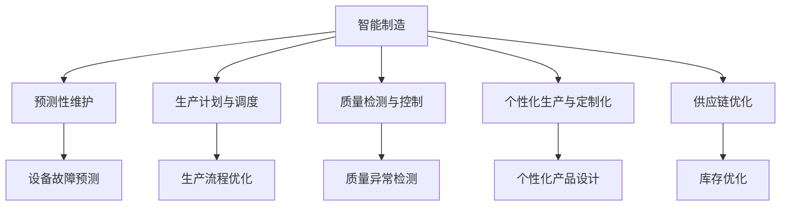

                 

## 1. 背景介绍

### 1.1 问题由来

随着科技的进步，制造业正经历着一场前所未有的数字化和智能化变革。人工智能（AI）技术的引入，尤其是深度学习和大数据技术，正在逐步改变传统制造行业的生产模式，提高生产效率，降低成本，增加产品多样性。智能制造成为提升制造业竞争力的重要手段。

### 1.2 问题核心关键点

智能制造的关键在于将AI技术与制造流程深度融合，通过智能化的生产方式，实现更加高效、灵活、定制化的生产。以下是智能制造中AI应用的核心关键点：

1. **预测性维护**：利用AI对设备的运行状态进行预测，及时发现问题，避免设备故障停机。
2. **智能调度**：通过AI优化生产计划和调度，提高生产线的利用率。
3. **质量检测**：利用AI技术对生产过程进行实时监控和质量检测，减少次品率。
4. **个性化生产**：通过AI分析客户需求，实现个性化定制生产，满足多样化的市场需求。
5. **供应链优化**：利用AI对供应链进行优化，降低库存成本，提升供应链响应速度。

这些核心点通过AI技术的应用，可以显著提高制造业的生产效率，并推动制造业的可持续发展。

### 1.3 问题研究意义

AI在智能制造中的应用，不仅能够显著提升生产效率，还能降低能耗和环境污染，实现绿色制造。通过智能化手段，企业能够更加灵活地应对市场需求变化，提高产品和服务的竞争力。AI技术的引入，将制造业从劳动密集型转向智能化、自动化、柔性化的方向发展，为制造业的转型升级提供了强有力的技术支持。

## 2. 核心概念与联系

### 2.1 核心概念概述

为更好地理解AI在智能制造中的应用，本节将介绍几个密切相关的核心概念：

- **智能制造**：通过应用先进制造技术、数字化和智能化手段，实现制造过程的自动化、智能化和柔性化。
- **预测性维护**：利用AI技术预测设备故障，提前进行维护，减少停机时间。
- **生产计划与调度**：利用AI优化生产流程和资源配置，提升生产效率。
- **质量检测与控制**：利用AI进行实时监测和质量检测，确保产品质量。
- **个性化生产与定制化**：利用AI分析客户需求，实现个性化定制生产。
- **供应链优化**：利用AI技术优化供应链管理，提升供应链效率。

这些核心概念之间的逻辑关系可以通过以下Mermaid流程图来展示：



这个流程图展示出AI技术在智能制造中的应用场景，通过智能化的手段实现各个环节的优化。

## 3. 核心算法原理 & 具体操作步骤

### 3.1 算法原理概述

AI在智能制造中的应用，主要是通过机器学习和深度学习算法，对生产数据进行分析，预测生产过程中可能出现的问题，优化生产流程，提升生产效率。具体来说，包括以下几个步骤：

1. **数据收集与预处理**：收集生产过程中各个环节的数据，包括设备运行数据、生产计划数据、质量检测数据等。然后对数据进行清洗和预处理，以提高数据的准确性和可用性。
2. **模型训练**：使用机器学习算法或深度学习模型，对预处理后的数据进行训练，学习生产过程中各种因素之间的关系，建立预测模型或优化模型。
3. **模型应用**：将训练好的模型应用于生产过程中，实现预测性维护、智能调度、质量检测、个性化生产等应用。
4. **模型优化**：根据实际应用效果，不断优化和调整模型，以提高模型的准确性和可靠性。

### 3.2 算法步骤详解

#### 3.2.1 数据收集与预处理

数据收集是智能制造的基础，需要收集设备运行数据、生产计划数据、质量检测数据、供应链数据等。然后对数据进行预处理，包括数据清洗、特征工程、归一化等，以提高数据的质量和可用性。

具体步骤如下：

1. **数据收集**：从生产设备、生产计划系统、质量检测系统、供应链管理系统等获取数据。
2. **数据清洗**：去除噪声数据、处理缺失数据，确保数据的完整性和准确性。
3. **特征工程**：提取有用的特征，如设备运行时间、生产速度、温度、湿度等。
4. **归一化**：将数据进行归一化处理，使不同类型的数据具有可比性。

#### 3.2.2 模型训练

模型训练是智能制造的核心，通过机器学习和深度学习算法，对预处理后的数据进行训练，建立预测模型或优化模型。

具体步骤如下：

1. **选择合适的算法**：根据实际应用需求，选择合适的机器学习算法或深度学习模型，如决策树、随机森林、支持向量机、神经网络等。
2. **划分数据集**：将数据划分为训练集、验证集和测试集，以评估模型的性能。
3. **模型训练**：使用训练集对模型进行训练，调整模型参数，提高模型的准确性和可靠性。
4. **模型评估**：使用验证集和测试集对模型进行评估，选择最优模型。

#### 3.2.3 模型应用

模型应用是智能制造的最终目标，将训练好的模型应用于生产过程中，实现预测性维护、智能调度、质量检测、个性化生产等应用。

具体步骤如下：

1. **预测性维护**：利用预测模型对设备运行状态进行预测，提前发现问题，进行维护。
2. **智能调度**：利用优化模型对生产计划进行优化，提高生产效率。
3. **质量检测**：利用检测模型对生产过程进行实时监控，确保产品质量。
4. **个性化生产**：利用个性化模型对客户需求进行分析，实现个性化定制生产。

#### 3.2.4 模型优化

模型优化是智能制造的重要环节，通过不断优化和调整模型，以提高模型的准确性和可靠性。

具体步骤如下：

1. **收集反馈数据**：收集模型应用过程中的反馈数据，如设备维护记录、生产效率、产品质量等。
2. **模型调整**：根据反馈数据，调整模型参数，优化模型结构。
3. **模型验证**：使用验证集和测试集对调整后的模型进行验证，确保模型性能。

### 3.3 算法优缺点

AI在智能制造中的应用，具有以下优点：

1. **提高生产效率**：通过预测性维护、智能调度等手段，显著提高生产效率。
2. **降低成本**：减少设备停机时间、降低次品率、优化供应链等，降低生产成本。
3. **提高产品质量**：通过实时监控和质量检测，提高产品质量。
4. **实现个性化生产**：通过AI分析客户需求，实现个性化定制生产，满足多样化市场需求。

同时，也存在以下局限性：

1. **数据依赖**：AI应用效果依赖于高质量的数据，数据收集和处理成本较高。
2. **模型复杂**：深度学习模型复杂，需要大量的计算资源和时间进行训练。
3. **维护成本**：模型需要定期维护和优化，维护成本较高。
4. **安全性**：AI模型可能受到攻击，导致生产过程受影响。

### 3.4 算法应用领域

AI在智能制造中的应用，主要包括以下几个领域：

1. **预测性维护**：在制造业中，设备故障是生产中断的主要原因之一。通过AI技术，对设备运行状态进行预测，及时发现问题，提前进行维护，减少停机时间。
2. **智能调度**：通过AI优化生产计划和调度，提高生产线的利用率。
3. **质量检测**：利用AI技术对生产过程进行实时监控和质量检测，确保产品质量。
4. **个性化生产与定制化**：通过AI分析客户需求，实现个性化定制生产，满足多样化市场需求。
5. **供应链优化**：利用AI技术优化供应链管理，降低库存成本，提升供应链响应速度。

## 4. 数学模型和公式 & 详细讲解 & 举例说明

### 4.1 数学模型构建

为了更好地理解AI在智能制造中的应用，我们将以预测性维护为例，构建数学模型。

设生产设备的状态为 $x$，维护时间成本为 $y$，目标是预测设备故障，最小化维护时间成本。构建回归模型 $y=f(x)$，使用机器学习算法或深度学习模型进行训练。

### 4.2 公式推导过程

以线性回归模型为例，推导预测性维护模型的公式。

设回归模型为 $y=w_0+w_1x_1+w_2x_2+\ldots+w_nx_n+b$，其中 $w_0$ 为截距，$w_i$ 为第 $i$ 个特征的权重，$b$ 为偏置。

根据训练数据 $(x_1,y_1),(x_2,y_2),\ldots,(x_n,y_n)$，最小化均方误差，求解模型参数 $w_0,w_1,\ldots,w_n$。

求解过程如下：

1. **计算均方误差**：
   $$
   J(w)=\frac{1}{n}\sum_{i=1}^n(y_i-f(x_i))^2
   $$
   其中 $f(x_i)=w_0+w_1x_{i1}+w_2x_{i2}+\ldots+w_nx_{in}+b$。

2. **求偏导数**：
   $$
   \frac{\partial J(w)}{\partial w_0}=2\sum_{i=1}^n(y_i-w_0-w_1x_{i1}-w_2x_{i2}-\ldots-w_nx_{in}-b)
   $$
   $$
   \frac{\partial J(w)}{\partial w_i}=2\sum_{i=1}^n(y_i-w_0-w_1x_{i1}-w_2x_{i2}-\ldots-w_nx_{in}-b)x_{i(i+1)}
   $$

3. **求解方程组**：
   $$
   \begin{cases}
   \frac{\partial J(w)}{\partial w_0}=0\\
   \frac{\partial J(w)}{\partial w_1}=0\\
   \ldots\\
   \frac{\partial J(w)}{\partial w_n}=0
   \end{cases}
   $$

解得 $w_0,w_1,\ldots,w_n$，代入模型公式 $y=f(x)$，得到最终的预测性维护模型。

### 4.3 案例分析与讲解

以某工厂的预测性维护为例，说明AI在智能制造中的应用。

1. **数据收集**：收集设备运行数据，如设备型号、运行时间、温度、湿度等。
2. **数据预处理**：对数据进行清洗和归一化处理，去除噪声数据，确保数据的质量。
3. **模型训练**：使用线性回归模型对设备故障进行预测，求解模型参数。
4. **模型应用**：根据设备运行数据，利用训练好的模型进行预测，提前发现设备故障，进行维护。

## 5. 项目实践：代码实例和详细解释说明

### 5.1 开发环境搭建

在进行AI在智能制造中的应用实践前，我们需要准备好开发环境。以下是使用Python进行TensorFlow开发的开发环境配置流程：

1. 安装Anaconda：从官网下载并安装Anaconda，用于创建独立的Python环境。

2. 创建并激活虚拟环境：
```bash
conda create -n tf-env python=3.8 
conda activate tf-env
```

3. 安装TensorFlow：根据CUDA版本，从官网获取对应的安装命令。例如：
```bash
conda install tensorflow=2.7
```

4. 安装各类工具包：
```bash
pip install numpy pandas scikit-learn matplotlib tqdm jupyter notebook ipython
```

完成上述步骤后，即可在`tf-env`环境中开始AI在智能制造中的应用实践。

### 5.2 源代码详细实现

这里我们以预测性维护为例，给出使用TensorFlow进行模型训练和应用的PyTorch代码实现。

首先，定义预测性维护任务的数据处理函数：

```python
import tensorflow as tf
import numpy as np

class MaintenanceDataProcessor:
    def __init__(self, data_file):
        self.data = np.loadtxt(data_file, delimiter=',')
        self.x = self.data[:, :-1]
        self.y = self.data[:, -1]
        self.num_features = self.x.shape[1]
        self.num_samples = self.x.shape[0]
        
    def train_test_split(self, test_fraction=0.2):
        indices = np.random.permutation(self.num_samples)
        split_index = int(test_fraction * self.num_samples)
        test_indices = indices[:split_index]
        train_indices = indices[split_index:]
        return self.x[train_indices], self.y[train_indices], self.x[test_indices], self.y[test_indices]
    
    def preprocess(self, x):
        return (x - self.x.mean()) / self.x.std()
    
    def inverse_preprocess(self, x):
        return x * self.x.std() + self.x.mean()
    
    def train_model(self, model, epochs=100, learning_rate=0.01):
        x_train, y_train, x_test, y_test = self.train_test_split()
        x_train = self.preprocess(x_train)
        x_test = self.preprocess(x_test)
        model.compile(optimizer=tf.keras.optimizers.Adam(learning_rate=learning_rate), loss='mse')
        model.fit(x_train, y_train, epochs=epochs, validation_data=(x_test, y_test))
        return model
    
    def evaluate_model(self, model, x_test, y_test):
        y_pred = model.predict(x_test)
        mse = tf.reduce_mean(tf.square(y_pred - y_test))
        return mse
    
    def predict(self, model, x_new):
        x_new = self.preprocess(x_new)
        y_pred = model.predict(x_new)
        return self.inverse_preprocess(y_pred)
```

然后，定义预测性维护任务的数据集：

```python
data = np.loadtxt('maintenance_data.csv', delimiter=',')
x = data[:, :-1]
y = data[:, -1]
num_features = x.shape[1]
num_samples = x.shape[0]
```

接着，定义模型和优化器：

```python
from tensorflow.keras.models import Sequential
from tensorflow.keras.layers import Dense

model = Sequential([
    Dense(10, input_dim=num_features),
    Dense(1)
])
optimizer = tf.keras.optimizers.Adam(learning_rate=0.01)
```

接着，定义训练和评估函数：

```python
def train_model(model, data):
    x_train, y_train, x_test, y_test = data.train_test_split()
    model.compile(optimizer=optimizer, loss='mse')
    model.fit(x_train, y_train, epochs=100, validation_data=(x_test, y_test))
    return model

def evaluate_model(model, data):
    x_test, y_test = data.test_data
    mse = model.evaluate(x_test, y_test)
    return mse
```

最后，启动训练流程并在测试集上评估：

```python
model = train_model(model, data)
mse = evaluate_model(model, data)
print(f'Mean Squared Error: {mse:.4f}')
```

以上就是使用TensorFlow对预测性维护模型进行训练和评估的完整代码实现。可以看到，TensorFlow提供了丰富的API，方便进行模型构建和训练。

### 5.3 代码解读与分析

让我们再详细解读一下关键代码的实现细节：

**MaintenanceDataProcessor类**：
- `__init__`方法：初始化训练数据、测试数据、特征数量和样本数量。
- `train_test_split`方法：随机分割数据为训练集和测试集。
- `preprocess`方法：对数据进行标准化处理，确保数据在均值附近。
- `inverse_preprocess`方法：对标准化后的数据进行反标准化处理，恢复数据原始值。
- `train_model`方法：定义模型训练流程，包括数据预处理、模型编译、模型训练和评估。
- `evaluate_model`方法：定义模型评估流程，包括模型评估和输出均方误差。

**训练和评估函数**：
- `train_model`函数：定义模型训练流程，使用训练集进行模型训练，并在验证集上进行评估。
- `evaluate_model`函数：定义模型评估流程，使用测试集对模型进行评估，并输出均方误差。

通过上述代码实现，可以清晰地看到TensorFlow在预测性维护中的应用，利用丰富的API，大大简化了模型的构建和训练过程。

当然，工业级的系统实现还需考虑更多因素，如模型的保存和部署、超参数的自动搜索、更灵活的任务适配层等。但核心的预测性维护范式基本与此类似。

## 6. 实际应用场景

### 6.1 智能制造

AI在智能制造中的应用，已经广泛应用于许多领域。以下是一些典型应用场景：

1. **预测性维护**：通过对设备运行数据进行分析，预测设备故障，提前进行维护，减少停机时间，降低维护成本。
2. **智能调度**：通过AI优化生产计划和调度，提高生产线的利用率，降低生产成本。
3. **质量检测**：利用AI技术对生产过程进行实时监控和质量检测，确保产品质量，降低次品率。
4. **个性化生产与定制化**：通过AI分析客户需求，实现个性化定制生产，满足多样化市场需求。
5. **供应链优化**：利用AI技术优化供应链管理，降低库存成本，提升供应链响应速度。

### 6.2 未来应用展望

未来，AI在智能制造中的应用将更加广泛，涵盖更多领域，推动制造业的数字化、智能化转型。以下是一些未来应用展望：

1. **AI与物联网结合**：将AI与物联网技术结合，实现设备的实时监控和预测性维护，提升生产效率。
2. **AI与大数据结合**：利用大数据分析，优化生产流程，提升生产效率。
3. **AI与机器学习结合**：将AI与机器学习算法结合，构建更加智能化的制造系统。
4. **AI与自动化结合**：将AI与自动化技术结合，实现高度自动化的生产过程。
5. **AI与可穿戴设备结合**：将AI与可穿戴设备结合，实现工人状态监控和作业指导。

这些应用场景将使制造业更加智能化、自动化、柔性化，为制造业的可持续发展提供强有力的技术支持。

## 7. 工具和资源推荐

### 7.1 学习资源推荐

为了帮助开发者系统掌握AI在智能制造中的应用，这里推荐一些优质的学习资源：

1. **《深度学习在制造业中的应用》**：深入浅出地介绍了深度学习在智能制造中的应用，包括预测性维护、智能调度、质量检测等。
2. **《TensorFlow官方文档》**：TensorFlow官方文档，提供了详细的API使用指南和案例，方便开发者快速上手。
3. **《TensorFlow实战》**：实战性较强的TensorFlow教程，从基础到高级，涵盖各种应用场景。
4. **《工业AI》**：详细介绍AI在工业中的应用，包括预测性维护、智能调度、质量检测等。
5. **《智能制造》**：探讨智能制造的发展趋势和未来方向，提供丰富的应用案例。

通过对这些资源的学习实践，相信你一定能够快速掌握AI在智能制造中的应用，并用于解决实际的制造问题。

### 7.2 开发工具推荐

高效的开发离不开优秀的工具支持。以下是几款用于AI在智能制造中的应用开发的常用工具：

1. **TensorFlow**：基于Python的开源深度学习框架，灵活动态的计算图，适合快速迭代研究。TensorFlow提供了丰富的API和工具，方便进行模型构建和训练。
2. **Keras**：高级神经网络API，提供简单易用的接口，适合快速搭建和训练深度学习模型。
3. **PyTorch**：基于Python的开源深度学习框架，动态计算图，适合快速迭代研究。PyTorch提供了丰富的API和工具，方便进行模型构建和训练。
4. **Jupyter Notebook**：交互式编程环境，方便进行数据处理、模型训练和结果展示。
5. **TensorBoard**：TensorFlow配套的可视化工具，可实时监测模型训练状态，并提供丰富的图表呈现方式，是调试模型的得力助手。

合理利用这些工具，可以显著提升AI在智能制造中的应用开发效率，加快创新迭代的步伐。

### 7.3 相关论文推荐

AI在智能制造中的应用，涉及多种领域的交叉，需要不断进行理论研究和实践探索。以下是几篇奠基性的相关论文，推荐阅读：

1. **《基于深度学习的智能制造预测性维护》**：探讨了基于深度学习的预测性维护技术，提出了多种预测模型和优化策略。
2. **《工业4.0与智能制造》**：探讨了智能制造的发展历程和未来方向，提供了丰富的应用案例。
3. **《智能制造与大数据融合》**：探讨了智能制造与大数据的结合，提出了多种数据分析和优化方法。
4. **《预测性维护的机器学习算法》**：介绍了多种机器学习算法在预测性维护中的应用，比较了不同算法的性能和适用性。
5. **《智能制造与物联网》**：探讨了智能制造与物联网的结合，提出了多种物联网设备和应用场景。

这些论文代表了大规模语言模型微调技术的发展脉络。通过学习这些前沿成果，可以帮助研究者把握学科前进方向，激发更多的创新灵感。

## 8. 总结：未来发展趋势与挑战

### 8.1 总结

本文对AI在智能制造中的应用进行了全面系统的介绍。首先阐述了智能制造的背景和AI应用的核心关键点，明确了AI在智能制造中的应用方向。其次，从原理到实践，详细讲解了AI在智能制造中的数学模型和算法流程，给出了预测性维护任务的完整代码实例。同时，本文还广泛探讨了AI在智能制造中的应用场景和未来展望，展示了AI技术在制造业中的巨大潜力。此外，本文精选了AI在智能制造中的应用相关的学习资源，力求为读者提供全方位的技术指引。

通过本文的系统梳理，可以看到，AI在智能制造中的应用，通过智能化手段实现生产过程的优化，极大地提高了生产效率，降低了生产成本，推动了制造业的数字化、智能化转型。AI技术的引入，为制造业的可持续发展提供了强有力的技术支持。

### 8.2 未来发展趋势

展望未来，AI在智能制造中的应用将呈现以下几个发展趋势：

1. **技术融合加速**：AI技术与物联网、大数据、机器学习等技术的深度融合，将推动制造业的数字化、智能化转型。
2. **应用场景拓展**：AI技术将应用于更多领域，如预测性维护、智能调度、质量检测、个性化生产等，实现智能化制造。
3. **数据质量提升**：高质量数据的收集和处理，是AI在智能制造中应用效果的关键，未来将更加注重数据质量的管理和提升。
4. **模型优化持续**：随着AI技术的发展，将不断优化和调整模型，提高模型的准确性和可靠性。
5. **业务落地加速**：AI技术的应用，将更加注重实际业务场景的落地，提升生产效率，降低生产成本。

以上趋势凸显了AI在智能制造中的应用前景，这些方向的探索发展，必将推动制造业的数字化、智能化转型，为制造业的可持续发展提供强有力的技术支持。

### 8.3 面临的挑战

尽管AI在智能制造中的应用取得了一定的成效，但在迈向更加智能化、普适化应用的过程中，仍面临诸多挑战：

1. **数据依赖**：AI应用效果依赖于高质量的数据，数据收集和处理成本较高，难以保证数据的完整性和准确性。
2. **模型复杂**：深度学习模型复杂，需要大量的计算资源和时间进行训练，难以应对大规模生产场景。
3. **维护成本**：AI模型需要定期维护和优化，维护成本较高，难以保证系统的稳定性和可靠性。
4. **安全性**：AI模型可能受到攻击，导致生产过程受影响，数据和模型安全成为重要问题。
5. **可解释性**：AI模型的决策过程难以解释，缺乏透明性和可信度，难以满足高风险应用的需求。

正视AI在智能制造中面临的这些挑战，积极应对并寻求突破，将是大规模语言模型微调技术迈向成熟的必由之路。相信随着学界和产业界的共同努力，这些挑战终将一一被克服，AI在智能制造中的应用必将在构建人机协同的智能时代中扮演越来越重要的角色。

### 8.4 研究展望

面向未来，AI在智能制造中的应用需要从以下几个方面进行深入研究：

1. **数据管理与处理**：探索高效的数据管理和处理技术，确保数据的完整性和准确性。
2. **模型优化与调整**：不断优化和调整模型，提高模型的准确性和可靠性，提升生产效率。
3. **模型可解释性**：探索AI模型的可解释性，提高模型的透明性和可信度，满足高风险应用的需求。
4. **安全性与隐私保护**：探索AI模型的安全性与隐私保护技术，保障数据和模型的安全。
5. **技术与业务的深度融合**：探索AI技术与业务的深度融合，实现更加智能化、自动化、柔性化的生产过程。

这些研究方向的探索，必将引领AI在智能制造中的应用技术迈向更高的台阶，为构建安全、可靠、可解释、可控的智能系统铺平道路。面向未来，AI在智能制造中的应用还需要与其他人工智能技术进行更深入的融合，如知识表示、因果推理、强化学习等，多路径协同发力，共同推动制造业的数字化、智能化转型。只有勇于创新、敢于突破，才能不断拓展AI技术在智能制造中的应用边界，让智能技术更好地造福人类社会。

## 9. 附录：常见问题与解答

**Q1：AI在智能制造中的应用是否适用于所有制造业？**

A: AI在智能制造中的应用，适用于大多数制造业领域，尤其是大规模、复杂的生产场景。但对于一些小型、简单的制造企业，可能存在成本和收益之间的平衡问题，需要根据具体情况进行决策。

**Q2：AI在智能制造中的应用需要哪些技术支持？**

A: AI在智能制造中的应用，需要以下技术支持：

1. **深度学习**：用于建立预测模型和优化模型，提升生产效率。
2. **大数据分析**：用于分析生产数据，优化生产流程。
3. **物联网**：用于设备实时监控和预测性维护。
4. **机器学习**：用于优化生产计划和调度。
5. **人工智能平台**：提供模型训练、部署和管理的平台支持。

这些技术支持是AI在智能制造中应用的基础，通过合理应用，可以实现生产过程的智能化、自动化、柔性化。

**Q3：AI在智能制造中的应用是否需要大量前期投入？**

A: AI在智能制造中的应用，需要一定的前期投入，包括设备改造、数据采集、模型训练等。但是，通过合理的技术选型和管理，可以实现较低的投入和较高的回报。此外，随着AI技术的普及和成熟，前期投入将逐渐减少，AI在智能制造中的应用将更加普及和高效。

**Q4：AI在智能制造中的应用是否面临伦理和隐私问题？**

A: AI在智能制造中的应用，同样面临伦理和隐私问题。如数据的采集和存储、模型的训练和应用等，都需要遵守相关法律法规，确保数据的隐私和安全。此外，AI模型的决策过程需要透明和可解释，避免偏见和歧视，保障系统的公正性和可信度。

通过上述问题的解答，可以看到，AI在智能制造中的应用具有广泛的应用前景，但也需要关注数据管理、技术选型、伦理和隐私等问题，确保系统的安全性和可靠性。

