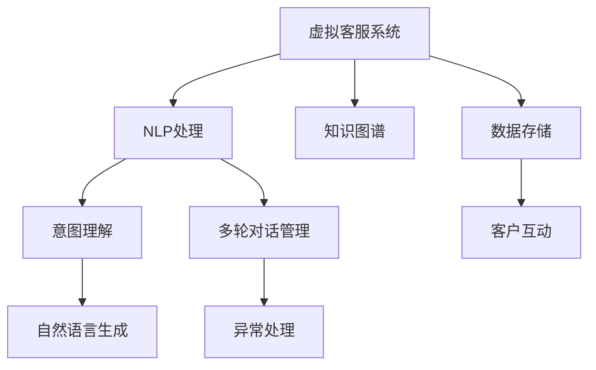

                 

# AI在虚拟客户服务中的应用：提供24/7支持

在数字经济时代，客户服务已成为企业竞争的关键环节。然而，传统的人工客服模式面临高峰期响应慢、成本高、效率低等诸多问题。随着人工智能技术的飞速发展，越来越多的企业开始探索将AI技术应用于虚拟客户服务，实现7x24小时全天候无间断支持，以期提升客户满意度，降低运营成本，提高服务质量。本文将从AI在虚拟客户服务中的关键应用——虚拟客服系统（Chatbot）入手，深入探讨其实现原理、技术框架、实践挑战及未来发展方向。

## 1. 背景介绍

### 1.1 问题由来

随着互联网和移动通信技术的迅猛发展，在线客户服务成为企业与消费者互动的重要途径。传统客服系统主要依靠人工客服人员，存在响应时间慢、服务质量不稳定、人力成本高等问题。而随着深度学习、自然语言处理等AI技术的发展，虚拟客服系统（Chatbot）成为客户服务领域的新宠。Chatbot 可以24小时在线回答客户的各种问题，提供实时的、个性化的客户服务，提升客户体验，降低企业运营成本。

### 1.2 问题核心关键点

构建高效、智能的虚拟客服系统，需从以下几方面进行综合考虑：

- 客户意图理解：准确识别客户意图，提供符合预期的回复。
- 自然语言生成：流畅、自然地生成应答文本，增强用户体验。
- 知识图谱构建：高效构建和维护知识库，保证服务质量。
- 多轮对话管理：实现上下文感知，保持对话连贯性。
- 异常处理：及时识别并处理异常情况，避免用户体验受损。

### 1.3 问题研究意义

虚拟客服系统作为AI技术在客户服务中的典型应用，其研究和应用具有重要意义：

- 提升客户体验：提供实时、个性化的客户服务，增强客户满意度和忠诚度。
- 降低运营成本：替代部分人工客服岗位，降低人力成本和运营成本。
- 提高服务效率：快速响应客户咨询，提供7x24小时服务，提升服务效率。
- 促进智能化转型：推动企业从传统人工客服向智能客服转变，提升企业智能化水平。

## 2. 核心概念与联系

### 2.1 核心概念概述

在虚拟客服系统的构建中，涉及多个关键概念和技术，包括：

- **虚拟客服系统（Chatbot）**：基于自然语言处理技术的AI客服，能够通过文字、语音等方式与客户进行实时交互，提供定制化服务。
- **自然语言处理（NLP）**：处理和分析人类语言，包括分词、词性标注、命名实体识别、句法分析、语义理解等，是虚拟客服系统实现意图理解的核心技术。
- **知识图谱（Knowledge Graph）**：将知识结构化并组织为图形表示，以方便查询和推理，是虚拟客服系统获取和理解背景知识的基础。
- **多轮对话管理（Dialog Management）**：管理对话的上下文和流程，确保对话连贯性和语境一致性，是虚拟客服系统提供高质量服务的关键。
- **异常处理（Exception Handling）**：识别并处理对话中的异常情况，如客户情绪波动、输入错误等，提升系统鲁棒性。

这些核心概念之间存在紧密联系，共同构成了虚拟客服系统的技术架构和实现流程。

### 2.2 核心概念原理和架构的 Mermaid 流程图



这个流程图展示了虚拟客服系统的核心架构和技术流程：

1. 客户通过接口向虚拟客服系统发起咨询。
2. 系统通过NLP处理模块解析客户输入的自然语言。
3. 意图理解模块根据NLP处理结果，识别客户意图。
4. 根据意图，知识图谱模块提供相关背景知识。
5. 自然语言生成模块基于意图和知识，生成应答文本。
6. 多轮对话管理模块保证对话上下文的一致性。
7. 异常处理模块识别并处理对话中的异常情况。
8. 最终应答通过数据存储模块保存，并反馈给客户。

## 3. 核心算法原理 & 具体操作步骤

### 3.1 算法原理概述

虚拟客服系统的实现依赖于多个AI技术模块，包括自然语言处理、意图理解、自然语言生成、多轮对话管理等。其中，意图理解和自然语言生成是系统的核心，多轮对话管理则保证对话的流畅性和连贯性。

**意图理解**：通过NLP技术解析客户输入的自然语言，提取出有意义的语义特征，如关键词、情感、意图类别等，从而理解客户的需求。

**自然语言生成**：根据意图和知识图谱信息，生成符合语法和语义规则的应答文本，以自然、流畅的方式回应客户。

**多轮对话管理**：维护对话上下文，根据上下文信息生成合理的应答，保证对话的连续性和一致性。

### 3.2 算法步骤详解

构建虚拟客服系统大致可以分为以下步骤：

**Step 1: 收集训练数据和知识库**
- 收集大量的客户咨询记录和常见问题，作为训练数据。
- 构建知识图谱，存储相关的背景知识，如产品信息、服务条款、法律法规等。

**Step 2: 预处理数据和知识**
- 对收集到的文本数据进行清洗、分词、词性标注等预处理。
- 对知识图谱进行整理和格式化，确保其可用性和准确性。

**Step 3: 构建意图分类模型**
- 使用监督学习算法（如决策树、随机森林、深度神经网络等）训练意图分类模型。
- 在训练数据集上进行模型评估，选取最优模型。

**Step 4: 构建自然语言生成模型**
- 使用序列到序列模型（如RNN、LSTM、Transformer等）训练自然语言生成模型。
- 在训练数据集上进行模型评估，优化模型参数。

**Step 5: 集成多轮对话管理模块**
- 设计对话管理策略，如基于状态转移图的对话管理、基于记忆的网络等。
- 训练对话管理模型，并评估其效果。

**Step 6: 异常处理机制**
- 设计异常处理逻辑，如情绪识别、输入校验、关键词过滤等。
- 实现异常情况下的应急响应，保证系统稳定性和用户体验。

**Step 7: 系统部署和监控**
- 将训练好的模型和知识库部署到服务器或云平台。
- 实时监控系统性能和客户反馈，及时调整和优化。

### 3.3 算法优缺点

**优点：**

- **24/7全天候支持**：虚拟客服系统可以全天候在线，提供实时的客户服务，提升客户满意度。
- **成本效益高**：替代部分人工客服岗位，降低人力成本和运营成本。
- **数据驱动优化**：基于客户反馈和历史数据，不断优化系统性能和知识库，提高服务质量。

**缺点：**

- **理解歧义**：客户输入的自然语言可能存在歧义，意图理解模型难以准确识别。
- **知识图谱更新**：知识图谱需要定期更新和维护，保持最新和准确性。
- **对话连贯性**：多轮对话管理难度较大，容易出现对话断层和上下文不一致的问题。
- **异常情况处理**：异常情况下的应急响应需要灵活处理，增加系统复杂性。

### 3.4 算法应用领域

虚拟客服系统在多个领域都有广泛应用，如：

- **电子商务**：提供产品咨询、订单处理、售后服务等服务。
- **金融服务**：解答金融产品、交易流程、风险管理等问题。
- **医疗健康**：提供疾病咨询、健康管理、预约挂号等服务。
- **教育培训**：提供课程咨询、学习计划、在线答疑等服务。
- **政府服务**：提供政策咨询、投诉举报、在线申请等服务。

## 4. 数学模型和公式 & 详细讲解 & 举例说明

### 4.1 数学模型构建

构建虚拟客服系统的意图理解模型通常采用分类算法，如决策树、随机森林、神经网络等。假设输入特征为 $x_1, x_2, \dots, x_n$，输出意图类别为 $y \in \{1, 2, \dots, k\}$，其中 $k$ 为意图类别数量。

分类算法的基本目标是最小化损失函数 $L(y, \hat{y})$，其中 $\hat{y}$ 为模型的预测结果。常见的损失函数包括交叉熵损失、对数损失等。

### 4.2 公式推导过程

以神经网络模型为例，假设模型包含 $L$ 层，每层神经元数为 $N_1, N_2, \dots, N_L$，激活函数为 $\phi$。输入 $x$ 经过一系列线性变换和激活函数处理后，输出 $y$ 的概率分布为：

$$
y = \phi(W_L \phi(W_{L-1} \dots \phi(W_1 x + b_1) + b_2) + b_L)
$$

其中 $W_i$ 为权重矩阵，$b_i$ 为偏置向量，$\phi$ 为激活函数。

### 4.3 案例分析与讲解

假设我们要构建一个意图分类模型，用于分类客户咨询的意图类别。

1. **数据准备**：收集客户咨询记录，并标注意图类别。
2. **特征工程**：对文本数据进行分词、词性标注、停用词过滤等预处理。
3. **模型训练**：使用随机森林算法训练意图分类模型，并在验证集上评估模型性能。
4. **模型评估**：在测试集上评估模型，输出准确率、召回率、F1分数等指标。
5. **模型优化**：根据评估结果，调整模型参数和超参数，重新训练模型。

## 5. 项目实践：代码实例和详细解释说明

### 5.1 开发环境搭建

构建虚拟客服系统需要以下开发环境：

- **Python**：开发语言，推荐使用3.8及以上版本。
- **PyTorch**：深度学习框架，支持构建神经网络模型。
- **Flask**：轻量级Web框架，用于构建系统接口。
- **Redis**：内存数据库，用于存储和管理对话上下文。
- **GCP或AWS**：云平台，用于部署和监控系统。

### 5.2 源代码详细实现

以下是一个简单的虚拟客服系统的Python代码示例，包括意图理解、自然语言生成和对话管理：

```python
from transformers import BertTokenizer, BertForSequenceClassification
import torch
from flask import Flask, request, jsonify
import redis

app = Flask(__name__)

# 意图理解模型
tokenizer = BertTokenizer.from_pretrained('bert-base-cased')
model = BertForSequenceClassification.from_pretrained('bert-base-cased', num_labels=6)
model.eval()

# 自然语言生成模型
tokenizer = BertTokenizer.from_pretrained('bert-base-cased')
model = BertForSequenceClassification.from_pretrained('bert-base-cased', num_labels=6)
model.eval()

# 对话管理模块
r = redis.StrictRedis(host='localhost', port=6379, db=0)

@app.route('/chat', methods=['POST'])
def chat():
    data = request.get_json()
    message = data['message']

    # 意图理解
    inputs = tokenizer(message, return_tensors='pt')
    with torch.no_grad():
        logits = model(**inputs).logits
        probabilities = logits.softmax(dim=1).tolist()[0]

    # 自然语言生成
    top_index = probabilities.argmax()
    top_label = model.config.id2label[top_index]
    top_logit = probabilities[top_index]
    response = tokenizer.decode(tokenizer.encode(top_label, add_special_tokens=True))

    # 存储上下文
    key = 'context:chatid'
    r.set(key, message)
    r.set(key + '_label', top_label)

    return jsonify({'response': response})

if __name__ == '__main__':
    app.run(debug=True)
```

### 5.3 代码解读与分析

这段代码实现了一个简单的意图理解和自然语言生成的虚拟客服系统，主要包括以下步骤：

1. **意图理解**：使用Bert模型进行意图分类，输出概率分布。
2. **自然语言生成**：根据意图分类结果，生成应答文本。
3. **上下文管理**：使用Redis存储对话上下文，保持对话连贯性。
4. **API接口**：使用Flask搭建API接口，实现系统的交互。

## 6. 实际应用场景

### 6.1 智能客服

智能客服系统通过虚拟客服技术，实时响应客户咨询，提供个性化服务，提升客户满意度。

**应用示例**：电商平台提供智能客服，解答用户关于商品信息、订单状态、售后服务等问题，实时更新商品库存和价格信息。

### 6.2 金融服务

虚拟客服系统在金融领域提供24/7服务，解答客户关于产品信息、交易流程、风险管理等问题。

**应用示例**：银行使用虚拟客服系统，解答客户关于账户余额、交易记录、贷款申请等问题，提供实时咨询服务。

### 6.3 医疗健康

虚拟客服系统在医疗领域提供健康咨询、疾病诊断、预约挂号等服务。

**应用示例**：医院使用虚拟客服系统，解答患者关于疾病症状、诊疗流程、医院政策等问题，提供个性化健康建议。

### 6.4 政府服务

虚拟客服系统在政府领域提供政策咨询、投诉举报、在线申请等服务。

**应用示例**：政府部门使用虚拟客服系统，解答市民关于政策解读、证件办理、公共服务等问题，提供实时咨询服务。

## 7. 工具和资源推荐

### 7.1 学习资源推荐

为了帮助开发者掌握虚拟客服系统的构建和优化，这里推荐一些优质学习资源：

1. **《Python深度学习》**：深度学习入门书籍，涵盖了神经网络、卷积神经网络、循环神经网络等基础知识。
2. **《自然语言处理入门》**：介绍自然语言处理基本概念和算法，包括分词、词性标注、命名实体识别等。
3. **《TensorFlow官方文档》**：详细介绍了TensorFlow框架的使用，包括构建神经网络模型、优化算法等。
4. **《Flask官方文档》**：介绍Flask框架的使用，包括API接口设计、Web应用开发等。
5. **《Python Redis官方文档》**：详细介绍Redis数据库的使用，包括数据存储、键值操作等。

### 7.2 开发工具推荐

构建虚拟客服系统需要使用多种工具和框架，以下是推荐的开发工具：

1. **PyTorch**：深度学习框架，支持构建神经网络模型。
2. **TensorFlow**：深度学习框架，支持多种神经网络模型和优化算法。
3. **Flask**：轻量级Web框架，用于构建系统接口。
4. **GCP或AWS**：云平台，用于部署和监控系统。
5. **Redis**：内存数据库，用于存储和管理对话上下文。

### 7.3 相关论文推荐

以下是几篇相关领域的经典论文，推荐阅读：

1. **《Attention is All You Need》**：Transformer模型的提出，奠定了现代大语言模型的基础。
2. **《BERT: Pre-training of Deep Bidirectional Transformers for Language Understanding》**：提出BERT模型，通过预训练和微调提升NLP任务的性能。
3. **《BERT: Pre-training of Deep Bidirectional Transformers for Language Understanding》**：提出BERT模型，通过预训练和微调提升NLP任务的性能。
4. **《Towards an End-to-End Dialogue System with Conversational Graph Neural Networks》**：提出基于图神经网络的对话管理模型，提升对话连贯性和上下文一致性。

## 8. 总结：未来发展趋势与挑战

### 8.1 研究成果总结

虚拟客服系统作为AI技术在客户服务中的典型应用，在提升客户满意度、降低运营成本、提高服务效率等方面具有重要意义。通过多年研究，已构建出多个高效、智能的虚拟客服系统，覆盖了多个行业领域。

### 8.2 未来发展趋势

虚拟客服系统未来将呈现以下发展趋势：

1. **深度学习技术进步**：随着深度学习技术的进步，意图理解和自然语言生成的精度将进一步提升，系统性能将更稳定、更智能。
2. **多模态融合**：虚拟客服系统将逐步融合图像、语音等多种模态，提供更全面、多样化的客户服务。
3. **个性化推荐**：结合用户历史数据和行为，提供个性化推荐服务，提升客户体验。
4. **情感识别**：通过情感分析技术，识别客户情绪，提供个性化服务，提升客户满意度。
5. **多轮对话管理**：开发更智能的对话管理算法，保证对话连贯性和一致性。

### 8.3 面临的挑战

尽管虚拟客服系统已取得显著进展，但仍面临一些挑战：

1. **理解歧义**：客户输入的自然语言可能存在歧义，意图理解模型难以准确识别。
2. **知识图谱更新**：知识图谱需要定期更新和维护，保持最新和准确性。
3. **对话连贯性**：多轮对话管理难度较大，容易出现对话断层和上下文不一致的问题。
4. **异常情况处理**：异常情况下的应急响应需要灵活处理，增加系统复杂性。

### 8.4 研究展望

未来，虚拟客服系统需要从以下几个方面进行研究：

1. **多模态融合**：结合图像、语音等多种模态，提供更全面、多样化的客户服务。
2. **个性化推荐**：结合用户历史数据和行为，提供个性化推荐服务，提升客户体验。
3. **情感识别**：通过情感分析技术，识别客户情绪，提供个性化服务，提升客户满意度。
4. **多轮对话管理**：开发更智能的对话管理算法，保证对话连贯性和一致性。
5. **数据隐私保护**：保护客户隐私，确保数据安全。

## 9. 附录：常见问题与解答

### Q1：构建虚拟客服系统需要哪些关键技术？

A: 构建虚拟客服系统需要以下关键技术：

- **自然语言处理（NLP）**：解析客户输入的自然语言，提取语义特征。
- **意图理解**：识别客户意图，选择合适的应答模型。
- **自然语言生成**：生成符合语法和语义规则的应答文本。
- **多轮对话管理**：维护对话上下文，保持对话连贯性。
- **异常处理**：识别并处理异常情况，提升系统鲁棒性。

### Q2：虚拟客服系统的意图理解模型如何使用？

A: 虚拟客服系统的意图理解模型通常使用神经网络算法进行训练。通过输入客户咨询文本，模型输出意图分类概率分布，选择合适的应答模型。

### Q3：虚拟客服系统在实际应用中需要考虑哪些因素？

A: 虚拟客服系统在实际应用中需要考虑以下因素：

- **数据质量**：收集高质量的客户咨询记录和常见问题，作为训练数据。
- **模型精度**：选择适当的模型和算法，提升意图理解和自然语言生成精度。
- **系统鲁棒性**：设计异常处理机制，提升系统稳定性和用户体验。
- **用户隐私保护**：保护客户隐私，确保数据安全。

### Q4：如何提升虚拟客服系统的对话连贯性？

A: 提升虚拟客服系统的对话连贯性需要综合考虑以下几点：

- **上下文维护**：使用Redis等内存数据库，存储和管理对话上下文。
- **对话策略设计**：设计合理的对话策略，确保对话连贯性和一致性。
- **多轮对话管理**：开发更智能的对话管理算法，提升对话连贯性。

### Q5：虚拟客服系统的异常处理机制如何实现？

A: 虚拟客服系统的异常处理机制通常包括情绪识别、输入校验、关键词过滤等。通过设计灵活的应急响应逻辑，确保系统在异常情况下的稳定性和用户体验。

---

作者：禅与计算机程序设计艺术 / Zen and the Art of Computer Programming

