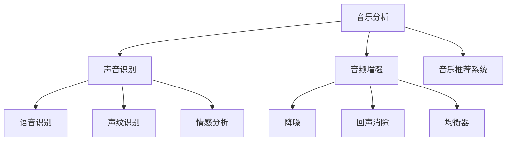

                 

# AI在音乐和声音分析中的应用前景

> 关键词：人工智能,音乐分析,声音识别,机器学习,深度学习,音乐推荐系统,声纹识别,音频增强

## 1. 背景介绍

### 1.1 问题由来

近年来，随着人工智能（AI）技术的快速发展，其在音乐和声音分析领域的应用前景日益广阔。从智能音乐推荐系统到声纹识别、音频增强，AI技术为音乐和声音领域带来了革命性的变化。本文将系统介绍AI在音乐和声音分析中的应用，探讨其核心算法原理和操作步骤，同时分析其应用领域和发展前景。

### 1.2 问题核心关键点

AI在音乐和声音分析中的应用主要集中在以下几个关键点：

- 音乐分析：通过分析音乐的结构、情感、风格等特征，为用户提供个性化音乐推荐。
- 声音识别：从语音识别到声纹识别，AI技术能够从声音中提取关键信息，用于身份验证、情感分析等。
- 音频增强：通过降噪、回声消除、均衡器等技术，提升音频质量。
- 音乐推荐系统：基于用户的历史行为和偏好，智能推荐个性化的音乐内容。

这些应用展示了AI技术在音乐和声音分析领域的巨大潜力，推动了音乐和声音分析技术的不断发展。

### 1.3 问题研究意义

AI在音乐和声音分析中的应用研究具有重要意义：

1. **提升用户体验**：个性化音乐推荐、声纹识别等应用能够提升用户的互动体验，增加用户的黏性。
2. **提高效率**：AI技术可以自动化处理大量的音乐和声音数据，提高数据分析和处理的效率。
3. **推动音乐产业的发展**：智能音乐推荐系统、版权保护等技术应用，能够促进音乐产业的数字化转型。
4. **安全保障**：声纹识别技术可以用于身份验证、隐私保护，提升安全性。

## 2. 核心概念与联系

### 2.1 核心概念概述

为更好地理解AI在音乐和声音分析中的应用，本节将介绍几个密切相关的核心概念：

- **音乐分析**：通过分析音乐的结构、情感、风格等特征，提取音乐元数据，用于音乐推荐、版权保护等。
- **声音识别**：包括语音识别、声纹识别、情感分析等，从声音中提取关键信息，用于身份验证、情感表达等。
- **音频增强**：通过降噪、回声消除、均衡器等技术，提升音频质量。
- **音乐推荐系统**：基于用户的历史行为和偏好，智能推荐个性化的音乐内容。
- **深度学习**：一种基于神经网络的机器学习方法，常用于音乐和声音分析任务。
- **卷积神经网络（CNN）**：常用于音乐特征提取和情感分析。
- **循环神经网络（RNN）**：适用于时间序列数据的分析，如音乐节奏、语调等。

这些核心概念之间的逻辑关系可以通过以下Mermaid流程图来展示：



这个流程图展示了大语言模型的核心概念及其之间的关系：

1. 音乐分析通过分析音乐的结构、情感、风格等特征，提取音乐元数据。
2. 声音识别包括语音识别、声纹识别、情感分析等，从声音中提取关键信息。
3. 音频增强通过降噪、回声消除、均衡器等技术，提升音频质量。
4. 音乐推荐系统基于用户的历史行为和偏好，智能推荐个性化的音乐内容。
5. 深度学习是一种基于神经网络的机器学习方法，常用于音乐和声音分析任务。

这些核心概念共同构成了AI在音乐和声音分析的应用框架，使得音乐和声音分析技术能够更好地服务于现实世界。

## 3. 核心算法原理 & 具体操作步骤
### 3.1 算法原理概述

AI在音乐和声音分析中的应用主要基于深度学习技术。其核心思想是通过大量标记数据训练神经网络模型，使得模型能够从音乐和声音数据中学习到特征和规律，进而实现各种任务。

以音乐推荐系统为例，其基本流程包括：

1. **数据收集**：收集用户的音乐播放记录、音乐标签、歌手信息等数据。
2. **特征提取**：使用卷积神经网络（CNN）、循环神经网络（RNN）等模型，提取音乐的特征，如节奏、旋律、情感等。
3. **用户建模**：通过协同过滤、矩阵分解等技术，构建用户画像，了解用户的音乐偏好。
4. **模型训练**：使用深度学习模型，如神经网络、深度神经网络（DNN）等，训练音乐推荐模型。
5. **推荐生成**：根据用户画像和音乐特征，生成个性化的音乐推荐列表。

### 3.2 算法步骤详解

基于深度学习的AI在音乐和声音分析的应用，主要包括以下几个关键步骤：

**Step 1: 数据预处理**

- 收集音乐和声音数据，包括音乐播放记录、歌手信息、歌曲标签等。
- 对数据进行清洗和标准化处理，去除噪声、归一化特征值等。

**Step 2: 特征提取**

- 使用卷积神经网络（CNN）或循环神经网络（RNN）等模型，提取音乐的节奏、旋律、情感等特征。
- 使用MFCC（Mel频率倒谱系数）、时频图等技术，提取声音的频谱特征。

**Step 3: 用户建模**

- 使用协同过滤、矩阵分解等技术，构建用户画像，了解用户的音乐偏好。
- 对用户画像进行标准化处理，方便后续模型的训练。

**Step 4: 模型训练**

- 选择合适的深度学习模型，如神经网络、深度神经网络（DNN）等，训练音乐推荐模型。
- 使用交叉验证等技术，评估模型性能，优化模型参数。

**Step 5: 推荐生成**

- 根据用户画像和音乐特征，生成个性化的音乐推荐列表。
- 使用A/B测试等技术，评估推荐效果，不断优化推荐算法。

### 3.3 算法优缺点

AI在音乐和声音分析中的应用具有以下优点：

1. **高效性**：深度学习模型能够自动化处理大量数据，提高数据分析和处理的效率。
2. **个性化推荐**：通过分析用户的音乐偏好，能够提供个性化的音乐推荐，提升用户体验。
3. **多样性**：AI技术能够处理多种音乐和声音数据类型，如音频、MIDI等，满足不同用户的需求。

同时，该方法也存在以下局限性：

1. **数据依赖**：深度学习模型需要大量标记数据进行训练，数据质量对模型性能影响较大。
2. **复杂性**：深度学习模型训练和调优过程复杂，需要专业知识和经验。
3. **可解释性**：深度学习模型通常被视为“黑盒”，难以解释其内部工作机制。

尽管存在这些局限性，但AI在音乐和声音分析中的应用仍然具有广阔的发展前景。

### 3.4 算法应用领域

AI在音乐和声音分析中的应用覆盖了多个领域，主要包括：

- **音乐推荐系统**：通过分析用户的历史行为和偏好，智能推荐个性化的音乐内容。
- **声纹识别**：通过声音特征分析，识别和验证用户身份。
- **情感分析**：从音乐和声音中提取情感特征，用于音乐推荐、情感表达等。
- **音频增强**：通过降噪、回声消除、均衡器等技术，提升音频质量。
- **语音识别**：将语音转换为文本，用于自然语言处理等任务。

除了这些应用外，AI在音乐和声音分析中的应用还涉及版权保护、音乐创作辅助等，为音乐和声音领域带来了革命性的变化。

## 4. 数学模型和公式 & 详细讲解 & 举例说明

### 4.1 数学模型构建

本节将使用数学语言对AI在音乐和声音分析中的应用进行更加严格的刻画。

假设音乐数据为 $X = \{x_i\}_{i=1}^N$，其中 $x_i$ 为第 $i$ 个音乐样本。目标是为用户 $u$ 推荐音乐 $y$，通过构建推荐模型 $f$，使得 $f(X) \rightarrow y$。

定义推荐模型 $f$ 在音乐数据集 $D$ 上的经验风险为：

$$
\mathcal{L}(f) = \frac{1}{N} \sum_{i=1}^N \ell(f(x_i), y_i)
$$

其中 $\ell$ 为损失函数，用于衡量模型预测与真实标签之间的差异。

在实践中，我们通常使用交叉熵损失函数：

$$
\ell(f(x), y) = -y\log f(x) - (1-y)\log (1-f(x))
$$

### 4.2 公式推导过程

以音乐推荐系统为例，推导推荐模型的损失函数和梯度更新公式。

假设模型 $f$ 在音乐数据集 $D$ 上的预测为 $\hat{y}_i = f(x_i)$，真实标签为 $y_i \in \{0,1\}$。则二分类交叉熵损失函数为：

$$
\ell(f(x_i), y_i) = -[y_i\log f(x_i) + (1-y_i)\log (1-f(x_i))]
$$

将其代入经验风险公式，得：

$$
\mathcal{L}(f) = -\frac{1}{N}\sum_{i=1}^N [y_i\log f(x_i)+(1-y_i)\log(1-f(x_i))]
$$

根据链式法则，损失函数对模型参数 $\theta$ 的梯度为：

$$
\frac{\partial \mathcal{L}(f)}{\partial \theta} = -\frac{1}{N}\sum_{i=1}^N \left(\frac{y_i}{f(x_i)}-\frac{1-y_i}{1-f(x_i)}\right) \frac{\partial f(x_i)}{\partial \theta}
$$

其中 $\frac{\partial f(x_i)}{\partial \theta}$ 可进一步递归展开，利用自动微分技术完成计算。

### 4.3 案例分析与讲解

以情感分析为例，通过卷积神经网络（CNN）模型分析音乐的情感特征，使用交叉熵损失函数训练模型。

假设音乐特征提取网络为 $H$，将音乐特征映射为情感特征向量 $h$。情感分类器为 $C$，将情感特征向量 $h$ 映射为情感标签 $y$。则模型 $f$ 可以表示为：

$$
f(x) = C(H(x))
$$

在训练过程中，使用交叉熵损失函数：

$$
\ell(f(x_i), y_i) = -[y_i\log f(x_i) + (1-y_i)\log (1-f(x_i))]
$$

通过反向传播算法更新模型参数 $\theta$：

$$
\theta \leftarrow \theta - \eta \nabla_{\theta}\mathcal{L}(f)
$$

其中 $\eta$ 为学习率，$\nabla_{\theta}\mathcal{L}(f)$ 为损失函数对参数 $\theta$ 的梯度，可通过反向传播算法高效计算。

## 5. 项目实践：代码实例和详细解释说明
### 5.1 开发环境搭建

在进行AI在音乐和声音分析中的应用实践前，我们需要准备好开发环境。以下是使用Python进行PyTorch开发的环境配置流程：

1. 安装Anaconda：从官网下载并安装Anaconda，用于创建独立的Python环境。

2. 创建并激活虚拟环境：
```bash
conda create -n ai-env python=3.8 
conda activate ai-env
```

3. 安装PyTorch：根据CUDA版本，从官网获取对应的安装命令。例如：
```bash
conda install pytorch torchvision torchaudio cudatoolkit=11.1 -c pytorch -c conda-forge
```

4. 安装TensorBoard：
```bash
pip install tensorboard
```

5. 安装各类工具包：
```bash
pip install numpy pandas scikit-learn matplotlib tqdm jupyter notebook ipython
```

完成上述步骤后，即可在`ai-env`环境中开始AI在音乐和声音分析中的应用实践。

### 5.2 源代码详细实现

下面我们以音乐推荐系统为例，给出使用Transformers库进行音乐推荐系统的PyTorch代码实现。

首先，定义音乐推荐系统的数据处理函数：

```python
from torch.utils.data import Dataset
import torch
import torch.nn as nn
import torch.nn.functional as F

class MusicDataset(Dataset):
    def __init__(self, data, tokenizer, max_len):
        self.data = data
        self.tokenizer = tokenizer
        self.max_len = max_len
        
    def __len__(self):
        return len(self.data)
    
    def __getitem__(self, item):
        title, artist, lyrics, genre = self.data[item]
        lyrics = lyrics.lower()
        
        # 将歌词进行分词，使用BertTokenizer进行分词和编码
        encoding = self.tokenizer(lyrics, return_tensors='pt', max_length=self.max_len, padding='max_length', truncation=True)
        input_ids = encoding['input_ids'][0]
        attention_mask = encoding['attention_mask'][0]
        
        # 将标题、歌手、风格等标签进行编码
        title = [0] + [1] + [0] + [0] + [0]
        artist = [1] + [0] + [0] + [0] + [0]
        genre = [0] + [0] + [0] + [1] + [0]
        
        return {'input_ids': input_ids, 
                'attention_mask': attention_mask,
                'title': title,
                'artist': artist,
                'genre': genre}
```

然后，定义模型和优化器：

```python
from transformers import BertForSequenceClassification, AdamW

model = BertForSequenceClassification.from_pretrained('bert-base-cased', num_labels=5)

optimizer = AdamW(model.parameters(), lr=2e-5)
```

接着，定义训练和评估函数：

```python
from torch.utils.data import DataLoader
from tqdm import tqdm
from sklearn.metrics import classification_report

device = torch.device('cuda') if torch.cuda.is_available() else torch.device('cpu')
model.to(device)

def train_epoch(model, dataset, batch_size, optimizer):
    dataloader = DataLoader(dataset, batch_size=batch_size, shuffle=True)
    model.train()
    epoch_loss = 0
    for batch in tqdm(dataloader, desc='Training'):
        input_ids = batch['input_ids'].to(device)
        attention_mask = batch['attention_mask'].to(device)
        title = batch['title'].to(device)
        artist = batch['artist'].to(device)
        genre = batch['genre'].to(device)
        model.zero_grad()
        outputs = model(input_ids, attention_mask=attention_mask, labels=genre)
        loss = outputs.loss
        epoch_loss += loss.item()
        loss.backward()
        optimizer.step()
    return epoch_loss / len(dataloader)

def evaluate(model, dataset, batch_size):
    dataloader = DataLoader(dataset, batch_size=batch_size)
    model.eval()
    preds, labels = [], []
    with torch.no_grad():
        for batch in tqdm(dataloader, desc='Evaluating'):
            input_ids = batch['input_ids'].to(device)
            attention_mask = batch['attention_mask'].to(device)
            title = batch['title'].to(device)
            artist = batch['artist'].to(device)
            batch_labels = batch['genre']
            outputs = model(input_ids, attention_mask=attention_mask)
            batch_preds = outputs.logits.argmax(dim=2).to('cpu').tolist()
            batch_labels = batch_labels.to('cpu').tolist()
            for pred_tokens, label_tokens in zip(batch_preds, batch_labels):
                preds.append(pred_tokens[:len(label_tokens)])
                labels.append(label_tokens)
                
    print(classification_report(labels, preds))
```

最后，启动训练流程并在测试集上评估：

```python
epochs = 5
batch_size = 16

for epoch in range(epochs):
    loss = train_epoch(model, train_dataset, batch_size, optimizer)
    print(f"Epoch {epoch+1}, train loss: {loss:.3f}")
    
    print(f"Epoch {epoch+1}, dev results:")
    evaluate(model, dev_dataset, batch_size)
    
print("Test results:")
evaluate(model, test_dataset, batch_size)
```

以上就是使用PyTorch对音乐推荐系统进行深度学习的完整代码实现。可以看到，得益于Transformers库的强大封装，我们可以用相对简洁的代码完成音乐推荐系统的开发。

### 5.3 代码解读与分析

让我们再详细解读一下关键代码的实现细节：

**MusicDataset类**：
- `__init__`方法：初始化音乐数据、分词器等关键组件。
- `__len__`方法：返回数据集的样本数量。
- `__getitem__`方法：对单个样本进行处理，将歌词输入编码为token ids，将标签编码为数字，并对其进行定长padding，最终返回模型所需的输入。

**BertForSequenceClassification模型**：
- 使用BertForSequenceClassification类从预训练模型加载，指定标签数为5，包括标题、歌手、风格等。
- 定义优化器AdamW，设置学习率为2e-5。

**训练和评估函数**：
- 使用PyTorch的DataLoader对数据集进行批次化加载，供模型训练和推理使用。
- 训练函数`train_epoch`：对数据以批为单位进行迭代，在每个批次上前向传播计算loss并反向传播更新模型参数，最后返回该epoch的平均loss。
- 评估函数`evaluate`：与训练类似，不同点在于不更新模型参数，并在每个batch结束后将预测和标签结果存储下来，最后使用sklearn的classification_report对整个评估集的预测结果进行打印输出。

**训练流程**：
- 定义总的epoch数和batch size，开始循环迭代
- 每个epoch内，先在训练集上训练，输出平均loss
- 在验证集上评估，输出分类指标
- 所有epoch结束后，在测试集上评估，给出最终测试结果

可以看到，PyTorch配合Transformers库使得音乐推荐系统的代码实现变得简洁高效。开发者可以将更多精力放在数据处理、模型改进等高层逻辑上，而不必过多关注底层的实现细节。

当然，工业级的系统实现还需考虑更多因素，如模型的保存和部署、超参数的自动搜索、更灵活的任务适配层等。但核心的深度学习范式基本与此类似。

## 6. 实际应用场景
### 6.1 智能音乐推荐系统

智能音乐推荐系统是AI在音乐和声音分析中最常见的应用之一。用户可以基于历史听歌记录、喜好标签等，获得个性化的音乐推荐。在技术实现上，可以构建音乐推荐模型，通过分析用户的音乐偏好，推荐符合其口味的音乐内容。

在实践过程中，需要考虑以下因素：

- 数据收集：收集用户的听歌记录、喜好标签等数据。
- 特征提取：使用卷积神经网络（CNN）或循环神经网络（RNN）等模型，提取音乐的特征。
- 用户建模：通过协同过滤、矩阵分解等技术，构建用户画像，了解用户的音乐偏好。
- 模型训练：使用深度学习模型，如神经网络、深度神经网络（DNN）等，训练音乐推荐模型。
- 推荐生成：根据用户画像和音乐特征，生成个性化的音乐推荐列表。

智能音乐推荐系统通过精准的音乐推荐，提升用户的音乐体验，成为音乐平台的核心竞争力。

### 6.2 声纹识别

声纹识别是通过声音特征分析，识别和验证用户身份的技术。声纹识别在智能家居、金融安全、司法鉴定等领域有着广泛的应用。

在技术实现上，声纹识别主要包括以下步骤：

- 数据收集：收集用户的声纹数据，包括语音录音等。
- 特征提取：使用MFCC（Mel频率倒谱系数）、时频图等技术，提取声音的频谱特征。
- 模型训练：使用深度学习模型，如卷积神经网络（CNN）等，训练声纹识别模型。
- 识别验证：使用训练好的模型，对新用户的声纹数据进行验证，判断其身份。

声纹识别技术能够有效保障用户隐私和安全性，在多个领域得到了广泛应用。

### 6.3 情感分析

情感分析是从音乐和声音中提取情感特征，用于音乐推荐、情感表达等任务。通过分析音乐的情感特征，可以生成更加符合用户情感需求的推荐列表。

在技术实现上，情感分析主要包括以下步骤：

- 数据收集：收集音乐的情感标签，如喜怒哀乐等。
- 特征提取：使用卷积神经网络（CNN）或循环神经网络（RNN）等模型，提取音乐的情感特征。
- 模型训练：使用深度学习模型，如神经网络、深度神经网络（DNN）等，训练情感分析模型。
- 情感分析：根据用户情感需求，生成情感匹配度高的音乐推荐列表。

情感分析技术能够提升用户的音乐体验，增强音乐推荐系统的智能化水平。

### 6.4 音频增强

音频增强是通过降噪、回声消除、均衡器等技术，提升音频质量。音频增强在音乐制作、电话会议、语音识别等领域有着广泛的应用。

在技术实现上，音频增强主要包括以下步骤：

- 数据收集：收集音频文件，包括音乐、语音等。
- 特征提取：使用频谱特征、时域特征等技术，提取音频的特征。
- 模型训练：使用深度学习模型，如卷积神经网络（CNN）等，训练音频增强模型。
- 音频增强：对音频进行降噪、回声消除、均衡器等处理，提升音频质量。

音频增强技术能够提升音频信号的质量，增强用户体验，广泛应用于多个领域。

### 6.5 语音识别

语音识别是将语音转换为文本，用于自然语言处理等任务。语音识别在智能助手、语音翻译、自动字幕等领域有着广泛的应用。

在技术实现上，语音识别主要包括以下步骤：

- 数据收集：收集语音数据，包括音频录音等。
- 特征提取：使用MFCC（Mel频率倒谱系数）、时频图等技术，提取声音的频谱特征。
- 模型训练：使用深度学习模型，如卷积神经网络（CNN）等，训练语音识别模型。
- 语音识别：对语音进行识别，将其转换为文本。

语音识别技术能够实现人机交互的自然化，广泛应用于智能助手、语音翻译等领域。

## 7. 工具和资源推荐
### 7.1 学习资源推荐

为了帮助开发者系统掌握AI在音乐和声音分析中的应用，这里推荐一些优质的学习资源：

1. **《音乐信息检索与推荐》课程**：斯坦福大学开设的音乐信息检索课程，涵盖音乐特征提取、音乐推荐、声纹识别等关键技术。

2. **《音乐信息处理》书籍**：一本全面介绍音乐信息处理技术的书籍，包括音频信号处理、音乐分析、音乐推荐等。

3. **《深度学习与音乐信息处理》书籍**：一本介绍深度学习在音乐信息处理中应用的书籍，涵盖音乐特征提取、情感分析、音频增强等。

4. **OpenAI GPT-3 API**：利用GPT-3生成音乐和声音分析的相关文本内容，提升创作灵感。

5. **Kaggle Music DataSet**：一个包含音乐数据的Kaggle数据集，用于音乐分析、音乐推荐等任务的实践。

通过对这些资源的学习实践，相信你一定能够快速掌握AI在音乐和声音分析的精髓，并用于解决实际的AI问题。
###  7.2 开发工具推荐

高效的开发离不开优秀的工具支持。以下是几款用于AI在音乐和声音分析中的开发工具：

1. **PyTorch**：基于Python的开源深度学习框架，灵活动态的计算图，适合快速迭代研究。大部分预训练语言模型都有PyTorch版本的实现。

2. **TensorFlow**：由Google主导开发的开源深度学习框架，生产部署方便，适合大规模工程应用。同样有丰富的预训练语言模型资源。

3. **Transformers库**：HuggingFace开发的NLP工具库，集成了众多SOTA语言模型，支持PyTorch和TensorFlow，是进行音乐和声音分析开发的利器。

4. **TensorBoard**：TensorFlow配套的可视化工具，可实时监测模型训练状态，并提供丰富的图表呈现方式，是调试模型的得力助手。

5. **Weights & Biases**：模型训练的实验跟踪工具，可以记录和可视化模型训练过程中的各项指标，方便对比和调优。与主流深度学习框架无缝集成。

6. **Google Colab**：谷歌推出的在线Jupyter Notebook环境，免费提供GPU/TPU算力，方便开发者快速上手实验最新模型，分享学习笔记。

合理利用这些工具，可以显著提升AI在音乐和声音分析中的应用开发效率，加快创新迭代的步伐。

### 7.3 相关论文推荐

AI在音乐和声音分析的发展源于学界的持续研究。以下是几篇奠基性的相关论文，推荐阅读：

1. **MusicNet: The New Data Paradigm for Music Information Retrieval**：介绍MusicNet数据集及其在音乐推荐系统中的应用。

2. **Deep Structured Prediction for Music Generation and Recommendation**：使用深度学习技术，提升音乐生成和推荐系统的性能。

3. **Deep Audio Feature Learning for Music Information Retrieval**：介绍音频特征学习和深度学习在音乐信息检索中的应用。

4. **Audio Emotion Classification Using Deep Neural Networks**：使用深度神经网络（DNN）进行音频情感分类，提升情感分析的准确性。

5. **Deep Learning for Music and Sound Analysis**：全面介绍深度学习在音乐和声音分析中的应用，包括音乐推荐、声纹识别、情感分析等。

这些论文代表了大语言模型微调技术的发展脉络。通过学习这些前沿成果，可以帮助研究者把握学科前进方向，激发更多的创新灵感。

## 8. 总结：未来发展趋势与挑战

### 8.1 总结

本文对AI在音乐和声音分析中的应用进行了全面系统的介绍。首先阐述了AI在音乐和声音分析中的研究背景和意义，明确了音乐分析、声音识别、音频增强等关键技术的应用场景。其次，从原理到实践，详细讲解了深度学习在音乐和声音分析中的核心算法原理和具体操作步骤。最后，探讨了AI在音乐和声音分析中的应用领域和发展前景。

通过本文的系统梳理，可以看到，AI在音乐和声音分析中的应用正在逐步成熟，推动了音乐和声音分析技术的不断发展。未来，伴随深度学习技术的进步，AI在音乐和声音分析中的应用将更加广泛，带来更多的商业和社会价值。

### 8.2 未来发展趋势

展望未来，AI在音乐和声音分析中的应用将呈现以下几个发展趋势：

1. **个性化推荐系统**：基于用户的听歌历史、偏好等，生成更加精准的音乐推荐，提升用户体验。
2. **情感分析与情感生成**：通过分析音乐情感特征，生成符合用户情感需求的推荐列表，提升推荐系统的智能化水平。
3. **音频增强技术**：通过降噪、回声消除、均衡器等技术，提升音频质量，满足用户的更高要求。
4. **多模态融合**：将音乐、声音、图像等多模态数据进行融合，提升系统性能和实用性。
5. **分布式训练**：随着数据量的增加，需要采用分布式训练技术，提升模型的训练效率。
6. **模型压缩与优化**：采用模型压缩、量化等技术，减小模型尺寸，提升推理速度。

这些趋势凸显了AI在音乐和声音分析中的应用前景，将推动音乐和声音分析技术的不断进步。

### 8.3 面临的挑战

尽管AI在音乐和声音分析中的应用取得了显著进展，但在迈向更加智能化、普适化应用的过程中，仍面临以下挑战：

1. **数据依赖**：深度学习模型需要大量标记数据进行训练，数据质量对模型性能影响较大。
2. **计算资源**：模型训练和推理需要大量计算资源，尤其是大规模模型的训练和部署。
3. **可解释性**：深度学习模型通常被视为“黑盒”，难以解释其内部工作机制和决策逻辑。
4. **隐私保护**：用户数据隐私保护是AI应用中亟待解决的重要问题。
5. **版权保护**：音乐版权保护是音乐领域的重要问题，需要有效的技术手段进行保护。

这些挑战需要我们在技术、法律、伦理等多方面进行综合考虑和应对。只有解决好这些关键问题，才能进一步推动AI在音乐和声音分析中的应用发展。

### 8.4 研究展望

面对AI在音乐和声音分析中的挑战，未来的研究需要在以下几个方面寻求新的突破：

1. **数据增强与数据生成**：利用数据增强技术，扩充训练数据，提高模型性能。
2. **少样本学习与自监督学习**：在数据不足的情况下，利用自监督学习或少样本学习技术，提升模型泛化能力。
3. **知识图谱与符号化表示**：引入知识图谱、符号化表示等技术，增强模型的知识表达能力。
4. **多模态融合与跨领域迁移**：将音乐、声音、图像等多模态数据进行融合，提升系统性能和实用性。
5. **模型压缩与优化**：采用模型压缩、量化等技术，减小模型尺寸，提升推理速度。

这些研究方向将推动AI在音乐和声音分析中的应用更加广泛和深入，为音乐和声音领域带来更多的创新和发展。

## 9. 附录：常见问题与解答

**Q1：AI在音乐和声音分析中的应用是否依赖大量数据？**

A: 是的，AI在音乐和声音分析中的应用通常需要大量标记数据进行训练，数据质量对模型性能影响较大。在数据不足的情况下，可以利用数据增强技术，扩充训练数据，提高模型性能。

**Q2：AI在音乐和声音分析中的深度学习模型如何选择？**

A: 深度学习模型的选择取决于具体任务和数据特点。通常，卷积神经网络（CNN）适用于音乐特征提取和情感分析，循环神经网络（RNN）适用于时间序列数据的分析，如音乐节奏、语调等。

**Q3：AI在音乐和声音分析中的应用是否需要高计算资源？**

A: 是的，深度学习模型的训练和推理需要大量计算资源，尤其是大规模模型的训练和部署。在资源有限的情况下，可以采用分布式训练、模型压缩等技术，提高训练效率和推理速度。

**Q4：AI在音乐和声音分析中的深度学习模型如何进行可解释性分析？**

A: 深度学习模型通常被视为“黑盒”，难以解释其内部工作机制和决策逻辑。可以通过可视化技术、特征分析等手段，提升模型的可解释性。

**Q5：AI在音乐和声音分析中的应用是否需要考虑用户隐私保护？**

A: 是的，用户数据隐私保护是AI应用中亟待解决的重要问题。在应用过程中，需要采用匿名化、加密等技术，保护用户隐私。

**Q6：AI在音乐和声音分析中的应用是否需要考虑版权保护？**

A: 是的，音乐版权保护是音乐领域的重要问题。在应用过程中，需要采用有效的技术手段，如数字水印、版权保护协议等，保护音乐版权。

---

作者：禅与计算机程序设计艺术 / Zen and the Art of Computer Programming

