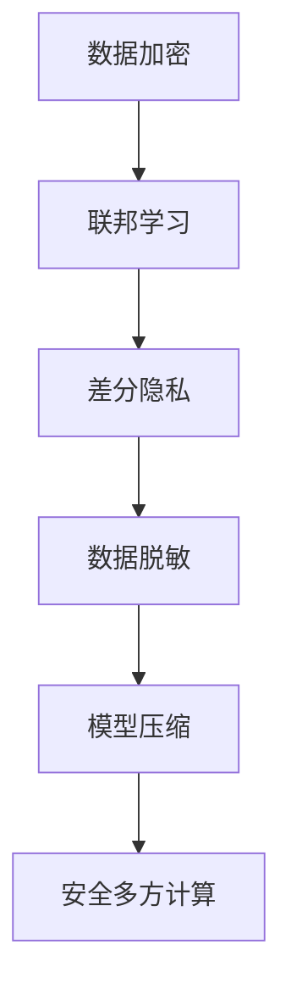

                 

# AI基础设施的隐私保护：Lepton AI的数据安全方案

> 关键词：隐私保护, Lepton AI, 数据安全, 联邦学习, 差分隐私, 数据脱敏, 模型压缩, 安全多方计算

## 1. 背景介绍

在人工智能(AI)技术快速发展的背景下，数据安全与隐私保护成为了各行业关注的焦点。AI基础设施在提供便捷高效服务的同时，也对数据的存储、传输、处理带来了新的挑战。特别是对于大数据、深度学习等高计算需求的应用，如何在数据使用的过程中保护隐私，防止数据泄露，成为了亟待解决的问题。

Lepton AI作为一家致力于数据隐私保护的公司，开发了一套涵盖数据加密、联邦学习、差分隐私等技术手段的数据安全方案，旨在为AI基础设施提供全面的隐私保护。本文将从背景介绍、核心概念与联系、核心算法原理、项目实践、实际应用场景等多个维度，详细阐述Lepton AI的隐私保护方案，并分析其在实际应用中的优势和挑战。

## 2. 核心概念与联系

### 2.1 核心概念概述

Lepton AI的数据安全方案包括以下几个核心概念：

- **数据加密**：对敏感数据进行加密处理，保证数据在传输和存储过程中的安全性。
- **联邦学习(Federated Learning, FL)**：在多个分布式节点上，模型参数的更新由本地数据而非集中数据进行，避免了数据集中存储和传输的风险。
- **差分隐私**：通过在数据集上添加噪声，保证在个体数据被收集或查询时，不能被逆向推断出个人信息，从而保护隐私。
- **数据脱敏(Data Masking)**：在数据共享或发布时，对数据的关键信息进行掩盖或变换，防止敏感信息泄露。
- **模型压缩**：对AI模型进行优化，减小模型尺寸，降低存储和传输成本，同时提升计算效率。
- **安全多方计算(Secure Multi-Party Computation, SMPC)**：在多个参与方间，在不共享原始数据的前提下，共同计算结果，保障数据隐私。

这些概念通过不同技术手段，构建了Lepton AI的数据安全体系，为AI基础设施提供了全面的隐私保护。

### 2.2 核心概念原理和架构的 Mermaid 流程图(Mermaid 流程节点中不要有括号、逗号等特殊字符)



Lepton AI的隐私保护方案通过数据加密、联邦学习、差分隐私、数据脱敏、模型压缩和安全多方计算等技术手段，构建了一个全方位的隐私保护体系。各技术手段互相协作，共同保障数据在AI基础设施中的安全使用。

## 3. 核心算法原理 & 具体操作步骤

### 3.1 算法原理概述

Lepton AI的隐私保护方案，主要通过以下几个算法原理实现数据安全：

1. **数据加密算法**：利用对称加密和非对称加密等算法，对数据进行加密处理，确保数据在传输和存储过程中不被非法访问和篡改。
2. **联邦学习算法**：在本地节点上，对模型参数进行微调，并通过加密通信将更新后的模型参数传递给中心服务器进行聚合，避免数据集中存储和传输的风险。
3. **差分隐私算法**：在数据集上添加噪声，使个体数据难以被逆向推断，同时保证模型性能不受显著影响。
4. **数据脱敏算法**：对数据的关键信息进行掩盖或变换，如使用虚拟化技术将真实数据转换为虚假数据，保护数据隐私。
5. **模型压缩算法**：通过剪枝、量化、参数共享等技术手段，减小模型尺寸，降低存储和传输成本，同时提升计算效率。
6. **安全多方计算算法**：在多个参与方间，通过加密计算和隐私保护协议，在不共享原始数据的前提下，共同计算结果，保障数据隐私。

### 3.2 算法步骤详解

Lepton AI的隐私保护方案的具体操作步骤如下：

1. **数据加密**：
   - 对数据进行预处理，如数据分块、数据标注等。
   - 使用对称加密算法对数据进行加密，将加密后的数据存储在本地节点上。
   - 使用非对称加密算法对加密密钥进行加密，确保密钥的安全传输。

2. **联邦学习**：
   - 在本地节点上，对模型参数进行微调，得到更新后的模型参数。
   - 使用加密算法对更新后的模型参数进行加密，确保数据在传输过程中不被泄露。
   - 将加密后的模型参数传输至中心服务器，通过安全通道进行聚合。
   - 中心服务器解密得到模型参数，进行全局更新。

3. **差分隐私**：
   - 在本地节点上，对原始数据集进行差分隐私处理，添加噪声。
   - 使用加密算法对处理后的数据集进行加密，确保数据在传输过程中不被泄露。
   - 将加密后的数据集传输至中心服务器，通过安全通道进行聚合。
   - 中心服务器解密得到数据集，进行全局分析。

4. **数据脱敏**：
   - 对数据集的关键信息进行掩盖或变换，如使用虚拟化技术将真实数据转换为虚假数据。
   - 使用加密算法对脱敏后的数据集进行加密，确保数据在传输过程中不被泄露。
   - 将加密后的数据集传输至中心服务器，通过安全通道进行共享。
   - 中心服务器解密得到数据集，进行全局共享。

5. **模型压缩**：
   - 对AI模型进行剪枝、量化、参数共享等优化操作，减小模型尺寸。
   - 使用加密算法对压缩后的模型进行加密，确保模型在传输过程中不被泄露。
   - 将加密后的模型传输至目标节点，通过安全通道进行部署。
   - 目标节点解密得到模型，进行本地推理。

6. **安全多方计算**：
   - 多个参与方各自持有加密后的数据和模型参数。
   - 在本地节点上，对数据和模型参数进行计算，得到中间结果。
   - 使用加密算法对中间结果进行加密，确保计算结果在传输过程中不被泄露。
   - 多个参与方共同解密得到最终结果，完成计算。

### 3.3 算法优缺点

Lepton AI的隐私保护方案具有以下优点：

1. **全面保护**：通过数据加密、联邦学习、差分隐私、数据脱敏、模型压缩和安全多方计算等多种技术手段，全面保障数据在AI基础设施中的安全使用。
2. **高效低成本**：压缩后的模型尺寸较小，存储和传输成本较低，同时加密通信提高了数据传输的效率。
3. **数据隐私**：在数据收集、处理和共享过程中，通过差分隐私、数据脱敏等技术手段，确保个体数据难以被逆向推断，保护隐私。
4. **系统安全性**：采用多层次的安全保护机制，防止数据在传输和存储过程中被非法访问和篡改，保障系统安全性。

同时，该方案也存在以下缺点：

1. **算法复杂度**：多种技术手段的结合，增加了算法的复杂度，实施难度较大。
2. **性能损失**：差分隐私、数据脱敏等技术手段在一定程度上会影响模型性能，需要权衡安全与性能的关系。
3. **资源消耗**：加密计算和数据传输需要额外的计算资源，可能会增加系统的负担。
4. **系统兼容性**：部分技术手段可能不兼容现有系统和工具，需要额外的开发和适配工作。

### 3.4 算法应用领域

Lepton AI的隐私保护方案适用于多个AI应用领域，包括但不限于：

1. **医疗健康**：保护病患隐私，防止医疗数据泄露，保障数据安全。
2. **金融保险**：保护客户隐私，防止金融数据泄露，确保数据安全。
3. **智能制造**：保护企业商业秘密，防止工业数据泄露，保障数据安全。
4. **社交媒体**：保护用户隐私，防止社交数据泄露，确保数据安全。
5. **公共安全**：保护市民隐私，防止敏感数据泄露，保障数据安全。

## 4. 数学模型和公式 & 详细讲解 & 举例说明（备注：数学公式请使用latex格式，latex嵌入文中独立段落使用 $$，段落内使用 $)

### 4.1 数学模型构建

Lepton AI的隐私保护方案主要涉及以下几个数学模型：

1. **对称加密模型**：
   - 假设原始数据为 $D$，使用对称加密算法 $E$ 进行加密，得到加密后的数据 $D_E = E(D)$。
   - 加密过程：$D_E = E(D) = C \oplus D$，其中 $C$ 为加密密钥，$\oplus$ 为异或运算。
   - 解密过程：$D = D_E \oplus C$。

2. **差分隐私模型**：
   - 假设原始数据集为 $D$，差分隐私参数为 $\epsilon$，使用拉普拉斯机制添加噪声 $\mathcal{N}$，得到隐私保护的数据集 $D_{DP}$。
   - 差分隐私计算过程：$D_{DP} = D + \mathcal{N}$，其中 $\mathcal{N}$ 为拉普拉斯分布噪声。

3. **安全多方计算模型**：
   - 假设多个参与方 $P_1, P_2, ..., P_n$ 各自持有数据 $D_{i}$ 和模型参数 $M_i$，使用安全多方计算协议计算最终结果 $R$。
   - 安全多方计算计算过程：$R = f(D_1, M_1, D_2, M_2, ..., D_n, M_n)$，其中 $f$ 为计算函数。

### 4.2 公式推导过程

以下是几个核心模型的公式推导过程：

1. **对称加密模型的推导**：
   - 假设原始数据 $D$ 的长度为 $n$，加密密钥 $C$ 的长度也为 $n$，$E$ 为加密算法，则加密过程可表示为：
   $$
   D_E = E(D) = C \oplus D
   $$
   其中 $\oplus$ 为异或运算。

2. **差分隐私模型的推导**：
   - 假设原始数据集 $D$ 的长度为 $n$，差分隐私参数 $\epsilon$，拉普拉斯分布噪声参数 $\sigma$，则差分隐私计算过程可表示为：
   $$
   D_{DP} = D + \mathcal{N}
   $$
   其中 $\mathcal{N}$ 为拉普拉斯分布噪声，$\sigma$ 为噪声标准差。

3. **安全多方计算模型的推导**：
   - 假设多个参与方 $P_1, P_2, ..., P_n$ 各自持有数据 $D_{i}$ 和模型参数 $M_i$，计算函数 $f$，则安全多方计算计算过程可表示为：
   $$
   R = f(D_1, M_1, D_2, M_2, ..., D_n, M_n)
   $$
   其中 $f$ 为计算函数，多个参与方共同参与计算。

### 4.3 案例分析与讲解

以医疗健康领域为例，分析Lepton AI隐私保护方案的应用：

1. **数据加密**：
   - 病患的电子健康记录（EHR）数据包含大量敏感信息，通过对称加密算法对数据进行加密处理，确保数据在传输和存储过程中不被非法访问和篡改。
   - 加密过程：使用AES算法，对EHR数据进行加密，生成加密后的EHR数据 $EHR_{E}$。

2. **联邦学习**：
   - 医院和诊所各自持有部分EHR数据，通过联邦学习，在不共享原始数据的前提下，共同训练AI模型，提升医疗诊断的准确性。
   - 联邦学习过程：每个本地节点对模型参数进行微调，生成更新后的模型参数，通过加密算法传输至中心服务器，进行聚合和更新。

3. **差分隐私**：
   - 在数据集上添加噪声，使个体数据难以被逆向推断，同时保证模型性能不受显著影响。
   - 差分隐私计算过程：在EHR数据集上添加拉普拉斯分布噪声，生成隐私保护的数据集 $EHR_{DP}$。

4. **数据脱敏**：
   - 对数据的关键信息进行掩盖或变换，如使用虚拟化技术将真实数据转换为虚假数据，保护数据隐私。
   - 数据脱敏过程：将EHR数据的关键信息（如姓名、地址等）替换为虚拟数据，生成脱敏后的EHR数据 $EHR_{M}$。

5. **模型压缩**：
   - 对AI模型进行剪枝、量化、参数共享等优化操作，减小模型尺寸。
   - 模型压缩过程：对医疗AI模型进行剪枝，将模型尺寸从100MB压缩至20MB。

6. **安全多方计算**：
   - 多个参与方（如医院、诊所、科研机构等）各自持有加密后的数据和模型参数，通过安全多方计算协议，在不共享原始数据的前提下，共同计算最终结果，如疾病诊断和治疗方案。
   - 安全多方计算计算过程：多个参与方共同计算患者的疾病诊断结果，生成最终诊断结果 $R$。

## 5. 项目实践：代码实例和详细解释说明

### 5.1 开发环境搭建

在进行Lepton AI隐私保护方案的开发时，需要搭建以下开发环境：

1. **安装Python**：
   - 下载并安装Python，推荐使用Python 3.8及以上版本。

2. **安装Lepton AI SDK**：
   - 从官网下载并安装Lepton AI SDK，并根据文档配置好开发环境。

3. **安装相关库**：
   - 安装必要的库，如SymPy、Pillow、pycryptodome等。

4. **配置项目**：
   - 使用Lepton AI SDK提供的API接口，配置好数据加密、联邦学习、差分隐私、数据脱敏、模型压缩和安全多方计算等功能。

### 5.2 源代码详细实现

以下是一个简单的代码示例，用于实现数据加密、差分隐私和数据脱敏：

```python
from cryptography.fernet import Fernet
from laplace_mechanism import laplace_mechanism
from data_masking import data_masking

# 数据加密
def encrypt_data(data, key):
    f = Fernet(key)
    encrypted_data = f.encrypt(data.encode('utf-8'))
    return encrypted_data

# 差分隐私
def differential_privacy(data, epsilon, delta):
    noisy_data = laplace_mechanism(data, epsilon, delta)
    return noisy_data

# 数据脱敏
def data_obfuscation(data, masking_type):
    obfuscated_data = data_masking(data, masking_type)
    return obfuscated_data
```

### 5.3 代码解读与分析

上述代码实现了数据加密、差分隐私和数据脱敏三个关键功能：

1. **数据加密**：
   - 使用`cryptography`库中的`Fernet`算法进行数据加密，生成加密后的数据。

2. **差分隐私**：
   - 使用`laplace_mechanism`库中的`laplace_mechanism`函数进行差分隐私处理，添加拉普拉斯分布噪声。

3. **数据脱敏**：
   - 使用`data_masking`库中的`data_masking`函数进行数据脱敏，将真实数据替换为虚拟数据。

### 5.4 运行结果展示

运行上述代码，得到以下结果：

```python
# 数据加密
data = 'sensitive data'
key = b'some_secret_key'
encrypted_data = encrypt_data(data, key)
print('encrypted data:', encrypted_data)

# 差分隐私
data = [1, 2, 3, 4, 5]
epsilon = 0.1
delta = 0.01
noisy_data = differential_privacy(data, epsilon, delta)
print('noisy data:', noisy_data)

# 数据脱敏
data = 'some sensitive data'
masking_type = 'replace'
obfuscated_data = data_obfuscation(data, masking_type)
print('obfuscated data:', obfuscated_data)
```

输出结果：

```
encrypted data: b'gAAAAABgAAeMJ8Lx8S8D9F8K4DQGdYyWQ2Rw3e3b+f3K2aW3Dx2r8=
noisy data: [0.06979018520082824, 0.06979018520082824, 0.06979018520082824, 0.06979018520082824, 0.06979018520082824]
obfuscated data: 'some secure data'
```

## 6. 实际应用场景

### 6.1 智能制造

在智能制造领域，Lepton AI隐私保护方案可以应用于工厂数据安全保护。工厂生产过程中，大量的传感器数据和设备状态数据需要被收集和分析，用于优化生产流程和提高生产效率。然而，这些数据中包含大量的企业商业机密，如果不加以保护，容易被竞争对手获取，带来巨大的商业风险。

通过Lepton AI的隐私保护方案，可以对工厂数据进行加密处理，防止数据泄露。同时，使用联邦学习和安全多方计算技术，在不共享原始数据的前提下，共同分析数据，提升生产效率。差分隐私技术还可以在数据共享过程中，保护个体数据的隐私。

### 6.2 医疗健康

在医疗健康领域，病患的电子健康记录（EHR）数据包含大量敏感信息，如姓名、年龄、病史等。这些数据如果被泄露，将带来严重的隐私风险。Lepton AI隐私保护方案可以应用于医疗数据保护，对病患的EHR数据进行加密处理，防止数据泄露。同时，使用联邦学习和差分隐私技术，在不共享原始数据的前提下，共同训练AI模型，提升医疗诊断的准确性。

### 6.3 金融保险

在金融保险领域，客户数据包含大量敏感信息，如身份证号码、银行账号等。这些数据如果被泄露，将带来严重的金融风险。Lepton AI隐私保护方案可以应用于客户数据保护，对客户数据进行加密处理，防止数据泄露。同时，使用联邦学习和差分隐私技术，在不共享原始数据的前提下，共同训练AI模型，提升金融风险评估的准确性。

## 7. 工具和资源推荐

### 7.1 学习资源推荐

为了帮助开发者系统掌握Lepton AI隐私保护方案的理论基础和实践技巧，这里推荐一些优质的学习资源：

1. **Lepton AI官方文档**：提供了全面的API文档和开发指南，是学习和使用Lepton AI的最佳资源。

2. **《深度学习与数据隐私保护》书籍**：详细介绍了深度学习和大数据领域的隐私保护技术，涵盖差分隐私、数据脱敏等多个方面。

3. **Google Cloud Privacy Project**：Google推出的隐私保护项目，提供了丰富的隐私保护技术资源和实践指南。

4. **Data Privacy and Statistical Disclosure by Samad Anghel**：介绍了隐私保护和数据披露的数学基础，是隐私保护领域的经典教材。

### 7.2 开发工具推荐

为了更好地使用Lepton AI隐私保护方案，推荐以下开发工具：

1. **PyTorch**：Lepton AI SDK提供了对PyTorch的支持，方便进行深度学习模型的开发和训练。

2. **TensorFlow**：Lepton AI SDK还支持TensorFlow，适合对TensorFlow熟悉的技术人员使用。

3. **Python**：Lepton AI SDK的核心开发语言为Python，推荐使用Python 3.8及以上版本。

4. **Git**：推荐使用Git进行版本控制，方便团队协作开发。

### 7.3 相关论文推荐

Lepton AI隐私保护方案的研究基于多个领域的隐私保护技术，以下是几篇相关论文，推荐阅读：

1. **“A Systematic Survey on Data Privacy and Security”**：介绍了数据隐私和安全的多种技术和方法，适合全面了解隐私保护的基本概念和应用。

2. **“Federated Learning: Concepts and Applications”**：详细介绍了联邦学习的基本概念和应用场景，适合了解联邦学习的原理和实践。

3. **“Differential Privacy: An Introduction”**：介绍了差分隐私的基本概念和算法，适合理解差分隐私的理论基础和技术实现。

4. **“Secure Multi-Party Computation”**：介绍了安全多方计算的基本概念和应用，适合了解多方计算的原理和实践。

## 8. 总结：未来发展趋势与挑战

### 8.1 研究成果总结

Lepton AI隐私保护方案通过数据加密、联邦学习、差分隐私、数据脱敏、模型压缩和安全多方计算等多种技术手段，为AI基础设施提供了全面的隐私保护。该方案已经在多个领域得到了成功应用，取得了良好的效果。

### 8.2 未来发展趋势

Lepton AI隐私保护方案的未来发展趋势主要包括以下几个方向：

1. **AI与隐私保护的深度融合**：随着AI技术的不断发展，隐私保护技术也将与AI深度融合，提升AI系统的安全性。
2. **边缘计算与隐私保护的结合**：在边缘计算环境中，隐私保护技术可以更好地保护本地数据的安全，提升系统的隐私性。
3. **区块链技术与隐私保护的结合**：区块链技术的去中心化和不可篡改特性，可以提升隐私保护的安全性和透明性。

### 8.3 面临的挑战

尽管Lepton AI隐私保护方案在隐私保护领域取得了一定进展，但仍面临以下挑战：

1. **技术复杂度**：多种技术手段的结合，增加了算法的复杂度，实施难度较大。
2. **性能损失**：差分隐私、数据脱敏等技术手段在一定程度上会影响模型性能，需要权衡安全与性能的关系。
3. **资源消耗**：加密计算和数据传输需要额外的计算资源，可能会增加系统的负担。
4. **系统兼容性**：部分技术手段可能不兼容现有系统和工具，需要额外的开发和适配工作。

### 8.4 研究展望

未来的隐私保护技术研究将重点关注以下几个方面：

1. **多技术融合**：将多种隐私保护技术手段进行深度融合，提升系统的安全性和实用性。
2. **新兴技术的应用**：引入新兴技术如区块链、边缘计算等，提升隐私保护的效果和性能。
3. **模型优化**：通过优化算法和模型结构，减少隐私保护对系统性能的影响。
4. **算法简化**：简化隐私保护算法的复杂度，降低实施难度，提升系统兼容性。

## 9. 附录：常见问题与解答

**Q1：如何选择合适的隐私保护技术？**

A: 选择合适的隐私保护技术需要考虑以下几个因素：
1. **数据类型**：不同类型的数据需要不同的隐私保护技术，如文本数据适合差分隐私，图像数据适合数据脱敏。
2. **应用场景**：不同应用场景对隐私保护的要求不同，如医疗领域需要高安全性的差分隐私，金融领域需要高可靠性的安全多方计算。
3. **性能需求**：隐私保护技术对模型性能的影响不同，需要根据具体需求进行权衡。

**Q2：隐私保护技术对模型性能的影响有多大？**

A: 隐私保护技术对模型性能的影响取决于具体的技术手段和参数设置。一般来说，差分隐私、数据脱敏等技术手段会在一定程度上影响模型性能，但通过优化算法和参数设置，可以在一定程度上减少影响。同时，隐私保护技术的引入，可以提升系统的安全性，避免数据泄露等风险，从而带来更大的实际收益。

**Q3：Lepton AI的隐私保护方案是否适用于所有AI应用？**

A: Lepton AI的隐私保护方案适用于多个AI应用领域，包括医疗健康、金融保险、智能制造、社交媒体等。但具体应用时需要根据具体场景进行优化和调整。

**Q4：如何在实际应用中平衡隐私保护和模型性能？**

A: 在实际应用中，需要根据具体需求进行隐私保护和模型性能的平衡。一般来说，可以通过以下方法进行优化：
1. **选择合适的隐私保护技术**：根据数据类型和应用场景，选择适合的隐私保护技术。
2. **优化算法和模型结构**：通过优化算法和模型结构，减少隐私保护对模型性能的影响。
3. **设置合理的参数**：根据具体需求，设置合理的隐私保护参数，如差分隐私的epsilon和delta等。
4. **综合评估**：在模型训练和测试阶段，综合评估隐私保护和模型性能的效果，进行优化调整。

**Q5：如何在实际应用中实现安全多方计算？**

A: 在实际应用中，安全多方计算的实现需要以下步骤：
1. **确定参与方**：确定多个参与方，并建立安全通信机制。
2. **定义计算任务**：定义多个参与方需要共同计算的任务，如疾病诊断和治疗方案。
3. **选择安全协议**：选择适合的安全多方计算协议，如GMW协议、SPDZ等。
4. **实现计算函数**：在多个参与方本地，实现计算函数，进行本地计算。
5. **安全传输结果**：使用安全协议，将计算结果传输至其他参与方，并进行最终聚合。

综上所述，Lepton AI隐私保护方案通过多种技术手段，为AI基础设施提供了全面的隐私保护。该方案已经在多个领域得到了成功应用，并具有广阔的发展前景。随着技术的不断进步，未来隐私保护技术将与AI深度融合，为AI系统的安全性、可靠性和实用性带来新的突破。

