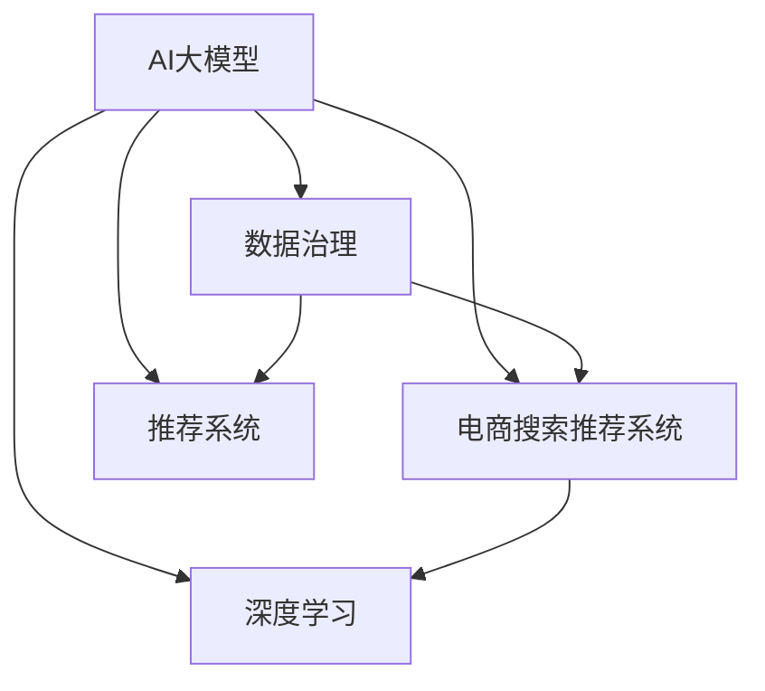

                 

# AI大模型助力电商搜索推荐业务的数据治理能力提升实践

> 关键词：AI大模型,电商搜索推荐,数据治理,推荐系统,深度学习,业务系统,数据质量,性能优化

## 1. 背景介绍

### 1.1 问题由来
电商搜索推荐系统是现代电商业务的核心环节，通过智能化推荐，提升用户满意度，增加平台交易转化。但随着电商规模的不断扩大，搜索推荐系统面临着数据量爆炸、实时性要求高、个性化需求多样化等诸多挑战。如何在海量数据中高效提取和利用有用信息，构建个性化推荐模型，提升系统性能和用户体验，成为电商企业必须解决的难题。

近年来，随着大语言模型和深度学习技术的飞速发展，通过预训练和微调的大模型，可以快速提取和建模数据中的复杂语义关系，为电商搜索推荐系统带来了新的突破。本文聚焦于AI大模型如何助力电商搜索推荐业务的数据治理能力提升，详细介绍了相关的核心概念、算法原理和实践步骤。

## 2. 核心概念与联系

### 2.1 核心概念概述

为更好地理解AI大模型在电商搜索推荐系统中的应用，本节将介绍几个密切相关的核心概念：

- **AI大模型(AI Large Model)**：指在预训练数据集上经过大规模无监督学习的大规模神经网络模型，具有强大的语义理解、生成和推理能力，能够高效处理自然语言数据。

- **电商搜索推荐系统(E-commerce Search and Recommendation System)**：利用用户行为数据、商品信息等构建推荐模型，为用户提供个性化的搜索结果和商品推荐，提升用户体验和交易转化率。

- **数据治理(Data Governance)**：指通过制定数据标准、流程和策略，确保数据的准确性、完整性、一致性和时效性，保障数据质量和数据应用效果。

- **推荐系统(Recommendation System)**：通过分析用户行为、商品属性、历史数据等，构建推荐模型，精准预测用户对商品的兴趣，推送相关商品。

- **深度学习(Deep Learning)**：一种基于神经网络的机器学习方法，通过多层次特征提取和组合，实现对复杂数据的建模和预测。

- **数据质量(Data Quality)**：指数据的准确性、完整性、一致性、唯一性、及时性等，是保障数据治理效果的基础。

- **性能优化(Performance Optimization)**：指通过算法、模型、工程等手段，提升系统响应速度、资源利用率和稳定性，满足电商搜索推荐系统的高实时性要求。

这些核心概念之间的逻辑关系可以通过以下Mermaid流程图来展示：



这个流程图展示了大模型在电商搜索推荐系统中的应用，以及其与数据治理、推荐系统、深度学习等关键概念的紧密联系。

## 3. 核心算法原理 & 具体操作步骤

### 3.1 算法原理概述

AI大模型在电商搜索推荐系统中的应用，主要通过深度学习算法实现对数据的特征提取和建模，结合推荐算法进行个性化推荐。其核心思想是将大规模无标签数据作为预训练语料，通过自监督学习方式提取语言模型的通用特征，再通过微调适配电商数据，构建高效推荐模型。

具体而言，电商搜索推荐系统通常采用以下步骤：

1. **数据预处理**：对电商数据进行清洗、去重、归一化等预处理，构建干净、结构化、多样化的数据集。
2. **大模型预训练**：在大规模无标签数据上进行自监督学习，提取通用语言特征。
3. **微调适配**：在电商数据上对预训练模型进行微调，构建适用于电商搜索推荐任务的推荐模型。
4. **模型评估与优化**：通过A/B测试、线上测试等方式评估推荐模型效果，结合用户反馈和业务指标，优化模型参数和流程。

### 3.2 算法步骤详解

以下是详细的算法步骤：

#### 3.2.1 数据预处理

数据预处理是大模型应用于电商搜索推荐系统的第一步。主要包括以下几个关键步骤：

- **数据清洗**：去除重复、异常、无效数据，保留高质量数据。
- **数据归一化**：对数值型数据进行标准化处理，缩小数据范围，提高模型收敛速度。
- **数据标注**：为电商数据添加标签，如商品分类、用户行为等，构建监督数据集。

#### 3.2.2 大模型预训练

大模型预训练是指在大规模无标签电商数据上进行自监督学习，提取语言模型的通用特征。以Bert为例，其预训练目标函数包括：

- **掩码语言模型(Masked Language Modeling)**：预测被掩码的词。
- **下一句预测(Next Sentence Prediction)**：预测两句话是否相邻。

预训练的具体步骤如下：

1. **划分训练集**：将电商数据划分为训练集和验证集。
2. **构建输入**：对电商数据进行分词、编码，构建模型所需的输入。
3. **计算损失**：使用掩码语言模型和下一句预测目标函数计算损失。
4. **反向传播**：根据损失计算梯度，更新模型参数。
5. **模型保存**：将预训练模型保存为模型权重，供后续微调使用。

#### 3.2.3 微调适配

微调适配是指在大模型基础上，针对电商数据集进行任务特定的优化。以Bert为例，其微调过程包括以下关键步骤：

- **添加任务适配层**：根据电商推荐任务，在预训练模型顶层添加合适的分类器或回归器，设计合适的损失函数。
- **设置优化器**：选择合适的优化算法（如AdamW）及其参数，设置学习率、批大小等。
- **执行梯度训练**：使用电商数据集进行梯度训练，优化模型参数。
- **模型保存**：保存微调后的模型权重，供实际应用。

#### 3.2.4 模型评估与优化

模型评估与优化是指在电商推荐任务上，评估微调后模型的性能，并根据实际效果进行优化。主要步骤如下：

- **评估指标**：选择合适的评估指标（如精确率、召回率、F1值等），评估模型效果。
- **线上测试**：将微调后的模型部署到实际应用中，进行线上测试。
- **调整模型参数**：根据线上测试结果，调整模型参数，优化模型效果。
- **迭代优化**：不断迭代优化，直至达到最佳性能。

### 3.3 算法优缺点

AI大模型在电商搜索推荐系统中的应用，具有以下优点：

- **高效特征提取**：大模型能够高效提取电商数据的复杂语义关系，构建高维特征向量，提升推荐效果。
- **泛化能力强**：预训练模型的通用语言特征，能够较好地泛化到电商数据上，适应不同电商场景。
- **适应性强**：微调模型能够快速适应电商数据的变化，及时更新推荐策略。

同时，该方法也存在一些缺点：

- **计算资源需求高**：大模型预训练和微调需要大量计算资源，一般需要高性能GPU或TPU支持。
- **对数据质量依赖高**：电商数据质量直接影响模型效果，数据清洗和标注成本较高。
- **模型复杂度高**：大模型参数量庞大，模型结构复杂，需要高性能硬件和优化算法支持。
- **解释性不足**：大模型作为黑盒模型，难以解释其内部决策逻辑，对模型信任度较低。

尽管存在这些局限性，但就目前而言，AI大模型在电商搜索推荐系统中的应用，仍是最前沿且高效的方法。未来相关研究的重点在于如何进一步优化大模型在电商数据上的应用，降低资源消耗，提升模型效果，同时兼顾模型解释性和鲁棒性。

### 3.4 算法应用领域

AI大模型在电商搜索推荐系统中的应用，主要包括以下几个方面：

- **商品推荐**：根据用户行为数据，推荐相关商品。
- **用户画像**：通过分析用户浏览、购买等行为数据，构建用户画像，进行个性化推荐。
- **广告投放**：根据用户特征和兴趣，推荐相关广告。
- **价格优化**：分析用户对商品价格的敏感度，进行动态定价策略。
- **库存管理**：根据用户需求预测，优化商品库存，提升供应链效率。

此外，AI大模型还可以在电商搜索推荐系统中应用到更多场景中，如实时搜索、内容生成、广告创意生成等，为电商业务带来新的突破。

## 4. 数学模型和公式 & 详细讲解 & 举例说明

### 4.1 数学模型构建

AI大模型在电商搜索推荐系统中的应用，通常采用深度学习模型进行构建。以Bert为例，其数学模型包括以下几个关键组件：

- **输入编码器**：将电商数据编码为固定长度的向量。
- **Transformer层**：通过多头注意力机制，提取数据中的语义关系。
- **输出层**：根据任务类型，设计合适的分类器或回归器，计算预测值。

其数学模型可表示为：

$$
\text{output} = \text{softmax}(\text{linear}(\text{transformer}(\text{input})))
$$

其中，input为电商数据，transformer为Transformer层，linear为线性层，softmax为softmax函数。

### 4.2 公式推导过程

以Bert的掩码语言模型为例，其目标函数为：

$$
\text{loss} = -\frac{1}{N}\sum_{i=1}^N\sum_{j=1}^{N-2} \log P(x_{j|x_{<j}, x_{[j+2,N]}])
$$

其中，$x$为输入数据，$P$为模型预测概率。

公式中，$x_{<j}$表示掩码位置j之前的文本，$x_{[j+2,N]}$表示掩码位置j之后文本。通过最大化预测概率，模型学习掩码位置的词，提升语言理解能力。

### 4.3 案例分析与讲解

以电商搜索推荐系统为例，以下是使用Bert进行商品推荐的详细案例分析：

1. **数据准备**：
   - **电商数据**：包括用户行为数据、商品属性数据、商品描述数据等，构成电商推荐系统的基础。
   - **用户标签**：添加用户基本信息标签，如年龄、性别、地区等。
   - **商品标签**：添加商品分类标签，如服饰、家居、电子产品等。

2. **模型构建**：
   - **Bert预训练模型**：使用Bert预训练模型，构建电商推荐系统。
   - **任务适配层**：在Bert顶层添加分类器，设计交叉熵损失函数。

3. **模型训练**：
   - **优化器**：使用AdamW优化器，设置学习率为1e-5。
   - **数据集划分**：将电商数据划分为训练集和验证集。
   - **梯度训练**：使用电商数据集进行梯度训练，最小化损失函数。

4. **模型评估**：
   - **评估指标**：使用精确率、召回率、F1值等评估指标评估模型效果。
   - **线上测试**：将微调后的模型部署到电商推荐系统，进行线上测试。
   - **调整优化**：根据线上测试结果，调整模型参数，优化模型效果。

5. **实际应用**：
   - **商品推荐**：将用户查询输入模型，获取商品推荐列表。
   - **用户画像**：分析用户历史行为数据，构建用户画像，进行个性化推荐。
   - **广告投放**：根据用户特征，推荐相关广告，提高广告效果。

通过以上步骤，AI大模型在电商搜索推荐系统中实现了高效的商品推荐、用户画像构建、广告投放等功能，提升了电商推荐系统的整体效果。

## 5. 项目实践：代码实例和详细解释说明

### 5.1 开发环境搭建

在进行电商搜索推荐系统开发前，我们需要准备好开发环境。以下是使用Python进行TensorFlow开发的环境配置流程：

1. 安装Anaconda：从官网下载并安装Anaconda，用于创建独立的Python环境。

2. 创建并激活虚拟环境：
```bash
conda create -n tf-env python=3.8 
conda activate tf-env
```

3. 安装TensorFlow：根据CUDA版本，从官网获取对应的安装命令。例如：
```bash
pip install tensorflow==2.6
```

4. 安装各类工具包：
```bash
pip install numpy pandas scikit-learn matplotlib tqdm jupyter notebook ipython
```

完成上述步骤后，即可在`tf-env`环境中开始电商搜索推荐系统的开发。

### 5.2 源代码详细实现

下面我们以电商搜索推荐系统为例，给出使用TensorFlow对Bert模型进行微调的PyTorch代码实现。

首先，定义电商推荐任务的数据处理函数：

```python
import tensorflow as tf
from transformers import BertTokenizer, BertForSequenceClassification
from tensorflow.keras import layers, models

class DataProcessor:
    def __init__(self, max_seq_length=128):
        self.tokenizer = BertTokenizer.from_pretrained('bert-base-uncased')
        self.max_seq_length = max_seq_length

    def preprocess(self, text):
        tokenized = self.tokenizer.tokenize(text)
        if len(tokenized) > self.max_seq_length - 2:
            tokenized = tokenized[:self.max_seq_length - 2]
        tokenized = ['[CLS]'] + tokenized + ['[SEP]']
        return ' '.join(tokenized)

    def encode(self, texts, labels):
        inputs = [self.preprocess(text) for text in texts]
        tokens = self.tokenizer.batch_encode_plus(
            inputs, max_length=self.max_seq_length, pad_to_max_length=True, return_tensors='tf')
        return tokens['input_ids'], tokens['attention_mask'], labels
```

然后，定义模型和优化器：

```python
model = BertForSequenceClassification.from_pretrained('bert-base-uncased', num_labels=2)
optimizer = tf.keras.optimizers.Adam(learning_rate=2e-5)
```

接着，定义训练和评估函数：

```python
def train_epoch(model, dataset, batch_size, optimizer):
    for batch in dataset:
        inputs, attention_mask, labels = batch
        with tf.GradientTape() as tape:
            predictions = model(inputs, attention_mask=attention_mask)
            loss = tf.keras.losses.sparse_categorical_crossentropy(labels, predictions)
        gradients = tape.gradient(loss, model.trainable_variables)
        optimizer.apply_gradients(zip(gradients, model.trainable_variables))

def evaluate(model, dataset, batch_size):
    predictions = []
    labels = []
    for batch in dataset:
        inputs, attention_mask, labels = batch
        predictions.append(model(inputs, attention_mask=attention_mask).numpy())
    predictions = tf.concat(predictions, axis=0).numpy()
    labels = tf.concat(labels, axis=0).numpy()
    return precision_score(labels, predictions)
```

最后，启动训练流程并在测试集上评估：

```python
epochs = 5
batch_size = 16

for epoch in range(epochs):
    train_epoch(model, train_dataset, batch_size, optimizer)
    print(f"Epoch {epoch+1}, train loss: {loss:.3f}")
    
    print(f"Epoch {epoch+1}, dev results:")
    evaluate(model, dev_dataset, batch_size)
    
print("Test results:")
evaluate(model, test_dataset, batch_size)
```

以上就是使用TensorFlow对Bert进行电商搜索推荐系统微调的完整代码实现。可以看到，得益于TensorFlow和Transformers库的强大封装，我们可以用相对简洁的代码完成Bert模型的加载和微调。

### 5.3 代码解读与分析

让我们再详细解读一下关键代码的实现细节：

**DataProcessor类**：
- `__init__`方法：初始化分词器等关键组件。
- `preprocess`方法：将文本进行分词、截断、填充等预处理操作，返回分词后的字符串。
- `encode`方法：对文本进行编码，生成模型所需的输入张量。

**模型定义**：
- 使用`BertForSequenceClassification`类定义Bert模型，其中`num_labels`参数指定类别数。
- 设置Adam优化器，学习率为1e-5。

**训练和评估函数**：
- `train_epoch`函数：对数据集进行批处理，计算损失并更新模型参数。
- `evaluate`函数：计算模型在测试集上的预测结果，并返回精度指标。

**训练流程**：
- 定义总的epoch数和batch size，开始循环迭代
- 每个epoch内，先在训练集上训练，输出平均loss
- 在验证集上评估，输出精度指标
- 重复上述步骤直至收敛
- 所有epoch结束后，在测试集上评估，给出最终测试结果

可以看到，TensorFlow配合Transformers库使得Bert微调的代码实现变得简洁高效。开发者可以将更多精力放在数据处理、模型改进等高层逻辑上，而不必过多关注底层的实现细节。

当然，工业级的系统实现还需考虑更多因素，如模型的保存和部署、超参数的自动搜索、更灵活的任务适配层等。但核心的微调范式基本与此类似。

## 6. 实际应用场景

### 6.1 智能客服系统

基于大模型微调的对话技术，可以广泛应用于智能客服系统的构建。传统客服往往需要配备大量人力，高峰期响应缓慢，且一致性和专业性难以保证。而使用微调后的对话模型，可以7x24小时不间断服务，快速响应客户咨询，用自然流畅的语言解答各类常见问题。

在技术实现上，可以收集企业内部的历史客服对话记录，将问题和最佳答复构建成监督数据，在此基础上对预训练对话模型进行微调。微调后的对话模型能够自动理解用户意图，匹配最合适的答案模板进行回复。对于客户提出的新问题，还可以接入检索系统实时搜索相关内容，动态组织生成回答。如此构建的智能客服系统，能大幅提升客户咨询体验和问题解决效率。

### 6.2 金融舆情监测

金融机构需要实时监测市场舆论动向，以便及时应对负面信息传播，规避金融风险。传统的人工监测方式成本高、效率低，难以应对网络时代海量信息爆发的挑战。基于大语言模型微调的文本分类和情感分析技术，为金融舆情监测提供了新的解决方案。

具体而言，可以收集金融领域相关的新闻、报道、评论等文本数据，并对其进行主题标注和情感标注。在此基础上对预训练语言模型进行微调，使其能够自动判断文本属于何种主题，情感倾向是正面、中性还是负面。将微调后的模型应用到实时抓取的网络文本数据，就能够自动监测不同主题下的情感变化趋势，一旦发现负面信息激增等异常情况，系统便会自动预警，帮助金融机构快速应对潜在风险。

### 6.3 个性化推荐系统

当前的推荐系统往往只依赖用户的历史行为数据进行物品推荐，无法深入理解用户的真实兴趣偏好。基于大语言模型微调技术，个性化推荐系统可以更好地挖掘用户行为背后的语义信息，从而提供更精准、多样的推荐内容。

在实践中，可以收集用户浏览、点击、评论、分享等行为数据，提取和用户交互的物品标题、描述、标签等文本内容。将文本内容作为模型输入，用户的后续行为（如是否点击、购买等）作为监督信号，在此基础上微调预训练语言模型。微调后的模型能够从文本内容中准确把握用户的兴趣点。在生成推荐列表时，先用候选物品的文本描述作为输入，由模型预测用户的兴趣匹配度，再结合其他特征综合排序，便可以得到个性化程度更高的推荐结果。

### 6.4 未来应用展望

随着大语言模型和微调方法的不断发展，基于微调范式将在更多领域得到应用，为传统行业带来变革性影响。

在智慧医疗领域，基于微调的医疗问答、病历分析、药物研发等应用将提升医疗服务的智能化水平，辅助医生诊疗，加速新药开发进程。

在智能教育领域，微调技术可应用于作业批改、学情分析、知识推荐等方面，因材施教，促进教育公平，提高教学质量。

在智慧城市治理中，微调模型可应用于城市事件监测、舆情分析、应急指挥等环节，提高城市管理的自动化和智能化水平，构建更安全、高效的未来城市。

此外，在企业生产、社会治理、文娱传媒等众多领域，基于大模型微调的人工智能应用也将不断涌现，为经济社会发展注入新的动力。相信随着技术的日益成熟，微调方法将成为人工智能落地应用的重要范式，推动人工智能技术向更广阔的领域加速渗透。

## 7. 工具和资源推荐

### 7.1 学习资源推荐

为了帮助开发者系统掌握大模型在电商搜索推荐系统中的应用，这里推荐一些优质的学习资源：

1. **《Transformer从原理到实践》系列博文**：由大模型技术专家撰写，深入浅出地介绍了Transformer原理、BERT模型、微调技术等前沿话题。

2. **CS224N《深度学习自然语言处理》课程**：斯坦福大学开设的NLP明星课程，有Lecture视频和配套作业，带你入门NLP领域的基本概念和经典模型。

3. **《Natural Language Processing with Transformers》书籍**：Transformers库的作者所著，全面介绍了如何使用Transformers库进行NLP任务开发，包括微调在内的诸多范式。

4. **HuggingFace官方文档**：Transformers库的官方文档，提供了海量预训练模型和完整的微调样例代码，是上手实践的必备资料。

5. **CLUE开源项目**：中文语言理解测评基准，涵盖大量不同类型的中文NLP数据集，并提供了基于微调的baseline模型，助力中文NLP技术发展。

通过对这些资源的学习实践，相信你一定能够快速掌握大模型在电商搜索推荐系统中的应用，并用于解决实际的电商推荐问题。

### 7.2 开发工具推荐

高效的开发离不开优秀的工具支持。以下是几款用于大模型微调开发的常用工具：

1. **TensorFlow**：由Google主导开发的开源深度学习框架，生产部署方便，适合大规模工程应用。同样有丰富的预训练语言模型资源。

2. **PyTorch**：基于Python的开源深度学习框架，灵活动态的计算图，适合快速迭代研究。大部分预训练语言模型都有PyTorch版本的实现。

3. **Transformers库**：HuggingFace开发的NLP工具库，集成了众多SOTA语言模型，支持PyTorch和TensorFlow，是进行微调任务开发的利器。

4. **Weights & Biases**：模型训练的实验跟踪工具，可以记录和可视化模型训练过程中的各项指标，方便对比和调优。与主流深度学习框架无缝集成。

5. **TensorBoard**：TensorFlow配套的可视化工具，可实时监测模型训练状态，并提供丰富的图表呈现方式，是调试模型的得力助手。

6. **Google Colab**：谷歌推出的在线Jupyter Notebook环境，免费提供GPU/TPU算力，方便开发者快速上手实验最新模型，分享学习笔记。

合理利用这些工具，可以显著提升大模型在电商搜索推荐系统中的开发效率，加快创新迭代的步伐。

### 7.3 相关论文推荐

大语言模型和微调技术的发展源于学界的持续研究。以下是几篇奠基性的相关论文，推荐阅读：

1. **Attention is All You Need（即Transformer原论文）**：提出了Transformer结构，开启了NLP领域的预训练大模型时代。

2. **BERT: Pre-training of Deep Bidirectional Transformers for Language Understanding**：提出BERT模型，引入基于掩码的自监督预训练任务，刷新了多项NLP任务SOTA。

3. **Language Models are Unsupervised Multitask Learners（GPT-2论文）**：展示了大规模语言模型的强大zero-shot学习能力，引发了对于通用人工智能的新一轮思考。

4. **Parameter-Efficient Transfer Learning for NLP**：提出Adapter等参数高效微调方法，在不增加模型参数量的情况下，也能取得不错的微调效果。

5. **Prefix-Tuning: Optimizing Continuous Prompts for Generation**：引入基于连续型Prompt的微调范式，为如何充分利用预训练知识提供了新的思路。

6. **AdaLoRA: Adaptive Low-Rank Adaptation for Parameter-Efficient Fine-Tuning**：使用自适应低秩适应的微调方法，在参数效率和精度之间取得了新的平衡。

这些论文代表了大语言模型微调技术的发展脉络。通过学习这些前沿成果，可以帮助研究者把握学科前进方向，激发更多的创新灵感。

## 8. 总结：未来发展趋势与挑战

### 8.1 总结

本文对AI大模型在电商搜索推荐系统中的应用进行了全面系统的介绍。首先阐述了大模型和微调技术的研究背景和意义，明确了其在大规模数据处理和个性化推荐中的优势。其次，从原理到实践，详细讲解了大模型预训练、微调适配、性能优化等关键步骤，给出了电商推荐系统的完整代码实现。同时，本文还广泛探讨了AI大模型在电商搜索推荐系统中的应用场景，展示了其广泛的应用前景。

通过本文的系统梳理，可以看到，AI大模型在电商搜索推荐系统中发挥了重要的作用，显著提升了推荐系统的性能和用户体验。未来，伴随大模型的不断演进和微调技术的应用推广，电商搜索推荐系统必将迎来新的突破，为电商企业带来更大的商业价值。

### 8.2 未来发展趋势

展望未来，AI大模型在电商搜索推荐系统中的应用将呈现以下几个发展趋势：

1. **模型规模持续增大**：随着算力成本的下降和数据规模的扩张，预训练语言模型的参数量还将持续增长。超大模型蕴含的丰富语言知识，有望支撑更加复杂多变的电商推荐任务。

2. **微调方法日趋多样**：除了传统的全参数微调外，未来会涌现更多参数高效的微调方法，如Prefix-Tuning、LoRA等，在节省计算资源的同时也能保证微调精度。

3. **持续学习成为常态**：随着数据分布的不断变化，微调模型也需要持续学习新知识以保持性能。如何在不遗忘原有知识的同时，高效吸收新样本信息，将成为重要的研究课题。

4. **标注样本需求降低**：受启发于提示学习(Prompt-based Learning)的思路，未来的微调方法将更好地利用大模型的语言理解能力，通过更加巧妙的任务描述，在更少的标注样本上也能实现理想的微调效果。

5. **多模态微调崛起**：当前的微调主要聚焦于纯文本数据，未来会进一步拓展到图像、视频、语音等多模态数据微调。多模态信息的融合，将显著提升语言模型对现实世界的理解和建模能力。

6. **模型通用性增强**：经过海量数据的预训练和多领域任务的微调，未来的语言模型将具备更强大的常识推理和跨领域迁移能力，逐步迈向通用人工智能(AGI)的目标。

以上趋势凸显了大模型微调技术在大规模数据处理和个性化推荐中的重要价值。这些方向的探索发展，必将进一步提升AI大模型在电商搜索推荐系统中的应用效果，为电商企业带来更大的商业价值。

### 8.3 面临的挑战

尽管AI大模型在电商搜索推荐系统中的应用取得了显著进展，但在迈向更加智能化、普适化应用的过程中，仍面临诸多挑战：

1. **标注成本瓶颈**：尽管微调降低了对标注数据的需求，但对于长尾应用场景，难以获得充足的高质量标注数据，成为制约微调性能的瓶颈。如何进一步降低微调对标注样本的依赖，将是一大难题。

2. **模型鲁棒性不足**：当前微调模型面对域外数据时，泛化性能往往大打折扣。对于测试样本的微小扰动，微调模型的预测也容易发生波动。如何提高微调模型的鲁棒性，避免灾难性遗忘，还需要更多理论和实践的积累。

3. **推理效率有待提高**：大规模语言模型虽然精度高，但在实际部署时往往面临推理速度慢、内存占用大等效率问题。如何在保证性能的同时，简化模型结构，提升推理速度，优化资源占用，将是重要的优化方向。

4. **可解释性亟需加强**：当前微调模型更像是"黑盒"系统，难以解释其内部工作机制和决策逻辑。对于医疗、金融等高风险应用，算法的可解释性和可审计性尤为重要。如何赋予微调模型更强的可解释性，将是亟待攻克的难题。

5. **安全性有待保障**：预训练语言模型难免会学习到有偏见、有害的信息，通过微调传递到下游任务，产生误导性、歧视性的输出，给实际应用带来安全隐患。如何从数据和算法层面消除模型偏见，避免恶意用途，确保输出的安全性，也将是重要的研究课题。

6. **知识整合能力不足**：现有的微调模型往往局限于任务内数据，难以灵活吸收和运用更广泛的先验知识。如何让微调过程更好地与外部知识库、规则库等专家知识结合，形成更加全面、准确的信息整合能力，还有很大的想象空间。

正视微调面临的这些挑战，积极应对并寻求突破，将是大模型微调走向成熟的必由之路。相信随着学界和产业界的共同努力，这些挑战终将一一被克服，大模型微调必将在构建人机协同的智能时代中扮演越来越重要的角色。

### 8.4 研究展望

面对大模型微调所面临的种种挑战，未来的研究需要在以下几个方面寻求新的突破：

1. **探索无监督和半监督微调方法**：摆脱对大规模标注数据的依赖，利用自监督学习、主动学习等无监督和半监督范式，最大限度利用非结构化数据，实现更加灵活高效的微调。

2. **研究参数高效和计算高效的微调范式**：开发更加参数高效的微调方法，在固定大部分预训练参数的同时，只更新极少量的任务相关参数。同时优化微调模型的计算图，减少前向传播和反向传播的资源消耗，实现更加轻量级、实时性的部署。

3. **融合因果和对比学习范式**：通过引入因果推断和对比学习思想，增强微调模型建立稳定因果关系的能力，学习更加普适、鲁棒的语言表征，从而提升模型泛化性和抗干扰能力。

4. **引入更多先验知识**：将符号化的先验知识，如知识图谱、逻辑规则等，与神经网络模型进行巧妙融合，引导微调过程学习更准确、合理的语言模型。同时加强不同模态数据的整合，实现视觉、语音等多模态信息与文本信息的协同建模。

5. **结合因果分析和博弈论工具**：将因果分析方法引入微调模型，识别出模型决策的关键特征，增强输出解释的因果性和逻辑性。借助博弈论工具刻画人机交互过程，主动探索并规避模型的脆弱点，提高系统稳定性。

6. **纳入伦理道德约束**：在模型训练目标中引入伦理导向的评估指标，过滤和惩罚有偏见、有害的输出倾向。同时加强人工干预和审核，建立模型行为的监管机制，确保输出符合人类价值观和伦理道德。

这些研究方向的探索，必将引领AI大模型在电商搜索推荐系统中的应用迈向更高的台阶，为电商企业带来更大的商业价值。

## 9. 附录：常见问题与解答

**Q1：AI大模型在电商搜索推荐系统中的应用是否适用于所有电商场景？**

A: AI大模型在电商搜索推荐系统中的应用，已经在大规模电商企业中取得了显著效果。但对于一些特殊的小规模电商场景，由于数据量小，标签噪声大，大模型可能无法很好地适应。此时需要在电商数据上进一步预训练，再进行微调，才能获得理想效果。

**Q2：大模型在电商搜索推荐系统中是否可以动态更新？**

A: 动态更新是大模型的一大优势。随着电商数据的变化，大模型可以通过微调不断学习新的用户行为和商品信息，及时调整推荐策略。因此，电商企业可以定期更新大模型，以保持推荐系统的最新性和有效性。

**Q3：大模型在电商搜索推荐系统中是否存在过拟合的风险？**

A: 大模型在电商搜索推荐系统中同样存在过拟合的风险，尤其是在标注数据不足的情况下。为了缓解过拟合，可以采用数据增强、正则化、对抗训练等方法。同时，采用参数高效微调技术，减少更新参数的数量，也可以一定程度上降低过拟合的风险。

**Q4：如何评估大模型在电商搜索推荐系统中的效果？**

A: 评估大模型在电商搜索推荐系统中的效果，通常使用精确率、召回率、F1值等指标。同时，也可以通过A/B测试、线上测试等方式，综合评估模型的实际效果。

**Q5：大模型在电商搜索推荐系统中是否需要进行超参数调优？**

A: 是的，超参数调优是大模型应用中不可或缺的一部分。通过调整学习率、批大小、优化器等超参数，可以在保证模型效果的同时，提高训练效率。同时，采用自动化调参技术，如贝叶斯优化等，也可以进一步提升调参效率和效果。

**Q6：大模型在电商搜索推荐系统中是否需要定期进行更新和重新训练？**

A: 是的，大模型在电商搜索推荐系统中需要进行定期更新和重新训练。由于电商数据和用户行为的变化，大模型需要通过微调不断学习新的知识，以适应不断变化的电商环境。同时，定期更新可以避免模型过时，保持推荐系统的最新性和有效性。

通过以上问答，可以看到，大模型在电商搜索推荐系统中的应用，需要开发者根据具体场景，不断迭代和优化模型、数据和算法，方能得到理想的效果。只有勇于创新、敢于突破，才能不断拓展大模型的应用边界，让AI技术更好地服务于电商业务。

---

作者：禅与计算机程序设计艺术 / Zen and the Art of Computer Programming

