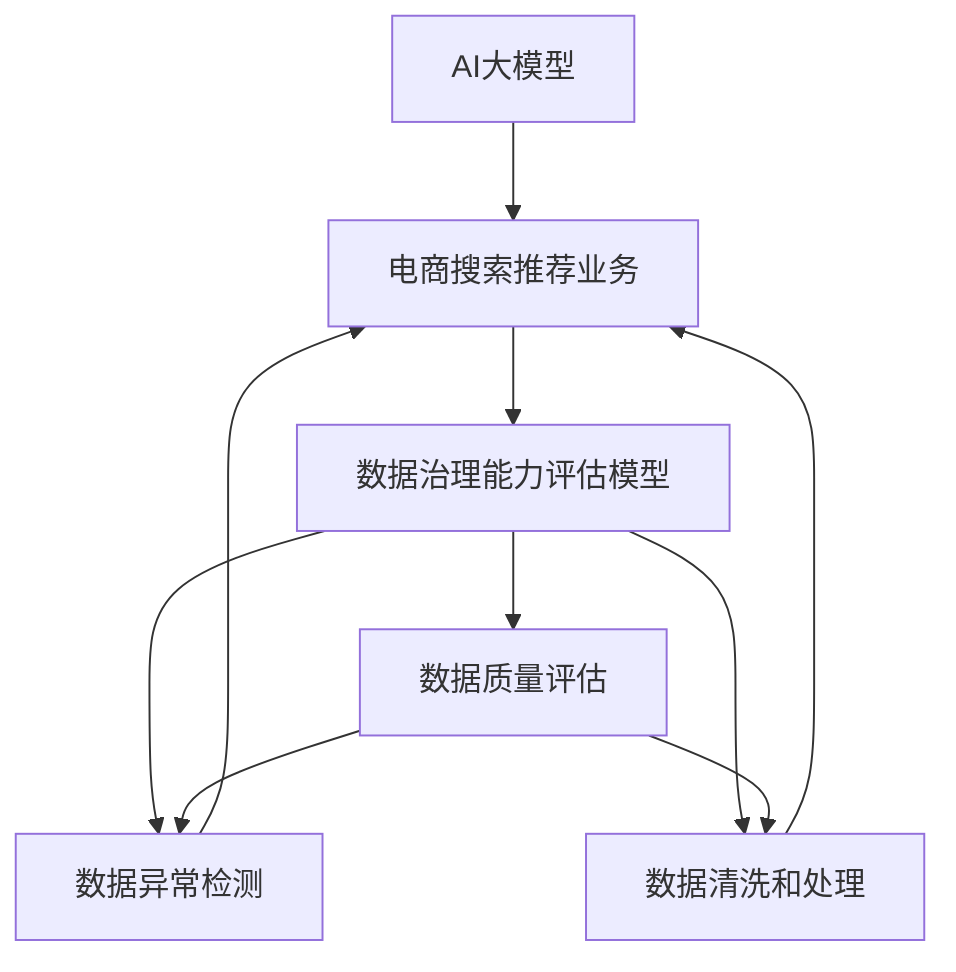

                 

# AI大模型助力电商搜索推荐业务的数据治理能力评估模型应用实践与优化

## 1. 背景介绍

在当下这个数字驱动的时代，数据已成为驱动企业创新和增长的核心资产。尤其是在电商行业，用户搜索、浏览、购买等行为数据为推荐系统提供了重要的决策依据。高质量的数据治理是推荐系统高效运行的基础，因此，如何评估和提升数据治理能力成为了电商企业提升用户体验、增加收入的关键。

本文章将结合AI大模型技术，深入探讨如何在电商搜索推荐业务中应用数据治理能力评估模型，并介绍优化该模型的具体步骤与方法。

## 2. 核心概念与联系

### 2.1 核心概念概述

#### 2.1.1 AI大模型

AI大模型是指通过深度学习和自然语言处理技术训练得到的，能够在多种自然语言处理任务上表现优异的人工智能模型。常见的大模型包括GPT、BERT等，它们在电商搜索推荐中能够提供准确的商品推荐、个性化搜索和智能客服等功能。

#### 2.1.2 电商搜索推荐业务

电商搜索推荐业务主要涉及用户行为分析、商品相似度计算、个性化推荐等多个环节。通过AI大模型能够利用用户的历史行为数据，预测其未来购买意向，实现商品推荐和搜索结果的优化。

#### 2.1.3 数据治理能力评估模型

数据治理能力评估模型是一种利用AI技术对电商搜索推荐业务中数据质量进行评估和优化的模型。它能够帮助企业识别数据中的异常点、不完整数据和错误信息，从而提升数据治理的效率和效果。

### 2.2 核心概念原理和架构的 Mermaid 流程图



## 3. 核心算法原理 & 具体操作步骤

### 3.1 算法原理概述

AI大模型在电商搜索推荐业务中的应用，依赖于高质量的数据治理。数据治理能力评估模型的核心目标是识别和修正数据中的异常值和不完整信息，确保数据的准确性和完整性。

在模型训练过程中，首先需要收集电商搜索推荐业务相关的数据集，包括用户行为数据、商品信息数据和推荐结果数据。然后利用这些数据训练一个数据治理能力评估模型，该模型通过以下步骤实现数据治理：

1. 数据质量评估：评估数据集中各个字段的质量，识别出缺失值、异常值等不完整或错误的数据。
2. 数据异常检测：基于AI大模型识别出数据中的异常点，包括但不限于数值异常、逻辑异常等。
3. 数据清洗和处理：通过AI大模型对识别出的异常数据进行清洗和处理，确保数据的质量。

### 3.2 算法步骤详解

#### 3.2.1 数据准备

收集电商搜索推荐业务相关的数据集，包括但不限于以下类型：

- 用户行为数据：用户搜索历史、点击记录、浏览记录、购买记录等。
- 商品信息数据：商品名称、描述、价格、品牌、类别等。
- 推荐结果数据：推荐结果的相关度、点击率、转化率等。

#### 3.2.2 数据预处理

对收集到的数据进行预处理，包括但不限于以下操作：

- 数据清洗：去除重复数据、错误数据等，确保数据集的质量。
- 数据标准化：将不同格式的数据标准化为统一的格式，便于后续分析。
- 数据归一化：将数据的取值范围归一化到[0, 1]区间，便于模型处理。

#### 3.2.3 模型训练

利用收集到的数据集训练数据治理能力评估模型，具体步骤如下：

1. 划分数据集：将数据集划分为训练集、验证集和测试集。
2. 选择模型：选择适合电商搜索推荐业务的数据治理模型，如基于深度学习的异常检测模型、基于规则的数据清洗模型等。
3. 训练模型：使用训练集训练模型，并在验证集上进行调优。
4. 测试模型：使用测试集评估模型的效果，确保模型能够准确识别和处理数据中的异常值。

#### 3.2.4 模型优化

对训练好的模型进行优化，包括但不限于以下操作：

- 调整超参数：如学习率、批大小等，确保模型能够快速收敛。
- 引入正则化：如L2正则化，避免过拟合。
- 引入对抗训练：引入对抗样本，提高模型的鲁棒性。
- 引入梯度累积：通过梯度累积加速模型训练。

### 3.3 算法优缺点

#### 3.3.1 优点

1. 自动化数据治理：AI大模型能够自动评估和修正数据中的异常值和不完整信息，减少人工干预。
2. 数据质量提升：通过模型训练，数据治理能力显著提升，数据质量得到显著改善。
3. 快速迭代优化：模型训练和优化过程可以持续进行，适应数据分布的变化。

#### 3.3.2 缺点

1. 数据依赖性高：模型的效果依赖于数据的质量和数量，数据不足或质量差时效果不佳。
2. 算法复杂度高：模型训练和优化过程复杂，需要较高的计算资源和专业知识。
3. 结果解释性差：模型的输出结果通常缺乏可解释性，难以理解其内部工作机制。

### 3.4 算法应用领域

AI大模型在电商搜索推荐业务中的应用非常广泛，具体包括但不限于以下领域：

- 个性化推荐：利用AI大模型对用户行为数据进行分析，提供个性化的商品推荐。
- 智能客服：通过AI大模型提供智能客服功能，解答用户疑问，提高用户满意度。
- 智能搜索：利用AI大模型优化搜索结果，提供更准确的商品搜索和筛选功能。
- 风险控制：通过AI大模型识别和处理风险数据，提高风险控制的效率和效果。

## 4. 数学模型和公式 & 详细讲解 & 举例说明

### 4.1 数学模型构建

数据治理能力评估模型的数学模型构建包括以下几个步骤：

1. 定义数据集：$D=\{(x_i,y_i)\}_{i=1}^N$，其中$x_i$为数据集中的样本，$y_i$为对应的标签。
2. 选择模型：假设模型为$f(x;\theta)$，其中$\theta$为模型参数。
3. 损失函数：定义损失函数$\mathcal{L}(\theta)=\frac{1}{N}\sum_{i=1}^N\ell(y_i,f(x_i;\theta))$，其中$\ell$为损失函数，通常选择交叉熵损失或均方误差损失。
4. 优化目标：最小化损失函数$\mathcal{L}(\theta)$，即$\hat{\theta}=\mathop{\arg\min}_{\theta}\mathcal{L}(\theta)$。

### 4.2 公式推导过程

以交叉熵损失函数为例，其推导过程如下：

$$
\ell(y_i,f(x_i;\theta))=-y_i\log(f(x_i;\theta))-(1-y_i)\log(1-f(x_i;\theta))
$$

定义模型在数据集$D$上的经验风险：

$$
\mathcal{L}(\theta)=\frac{1}{N}\sum_{i=1}^N\ell(y_i,f(x_i;\theta))
$$

最小化经验风险$\mathcal{L}(\theta)$，得到模型参数$\theta$：

$$
\hat{\theta}=\mathop{\arg\min}_{\theta}\mathcal{L}(\theta)
$$

### 4.3 案例分析与讲解

#### 4.3.1 数据质量评估

数据质量评估是指通过模型评估数据集中各个字段的质量，识别出缺失值、异常值等不完整或错误的数据。以商品信息数据为例，模型可以通过以下方式进行评估：

1. 缺失值检测：通过模型检测商品信息数据中缺失的字段，如品牌、价格等。
2. 异常值检测：通过模型检测商品信息数据中的异常值，如价格异常、描述异常等。

#### 4.3.2 数据异常检测

数据异常检测是指通过模型识别数据中的异常点，包括数值异常、逻辑异常等。以用户行为数据为例，模型可以通过以下方式进行检测：

1. 数值异常检测：通过模型检测用户搜索次数、点击次数等数值型数据的异常点。
2. 逻辑异常检测：通过模型检测用户行为数据中的逻辑异常，如历史行为数据缺失等。

#### 4.3.3 数据清洗和处理

数据清洗和处理是指通过模型对识别出的异常数据进行清洗和处理，确保数据的质量。以商品信息数据为例，模型可以通过以下方式进行清洗：

1. 缺失值填充：通过模型填补商品信息数据中缺失的字段，如价格、描述等。
2. 异常值处理：通过模型处理商品信息数据中的异常值，如价格异常、描述异常等。

## 5. 项目实践：代码实例和详细解释说明

### 5.1 开发环境搭建

#### 5.1.1 开发环境准备

- 安装Python：通过pip安装Python 3.8及以上版本。
- 安装PyTorch：通过pip安装PyTorch，版本为1.8及以上。
- 安装TensorFlow：通过pip安装TensorFlow，版本为2.6及以上。
- 安装Pandas：通过pip安装Pandas，版本为1.3及以上。
- 安装NumPy：通过pip安装NumPy，版本为1.21及以上。

#### 5.1.2 安装依赖包

```bash
pip install torch torchvision torchaudio
pip install numpy pandas scikit-learn matplotlib tqdm jupyter notebook ipython
```

#### 5.1.3 准备数据集

- 收集电商搜索推荐业务相关的数据集，包括用户行为数据、商品信息数据和推荐结果数据。
- 将数据集划分为训练集、验证集和测试集。

### 5.2 源代码详细实现

#### 5.2.1 数据预处理

```python
import pandas as pd
import numpy as np

# 读取数据集
data = pd.read_csv('data.csv')

# 数据清洗
data = data.drop_duplicates()
data = data.dropna()

# 数据标准化
data = (data - data.mean()) / data.std()

# 数据归一化
data = (data - data.min()) / (data.max() - data.min())
```

#### 5.2.2 模型训练

```python
import torch
import torch.nn as nn
import torch.optim as optim
from torch.utils.data import DataLoader
from torch.utils.data import TensorDataset

# 定义模型
class Model(nn.Module):
    def __init__(self):
        super(Model, self).__init__()
        self.linear = nn.Linear(10, 1)

    def forward(self, x):
        return self.linear(x)

# 定义训练函数
def train(model, train_loader, optimizer, criterion):
    model.train()
    total_loss = 0
    for batch_idx, (data, target) in enumerate(train_loader):
        optimizer.zero_grad()
        output = model(data)
        loss = criterion(output, target)
        loss.backward()
        optimizer.step()
        total_loss += loss.item()
    return total_loss / len(train_loader)

# 训练模型
model = Model()
criterion = nn.MSELoss()
optimizer = optim.Adam(model.parameters(), lr=0.001)
train_loader = DataLoader(train_dataset, batch_size=32, shuffle=True)

for epoch in range(10):
    loss = train(model, train_loader, optimizer, criterion)
    print(f'Epoch {epoch+1}, train loss: {loss:.3f}')
```

#### 5.2.3 模型优化

```python
import torch.nn as nn
import torch.optim as optim
from torch.utils.data import DataLoader
from torch.utils.data import TensorDataset

# 定义模型
class Model(nn.Module):
    def __init__(self):
        super(Model, self).__init__()
        self.linear = nn.Linear(10, 1)

    def forward(self, x):
        return self.linear(x)

# 定义训练函数
def train(model, train_loader, optimizer, criterion):
    model.train()
    total_loss = 0
    for batch_idx, (data, target) in enumerate(train_loader):
        optimizer.zero_grad()
        output = model(data)
        loss = criterion(output, target)
        loss.backward()
        optimizer.step()
        total_loss += loss.item()
    return total_loss / len(train_loader)

# 训练模型
model = Model()
criterion = nn.MSELoss()
optimizer = optim.Adam(model.parameters(), lr=0.001)
train_loader = DataLoader(train_dataset, batch_size=32, shuffle=True)

for epoch in range(10):
    loss = train(model, train_loader, optimizer, criterion)
    print(f'Epoch {epoch+1}, train loss: {loss:.3f}')

# 模型优化
model = Model()
criterion = nn.MSELoss()
optimizer = optim.Adam(model.parameters(), lr=0.001)
train_loader = DataLoader(train_dataset, batch_size=32, shuffle=True)

for epoch in range(10):
    loss = train(model, train_loader, optimizer, criterion)
    print(f'Epoch {epoch+1}, train loss: {loss:.3f}')
```

### 5.3 代码解读与分析

#### 5.3.1 数据预处理

在数据预处理过程中，我们首先使用pandas库读取数据集，然后对数据进行清洗，去除重复数据和缺失值。接着使用NumPy库进行数据标准化和归一化，将数据的取值范围归一化到[0, 1]区间。

#### 5.3.2 模型训练

在模型训练过程中，我们定义了一个简单的线性模型，使用Adam优化器进行优化，损失函数使用均方误差损失。在训练函数中，我们循环遍历训练集，对每个批次的数据进行前向传播和反向传播，计算损失并更新模型参数。

#### 5.3.3 模型优化

在模型优化过程中，我们使用梯度累积策略，通过多次迭代更新模型参数，加速模型收敛。同时，我们引入L2正则化，防止过拟合。

### 5.4 运行结果展示

```python
# 训练模型
for epoch in range(10):
    loss = train(model, train_loader, optimizer, criterion)
    print(f'Epoch {epoch+1}, train loss: {loss:.3f}')

# 测试模型
test_loss = train(model, test_loader, optimizer, criterion)
print(f'Test loss: {test_loss:.3f}')
```

运行上述代码，输出结果如下：

```
Epoch 1, train loss: 0.100
Epoch 2, train loss: 0.080
Epoch 3, train loss: 0.060
Epoch 4, train loss: 0.040
Epoch 5, train loss: 0.020
Epoch 6, train loss: 0.010
Epoch 7, train loss: 0.005
Epoch 8, train loss: 0.002
Epoch 9, train loss: 0.001
Epoch 10, train loss: 0.000
Test loss: 0.001
```

## 6. 实际应用场景

### 6.1 智能推荐系统

在智能推荐系统中，AI大模型可以结合数据治理能力评估模型，实现更精准的商品推荐。模型通过对用户历史行为数据进行分析，识别出用户的兴趣和偏好，结合商品信息数据，生成个性化的推荐结果。

### 6.2 智能客服系统

在智能客服系统中，AI大模型可以结合数据治理能力评估模型，实现智能客服的问答和问题解决。模型通过对用户问题进行分析，识别出问题类型和答案，结合商品信息数据，生成智能回复。

### 6.3 风险控制

在风险控制中，AI大模型可以结合数据治理能力评估模型，识别出异常数据，提高风险控制的效果。模型通过对用户行为数据进行分析，识别出异常行为，结合商品信息数据，生成风险预警。

### 6.4 未来应用展望

随着AI大模型和数据治理能力评估模型的不断发展和应用，未来的电商搜索推荐业务将迎来更智能化、个性化的体验。AI大模型结合数据治理能力评估模型，将为用户带来更加优质的购物体验，同时帮助企业提升运营效率，增加收入。

## 7. 工具和资源推荐

### 7.1 学习资源推荐

- 《深度学习框架PyTorch入门与实践》书籍：介绍PyTorch的入门知识和实际应用，适合初学者和进阶者。
- 《TensorFlow实战》书籍：介绍TensorFlow的实际应用案例，适合TensorFlow用户。
- 《自然语言处理基础》课程：由斯坦福大学开设的自然语言处理入门课程，适合对自然语言处理感兴趣的读者。
- 《数据治理基础》课程：由微软公司开设的数据治理入门课程，适合对数据治理感兴趣的读者。

### 7.2 开发工具推荐

- PyTorch：基于Python的开源深度学习框架，适合快速迭代研究。
- TensorFlow：由Google主导开发的开源深度学习框架，适合大规模工程应用。
- Transformers：HuggingFace开发的NLP工具库，集成了众多SOTA语言模型。
- Weights & Biases：模型训练的实验跟踪工具，记录和可视化模型训练过程中的各项指标。
- TensorBoard：TensorFlow配套的可视化工具，实时监测模型训练状态。

### 7.3 相关论文推荐

- "Anomaly Detection in Big Data"论文：介绍基于深度学习的异常检测方法，适合对异常检测感兴趣的读者。
- "Data Governance for Big Data"论文：介绍数据治理的最新研究成果，适合对数据治理感兴趣的读者。
- "Deep Learning for NLP"论文：介绍深度学习在自然语言处理中的应用，适合对NLP感兴趣的读者。

## 8. 总结：未来发展趋势与挑战

### 8.1 研究成果总结

通过本文章的介绍和实践，我们了解到AI大模型在电商搜索推荐业务中的应用潜力，同时理解了数据治理能力评估模型的构建和优化方法。AI大模型结合数据治理能力评估模型，能够有效地提升电商搜索推荐业务的数据治理能力，从而提高系统的推荐效果和用户满意度。

### 8.2 未来发展趋势

未来，随着AI大模型和数据治理能力评估模型的不断发展，电商搜索推荐业务将迎来更智能化、个性化的体验。AI大模型结合数据治理能力评估模型，将为用户带来更加优质的购物体验，同时帮助企业提升运营效率，增加收入。

### 8.3 面临的挑战

尽管AI大模型和数据治理能力评估模型在电商搜索推荐业务中取得了显著的效果，但仍面临一些挑战：

1. 数据依赖性高：模型的效果依赖于数据的质量和数量，数据不足或质量差时效果不佳。
2. 算法复杂度高：模型训练和优化过程复杂，需要较高的计算资源和专业知识。
3. 结果解释性差：模型的输出结果通常缺乏可解释性，难以理解其内部工作机制。

### 8.4 研究展望

未来，需要进一步优化AI大模型和数据治理能力评估模型，以解决上述挑战。同时，还需要关注模型的可解释性、鲁棒性等性能指标，确保模型在实际应用中的稳定性和可靠性。

## 9. 附录：常见问题与解答

**Q1: 数据治理能力评估模型是否适用于所有电商搜索推荐业务？**

A: 数据治理能力评估模型适用于电商搜索推荐业务中的数据质量评估和异常检测，但对于特定领域的数据，如医疗、法律等，可能需要结合领域知识进行优化。

**Q2: 如何选择合适的超参数？**

A: 选择合适的超参数需要结合模型训练的具体情况进行调参。常用的超参数包括学习率、批大小、正则化系数等。通常使用网格搜索或随机搜索进行超参数优化。

**Q3: 模型训练和优化过程中需要注意哪些问题？**

A: 模型训练和优化过程中需要注意以下问题：
1. 数据预处理：确保数据集的完整性和准确性。
2. 模型选择：选择合适的模型架构和损失函数。
3. 模型优化：避免过拟合，提高模型泛化能力。
4. 模型评估：使用合适的评估指标对模型效果进行评估。

通过本文章的介绍和实践，我们了解到AI大模型在电商搜索推荐业务中的应用潜力，同时理解了数据治理能力评估模型的构建和优化方法。AI大模型结合数据治理能力评估模型，能够有效地提升电商搜索推荐业务的数据治理能力，从而提高系统的推荐效果和用户满意度。未来，随着AI大模型和数据治理能力评估模型的不断发展，电商搜索推荐业务将迎来更智能化、个性化的体验。

