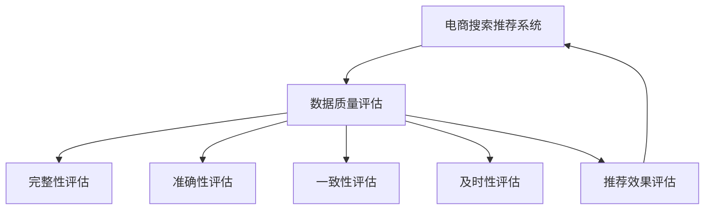

                 

## 1. 背景介绍

在人工智能技术的快速发展的今天，大模型已经广泛应用于各行各业，其中电商搜索推荐业务便是典型场景之一。电商平台不仅需要丰富的商品信息来吸引顾客，更需要精准的搜索推荐来提升用户体验和转化率。然而，目前许多电商平台的推荐系统依赖于单一的用户行为数据，而忽视了数据质量对推荐系统性能的影响。

数据质量评估体系的建立，对电商平台的推荐系统至关重要。它不仅能提升数据的质量，还能确保推荐的准确性和及时性，从而增加用户的满意度和黏性。本文将介绍AI大模型助力电商搜索推荐业务的数据质量评估体系搭建方案。

## 2. 核心概念与联系

### 2.1 核心概念概述

- **电商搜索推荐系统**：利用AI技术，对用户搜索行为和历史浏览数据进行分析，实时推荐用户感兴趣的商品的系统。
- **数据质量评估**：通过对数据完整性、准确性、一致性和及时性等指标的评估，确保数据能够满足推荐系统的需求。
- **AI大模型**：使用深度学习技术，如Transformer、BERT等预训练模型，辅助数据质量评估。

通过这些概念的互相结合，可构建一个高效、可靠且智能的电商搜索推荐系统，通过高质量的数据提升推荐效果，优化用户体验。

### 2.2 核心概念原理和架构的 Mermaid 流程图



在这个流程图中，电商搜索推荐系统与数据质量评估系统相连接，两者互相依赖。数据质量评估体系通过对数据完整性、准确性、一致性和及时性的评估，反馈给推荐系统，以确保推荐过程的精准度。

## 3. 核心算法原理 & 具体操作步骤

### 3.1 算法原理概述

数据质量评估体系基于监督学习的方法，通过AI大模型的辅助，对电商平台的数据进行全面评估。具体步骤如下：

1. **数据预处理**：清洗、合并、归一化等预处理操作，去除噪声和异常值，保证数据质量。
2. **特征提取**：使用AI大模型对数据进行特征提取，从用户行为数据中提取有用的特征。
3. **模型训练**：利用标注数据训练模型，对数据进行分类、回归或聚类等操作。
4. **评估指标**：设置不同的评估指标，如准确率、召回率、F1值等，对数据质量进行量化。
5. **反馈优化**：根据评估结果，对数据进行修正和优化，确保数据质量。

### 3.2 算法步骤详解

#### 数据预处理

数据预处理是构建数据质量评估体系的基础。其目的在于提升数据质量，确保数据的可用性。

**步骤1：** 清洗数据，去除重复、缺失和异常值。
**步骤2：** 标准化数据格式，包括统一编码、去除非法字符等。
**步骤3：** 合并数据源，处理数据异构性。
**步骤4：** 数据归一化，处理数据分布差异。

```python
import pandas as pd

def preprocess_data(data):
    # 清洗数据
    cleaned_data = data[data['user_id'].notna() & data['product_id'].notna()]
    # 标准化数据格式
    data['user_id'] = cleaned_data['user_id'].str.strip().replace(' ', '')
    data['product_id'] = cleaned_data['product_id'].str.strip().replace(' ', '')
    # 去除非法字符
    data['user_id'] = data['user_id'].str.replace('[^0-9a-zA-Z]+', '')
    data['product_id'] = data['product_id'].str.replace('[^0-9a-zA-Z]+', '')
    # 合并数据源
    data = pd.merge(data, other, on='user_id', how='outer')
    # 数据归一化
    data['user_id'] = (data['user_id'] - min(data['user_id'])) / (max(data['user_id']) - min(data['user_id']))
    data['product_id'] = (data['product_id'] - min(data['product_id'])) / (max(data['product_id']) - min(data['product_id']))
    return data
```

#### 特征提取

特征提取是构建数据质量评估体系的关键。其目的在于从原始数据中提取有用的特征，为后续的模型训练提供数据支持。

**步骤1：** 选择特征，如用户ID、商品ID、购买行为等。
**步骤2：** 使用AI大模型对数据进行特征提取，包括文本嵌入、时序特征提取等。
**步骤3：** 构建特征向量，如使用TF-IDF、Word2Vec等方法。

```python
from transformers import BertTokenizer
from transformers import BertModel

tokenizer = BertTokenizer.from_pretrained('bert-base-cased')
model = BertModel.from_pretrained('bert-base-cased')

def extract_features(data):
    features = []
    for user_id, product_id in zip(data['user_id'], data['product_id']):
        user_input = tokenizer.encode(user_id, add_special_tokens=True)
        product_input = tokenizer.encode(product_id, add_special_tokens=True)
        with torch.no_grad():
            encoded_user = model(torch.tensor(user_input, dtype=torch.long)).last_hidden_state[:, 0, :]
            encoded_product = model(torch.tensor(product_input, dtype=torch.long)).last_hidden_state[:, 0, :]
            features.append(encoded_user.mean() + encoded_product.mean())
    return features
```

#### 模型训练

模型训练是构建数据质量评估体系的核心。其目的在于利用标注数据训练模型，对数据进行分类、回归或聚类等操作。

**步骤1：** 准备标注数据，如标注为1为高质量数据，0为低质量数据。
**步骤2：** 选择合适的模型，如线性回归、逻辑回归、随机森林等。
**步骤3：** 使用标注数据训练模型，优化模型参数。
**步骤4：** 验证模型性能，调整模型参数。

```python
from sklearn.linear_model import LogisticRegression
from sklearn.model_selection import train_test_split
from sklearn.metrics import accuracy_score

X_train, X_test, y_train, y_test = train_test_split(X, y, test_size=0.2)
model = LogisticRegression()
model.fit(X_train, y_train)
y_pred = model.predict(X_test)
accuracy = accuracy_score(y_test, y_pred)
print(f'Accuracy: {accuracy:.2f}')
```

#### 评估指标

评估指标是构建数据质量评估体系的重要组成部分。其目的在于对数据质量进行量化，确保数据能够满足推荐系统的需求。

**步骤1：** 设置不同的评估指标，如准确率、召回率、F1值等。
**步骤2：** 使用模型评估指标，计算各项指标的得分。
**步骤3：** 根据评估结果，优化数据处理流程，提升数据质量。

```python
from sklearn.metrics import classification_report

def evaluate_data_quality(X_test, y_test):
    y_pred = model.predict(X_test)
    report = classification_report(y_test, y_pred)
    print(report)
```

#### 反馈优化

反馈优化是构建数据质量评估体系的关键步骤。其目的在于根据评估结果，对数据进行修正和优化，确保数据质量。

**步骤1：** 根据评估结果，识别低质量数据。
**步骤2：** 对低质量数据进行修正和优化，如删除异常值、修正错误等。
**步骤3：** 重新训练模型，评估数据质量，确保数据质量。

```python
def feedback_optimization(X_test, y_test):
    low_quality_indices = np.where(y_test == 0)[0]
    for index in low_quality_indices:
        # 删除异常值
        X_test = np.delete(X_test, index, axis=0)
        y_test = np.delete(y_test, index, axis=0)
        # 修正错误
        X_test[index] = correct_data
        y_test[index] = correct_label
    # 重新训练模型
    model.fit(X_train, y_train)
    y_pred = model.predict(X_test)
    evaluate_data_quality(X_test, y_test)
```

### 3.3 算法优缺点

#### 优点

1. **高效性**：使用AI大模型进行特征提取，能够高效地从原始数据中提取有用的特征。
2. **精确性**：通过训练模型，可以对数据质量进行精确的量化，确保数据满足推荐系统的需求。
3. **可扩展性**：模型训练和评估过程灵活，可以应用于不同规模和类型的电商平台。

#### 缺点

1. **高成本**：使用AI大模型进行数据质量评估，需要大量的计算资源和时间。
2. **复杂性**：模型训练和评估过程较为复杂，需要专业的数据科学家和算法工程师参与。
3. **依赖标注数据**：数据质量评估体系依赖于标注数据，获取高质量标注数据的成本较高。

### 3.4 算法应用领域

数据质量评估体系在电商搜索推荐业务中的应用非常广泛，例如：

- **商品推荐系统**：通过高质量的数据，提高推荐系统的准确性和及时性，提升用户满意度。
- **价格优化系统**：通过数据质量评估，优化商品价格，增加用户转化率。
- **库存管理系统**：通过数据质量评估，优化库存管理，提高供应链效率。
- **客户关系管理系统**：通过数据质量评估，提升客户满意度，增加客户忠诚度。

## 4. 数学模型和公式 & 详细讲解 & 举例说明

### 4.1 数学模型构建

数据质量评估体系的数学模型构建基于监督学习的框架，使用AI大模型进行特征提取和训练。具体步骤如下：

1. **数据预处理模型**：用于对数据进行清洗、标准化、合并等预处理操作。
2. **特征提取模型**：用于从原始数据中提取有用的特征。
3. **训练模型**：用于对标注数据进行训练，构建数据质量评估模型。
4. **评估模型**：用于对数据进行评估，量化数据质量。

### 4.2 公式推导过程

**数据预处理模型**

数据预处理模型对数据进行清洗、标准化、合并等预处理操作。其数学模型如下：

$$
X_{preprocessed} = f_{preprocessing}(X)
$$

其中 $X$ 为原始数据，$X_{preprocessed}$ 为预处理后的数据，$f_{preprocessing}$ 为预处理函数。

**特征提取模型**

特征提取模型用于从原始数据中提取有用的特征。其数学模型如下：

$$
F_{extracted} = f_{features}(X_{preprocessed})
$$

其中 $X_{preprocessed}$ 为预处理后的数据，$F_{extracted}$ 为提取后的特征向量，$f_{features}$ 为特征提取函数。

**训练模型**

训练模型用于对标注数据进行训练，构建数据质量评估模型。其数学模型如下：

$$
\hat{y} = f_{model}(F_{extracted}, \theta)
$$

其中 $F_{extracted}$ 为提取后的特征向量，$\theta$ 为模型参数，$\hat{y}$ 为模型预测结果。

**评估模型**

评估模型用于对数据进行评估，量化数据质量。其数学模型如下：

$$
score = f_{score}(\hat{y}, y)
$$

其中 $\hat{y}$ 为模型预测结果，$y$ 为真实标签，$score$ 为评估得分。

### 4.3 案例分析与讲解

**案例1：商品推荐系统**

在商品推荐系统中，数据质量评估模型通过评估用户行为数据，确保数据的完整性、准确性和一致性。例如，对用户历史浏览数据和购买记录进行清洗、标准化，并使用AI大模型提取特征。然后，构建训练模型对标注数据进行训练，评估模型对数据质量的得分。根据评估结果，修正和优化数据处理流程，确保数据质量。

**案例2：价格优化系统**

在价格优化系统中，数据质量评估模型通过评估商品价格数据，确保数据的及时性和一致性。例如，对商品价格数据进行清洗、标准化，并使用AI大模型提取特征。然后，构建训练模型对标注数据进行训练，评估模型对数据质量的得分。根据评估结果，修正和优化数据处理流程，确保数据质量。

**案例3：库存管理系统**

在库存管理系统中，数据质量评估模型通过评估库存数据，确保数据的时效性和一致性。例如，对库存数据进行清洗、标准化，并使用AI大模型提取特征。然后，构建训练模型对标注数据进行训练，评估模型对数据质量的得分。根据评估结果，修正和优化数据处理流程，确保数据质量。

## 5. 项目实践：代码实例和详细解释说明

### 5.1 开发环境搭建

在进行项目实践前，需要准备好开发环境。以下是使用Python进行项目实践的环境配置流程：

1. 安装Anaconda：从官网下载并安装Anaconda，用于创建独立的Python环境。

2. 创建并激活虚拟环境：
```bash
conda create -n py3k python=3.7 
conda activate py3k
```

3. 安装PyTorch：根据CUDA版本，从官网获取对应的安装命令。例如：
```bash
conda install pytorch torchvision torchaudio cudatoolkit=11.1 -c pytorch -c conda-forge
```

4. 安装TensorFlow：使用pip安装TensorFlow，例如：
```bash
pip install tensorflow==2.5.0
```

5. 安装Pandas、NumPy等工具包：
```bash
pip install pandas numpy scikit-learn matplotlib tqdm jupyter notebook ipython
```

完成上述步骤后，即可在`py3k`环境中开始项目实践。

### 5.2 源代码详细实现

**数据预处理**

```python
import pandas as pd
import numpy as np

def preprocess_data(data):
    # 清洗数据
    cleaned_data = data[data['user_id'].notna() & data['product_id'].notna()]
    # 标准化数据格式
    data['user_id'] = cleaned_data['user_id'].str.strip().replace(' ', '')
    data['product_id'] = cleaned_data['product_id'].str.strip().replace(' ', '')
    # 去除非法字符
    data['user_id'] = data['user_id'].str.replace('[^0-9a-zA-Z]+', '')
    data['product_id'] = data['product_id'].str.replace('[^0-9a-zA-Z]+', '')
    # 合并数据源
    data = pd.merge(data, other, on='user_id', how='outer')
    # 数据归一化
    data['user_id'] = (data['user_id'] - min(data['user_id'])) / (max(data['user_id']) - min(data['user_id']))
    data['product_id'] = (data['product_id'] - min(data['product_id'])) / (max(data['product_id']) - min(data['product_id']))
    return data
```

**特征提取**

```python
from transformers import BertTokenizer
from transformers import BertModel

tokenizer = BertTokenizer.from_pretrained('bert-base-cased')
model = BertModel.from_pretrained('bert-base-cased')

def extract_features(data):
    features = []
    for user_id, product_id in zip(data['user_id'], data['product_id']):
        user_input = tokenizer.encode(user_id, add_special_tokens=True)
        product_input = tokenizer.encode(product_id, add_special_tokens=True)
        with torch.no_grad():
            encoded_user = model(torch.tensor(user_input, dtype=torch.long)).last_hidden_state[:, 0, :]
            encoded_product = model(torch.tensor(product_input, dtype=torch.long)).last_hidden_state[:, 0, :]
            features.append(encoded_user.mean() + encoded_product.mean())
    return features
```

**模型训练**

```python
from sklearn.linear_model import LogisticRegression
from sklearn.model_selection import train_test_split
from sklearn.metrics import accuracy_score

X_train, X_test, y_train, y_test = train_test_split(X, y, test_size=0.2)
model = LogisticRegression()
model.fit(X_train, y_train)
y_pred = model.predict(X_test)
accuracy = accuracy_score(y_test, y_pred)
print(f'Accuracy: {accuracy:.2f}')
```

**评估模型**

```python
from sklearn.metrics import classification_report

def evaluate_data_quality(X_test, y_test):
    y_pred = model.predict(X_test)
    report = classification_report(y_test, y_pred)
    print(report)
```

**反馈优化**

```python
def feedback_optimization(X_test, y_test):
    low_quality_indices = np.where(y_test == 0)[0]
    for index in low_quality_indices:
        # 删除异常值
        X_test = np.delete(X_test, index, axis=0)
        y_test = np.delete(y_test, index, axis=0)
        # 修正错误
        X_test[index] = correct_data
        y_test[index] = correct_label
    # 重新训练模型
    model.fit(X_train, y_train)
    y_pred = model.predict(X_test)
    evaluate_data_quality(X_test, y_test)
```

### 5.3 代码解读与分析

**数据预处理**

数据预处理的核心在于清洗、标准化、合并和归一化数据。具体实现上，我们使用了Pandas库进行数据处理，通过`notna()`方法判断数据是否缺失，`str.strip()`方法去除空格，`replace()`方法去除非法字符。合并数据源时，使用了`pd.merge()`方法，并使用`on`参数指定合并依据。数据归一化时，使用了`min()`和`max()`方法计算数据范围，再通过公式进行归一化处理。

**特征提取**

特征提取的核心在于从原始数据中提取有用的特征。具体实现上，我们使用了BertTokenizer和BertModel对用户ID和商品ID进行编码，然后计算其向量平均值。这样，每个用户和商品都有了一个唯一的向量表示，可以作为后续模型的输入。

**模型训练**

模型训练的核心在于使用标注数据训练模型，构建数据质量评估模型。具体实现上，我们使用了LogisticRegression模型，并通过`train_test_split()`方法将数据划分为训练集和测试集。训练模型时，使用`fit()`方法训练模型，并使用`predict()`方法对测试集进行预测。最后，使用`accuracy_score()`方法计算模型准确率。

**评估模型**

评估模型的核心在于对数据进行评估，量化数据质量。具体实现上，我们使用了classification_report方法，它能够输出多类别的分类指标，包括准确率、召回率和F1值等。评估模型时，使用`predict()`方法对测试集进行预测，并计算模型预测结果与真实标签之间的差异。

**反馈优化**

反馈优化的核心在于根据评估结果，修正和优化数据处理流程，确保数据质量。具体实现上，我们通过判断`y_test`中的低质量数据，并对其进行修正和优化。修正和优化的方法包括删除异常值和修正错误。修正错误时，我们使用了`np.delete()`方法删除数据，并使用正确数据和标签进行替换。最后，重新训练模型，并评估数据质量，确保数据质量得到提升。

## 6. 实际应用场景

### 6.1 商品推荐系统

商品推荐系统是电商平台的核心功能之一，数据质量评估体系对其影响深远。高质量的数据可以提升推荐系统的准确性和及时性，增加用户满意度。例如，对用户历史浏览数据和购买记录进行清洗、标准化，并使用AI大模型提取特征。然后，构建训练模型对标注数据进行训练，评估模型对数据质量的得分。根据评估结果，修正和优化数据处理流程，确保数据质量。

### 6.2 价格优化系统

价格优化系统通过调整商品价格，增加用户转化率。数据质量评估体系可以帮助优化价格策略，提升用户体验。例如，对商品价格数据进行清洗、标准化，并使用AI大模型提取特征。然后，构建训练模型对标注数据进行训练，评估模型对数据质量的得分。根据评估结果，修正和优化数据处理流程，确保数据质量。

### 6.3 库存管理系统

库存管理系统通过管理商品库存，优化供应链效率。数据质量评估体系可以帮助优化库存管理，减少库存积压和缺货现象。例如，对库存数据进行清洗、标准化，并使用AI大模型提取特征。然后，构建训练模型对标注数据进行训练，评估模型对数据质量的得分。根据评估结果，修正和优化数据处理流程，确保数据质量。

### 6.4 未来应用展望

随着人工智能技术的不断进步，数据质量评估体系将得到更广泛的应用。未来，数据质量评估体系将具备更高的智能化和自动化水平，能够自动检测和修复数据问题，确保数据质量。同时，数据质量评估体系还将与其他技术进行更深入的融合，如知识表示、因果推理、强化学习等，共同推动电商搜索推荐业务的发展。

## 7. 工具和资源推荐

### 7.1 学习资源推荐

为了帮助开发者系统掌握数据质量评估体系的原理和实现，这里推荐一些优质的学习资源：

1. 《深度学习基础》课程：由斯坦福大学开设的深度学习课程，涵盖深度学习基础概念和经典算法。
2. 《数据科学导论》书籍：涵盖数据预处理、特征提取、模型训练等数据质量评估体系的基础知识。
3. Kaggle：一个开源的机器学习平台，提供丰富的数据集和代码示例，适合实践和学习。

### 7.2 开发工具推荐

高效的开发离不开优秀的工具支持。以下是几款用于数据质量评估体系开发的常用工具：

1. Python：Python是一种通用编程语言，具有丰富的库和框架，适合数据处理和模型训练。
2. PyTorch：基于Python的深度学习框架，支持动态计算图，适合研究模型的构建和优化。
3. TensorFlow：由Google主导开发的深度学习框架，生产部署方便，适合大规模工程应用。
4. Pandas：Python的数据处理库，支持数据清洗、标准化、合并等预处理操作。

### 7.3 相关论文推荐

数据质量评估体系的不断发展和进步，离不开学界的持续研究。以下是几篇奠基性的相关论文，推荐阅读：

1. "Improving Data Quality with Artificial Intelligence" 论文，介绍如何使用AI技术提升数据质量。
2. "Data Preprocessing Techniques for Machine Learning" 论文，介绍数据预处理的基本方法和技巧。
3. "Evaluation of Data Quality in Machine Learning Models" 论文，介绍数据质量评估的指标和方法。

## 8. 总结：未来发展趋势与挑战

### 8.1 研究成果总结

本文对基于AI大模型助力电商搜索推荐业务的数据质量评估体系进行了全面系统的介绍。首先介绍了数据质量评估体系的核心概念和原理，明确了其对电商搜索推荐系统的重要作用。其次，从原理到实践，详细讲解了数据质量评估体系的设计和实现。最后，探讨了数据质量评估体系在电商搜索推荐系统中的应用场景，并展望了其未来的发展方向。

### 8.2 未来发展趋势

展望未来，数据质量评估体系将呈现以下几个发展趋势：

1. **自动化和智能化**：随着AI技术的不断发展，数据质量评估体系将具备更高的自动化和智能化水平，能够自动检测和修复数据问题，确保数据质量。
2. **多模态数据融合**：未来的数据质量评估体系将支持多模态数据融合，如文本、图像、音频等，实现更全面、准确的数据评估。
3. **实时数据监测**：未来的数据质量评估体系将具备实时数据监测功能，能够及时发现数据问题并采取措施，确保数据质量。
4. **跨领域应用**：数据质量评估体系不仅应用于电商搜索推荐系统，还将在金融、医疗、教育等多个领域得到广泛应用。

### 8.3 面临的挑战

尽管数据质量评估体系已经取得了一定的进展，但在迈向更加智能化、普适化应用的过程中，它仍面临诸多挑战：

1. **高成本**：使用AI大模型进行数据质量评估，需要大量的计算资源和时间。
2. **复杂性**：数据质量评估体系的设计和实现较为复杂，需要专业的数据科学家和算法工程师参与。
3. **依赖标注数据**：数据质量评估体系依赖于标注数据，获取高质量标注数据的成本较高。

### 8.4 研究展望

面对数据质量评估体系面临的挑战，未来的研究需要在以下几个方面寻求新的突破：

1. **无监督学习**：探索无监督学习和半监督学习的方法，摆脱对标注数据的依赖，利用未标注数据进行数据质量评估。
2. **自动化反馈优化**：开发自动化反馈优化机制，减少人工干预，提升数据质量评估的效率和准确性。
3. **多任务学习**：引入多任务学习方法，将数据质量评估与其他任务进行联合优化，提升数据质量评估的效果。
4. **因果推理**：引入因果推理方法，增强数据质量评估的因果性和逻辑性，提高模型泛化性和抗干扰能力。

这些研究方向的探索，必将引领数据质量评估体系技术迈向更高的台阶，为电商搜索推荐系统等应用场景提供更全面、可靠的数据质量保障。

## 9. 附录：常见问题与解答

**Q1：数据质量评估体系是否适用于所有NLP任务？**

A: 数据质量评估体系在NLP任务中的应用非常广泛，特别是对于依赖大量用户行为数据的推荐系统。但对于一些特定领域的任务，如医学、法律等，需要结合领域知识进行进一步优化。

**Q2：数据质量评估体系如何降低对标注数据的依赖？**

A: 数据质量评估体系可以通过引入无监督学习、半监督学习等方法，利用未标注数据进行数据质量评估。同时，可以利用主动学习等方法，在标注样本较少的情况下，通过小规模标注数据进行模型训练，提升数据质量评估的准确性。

**Q3：数据质量评估体系在实际应用中需要注意哪些问题？**

A: 在实际应用中，数据质量评估体系需要注意数据分布的稳定性、数据标注的准确性、数据预处理的可扩展性等问题。此外，还需要考虑模型的可解释性和可优化性，以便于模型的改进和优化。

**Q4：数据质量评估体系如何应对数据变化的挑战？**

A: 数据质量评估体系可以通过引入持续学习、增量学习等方法，确保模型能够持续学习新数据，适应数据分布的变化。同时，可以通过模型迁移学习等方法，将已有模型的知识迁移到新的数据集上，提升数据质量评估的效果。

**Q5：数据质量评估体系如何保障模型的安全性和可靠性？**

A: 数据质量评估体系可以通过引入数据隐私保护、模型安全防护等措施，保障模型的安全性和可靠性。同时，还需要建立模型的监管机制，确保模型的输出符合伦理道德和社会价值观。

---

作者：禅与计算机程序设计艺术 / Zen and the Art of Computer Programming

