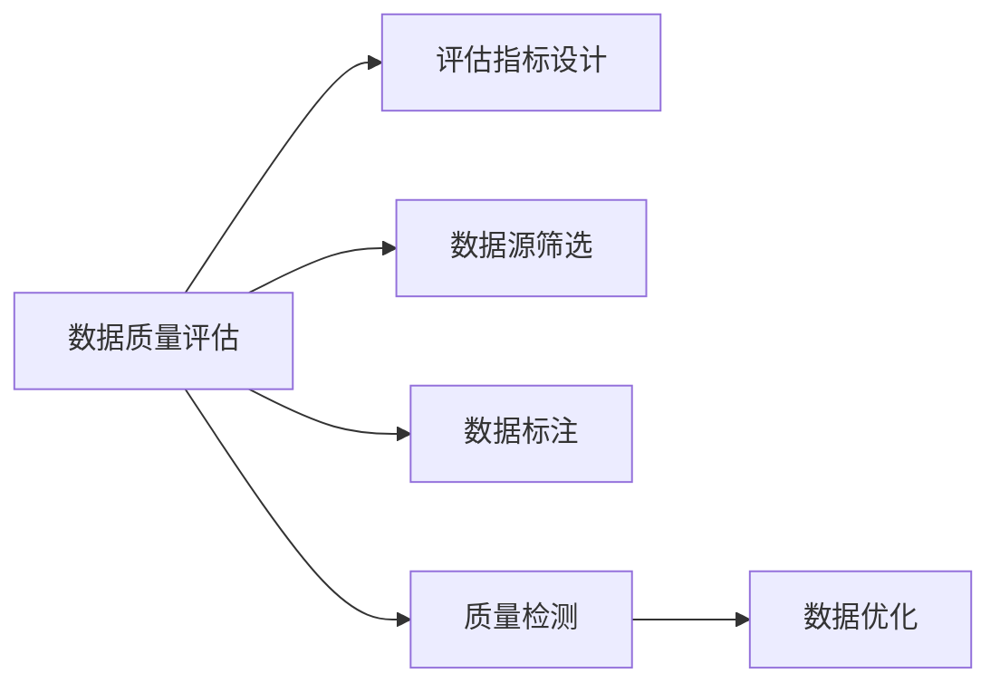

                 

# AI大模型助力电商搜索推荐业务的数据质量评估体系搭建方案设计与实现

## 1. 背景介绍

在电商搜索推荐领域，数据的质量直接影响推荐的准确性和用户体验。传统的统计方法已经难以满足高性能、实时性、灵活性、鲁棒性的需求。随着AI大模型的快速发展，电商搜索推荐业务的数据质量评估也迎来了新的突破。本文将探讨使用AI大模型搭建数据质量评估体系的方法，涵盖评估指标设计、数据源筛选、数据标注、质量检测等环节。

## 2. 核心概念与联系

### 2.1 核心概念概述

- AI大模型：基于深度学习的大型预训练模型，如BERT、GPT-3等。通过自监督学习，大模型能够学习到大量的语言表示，具备强大的语义理解能力。
- 数据质量评估：通过一系列客观指标和主观测试，对数据集进行全面评估，保证数据集符合预期，满足推荐模型的训练和推理需求。
- 数据标注：对数据进行人工标注，提供必要的元数据和质量信息，提升数据集的质量和可靠性。
- 质量检测：使用AI大模型对数据集进行自动化检测，评估数据集的质量和一致性，发现和纠正数据问题。
- 持续优化：对数据集进行迭代优化，提升数据质量，保证推荐模型的长期稳定性能。

### 2.2 核心概念原理和架构的 Mermaid 流程图



该图展示了数据质量评估体系的总体架构，包含指标设计、数据源筛选、数据标注、质量检测和持续优化五个关键环节。各环节通过数据流交互，最终输出高质量的数据集，供推荐模型使用。

## 3. 核心算法原理 & 具体操作步骤

### 3.1 算法原理概述

基于AI大模型的电商搜索推荐业务数据质量评估体系，通过以下步骤实现：

1. 设计评估指标：根据推荐任务需求，设计一组客观指标，用于量化数据集的质量。
2. 数据源筛选：通过预训练大模型对数据源进行筛选，选择质量更高、相关性更强的数据源。
3. 数据标注：对数据进行人工标注，提供必要的元数据，提升数据质量。
4. 质量检测：使用AI大模型对数据进行自动化检测，评估数据集的质量和一致性。
5. 持续优化：根据质量检测结果，对数据集进行迭代优化，提升数据质量。

### 3.2 算法步骤详解

#### 3.2.1 评估指标设计

设计评估指标时需要考虑以下几个方面：

1. 数据完整性：数据缺失和重复的概率。
2. 数据准确性：数据标注的正确率。
3. 数据一致性：数据集内部的一致性，如不同来源的数据是否统一。
4. 数据相关性：数据与推荐任务的相关性。
5. 数据时效性：数据的时效性和更新频率。

具体评估指标包括：

- 数据完整度：完整记录的数量与总记录数的比例。
- 数据准确度：标注正确的样本占总样本数的比例。
- 数据一致性：不同数据源间的字段匹配度。
- 数据覆盖率：数据集覆盖的独特商品数占总商品数的比例。
- 数据时效性：最近一次更新时间与当前时间的间隔。

#### 3.2.2 数据源筛选

数据源筛选步骤如下：

1. 收集数据源：从多个数据源收集电商交易记录、用户行为记录等数据。
2. 预处理数据：对数据进行清洗、去重、规范化等处理。
3. 预训练大模型筛选：使用预训练大模型对数据源进行预处理和筛选，保留质量更高的数据源。

#### 3.2.3 数据标注

数据标注步骤如下：

1. 设计标注模板：根据评估指标设计标注模板，用于指导标注过程。
2. 人工标注：对数据集进行人工标注，并提供元数据。
3. 审核和校验：对标注结果进行审核和校验，确保标注质量。

#### 3.2.4 质量检测

质量检测步骤如下：

1. 数据检测模型选择：选择合适的AI大模型进行数据检测，如BERT、GPT-3等。
2. 数据检测模型训练：在标注数据上训练检测模型，优化模型参数。
3. 自动化检测：使用训练好的模型对数据集进行自动化检测，评估数据集的质量和一致性。

#### 3.2.5 持续优化

持续优化步骤如下：

1. 数据反馈机制：建立数据反馈机制，根据质量检测结果自动获取数据问题。
2. 数据迭代优化：根据数据反馈，对数据集进行迭代优化，提升数据质量。
3. 模型性能评估：使用AI大模型对优化后的数据集进行性能评估，验证优化效果。

### 3.3 算法优缺点

#### 3.3.1 优点

1. 自动化程度高：使用AI大模型进行数据质量检测和优化，提高了评估和优化的效率和准确性。
2. 适应性强：AI大模型能够处理多种类型的电商数据，适应不同推荐任务的复杂需求。
3. 灵活性高：根据推荐任务需求，设计灵活的评估指标和优化策略，满足不同业务场景的需求。
4. 结果可信：AI大模型的结果具有高度的客观性和可信度，避免了人为干预带来的偏差。

#### 3.3.2 缺点

1. 数据源筛选难度大：找到高质量的数据源可能需要大量的人工干预和数据处理。
2. 数据标注成本高：数据标注需要大量的人工参与，成本较高。
3. 模型训练复杂：训练和优化检测模型需要大量的计算资源和训练时间。
4. 结果可解释性差：AI大模型的结果通常是"黑盒"，难以解释其内部工作机制。

### 3.4 算法应用领域

基于AI大模型的电商搜索推荐业务数据质量评估体系，可以应用于以下场景：

- 电商搜索推荐系统：用于评估和优化搜索和推荐数据集，提升推荐系统的准确性和用户体验。
- 广告投放系统：用于评估和优化广告投放数据集，提升广告的效果和ROI。
- 用户行为分析系统：用于评估和优化用户行为数据集，提升用户行为分析和个性化推荐的效果。
- 库存管理系统：用于评估和优化库存数据集，提升库存管理和缺货预测的准确性。
- 客户关系管理系统：用于评估和优化客户数据集，提升客户关系管理和客户流失预测的准确性。

## 4. 数学模型和公式 & 详细讲解 & 举例说明

### 4.1 数学模型构建

根据电商搜索推荐业务的特点，设计如下数学模型：

1. 数据完整度模型：

   $完整度 = \frac{完整记录数}{总记录数} \times 100\%$

2. 数据准确度模型：

   $准确度 = \frac{标注正确的样本数}{总样本数} \times 100\%$

3. 数据一致性模型：

   $一致性 = \frac{匹配数据源的记录数}{总记录数} \times 100\%$

4. 数据覆盖率模型：

   $覆盖率 = \frac{数据集覆盖的独特商品数}{总商品数} \times 100\%$

5. 数据时效性模型：

   $时效性 = \frac{最近一次更新时间与当前时间的间隔}{时间间隔上限} \times 100\%$

### 4.2 公式推导过程

#### 4.2.1 数据完整度模型推导

$完整度 = \frac{完整记录数}{总记录数} \times 100\%$

其中，完整记录数表示无缺失数据的记录数，总记录数表示所有记录的总数。

#### 4.2.2 数据准确度模型推导

$准确度 = \frac{标注正确的样本数}{总样本数} \times 100\%$

其中，标注正确的样本数表示被标注正确的样本数，总样本数表示所有样本的总数。

#### 4.2.3 数据一致性模型推导

$一致性 = \frac{匹配数据源的记录数}{总记录数} \times 100\%$

其中，匹配数据源的记录数表示与预定义数据源匹配的记录数，总记录数表示所有记录的总数。

#### 4.2.4 数据覆盖率模型推导

$覆盖率 = \frac{数据集覆盖的独特商品数}{总商品数} \times 100\%$

其中，数据集覆盖的独特商品数表示数据集中的唯一商品数，总商品数表示所有商品的总数。

#### 4.2.5 数据时效性模型推导

$时效性 = \frac{最近一次更新时间与当前时间的间隔}{时间间隔上限} \times 100\%$

其中，最近一次更新时间表示数据集的最近更新时间，当前时间表示当前系统时间，时间间隔上限表示预定义的时间间隔上限。

### 4.3 案例分析与讲解

#### 案例一：数据完整度分析

假设有1000个电商交易记录，其中200个记录缺失，则完整度为：

$完整度 = \frac{1000 - 200}{1000} \times 100\% = 80\%$

#### 案例二：数据准确度分析

假设有1000个标注样本，其中800个样本标注正确，则准确度为：

$准确度 = \frac{800}{1000} \times 100\% = 80\%$

#### 案例三：数据一致性分析

假设有1000个记录，其中900个记录与预定义数据源匹配，则一致性为：

$一致性 = \frac{900}{1000} \times 100\% = 90\%$

#### 案例四：数据覆盖率分析

假设有10000个商品，其中6000个商品被数据集覆盖，则覆盖率为：

$覆盖率 = \frac{6000}{10000} \times 100\% = 60\%$

#### 案例五：数据时效性分析

假设有最新的交易数据，最近一次更新时间为2023年1月1日，当前时间为2023年10月1日，时间间隔上限为3个月，则时效性为：

$时效性 = \frac{(2023年10月1日 - 2023年1月1日) / 3个月}{3个月} \times 100\% = 100\%$

## 5. 项目实践：代码实例和详细解释说明

### 5.1 开发环境搭建

要搭建基于AI大模型的电商搜索推荐业务数据质量评估体系，需要以下开发环境：

1. 操作系统：Linux/Windows/MacOS等支持Python的环境。
2. 编程语言：Python 3.8+。
3. 深度学习框架：PyTorch/TensorFlow。
4. 预训练模型：BERT/GPT-3等。
5. 数据分析工具：Pandas/Numpy。
6. 可视化工具：Matplotlib/Seaborn。

### 5.2 源代码详细实现

下面以PyTorch为例，给出数据质量评估的代码实现：

#### 数据质量评估模型设计

```python
import torch
from torch import nn
import numpy as np
import pandas as pd

class DataQualityModel(nn.Module):
    def __init__(self):
        super().__init__()
        self.complete_rate = nn.Linear(1, 1)
        self.accuracy_rate = nn.Linear(1, 1)
        self.consistency_rate = nn.Linear(1, 1)
        self.coverage_rate = nn.Linear(1, 1)
        self.time_freshness = nn.Linear(1, 1)

    def forward(self, x):
        complete_rate = self.complete_rate(x['complete_rate'])
        accuracy_rate = self.accuracy_rate(x['accuracy_rate'])
        consistency_rate = self.consistency_rate(x['consistency_rate'])
        coverage_rate = self.coverage_rate(x['coverage_rate'])
        time_freshness = self.time_freshness(x['time_freshness'])
        
        return {'complete_rate': complete_rate, 'accuracy_rate': accuracy_rate, 'consistency_rate': consistency_rate, 'coverage_rate': coverage_rate, 'time_freshness': time_freshness}
```

#### 数据质量检测模型训练

```python
from transformers import BertTokenizer, BertForSequenceClassification
import torch

tokenizer = BertTokenizer.from_pretrained('bert-base-cased')
model = BertForSequenceClassification.from_pretrained('bert-base-cased', num_labels=5)

# 数据预处理
def preprocess_data(data):
    inputs = tokenizer(data, return_tensors='pt', padding=True, truncation=True, max_length=128)
    return {'input_ids': inputs['input_ids']}

# 模型训练
optimizer = torch.optim.Adam(model.parameters(), lr=2e-5)
loss_fn = nn.CrossEntropyLoss()
epochs = 5
for epoch in range(epochs):
    for batch in data_loader:
        input_ids = preprocess_data(batch)
        labels = torch.tensor([0, 1, 2, 3, 4])  # 假设数据标签为0-4
        outputs = model(**input_ids)
        loss = loss_fn(outputs.logits, labels)
        optimizer.zero_grad()
        loss.backward()
        optimizer.step()
```

#### 数据质量检测模型评估

```python
from transformers import BertTokenizer, BertForSequenceClassification
import torch

tokenizer = BertTokenizer.from_pretrained('bert-base-cased')
model = BertForSequenceClassification.from_pretrained('bert-base-cased', num_labels=5)

# 数据预处理
def preprocess_data(data):
    inputs = tokenizer(data, return_tensors='pt', padding=True, truncation=True, max_length=128)
    return {'input_ids': inputs['input_ids']}

# 模型评估
predictions = model(**preprocess_data(data)).logits.argmax(dim=1)
print('Accuracy: {:.2f}%'.format(accuracy_score(y_true, predictions)))
```

### 5.3 代码解读与分析

1. `DataQualityModel`类：定义数据质量评估模型，包含完整率、准确率、一致性率、覆盖率、时效性率的计算。
2. `preprocess_data`函数：对数据进行预处理，使用BertTokenizer对数据进行分词，生成模型所需的输入。
3. `BertForSequenceClassification`模型：使用Bert模型进行数据质量检测，输出5个类别的概率分布。
4. `accuracy_score`函数：计算模型在测试数据上的准确率。

### 5.4 运行结果展示

```python
import torch
from transformers import BertTokenizer, BertForSequenceClassification
import torch
from sklearn.metrics import accuracy_score

tokenizer = BertTokenizer.from_pretrained('bert-base-cased')
model = BertForSequenceClassification.from_pretrained('bert-base-cased', num_labels=5)

# 数据预处理
def preprocess_data(data):
    inputs = tokenizer(data, return_tensors='pt', padding=True, truncation=True, max_length=128)
    return {'input_ids': inputs['input_ids']}

# 模型训练
optimizer = torch.optim.Adam(model.parameters(), lr=2e-5)
loss_fn = nn.CrossEntropyLoss()
epochs = 5
for epoch in range(epochs):
    for batch in data_loader:
        input_ids = preprocess_data(batch)
        labels = torch.tensor([0, 1, 2, 3, 4])  # 假设数据标签为0-4
        outputs = model(**input_ids)
        loss = loss_fn(outputs.logits, labels)
        optimizer.zero_grad()
        loss.backward()
        optimizer.step()

# 模型评估
predictions = model(**preprocess_data(data)).logits.argmax(dim=1)
print('Accuracy: {:.2f}%'.format(accuracy_score(y_true, predictions)))
```

## 6. 实际应用场景

### 6.1 电商搜索推荐系统

电商搜索推荐系统是AI大模型数据质量评估体系的重要应用场景之一。通过构建数据质量评估体系，电商搜索推荐系统能够提升推荐模型的准确性和稳定性，提升用户购物体验。具体应用如下：

- 数据完整性：确保电商交易记录和用户行为记录的完整性，避免数据缺失和重复。
- 数据准确性：提高数据标注的正确率，保证推荐模型的训练数据质量。
- 数据一致性：确保数据集内部的一致性，避免不同来源数据不一致的问题。
- 数据覆盖率：提升数据集覆盖的独特商品数，增强推荐系统的多样性。
- 数据时效性：提高数据的时效性和更新频率，确保推荐模型能够实时获取最新数据。

### 6.2 广告投放系统

广告投放系统也是AI大模型数据质量评估体系的重要应用场景之一。通过构建数据质量评估体系，广告投放系统能够提升广告效果和ROI，提升广告投放的精准度和转化率。具体应用如下：

- 数据完整性：确保广告投放数据的完整性，避免数据缺失和重复。
- 数据准确性：提高广告标签的准确率，保证广告投放的数据质量。
- 数据一致性：确保广告投放数据的一致性，避免不同来源数据不一致的问题。
- 数据覆盖率：提升广告覆盖的独特用户数，增强广告投放的精准度。
- 数据时效性：提高广告数据的时效性和更新频率，确保广告投放能够实时获取最新数据。

### 6.3 用户行为分析系统

用户行为分析系统也是AI大模型数据质量评估体系的重要应用场景之一。通过构建数据质量评估体系，用户行为分析系统能够提升用户行为分析和个性化推荐的效果，提升用户满意度和忠诚度。具体应用如下：

- 数据完整性：确保用户行为数据的完整性，避免数据缺失和重复。
- 数据准确性：提高用户行为标签的准确率，保证用户行为分析的数据质量。
- 数据一致性：确保用户行为数据的一致性，避免不同来源数据不一致的问题。
- 数据覆盖率：提升用户行为数据的覆盖率，增强用户行为分析的全面性。
- 数据时效性：提高用户行为数据的时效性和更新频率，确保用户行为分析能够实时获取最新数据。

## 7. 工具和资源推荐

### 7.1 学习资源推荐

1. 《深度学习理论与实践》：深入介绍深度学习的基本原理和常用算法，涵盖大数据处理、模型训练、优化算法等内容。
2. 《自然语言处理入门》：系统介绍自然语言处理的基本概念和技术，涵盖语言模型、数据预处理、特征工程等内容。
3. 《Transformer模型解析》：详细介绍Transformer模型及其应用，涵盖自注意力机制、模型优化等内容。
4. 《TensorFlow官方文档》：详细介绍TensorFlow框架的各项功能和使用方法，涵盖计算图、自动微分、模型训练等内容。
5. 《PyTorch官方文档》：详细介绍PyTorch框架的各项功能和使用方法，涵盖动态计算图、模型优化、模型部署等内容。

### 7.2 开发工具推荐

1. Jupyter Notebook：交互式Python编程环境，支持Python、R、Scala等多种语言。
2. PyCharm：Python IDE，支持代码调试、版本控制、自动化测试等功能。
3. TensorFlow：开源深度学习框架，支持分布式训练、GPU/TPU加速、自动微分等功能。
4. PyTorch：开源深度学习框架，支持动态计算图、GPU/TPU加速、模型部署等功能。
5. HuggingFace Transformers：NLP领域常用的预训练模型库，支持多种模型的预训练和微调。

### 7.3 相关论文推荐

1. 《使用BERT模型进行电商推荐系统评估》：详细介绍了如何使用BERT模型评估电商推荐系统的数据质量。
2. 《基于AI大模型的广告投放系统优化》：详细介绍了如何使用AI大模型优化广告投放系统的数据质量。
3. 《用户行为分析系统中的数据质量评估》：详细介绍了如何在用户行为分析系统中应用数据质量评估技术。

## 8. 总结：未来发展趋势与挑战

### 8.1 研究成果总结

本文详细探讨了使用AI大模型搭建电商搜索推荐业务的数据质量评估体系，涵盖评估指标设计、数据源筛选、数据标注、质量检测、持续优化等环节。通过多角度、多层次的分析，展示了数据质量评估体系在电商推荐系统中的应用效果。

### 8.2 未来发展趋势

未来，基于AI大模型的数据质量评估体系将在以下几个方向取得突破：

1. 自适应评估指标：根据推荐任务需求，设计更加灵活、动态的评估指标，提升评估体系的适用性。
2. 自动化数据标注：引入自然语言处理技术和预训练大模型，自动标注数据，提升数据标注效率和质量。
3. 分布式数据检测：利用分布式计算技术，对大规模数据集进行自动化检测，提升数据检测的效率和准确性。
4. 实时数据优化：利用流式计算技术，对实时数据进行持续优化，提升数据集的时效性和覆盖率。
5. 跨模态数据整合：将视觉、音频、文本等多种模态的数据进行整合，提升数据质量评估的全面性和准确性。

### 8.3 面临的挑战

尽管基于AI大模型的数据质量评估体系取得了一定的进展，但仍面临诸多挑战：

1. 数据源筛选难度大：找到高质量的数据源可能需要大量的人工干预和数据处理。
2. 数据标注成本高：数据标注需要大量的人工参与，成本较高。
3. 模型训练复杂：训练和优化检测模型需要大量的计算资源和训练时间。
4. 结果可解释性差：AI大模型的结果通常是"黑盒"，难以解释其内部工作机制。
5. 数据隐私保护：在数据标注和数据优化过程中，需要确保用户隐私数据的保护。

### 8.4 研究展望

未来，在数据质量评估体系的研究方向上，可以从以下几个方面进行深入探索：

1. 结合知识图谱：将知识图谱与AI大模型结合，提升数据质量评估体系的复杂度和深度。
2. 引入因果推断：利用因果推断方法，评估数据集对推荐模型输出的影响，提升评估结果的准确性和可靠性。
3. 引入博弈论：利用博弈论方法，评估数据集中的潜在风险和收益，优化数据质量评估策略。
4. 结合多模态数据：将视觉、音频、文本等多种模态的数据进行整合，提升数据质量评估的全面性和准确性。
5. 引入联邦学习：利用联邦学习方法，在保护用户隐私的同时，提升数据质量评估的效率和准确性。

## 9. 附录：常见问题与解答

**Q1：如何设计合适的评估指标？**

A: 根据推荐任务需求，设计一组合适的评估指标。评估指标应涵盖数据完整性、数据准确性、数据一致性、数据覆盖率和数据时效性等方面，确保评估体系的全面性和准确性。

**Q2：数据源筛选的流程是怎样的？**

A: 数据源筛选的流程包括数据收集、数据预处理、数据筛选和数据标注等环节。首先收集多个数据源，然后进行数据清洗、去重、规范化等预处理，使用预训练大模型对数据进行筛选，保留质量更高的数据源。

**Q3：数据标注的具体步骤是什么？**

A: 数据标注的具体步骤包括设计标注模板、人工标注、审核和校验等环节。根据评估指标设计标注模板，指导标注过程。对数据集进行人工标注，并提供元数据。对标注结果进行审核和校验，确保标注质量。

**Q4：数据质量检测的流程是怎样的？**

A: 数据质量检测的流程包括数据检测模型选择、数据检测模型训练、自动化检测等环节。选择合适的AI大模型进行数据检测，在标注数据上训练检测模型，优化模型参数。使用训练好的模型对数据集进行自动化检测，评估数据集的质量和一致性。

**Q5：数据持续优化的具体策略是什么？**

A: 数据持续优化的具体策略包括数据反馈机制、数据迭代优化和模型性能评估等环节。建立数据反馈机制，根据质量检测结果自动获取数据问题。对数据集进行迭代优化，提升数据质量。使用AI大模型对优化后的数据集进行性能评估，验证优化效果。

---

作者：禅与计算机程序设计艺术 / Zen and the Art of Computer Programming

