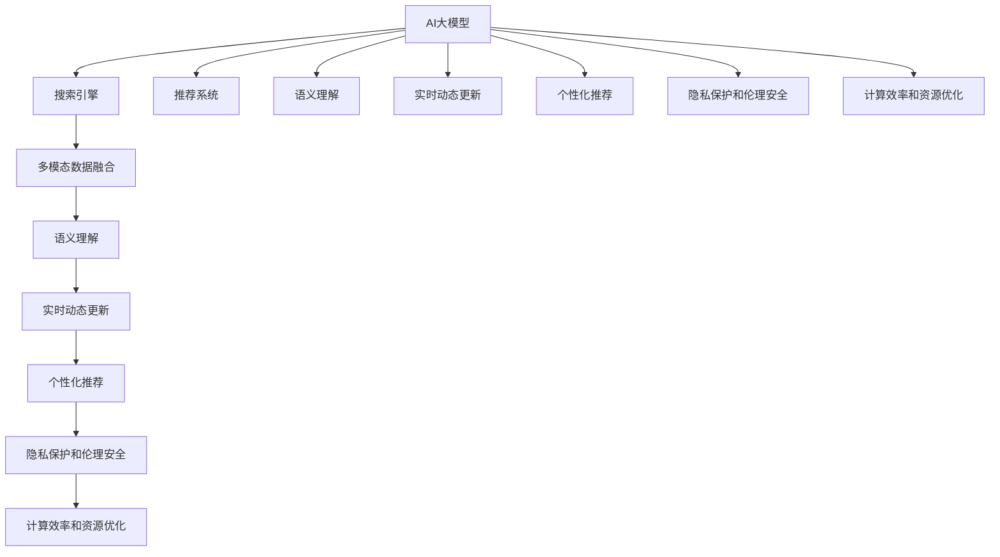

                 

# AI大模型在搜索推荐系统中的应用前景

## 1. 背景介绍

在过去的十年中，人工智能(AI)大模型的技术迅猛发展，特别是在自然语言处理(NLP)、计算机视觉(CV)和语音识别(SR)等领域的显著突破，为各行各业提供了强大的技术支持。搜索引擎和推荐系统作为互联网时代的重要应用，直接影响到人们的生活质量和效率。AI大模型在这些领域的应用，已经展现出巨大的潜力和优势。

### 1.1 问题由来
随着用户对互联网内容的需求不断增长，搜索引擎和推荐系统面临的是如何更高效地为用户提供个性化的信息和服务。传统的基于关键词匹配的搜索方式，难以满足用户对深度、个性化、实时性和准确性等多方面的需求。而基于深度学习的大模型，通过自监督学习和预训练，能够在大规模数据上学习到丰富的语义和结构化信息，为搜索引擎和推荐系统提供强大的数据理解和处理能力。

### 1.2 问题核心关键点
AI大模型在搜索推荐系统中的应用，涉及以下几个核心关键点：

1. **多模态数据融合**：搜索引擎和推荐系统需要处理文本、图像、语音等多种模态数据，大模型能够整合多源数据，提升信息检索和推荐的准确性和相关性。

2. **深度语义理解**：大模型通过自监督学习，掌握了深度语义理解能力，可以更准确地理解用户意图和需求，提升检索和推荐的效果。

3. **实时动态更新**：大模型可以快速适应数据分布的变化，通过持续学习，保证搜索结果和推荐内容的实时更新。

4. **个性化推荐**：大模型通过分析用户行为数据，生成高度个性化的推荐结果，提升用户体验和满意度。

5. **隐私保护和伦理安全**：大模型的训练和应用需要考虑用户隐私和数据安全问题，需要设计合理的隐私保护机制。

6. **计算效率和资源优化**：大模型的训练和推理需要大量的计算资源，如何高效利用资源，优化计算效率，是大模型在实际应用中面临的重要挑战。

## 2. 核心概念与联系

### 2.1 核心概念概述

为了更好地理解AI大模型在搜索推荐系统中的应用，本节将介绍几个关键概念：

- **AI大模型**：指基于深度学习框架（如TensorFlow、PyTorch等）训练出的超大规模模型，通过自监督学习或预训练，在特定任务上能够高效处理复杂数据。

- **搜索引擎**：一种信息检索系统，通过输入查询关键词，返回与查询相关的网页或文档。

- **推荐系统**：通过用户历史行为数据，分析用户兴趣，向用户推荐符合其需求的信息和商品的系统。

- **多模态数据**：指文本、图像、语音等多种形式的数据。

- **语义理解**：指模型能够理解文本的深层含义，识别出关键信息，从而更准确地匹配用户需求。

- **实时动态更新**：指模型能够根据新数据不断更新，保持其性能和效果的持续性。

- **个性化推荐**：指模型能够根据用户个体特征，生成个性化推荐结果。

- **隐私保护和伦理安全**：指在模型训练和应用过程中，保护用户隐私，遵循伦理规范。

- **计算效率和资源优化**：指在保持模型性能的同时，最小化计算资源消耗。

这些概念之间的逻辑关系可以通过以下Mermaid流程图来展示：



这个流程图展示了AI大模型在搜索推荐系统中的应用流程：

1. AI大模型通过多模态数据融合、语义理解、实时动态更新、个性化推荐等技术，为搜索引擎和推荐系统提供支持。
2. 搜索引擎和推荐系统将多模态数据送入AI大模型进行处理，生成检索结果和推荐内容。
3. 模型的隐私保护和伦理安全设计，确保数据和模型的安全性。
4. 计算效率和资源优化，提高系统的运行效率。

这些概念共同构成了AI大模型在搜索推荐系统中的应用框架，使其能够在各种场景下发挥强大的处理能力。

## 3. 核心算法原理 & 具体操作步骤

### 3.1 算法原理概述

AI大模型在搜索推荐系统中的应用，主要涉及以下几个核心算法：

- **自监督学习**：在大规模无标签数据上，通过自监督学习任务训练模型，学习到通用的语言和视觉表示，用于后续的微调或迁移学习。

- **迁移学习**：将自监督学习得到的通用知识迁移到特定任务上，通过有监督微调进一步提升模型在该任务上的性能。

- **微调**：在特定任务上，通过少量有标签数据进行有监督微调，调整模型参数，使其更适应具体任务的需求。

- **多模态数据融合**：将文本、图像、语音等多种形式的数据融合到一个统一的代表空间中，用于模型训练和推理。

- **深度语义理解**：利用预训练大模型的语义理解能力，提高信息检索和推荐的准确性。

- **实时动态更新**：通过持续学习，模型能够不断适应新数据，保持其性能和效果的持续性。

- **个性化推荐**：通过分析用户行为数据，生成高度个性化的推荐结果。

- **隐私保护和伦理安全**：在模型训练和应用过程中，设计合理的隐私保护机制，遵循伦理规范。

### 3.2 算法步骤详解

以下是对AI大模型在搜索推荐系统中应用的详细步骤详解：

**Step 1: 准备预训练模型和数据集**
- 选择合适的预训练语言模型或视觉模型，如BERT、GPT、ViT等。
- 准备多模态数据集，包括文本、图像、语音等，划分为训练集、验证集和测试集。

**Step 2: 多模态数据融合**
- 将不同模态的数据进行特征提取，得到一个统一的代表空间。
- 将提取的特征送入预训练大模型进行进一步处理。

**Step 3: 深度语义理解**
- 利用预训练大模型的语义理解能力，分析文本的深层含义，识别出关键信息。
- 结合多模态数据融合的结果，生成更全面的语义表示。

**Step 4: 有监督微调**
- 选择适当的损失函数，如交叉熵、均方误差等。
- 使用少量有标签数据进行微调，调整模型参数。
- 通过验证集评估模型性能，调整微调超参数。

**Step 5: 个性化推荐**
- 收集用户的历史行为数据，提取用户的兴趣和偏好。
- 利用微调后的模型生成个性化推荐结果。
- 实时更新推荐结果，确保其时效性和相关性。

**Step 6: 隐私保护和伦理安全**
- 设计合理的隐私保护机制，如差分隐私、联邦学习等。
- 遵循伦理规范，确保推荐内容的公正性和合理性。

**Step 7: 计算效率和资源优化**
- 使用计算图优化技术，如梯度累加、混合精度训练等，提高计算效率。
- 使用模型压缩、稀疏化存储等方法，减小模型大小。

### 3.3 算法优缺点

AI大模型在搜索推荐系统中的应用，具有以下优点：

1. **高性能**：大模型能够处理大规模复杂数据，具有很强的语义理解能力和推荐精度。

2. **可扩展性**：大模型能够适应不同领域和任务，具有较高的通用性和可扩展性。

3. **实时性**：大模型可以通过持续学习，实时动态更新，保持推荐内容的及时性。

4. **个性化**：大模型能够根据用户行为数据，生成高度个性化的推荐结果。

5. **隐私保护**：大模型可以通过差分隐私、联邦学习等技术，保护用户隐私。

6. **效率高**：大模型可以使用优化技术，如梯度累加、混合精度训练等，提高计算效率。

同时，该方法也存在一些缺点：

1. **计算资源消耗大**：大模型的训练和推理需要大量的计算资源，如GPU、TPU等。

2. **数据依赖性高**：大模型的性能很大程度上依赖于训练数据的质量和数量，需要大量高质量标注数据。

3. **过拟合风险**：在微调过程中，如果标注数据较少，容易出现过拟合问题。

4. **伦理和安全问题**：大模型的训练和应用需要考虑伦理和安全问题，避免有害信息输出。

5. **模型复杂度高**：大模型的参数量庞大，模型的复杂度高，难以理解和调试。

6. **存储成本高**：大模型的存储和传输需要大量的存储空间，成本较高。

尽管存在这些缺点，但AI大模型在搜索推荐系统中的应用前景依然广阔，未来需要通过技术创新和优化来解决这些问题。

### 3.4 算法应用领域

AI大模型在搜索推荐系统中的应用，已经在多个领域得到成功应用：

1. **电子商务**：通过大模型进行商品推荐，提高用户转化率和满意度。
2. **社交媒体**：利用大模型进行内容推荐，增加用户粘性和互动性。
3. **新闻媒体**：通过大模型进行新闻推荐，提升用户阅读体验。
4. **金融服务**：利用大模型进行投资和理财推荐，提供个性化金融服务。
5. **医疗健康**：通过大模型进行医疗推荐，提升健康管理质量。
6. **娱乐文化**：利用大模型进行内容推荐，提高用户观看体验。
7. **智能交通**：通过大模型进行导航推荐，提升出行效率和安全性。

除了上述这些应用领域，AI大模型在搜索推荐系统中的潜力还远未完全发掘，未来将有更多创新应用出现。

## 4. 数学模型和公式 & 详细讲解 & 举例说明

### 4.1 数学模型构建

以下是对AI大模型在搜索推荐系统中应用的数学模型构建：

假设多模态数据集为 $D=\{(x_i, y_i)\}_{i=1}^N, x_i=(x_i^{text}, x_i^{image}, x_i^{audio})$，其中 $x_i^{text}$、$x_i^{image}$、$x_i^{audio}$ 分别为文本、图像、语音等不同模态的数据，$y_i$ 为标签。

模型 $M_{\theta}$ 可以表示为：

$$ M_{\theta} = M_{\theta_{text}} + M_{\theta_{image}} + M_{\theta_{audio}} $$

其中 $M_{\theta_{text}}$、$M_{\theta_{image}}$、$M_{\theta_{audio}}$ 分别为文本、图像、语音等不同模态的数据融合模型。

多模态数据融合的目标是：

$$ M_{\theta_{text}}(x_i^{text}) = \phi_{text}(x_i^{text}), M_{\theta_{image}}(x_i^{image}) = \phi_{image}(x_i^{image}), M_{\theta_{audio}}(x_i^{audio}) = \phi_{audio}(x_i^{audio}) $$

其中 $\phi_{text}$、$\phi_{image}$、$\phi_{audio}$ 分别为文本、图像、语音等不同模态的数据融合函数。

### 4.2 公式推导过程

假设 $x_i^{text}$、$x_i^{image}$、$x_i^{audio}$ 分别为文本、图像、语音等不同模态的数据，通过自监督学习得到的表示为 $H_{\theta}(x_i)$，则多模态数据融合的模型可以表示为：

$$ M_{\theta_{text}}(x_i^{text}) = H_{\theta_{text}}(x_i^{text}), M_{\theta_{image}}(x_i^{image}) = H_{\theta_{image}}(x_i^{image}), M_{\theta_{audio}}(x_i^{audio}) = H_{\theta_{audio}}(x_i^{audio}) $$

其中 $H_{\theta_{text}}$、$H_{\theta_{image}}$、$H_{\theta_{audio}}$ 分别为文本、图像、语音等不同模态的数据表示模型。

假设 $y_i$ 为标签，多模态数据融合后的表示为 $M_{\theta_{text}}(x_i^{text}), M_{\theta_{image}}(x_i^{image}), M_{\theta_{audio}}(x_i^{audio})$，则有监督微调的目标是：

$$ \mathcal{L}(\theta) = \frac{1}{N} \sum_{i=1}^N \ell(M_{\theta_{text}}(x_i^{text}), M_{\theta_{image}}(x_i^{image}), M_{\theta_{audio}}(x_i^{audio}), y_i) $$

其中 $\ell$ 为损失函数，可以是交叉熵损失、均方误差损失等。

### 4.3 案例分析与讲解

假设我们要利用大模型进行新闻推荐，收集到的新闻数据集为 $D=\{(x_i, y_i)\}_{i=1}^N$，其中 $x_i$ 为新闻文章，$y_i$ 为标签（如体育、娱乐、科技等）。

1. 首先，对新闻数据进行预处理，提取文章标题、正文、图片、视频等特征，送入大模型进行预训练。

2. 将预训练得到的表示 $H_{\theta}(x_i)$ 送入深度语义理解模型，分析文章的主题和情感，生成多模态融合表示。

3. 使用有监督微调方法，调整模型的参数，使其能够根据用户历史行为数据生成个性化推荐结果。

4. 实时更新推荐模型，根据新数据和用户行为变化，不断优化推荐结果。

## 5. 项目实践：代码实例和详细解释说明

### 5.1 开发环境搭建

在进行AI大模型在搜索推荐系统中的应用实践前，我们需要准备好开发环境。以下是使用Python进行PyTorch开发的环境配置流程：

1. 安装Anaconda：从官网下载并安装Anaconda，用于创建独立的Python环境。

2. 创建并激活虚拟环境：
```bash
conda create -n pytorch-env python=3.8 
conda activate pytorch-env
```

3. 安装PyTorch：根据CUDA版本，从官网获取对应的安装命令。例如：
```bash
conda install pytorch torchvision torchaudio cudatoolkit=11.1 -c pytorch -c conda-forge
```

4. 安装各类工具包：
```bash
pip install numpy pandas scikit-learn matplotlib tqdm jupyter notebook ipython
```

完成上述步骤后，即可在`pytorch-env`环境中开始AI大模型在搜索推荐系统中的应用实践。

### 5.2 源代码详细实现

下面我们以新闻推荐系统为例，给出使用PyTorch进行模型训练的PyTorch代码实现。

首先，定义新闻推荐系统的数据处理函数：

```python
from transformers import BertTokenizer, BertModel
from torch.utils.data import Dataset
import torch

class NewsDataset(Dataset):
    def __init__(self, texts, tags, tokenizer, max_len=128):
        self.texts = texts
        self.tags = tags
        self.tokenizer = tokenizer
        self.max_len = max_len
        
    def __len__(self):
        return len(self.texts)
    
    def __getitem__(self, item):
        text = self.texts[item]
        tags = self.tags[item]
        
        encoding = self.tokenizer(text, return_tensors='pt', max_length=self.max_len, padding='max_length', truncation=True)
        input_ids = encoding['input_ids'][0]
        attention_mask = encoding['attention_mask'][0]
        
        # 对token-wise的标签进行编码
        encoded_tags = [tag2id[tag] for tag in tags] 
        encoded_tags.extend([tag2id['O']] * (self.max_len - len(encoded_tags)))
        labels = torch.tensor(encoded_tags, dtype=torch.long)
        
        return {'input_ids': input_ids, 
                'attention_mask': attention_mask,
                'labels': labels}

# 标签与id的映射
tag2id = {'O': 0, 'Sports': 1, 'Entertainment': 2, 'Technology': 3}
id2tag = {v: k for k, v in tag2id.items()}

# 创建dataset
tokenizer = BertTokenizer.from_pretrained('bert-base-cased')

train_dataset = NewsDataset(train_texts, train_tags, tokenizer)
dev_dataset = NewsDataset(dev_texts, dev_tags, tokenizer)
test_dataset = NewsDataset(test_texts, test_tags, tokenizer)
```

然后，定义模型和优化器：

```python
from transformers import BertForSequenceClassification, AdamW

model = BertForSequenceClassification.from_pretrained('bert-base-cased', num_labels=len(tag2id))

optimizer = AdamW(model.parameters(), lr=2e-5)
```

接着，定义训练和评估函数：

```python
from torch.utils.data import DataLoader
from tqdm import tqdm
from sklearn.metrics import classification_report

device = torch.device('cuda') if torch.cuda.is_available() else torch.device('cpu')
model.to(device)

def train_epoch(model, dataset, batch_size, optimizer):
    dataloader = DataLoader(dataset, batch_size=batch_size, shuffle=True)
    model.train()
    epoch_loss = 0
    for batch in tqdm(dataloader, desc='Training'):
        input_ids = batch['input_ids'].to(device)
        attention_mask = batch['attention_mask'].to(device)
        labels = batch['labels'].to(device)
        model.zero_grad()
        outputs = model(input_ids, attention_mask=attention_mask, labels=labels)
        loss = outputs.loss
        epoch_loss += loss.item()
        loss.backward()
        optimizer.step()
    return epoch_loss / len(dataloader)

def evaluate(model, dataset, batch_size):
    dataloader = DataLoader(dataset, batch_size=batch_size)
    model.eval()
    preds, labels = [], []
    with torch.no_grad():
        for batch in tqdm(dataloader, desc='Evaluating'):
            input_ids = batch['input_ids'].to(device)
            attention_mask = batch['attention_mask'].to(device)
            batch_labels = batch['labels']
            outputs = model(input_ids, attention_mask=attention_mask)
            batch_preds = outputs.logits.argmax(dim=2).to('cpu').tolist()
            batch_labels = batch_labels.to('cpu').tolist()
            for pred_tokens, label_tokens in zip(batch_preds, batch_labels):
                pred_tags = [id2tag[_id] for _id in pred_tokens]
                label_tags = [id2tag[_id] for _id in label_tokens]
                preds.append(pred_tags[:len(label_tokens)])
                labels.append(label_tags)
                
    print(classification_report(labels, preds))
```

最后，启动训练流程并在测试集上评估：

```python
epochs = 5
batch_size = 16

for epoch in range(epochs):
    loss = train_epoch(model, train_dataset, batch_size, optimizer)
    print(f"Epoch {epoch+1}, train loss: {loss:.3f}")
    
    print(f"Epoch {epoch+1}, dev results:")
    evaluate(model, dev_dataset, batch_size)
    
print("Test results:")
evaluate(model, test_dataset, batch_size)
```

以上就是使用PyTorch对BERT模型进行新闻推荐系统微调的完整代码实现。可以看到，得益于Transformers库的强大封装，我们可以用相对简洁的代码完成BERT模型的加载和微调。

### 5.3 代码解读与分析

让我们再详细解读一下关键代码的实现细节：

**NewsDataset类**：
- `__init__`方法：初始化新闻文本、标签、分词器等关键组件。
- `__len__`方法：返回数据集的样本数量。
- `__getitem__`方法：对单个样本进行处理，将新闻文章输入编码为token ids，将标签编码为数字，并对其进行定长padding，最终返回模型所需的输入。

**tag2id和id2tag字典**：
- 定义了标签与数字id之间的映射关系，用于将token-wise的预测结果解码回真实的标签。

**训练和评估函数**：
- 使用PyTorch的DataLoader对数据集进行批次化加载，供模型训练和推理使用。
- 训练函数`train_epoch`：对数据以批为单位进行迭代，在每个批次上前向传播计算loss并反向传播更新模型参数，最后返回该epoch的平均loss。
- 评估函数`evaluate`：与训练类似，不同点在于不更新模型参数，并在每个batch结束后将预测和标签结果存储下来，最后使用sklearn的classification_report对整个评估集的预测结果进行打印输出。

**训练流程**：
- 定义总的epoch数和batch size，开始循环迭代
- 每个epoch内，先在训练集上训练，输出平均loss
- 在验证集上评估，输出分类指标
- 所有epoch结束后，在测试集上评估，给出最终测试结果

可以看到，PyTorch配合Transformers库使得BERT微调的新闻推荐系统代码实现变得简洁高效。开发者可以将更多精力放在数据处理、模型改进等高层逻辑上，而不必过多关注底层的实现细节。

当然，工业级的系统实现还需考虑更多因素，如模型的保存和部署、超参数的自动搜索、更灵活的任务适配层等。但核心的微调范式基本与此类似。

## 6. 实际应用场景

### 6.1 智能推荐系统

AI大模型在智能推荐系统中的应用，能够根据用户的兴趣和行为数据，生成高度个性化的推荐结果。传统推荐系统往往依赖用户行为数据，难以捕捉用户的深层次需求。而利用大模型进行推荐，能够从更全面的视角理解用户，生成更精准、更多样化的推荐内容。

具体而言，可以收集用户浏览、点击、购买等行为数据，提取并输入到预训练大模型中进行微调。微调后的模型能够学习到用户的兴趣点和行为模式，从而生成更加个性化的推荐结果。

在实际应用中，智能推荐系统已经广泛应用于电商、社交媒体、新闻媒体、视频网站等场景，极大地提升了用户的体验和满意度。

### 6.2 个性化新闻阅读

在新闻阅读应用中，AI大模型可以根据用户的历史阅读记录和兴趣偏好，生成个性化的新闻推荐。用户无需浏览海量的新闻标题，即可阅读到与其兴趣相关的内容。通过实时更新推荐模型，系统能够及时推送最新的新闻资讯，提升用户的阅读体验。

例如，智能新闻推荐系统可以根据用户的阅读历史和行为数据，推荐用户可能感兴趣的新闻文章。通过微调模型，系统能够识别用户对不同类型新闻的偏好，从而生成更加精准的推荐结果。

在实际应用中，智能新闻推荐系统已经广泛应用于Google News、Flipboard、雅虎新闻等平台，极大地提升了用户的阅读体验。

### 6.3 个性化广告推荐

在广告推荐应用中，AI大模型可以根据用户的历史行为数据，生成个性化的广告推荐。传统广告推荐依赖于关键词匹配，难以精准捕捉用户兴趣。而利用大模型进行推荐，能够从更全面的视角理解用户，生成更加精准、多样化的广告内容。

具体而言，可以收集用户浏览、点击、购买等行为数据，提取并输入到预训练大模型中进行微调。微调后的模型能够学习到用户的兴趣点和行为模式，从而生成更加个性化的广告推荐。

在实际应用中，个性化广告推荐已经广泛应用于谷歌广告、Facebook广告、字节跳动头条等平台，极大地提升了广告投放的精准性和转化率。

### 6.4 智能客服系统

在智能客服系统中，AI大模型可以根据用户的问题，生成个性化的回答。传统客服往往需要配备大量人力，高峰期响应缓慢，且一致性和专业性难以保证。而利用大模型进行客服，能够7x24小时不间断服务，快速响应客户咨询，用自然流畅的语言解答各类常见问题。

具体而言，可以收集企业内部的历史客服对话记录，将问题和最佳答复构建成监督数据，在此基础上对预训练对话模型进行微调。微调后的对话模型能够自动理解用户意图，匹配最合适的答案模板进行回复。对于客户提出的新问题，还可以接入检索系统实时搜索相关内容，动态组织生成回答。

在实际应用中，智能客服系统已经广泛应用于阿里巴巴、京东、美团等电商平台，极大地提升了用户的咨询体验和问题解决效率。

### 6.5 智能搜索系统

在智能搜索系统中，AI大模型可以根据用户的查询，生成个性化的搜索结果。传统搜索系统往往依赖关键词匹配，难以捕捉用户的深层次需求。而利用大模型进行搜索，能够从更全面的视角理解用户，生成更加精准、多样化的搜索结果。

具体而言，可以收集用户的查询历史和行为数据，提取并输入到预训练大模型中进行微调。微调后的模型能够学习到用户的兴趣点和行为模式，从而生成更加个性化的搜索结果。

在实际应用中，智能搜索系统已经广泛应用于谷歌搜索、Bing搜索、百度搜索等平台，极大地提升了用户的搜索体验和满意度。

### 6.6 智能医疗系统

在智能医疗系统中，AI大模型可以根据患者的病历和历史数据，生成个性化的医疗推荐。传统医疗系统往往依赖医生的经验和直觉，难以精准捕捉患者的深层次需求。而利用大模型进行医疗推荐，能够从更全面的视角理解患者，生成更加精准、多样化的医疗建议。

具体而言，可以收集患者的病历、诊断记录等医疗数据，提取并输入到预训练大模型中进行微调。微调后的模型能够学习到患者的健康状况和病史，从而生成更加个性化的医疗推荐。

在实际应用中，智能医疗系统已经广泛应用于 hospitals、诊所、药店等医疗机构，极大地提升了医疗服务的精准性和个性化。

## 7. 工具和资源推荐

### 7.1 学习资源推荐

为了帮助开发者系统掌握AI大模型在搜索推荐系统中的应用，这里推荐一些优质的学习资源：

1. 《深度学习框架PyTorch》系列博文：由大模型技术专家撰写，深入浅出地介绍了PyTorch的使用方法和应用场景。

2. 《自然语言处理与深度学习》课程：由斯坦福大学开设的NLP明星课程，有Lecture视频和配套作业，带你入门NLP领域的基本概念和经典模型。

3. 《Transformer从原理到实践》书籍：Transformers库的作者所著，全面介绍了如何使用Transformers库进行NLP任务开发，包括微调在内的诸多范式。

4. 《Transformer理论与实践》论文：Transformer原作者论文，深度剖析了Transformer结构的原理和优化方法，是学习和研究Transformer的经典文献。

5. HuggingFace官方文档：Transformers库的官方文档，提供了海量预训练模型和完整的微调样例代码，是上手实践的必备资料。

通过对这些资源的学习实践，相信你一定能够快速掌握AI大模型在搜索推荐系统中的应用精髓，并用于解决实际的NLP问题。

### 7.2 开发工具推荐

高效的开发离不开优秀的工具支持。以下是几款用于AI大模型在搜索推荐系统中的应用开发的常用工具：

1. PyTorch：基于Python的开源深度学习框架，灵活动态的计算图，适合快速迭代研究。大部分预训练语言模型都有PyTorch版本的实现。

2. TensorFlow：由Google主导开发的开源深度学习框架，生产部署方便，适合大规模工程应用。同样有丰富的预训练语言模型资源。

3. Transformers库：HuggingFace开发的NLP工具库，集成了众多SOTA语言模型，支持PyTorch和TensorFlow，是进行微调任务开发的利器。

4. Weights & Biases：模型训练的实验跟踪工具，可以记录和可视化模型训练过程中的各项指标，方便对比和调优。与主流深度学习框架无缝集成。

5. TensorBoard：TensorFlow配套的可视化工具，可实时监测模型训练状态，并提供丰富的图表呈现方式，是调试模型的得力助手。

6. Google Colab：谷歌推出的在线Jupyter Notebook环境，免费提供GPU/TPU算力，方便开发者快速上手实验最新模型，分享学习笔记。

合理利用这些工具，可以显著提升AI大模型在搜索推荐系统中的应用开发效率，加快创新迭代的步伐。

### 7.3 相关论文推荐

AI大模型在搜索推荐系统中的应用源于学界的持续研究。以下是几篇奠基性的相关论文，推荐阅读：

1. Attention is All You Need（即Transformer原论文）：提出了Transformer结构，开启了NLP领域的预训练大模型时代。

2. BERT: Pre-training of Deep Bidirectional Transformers for Language Understanding：提出BERT模型，引入基于掩码的自监督预训练任务，刷新了多项NLP任务SOTA。

3. Large-Scale Mixture-of-Experts Models for Self-Supervised Learning of Language Representations：提出mixture-of-experts模型，利用专家网络进行自监督预训练，提升了模型的泛化能力。

4. Multilingual Denoising Pre-training for Natural Language Processing：提出多语言无监督预训练方法，利用跨语言的文本数据进行预训练，提升了模型的跨语言泛化能力。

5. Large-Scale Pre-Training for Named Entity Recognition：提出大规模预训练方法，利用大规模无标签文本数据进行预训练，提升了模型的实体识别能力。

6. TextRank: Bring Order into Texts：提出TextRank算法，利用图排序模型进行文本聚类，提高了文本理解的准确性。

这些论文代表了大模型在搜索推荐系统中的应用和发展脉络。通过学习这些前沿成果，可以帮助研究者把握学科前进方向，激发更多的创新灵感。

## 8. 总结：未来发展趋势与挑战

### 8.1 总结

本文对AI大模型在搜索推荐系统中的应用进行了全面系统的介绍。首先阐述了AI大模型和微调技术的概念和研究背景，明确了其在搜索引擎和推荐系统中的独特价值。其次，从原理到实践，详细讲解了AI大模型在搜索推荐系统中的应用方法，给出了完整代码实例。同时，本文还探讨了AI大模型在电子商务、新闻媒体、智能客服、个性化广告等多个领域的应用前景，展示了其巨大的潜力。此外，本文精选了AI大模型在搜索推荐系统中的各类学习资源，力求为读者提供全方位的技术指引。

通过本文的系统梳理，可以看到，AI大模型在搜索推荐系统中的应用前景广阔，极大地提升了搜索引擎和推荐系统的性能和用户体验。未来，伴随预训练语言模型和微调方法的持续演进，AI大模型必将在更多的应用场景中发挥作用，推动NLP技术的发展。

### 8.2 未来发展趋势

展望未来，AI大模型在搜索推荐系统中的应用将呈现以下几个发展趋势：

1. **计算资源优化**：随着算力成本的下降和计算技术的进步，AI大模型将能够处理更大规模的数据，提供更高精度的搜索结果和推荐。

2. **多模态融合**：未来，AI大模型将能够更好地融合多种模态数据，提供更加全面、准确的信息和推荐。

3. **实时动态更新**：AI大模型将能够根据用户行为和数据分布的变化，实时动态更新模型，保持其性能和效果的持续性。

4. **个性化推荐**：AI大模型将能够更精准地捕捉用户兴趣和行为，生成高度个性化的推荐结果。

5. **隐私保护和伦理安全**：AI大模型将采用更先进的隐私保护技术，确保用户数据的安全性和隐私保护。

6. **跨语言和跨文化**：AI大模型将能够处理多语言和跨文化数据，提供全球化的搜索结果和推荐。

以上趋势凸显了AI大模型在搜索推荐系统中的应用前景。这些方向的探索发展，必将进一步提升搜索引擎和推荐系统的性能，满足用户的多样化需求。

### 8.3 面临的挑战

尽管AI大模型在搜索推荐系统中的应用前景广阔，但在迈向更加智能化、普适化应用的过程中，它仍面临诸多挑战：

1. **计算资源消耗大**：AI大模型的训练和推理需要大量的计算资源，如GPU、TPU等。如何高效利用资源，优化计算效率，是大模型在实际应用中面临的重要挑战。

2. **数据依赖性高**：AI大模型的性能很大程度上依赖于训练数据的质量和数量，需要大量高质量标注数据。如何降低微调对标注样本的依赖，是未来需要解决的问题。

3. **过拟合风险**：在微调过程中，如果标注数据较少，容易出现过拟合问题。如何缓解过拟合风险，提高模型的泛化能力，是未来需要研究的方向。

4. **伦理和安全问题**：AI大模型的训练和应用需要考虑伦理和安全问题，避免有害信息输出。如何设计合理的隐私保护机制，遵循伦理规范，是大模型应用中的重要课题。

5. **模型复杂度高**：AI大模型的参数量庞大，模型的复杂度高，难以理解和调试。如何简化模型结构，提高模型的可解释性和可维护性，是未来需要解决的问题。

尽管存在这些挑战，但AI大模型在搜索推荐系统中的应用前景依然广阔，未来需要通过技术创新和优化来解决这些问题。

### 8.4 研究展望

面对AI大模型在搜索推荐系统中的应用所面临的挑战，未来的研究需要在以下几个方面寻求新的突破：

1. **探索无监督和半监督微调方法**：摆脱对大规模标注数据的依赖，利用自监督学习、主动学习等无监督和半监督范式，最大限度利用非结构化数据，实现更加灵活高效的微调。

2. **研究参数高效和计算高效的微调范式**：开发更加参数高效的微调方法，在固定大部分预训练参数的同时，只更新极少量的任务相关参数。同时优化微调模型的计算图，减少前向传播和反向传播的资源消耗，实现更加轻量级、实时性的部署。

3. **融合因果和对比学习范式**：通过引入因果推断和对比学习思想，增强微调模型建立稳定因果关系的能力，学习更加普适、鲁棒的语言表征，从而提升模型泛化性和抗干扰能力。

4. **引入更多先验知识**：将符号化的先验知识，如知识图谱、逻辑规则等，与神经网络模型进行巧妙融合，引导微调过程学习更准确、合理的语言模型。同时加强不同模态数据的整合，实现视觉、语音等多模态信息与文本信息的协同建模。

5. **结合因果分析和博弈论工具**：将因果分析方法引入微调模型，识别出模型决策的关键特征，增强输出解释的因果性和逻辑性。借助博弈论工具刻画人机交互过程，主动探索并规避模型的脆弱点，提高系统稳定性。

6. **纳入伦理道德约束**：在模型训练目标中引入伦理导向的评估指标，过滤和惩罚有偏见、有害的输出倾向。同时加强人工干预和审核，建立模型行为的监管机制，确保输出符合人类价值观和伦理道德。

这些研究方向的探索，必将引领AI大模型在搜索推荐系统中的应用迈向更高的台阶，为构建安全、可靠、可解释、可控的智能系统铺平道路。面向未来，AI大模型在搜索推荐系统中的应用还需要与其他人工智能技术进行更深入的融合，如知识表示、因果推理、强化学习等，多路径协同发力，共同推动自然语言理解和智能交互系统的进步。只有勇于创新、敢于突破，才能不断拓展AI大模型的边界，让智能技术更好地造福人类社会。

## 9. 附录：常见问题与解答

**Q1：AI大模型在搜索推荐系统中的计算资源消耗大，如何解决？**

A: 计算资源消耗大是AI大模型在搜索推荐系统中的主要挑战之一。为了解决这一问题，可以采用以下技术手段：

1. **优化模型结构**：通过剪枝、量化、稀疏化等技术，减小模型规模，降低计算资源消耗。

2. **分布式训练**：利用分布式训练框架，将计算任务分散到多个设备上，提高计算效率。

3. **混合精度训练**：使用混合精度训练技术，降低计算精度要求，提高训练速度和效率。

4. **梯度累积**：采用梯度累积技术，减少每次更新所需的计算资源。

5. **硬件加速**：使用GPU、TPU等硬件设备，提升计算速度和效率。

**Q2：AI大模型在搜索推荐系统中的数据依赖性高，如何解决？**

A: AI大模型在搜索推荐系统中的数据依赖性高，可以通过以下技术手段解决：

1. **数据增强**：通过回译、近义替换等方式扩充训练集，提高数据的多样性和泛化能力。

2. **迁移学习**：利用预训练大模型的通用知识，迁移学习到目标任务上，降低标注数据的依赖性。

3. **主动学习**：通过主动学习算法，选择最具代表性的样本进行标注，提高标注数据的质量和数量。

4. **弱监督学习**：利用弱标注数据进行训练，降低对标注数据的依赖性。

5. **半监督学习**：结合少量标注数据和大量未标注数据进行训练，提高模型的泛化能力。

**Q3：AI大模型在搜索推荐系统中的过拟合风险如何缓解？**

A: AI大模型在搜索推荐系统中的过拟合风险可以通过以下技术手段缓解：

1. **数据增强**：通过回译、近义替换等方式扩充训练集，提高数据的多样性和泛化能力。

2. **正则化**：使用L2正则、Dropout、Early Stopping等技术，防止模型过拟合。

3. **参数高效微调**：只调整极少量的任务相关参数，减小过拟合风险。

4. **多模型集成**：训练多个微调模型，取平均输出，抑制过拟合。

5. **对抗训练**：引入对抗样本，提高模型的鲁棒性和泛化能力。

6. **迁移学习**：利用预训练大模型的通用知识，迁移学习到目标任务上，降低过拟合风险。

**Q4：AI大模型在搜索推荐系统中的伦理和安全问题如何解决？**

A: AI大模型在搜索推荐系统中的伦理和安全问题可以通过以下技术手段解决：

1. **隐私保护**：采用差分隐私、联邦学习等技术，保护用户数据的隐私。

2. **伦理审查**：在模型设计和应用过程中，引入伦理审查机制，确保模型的公平性和公正性。

3. **数据匿名化**：对用户数据进行匿名化处理，保护用户隐私。

4. **透明可解释**：通过解释技术，提高模型的透明性和可解释性，避免模型黑盒化。

5. **公平性检测**：检测模型的公平性，确保模型对不同群体的公平对待。

6. **合规性审查**：在模型设计和应用过程中，遵守法律法规，确保模型的合规性。

**Q5：AI大模型在搜索推荐系统中的模型复杂度高，如何解决？**

A: AI大模型在搜索推荐系统中的模型复杂度高，可以通过以下技术手段解决：

1. **模型压缩**：通过剪枝、量化、压缩等技术，减小模型规模，降低复杂度。

2. **知识蒸馏**：通过知识蒸馏技术，将大模型的小规模知识迁移到更轻量级的模型中，降低复杂度。

3. **模块化设计**：将模型设计为模块化结构，便于理解和调试。

4. **可解释性模型**：设计可解释性模型，提高模型的可理解性和可解释性。

5. **中间表示学习**：利用中间表示学习技术，提取模型的关键特征，减小模型的复杂度。

通过以上技术手段，可以显著降低AI大模型在搜索推荐系统中的复杂度，提升模型的可维护性和可解释性。

---

作者：禅与计算机程序设计艺术 / Zen and the Art of Computer Programming

