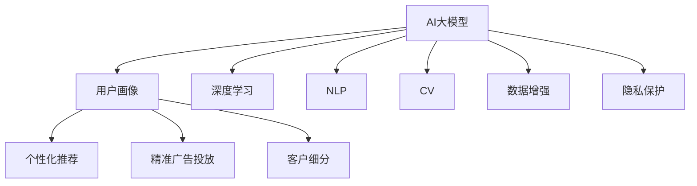

                 

# AI大模型在用户画像构建中的作用

> 关键词：AI大模型, 用户画像, 数据融合, 深度学习, 自然语言处理, 计算机视觉, 数据增强, 隐私保护

## 1. 背景介绍

### 1.1 问题由来
用户画像（User Profile）是大数据时代数字营销的基础，广泛应用于个性化推荐、精准广告投放、客户关系管理等领域。构建准确、全面的用户画像，能够有效提升用户体验和商业价值。然而，传统的数据收集和画像构建方法，往往依赖于人工标注和复杂的多源数据融合算法，成本高、耗时长且精度受限。

近年来，随着深度学习和大数据技术的发展，利用AI大模型进行用户画像构建的方法逐渐受到关注。AI大模型，尤其是基于Transformer架构的自然语言处理（NLP）模型和计算机视觉（CV）模型，具备强大的数据建模和分析能力，能够在短时间内自动整合和分析海量数据，构建高精度的用户画像。

### 1.2 问题核心关键点
AI大模型在用户画像构建中的核心关键点主要包括以下几个方面：

- **数据处理与融合**：如何将来自不同渠道、格式多样的数据进行高效处理和融合，生成全面的用户画像。
- **多模态数据建模**：如何利用AI大模型同时处理文本、图像、视频等多种类型的数据，提升画像的丰富性和准确性。
- **深度学习技术**：如何应用深度学习技术，通过自监督学习和无监督学习等方法，自动发现数据中的潜在关联和模式，提升画像的质量。
- **隐私保护与伦理**：如何在构建用户画像时，遵守隐私保护和数据伦理的要求，确保数据安全性和用户隐私。

### 1.3 问题研究意义
AI大模型在用户画像构建中的应用，对于提升营销效率、优化用户体验、增强客户关系管理等方面具有重要意义：

1. **提升营销效率**：通过精准的用户画像，可以更有效地进行个性化推荐和精准广告投放，提高转化率和客户满意度。
2. **优化用户体验**：深入分析用户行为和偏好，提供更个性化、更符合用户需求的产品和服务。
3. **增强客户关系管理**：利用用户画像进行客户细分和分析，优化客户服务和运营策略，提高客户忠诚度。
4. **降低数据收集成本**：通过自动化的数据处理和分析，减少人工标注和数据融合的复杂度，降低时间和成本。
5. **提升模型性能**：利用大模型的强大建模能力，生成更加全面、准确的画像，提升数据驱动决策的科学性和有效性。

## 2. 核心概念与联系

### 2.1 核心概念概述

为更好地理解AI大模型在用户画像构建中的作用，本节将介绍几个密切相关的核心概念：

- **AI大模型（AI Large Model）**：基于深度学习的大规模模型，通常参数量在十亿以上，具备强大的数据建模和分析能力。
- **用户画像（User Profile）**：通过数据挖掘、分析和学习，构建的描述用户特征、行为和偏好的数据集合，用于个性化推荐、精准广告投放、客户细分等场景。
- **深度学习（Deep Learning）**：通过多层神经网络实现的学习算法，可以自动从数据中提取高层次特征，用于分类、回归、生成等任务。
- **自然语言处理（NLP）**：利用AI技术处理和分析自然语言数据，如文本分类、情感分析、命名实体识别等。
- **计算机视觉（CV）**：利用AI技术处理和分析图像数据，如目标检测、图像分类、人脸识别等。
- **数据增强（Data Augmentation）**：通过修改、变换原始数据，生成新的训练样本，提高模型的泛化能力。
- **隐私保护（Privacy Protection）**：通过技术手段确保数据在处理、存储、传输过程中的安全性和隐私性，避免数据泄露和滥用。

这些核心概念之间的逻辑关系可以通过以下Mermaid流程图来展示：



这个流程图展示了大模型在用户画像构建过程中的关键环节及其相互关系：

1. AI大模型通过深度学习技术，自动处理和分析各种类型的数据。
2. 在处理NLP和CV数据时，分别应用自然语言处理和计算机视觉技术。
3. 利用数据增强技术，提升模型的泛化能力。
4. 确保隐私保护，避免数据滥用。
5. 最终生成全面、准确的用户画像，用于个性化推荐、精准广告投放、客户细分等场景。

## 3. 核心算法原理 & 具体操作步骤
### 3.1 算法原理概述

AI大模型在用户画像构建中的核心算法原理，是通过深度学习技术，自动处理和分析多源异构数据，构建全面的用户画像。具体来说，包括以下几个步骤：

1. **数据收集与预处理**：从多个渠道（如社交媒体、电商平台、搜索引擎等）收集用户行为数据，进行清洗、去重和格式转换，确保数据的质量和一致性。
2. **特征提取与融合**：应用NLP和CV技术，自动提取文本、图像等数据的特征，利用深度学习模型将不同类型的数据进行融合，生成高层次的特征向量。
3. **自监督学习与无监督学习**：通过自监督学习和无监督学习技术，自动发现数据中的潜在关联和模式，进一步提升特征向量的表达能力。
4. **画像生成与优化**：利用生成对抗网络（GAN）、自编码器（Autoencoder）等技术，生成完整的用户画像，并不断优化，确保画像的准确性和全面性。

### 3.2 算法步骤详解

以下是AI大模型在用户画像构建中的具体操作步骤：

**Step 1: 数据收集与预处理**
- 从多个渠道（如社交媒体、电商平台、搜索引擎等）收集用户行为数据，包括浏览记录、购买记录、搜索记录等。
- 对数据进行清洗、去重和格式转换，确保数据的一致性和可用性。
- 对文本数据进行分词、向量化等预处理，确保其能够被模型理解和分析。

**Step 2: 特征提取与融合**
- 利用NLP技术，自动提取文本数据中的关键词、情感、主题等信息。
- 利用CV技术，自动提取图像数据中的目标、颜色、纹理等信息。
- 利用深度学习模型（如BERT、ResNet等），将不同类型的数据进行融合，生成高层次的特征向量。

**Step 3: 自监督学习与无监督学习**
- 应用自监督学习技术（如预训练语言模型、自编码器等），自动发现数据中的潜在关联和模式。
- 应用无监督学习技术（如聚类算法、关联规则挖掘等），发现数据中的隐含结构和规律。
- 利用自监督和无监督学习的结果，进一步优化特征向量的表达能力。

**Step 4: 画像生成与优化**
- 利用GAN或Autoencoder等生成模型，生成完整的用户画像。
- 通过迭代优化，不断调整特征向量的权重，确保画像的准确性和全面性。
- 利用隐私保护技术，确保画像数据的安全性和用户隐私。

### 3.3 算法优缺点

AI大模型在用户画像构建中具有以下优点：

1. **自动化高效**：利用AI大模型的强大处理能力，能够自动处理和分析海量数据，生成高精度的用户画像，大大提升效率。
2. **数据融合能力强**：能够高效整合不同类型的数据，生成全面的用户画像，提升画像的丰富性和准确性。
3. **自监督与无监督学习**：通过自监督学习和无监督学习，自动发现数据中的潜在关联和模式，提升画像的科学性和可靠性。
4. **隐私保护**：通过隐私保护技术，确保数据在处理、存储、传输过程中的安全性和用户隐私。

同时，该方法也存在以下局限性：

1. **数据依赖性强**：数据的质量和多样性直接影响画像的精度和全面性，数据收集成本较高。
2. **模型复杂度高**：大规模模型需要高性能的计算资源，训练和推理成本较高。
3. **算法复杂性高**：深度学习模型的训练和调参需要丰富的经验和专业知识。
4. **结果可解释性差**：大模型的决策过程通常缺乏可解释性，难以对其推理逻辑进行分析和调试。

尽管存在这些局限性，但就目前而言，AI大模型在用户画像构建中仍是最先进的方法，具有不可替代的价值。

### 3.4 算法应用领域

AI大模型在用户画像构建中的应用，覆盖了多个领域，具体包括：

- **个性化推荐**：通过用户画像，实现精准的产品推荐，提升用户满意度。
- **精准广告投放**：根据用户画像，实现精准的广告定向，提高广告效果和ROI。
- **客户细分**：利用用户画像进行客户细分，优化客户服务和运营策略。
- **市场分析**：通过用户画像分析市场趋势和用户需求，指导产品开发和营销策略。
- **风险评估**：利用用户画像进行风险评估和用户画像，优化信贷审批和风险管理。

## 4. 数学模型和公式 & 详细讲解 & 举例说明
### 4.1 数学模型构建

在用户画像构建中，常见的数学模型包括深度学习模型和生成模型。以下以BERT为例，简要介绍深度学习模型在用户画像构建中的构建过程。

假设用户画像的输入为 $X = (x_1, x_2, ..., x_n)$，其中 $x_i$ 为第 $i$ 个样本的特征向量。模型目标为 $Y = (y_1, y_2, ..., y_n)$，其中 $y_i$ 为第 $i$ 个样本的用户画像向量。

定义深度学习模型为 $M_{\theta}$，其中 $\theta$ 为模型参数。模型的损失函数为 $\mathcal{L}(\theta, Y)$，表示模型预测值与真实值之间的差异。

在用户画像构建中，通常使用交叉熵损失函数，定义如下：

$$
\mathcal{L}(\theta, Y) = -\frac{1}{N}\sum_{i=1}^N \sum_{j=1}^k y_{ij}\log M_{\theta}(x_i)
$$

其中 $N$ 为样本数量，$k$ 为每个样本的特征维度，$y_{ij}$ 为第 $i$ 个样本的第 $j$ 个特征的用户画像标签，$M_{\theta}(x_i)$ 为模型对 $x_i$ 的预测向量。

### 4.2 公式推导过程

以BERT为例，推导其在用户画像构建中的预测过程。假设输入为一句话 $x$，输出为对应的用户画像 $y$。

BERT的预测过程如下：

1. 将输入 $x$ 转化为token embedding，得到 $x_{emb}$。
2. 利用Transformer层，计算出 $x_{emb}$ 的语义表示 $x_{sen}$。
3. 通过全连接层，将 $x_{sen}$ 转化为用户画像向量 $y$。

在实际应用中，可以使用以下代码实现BERT在用户画像构建中的预测：

```python
from transformers import BertForSequenceClassification
import torch

# 假设输入为一句话
input_text = "John works at Google"
tokenizer = BertTokenizer.from_pretrained('bert-base-uncased')
input_ids = tokenizer.encode(input_text, add_special_tokens=True)

# 加载预训练的BERT模型
model = BertForSequenceClassification.from_pretrained('bert-base-uncased', num_labels=1)

# 前向传播计算预测值
outputs = model(input_ids, attention_mask=None, return_dict=True)
logits = outputs.logits

# 将预测值转化为用户画像向量
user_profile = logits[0].detach().numpy()
```

### 4.3 案例分析与讲解

以社交媒体数据分析为例，展示AI大模型在用户画像构建中的应用。

假设社交媒体平台上有大量用户发布的状态更新，每个状态更新包含文本内容、发布时间、地理位置等信息。利用BERT模型，自动提取每个状态更新中的文本特征，结合用户历史行为数据，生成完整的用户画像。

具体步骤如下：

1. 从社交媒体平台收集用户状态更新数据，进行清洗和预处理。
2. 利用BERT模型自动提取每个状态更新的文本特征，得到用户文本特征向量 $x_t$。
3. 结合用户历史行为数据，生成用户画像向量 $y$。
4. 利用聚类算法对用户进行细分，得到不同类型的用户画像。

## 5. 项目实践：代码实例和详细解释说明
### 5.1 开发环境搭建

在进行用户画像构建实践前，我们需要准备好开发环境。以下是使用Python进行PyTorch开发的环境配置流程：

1. 安装Anaconda：从官网下载并安装Anaconda，用于创建独立的Python环境。

2. 创建并激活虚拟环境：
```bash
conda create -n pytorch-env python=3.8 
conda activate pytorch-env
```

3. 安装PyTorch：根据CUDA版本，从官网获取对应的安装命令。例如：
```bash
conda install pytorch torchvision torchaudio cudatoolkit=11.1 -c pytorch -c conda-forge
```

4. 安装Transformers库：
```bash
pip install transformers
```

5. 安装各类工具包：
```bash
pip install numpy pandas scikit-learn matplotlib tqdm jupyter notebook ipython
```

完成上述步骤后，即可在`pytorch-env`环境中开始用户画像构建实践。

### 5.2 源代码详细实现

下面我们以社交媒体数据分析为例，给出使用Transformers库对BERT模型进行用户画像构建的PyTorch代码实现。

首先，定义用户画像的数据处理函数：

```python
from transformers import BertTokenizer
from torch.utils.data import Dataset
import torch

class UserProfileDataset(Dataset):
    def __init__(self, data, tokenizer):
        self.data = data
        self.tokenizer = tokenizer
        
    def __len__(self):
        return len(self.data)
    
    def __getitem__(self, item):
        tweet = self.data[item]['text']
        text = tweet['text']
        label = tweet['label']
        
        encoding = self.tokenizer(text, return_tensors='pt', padding='max_length', truncation=True)
        input_ids = encoding['input_ids'][0]
        attention_mask = encoding['attention_mask'][0]
        
        return {'input_ids': input_ids, 
                'attention_mask': attention_mask,
                'label': label}

# 加载用户画像数据
tokenizer = BertTokenizer.from_pretrained('bert-base-cased')
train_dataset = UserProfileDataset(train_data, tokenizer)
dev_dataset = UserProfileDataset(dev_data, tokenizer)
test_dataset = UserProfileDataset(test_data, tokenizer)
```

然后，定义模型和优化器：

```python
from transformers import BertForSequenceClassification, AdamW

model = BertForSequenceClassification.from_pretrained('bert-base-cased', num_labels=2)

optimizer = AdamW(model.parameters(), lr=2e-5)
```

接着，定义训练和评估函数：

```python
from torch.utils.data import DataLoader
from tqdm import tqdm
from sklearn.metrics import accuracy_score

device = torch.device('cuda') if torch.cuda.is_available() else torch.device('cpu')
model.to(device)

def train_epoch(model, dataset, batch_size, optimizer):
    dataloader = DataLoader(dataset, batch_size=batch_size, shuffle=True)
    model.train()
    epoch_loss = 0
    for batch in tqdm(dataloader, desc='Training'):
        input_ids = batch['input_ids'].to(device)
        attention_mask = batch['attention_mask'].to(device)
        labels = batch['label'].to(device)
        model.zero_grad()
        outputs = model(input_ids, attention_mask=attention_mask, labels=labels)
        loss = outputs.loss
        epoch_loss += loss.item()
        loss.backward()
        optimizer.step()
    return epoch_loss / len(dataloader)

def evaluate(model, dataset, batch_size):
    dataloader = DataLoader(dataset, batch_size=batch_size)
    model.eval()
    preds, labels = [], []
    with torch.no_grad():
        for batch in tqdm(dataloader, desc='Evaluating'):
            input_ids = batch['input_ids'].to(device)
            attention_mask = batch['attention_mask'].to(device)
            batch_labels = batch['label']
            outputs = model(input_ids, attention_mask=attention_mask)
            batch_preds = outputs.logits.argmax(dim=2).to('cpu').tolist()
            batch_labels = batch_labels.to('cpu').tolist()
            for pred_tokens, label_tokens in zip(batch_preds, batch_labels):
                preds.append(pred_tokens[0])
                labels.append(label_tokens[0])
                
    print(f"Accuracy: {accuracy_score(labels, preds)}")
```

最后，启动训练流程并在测试集上评估：

```python
epochs = 5
batch_size = 16

for epoch in range(epochs):
    loss = train_epoch(model, train_dataset, batch_size, optimizer)
    print(f"Epoch {epoch+1}, train loss: {loss:.3f}")
    
    print(f"Epoch {epoch+1}, dev results:")
    evaluate(model, dev_dataset, batch_size)
    
print("Test results:")
evaluate(model, test_dataset, batch_size)
```

以上就是使用PyTorch对BERT进行用户画像构建的完整代码实现。可以看到，得益于Transformers库的强大封装，我们可以用相对简洁的代码完成BERT模型的加载和微调。

### 5.3 代码解读与分析

让我们再详细解读一下关键代码的实现细节：

**UserProfileDataset类**：
- `__init__`方法：初始化数据和分词器等关键组件。
- `__len__`方法：返回数据集的样本数量。
- `__getitem__`方法：对单个样本进行处理，将文本输入编码为token ids，同时返回标签。

**tokenizer和模型**：
- `tokenizer`：用于将文本转换为token ids和attention mask，方便模型理解。
- `model`：加载预训练的BERT模型，并指定输出层为二分类。

**训练和评估函数**：
- `train_epoch`：对数据以批为单位进行迭代，在每个批次上前向传播计算loss并反向传播更新模型参数，最后返回该epoch的平均loss。
- `evaluate`：与训练类似，不同点在于不更新模型参数，并在每个batch结束后将预测和标签结果存储下来，最后使用sklearn的accuracy_score函数计算分类准确率。

**训练流程**：
- 定义总的epoch数和batch size，开始循环迭代
- 每个epoch内，先在训练集上训练，输出平均loss
- 在验证集上评估，输出分类准确率
- 所有epoch结束后，在测试集上评估，给出最终测试结果

可以看到，PyTorch配合Transformers库使得BERT用户画像构建的代码实现变得简洁高效。开发者可以将更多精力放在数据处理、模型改进等高层逻辑上，而不必过多关注底层的实现细节。

当然，工业级的系统实现还需考虑更多因素，如模型的保存和部署、超参数的自动搜索、更灵活的任务适配层等。但核心的微调范式基本与此类似。

## 6. 实际应用场景
### 6.1 社交媒体数据分析

社交媒体数据分析是大规模用户画像构建的重要场景之一。通过社交媒体平台上的用户状态更新，能够快速获得用户的兴趣、情绪、行为等信息，用于构建全面的用户画像。

具体而言，可以收集用户在Twitter、Facebook、微博等平台上的状态更新，利用BERT模型自动提取文本特征，结合用户历史行为数据，生成完整的用户画像。例如，可以通过分析用户发布的内容、互动对象、发布时间等特征，预测用户的兴趣和行为倾向，生成不同类别的用户画像。

### 6.2 电商平台用户画像

电商平台的用户画像构建，可以帮助商家更好地理解用户需求，优化产品推荐和销售策略。通过电商平台上的浏览、购买记录，自动生成用户画像。

具体而言，可以收集用户在电商平台上的浏览记录、购买记录、评价信息等，利用BERT模型自动提取文本特征，结合用户历史行为数据，生成完整的用户画像。例如，可以通过分析用户购买的产品类别、价格区间、购买频率等特征，预测用户的偏好和需求，生成不同类别的用户画像。

### 6.3 金融用户画像

金融领域对用户画像的需求尤为迫切。通过收集用户在金融产品、交易行为、消费记录等数据，自动生成用户画像，用于客户细分、风险评估等场景。

具体而言，可以收集用户在金融产品平台上的使用记录、交易记录、财务状况等数据，利用BERT模型自动提取文本特征，结合用户历史行为数据，生成完整的用户画像。例如，可以通过分析用户的消费习惯、投资偏好、财务状况等特征，预测用户的风险承受能力和需求，生成不同类别的用户画像。

### 6.4 未来应用展望

随着AI大模型的不断进步，基于深度学习和大数据的用户画像构建技术将更加先进，在更多领域得到广泛应用：

- **智慧医疗**：利用用户画像进行精准医疗推荐，优化诊疗方案，提升患者体验。
- **教育领域**：通过用户画像分析学生行为和兴趣，提供个性化学习建议，优化教学策略。
- **智能家居**：利用用户画像进行智能设备推荐，提升家居体验和舒适度。
- **智慧城市**：通过用户画像分析城市居民需求，优化公共服务，提升城市管理效率。
- **物联网**：利用用户画像进行智能设备推荐，提升用户体验和设备利用率。

## 7. 工具和资源推荐
### 7.1 学习资源推荐

为了帮助开发者系统掌握AI大模型在用户画像构建的理论基础和实践技巧，这里推荐一些优质的学习资源：

1. **《深度学习》系列书籍**：深入讲解深度学习的基本概念和经典模型，适合入门学习和进阶提升。
2. **CS231n《计算机视觉：基础和实践》课程**：斯坦福大学开设的计算机视觉明星课程，涵盖图像分类、目标检测、图像生成等关键技术。
3. **《自然语言处理入门》系列文章**：详细讲解自然语言处理的基本概念和经典模型，适合初学者系统学习。
4. **Kaggle竞赛**：参与Kaggle的机器学习竞赛，实战练习AI大模型在用户画像构建中的应用，提升实战能力。
5. **论文解读**：阅读并理解相关领域的最新研究成果，掌握前沿技术和方法。

通过对这些资源的学习实践，相信你一定能够快速掌握AI大模型在用户画像构建中的精髓，并用于解决实际的NLP问题。

### 7.2 开发工具推荐

高效的开发离不开优秀的工具支持。以下是几款用于AI大模型用户画像构建开发的常用工具：

1. **PyTorch**：基于Python的开源深度学习框架，灵活动态的计算图，适合快速迭代研究。
2. **TensorFlow**：由Google主导开发的开源深度学习框架，生产部署方便，适合大规模工程应用。
3. **Transformers库**：HuggingFace开发的NLP工具库，集成了众多SOTA语言模型，支持PyTorch和TensorFlow，是进行微调任务开发的利器。
4. **Weights & Biases**：模型训练的实验跟踪工具，可以记录和可视化模型训练过程中的各项指标，方便对比和调优。
5. **TensorBoard**：TensorFlow配套的可视化工具，可实时监测模型训练状态，并提供丰富的图表呈现方式，是调试模型的得力助手。
6. **Jupyter Notebook**：交互式Python代码开发环境，适合做数据分析和模型调参。

合理利用这些工具，可以显著提升AI大模型在用户画像构建的开发效率，加快创新迭代的步伐。

### 7.3 相关论文推荐

AI大模型在用户画像构建中的应用源于学界的持续研究。以下是几篇奠基性的相关论文，推荐阅读：

1. **Attention is All You Need**：提出Transformer结构，开启了NLP领域的预训练大模型时代。
2. **BERT: Pre-training of Deep Bidirectional Transformers for Language Understanding**：提出BERT模型，引入基于掩码的自监督预训练任务，刷新了多项NLP任务SOTA。
3. **Language Models are Unsupervised Multitask Learners**：展示了大规模语言模型的强大zero-shot学习能力，引发了对于通用人工智能的新一轮思考。
4. **Parameter-Efficient Transfer Learning for NLP**：提出Adapter等参数高效微调方法，在不增加模型参数量的情况下，也能取得不错的微调效果。
5. **Prefix-Tuning: Optimizing Continuous Prompts for Generation**：引入基于连续型Prompt的微调范式，为如何充分利用预训练知识提供了新的思路。
6. **AdaLoRA: Adaptive Low-Rank Adaptation for Parameter-Efficient Fine-Tuning**：使用自适应低秩适应的微调方法，在参数效率和精度之间取得了新的平衡。

这些论文代表了大语言模型用户画像构建技术的发展脉络。通过学习这些前沿成果，可以帮助研究者把握学科前进方向，激发更多的创新灵感。

## 8. 总结：未来发展趋势与挑战
### 8.1 总结

本文对AI大模型在用户画像构建中的作用进行了全面系统的介绍。首先阐述了用户画像在营销、推荐、金融等领域的意义，明确了AI大模型在构建用户画像中的重要价值。其次，从原理到实践，详细讲解了深度学习技术在用户画像构建中的应用，给出了用户画像构建的完整代码实例。同时，本文还广泛探讨了AI大模型在多个行业领域的应用前景，展示了其广阔的应用潜力。此外，本文精选了用户画像构建技术的各类学习资源，力求为读者提供全方位的技术指引。

通过本文的系统梳理，可以看到，AI大模型在用户画像构建中已经取得显著成效，成为大数据分析的重要工具。AI大模型的强大数据处理和分析能力，能够自动整合和分析海量数据，生成高精度的用户画像，极大地提升了数据驱动决策的科学性和有效性。未来，伴随深度学习技术的不断进步，基于AI大模型的用户画像构建技术将更加先进，为各行各业带来更广泛的应用前景。

### 8.2 未来发展趋势

展望未来，AI大模型在用户画像构建中呈现以下几个发展趋势：

1. **数据规模持续增大**：随着数据收集技术的不断进步，用户画像的数据规模将持续增大，模型能够更好地捕捉用户行为和偏好。
2. **模型复杂度提升**：未来的大模型将具有更强的表达能力和泛化能力，能够在更复杂的场景中构建精准的用户画像。
3. **多模态融合技术发展**：结合文本、图像、视频等多种类型的数据，生成更加全面、准确的用户画像。
4. **自监督和无监督学习**：通过自监督和无监督学习，自动发现数据中的潜在关联和模式，提升用户画像的科学性和可靠性。
5. **隐私保护与伦理**：随着隐私保护技术的不断发展，用户画像构建将更加注重数据安全和用户隐私，确保数据使用的合规性。
6. **实时生成与优化**：通过在线学习机制，实时生成和优化用户画像，确保数据的及时性和准确性。

这些趋势凸显了AI大模型在用户画像构建中的广阔前景。这些方向的探索发展，必将进一步提升用户画像的质量和效果，为用户体验和商业价值的提升带来更多可能性。

### 8.3 面临的挑战

尽管AI大模型在用户画像构建中取得了显著成效，但在迈向更加智能化、普适化应用的过程中，它仍面临着诸多挑战：

1. **数据质量和多样性**：数据的质量和多样性直接影响用户画像的精度和全面性，数据收集成本较高。
2. **模型复杂度与计算资源**：大规模模型需要高性能的计算资源，训练和推理成本较高。
3. **算法复杂度与调参难度**：深度学习模型的训练和调参需要丰富的经验和专业知识。
4. **结果可解释性**：大模型的决策过程通常缺乏可解释性，难以对其推理逻辑进行分析和调试。
5. **隐私保护与数据安全**：在用户画像构建过程中，需要确保数据的隐私保护和安全性，避免数据滥用。

尽管存在这些挑战，但AI大模型在用户画像构建中的作用和价值不可替代，未来研究仍需围绕这些挑战不断探索和突破。

### 8.4 研究展望

面向未来，AI大模型在用户画像构建技术的研究展望包括以下几个方面：

1. **数据采集与处理**：开发更多数据采集和预处理技术，提升数据的质量和多样性。
2. **模型压缩与加速**：通过模型压缩、混合精度训练等技术，优化模型的计算效率和内存占用。
3. **多模态融合技术**：结合多种类型的数据，生成更加全面、准确的用户画像。
4. **自监督与无监督学习**：利用自监督和无监督学习，自动发现数据中的潜在关联和模式。
5. **隐私保护与伦理**：探索更多隐私保护和数据安全技术，确保用户画像构建过程的合规性。
6. **实时生成与优化**：通过在线学习机制，实时生成和优化用户画像，提升数据的及时性和准确性。

这些研究方向将推动AI大模型在用户画像构建中的技术进步，提升模型的性能和应用范围，为数字化转型提供更强大的工具支持。

## 9. 附录：常见问题与解答
**Q1：AI大模型在用户画像构建中的优势和局限性有哪些？**

A: AI大模型在用户画像构建中的优势主要体现在以下几个方面：
1. **自动化高效**：利用AI大模型的强大处理能力，能够自动处理和分析海量数据，生成高精度的用户画像，大大提升效率。
2. **数据融合能力强**：能够高效整合不同类型的数据，生成全面的用户画像，提升画像的丰富性和准确性。
3. **自监督与无监督学习**：通过自监督学习和无监督学习，自动发现数据中的潜在关联和模式，提升画像的科学性和可靠性。

然而，AI大模型在用户画像构建中也存在一些局限性：
1. **数据依赖性强**：数据的质量和多样性直接影响画像的精度和全面性，数据收集成本较高。
2. **模型复杂度高**：大规模模型需要高性能的计算资源，训练和推理成本较高。
3. **算法复杂性高**：深度学习模型的训练和调参需要丰富的经验和专业知识。
4. **结果可解释性差**：大模型的决策过程通常缺乏可解释性，难以对其推理逻辑进行分析和调试。

尽管存在这些局限性，但AI大模型在用户画像构建中仍是最先进的方法，具有不可替代的价值。

**Q2：如何进行多模态用户画像构建？**

A: 多模态用户画像构建涉及文本、图像、视频等多种类型的数据，可以通过以下步骤实现：
1. 收集不同类型的数据，如文本、图像、视频等。
2. 对不同类型的数据分别进行特征提取，得到高层次的特征向量。
3. 将不同类型的数据特征向量进行融合，得到综合的用户画像向量。
4. 利用深度学习模型对综合的用户画像向量进行建模和分析。

例如，在社交媒体数据分析中，可以结合用户的文本状态更新、图片发布、视频观看记录等多种类型的数据，生成综合的用户画像。

**Q3：如何保护用户隐私和数据安全？**

A: 在用户画像构建过程中，保护用户隐私和数据安全至关重要。以下是一些常用的隐私保护技术：
1. **数据匿名化**：对原始数据进行匿名化处理，确保无法直接识别到个人身份。
2. **差分隐私**：在模型训练过程中引入噪声，确保模型输出对个体数据的依赖性小。
3. **联邦学习**：在分布式环境下，各节点本地训练模型，只交换模型参数，不交换数据，保护用户隐私。
4. **加密技术**：利用加密技术，保护数据在传输和存储过程中的安全性。

**Q4：AI大模型在用户画像构建中如何应用于金融风险评估？**

A: AI大模型在金融风险评估中的应用，可以通过以下步骤实现：
1. 收集金融用户的交易记录、财务状况等数据。
2. 利用深度学习模型自动提取文本和数值数据的特征。
3. 结合用户历史行为数据，生成全面的用户画像。
4. 利用聚类算法对用户进行细分，识别高风险用户。
5. 结合专家知识和风险评估模型，对高风险用户进行预警和风险管理。

例如，在信贷审批中，可以结合用户的消费记录、信用历史等数据，生成全面的用户画像，通过聚类算法识别出高风险用户，进行预警和风险管理。

**Q5：AI大模型在用户画像构建中的计算资源需求有哪些？**

A: AI大模型在用户画像构建中需要高性能的计算资源，具体需求包括：
1. **GPU/TPU等高性能设备**：大规模模型的训练和推理需要高性能的计算设备，确保计算效率和精度。
2. **内存和存储空间**：模型参数量和数据规模较大，需要大容量的内存和存储空间。
3. **网络带宽**：模型训练和推理过程中需要频繁的数据传输，网络带宽是关键因素。

合理利用计算资源，通过模型压缩、混合精度训练等技术，可以有效降低计算成本，提升模型的效率和可扩展性。

**Q6：如何提高AI大模型在用户画像构建中的实时性？**

A: 提高AI大模型在用户画像构建中的实时性，可以通过以下方法实现：
1. **在线学习机制**：通过在线学习机制，实时更新用户画像，提升数据的及时性和准确性。
2. **增量学习技术**：利用增量学习技术，仅更新模型参数的增量部分，减少计算资源消耗。
3. **分布式训练**：通过分布式训练，将计算任务分配到多台设备上，加速训练过程。
4. **模型优化**：通过模型压缩、量化等技术，优化模型的计算效率，降低计算资源需求。

通过这些方法，可以在保证模型性能的前提下，提高用户画像构建的实时性和效率。

---

作者：禅与计算机程序设计艺术 / Zen and the Art of Computer Programming

