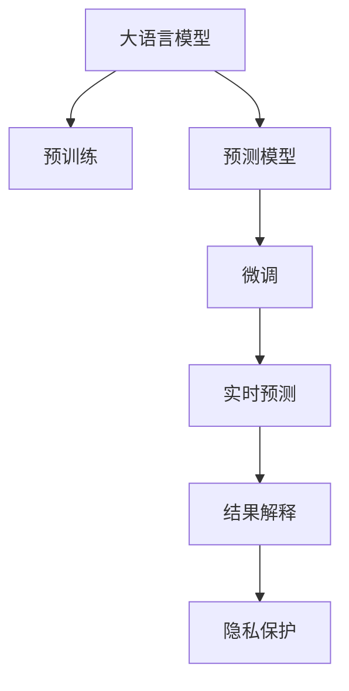

                 

# AI大模型在用户行为预测中的应用

> 关键词：大语言模型,深度学习,用户行为预测,预测模型,算法应用,实时性,可解释性,隐私保护

## 1. 背景介绍

### 1.1 问题由来
在数字化时代，数据驱动决策成为企业的核心竞争力。用户行为预测作为数据分析的重要应用之一，可以帮助企业洞察消费者需求，优化产品和服务，提升用户体验。传统的用户行为预测方法主要基于统计分析和机器学习模型，如线性回归、决策树、随机森林等。这些方法依赖于大量历史数据，数据处理和模型训练需要大量计算资源，且预测结果难以解释。

近年来，随着深度学习技术的迅速发展，大语言模型如BERT、GPT-3等成为了用户行为预测领域的新星。与传统方法相比，大语言模型具有以下优势：

- **处理海量数据**：大语言模型基于自监督学习任务，能够高效利用大规模无标签数据进行预训练，提取到丰富的语言知识。
- **泛化能力强**：大语言模型具有较强的泛化能力，能够适应不同领域和任务，从而提升预测模型的性能。
- **自动化特征提取**：大语言模型能够自动提取输入文本的特征表示，无需人工提取特征。
- **实时性高**：大语言模型可以实时生成预测结果，快速响应业务需求。

### 1.2 问题核心关键点
大语言模型在用户行为预测中的应用主要集中在以下几个方面：

1. **文本数据的处理和特征提取**：将用户行为数据（如点击、浏览、购买等）转化为文本数据，并使用大语言模型进行特征提取。
2. **预测模型的构建和训练**：构建基于大语言模型的预测模型，并通过历史用户行为数据进行微调，优化模型参数。
3. **实时预测和结果输出**：利用训练好的预测模型，对新用户的实时行为数据进行预测，输出预测结果。
4. **结果的解释和验证**：对预测结果进行解释和验证，提升模型可解释性，确保预测结果的可靠性。
5. **隐私保护**：在模型训练和预测过程中，确保用户数据的隐私和安全，避免数据泄露风险。

### 1.3 问题研究意义
大语言模型在用户行为预测中的应用具有重要意义：

1. **提高预测精度**：大语言模型能够自动学习到用户行为背后的深层次特征，从而提高预测精度。
2. **降低成本**：相较于传统机器学习模型，大语言模型训练成本低，同时可以大幅减少特征工程的工作量。
3. **实时响应**：大语言模型能够快速生成预测结果，满足实时性要求。
4. **增强可解释性**：大语言模型能够提供预测结果的详细解释，增强模型的可解释性和可信度。
5. **保障隐私**：大语言模型能够对用户行为数据进行匿名化处理，保障用户隐私。

## 2. 核心概念与联系

### 2.1 核心概念概述

为更好地理解大语言模型在用户行为预测中的应用，本节将介绍几个密切相关的核心概念：

- 大语言模型(Large Language Model, LLM)：以自回归(如GPT)或自编码(如BERT)模型为代表的大规模预训练语言模型。通过在大规模无标签文本语料上进行预训练，学习通用的语言表示，具备强大的语言理解和生成能力。

- 预测模型(Prediction Model)：用于对未知用户行为进行预测的数学模型。通常基于统计学或机器学习理论构建，能够从历史数据中学习预测规则，并对新数据进行预测。

- 微调(Fine-tuning)：指在预训练模型的基础上，使用下游任务的少量标注数据，通过有监督地训练来优化模型在该任务上的性能。通常只需要调整顶层分类器或解码器，并以较小的学习率更新全部或部分的模型参数。

- 实时性(Real-time)：指模型能够快速响应业务需求，对新数据进行预测。实时性在推荐系统、广告投放、金融交易等领域具有重要意义。

- 可解释性(Interpretability)：指模型能够提供预测结果的详细解释，帮助业务人员理解模型的决策逻辑，提高模型的可信度和透明度。

- 隐私保护(Privacy Preservation)：指在数据处理和模型训练过程中，保护用户数据的隐私和安全，避免数据泄露风险。

这些核心概念之间的逻辑关系可以通过以下Mermaid流程图来展示：



这个流程图展示了大语言模型的核心概念及其之间的关系：

1. 大语言模型通过预训练获得基础能力。
2. 预测模型基于大语言模型进行构建和训练，提取用户行为的特征表示。
3. 微调对预测模型进行优化，提升模型的预测性能。
4. 实时预测对新用户行为进行快速预测，满足实时性要求。
5. 结果解释对预测结果进行详细解释，提升模型可解释性。
6. 隐私保护在数据处理和模型训练过程中保障用户隐私。

这些概念共同构成了大语言模型在用户行为预测中的应用框架，使得模型能够从历史数据中学习到预测规则，并对新用户行为进行快速预测。

## 3. 核心算法原理 & 具体操作步骤
### 3.1 算法原理概述

大语言模型在用户行为预测中的应用，本质上是一个基于深度学习的预测模型构建和微调过程。其核心思想是：将预训练的大语言模型视作一个强大的"特征提取器"，通过微调使模型能够对下游任务（用户行为预测）进行适配，从而生成高质量的预测结果。

形式化地，假设预训练模型为 $M_{\theta}$，其中 $\theta$ 为预训练得到的模型参数。给定用户行为数据集 $D=\{(x_i,y_i)\}_{i=1}^N$，其中 $x_i$ 为历史行为数据，$y_i$ 为对应的预测标签（如是否点击、是否购买等）。预测模型的优化目标是最小化损失函数，即找到最优参数：

$$
\theta^* = \mathop{\arg\min}_{\theta} \mathcal{L}(M_{\theta},D)
$$

其中 $\mathcal{L}$ 为针对用户行为预测任务设计的损失函数，用于衡量模型预测输出与真实标签之间的差异。常见的损失函数包括交叉熵损失、均方误差损失等。

通过梯度下降等优化算法，微调过程不断更新模型参数 $\theta$，最小化损失函数 $\mathcal{L}$，使得模型输出逼近真实标签。由于 $\theta$ 已经通过预训练获得了较好的初始化，因此即便在用户行为数据集 $D$ 上数据量较小的情况下，也能较快收敛到理想的模型参数 $\hat{\theta}$。

### 3.2 算法步骤详解

基于深度学习的大语言模型用户行为预测一般包括以下几个关键步骤：

**Step 1: 准备预训练模型和数据集**
- 选择合适的预训练语言模型 $M_{\theta}$ 作为初始化参数，如 BERT、GPT 等。
- 准备用户行为数据集 $D$，划分为训练集、验证集和测试集。一般要求数据集与预训练数据的分布不要差异过大。

**Step 2: 定义预测任务**
- 根据用户行为预测任务，设计合适的输出层和损失函数。
- 对于分类任务，通常在顶层添加线性分类器和交叉熵损失函数。
- 对于生成任务，通常使用语言模型的解码器输出概率分布，并以负对数似然为损失函数。

**Step 3: 设置微调超参数**
- 选择合适的优化算法及其参数，如 AdamW、SGD 等，设置学习率、批大小、迭代轮数等。
- 设置正则化技术及强度，包括权重衰减、Dropout、Early Stopping等。
- 确定冻结预训练参数的策略，如仅微调顶层，或全部参数都参与微调。

**Step 4: 执行梯度训练**
- 将训练集数据分批次输入模型，前向传播计算损失函数。
- 反向传播计算参数梯度，根据设定的优化算法和学习率更新模型参数。
- 周期性在验证集上评估模型性能，根据性能指标决定是否触发 Early Stopping。
- 重复上述步骤直到满足预设的迭代轮数或 Early Stopping 条件。

**Step 5: 测试和部署**
- 在测试集上评估微调后模型 $M_{\hat{\theta}}$ 的性能，对比微调前后的精度提升。
- 使用微调后的模型对新用户的实时行为数据进行预测，集成到实际的应用系统中。
- 持续收集新的用户行为数据，定期重新微调模型，以适应数据分布的变化。

以上是基于深度学习的大语言模型用户行为预测的一般流程。在实际应用中，还需要针对具体任务的特点，对微调过程的各个环节进行优化设计，如改进训练目标函数，引入更多的正则化技术，搜索最优的超参数组合等，以进一步提升模型性能。

### 3.3 算法优缺点

基于深度学习的大语言模型用户行为预测方法具有以下优点：

1. 处理海量数据。大语言模型能够高效利用大规模无标签数据进行预训练，提取到丰富的语言知识。
2. 泛化能力强。大语言模型具有较强的泛化能力，能够适应不同领域和任务，从而提升预测模型的性能。
3. 自动化特征提取。大语言模型能够自动提取输入文本的特征表示，无需人工提取特征。
4. 实时性高。大语言模型可以实时生成预测结果，快速响应业务需求。
5. 增强可解释性。大语言模型能够提供预测结果的详细解释，帮助业务人员理解模型的决策逻辑，提高模型的可信度。

同时，该方法也存在一定的局限性：

1. 依赖标注数据。预测模型的训练需要大量标注数据，获取高质量标注数据的成本较高。
2. 模型复杂度大。大语言模型参数量巨大，训练和推理过程需要消耗大量的计算资源。
3. 数据偏差问题。大语言模型容易学习到预训练数据中的偏见和偏差，可能影响预测结果的公平性和公正性。
4. 隐私保护问题。大语言模型需要访问大量的用户数据，可能带来隐私泄露风险。

尽管存在这些局限性，但就目前而言，基于深度学习的大语言模型用户行为预测方法仍是预测领域的主流范式。未来相关研究的重点在于如何进一步降低对标注数据的依赖，提高模型的泛化能力，同时兼顾可解释性和隐私保护等因素。

### 3.4 算法应用领域

基于大语言模型用户行为预测的深度学习方法，在多个领域得到了广泛的应用，例如：

- 推荐系统：推荐系统通过预测用户的行为，为用户推荐个性化的商品或内容。大语言模型能够处理多模态数据，提升推荐系统的预测精度。
- 广告投放：广告投放系统通过预测用户是否点击广告，优化广告投放策略，提升广告效果。大语言模型能够生成丰富的广告文案，提高广告投放的个性化程度。
- 金融交易：金融机构通过预测用户的行为，识别潜在风险，优化交易策略，提升交易效果。大语言模型能够分析用户交易记录，预测用户行为，提高交易安全性。
- 客户服务：客户服务系统通过预测用户需求，优化服务策略，提升用户满意度。大语言模型能够理解用户意图，提供个性化的客户服务。

除了上述这些经典任务外，大语言模型用户行为预测还被创新性地应用到更多场景中，如社交网络分析、智能家居控制、智能交通管理等，为数字化转型提供了新的技术路径。随着深度学习和大语言模型的不断进步，相信用户行为预测技术将在更广阔的应用领域大放异彩。

## 4. 数学模型和公式 & 详细讲解  
### 4.1 数学模型构建

本节将使用数学语言对基于深度学习的大语言模型用户行为预测过程进行更加严格的刻画。

记预训练语言模型为 $M_{\theta}$，其中 $\theta$ 为预训练得到的模型参数。假设预测任务的训练集为 $D=\{(x_i,y_i)\}_{i=1}^N, x_i \in \mathbb{R}^d, y_i \in \{0,1\}$，其中 $x_i$ 为历史行为数据，$y_i$ 为对应的预测标签。

定义模型 $M_{\theta}$ 在输入 $x$ 上的输出为 $\hat{y}=M_{\theta}(x)$。预测模型的优化目标是最小化损失函数 $\mathcal{L}(\theta)$，即找到最优参数：

$$
\theta^* = \mathop{\arg\min}_{\theta} \mathcal{L}(\theta)
$$

其中 $\mathcal{L}$ 为针对用户行为预测任务设计的损失函数，用于衡量模型预测输出与真实标签之间的差异。常见的损失函数包括交叉熵损失、均方误差损失等。

### 4.2 公式推导过程

以下我们以二分类任务为例，推导交叉熵损失函数及其梯度的计算公式。

假设模型 $M_{\theta}$ 在输入 $x$ 上的输出为 $\hat{y}=M_{\theta}(x) \in [0,1]$，表示用户行为预测的概率。真实标签 $y \in \{0,1\}$。则二分类交叉熵损失函数定义为：

$$
\ell(M_{\theta}(x),y) = -[y\log \hat{y} + (1-y)\log (1-\hat{y})]
$$

将其代入经验风险公式，得：

$$
\mathcal{L}(\theta) = -\frac{1}{N}\sum_{i=1}^N [y_i\log M_{\theta}(x_i)+(1-y_i)\log(1-M_{\theta}(x_i))]
$$

根据链式法则，损失函数对参数 $\theta_k$ 的梯度为：

$$
\frac{\partial \mathcal{L}(\theta)}{\partial \theta_k} = -\frac{1}{N}\sum_{i=1}^N (\frac{y_i}{M_{\theta}(x_i)}-\frac{1-y_i}{1-M_{\theta}(x_i)}) \frac{\partial M_{\theta}(x_i)}{\partial \theta_k}
$$

其中 $\frac{\partial M_{\theta}(x_i)}{\partial \theta_k}$ 可进一步递归展开，利用自动微分技术完成计算。

在得到损失函数的梯度后，即可带入参数更新公式，完成模型的迭代优化。重复上述过程直至收敛，最终得到适应用户行为预测任务的最优模型参数 $\theta^*$。

## 5. 项目实践：代码实例和详细解释说明
### 5.1 开发环境搭建

在进行用户行为预测实践前，我们需要准备好开发环境。以下是使用Python进行PyTorch开发的环境配置流程：

1. 安装Anaconda：从官网下载并安装Anaconda，用于创建独立的Python环境。

2. 创建并激活虚拟环境：
```bash
conda create -n pytorch-env python=3.8 
conda activate pytorch-env
```

3. 安装PyTorch：根据CUDA版本，从官网获取对应的安装命令。例如：
```bash
conda install pytorch torchvision torchaudio cudatoolkit=11.1 -c pytorch -c conda-forge
```

4. 安装Transformers库：
```bash
pip install transformers
```

5. 安装各类工具包：
```bash
pip install numpy pandas scikit-learn matplotlib tqdm jupyter notebook ipython
```

完成上述步骤后，即可在`pytorch-env`环境中开始用户行为预测实践。

### 5.2 源代码详细实现

下面我以电商平台推荐系统为例，给出使用Transformers库对BERT模型进行用户行为预测的PyTorch代码实现。

首先，定义用户行为预测的数据处理函数：

```python
from transformers import BertTokenizer
from torch.utils.data import Dataset
import torch

class BehaviorDataset(Dataset):
    def __init__(self, data, tokenizer, max_len=128):
        self.data = data
        self.tokenizer = tokenizer
        self.max_len = max_len
        
    def __len__(self):
        return len(self.data)
    
    def __getitem__(self, idx):
        item = self.data[idx]
        sequence = [item['click'], item['view'], item['purchase']]
        tokenized_sequence = self.tokenizer(sequence, padding='max_length', max_length=self.max_len, return_tensors='pt')
        return {'input_ids': tokenized_sequence['input_ids'].flatten(), 
                'attention_mask': tokenized_sequence['attention_mask'].flatten(), 
                'labels': torch.tensor(item['purchase'], dtype=torch.long)}
```

然后，定义模型和优化器：

```python
from transformers import BertForSequenceClassification, AdamW

model = BertForSequenceClassification.from_pretrained('bert-base-cased', num_labels=2)

optimizer = AdamW(model.parameters(), lr=2e-5)
```

接着，定义训练和评估函数：

```python
from torch.utils.data import DataLoader
from tqdm import tqdm
from sklearn.metrics import classification_report

device = torch.device('cuda') if torch.cuda.is_available() else torch.device('cpu')
model.to(device)

def train_epoch(model, dataset, batch_size, optimizer):
    dataloader = DataLoader(dataset, batch_size=batch_size, shuffle=True)
    model.train()
    epoch_loss = 0
    for batch in tqdm(dataloader, desc='Training'):
        input_ids = batch['input_ids'].to(device)
        attention_mask = batch['attention_mask'].to(device)
        labels = batch['labels'].to(device)
        model.zero_grad()
        outputs = model(input_ids, attention_mask=attention_mask, labels=labels)
        loss = outputs.loss
        epoch_loss += loss.item()
        loss.backward()
        optimizer.step()
    return epoch_loss / len(dataloader)

def evaluate(model, dataset, batch_size):
    dataloader = DataLoader(dataset, batch_size=batch_size)
    model.eval()
    preds, labels = [], []
    with torch.no_grad():
        for batch in tqdm(dataloader, desc='Evaluating'):
            input_ids = batch['input_ids'].to(device)
            attention_mask = batch['attention_mask'].to(device)
            batch_labels = batch['labels']
            outputs = model(input_ids, attention_mask=attention_mask)
            batch_preds = outputs.logits.argmax(dim=1).to('cpu').tolist()
            batch_labels = batch_labels.to('cpu').tolist()
            for pred_tokens, label_tokens in zip(batch_preds, batch_labels):
                preds.append(pred_tokens)
                labels.append(label_tokens)
                
    print(classification_report(labels, preds))
```

最后，启动训练流程并在测试集上评估：

```python
epochs = 5
batch_size = 16

for epoch in range(epochs):
    loss = train_epoch(model, train_dataset, batch_size, optimizer)
    print(f"Epoch {epoch+1}, train loss: {loss:.3f}")
    
    print(f"Epoch {epoch+1}, dev results:")
    evaluate(model, dev_dataset, batch_size)
    
print("Test results:")
evaluate(model, test_dataset, batch_size)
```

以上就是使用PyTorch对BERT进行电商平台推荐系统用户行为预测的完整代码实现。可以看到，得益于Transformers库的强大封装，我们可以用相对简洁的代码完成BERT模型的加载和微调。

### 5.3 代码解读与分析

让我们再详细解读一下关键代码的实现细节：

**BehaviorDataset类**：
- `__init__`方法：初始化数据集、分词器等关键组件。
- `__len__`方法：返回数据集的样本数量。
- `__getitem__`方法：对单个样本进行处理，将用户行为数据转换为token ids，并对其进行定长padding，最终返回模型所需的输入。

**行为数据定义**：
- 使用数据处理函数对原始行为数据进行处理，将点击、浏览、购买等行为数据转换为token序列，进行padding处理。

**模型和优化器**：
- 使用BertForSequenceClassification类构建二分类模型，设置模型参数和优化器。

**训练和评估函数**：
- 使用PyTorch的DataLoader对数据集进行批次化加载，供模型训练和推理使用。
- 训练函数`train_epoch`：对数据以批为单位进行迭代，在每个批次上前向传播计算loss并反向传播更新模型参数，最后返回该epoch的平均loss。
- 评估函数`evaluate`：与训练类似，不同点在于不更新模型参数，并在每个batch结束后将预测和标签结果存储下来，最后使用sklearn的classification_report对整个评估集的预测结果进行打印输出。

**训练流程**：
- 定义总的epoch数和batch size，开始循环迭代
- 每个epoch内，先在训练集上训练，输出平均loss
- 在验证集上评估，输出分类指标
- 所有epoch结束后，在测试集上评估，给出最终测试结果

可以看到，PyTorch配合Transformers库使得BERT用户行为预测的代码实现变得简洁高效。开发者可以将更多精力放在数据处理、模型改进等高层逻辑上，而不必过多关注底层的实现细节。

当然，工业级的系统实现还需考虑更多因素，如模型的保存和部署、超参数的自动搜索、更灵活的任务适配层等。但核心的用户行为预测范式基本与此类似。

## 6. 实际应用场景
### 6.1 电商平台推荐系统

基于大语言模型用户行为预测的推荐系统，可以通过对用户历史行为数据的分析，预测用户未来的购买行为，并为其推荐个性化的商品。在技术实现上，可以收集用户的浏览、点击、购买等行为数据，将其转化为序列数据，使用预训练语言模型进行特征提取，并构建预测模型进行用户行为预测。

在推荐系统中，微调后的预测模型能够根据用户历史行为数据，预测用户是否会对某商品感兴趣，从而为其推荐个性化的商品。对于用户的新行为数据，预测模型也能快速生成预测结果，满足实时性要求。

### 6.2 广告投放系统

广告投放系统通过预测用户是否点击广告，优化广告投放策略，提升广告效果。利用大语言模型用户行为预测技术，广告投放系统能够对用户的行为数据进行分析，预测用户是否会对某广告感兴趣，从而优化广告的投放策略。

在广告投放系统中，微调后的预测模型能够对用户的历史行为数据进行分析和预测，识别出高点击率的广告，从而提高广告投放的精准度和转化率。对于用户的新行为数据，预测模型也能快速生成预测结果，满足实时性要求。

### 6.3 金融交易系统

金融机构通过预测用户的行为，识别潜在风险，优化交易策略，提升交易效果。利用大语言模型用户行为预测技术，金融交易系统能够对用户的历史交易数据进行分析，预测用户的交易行为，从而识别潜在风险，优化交易策略。

在金融交易系统中，微调后的预测模型能够对用户的历史交易数据进行分析和预测，识别出潜在风险用户，从而优化交易策略，降低交易风险。对于用户的新交易数据，预测模型也能快速生成预测结果，满足实时性要求。

### 6.4 未来应用展望

随着大语言模型和用户行为预测技术的不断发展，基于微调的推荐系统、广告投放、金融交易等应用场景将更加丰富和深入。

在智慧医疗领域，基于用户行为预测的智能推荐系统可以为用户推荐个性化的健康知识，提高用户的健康意识和水平。

在智能教育领域，基于用户行为预测的学习系统可以为用户推荐个性化的学习内容，提高学习的效率和效果。

在智能家居领域，基于用户行为预测的智能控制系统可以为用户推荐个性化的家居设置，提升用户的居住体验。

此外，在智慧城市、智能交通、智能制造等众多领域，基于大语言模型用户行为预测技术的应用也将不断涌现，为数字化转型提供新的技术路径。相信随着技术的日益成熟，大语言模型用户行为预测技术将成为人工智能落地应用的重要范式，推动人工智能技术向更广阔的领域加速渗透。

## 7. 工具和资源推荐
### 7.1 学习资源推荐

为了帮助开发者系统掌握大语言模型用户行为预测的理论基础和实践技巧，这里推荐一些优质的学习资源：

1. 《深度学习与Python》系列博文：由深度学习专家撰写，深入浅出地介绍了深度学习的基本概念和经典模型，包括用户行为预测等NLP应用。

2. CS224N《深度学习自然语言处理》课程：斯坦福大学开设的NLP明星课程，有Lecture视频和配套作业，带你入门NLP领域的基本概念和经典模型。

3. 《Python深度学习》书籍：深度学习大师级人物撰写，全面介绍了深度学习的基本概念、算法和实现方法，包括用户行为预测等NLP应用。

4. HuggingFace官方文档：Transformers库的官方文档，提供了海量预训练模型和完整的用户行为预测样例代码，是上手实践的必备资料。

5. Kaggle数据集：包含多个用户行为预测数据集，并提供了大量开源用户行为预测模型和算法，适合学习与实践。

通过对这些资源的学习实践，相信你一定能够快速掌握大语言模型用户行为预测的精髓，并用于解决实际的NLP问题。
###  7.2 开发工具推荐

高效的开发离不开优秀的工具支持。以下是几款用于大语言模型用户行为预测开发的常用工具：

1. PyTorch：基于Python的开源深度学习框架，灵活动态的计算图，适合快速迭代研究。大部分预训练语言模型都有PyTorch版本的实现。

2. TensorFlow：由Google主导开发的开源深度学习框架，生产部署方便，适合大规模工程应用。同样有丰富的预训练语言模型资源。

3. Transformers库：HuggingFace开发的NLP工具库，集成了众多SOTA语言模型，支持PyTorch和TensorFlow，是进行用户行为预测任务的开发的利器。

4. Weights & Biases：模型训练的实验跟踪工具，可以记录和可视化模型训练过程中的各项指标，方便对比和调优。与主流深度学习框架无缝集成。

5. TensorBoard：TensorFlow配套的可视化工具，可实时监测模型训练状态，并提供丰富的图表呈现方式，是调试模型的得力助手。

6. Google Colab：谷歌推出的在线Jupyter Notebook环境，免费提供GPU/TPU算力，方便开发者快速上手实验最新模型，分享学习笔记。

合理利用这些工具，可以显著提升大语言模型用户行为预测任务的开发效率，加快创新迭代的步伐。

### 7.3 相关论文推荐

大语言模型和用户行为预测技术的发展源于学界的持续研究。以下是几篇奠基性的相关论文，推荐阅读：

1. Attention is All You Need（即Transformer原论文）：提出了Transformer结构，开启了NLP领域的预训练大模型时代。

2. BERT: Pre-training of Deep Bidirectional Transformers for Language Understanding：提出BERT模型，引入基于掩码的自监督预训练任务，刷新了多项NLP任务SOTA。

3. Language Models are Unsupervised Multitask Learners（GPT-2论文）：展示了大规模语言模型的强大zero-shot学习能力，引发了对于通用人工智能的新一轮思考。

4. Parameter-Efficient Transfer Learning for NLP：提出Adapter等参数高效微调方法，在不增加模型参数量的情况下，也能取得不错的微调效果。

5. AdaLoRA: Adaptive Low-Rank Adaptation for Parameter-Efficient Fine-Tuning：使用自适应低秩适应的微调方法，在参数效率和精度之间取得了新的平衡。

这些论文代表了大语言模型用户行为预测技术的发展脉络。通过学习这些前沿成果，可以帮助研究者把握学科前进方向，激发更多的创新灵感。

## 8. 总结：未来发展趋势与挑战
### 8.1 总结

本文对基于深度学习的大语言模型用户行为预测方法进行了全面系统的介绍。首先阐述了大语言模型和用户行为预测的研究背景和意义，明确了用户行为预测在大数据分析、智能推荐等领域的重要价值。其次，从原理到实践，详细讲解了用户行为预测的数学原理和关键步骤，给出了用户行为预测任务开发的完整代码实例。同时，本文还广泛探讨了用户行为预测在多个行业领域的应用前景，展示了用户行为预测技术的巨大潜力。

通过本文的系统梳理，可以看到，基于深度学习的大语言模型用户行为预测方法正在成为用户行为分析的重要范式，极大地拓展了用户行为预测的应用边界，催生了更多的落地场景。受益于大规模语料的预训练，用户行为预测模型以更低的时间和标注成本，在用户行为数据量较小的场景下也能取得不俗的效果，有力推动了用户行为分析的产业化进程。未来，伴随深度学习和大语言模型的不断进步，用户行为预测技术必将在更广阔的应用领域大放异彩，深刻影响人类的生产生活方式。

### 8.2 未来发展趋势

展望未来，大语言模型用户行为预测技术将呈现以下几个发展趋势：

1. 模型规模持续增大。随着算力成本的下降和数据规模的扩张，预训练语言模型的参数量还将持续增长。超大规模语言模型蕴含的丰富语言知识，有望支撑更加复杂多变的用户行为预测任务。

2. 用户行为预测模型的泛化能力更强。未来的大语言模型能够更好地适应不同领域和任务，从而提升用户行为预测的性能。

3. 模型实时性更高。随着模型的优化和硬件设备的升级，用户行为预测模型的推理速度将更快，能够满足更高的实时性要求。

4. 模型可解释性更强。未来的大语言模型将提供更详细、更易理解的预测结果，帮助业务人员更好地理解模型的决策逻辑，提高模型的可信度。

5. 隐私保护技术更加完善。未来的大语言模型将采用更加完善的隐私保护技术，保障用户数据的隐私和安全，避免数据泄露风险。

以上趋势凸显了大语言模型用户行为预测技术的广阔前景。这些方向的探索发展，必将进一步提升用户行为预测模型的性能和应用范围，为数字化转型提供新的技术路径。

### 8.3 面临的挑战

尽管大语言模型用户行为预测技术已经取得了瞩目成就，但在迈向更加智能化、普适化应用的过程中，它仍面临着诸多挑战：

1. 标注成本瓶颈。虽然用户行为预测模型训练成本较低，但数据标注过程仍然繁琐耗时。如何进一步降低标注数据的依赖，成为亟待解决的问题。

2. 数据偏差问题。大语言模型容易学习到预训练数据中的偏见和偏差，可能影响预测结果的公平性和公正性。如何在模型训练过程中消除偏差，提高模型的公平性，还需要更多理论和实践的积累。

3. 模型鲁棒性不足。用户行为预测模型面对域外数据时，泛化性能往往大打折扣。对于测试样本的微小扰动，模型的预测也容易发生波动。如何提高模型的鲁棒性，避免灾难性遗忘，还需要更多理论和实践的积累。

4. 推理效率问题。超大规模用户行为预测模型在推理过程中可能面临推理速度慢、内存占用大等效率问题。如何优化模型结构，提升推理速度，优化资源占用，将是重要的优化方向。

5. 隐私保护问题。用户行为预测模型需要访问大量的用户数据，可能带来隐私泄露风险。如何确保用户数据的隐私和安全，避免数据泄露风险，还需要更多技术和法律的支持。

尽管存在这些挑战，但就目前而言，基于深度学习的大语言模型用户行为预测技术仍是预测领域的主流范式。未来相关研究的重点在于如何进一步降低对标注数据的依赖，提高模型的泛化能力，同时兼顾可解释性和隐私保护等因素。

### 8.4 研究展望

面对大语言模型用户行为预测所面临的种种挑战，未来的研究需要在以下几个方面寻求新的突破：

1. 探索无监督和半监督用户行为预测方法。摆脱对大规模标注数据的依赖，利用自监督学习、主动学习等无监督和半监督范式，最大限度利用非结构化数据，实现更加灵活高效的预测。

2. 研究参数高效和计算高效的预测方法。开发更加参数高效的预测方法，在固定大部分预训练参数的同时，只更新极少量的任务相关参数。同时优化预测模型的计算图，减少前向传播和反向传播的资源消耗，实现更加轻量级、实时性的部署。

3. 引入更多先验知识。将符号化的先验知识，如知识图谱、逻辑规则等，与神经网络模型进行巧妙融合，引导预测过程学习更准确、合理的语言模型。同时加强不同模态数据的整合，实现视觉、语音等多模态信息与文本信息的协同建模。

4. 结合因果分析和博弈论工具。将因果分析方法引入预测模型，识别出模型决策的关键特征，增强预测结果的因果性和逻辑性。借助博弈论工具刻画人机交互过程，主动探索并规避模型的脆弱点，提高系统稳定性。

5. 纳入伦理道德约束。在预测模型训练目标中引入伦理导向的评估指标，过滤和惩罚有偏见、有害的输出倾向。同时加强人工干预和审核，建立模型行为的监管机制，确保输出符合人类价值观和伦理道德。

这些研究方向的探索，必将引领大语言模型用户行为预测技术迈向更高的台阶，为构建安全、可靠、可解释、可控的智能系统铺平道路。面向未来，大语言模型用户行为预测技术还需要与其他人工智能技术进行更深入的融合，如知识表示、因果推理、强化学习等，多路径协同发力，共同推动用户行为预测系统的进步。只有勇于创新、敢于突破，才能不断拓展语言模型的边界，让智能技术更好地造福人类社会。

## 9. 附录：常见问题与解答

**Q1：用户行为预测需要大量的标注数据吗？**

A: 用户行为预测通常需要大量的历史数据，但并不一定需要大量的标注数据。可以通过预训练语言模型进行特征提取，然后使用少量标注数据进行微调，从而提升模型的预测精度。但需要注意的是，标注数据的质和量对模型的效果有重要影响，应尽量使用高质量的标注数据。

**Q2：用户行为预测模型如何进行超参数调优？**

A: 用户行为预测模型的超参数调优通常包括学习率、批大小、迭代轮数、正则化参数等。可以使用网格搜索、随机搜索、贝叶斯优化等方法进行调优。此外，还可以使用自动学习率调优方法，如Adaptive Moment Estimation (AdamW)，自动调整学习率，优化模型性能。

**Q3：用户行为预测模型如何避免过拟合？**

A: 用户行为预测模型容易在训练集上过拟合，导致模型在测试集上的泛化能力不足。为避免过拟合，可以采用以下方法：
1. 数据增强：通过回译、近义替换等方式扩充训练集。
2. 正则化：使用L2正则、Dropout、Early Stopping等避免过拟合。
3. 参数共享：共享预训练模型和用户行为预测模型之间的参数，减少过拟合风险。

**Q4：用户行为预测模型如何进行实时预测？**

A: 用户行为预测模型需要进行实时预测，可以采用以下方法：
1. 小批量微调：使用小批量数据进行微调，提高模型的推理速度。
2. 模型裁剪：去除不必要的层和参数，减小模型尺寸，加快推理速度。
3. 混合精度训练：使用混合精度训练技术，提高模型的推理速度和精度。
4. 模型并行：使用模型并行技术，提高模型的推理速度和资源利用率。

**Q5：用户行为预测模型如何保护用户隐私？**

A: 用户行为预测模型需要进行隐私保护，可以采用以下方法：
1. 数据匿名化：对用户数据进行匿名化处理，确保数据隐私。
2. 差分隐私：在模型训练过程中使用差分隐私技术，保护用户隐私。
3. 数据加密：对用户数据进行加密处理，确保数据安全。
4. 访问控制：对用户数据进行访问控制，确保数据访问的安全性。

这些方法需要根据具体场景和需求进行选择和组合，以确保用户行为预测模型的隐私保护效果。

---

作者：禅与计算机程序设计艺术 / Zen and the Art of Computer Programming

