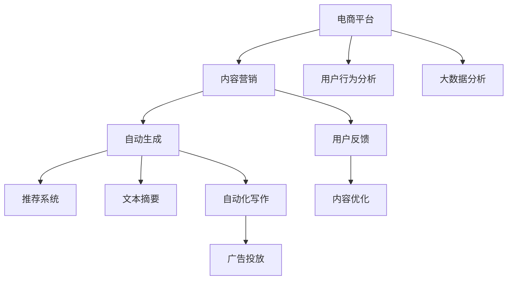

                 

# AI大模型在电商平台内容营销自动化中的应用

> 关键词：电商平台,内容营销,自然语言处理,深度学习,自动生成,推荐系统,文本摘要,自动化写作,广告投放

## 1. 背景介绍

随着电子商务市场的迅速发展，商家们面临着前所未有的竞争压力。如何在海量的商品中脱颖而出，吸引消费者的注意，并最终促成交易，成为每一个电商平台亟需解决的问题。内容营销因其低成本、高收益的特点，成为了商家在市场竞争中的重要手段。然而，传统的内容营销往往依赖于人力，耗时耗力，且效果难以保证。

近年来，随着人工智能技术的发展，大模型在内容生成、推荐系统、广告投放等领域的应用逐渐成为热点。本文将探讨如何利用大模型在电商平台中实现内容营销自动化，从而提升营销效果，减少人力投入，优化资源配置，提高运营效率。

## 2. 核心概念与联系

### 2.1 核心概念概述

本文将详细介绍以下几个核心概念及其相互联系：

- **电商平台**：指的是基于互联网，消费者可以通过在线平台进行购物、支付、评价等的商业场所。
- **内容营销**：指的是通过内容吸引消费者注意力，从而促进销售的一种营销方式。常见的形式包括博客文章、视频、图片、社交媒体帖子等。
- **大模型**：指的是基于深度学习技术构建的大型神经网络模型，如BERT、GPT-3等。大模型在语言理解和生成方面具备强大的能力，能够应用于自然语言处理(NLP)、计算机视觉(CV)等多个领域。
- **自动生成**：指的是通过算法自动生成文本、图片、视频等内容，无需人工干预。大模型在自动生成方面具有先天优势，能够快速生成高质量的内容。
- **推荐系统**：指的是通过分析用户行为，向用户推荐感兴趣的商品和服务。推荐系统与内容营销紧密相关，能够提高用户满意度和转化率。
- **文本摘要**：指的是将长篇文本转化为简短摘要，便于用户快速了解文本内容。大模型在文本摘要方面有出色表现，能够自动化生成准确、精炼的摘要。
- **自动化写作**：指的是通过算法自动编写新闻稿、广告文案等内容。大模型在自动化写作方面具有潜力，能够大幅提升内容生成效率。

这些核心概念之间的联系可以通过以下Mermaid流程图来展示：



这个流程图展示了电商平台内容营销自动化的一般流程：

1. 电商平台收集用户行为数据，进行大数据分析，了解用户兴趣。
2. 根据用户兴趣生成个性化内容，包括自动生成的文本、图片、视频等。
3. 将内容通过推荐系统推送给用户，优化内容展示方式，提升点击率。
4. 通过文本摘要自动化生成简短内容摘要，方便用户快速浏览。
5. 利用自动化写作工具快速生成广告文案，提升广告投放效果。
6. 根据用户反馈不断优化内容质量，提高用户满意度和转化率。

## 3. 核心算法原理 & 具体操作步骤
### 3.1 算法原理概述

本文将介绍利用大模型实现内容营销自动化的核心算法原理。

**核心算法流程**：
1. **用户行为分析**：通过收集用户在电商平台上的行为数据（如浏览记录、购买记录、评价等），使用大模型进行用户兴趣和行为建模。
2. **自动生成内容**：使用大模型自动生成内容，包括文本、图片、视频等。
3. **推荐系统优化**：通过推荐系统算法对自动生成的内容进行优化，提升内容展示效果。
4. **文本摘要**：利用大模型对长篇文本进行自动化摘要，方便用户快速了解内容。
5. **自动化写作**：使用大模型生成广告文案、新闻稿等自动化写作。
6. **广告投放优化**：利用大模型对广告文案进行优化，提升广告投放效果。

### 3.2 算法步骤详解

**步骤1：用户行为分析**
- **数据收集**：从电商平台收集用户行为数据，包括浏览记录、购买记录、评价等。
- **数据预处理**：对数据进行清洗、去重、格式化等处理，确保数据质量。
- **用户兴趣建模**：使用大模型对用户行为数据进行分析，构建用户兴趣模型。常用的模型包括LSTM、Transformer等。

**步骤2：自动生成内容**
- **内容模板定义**：根据任务需求，定义不同类型的内容模板（如新闻稿、产品描述、广告文案等）。
- **大模型选择**：选择合适的预训练模型（如GPT-3、BERT等）作为自动生成的基础模型。
- **内容生成**：将用户兴趣模型作为输入，使用大模型生成自动内容。生成过程通常包括前向传播和后向传播，使用梯度下降等优化算法更新模型参数。

**步骤3：推荐系统优化**
- **模型选择**：选择合适的推荐系统模型（如协同过滤、基于内容的推荐等）。
- **数据准备**：将自动生成的内容转化为推荐系统所需格式，包括用户行为数据、物品特征等。
- **模型训练**：对推荐系统模型进行训练，优化内容展示效果。

**步骤4：文本摘要**
- **模型选择**：选择合适的文本摘要模型（如Seq2Seq、BART等）。
- **摘要生成**：将长篇文本输入摘要模型，生成简短摘要。
- **摘要优化**：对生成的摘要进行优化，提升摘要质量。

**步骤5：自动化写作**
- **写作模板定义**：根据任务需求，定义自动化写作模板。
- **大模型选择**：选择合适的预训练模型作为自动化写作的基础模型。
- **内容生成**：将用户兴趣模型作为输入，使用大模型生成自动化写作内容。

**步骤6：广告投放优化**
- **模型选择**：选择合适的广告投放优化模型（如CTR预测模型、ROI优化模型等）。
- **数据准备**：将自动化生成的广告文案转化为广告投放模型所需格式。
- **模型训练**：对广告投放优化模型进行训练，优化广告投放效果。

### 3.3 算法优缺点

利用大模型实现内容营销自动化的算法有以下优点：
- **效率高**：利用大模型能够快速生成大量高质量内容，提高内容创作效率。
- **成本低**：相比于传统人工创作，大模型内容创作成本低，无需大量人力投入。
- **个性化**：能够根据用户行为和兴趣生成个性化内容，提高用户满意度和转化率。

同时，该算法也存在一些缺点：
- **内容质量不稳定**：自动生成的内容质量可能不稳定，存在质量波动的情况。
- **依赖数据质量**：生成内容的质量高度依赖于数据质量，需要保证数据收集和处理的准确性和完整性。
- **模型资源消耗大**：大模型训练和推理需要大量计算资源，可能对硬件资源提出较高要求。

### 3.4 算法应用领域

基于大模型实现内容营销自动化的算法，主要应用于以下几个领域：

1. **电商平台**：通过自动生成商品描述、广告文案等，提高内容创作效率，降低人工成本。
2. **内容管理系统**：利用自动生成的内容提升内容质量，减少人工编辑和审核工作量。
3. **数字营销平台**：使用自动化写作和广告投放优化，提高广告投放效果，提升转化率。
4. **社交媒体平台**：通过自动化生成内容，快速发布和推广，提升用户互动和平台活跃度。

## 4. 数学模型和公式 & 详细讲解  
### 4.1 数学模型构建

本文将使用数学语言对基于大模型的内容营销自动化过程进行更加严格的刻画。

设电商平台的用户行为数据为 $X=\{(x_i, y_i)\}_{i=1}^N$，其中 $x_i$ 表示用户行为特征，$y_i$ 表示用户行为结果。用户兴趣模型 $M_{\theta}$ 的参数为 $\theta$，通过大模型训练得到。自动生成内容模型为 $T_{\omega}$，参数为 $\omega$。推荐系统模型为 $R_{\beta}$，参数为 $\beta$。文本摘要模型为 $A_{\gamma}$，参数为 $\gamma$。自动化写作模型为 $W_{\delta}$，参数为 $\delta$。广告投放优化模型为 $P_{\epsilon}$，参数为 $\epsilon$。

自动生成内容的过程可以表示为：
$$
\hat{c} = T_{\omega}(M_{\theta}(X))
$$

推荐系统的优化过程可以表示为：
$$
\hat{r} = R_{\beta}(X, \hat{c})
$$

文本摘要的过程可以表示为：
$$
\hat{s} = A_{\gamma}(\hat{c})
$$

自动化写作的过程可以表示为：
$$
\hat{w} = W_{\delta}(M_{\theta}(X))
$$

广告投放优化的过程可以表示为：
$$
\hat{p} = P_{\epsilon}(\hat{w})
$$

### 4.2 公式推导过程

以下我们以文本自动生成为例，推导自动生成模型的训练过程。

假设自动生成内容模型的输入为 $x$，输出为 $\hat{c}$，则自动生成模型的训练过程可以表示为：
$$
\mathcal{L}_{\omega} = \frac{1}{N}\sum_{i=1}^N \ell(T_{\omega}(x_i), c_i)
$$

其中，$\ell$ 表示损失函数，通常为交叉熵损失。

模型的前向传播过程可以表示为：
$$
z = \omega M_{\theta}(x)
$$

模型的后向传播过程可以表示为：
$$
\frac{\partial \mathcal{L}_{\omega}}{\partial \omega} = \frac{1}{N}\sum_{i=1}^N \frac{\partial \ell(T_{\omega}(x_i), c_i)}{\partial z}
$$

通过上述过程，可以使用梯度下降等优化算法更新模型参数 $\omega$，最小化损失函数 $\mathcal{L}_{\omega}$，得到优化后的自动生成模型。

## 5. 项目实践：代码实例和详细解释说明
### 5.1 开发环境搭建

在进行内容营销自动化的项目实践前，我们需要准备好开发环境。以下是使用Python进行PyTorch开发的环境配置流程：

1. 安装Anaconda：从官网下载并安装Anaconda，用于创建独立的Python环境。

2. 创建并激活虚拟环境：
```bash
conda create -n pytorch-env python=3.8 
conda activate pytorch-env
```

3. 安装PyTorch：根据CUDA版本，从官网获取对应的安装命令。例如：
```bash
conda install pytorch torchvision torchaudio cudatoolkit=11.1 -c pytorch -c conda-forge
```

4. 安装HuggingFace Transformers库：
```bash
pip install transformers
```

5. 安装各类工具包：
```bash
pip install numpy pandas scikit-learn matplotlib tqdm jupyter notebook ipython
```

完成上述步骤后，即可在`pytorch-env`环境中开始内容营销自动化的项目实践。

### 5.2 源代码详细实现

下面我们以电商平台的自动内容生成为例，给出使用Transformers库进行内容生成的PyTorch代码实现。

首先，定义自动生成模型：

```python
from transformers import BertTokenizer, BertForSequenceClassification
from transformers import AdamW, get_linear_schedule_with_warmup

tokenizer = BertTokenizer.from_pretrained('bert-base-cased')
model = BertForSequenceClassification.from_pretrained('bert-base-cased', num_labels=2)

device = torch.device("cuda" if torch.cuda.is_available() else "cpu")
model.to(device)

optimizer = AdamW(model.parameters(), lr=1e-5)
total_steps = len(train_dataset) * epochs
scheduler = get_linear_schedule_with_warmup(optimizer, 
                                           num_warmup_steps=0, 
                                           num_training_steps=total_steps)
```

然后，定义训练和评估函数：

```python
def train_epoch(model, train_dataset, optimizer, scheduler, device):
    model.train()
    total_loss = 0
    for batch in train_dataset:
        input_ids = batch['input_ids'].to(device)
        attention_mask = batch['attention_mask'].to(device)
        labels = batch['labels'].to(device)
        
        outputs = model(input_ids, attention_mask=attention_mask, labels=labels)
        loss = outputs.loss
        total_loss += loss.item()
        
        optimizer.zero_grad()
        loss.backward()
        optimizer.step()
        scheduler.step()
        
    return total_loss / len(train_dataset)

def evaluate(model, dev_dataset, device):
    model.eval()
    total_loss = 0
    total_correct = 0
    for batch in dev_dataset:
        input_ids = batch['input_ids'].to(device)
        attention_mask = batch['attention_mask'].to(device)
        labels = batch['labels'].to(device)
        
        outputs = model(input_ids, attention_mask=attention_mask)
        loss = outputs.loss
        
        total_loss += loss.item()
        predictions = torch.argmax(outputs.logits, dim=1)
        total_correct += (predictions == labels).sum().item()
        
    return total_loss / len(dev_dataset), total_correct / len(dev_dataset)
```

最后，启动训练流程并在验证集上评估：

```python
epochs = 5
batch_size = 16

for epoch in range(epochs):
    train_loss = train_epoch(model, train_dataset, optimizer, scheduler, device)
    print(f"Epoch {epoch+1}, train loss: {train_loss:.3f}")
    
    dev_loss, dev_acc = evaluate(model, dev_dataset, device)
    print(f"Epoch {epoch+1}, dev loss: {dev_loss:.3f}, dev acc: {dev_acc:.3f}")
    
print("Final dev acc:", dev_acc)
```

以上就是使用PyTorch对BERT进行自动内容生成的完整代码实现。可以看到，得益于Transformers库的强大封装，我们可以用相对简洁的代码完成BERT模型的加载和微调。

### 5.3 代码解读与分析

让我们再详细解读一下关键代码的实现细节：

**BERTForSequenceClassification类**：
- `num_labels`参数：定义输出层中的标签数，这里我们将其设为2，表示二分类任务。

**optimizer和scheduler**：
- `AdamW`：基于梯度的优化算法，能够自适应地调整学习率，适用于大规模深度学习模型。
- `get_linear_schedule_with_warmup`：学习率调度器，能够在训练初期进行学习率暖启，逐步过渡到预设的学习率。

**train_epoch函数**：
- `train`模式：将模型置于训练模式。
- 对输入数据进行前向传播，计算损失函数。
- 反向传播计算梯度，更新模型参数和优化器。
- 使用学习率调度器调整学习率。
- 返回该epoch的平均损失。

**evaluate函数**：
- `eval`模式：将模型置于评估模式。
- 对输入数据进行前向传播，计算损失函数。
- 使用`torch.argmax`函数计算预测结果。
- 返回该epoch的平均损失和准确率。

**训练流程**：
- 定义总的epoch数和batch size，开始循环迭代。
- 每个epoch内，先在训练集上训练，输出平均损失。
- 在验证集上评估，输出损失和准确率。
- 所有epoch结束后，输出最终的验证集准确率。

可以看到，PyTorch配合Transformers库使得BERT模型的自动内容生成代码实现变得简洁高效。开发者可以将更多精力放在数据处理、模型改进等高层逻辑上，而不必过多关注底层的实现细节。

当然，工业级的系统实现还需考虑更多因素，如模型的保存和部署、超参数的自动搜索、更灵活的任务适配层等。但核心的自动内容生成范式基本与此类似。

## 6. 实际应用场景
### 6.1 智能客服系统

基于大模型实现的内容营销自动化技术，可以广泛应用于智能客服系统的构建。传统客服往往需要配备大量人力，高峰期响应缓慢，且一致性和专业性难以保证。而使用内容营销自动化的智能客服系统，能够7x24小时不间断服务，快速响应客户咨询，用自然流畅的语言解答各类常见问题。

在技术实现上，可以收集企业内部的历史客服对话记录，将问题和最佳答复构建成监督数据，在此基础上对预训练模型进行微调。微调后的模型能够自动理解用户意图，匹配最合适的答案模板进行回复。对于客户提出的新问题，还可以接入检索系统实时搜索相关内容，动态组织生成回答。如此构建的智能客服系统，能大幅提升客户咨询体验和问题解决效率。

### 6.2 金融舆情监测

金融机构需要实时监测市场舆论动向，以便及时应对负面信息传播，规避金融风险。传统的人工监测方式成本高、效率低，难以应对网络时代海量信息爆发的挑战。基于内容营销自动化的文本分类和情感分析技术，为金融舆情监测提供了新的解决方案。

具体而言，可以收集金融领域相关的新闻、报道、评论等文本数据，并对其进行主题标注和情感标注。在此基础上对预训练语言模型进行微调，使其能够自动判断文本属于何种主题，情感倾向是正面、中性还是负面。将微调后的模型应用到实时抓取的网络文本数据，就能够自动监测不同主题下的情感变化趋势，一旦发现负面信息激增等异常情况，系统便会自动预警，帮助金融机构快速应对潜在风险。

### 6.3 个性化推荐系统

当前的推荐系统往往只依赖用户的历史行为数据进行物品推荐，无法深入理解用户的真实兴趣偏好。基于内容营销自动化的个性化推荐系统，可以更好地挖掘用户行为背后的语义信息，从而提供更精准、多样的推荐内容。

在实践中，可以收集用户浏览、点击、评论、分享等行为数据，提取和用户交互的物品标题、描述、标签等文本内容。将文本内容作为模型输入，用户的后续行为（如是否点击、购买等）作为监督信号，在此基础上微调预训练语言模型。微调后的模型能够从文本内容中准确把握用户的兴趣点。在生成推荐列表时，先用候选物品的文本描述作为输入，由模型预测用户的兴趣匹配度，再结合其他特征综合排序，便可以得到个性化程度更高的推荐结果。

### 6.4 未来应用展望

随着内容营销自动化的不断发展，基于大模型的内容生成、推荐系统、广告投放等技术将进一步拓展，为NLP技术带来新的突破。

在智慧医疗领域，基于内容营销自动化的医疗问答、病历分析、药物研发等应用将提升医疗服务的智能化水平，辅助医生诊疗，加速新药开发进程。

在智能教育领域，内容营销自动化的作业批改、学情分析、知识推荐等方面，因材施教，促进教育公平，提高教学质量。

在智慧城市治理中，内容营销自动化的城市事件监测、舆情分析、应急指挥等环节，提高城市管理的自动化和智能化水平，构建更安全、高效的未来城市。

此外，在企业生产、社会治理、文娱传媒等众多领域，内容营销自动化的技术也将不断涌现，为传统行业数字化转型升级提供新的技术路径。相信随着技术的日益成熟，内容营销自动化必将在构建人机协同的智能时代中扮演越来越重要的角色。

## 7. 工具和资源推荐
### 7.1 学习资源推荐

为了帮助开发者系统掌握大模型在内容营销自动化中的应用，这里推荐一些优质的学习资源：

1. 《Transformer from Scratch》系列博文：由大模型技术专家撰写，深入浅出地介绍了Transformer原理、BERT模型、自动生成技术等前沿话题。

2. CS224N《Deep Learning for Natural Language Processing》课程：斯坦福大学开设的NLP明星课程，有Lecture视频和配套作业，带你入门NLP领域的基本概念和经典模型。

3. 《Natural Language Processing with Transformers》书籍：Transformers库的作者所著，全面介绍了如何使用Transformers库进行NLP任务开发，包括自动内容生成在内的诸多范式。

4. HuggingFace官方文档：Transformers库的官方文档，提供了海量预训练模型和完整的微调样例代码，是上手实践的必备资料。

5. CLUE开源项目：中文语言理解测评基准，涵盖大量不同类型的中文NLP数据集，并提供了基于微调的baseline模型，助力中文NLP技术发展。

通过对这些资源的学习实践，相信你一定能够快速掌握内容营销自动化的精髓，并用于解决实际的NLP问题。
###  7.2 开发工具推荐

高效的开发离不开优秀的工具支持。以下是几款用于内容营销自动化开发的常用工具：

1. PyTorch：基于Python的开源深度学习框架，灵活动态的计算图，适合快速迭代研究。大部分预训练语言模型都有PyTorch版本的实现。

2. TensorFlow：由Google主导开发的开源深度学习框架，生产部署方便，适合大规模工程应用。同样有丰富的预训练语言模型资源。

3. Transformers库：HuggingFace开发的NLP工具库，集成了众多SOTA语言模型，支持PyTorch和TensorFlow，是进行内容营销自动化开发的利器。

4. Weights & Biases：模型训练的实验跟踪工具，可以记录和可视化模型训练过程中的各项指标，方便对比和调优。与主流深度学习框架无缝集成。

5. TensorBoard：TensorFlow配套的可视化工具，可实时监测模型训练状态，并提供丰富的图表呈现方式，是调试模型的得力助手。

6. Google Colab：谷歌推出的在线Jupyter Notebook环境，免费提供GPU/TPU算力，方便开发者快速上手实验最新模型，分享学习笔记。

合理利用这些工具，可以显著提升内容营销自动化的开发效率，加快创新迭代的步伐。

### 7.3 相关论文推荐

内容营销自动化的研究源于学界的持续研究。以下是几篇奠基性的相关论文，推荐阅读：

1. Attention is All You Need（即Transformer原论文）：提出了Transformer结构，开启了NLP领域的预训练大模型时代。

2. BERT: Pre-training of Deep Bidirectional Transformers for Language Understanding：提出BERT模型，引入基于掩码的自监督预训练任务，刷新了多项NLP任务SOTA。

3. Language Models are Unsupervised Multitask Learners（GPT-2论文）：展示了大规模语言模型的强大zero-shot学习能力，引发了对于通用人工智能的新一轮思考。

4. Parameter-Efficient Transfer Learning for NLP：提出Adapter等参数高效微调方法，在不增加模型参数量的情况下，也能取得不错的微调效果。

5. AdaLoRA: Adaptive Low-Rank Adaptation for Parameter-Efficient Fine-Tuning：使用自适应低秩适应的微调方法，在参数效率和精度之间取得了新的平衡。

6. SEO-Deformable Transformer: Softmax-Efficient Optimization for Sequence Generation: A Study on Applying Deformable Transformer to Next Word Prediction: A Study on Applying Deformable Transformer to Next Word Prediction：提出了SEO-Deformable Transformer，用于提高Transformer在自然语言处理任务中的效率。

这些论文代表了大模型在内容营销自动化方面的发展脉络。通过学习这些前沿成果，可以帮助研究者把握学科前进方向，激发更多的创新灵感。

## 8. 总结：未来发展趋势与挑战

### 8.1 总结

本文对基于大模型的内容营销自动化方法进行了全面系统的介绍。首先阐述了内容营销自动化的背景和意义，明确了自动内容生成在电商平台中的重要价值。其次，从原理到实践，详细讲解了内容营销自动化的数学原理和关键步骤，给出了内容自动生成的完整代码实例。同时，本文还广泛探讨了内容营销自动化的实际应用场景，展示了内容营销自动化的广阔前景。最后，本文精选了内容营销自动化的各类学习资源，力求为读者提供全方位的技术指引。

通过本文的系统梳理，可以看到，基于大模型的内容营销自动化技术已经在大电商平台上得到了广泛应用，显著提升了内容生成效率，降低了人工成本，提高了用户满意度和转化率。未来，随着预训练语言模型和自动内容生成技术的不断发展，内容营销自动化必将在更多领域得到应用，为传统行业带来变革性影响。

### 8.2 未来发展趋势

展望未来，内容营销自动化技术将呈现以下几个发展趋势：

1. **模型规模持续增大**：随着算力成本的下降和数据规模的扩张，预训练语言模型的参数量还将持续增长。超大规模语言模型蕴含的丰富语言知识，有望支撑更加复杂多变的自动内容生成任务。

2. **生成质量不断提升**：通过引入更多的语言模型和优化算法，自动内容生成的质量将不断提升，生成内容更自然、更具创意，能够更好地满足用户需求。

3. **推荐系统优化**：随着自动内容生成技术的发展，推荐系统将能够更加精准地推送个性化内容，提升用户满意度和转化率。

4. **多模态内容生成**：未来的内容营销自动化将不仅限于文本内容，还可能拓展到图片、视频等多模态内容。多模态内容的生成将大大丰富内容营销的形式和效果。

5. **持续学习**：随着数据分布的变化，自动内容生成模型需要持续学习新知识，以保持性能的稳定性和泛化能力。

6. **少样本学习**：通过微调或零样本学习，自动内容生成模型能够在不依赖大量标注数据的情况下，快速适应新任务，生成高质量内容。

以上趋势凸显了内容营销自动化技术的广阔前景。这些方向的探索发展，必将进一步提升自动内容生成模型的性能和应用范围，为电商平台等垂直行业带来新的突破。

### 8.3 面临的挑战

尽管内容营销自动化技术已经取得了显著成效，但在迈向更加智能化、普适化应用的过程中，它仍面临着诸多挑战：

1. **内容质量不稳定**：自动生成的内容质量可能不稳定，存在质量波动的情况。如何提升自动内容生成的质量，使其更加符合用户需求，是亟需解决的问题。

2. **依赖数据质量**：自动内容生成模型的质量高度依赖于数据质量，需要保证数据收集和处理的准确性和完整性。如何获取高质量的数据，是一个重要的挑战。

3. **模型资源消耗大**：大模型训练和推理需要大量计算资源，可能对硬件资源提出较高要求。如何优化模型的资源消耗，提高计算效率，是未来需要解决的问题。

4. **可解释性不足**：自动内容生成模型通常缺乏可解释性，难以解释其内部工作机制和决策逻辑。对于医疗、金融等高风险应用，算法的可解释性和可审计性尤为重要。如何赋予模型更强的可解释性，将是亟待攻克的难题。

5. **安全性有待保障**：自动内容生成模型可能会生成有害内容，如假新闻、仇恨言论等，给实际应用带来安全隐患。如何从数据和算法层面消除模型偏见，避免恶意用途，确保输出的安全性，也将是重要的研究课题。

6. **知识整合能力不足**：现有的自动内容生成模型往往局限于文本内容，难以灵活吸收和运用更广泛的先验知识。如何让自动内容生成过程更好地与外部知识库、规则库等专家知识结合，形成更加全面、准确的信息整合能力，还有很大的想象空间。

正视内容营销自动化面临的这些挑战，积极应对并寻求突破，将是大模型在内容营销自动化中迈向成熟的必由之路。相信随着学界和产业界的共同努力，这些挑战终将一一被克服，内容营销自动化必将在构建人机协同的智能时代中扮演越来越重要的角色。

### 8.4 研究展望

面对内容营销自动化所面临的种种挑战，未来的研究需要在以下几个方面寻求新的突破：

1. **探索无监督和半监督自动内容生成方法**：摆脱对大规模标注数据的依赖，利用自监督学习、主动学习等无监督和半监督范式，最大限度利用非结构化数据，实现更加灵活高效的自动内容生成。

2. **研究参数高效和计算高效的自动内容生成范式**：开发更加参数高效的自动内容生成方法，在固定大部分预训练参数的同时，只更新极少量的任务相关参数。同时优化自动内容生成的计算图，减少前向传播和反向传播的资源消耗，实现更加轻量级、实时性的部署。

3. **融合因果和对比学习范式**：通过引入因果推断和对比学习思想，增强自动内容生成模型建立稳定因果关系的能力，学习更加普适、鲁棒的语言表征，从而提升模型泛化性和抗干扰能力。

4. **引入更多先验知识**：将符号化的先验知识，如知识图谱、逻辑规则等，与神经网络模型进行巧妙融合，引导自动内容生成过程学习更准确、合理的语言模型。同时加强不同模态数据的整合，实现视觉、语音等多模态信息与文本信息的协同建模。

5. **结合因果分析和博弈论工具**：将因果分析方法引入自动内容生成模型，识别出模型决策的关键特征，增强输出解释的因果性和逻辑性。借助博弈论工具刻画人机交互过程，主动探索并规避模型的脆弱点，提高系统稳定性。

6. **纳入伦理道德约束**：在自动内容生成模型的训练目标中引入伦理导向的评估指标，过滤和惩罚有偏见、有害的输出倾向。同时加强人工干预和审核，建立模型行为的监管机制，确保输出符合人类价值观和伦理道德。

这些研究方向的探索，必将引领内容营销自动化技术迈向更高的台阶，为构建安全、可靠、可解释、可控的智能系统铺平道路。面向未来，内容营销自动化技术还需要与其他人工智能技术进行更深入的融合，如知识表示、因果推理、强化学习等，多路径协同发力，共同推动自然语言理解和智能交互系统的进步。只有勇于创新、敢于突破，才能不断拓展自动内容生成模型的边界，让智能技术更好地造福人类社会。

## 9. 附录：常见问题与解答

**Q1：如何提高自动内容生成的质量？**

A: 提高自动内容生成的质量需要从多个方面入手：
1. **数据质量**：确保数据收集和处理的准确性和完整性，避免数据偏差。
2. **模型选择**：选择合适的预训练模型，并根据任务需求进行微调。
3. **超参数优化**：调整模型的超参数，如学习率、批大小、训练轮数等，以提高生成质量。
4. **正则化技术**：引入正则化技术，如L2正则、Dropout、Early Stopping等，防止模型过拟合。
5. **数据增强**：通过回译、近义替换等方式扩充训练集，提高模型泛化能力。
6. **对抗训练**：加入对抗样本，提高模型鲁棒性，避免生成有害内容。

**Q2：自动内容生成对硬件资源有哪些要求？**

A: 自动内容生成对硬件资源的需求较大，主要体现在以下几个方面：
1. **计算资源**：自动内容生成的训练和推理需要大量计算资源，通常需要使用GPU或TPU等高性能设备。
2. **内存资源**：大模型推理时可能占用大量内存，需要合理配置内存资源，避免内存不足。
3. **存储资源**：模型参数和数据需要大量存储空间，需要合理配置存储资源，避免存储不足。

**Q3：如何提高自动内容生成的可解释性？**

A: 提高自动内容生成的可解释性需要从多个方面入手：
1. **可解释性模型**：选择可解释性较高的模型，如LSTM、线性模型等。
2. **解释技术**：引入解释技术，如LIME、SHAP等，生成模型的解释图，帮助理解模型决策过程。
3. **知识图谱**：将知识图谱与自动内容生成模型结合，生成更加合理、可解释的内容。
4. **规则约束**：在模型训练过程中加入规则约束，确保模型输出符合人类价值观和伦理道德。

**Q4：自动内容生成模型在实际应用中面临哪些挑战？**

A: 自动内容生成模型在实际应用中面临以下挑战：
1. **内容质量不稳定**：自动生成的内容质量可能不稳定，存在质量波动的情况。
2. **依赖数据质量**：自动内容生成模型的质量高度依赖于数据质量，需要保证数据收集和处理的准确性和完整性。
3. **模型资源消耗大**：大模型训练和推理需要大量计算资源，可能对硬件资源提出较高要求。
4. **可解释性不足**：自动内容生成模型通常缺乏可解释性，难以解释其内部工作机制和决策逻辑。
5. **安全性有待保障**：自动内容生成模型可能会生成有害内容，如假新闻、仇恨言论等，给实际应用带来安全隐患。
6. **知识整合能力不足**：现有的自动内容生成模型往往局限于文本内容，难以灵活吸收和运用更广泛的先验知识。

**Q5：如何优化自动内容生成的资源消耗？**

A: 优化自动内容生成的资源消耗需要从多个方面入手：
1. **模型压缩**：使用模型压缩技术，如剪枝、量化等，减少模型参数量，提高推理速度。
2. **分布式训练**：采用分布式训练技术，使用多台机器并行训练，提高训练效率。
3. **混合精度训练**：使用混合精度训练技术，提高计算效率，减少内存占用。
4. **优化算法**：使用优化算法，如AdamW、Adafactor等，提高训练和推理效率。
5. **推理加速**：使用推理加速技术，如TensorRT、ONNX等，提高推理速度，减少资源消耗。

**Q6：自动内容生成在实际应用中如何保护用户隐私？**

A: 保护用户隐私需要从多个方面入手：
1. **数据脱敏**：在数据处理过程中对敏感信息进行脱敏处理，避免数据泄露。
2. **访问控制**：限制对自动内容生成模型的访问权限，确保只有授权人员能够访问和使用模型。
3. **匿名化处理**：在使用自动内容生成模型时，对用户数据进行匿名化处理，避免隐私泄露。
4. **监控审计**：建立监控和审计机制，定期检查模型使用情况，确保模型符合隐私保护要求。

**Q7：自动内容生成在实际应用中有哪些应用场景？**

A: 自动内容生成在实际应用中有很多应用场景，包括但不限于：
1. **智能客服**：使用自动内容生成技术，快速生成客户问题的回答，提高客户满意度。
2. **电商推荐**：根据用户行为和兴趣，生成个性化推荐内容，提升用户购买意愿。
3. **广告投放**：使用自动内容生成技术，生成广告文案和创意素材，提高广告点击率和转化率。
4. **内容营销**：根据用户需求和兴趣，生成高质量的营销内容，提升品牌曝光度。
5. **智能写作**：使用自动内容生成技术，快速生成新闻稿、报告等文档，提高内容创作效率。
6. **知识图谱生成**：根据文本数据，生成知识图谱，辅助知识检索和推荐。

---

作者：禅与计算机程序设计艺术 / Zen and the Art of Computer Programming

