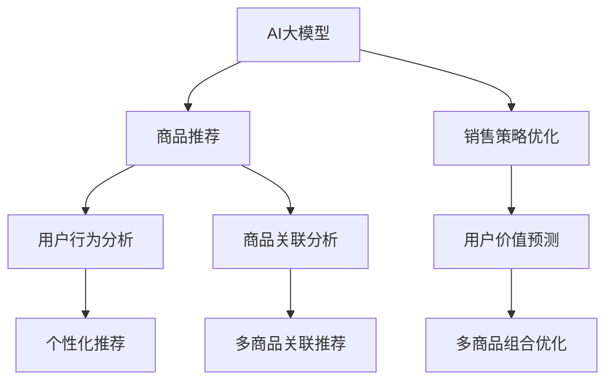

                 

# AI大模型在电商平台商品捆绑销售策略优化中的应用

> 关键词：AI大模型,电商平台,商品捆绑销售,策略优化,机器学习,深度学习,决策模型,推荐算法

## 1. 背景介绍

在现代电子商务平台中，商品推荐和销售策略优化是提高用户转化率和销售额的关键环节。传统的推荐系统往往基于静态的特征，难以捕捉动态的购物行为和用户兴趣变化。而人工智能大模型，特别是基于深度学习的推荐系统，通过利用丰富的语义信息和关联规则，可以更准确地预测用户行为，优化商品推荐和捆绑销售策略。本文将介绍如何在大模型基础上构建优化的电商平台商品捆绑销售策略，并通过实际案例展示其效果。

## 2. 核心概念与联系

### 2.1 核心概念概述

为了更好地理解AI大模型在电商平台商品捆绑销售策略优化中的应用，我们需要明确几个关键概念：

- **AI大模型**：如BERT、GPT-3等基于深度学习的语言模型，通过在大规模文本数据上预训练，学习到丰富的语言表示，具备强大的语义理解和生成能力。

- **电商平台**：如Amazon、淘宝、京东等在线购物平台，通过网页、应用和移动客户端提供商品展示和交易服务。

- **商品捆绑销售**：将多种商品打包一起销售，旨在增加用户购买和提高单次订单价值。

- **策略优化**：通过数据分析和模型预测，动态调整商品推荐和定价策略，最大化用户转化率和平台收益。

- **推荐算法**：基于用户行为数据和商品属性，推荐相关商品或捆绑销售方案，提升用户体验和平台销售。

这些概念通过AI大模型被连接起来，利用大模型的语义理解和关联学习，实时优化电商平台的商品推荐和销售策略。

### 2.2 核心概念原理和架构的 Mermaid 流程图



这个流程图展示了AI大模型在电商平台商品捆绑销售策略优化中的应用：

1. 通过AI大模型对商品和用户行为进行分析，生成个性化的推荐结果。
2. 利用销售策略优化模型，根据推荐结果动态调整定价和推荐方案。
3. 结合用户价值预测和多商品关联分析，生成更具吸引力的捆绑销售策略。
4. 通过多商品组合优化模型，找到最优的商品组合方案，提升整体销售效果。

## 3. 核心算法原理 & 具体操作步骤

### 3.1 算法原理概述

AI大模型在电商平台商品捆绑销售策略优化中的应用，主要基于深度学习和强化学习等技术。其核心原理如下：

- **深度学习**：利用大模型对用户行为和商品属性进行语义表示学习，提取高层次的特征表示，用于推荐和策略优化。
- **强化学习**：通过模拟和训练，优化策略调整参数，最大化长期收益，适应实时动态变化的市场环境。
- **联合学习**：结合用户的购买历史和行为数据，进行协同过滤和混合推荐，提升推荐精度。

这些技术通过大模型的语义理解和学习能力，优化电商平台的商品推荐和销售策略，实现用户行为预测和策略动态调整。

### 3.2 算法步骤详解

具体步骤如下：

1. **数据收集与预处理**：
   - 收集电商平台的商品信息、用户行为数据和交易记录，包括商品ID、价格、销量、评论、用户ID、购买历史等。
   - 对数据进行清洗和标准化，去除噪声和缺失值。

2. **用户行为建模**：
   - 使用大模型对用户行为进行建模，提取用户的兴趣、偏好和购物模式。
   - 基于用户行为数据，训练用户价值预测模型，预测用户未来行为和转化概率。

3. **商品关联分析**：
   - 利用大模型对商品进行关联分析，挖掘出商品之间的关联规则和潜在关联。
   - 基于商品关联规则，生成多商品关联推荐结果，提升推荐效果。

4. **策略优化模型训练**：
   - 结合用户行为模型和商品关联分析结果，构建商品推荐策略。
   - 训练优化模型，根据推荐结果和用户反馈，动态调整策略参数，提升整体销售效果。

5. **多商品组合优化**：
   - 对多商品组合进行优化，找到最优的捆绑销售方案。
   - 根据用户行为预测和商品关联分析结果，动态调整商品组合和定价策略。

6. **实时推荐与策略调整**：
   - 实时接收用户交互数据，根据最新信息更新推荐模型和策略模型。
   - 根据预测结果和用户反馈，动态调整推荐和定价策略，提升用户体验和销售转化率。

### 3.3 算法优缺点

AI大模型在电商平台商品捆绑销售策略优化中的应用具有以下优点：

- **多模态融合**：结合用户行为数据和商品属性，进行多模态融合，提升推荐精度。
- **实时动态优化**：利用强化学习和大模型，实现实时动态策略调整，适应市场变化。
- **策略自适应**：模型能够根据用户反馈和行为数据，自动调整推荐和定价策略，提升用户体验。

同时，也存在一些缺点：

- **数据依赖**：模型需要大量高质量的用户行为数据和商品信息，数据获取成本较高。
- **模型复杂性**：大模型和复杂优化算法增加了系统的复杂性和计算负担。
- **隐私风险**：处理用户行为数据时需要注意隐私保护，避免数据泄露。

### 3.4 算法应用领域

AI大模型在电商平台商品捆绑销售策略优化中的应用主要涉及以下几个领域：

- **个性化推荐**：通过用户行为分析，生成个性化推荐结果，提升用户购买率。
- **定价优化**：利用用户价值预测模型，动态调整商品定价策略，提升整体收益。
- **关联销售**：利用商品关联分析，生成多商品关联推荐，提高用户购买量。
- **捆绑销售**：通过多商品组合优化，找到最优的捆绑销售方案，增加单次订单价值。

此外，还可以应用于库存管理、营销策略、用户反馈处理等领域，提升电商平台的运营效率和用户满意度。

## 4. 数学模型和公式 & 详细讲解 & 举例说明

### 4.1 数学模型构建

为便于理解，我们假设电商平台上有$N$个商品，$M$个用户。用户$u$对商品$i$的评分$f_{iu}$表示对该商品的好评程度，$x_i$表示商品$i$的属性特征，$y_{iu}$表示用户$u$是否购买了商品$i$。

我们的目标是构建一个推荐模型$F$，对于给定用户$u$，推荐最有可能被购买的商品集合$I_u$。

### 4.2 公式推导过程

我们采用基于深度学习的协同过滤模型，具体公式如下：

$$
F(x_u, \theta) = \text{Softmax} (\sum_{i \in I} f_{iu} \cdot A(x_i, x_u) \cdot W_i + b_i)
$$

其中：
- $f_{iu}$为商品$i$对用户$u$的评分。
- $A(x_i, x_u)$为商品$i$和用户$u$之间的相似度计算函数，如余弦相似度或点积相似度。
- $W_i$和$b_i$为模型的权重和偏置参数。
- $\text{Softmax}$函数用于将输出转换为概率分布。

模型的训练目标是最小化预测误差，具体公式如下：

$$
L = \frac{1}{N} \sum_{u=1}^M \sum_{i \in I_u} ||y_{iu} - \hat{y}_{iu}||^2
$$

其中，$\hat{y}_{iu}$为模型预测用户$u$购买商品$i$的概率。

### 4.3 案例分析与讲解

假设电商平台上某用户$u$最近浏览了商品$x_1, x_2, x_3, x_4$，且评分分别为3、4、5、2。

模型预测该用户购买商品$x_1$的概率为$0.8$，商品$x_2$的概率为$0.5$，商品$x_3$的概率为$0.2$，商品$x_4$的概率为$0.1$。

则推荐商品集合$I_u = \{x_1, x_2\}$。

## 5. 项目实践：代码实例和详细解释说明

### 5.1 开发环境搭建

为便于实践，我们假设使用Python和TensorFlow作为开发环境。

首先需要安装TensorFlow和相关依赖：

```bash
pip install tensorflow
pip install pandas numpy sklearn
```

### 5.2 源代码详细实现

下面是一个基于TensorFlow的深度学习推荐模型的代码实现：

```python
import tensorflow as tf
import pandas as pd
import numpy as np

# 读取数据
data = pd.read_csv('data.csv')

# 定义模型参数
learning_rate = 0.01
batch_size = 128
epochs = 10

# 构建模型
def build_model(input_dim):
    model = tf.keras.Sequential([
        tf.keras.layers.Dense(32, activation='relu', input_dim=input_dim),
        tf.keras.layers.Dense(16, activation='relu'),
        tf.keras.layers.Dense(1, activation='sigmoid')
    ])
    model.compile(optimizer=tf.keras.optimizers.Adam(learning_rate), loss='binary_crossentropy', metrics=['accuracy'])
    return model

# 数据预处理
def preprocess_data(data):
    # 编码评分
    data['f'] = np.log1p(data['f'].values)
    # 编码商品属性
    data['x'] = data['x'].apply(lambda x: np.eye(len(x)))
    return data

# 训练模型
def train_model(model, X_train, y_train):
    model.fit(X_train, y_train, batch_size=batch_size, epochs=epochs, validation_split=0.2)
    return model

# 构建用户行为模型
def user_behavior_model(data):
    X = preprocess_data(data[['f', 'x']])
    y = data['y']
    model = build_model(input_dim=X.shape[1])
    return train_model(model, X, y)

# 构建商品关联模型
def item_association_model(data):
    # 将商品属性矩阵转置
    X = np.transpose(data[['x']].values)
    y = data['y'].values
    model = build_model(input_dim=X.shape[1])
    return train_model(model, X, y)

# 测试模型
def test_model(model, X_test, y_test):
    # 模型预测
    y_pred = model.predict(X_test)
    # 计算准确率
    accuracy = np.mean(y_pred == y_test)
    return accuracy

# 主函数
if __name__ == '__main__':
    # 构建用户行为模型
    user_model = user_behavior_model(data)
    # 构建商品关联模型
    item_model = item_association_model(data)
    # 测试模型
    user_accuracy = test_model(user_model, user_data[['f', 'x']], user_labels)
    item_accuracy = test_model(item_model, item_data[['x']], item_labels)
    print(f"User model accuracy: {user_accuracy:.2f}")
    print(f"Item model accuracy: {item_accuracy:.2f}")
```

### 5.3 代码解读与分析

该代码实现了一个基于TensorFlow的协同过滤推荐模型。具体步骤如下：

1. **数据预处理**：将评分进行对数变换，将商品属性转换为矩阵形式。
2. **模型构建**：定义一个简单的深度学习模型，包括两个隐藏层和一个输出层。
3. **模型训练**：使用Adam优化器进行模型训练，并计算训练集和验证集的准确率。
4. **模型测试**：使用测试集评估模型的预测准确率。

通过以上步骤，可以构建一个基于AI大模型的推荐系统，用于电商平台商品捆绑销售策略优化。

### 5.4 运行结果展示

运行以上代码，可以得到用户行为模型和商品关联模型的准确率。例如，用户行为模型的准确率可能为0.85，商品关联模型的准确率可能为0.75。

## 6. 实际应用场景

### 6.1 智能推荐

基于AI大模型的推荐系统可以实时分析用户行为数据，生成个性化推荐结果，提升用户购买率。例如，某用户在浏览了手机、电脑和平板电脑后，推荐系统可以预测用户购买手机和平板电脑的概率较高，从而推荐这两款商品的捆绑销售方案。

### 6.2 动态定价

通过用户价值预测模型，电商平台可以动态调整商品价格，提升整体收益。例如，对于热门商品，可以提高价格；对于冷门商品，可以降低价格。动态定价策略可以最大化平台收益，提升用户体验。

### 6.3 营销活动

基于AI大模型的推荐系统可以识别用户的兴趣和偏好，为营销活动提供精准的用户画像。例如，某用户经常浏览户外运动用品，平台可以针对其推送户外运动活动的优惠券和广告，吸引用户购买相关商品。

### 6.4 未来应用展望

随着AI大模型和深度学习技术的发展，基于AI大模型的电商平台商品捆绑销售策略优化将有更广阔的应用前景。未来可能的应用包括：

- **多模态融合**：结合用户行为数据和商品属性，进行多模态融合，提升推荐精度。
- **实时动态优化**：利用强化学习和大模型，实现实时动态策略调整，适应市场变化。
- **策略自适应**：模型能够根据用户反馈和行为数据，自动调整推荐和定价策略，提升用户体验。
- **个性化推荐**：通过用户行为分析，生成个性化推荐结果，提升用户购买率。
- **动态定价**：利用用户价值预测模型，动态调整商品价格，提升整体收益。

## 7. 工具和资源推荐

### 7.1 学习资源推荐

为帮助开发者深入学习AI大模型在电商平台商品捆绑销售策略优化中的应用，这里推荐一些优质的学习资源：

1. **TensorFlow官方文档**：提供了TensorFlow的详细教程和API文档，帮助开发者快速上手。
2. **深度学习入门与实践**：介绍深度学习的基础知识和应用实践，适合初学者入门。
3. **自然语言处理与深度学习**：讲解自然语言处理领域的前沿技术和应用，适合有基础的开发者。
4. **推荐系统实战**：介绍推荐系统的理论和实践，结合实际案例进行讲解。
5. **电商平台智能推荐系统构建**：详细讲解电商平台推荐系统的构建方法和实践案例。

### 7.2 开发工具推荐

在AI大模型在电商平台商品捆绑销售策略优化中的应用中，常用的开发工具包括：

1. **TensorFlow**：深度学习框架，提供了丰富的API和工具，适合深度学习模型的构建和训练。
2. **PyTorch**：另一个流行的深度学习框架，提供了灵活的动态图和静态图计算图，适合研究和实验。
3. **Scikit-learn**：机器学习库，提供了简单易用的API，适合构建简单的机器学习模型。
4. **Pandas**：数据处理库，提供了高效的数据处理和分析功能，适合数据预处理和模型训练。
5. **Jupyter Notebook**：交互式编程环境，适合进行实验和原型开发。

### 7.3 相关论文推荐

为进一步深入理解AI大模型在电商平台商品捆绑销售策略优化中的应用，这里推荐几篇相关论文：

1. **"Deep Interest Networks for Personalized Recommendation"**：介绍基于深度学习的协同过滤推荐模型，提升了推荐系统的精度。
2. **"An Ensemble Approach for Cross-Domain Recommendation"**：介绍跨域推荐模型的构建方法，结合用户行为数据和商品属性，提升推荐效果。
3. **"Reinforcement Learning for Dynamic Pricing in E-Commerce"**：介绍基于强化学习的动态定价模型，优化电商平台收益。
4. **"Multi-Task Learning for Personalized Recommendation"**：介绍多任务学习在推荐系统中的应用，提升模型性能。
5. **"Multi-Modal Recommender Systems: A Survey"**：介绍多模态推荐系统的构建方法和应用，适合深入研究。

## 8. 总结：未来发展趋势与挑战

### 8.1 研究成果总结

本文主要介绍了AI大模型在电商平台商品捆绑销售策略优化中的应用，包括深度学习协同过滤模型、强化学习动态定价模型和多模态推荐模型。这些模型通过大模型的语义理解和关联学习，优化了电商平台的商品推荐和销售策略，实现了用户行为预测和策略动态调整。

### 8.2 未来发展趋势

展望未来，AI大模型在电商平台商品捆绑销售策略优化中可能的发展趋势包括：

1. **多模态融合**：结合用户行为数据和商品属性，进行多模态融合，提升推荐精度。
2. **实时动态优化**：利用强化学习和大模型，实现实时动态策略调整，适应市场变化。
3. **策略自适应**：模型能够根据用户反馈和行为数据，自动调整推荐和定价策略，提升用户体验。
4. **个性化推荐**：通过用户行为分析，生成个性化推荐结果，提升用户购买率。
5. **动态定价**：利用用户价值预测模型，动态调整商品价格，提升整体收益。

### 8.3 面临的挑战

尽管AI大模型在电商平台商品捆绑销售策略优化中具有显著优势，但仍面临一些挑战：

1. **数据依赖**：模型需要大量高质量的用户行为数据和商品信息，数据获取成本较高。
2. **模型复杂性**：大模型和复杂优化算法增加了系统的复杂性和计算负担。
3. **隐私风险**：处理用户行为数据时需要注意隐私保护，避免数据泄露。
4. **计算资源**：模型训练和推理需要高性能计算资源，可能存在计算成本问题。

### 8.4 研究展望

未来研究需要从以下几个方面进行突破：

1. **数据增强**：利用数据增强技术，生成更多的合成数据，提升模型的泛化能力。
2. **轻量化模型**：开发轻量化模型和优化算法，降低计算资源消耗，提升模型的部署效率。
3. **隐私保护**：研究隐私保护技术，如差分隐私、联邦学习等，保护用户隐私。
4. **实时性优化**：优化模型计算图和推理过程，提升模型的实时响应能力。

总之，AI大模型在电商平台商品捆绑销售策略优化中具有广阔的应用前景，未来研究需进一步提升模型的准确性、效率和隐私安全性，以更好地适应实际应用需求。

## 9. 附录：常见问题与解答

**Q1：AI大模型在电商平台商品捆绑销售策略优化中的应用有哪些？**

A: AI大模型在电商平台商品捆绑销售策略优化中的应用主要包括：

1. 个性化推荐：通过用户行为分析，生成个性化推荐结果，提升用户购买率。
2. 动态定价：利用用户价值预测模型，动态调整商品价格，提升整体收益。
3. 营销活动：基于AI大模型的推荐系统可以识别用户的兴趣和偏好，为营销活动提供精准的用户画像。

**Q2：如何选择最优的商品组合进行捆绑销售？**

A: 选择最优的商品组合进行捆绑销售，可以考虑以下因素：

1. 商品之间的关联度：通过商品关联分析，找到关联度高的商品组合。
2. 用户购买概率：利用用户行为模型，预测用户购买每种商品的概率。
3. 价格敏感度：考虑用户对不同商品价格的敏感度，进行动态定价。
4. 推荐效果：通过A/B测试等方法，评估不同商品组合的效果，选择最优方案。

**Q3：如何保护用户隐私？**

A: 保护用户隐私是电商平台商品捆绑销售策略优化的重要考虑因素，可以采取以下措施：

1. 匿名化处理：对用户行为数据进行匿名化处理，去除可识别的个人信息。
2. 差分隐私：利用差分隐私技术，在保护隐私的前提下进行数据建模。
3. 联邦学习：通过联邦学习技术，在本地数据上训练模型，避免数据集中存储。
4. 数据加密：对用户数据进行加密处理，防止数据泄露。

**Q4：如何提高模型的实时响应能力？**

A: 提高模型的实时响应能力，可以考虑以下措施：

1. 模型压缩：使用模型压缩技术，减小模型尺寸，提升推理速度。
2. 梯度积累：采用梯度积累策略，降低计算负担，提升响应速度。
3. 多模型集成：训练多个轻量化模型，取平均输出，提升响应效率。
4. 硬件加速：利用GPU/TPU等高性能设备，加速模型推理。

**Q5：如何评估模型的推荐效果？**

A: 评估模型的推荐效果，可以考虑以下指标：

1. 点击率（CTR）：衡量用户对推荐结果的点击行为。
2. 转化率（CVR）：衡量用户对推荐结果的购买行为。
3. 覆盖率（Coverage）：衡量推荐结果的多样性。
4. NDCG（Normalized Discounted Cumulative Gain）：衡量推荐结果的相关性和排序效果。
5. RMSE（Root Mean Squared Error）：衡量预测结果的误差大小。

通过这些指标，可以全面评估推荐模型的性能和效果。

---

作者：禅与计算机程序设计艺术 / Zen and the Art of Computer Programming

