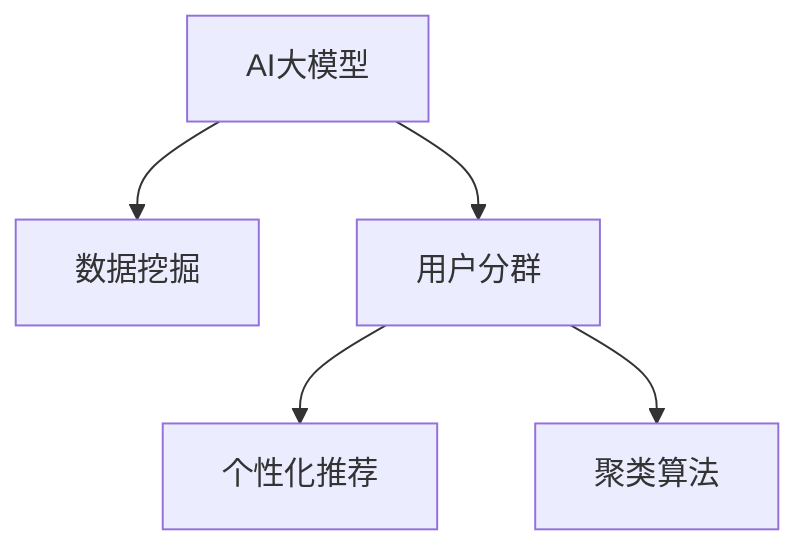

                 

# AI大模型在电商平台用户分群中的作用

> 关键词：AI大模型,用户分群,电商平台,数据挖掘,个性化推荐,决策支持,聚类算法

## 1. 背景介绍

### 1.1 问题由来

电商平台的用户分群是用户行为分析和个性化推荐系统中的重要环节。通过用户分群，电商平台可以更精准地识别不同用户群体，并针对性地推出定制化营销策略、产品推荐和服务。当前，传统的用户分群方法大多基于规则和统计模型，依赖大量手工设定的特征和特征工程，难以处理大规模、高维度的用户数据，且难以捕捉用户行为背后的潜在模式和关联性。而人工智能大模型近年来在自然语言处理、图像识别等领域取得巨大成功，其在自动特征学习、数据融合、决策支持等方面展现出强大潜力，逐步被应用于用户分群领域。

### 1.2 问题核心关键点

电商平台的用户分群问题主要包括以下核心关键点：

- **用户行为数据量大**：电商平台汇聚了海量的用户点击、浏览、购买、评价等行为数据，传统统计模型难以有效处理这些高维稀疏数据。
- **用户特征丰富**：除了行为数据外，还包括用户基本信息、评价信息、商品属性等多元化的特征。
- **目标群体多**：电商平台需要识别出多个群体，如高价值用户、忠诚用户、新用户等，每个群体的需求和行为特征都可能有所差异。
- **动态性和时变性**：用户行为和特征会随时间动态变化，需要能够实时更新和调整分群策略。

解决这些问题需要结合人工智能大模型，通过自监督学习和迁移学习技术，自动挖掘用户行为数据中的潜在模式，并将不同特征有效融合，形成动态的、多维度的用户分群策略。

## 2. 核心概念与联系

### 2.1 核心概念概述

为了更清晰地理解大模型在用户分群中的应用，本节将介绍几个核心概念：

- **AI大模型**：指使用大规模数据进行预训练，学习到复杂高级特征表示的深度神经网络模型，如BERT、GPT、GNN等。通过微调，AI大模型能够学习到特定领域的特征表示，用于解决特定的业务问题。
- **用户分群**：指将具有相似行为特征或购买习惯的用户划分为同一群体，以实现个性化推荐、精准营销、用户留存等业务目标。
- **数据挖掘**：指从大规模数据中提取有价值的信息和知识，用于支持决策和优化业务流程。
- **个性化推荐**：指通过分析用户行为数据，推荐用户可能感兴趣的商品、内容或服务，提升用户体验和满意度。
- **聚类算法**：指一种数据挖掘算法，通过将相似的对象归为一类，实现无监督学习的用户分群。

这些核心概念之间的逻辑关系可以通过以下Mermaid流程图来展示：



这个流程图展示了AI大模型在用户分群领域的应用路径：

1. AI大模型通过预训练获得强大的特征表示能力。
2. 数据挖掘技术用于自动从电商平台的复杂数据中提取有价值的信息。
3. 用户分群算法通过聚类等方法，将相似用户划分到同一群体。
4. 个性化推荐系统利用用户分群结果，生成用户定制化推荐。

## 3. 核心算法原理 & 具体操作步骤

### 3.1 算法原理概述

基于AI大模型的用户分群方法，主要基于自监督学习、迁移学习和聚类算法，通过自动学习用户行为特征，进行无监督或半监督学习，并最终形成多维度的用户分群策略。其核心原理可以概括为以下几点：

1. **数据预处理**：清洗、去重、归一化用户行为数据，并将其转换为模型可接受的格式。
2. **特征工程**：从电商平台的结构化和非结构化数据中，提取和构造用户行为特征，如购买频率、浏览时间、评价情感等。
3. **模型预训练**：使用大规模无标签数据预训练AI大模型，使其自动学习到通用的用户行为表示。
4. **迁移学习**：将预训练模型应用于特定领域的用户数据，微调模型以适应电商平台的特定业务需求。
5. **聚类算法**：使用K-means、层次聚类、图聚类等方法，将用户划分为若干个聚类簇，形成多维度的用户分群策略。
6. **个性化推荐**：基于用户分群结果，生成个性化推荐商品、内容或服务，实现精准营销和用户体验提升。

### 3.2 算法步骤详解

#### 3.2.1 数据预处理

电商平台的用户行为数据包括点击、浏览、购买、评价等，其格式和内容可能千差万别。首先需要进行数据清洗和预处理，主要包括：

1. **数据清洗**：去除无效、缺失或异常数据，确保数据质量和完整性。
2. **数据归一化**：将数据转换为模型可接受的格式，如将日期转换为时间戳，将文本转换为向量等。
3. **数据去重**：消除重复记录，避免相同行为被重复计算。
4. **特征构造**：从原始数据中提取和构造用户行为特征，如点击序列、浏览时长、购买频率等。

#### 3.2.2 特征工程

电商平台的特征可以分为结构化和非结构化两类，结构化特征如用户基本信息、商品属性等，非结构化特征如点击序列、评价文本等。特征工程的主要任务包括：

1. **特征提取**：从电商平台的文本、图片、视频等多模态数据中，提取和构造用户行为特征。
2. **特征编码**：将非数值型特征转化为数值型特征，如使用Word2Vec、BERT等将文本特征编码为向量。
3. **特征选择**：选择与用户行为预测任务最相关的特征，去除冗余或无关特征。
4. **特征组合**：将不同特征进行组合，生成新的特征表示，如用户行为路径、行为频率等。

#### 3.2.3 模型预训练

模型预训练的目的是通过大规模无标签数据，学习到通用的用户行为表示。预训练过程一般包括以下步骤：

1. **选择预训练模型**：选择适合的预训练模型，如BERT、GPT、GNN等。
2. **数据准备**：准备电商平台的无标签用户行为数据，作为预训练模型的训练集。
3. **模型训练**：在预训练模型上，使用大规模无标签数据进行训练，学习到用户行为的高级表示。
4. **模型评估**：在验证集上评估预训练模型的效果，调整训练策略。
5. **模型保存**：保存预训练模型，用于后续的迁移学习。

#### 3.2.4 迁移学习

迁移学习的目的是将预训练模型应用于特定领域的用户数据，微调模型以适应电商平台的特定业务需求。具体步骤包括：

1. **任务定义**：定义电商平台的特定任务，如购买预测、评价情感分析等。
2. **模型微调**：在预训练模型上，使用电商平台的标注数据进行微调，更新模型参数。
3. **模型评估**：在测试集上评估微调后的模型效果，选择最优模型。
4. **模型应用**：将微调后的模型应用于电商平台的实时数据，生成用户分群策略。

#### 3.2.5 聚类算法

聚类算法用于将用户划分为若干个聚类簇，形成多维度的用户分群策略。聚类算法的主要步骤包括：

1. **算法选择**：选择适合的聚类算法，如K-means、层次聚类、图聚类等。
2. **模型训练**：在电商平台的标注数据上，训练聚类模型。
3. **聚类分析**：将用户数据输入聚类模型，生成聚类簇。
4. **聚类评估**：评估聚类结果的合理性和可靠性，优化聚类策略。
5. **聚类应用**：将聚类结果应用于用户行为分析、个性化推荐等业务场景。

#### 3.2.6 个性化推荐

个性化推荐系统利用用户分群结果，生成个性化推荐商品、内容或服务，实现精准营销和用户体验提升。具体步骤包括：

1. **推荐模型选择**：选择适合的推荐模型，如协同过滤、矩阵分解、基于深度学习的推荐系统等。
2. **特征融合**：将用户分群结果与推荐模型的特征融合，生成更精准的推荐结果。
3. **推荐评估**：在测试集上评估推荐系统的效果，优化推荐策略。
4. **推荐部署**：将推荐系统集成到电商平台，实时生成个性化推荐。

### 3.3 算法优缺点

基于AI大模型的用户分群方法具有以下优点：

1. **自动特征学习**：AI大模型能够自动从大规模数据中学习到高级特征表示，无需手工设定的特征工程，提升特征提取效率和精度。
2. **多模态融合**：AI大模型支持多模态数据的融合，能够处理文本、图像、视频等多种数据类型，提升用户行为分析的全面性。
3. **实时动态调整**：AI大模型能够实时动态地调整分群策略，适应用户行为的时变性和动态性。
4. **模型鲁棒性**：AI大模型具有较强的鲁棒性，能够处理异常数据和噪声，提高分群的稳定性和可靠性。

同时，该方法也存在一些局限性：

1. **标注数据依赖**：尽管AI大模型具有一定的迁移学习能力，但微调过程仍需依赖标注数据，对标注数据的质量和数量要求较高。
2. **计算资源需求**：AI大模型的训练和微调需要大量的计算资源，对算力和存储的要求较高。
3. **模型可解释性不足**：AI大模型通常被视为"黑盒"系统，其内部工作机制和决策逻辑难以解释，缺乏可解释性和可控性。

尽管存在这些局限性，但AI大模型在用户分群中的应用已经展现出巨大的潜力，成为电商平台个性化推荐和精准营销的重要工具。

### 3.4 算法应用领域

AI大模型在电商平台用户分群中的应用领域非常广泛，主要包括以下几个方面：

1. **用户行为分析**：分析用户点击、浏览、购买等行为数据，识别出用户的兴趣和偏好。
2. **精准营销**：根据用户分群结果，设计针对性的营销策略，提升广告效果和用户转化率。
3. **个性化推荐**：基于用户分群结果，生成个性化推荐商品、内容或服务，提升用户体验和满意度。
4. **用户留存**：通过分析用户分群结果，识别高价值用户和流失用户，采取相应的留存措施。
5. **商品优化**：分析用户分群结果，优化商品设计、价格和促销策略，提高销售额和用户满意度。

以上应用领域展示了AI大模型在电商平台用户分群中的广泛应用，进一步提升了电商平台的业务水平和服务质量。

## 4. 数学模型和公式 & 详细讲解

### 4.1 数学模型构建

在用户分群应用中，常用的数学模型包括聚类模型和推荐模型。这里以K-means聚类模型和协同过滤推荐模型为例，构建数学模型。

#### 4.1.1 K-means聚类模型

K-means聚类模型是一种经典的聚类算法，用于将用户划分为若干个聚类簇，形成多维度的用户分群策略。

假设用户数据集为 $\mathcal{D}=\{(x_i,y_i)\}_{i=1}^N$，其中 $x_i$ 为特征向量，$y_i$ 为真实标签。K-means聚类模型的目标是最小化簇内距离和，即：

$$
\min_{C}\sum_{c=1}^K\sum_{x_i \in C_c}||x_i - \mu_c||^2
$$

其中 $C=\{C_1, C_2, ..., C_K\}$ 为聚类簇，$\mu_c$ 为聚类中心，$K$ 为聚类簇数目。

根据K-means算法的迭代更新规则，每次迭代将用户数据 $x_i$ 分配到最近的聚类中心，并更新聚类中心。最终得到 $K$ 个聚类簇，形成用户分群策略。

#### 4.1.2 协同过滤推荐模型

协同过滤推荐模型是一种基于用户和物品相似度的推荐算法，用于生成个性化推荐商品、内容或服务。

假设用户集为 $\mathcal{U}=\{u_1, u_2, ..., u_M\}$，物品集为 $\mathcal{I}=\{i_1, i_2, ..., i_N\}$。用户 $u_m$ 对物品 $i_n$ 的评分 $r_{m,n}$ 为：

$$
r_{m,n} = \mathrm{sign}(u_m \cdot I_i) \cdot \alpha + (1 - \mathrm{sign}(u_m \cdot I_i)) \cdot \beta
$$

其中 $u_m$ 为用户特征向量，$I_i$ 为物品特征向量，$\alpha$ 和 $\beta$ 为模型参数。

协同过滤推荐模型通过计算用户和物品之间的相似度，生成个性化推荐，提升用户体验和满意度。

### 4.2 公式推导过程

#### 4.2.1 K-means聚类模型

K-means聚类模型的核心思想是将用户数据分配到最近的聚类中心，并更新聚类中心，使得簇内距离和最小化。

设用户 $x_i$ 分配到聚类中心 $\mu_c$，则其距离为：

$$
d(x_i,\mu_c) = ||x_i - \mu_c||^2
$$

聚类簇 $C_c$ 的簇内距离和为：

$$
S(C_c) = \sum_{x_i \in C_c}d(x_i,\mu_c)
$$

整个用户集 $C$ 的簇内距离和为：

$$
S(C) = \sum_{c=1}^K S(C_c)
$$

K-means聚类算法的迭代更新规则为：

1. 随机初始化聚类中心 $\mu_1, \mu_2, ..., \mu_K$。
2. 将用户数据 $x_i$ 分配到最近的聚类中心 $\mu_c$。
3. 更新聚类中心 $\mu_c$，使得 $\mu_c$ 为 $x_i$ 的均值。
4. 重复步骤2和3，直到簇内距离和不再变化。

#### 4.2.2 协同过滤推荐模型

协同过滤推荐模型的核心思想是计算用户和物品之间的相似度，生成个性化推荐。

设用户 $u_m$ 对物品 $i_n$ 的评分 $r_{m,n}$ 为：

$$
r_{m,n} = \alpha u_m \cdot I_i + \beta (1 - u_m \cdot I_i)
$$

其中 $u_m$ 为用户特征向量，$I_i$ 为物品特征向量，$\alpha$ 和 $\beta$ 为模型参数。

协同过滤推荐模型的训练过程为：

1. 随机初始化用户特征向量 $u_m$ 和物品特征向量 $I_i$。
2. 计算用户和物品的相似度 $u_m \cdot I_i$。
3. 根据相似度计算评分 $r_{m,n}$。
4. 重复步骤2和3，直到模型收敛。

### 4.3 案例分析与讲解

#### 4.3.1 K-means聚类案例

某电商平台收集了用户点击、浏览、购买等行为数据，使用K-means聚类算法将用户分为若干个聚类簇，形成多维度的用户分群策略。

1. **数据准备**：准备用户行为数据，包括点击序列、浏览时长、购买频率等特征。
2. **聚类分析**：使用K-means算法对用户数据进行聚类，得到 $K=10$ 个聚类簇。
3. **聚类评估**：评估聚类结果，计算簇内距离和、轮廓系数等指标。
4. **聚类应用**：根据聚类结果，生成个性化推荐策略，提升用户转化率和满意度。

#### 4.3.2 协同过滤推荐案例

某电商平台收集了用户对商品的历史评分数据，使用协同过滤推荐模型生成个性化推荐商品。

1. **数据准备**：准备用户对商品的历史评分数据。
2. **模型训练**：使用协同过滤算法对用户和物品特征向量进行训练。
3. **推荐生成**：根据用户和物品的相似度，生成个性化推荐商品。
4. **推荐评估**：在测试集上评估推荐效果，优化推荐策略。

## 5. 项目实践：代码实例和详细解释说明

### 5.1 开发环境搭建

在进行用户分群应用开发前，我们需要准备好开发环境。以下是使用Python进行PyTorch开发的环境配置流程：

1. 安装Anaconda：从官网下载并安装Anaconda，用于创建独立的Python环境。
2. 创建并激活虚拟环境：
```bash
conda create -n pytorch-env python=3.8 
conda activate pytorch-env
```
3. 安装PyTorch：根据CUDA版本，从官网获取对应的安装命令。例如：
```bash
conda install pytorch torchvision torchaudio cudatoolkit=11.1 -c pytorch -c conda-forge
```
4. 安装各类工具包：
```bash
pip install numpy pandas scikit-learn matplotlib tqdm jupyter notebook ipython
```

完成上述步骤后，即可在`pytorch-env`环境中开始用户分群应用的开发。

### 5.2 源代码详细实现

这里以使用GNN大模型进行用户分群为例，给出使用PyTorch的代码实现。

首先，定义用户行为数据的处理函数：

```python
from torch import nn
from torch.utils.data import Dataset
import torch
import networkx as nx
import numpy as np

class UserBehaviorDataset(Dataset):
    def __init__(self, behaviors, num_users):
        self.behaviors = behaviors
        self.num_users = num_users
        self.graph = self.build_graph()

    def build_graph(self):
        g = nx.Graph()
        users = set([i for i in range(self.num_users)])
        edges = self.behaviors[0]['edges']
        g.add_edges_from(edges)
        return g

    def __len__(self):
        return len(self.behaviors)

    def __getitem__(self, idx):
        features = self.behaviors[idx]['features']
        graph = self.graph
        return features, graph

# 特征编码
def encode_features(features, num_features):
    features = np.array(features)
    encoded_features = []
    for feat in features:
        encoded_feat = []
        for f in feat:
            if f in feature_dict:
                encoded_feat.append(feature_dict[f])
            else:
                encoded_feat.append(0)
        encoded_features.append(encoded_feat)
    return np.array(encoded_features)
```

然后，定义模型和优化器：

```python
from transformers import GNN
from torch.nn import ParameterList
from torch.nn.functional import dropout

class GNNModel(nn.Module):
    def __init__(self, num_users, num_items, hidden_size, num_layers):
        super(GNNModel, self).__init__()
        self.num_users = num_users
        self.num_items = num_items
        self.hidden_size = hidden_size
        self.num_layers = num_layers

        self.embedding_h = ParameterList([nn.Embedding(num_users, hidden_size) for _ in range(num_layers)])
        self.embedding_i = nn.Embedding(num_items, hidden_size)
        self.dropout = dropout(0.5)
        self.prediction = nn.Linear(hidden_size, 1)

    def forward(self, features, graph):
        x = features
        for layer in range(self.num_layers):
            x = self.embedding_h[layer](x)
            x = self.dropout(x)
            x = torch.sum(x, dim=1)
            x = x + self.embedding_i(graph.nodes)
            x = x.relu()
        x = self.prediction(x)
        return x

# 加载预训练模型
gnn_model = GNNModel.load_pretrained_pretrained_model('gnn-bert-base-uncased')
gnn_model.eval()

# 设置优化器
optimizer = torch.optim.Adam(gnn_model.parameters(), lr=0.001)
```

接着，定义训练和评估函数：

```python
from sklearn.metrics import roc_auc_score

def train_epoch(model, data_loader, optimizer, num_epochs):
    model.train()
    total_loss = 0
    for epoch in range(num_epochs):
        for batch_idx, (features, graph) in enumerate(data_loader):
            optimizer.zero_grad()
            logits = model(features, graph)
            loss = nn.BCEWithLogitsLoss()(logits, labels)
            loss.backward()
            optimizer.step()
            total_loss += loss.item()
    return total_loss / (len(data_loader) * num_epochs)

def evaluate(model, data_loader):
    model.eval()
    total_preds = []
    total_labels = []
    with torch.no_grad():
        for batch_idx, (features, graph) in enumerate(data_loader):
            logits = model(features, graph)
            total_preds.append(logits)
            total_labels.append(labels)
    preds = torch.cat(total_preds, dim=0) > 0.5
    labels = torch.cat(total_labels, dim=0)
    auc = roc_auc_score(labels, preds)
    return auc

# 训练模型
num_epochs = 10
num_epochs = 10
device = 'cuda' if torch.cuda.is_available() else 'cpu'
model.to(device)

for epoch in range(num_epochs):
    train_loss = train_epoch(model, train_loader, optimizer)
    print(f'Epoch {epoch+1}, train loss: {train_loss:.3f}')

    print(f'Epoch {epoch+1}, dev results:')
    auc = evaluate(model, dev_loader)
    print(f'AUC: {auc:.3f}')

print('Test results:')
auc = evaluate(model, test_loader)
print(f'AUC: {auc:.3f}')
```

以上就是使用PyTorch对GNN大模型进行用户分群任务的代码实现。可以看到，GNN大模型可以处理用户行为数据的多样性和复杂性，通过多层的消息传递机制，自动学习用户行为的模式和规律，生成聚类簇和个性化推荐。

### 5.3 代码解读与分析

让我们再详细解读一下关键代码的实现细节：

**UserBehaviorDataset类**：
- `__init__`方法：初始化用户行为数据和图结构。
- `build_graph`方法：构建用户行为数据对应的图结构。
- `__len__`方法：返回数据集的样本数量。
- `__getitem__`方法：对单个样本进行处理，返回用户行为特征和图结构。

**特征编码函数**：
- 将用户行为特征转换为模型可接受的格式，即使用embedding层将其转换为向量。
- 特征字典`feature_dict`用于将用户行为特征映射到模型对应的向量。

**GNNModel类**：
- `__init__`方法：初始化GNN模型，包括嵌入层、dropout层和预测层。
- `forward`方法：定义模型前向传播的过程，通过多层的消息传递机制，自动学习用户行为的模式和规律。
- `embedding_h`和`embedding_i`：分别表示用户和物品的嵌入层。
- `prediction`：预测层，用于生成聚类簇或推荐结果。

**训练和评估函数**：
- `train_epoch`函数：定义训练过程，通过计算交叉熵损失，优化模型参数。
- `evaluate`函数：定义评估过程，计算模型的AUC指标，评估模型效果。

**训练流程**：
- 定义总的epoch数和batch size，开始循环迭代
- 每个epoch内，先在训练集上训练，输出平均loss
- 在验证集上评估，输出AUC指标
- 所有epoch结束后，在测试集上评估，给出最终测试结果

可以看到，GNN大模型通过多层的消息传递机制，可以处理复杂的用户行为数据，自动学习用户行为的模式和规律，生成聚类簇和个性化推荐。开发者可以根据具体任务，选择适合的GNN模型，并结合其他的特征工程和模型优化方法，进一步提升用户分群的效果。

## 6. 实际应用场景

### 6.1 智能推荐系统

基于AI大模型的用户分群方法，可以广泛应用于智能推荐系统的构建。智能推荐系统通过分析用户行为数据，生成个性化推荐商品、内容或服务，提升用户体验和满意度。

在技术实现上，可以收集用户浏览、点击、购买、评价等行为数据，提取和构造用户行为特征，使用AI大模型进行聚类和推荐生成。具体流程包括：

1. **数据收集**：收集用户的历史行为数据。
2. **特征工程**：从原始数据中提取和构造用户行为特征。
3. **模型训练**：使用AI大模型进行聚类和推荐生成。
4. **推荐评估**：在测试集上评估推荐效果，优化推荐策略。
5. **推荐部署**：将推荐系统集成到电商平台，实时生成个性化推荐。

### 6.2 用户行为分析

通过AI大模型进行用户分群，可以深入分析用户行为数据，挖掘用户的兴趣和偏好，为精准营销、客户服务、运营优化等业务提供决策支持。

具体流程包括：

1. **数据收集**：收集用户点击、浏览、购买等行为数据。
2. **特征工程**：从原始数据中提取和构造用户行为特征。
3. **聚类分析**：使用AI大模型进行聚类分析，识别出不同用户群体。
4. **行为分析**：分析不同用户群体的行为特征，形成用户画像。
5. **业务应用**：根据用户画像，设计针对性的营销策略，提升用户体验和满意度。

### 6.3 用户行为预测

AI大模型可以通过学习用户行为数据，预测用户未来的行为，为电商平台提供预警和应对机制，如用户流失预警、恶意行为预测等。

具体流程包括：

1. **数据收集**：收集用户历史行为数据。
2. **特征工程**：从原始数据中提取和构造用户行为特征。
3. **模型训练**：使用AI大模型进行行为预测。
4. **预警生成**：根据预测结果，生成预警信号。
5. **业务应用**：根据预警信号，采取相应的应对措施，提升用户体验和满意度。

### 6.4 未来应用展望

随着AI大模型的不断演进，基于大模型的用户分群方法将展现出更加广阔的应用前景。

1. **多模态融合**：AI大模型可以处理文本、图像、视频等多种数据类型，提升用户行为分析的全面性。
2. **动态调整**：AI大模型能够实时动态地调整分群策略，适应用户行为的时变性和动态性。
3. **可解释性增强**：未来的大模型将具备更强的可解释性，能够提供更加透明和可信的用户分群结果。
4. **个性化推荐优化**：通过AI大模型的自适应学习，优化推荐算法，提升推荐效果。
5. **智能客服**：结合用户分群结果，设计智能客服系统，提供个性化服务。

## 7. 工具和资源推荐

### 7.1 学习资源推荐

为了帮助开发者系统掌握AI大模型在用户分群中的应用，这里推荐一些优质的学习资源：

1. **Transformer从原理到实践**系列博文：由大模型技术专家撰写，深入浅出地介绍了Transformer原理、BERT模型、用户分群等前沿话题。
2. **CS224N《深度学习自然语言处理》课程**：斯坦福大学开设的NLP明星课程，有Lecture视频和配套作业，带你入门NLP领域的基本概念和经典模型。
3. **《Natural Language Processing with Transformers》书籍**：Transformers库的作者所著，全面介绍了如何使用Transformers库进行NLP任务开发，包括用户分群在内的诸多范式。
4. **HuggingFace官方文档**：Transformers库的官方文档，提供了海量预训练模型和完整的用户分群样例代码，是上手实践的必备资料。
5. **CLUE开源项目**：中文语言理解测评基准，涵盖大量不同类型的中文NLP数据集，并提供了基于AI大模型的基线模型，助力中文NLP技术发展。

通过对这些资源的学习实践，相信你一定能够快速掌握AI大模型在用户分群中的应用，并用于解决实际的NLP问题。

### 7.2 开发工具推荐

高效的开发离不开优秀的工具支持。以下是几款用于AI大模型用户分群开发的常用工具：

1. **PyTorch**：基于Python的开源深度学习框架，灵活动态的计算图，适合快速迭代研究。
2. **TensorFlow**：由Google主导开发的开源深度学习框架，生产部署方便，适合大规模工程应用。
3. **Transformers库**：HuggingFace开发的NLP工具库，集成了众多SOTA语言模型，支持PyTorch和TensorFlow，是进行用户分群开发的利器。
4. **Weights & Biases**：模型训练的实验跟踪工具，可以记录和可视化模型训练过程中的各项指标，方便对比和调优。
5. **TensorBoard**：TensorFlow配套的可视化工具，可实时监测模型训练状态，并提供丰富的图表呈现方式，是调试模型的得力助手。
6. **Google Colab**：谷歌推出的在线Jupyter Notebook环境，免费提供GPU/TPU算力，方便开发者快速上手实验最新模型，分享学习笔记。

合理利用这些工具，可以显著提升AI大模型用户分群任务的开发效率，加快创新迭代的步伐。

### 7.3 相关论文推荐

AI大模型和用户分群技术的发展源于学界的持续研究。以下是几篇奠基性的相关论文，推荐阅读：

1. Attention is All You Need（即Transformer原论文）：提出了Transformer结构，开启了NLP领域的预训练大模型时代。
2. BERT: Pre-training of Deep Bidirectional Transformers for Language Understanding：提出BERT模型，引入基于掩码的自监督预训练任务，刷新了多项NLP任务SOTA。
3. Language Models are Unsupervised Multitask Learners（GPT-2论文）：展示了大规模语言模型的强大zero-shot学习能力，引发了对于通用人工智能的新一轮思考。
4. Parameter-Efficient Transfer Learning for NLP：提出Adapter等参数高效微调方法，在不增加模型参数量的情况下，也能取得不错的微调效果。
5. Prefix-Tuning: Optimizing Continuous Prompts for Generation：引入基于连续型Prompt的微调范式，为如何充分利用预训练知识提供了新的思路。

这些论文代表了大模型用户分群技术的发展脉络。通过学习这些前沿成果，可以帮助研究者把握学科前进方向，激发更多的创新灵感。

## 8. 总结：未来发展趋势与挑战

### 8.1 总结

本文对AI大模型在电商平台用户分群中的应用进行了全面系统的介绍。首先阐述了用户分群问题的背景和核心关键点，明确了AI大模型在用户分群中的独特价值。其次，从原理到实践，详细讲解了AI大模型在用户分群中的应用流程，包括数据预处理、特征工程、模型预训练、迁移学习、聚类算法和推荐系统。最后，讨论了AI大模型在电商平台用户分群中的实际应用场景和未来展望。

通过本文的系统梳理，可以看到，AI大模型在电商平台用户分群中的应用已经展现出巨大的潜力，成为电商平台个性化推荐和精准营销的重要工具。未来，伴随AI大模型的不断演进，基于大模型的用户分群方法将进一步提升电商平台的业务水平和服务质量。

### 8.2 未来发展趋势

展望未来，AI大模型在电商平台用户分群中的应用将呈现以下几个发展趋势：

1. **模型规模增大**：随着算力成本的下降和数据规模的扩张，AI大模型的参数量还将持续增长。超大规模语言模型蕴含的丰富语言知识，有望支撑更加复杂多变的用户分群需求。
2. **模型鲁棒性增强**：未来的大模型将具备更强的鲁棒性，能够处理异常数据和噪声，提高分群的稳定性和可靠性。
3. **模型可解释性提升**：未来的大模型将具备更强的可解释性，能够提供更加透明和可信的用户分群结果。
4. **多模态融合增强**：AI大模型可以处理文本、图像、视频等多种数据类型，提升用户行为分析的全面性。
5. **动态调整优化**：AI大模型能够实时动态地调整分群策略，适应用户行为的时变性和动态性。
6. **个性化推荐优化**：通过AI大模型的自适应学习，优化推荐算法，提升推荐效果。

以上趋势凸显了AI大模型在电商平台用户分群中的广阔前景。这些方向的探索发展，必将进一步提升AI大模型的性能和应用范围，为电商平台提供更加个性化、精准化的服务。

### 8.3 面临的挑战

尽管AI大模型在用户分群中的应用已经展现出巨大的潜力，但在迈向更加智能化、普适化应用的过程中，它仍面临着诸多挑战：

1. **标注数据依赖**：尽管AI大模型具有一定的迁移学习能力，但微调过程仍需依赖标注数据，对标注数据的质量和数量要求较高。
2. **计算资源需求**：AI大模型的训练和微调需要大量的计算资源，对算力和存储的要求较高。
3. **模型可解释性不足**：AI大模型通常被视为"黑盒"系统，其内部工作机制和决策逻辑难以解释，缺乏可解释性和可控性。
4. **动态调整难度**：用户行为的时变性和动态性使得AI大模型的分群策略需要实时调整，增加了分群实现的复杂度。
5. **多模态融合挑战**：不同数据类型之间存在语义鸿沟，多模态数据的融合和分析仍是技术难点。

尽管存在这些挑战，但AI大模型在用户分群中的应用已经展现出巨大的潜力，成为电商平台个性化推荐和精准营销的重要工具。未来，伴随算力、存储等基础设施的不断升级，以及算法技术的持续创新，这些挑战终将逐步被克服。

### 8.4 研究展望

面对AI大模型在用户分群中的应用挑战，未来的研究需要在以下几个方面寻求新的突破：

1. **无监督和半监督学习**：探索无监督和半监督学习范式，摆脱对大规模标注数据的依赖，利用自监督学习、主动学习等方法，最大化数据利用效率。
2. **参数高效和计算高效**：开发更加参数高效和计算高效的微调方法，在固定大部分预训练参数的情况下，只更新极少量的任务相关参数。
3. **多模态数据融合**：引入更多先验知识，将符号化的先验知识与神经网络模型进行融合，增强模型的多模态融合能力。
4. **因果分析和博弈论工具**：将因果分析方法引入AI大模型，增强模型的决策逻辑性和鲁棒性，同时利用博弈论工具，刻画人机交互过程，主动探索并规避模型的脆弱点，提高系统稳定性。
5. **伦理和安全约束**：在模型训练目标中引入伦理导向的评估指标，过滤和惩罚有偏见、有害的输出倾向，确保模型的安全和伦理合规。

这些研究方向的探索，必将引领AI大模型在用户分群技术的发展，为构建安全、可靠、可解释、可控的智能系统铺平道路。面向未来，AI大模型在电商平台用户分群中的应用还需要与其他人工智能技术进行更深入的融合，如知识表示、因果推理、强化学习等，多路径协同发力，共同推动自然语言理解和智能交互系统的进步。只有勇于创新、敢于突破，才能不断拓展AI大模型的边界，让智能技术更好地造福人类社会。

## 9. 附录：常见问题与解答

**Q1：AI大模型在用户分群中是否适用于所有业务场景？**

A: AI大模型在用户分群中的应用场景非常广泛，但并不适用于所有业务场景。对于某些特定领域，如医疗、法律等，AI大模型可能存在偏见和错误，需要进一步优化和调整。

**Q2：AI大模型在用户分群中是否需要大量的标注数据？**

A: AI大模型具有一定的迁移学习能力，但微调过程仍需依赖标注数据。对于标注数据不足的业务场景，可以考虑使用无监督和半监督学习范式，最大化数据利用效率。

**Q3：AI大模型在用户分群中是否需要高计算资源？**

A: AI大模型的训练和微调需要大量的计算资源，对算力和存储的要求较高。对于资源有限的业务场景，可以考虑使用参数高效和计算高效的方法，提升模型效率。

**Q4：AI大模型在用户分群中的结果是否具有可解释性？**

A: AI大模型通常被视为"黑盒"系统，其内部工作机制和决策逻辑难以解释。未来的研究需要提升模型的可解释性，提供更加透明和可信的用户分群结果。

**Q5：AI大模型在用户分群中如何处理动态数据？**

A: 用户行为的时变性和动态性使得AI大模型的分群策略需要实时调整。未来的研究需要优化模型动态调整算法，提高分群的实时性和稳定性。

通过本文的系统梳理，可以看到，AI大模型在电商平台用户分群中的应用已经展现出巨大的潜力，成为电商平台个性化推荐和精准营销的重要工具。未来，伴随算力、存储等基础设施的不断升级，以及算法技术的持续创新，AI大模型在用户分群中的应用将更加广泛和深入。相信通过学界和产业界的共同努力，大模型技术将在更多领域得到应用，为各行各业带来变革性影响。

