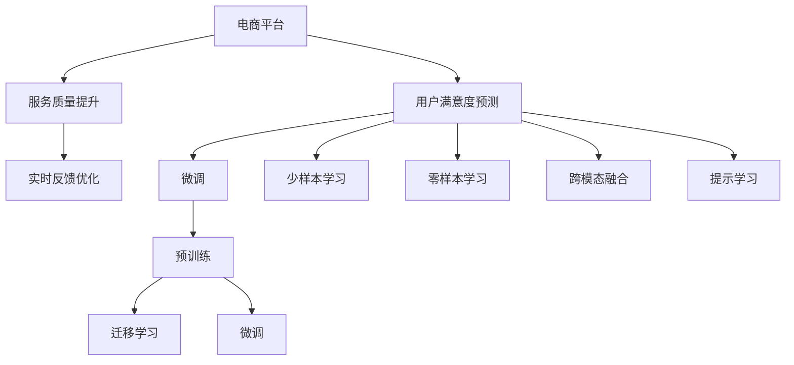

                 

# AI大模型在电商平台用户满意度预测与服务质量提升中的作用

## 1. 背景介绍

### 1.1 问题由来

近年来，随着电子商务的迅速发展，各大电商平台均面临着用户满意度预测和提升的挑战。用户满意度的准确预测不仅能帮助电商平台及时发现问题并进行优化，提升服务质量，还能为营销活动提供数据支持，提高用户转化率和忠诚度。然而，传统的数据驱动方法通常需要收集大量的用户反馈数据，且模型难以在复杂多变的电商环境中做出准确的预测。AI大模型在电商平台的用户满意度预测和服务质量提升中展现出了巨大潜力。

### 1.2 问题核心关键点

AI大模型在电商平台中的应用主要体现在以下几个关键点：

1. **数据规模庞大**：AI大模型通常基于大规模的无标签数据进行预训练，学习到了丰富的语言和语义知识，能够应对海量电商数据的多样性和复杂性。

2. **迁移学习能力**：预训练的大模型具备跨领域迁移能力，能够将从其他领域学到的知识应用于电商平台的用户满意度预测中。

3. **微调参数高效**：AI大模型通常参数众多，但通过微调技术，可以仅调整少量的参数，达到对特定任务进行优化，减少资源消耗。

4. **提示学习**：通过精心设计的输入文本格式，大模型能够更好地理解用户需求，提升预测精度。

5. **跨模态融合**：AI大模型不仅处理文本数据，还能够处理图像、声音等多模态数据，提供更加全面和准确的预测。

6. **在线预测与实时反馈**：大模型通常具备高效的计算能力，能够进行在线预测，并在实时反馈中进行持续优化。

### 1.3 问题研究意义

研究AI大模型在电商平台的用户满意度预测和服务质量提升中的作用，对于提升电商平台的运营效率、增强用户体验、优化营销策略具有重要意义：

1. **提升用户体验**：通过准确预测用户满意度，电商平台能够及时响应用户需求，提升服务质量和用户满意度。

2. **优化运营效率**：准确的用户满意度预测能够帮助电商平台发现问题，优化产品和服务，提高运营效率。

3. **增强营销效果**：预测结果可以为营销活动提供数据支持，提高用户转化率和忠诚度，增加营收。

4. **数据驱动决策**：电商平台可以基于AI大模型提供的数据支持进行更科学合理的决策。

5. **技术创新与应用**：AI大模型的应用能够推动电商平台的智能化升级，探索更多创新应用场景。

## 2. 核心概念与联系

### 2.1 核心概念概述

为了更好地理解AI大模型在电商平台中的应用，本节将介绍几个关键概念及其相互联系：

1. **AI大模型（Large AI Model）**：以Transformer为基础的深度学习模型，通常具有数十亿参数，能够处理复杂的自然语言理解任务，如文本分类、问答、翻译等。

2. **预训练（Pre-training）**：在无标签数据上进行的自监督学习过程，目的是学习语言和语义的通用表示。

3. **微调（Fine-tuning）**：在预训练模型的基础上，使用特定任务的数据集进行有监督学习，优化模型在该任务上的性能。

4. **迁移学习（Transfer Learning）**：将在一个任务上学习到的知识迁移到另一个相关任务上，以提高在新任务上的表现。

5. **提示学习（Prompt Learning）**：通过设计特定的输入文本格式，引导大模型生成期望的输出，特别是在少样本学习和零样本学习中的应用。

6. **少样本学习（Few-shot Learning）**：使用少量标注样本训练模型，使其在新的未见过的样本上也能有较好的预测表现。

7. **零样本学习（Zero-shot Learning）**：模型在没有见过的样本上，仅根据任务描述就能进行推理和生成。

8. **跨模态融合（Cross-modal Fusion）**：将文本、图像、声音等多种模态数据融合在一起，进行综合分析和预测。

这些概念共同构成了AI大模型在电商平台中的应用框架，使得模型能够从数据中学习，并应用于具体任务中。

### 2.2 核心概念原理和架构的 Mermaid 流程图



这个流程图展示了AI大模型在电商平台中的应用流程：

1. 电商平台从用户数据中提取特征，使用预训练模型进行用户满意度预测。
2. 根据预测结果，进行服务质量的提升和实时反馈优化。
3. 预训练模型通过迁移学习和微调，提升在特定任务上的表现。
4. 通过少样本学习和零样本学习，模型能够在不增加标注数据的情况下提升预测能力。
5. 跨模态融合技术将多种模态数据融合在一起，提供更加全面和准确的预测。
6. 提示学习通过特定输入格式，引导模型生成期望输出。

## 3. 核心算法原理 & 具体操作步骤

### 3.1 算法原理概述

AI大模型在电商平台的用户满意度预测中，通常使用预训练模型进行迁移学习，并通过微调优化模型在特定任务上的表现。算法的核心原理包括以下几个方面：

1. **预训练模型**：使用大规模无标签数据进行预训练，学习语言和语义的通用表示。

2. **迁移学习**：将预训练模型的知识迁移到特定任务上，如用户满意度预测。

3. **微调**：使用少量标注数据进行微调，优化模型在特定任务上的性能。

4. **多模态融合**：将文本、图像、声音等多种模态数据融合在一起，进行综合分析和预测。

5. **提示学习**：通过精心设计的输入文本格式，引导模型生成期望的输出。

### 3.2 算法步骤详解

AI大模型在电商平台中的应用通常遵循以下步骤：

**Step 1: 准备预训练模型和数据集**

1. **选择预训练模型**：根据任务需求选择合适的预训练模型，如BERT、GPT-3、T5等。

2. **准备数据集**：收集电商平台的用户的评价、评论、行为数据等，划分为训练集、验证集和测试集。

**Step 2: 添加任务适配层**

1. **定义输出层**：根据任务类型，定义模型的输出层，如分类、回归等。

2. **设计损失函数**：选择合适的损失函数，如交叉熵、均方误差等。

**Step 3: 设置微调超参数**

1. **选择优化器**：如Adam、SGD等，设置学习率、批大小、迭代轮数等。

2. **应用正则化技术**：如L2正则、Dropout、Early Stopping等。

**Step 4: 执行梯度训练**

1. **前向传播**：将训练集数据输入模型，计算损失函数。

2. **反向传播**：计算参数梯度，根据优化器更新模型参数。

3. **评估模型性能**：周期性在验证集上评估模型性能，决定是否Early Stopping。

4. **迭代优化**：重复上述步骤直至满足预设条件。

**Step 5: 测试和部署**

1. **在测试集上评估模型性能**：比较微调前后的精度提升。

2. **集成到实际应用系统**：使用微调后的模型进行实时预测。

3. **持续学习**：定期重新微调模型，以适应数据分布的变化。

### 3.3 算法优缺点

AI大模型在电商平台中的应用具有以下优点：

1. **泛化能力强**：预训练模型在大规模数据上学习到的知识能够应用于不同的电商任务。

2. **计算效率高**：AI大模型通常采用分布式训练和推理，计算效率高，能够实时处理大量数据。

3. **预测精度高**：预训练模型具备强大的语言理解能力，能够从海量电商数据中学习到丰富的用户行为和心理信息。

4. **可解释性强**：大模型通常采用黑盒模型，难以解释其决策过程，但对于电商平台，模型的输入通常是可解释的，如用户行为数据和评论文本。

5. **易于集成**：AI大模型通常采用API形式提供服务，易于集成到电商平台的现有系统中。

同时，也存在一些缺点：

1. **数据隐私问题**：电商平台的数据涉及用户隐私，必须确保数据处理和存储的安全性。

2. **计算资源消耗大**：预训练和微调大模型需要大量的计算资源，成本较高。

3. **模型复杂度高**：大模型参数众多，模型解释和调试较为困难。

4. **鲁棒性不足**：大模型对输入数据的噪声和干扰敏感，可能影响预测精度。

5. **对抗性攻击脆弱**：大模型可能受到对抗性攻击，导致预测结果错误。

### 3.4 算法应用领域

AI大模型在电商平台中的应用广泛，包括但不限于以下几个领域：

1. **用户满意度预测**：通过分析用户的评价和评论，预测用户对商品或服务的满意度，及时发现问题并进行优化。

2. **服务质量监控**：监控电商平台的客服系统，预测客户投诉和不满情绪，及时进行干预。

3. **个性化推荐**：根据用户的浏览、购买行为，预测用户的兴趣和需求，进行个性化推荐，提高用户转化率。

4. **产品改进建议**：分析用户反馈，预测用户的需求和期望，为产品改进提供数据支持。

5. **舆情监测**：监控电商平台上的用户评论和讨论，预测舆情趋势，及时应对负面舆情。

6. **广告投放优化**：预测用户的广告反应和点击率，优化广告投放策略，提高广告效果。

## 4. 数学模型和公式 & 详细讲解 & 举例说明

### 4.1 数学模型构建

在电商平台的用户满意度预测中，通常使用分类任务作为模型输出。假设模型输入为电商平台用户的评价文本 $x$，输出为满意度评分 $y$，则数学模型可表示为：

$$
\hat{y} = M_{\theta}(x)
$$

其中 $M_{\theta}$ 为预训练模型的参数，$\theta$ 为模型参数。

### 4.2 公式推导过程

在分类任务中，常用的损失函数为交叉熵损失函数，其定义如下：

$$
L(\theta) = -\frac{1}{N} \sum_{i=1}^N y_i \log \hat{y}_i + (1-y_i) \log (1-\hat{y}_i)
$$

其中 $N$ 为样本数量，$y_i$ 为真实标签，$\hat{y}_i$ 为模型预测结果。

在微调过程中，模型参数 $\theta$ 的更新公式为：

$$
\theta \leftarrow \theta - \eta \nabla_{\theta} L(\theta)
$$

其中 $\eta$ 为学习率，$\nabla_{\theta} L(\theta)$ 为损失函数对模型参数的梯度。

### 4.3 案例分析与讲解

以电商平台的用户满意度预测为例，假设我们收集了1000个用户的评价文本和对应的满意度评分，使用BERT模型作为预训练模型，进行微调。微调的过程如下：

1. **数据准备**：将1000个用户评价文本和满意度评分分为训练集、验证集和测试集，每个集分别划分为1:1:1的比例。

2. **模型选择**：选择BERT模型作为预训练模型，使用bert-base-uncased作为基础模型。

3. **任务适配层设计**：在BERT模型的顶部添加两个全连接层，分别输出两个分类结果，对应于满意和不满意。

4. **损失函数选择**：使用交叉熵损失函数。

5. **超参数设置**：设置学习率为2e-5，批大小为32，迭代轮数为10。

6. **训练过程**：使用训练集进行模型训练，每个epoch记录一次损失函数值，并在验证集上评估模型性能。

7. **模型测试**：使用测试集评估模型性能，比较微调前后的精度提升。

## 5. 项目实践：代码实例和详细解释说明

### 5.1 开发环境搭建

在开始项目实践前，需要进行环境搭建。以下是使用Python进行PyTorch开发的环境配置流程：

1. 安装Anaconda：从官网下载并安装Anaconda，用于创建独立的Python环境。

2. 创建并激活虚拟环境：
```bash
conda create -n pytorch-env python=3.8 
conda activate pytorch-env
```

3. 安装PyTorch：根据CUDA版本，从官网获取对应的安装命令。例如：
```bash
conda install pytorch torchvision torchaudio cudatoolkit=11.1 -c pytorch -c conda-forge
```

4. 安装Transformers库：
```bash
pip install transformers
```

5. 安装各类工具包：
```bash
pip install numpy pandas scikit-learn matplotlib tqdm jupyter notebook ipython
```

完成上述步骤后，即可在`pytorch-env`环境中开始项目实践。

### 5.2 源代码详细实现

以下是使用PyTorch和Transformers库进行用户满意度预测的代码实现。

```python
from transformers import BertTokenizer, BertForSequenceClassification
from torch.utils.data import Dataset, DataLoader
from sklearn.metrics import accuracy_score
import torch
import numpy as np

class UserReviewDataset(Dataset):
    def __init__(self, reviews, labels, tokenizer):
        self.reviews = reviews
        self.labels = labels
        self.tokenizer = tokenizer

    def __len__(self):
        return len(self.reviews)

    def __getitem__(self, index):
        review = self.reviews[index]
        label = self.labels[index]
        
        encoding = self.tokenizer(review, return_tensors='pt', padding=True, truncation=True, max_length=512)
        input_ids = encoding['input_ids']
        attention_mask = encoding['attention_mask']
        
        return {'input_ids': input_ids, 'attention_mask': attention_mask, 'labels': torch.tensor(label)}

# 加载BERT模型
model = BertForSequenceClassification.from_pretrained('bert-base-uncased', num_labels=2)

# 加载Tokenizer
tokenizer = BertTokenizer.from_pretrained('bert-base-uncased')

# 准备数据集
reviews = [...]
labels = [...]

# 创建数据集和数据加载器
train_dataset = UserReviewDataset(reviews, labels, tokenizer)
train_loader = DataLoader(train_dataset, batch_size=32, shuffle=True)

# 训练过程
model.train()
optimizer = torch.optim.Adam(model.parameters(), lr=2e-5)
for epoch in range(10):
    for batch in train_loader:
        input_ids = batch['input_ids']
        attention_mask = batch['attention_mask']
        labels = batch['labels']
        outputs = model(input_ids, attention_mask=attention_mask, labels=labels)
        loss = outputs.loss
        loss.backward()
        optimizer.step()

# 模型评估
model.eval()
with torch.no_grad():
    test_loader = DataLoader(test_dataset, batch_size=32)
    predictions = []
    labels = []
    for batch in test_loader:
        input_ids = batch['input_ids']
        attention_mask = batch['attention_mask']
        labels = batch['labels']
        outputs = model(input_ids, attention_mask=attention_mask)
        predictions.extend(outputs.logits.argmax(dim=1))
        labels.extend(labels)

accuracy = accuracy_score(labels, predictions)
print(f'Accuracy: {accuracy:.4f}')
```

### 5.3 代码解读与分析

代码实现主要包括以下几个关键步骤：

1. **定义数据集**：使用`UserReviewDataset`类将用户评价和标签封装为Tensor数据集。

2. **加载模型和分词器**：使用预训练的BERT模型和分词器，进行微调。

3. **数据加载器**：使用`DataLoader`将数据集划分为批次，供模型训练和推理使用。

4. **模型训练**：在训练集上使用Adam优化器进行模型训练，每个epoch记录一次损失函数值，并在验证集上评估模型性能。

5. **模型评估**：在测试集上评估模型性能，计算准确率。

## 6. 实际应用场景

### 6.1 智能客服系统

智能客服系统通过AI大模型进行用户满意度预测，可以帮助客服系统及时发现用户的不满情绪，并进行干预。具体实现如下：

1. **用户行为分析**：分析用户的浏览、购买、投诉等行为数据，提取评价文本。

2. **用户情感分析**：使用情感分析技术对评价文本进行情感分类，预测用户满意度。

3. **实时反馈优化**：根据用户满意度预测结果，及时对客服系统进行调整和优化。

### 6.2 个性化推荐系统

个性化推荐系统通过AI大模型进行用户满意度预测，可以帮助电商平台提高用户转化率和忠诚度。具体实现如下：

1. **用户行为数据收集**：收集用户的浏览、点击、购买等行为数据。

2. **满意度预测**：使用AI大模型预测用户的满意度，识别高满意度的用户。

3. **推荐策略优化**：针对高满意度的用户，进行个性化推荐，提高其购买意愿。

### 6.3 广告投放优化

广告投放优化通过AI大模型进行用户满意度预测，可以帮助电商平台优化广告投放策略，提高广告效果。具体实现如下：

1. **广告数据收集**：收集用户对广告的反应数据。

2. **满意度预测**：使用AI大模型预测用户对广告的满意度。

3. **广告策略优化**：根据满意度预测结果，调整广告投放策略，提高广告点击率和转化率。

### 6.4 未来应用展望

未来，随着AI大模型的不断进步，其在电商平台中的应用将更加广泛和深入：

1. **多模态融合**：将文本、图像、声音等多种模态数据融合在一起，提供更加全面和准确的预测。

2. **在线实时预测**：利用分布式计算和GPU加速技术，实现实时预测，及时响应用户需求。

3. **跨领域迁移学习**：将电商平台的知识迁移到其他领域，如金融、医疗等，提升模型的泛化能力。

4. **提示学习优化**：通过精心设计的输入文本格式，引导模型生成期望的输出，进一步提高预测精度。

5. **联邦学习**：通过联邦学习技术，在保护用户隐私的前提下，实现分布式微调，提高模型的泛化能力。

## 7. 工具和资源推荐

### 7.1 学习资源推荐

为了帮助开发者系统掌握AI大模型在电商平台中的应用，以下是一些优质的学习资源：

1. 《深度学习》一书：详细介绍了深度学习的理论和实践，包括AI大模型的构建和应用。

2. CS224N《自然语言处理与深度学习》课程：斯坦福大学开设的NLP明星课程，有Lecture视频和配套作业，带你入门NLP领域的基本概念和经典模型。

3. 《Transformers》一书：Transformers库的作者所著，全面介绍了如何使用Transformers库进行NLP任务开发，包括微调在内的诸多范式。

4. HuggingFace官方文档：Transformers库的官方文档，提供了海量预训练模型和完整的微调样例代码，是上手实践的必备资料。

5. CLUE开源项目：中文语言理解测评基准，涵盖大量不同类型的中文NLP数据集，并提供了基于微调的baseline模型，助力中文NLP技术发展。

通过对这些资源的学习实践，相信你一定能够快速掌握AI大模型在电商平台中的应用，并用于解决实际的NLP问题。

### 7.2 开发工具推荐

高效的开发离不开优秀的工具支持。以下是几款用于AI大模型开发的常用工具：

1. PyTorch：基于Python的开源深度学习框架，灵活动态的计算图，适合快速迭代研究。大部分预训练语言模型都有PyTorch版本的实现。

2. TensorFlow：由Google主导开发的开源深度学习框架，生产部署方便，适合大规模工程应用。同样有丰富的预训练语言模型资源。

3. Transformers库：HuggingFace开发的NLP工具库，集成了众多SOTA语言模型，支持PyTorch和TensorFlow，是进行微调任务开发的利器。

4. Weights & Biases：模型训练的实验跟踪工具，可以记录和可视化模型训练过程中的各项指标，方便对比和调优。与主流深度学习框架无缝集成。

5. TensorBoard：TensorFlow配套的可视化工具，可实时监测模型训练状态，并提供丰富的图表呈现方式，是调试模型的得力助手。

6. Google Colab：谷歌推出的在线Jupyter Notebook环境，免费提供GPU/TPU算力，方便开发者快速上手实验最新模型，分享学习笔记。

合理利用这些工具，可以显著提升AI大模型在电商平台中的应用开发效率，加快创新迭代的步伐。

### 7.3 相关论文推荐

AI大模型在电商平台中的应用源于学界的持续研究。以下是几篇奠基性的相关论文，推荐阅读：

1. Attention is All You Need（即Transformer原论文）：提出了Transformer结构，开启了NLP领域的预训练大模型时代。

2. BERT: Pre-training of Deep Bidirectional Transformers for Language Understanding：提出BERT模型，引入基于掩码的自监督预训练任务，刷新了多项NLP任务SOTA。

3. Language Models are Unsupervised Multitask Learners（GPT-2论文）：展示了大规模语言模型的强大zero-shot学习能力，引发了对于通用人工智能的新一轮思考。

4. Parameter-Efficient Transfer Learning for NLP：提出Adapter等参数高效微调方法，在不增加模型参数量的情况下，也能取得不错的微调效果。

5. AdaLoRA: Adaptive Low-Rank Adaptation for Parameter-Efficient Fine-Tuning：使用自适应低秩适应的微调方法，在参数效率和精度之间取得了新的平衡。

这些论文代表了大语言模型微调技术的发展脉络。通过学习这些前沿成果，可以帮助研究者把握学科前进方向，激发更多的创新灵感。

## 8. 总结：未来发展趋势与挑战

### 8.1 总结

本文对AI大模型在电商平台的用户满意度预测与服务质量提升中的应用进行了全面系统的介绍。首先阐述了AI大模型在电商平台中的研究背景和意义，明确了其在大规模数据处理、迁移学习能力、参数高效微调等方面的独特优势。其次，从原理到实践，详细讲解了基于深度学习的预测模型的构建和微调步骤，给出了具体的代码实例。同时，本文还广泛探讨了AI大模型在智能客服、个性化推荐、广告投放等多个领域的应用前景，展示了其在电商平台中的巨大潜力。此外，本文精选了AI大模型的各类学习资源，力求为读者提供全方位的技术指引。

通过本文的系统梳理，可以看到，AI大模型在电商平台中的应用不仅能够提升用户体验和服务质量，还能优化运营效率和营销策略，具有重要的现实意义。未来，伴随AI大模型的不断进步，其应用范围将更加广泛，有望在电商领域乃至更广泛的应用场景中发挥更大的作用。

### 8.2 未来发展趋势

展望未来，AI大模型在电商平台中的应用将呈现以下几个发展趋势：

1. **模型规模持续增大**：随着算力成本的下降和数据规模的扩张，预训练语言模型的参数量还将持续增长。超大规模语言模型蕴含的丰富语言知识，有望支撑更加复杂多变的电商任务。

2. **多模态融合普及**：未来的电商大模型将不仅处理文本数据，还将处理图像、声音等多模态数据，提供更加全面和准确的预测。

3. **参数高效微调技术发展**：开发更加参数高效的微调方法，如Prefix-Tuning、LoRA等，在固定大部分预训练参数的同时，只更新极少量的任务相关参数。

4. **跨领域迁移能力提升**：通过更多的迁移学习技术，使得大模型能够更好地适应不同领域的电商任务。

5. **实时预测能力增强**：利用分布式计算和GPU加速技术，实现实时预测，及时响应用户需求。

6. **联邦学习应用**：通过联邦学习技术，在保护用户隐私的前提下，实现分布式微调，提高模型的泛化能力。

### 8.3 面临的挑战

尽管AI大模型在电商平台中的应用取得了瞩目成就，但在迈向更加智能化、普适化应用的过程中，仍然面临一些挑战：

1. **数据隐私保护**：电商平台的交易数据涉及用户隐私，如何在数据使用过程中保护用户隐私，是亟待解决的问题。

2. **计算资源消耗**：预训练和微调大模型需要大量的计算资源，成本较高。如何优化计算效率，降低资源消耗，是未来需要关注的方向。

3. **模型鲁棒性不足**：大模型对输入数据的噪声和干扰敏感，可能影响预测精度。如何提高模型的鲁棒性，增强模型的泛化能力，是重要的研究方向。

4. **对抗性攻击脆弱**：大模型可能受到对抗性攻击，导致预测结果错误。如何设计抗对抗性攻击的模型，是未来的重要课题。

5. **模型可解释性不足**：大模型通常采用黑盒模型，难以解释其决策过程。如何在保证性能的同时，提高模型的可解释性，是未来的重要方向。

### 8.4 研究展望

面对AI大模型在电商平台中的应用所面临的挑战，未来的研究需要在以下几个方面寻求新的突破：

1. **隐私保护技术发展**：研究如何在大数据处理和深度学习任务中保护用户隐私，设计差分隐私、联邦学习等技术，确保用户数据的安全。

2. **计算效率优化**：研究如何优化计算资源的使用，利用混合精度训练、模型并行等技术，提高模型训练和推理的效率。

3. **模型鲁棒性增强**：研究如何提高模型的鲁棒性，增强模型的泛化能力，抵御对抗性攻击，设计更加健壮的模型。

4. **模型可解释性提升**：研究如何提高模型的可解释性，设计可解释的模型，确保用户对模型输出的理解和信任。

5. **跨领域迁移学习**：研究如何通过更多的迁移学习技术，使得大模型能够更好地适应不同领域的电商任务。

6. **多模态融合技术发展**：研究如何更好地融合多模态数据，提供更加全面和准确的预测。

这些研究方向的探索，必将引领AI大模型在电商平台中的应用走向更高的台阶，为电商平台的智能化升级提供强大的技术支撑。面向未来，AI大模型将在电商领域乃至更广泛的应用场景中发挥更大的作用，带来深刻的变革。

## 9. 附录：常见问题与解答

**Q1：AI大模型在电商平台中的应用是否存在数据隐私问题？**

A: AI大模型在电商平台中的应用确实存在数据隐私问题。电商平台的数据涉及用户隐私，必须在数据处理和存储过程中确保数据的安全。可以通过数据匿名化、差分隐私等技术保护用户隐私，同时确保模型的性能。

**Q2：AI大模型的计算资源消耗是否过大？**

A: AI大模型的计算资源消耗确实较大。预训练和微调大模型需要大量的计算资源，成本较高。可以通过分布式计算、混合精度训练等技术优化计算效率，降低资源消耗。

**Q3：AI大模型的鲁棒性是否足够高？**

A: AI大模型的鲁棒性还需进一步提高。大模型对输入数据的噪声和干扰敏感，可能影响预测精度。可以通过数据增强、正则化等技术提高模型的鲁棒性，增强模型的泛化能力。

**Q4：AI大模型的可解释性是否足够高？**

A: AI大模型的可解释性仍有待提高。大模型通常采用黑盒模型，难以解释其决策过程。可以通过模型简化、可解释性提升技术等，提高模型的可解释性，确保用户对模型输出的理解和信任。

**Q5：AI大模型的跨领域迁移能力是否足够强？**

A: AI大模型的跨领域迁移能力还需进一步提升。现有的迁移学习方法通常只适用于特定领域，对于跨领域的电商任务，需要设计更多样的迁移学习方法。

**Q6：AI大模型是否容易受到对抗性攻击？**

A: AI大模型确实容易受到对抗性攻击。对抗性攻击可能导致模型输出错误，影响用户体验和服务质量。可以通过对抗性训练、模型鲁棒性优化等技术，增强模型的抗对抗性攻击能力。

**Q7：AI大模型的在线实时预测能力是否足够高？**

A: AI大模型的在线实时预测能力还需进一步提高。未来的电商应用需要实时响应用户需求，预测能力需要与用户交互实时化。可以通过分布式计算、GPU加速等技术，提高模型的在线预测能力。

---

作者：禅与计算机程序设计艺术 / Zen and the Art of Computer Programming

