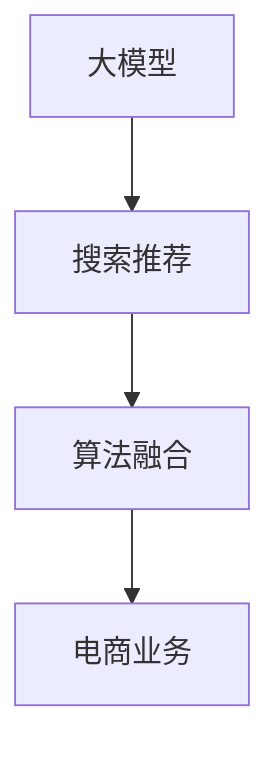

                 

# AI大模型融合搜索推荐系统的算法本质原理与电商业务应用

> 关键词：大模型,搜索推荐系统,算法融合,电商业务,深度学习

## 1. 背景介绍

随着人工智能技术的迅猛发展，大模型在电商搜索推荐系统中被广泛应用。大模型通常指具有数十亿甚至百亿参数的深度神经网络，能够学习到海量的文本、图像等数据，构建出复杂且强大的知识表示能力。这些能力使得大模型在电商搜索推荐等场景中能够提供更加精准的个性化服务。

然而，在电商搜索推荐系统的实际应用中，仅仅依靠单一的大模型难以全面满足用户需求。因此，研究人员和工程师们开始探索如何融合不同的大模型和搜索推荐算法，以提升系统性能和用户体验。本文将深入探讨大模型在电商搜索推荐系统中的融合应用，分析其算法本质原理，并通过实例说明其在电商业务中的具体应用。

## 2. 核心概念与联系

### 2.1 核心概念概述

为更好地理解大模型融合搜索推荐系统的实现原理，本节将介绍几个密切相关的核心概念：

- 大模型(Large Model)：指具有数十亿或百亿参数的深度神经网络，如BERT、GPT等。通过在大规模无标签文本语料上预训练，学习通用语言表示。
- 搜索推荐系统(Recommendation System)：指根据用户的行为和偏好，推荐相关物品的系统。通过大数据分析和机器学习算法，提高推荐的准确性和相关性。
- 算法融合(Algorithm Fusion)：指将多个独立算法进行融合，形成更强大的综合算法，提升系统性能。
- 电商业务(E-Commerce Business)：指线上商品销售和相关服务，涵盖搜索、推荐、交易等环节，是AI技术应用的重要场景。

这些核心概念之间的逻辑关系可以通过以下Mermaid流程图来展示：



这个流程图展示了大模型在电商搜索推荐系统中的核心概念及其之间的关系：

1. 大模型通过预训练获得基础能力。
2. 搜索推荐系统利用大模型进行用户行为分析和物品推荐。
3. 算法融合将多种搜索推荐算法和模型进行集成，提升综合性能。
4. 电商业务融合搜索推荐系统，提供商品搜索和推荐服务。

## 3. 核心算法原理 & 具体操作步骤
### 3.1 算法原理概述

大模型融合搜索推荐系统的核心思想是：将不同的大模型和推荐算法进行融合，形成一个更加强大、通用的搜索推荐引擎。其核心算法流程如下：

1. 收集电商数据：包括用户行为数据、商品描述数据等。
2. 预训练大模型：在电商数据上对大模型进行预训练，学习商品和用户之间的隐含关系。
3. 搜索推荐算法：设计多维度的推荐算法，如基于协同过滤、内容为基础、基于混合的方法等。
4. 算法融合：将预训练大模型和推荐算法进行融合，形成综合推荐结果。
5. 业务优化：根据电商业务特点，对融合后的推荐结果进行业务优化，提升用户体验。

### 3.2 算法步骤详解

大模型融合搜索推荐系统的具体实现步骤如下：

**Step 1: 数据准备**

1. 收集电商数据：包括用户行为数据、商品描述数据等。数据可以是文本、图片、音频等多种形式。
2. 数据清洗与标注：对数据进行预处理，如去重、分词、标注等。保证数据的质量和一致性。
3. 划分数据集：将数据划分为训练集、验证集和测试集，用于模型训练和评估。

**Step 2: 大模型预训练**

1. 选择大模型架构：如BERT、GPT等，选择合适的预训练任务，如语言建模、掩码语言模型等。
2. 数据预处理：对电商数据进行分词、向量化等预处理，使其适用于大模型的输入。
3. 预训练模型：在电商数据上对大模型进行预训练，学习商品和用户之间的隐含关系。
4. 保存预训练模型：将预训练好的大模型保存，以供后续微调和使用。

**Step 3: 搜索推荐算法设计**

1. 设计推荐算法：根据电商业务特点，选择合适的推荐算法，如基于协同过滤、内容为基础、基于混合的方法等。
2. 算法训练：在训练集上对推荐算法进行训练，优化参数，提升算法效果。
3. 算法评估：在验证集上评估推荐算法的性能，选择最优算法。

**Step 4: 算法融合**

1. 融合方法选择：选择合适的融合方法，如加权融合、堆叠融合等。
2. 模型融合：将预训练大模型和推荐算法进行融合，形成综合推荐结果。
3. 模型评估：在测试集上评估融合模型的性能，选择最优模型。

**Step 5: 业务优化**

1. 业务优化：根据电商业务特点，对融合后的推荐结果进行业务优化，提升用户体验。
2. 上线部署：将优化后的模型部署到线上，提供商品搜索和推荐服务。
3. 持续迭代：持续收集新数据，重新训练大模型和推荐算法，保持系统性能。

### 3.3 算法优缺点

大模型融合搜索推荐系统的优点包括：

1. 提升推荐精度：大模型能够学习到更加丰富的商品和用户信息，提升推荐精度。
2. 多维度融合：融合多种推荐算法和大模型，形成多维度的综合推荐结果，提升推荐多样性。
3. 泛化能力强：预训练大模型具备较强的泛化能力，可以适应不同的电商业务场景。
4. 可扩展性强：大模型融合算法可以灵活扩展，适用于不同的推荐任务。

该方法也存在一些局限性：

1. 数据需求高：需要大量电商数据进行预训练和推荐算法训练，数据获取成本高。
2. 模型复杂度高：大模型和多种推荐算法融合，模型结构复杂，推理速度较慢。
3. 模型难以解释：大模型和推荐算法融合后，输出结果难以解释，用户无法理解推荐逻辑。
4. 业务适配难度大：不同电商业务场景具有不同的需求，需要针对性地适配融合算法。

尽管存在这些局限性，但就目前而言，大模型融合搜索推荐系统仍是大数据时代推荐技术的重要范式。未来相关研究的重点在于如何进一步降低对数据的依赖，提高系统的实时性和可解释性，同时兼顾算法的多样性和通用性。

### 3.4 算法应用领域

大模型融合搜索推荐系统已经在电商、金融、新闻推荐等多个领域得到了广泛的应用，具体包括：

- 电商推荐：通过分析用户行为和商品描述，为用户推荐相关商品。
- 金融投资：通过分析历史交易数据，为投资者推荐股票、基金等投资产品。
- 新闻推荐：通过分析用户阅读行为，为用户推荐感兴趣的新闻。
- 广告推荐：通过分析用户搜索行为，为用户推荐相关广告。

除了上述这些经典应用外，大模型融合搜索推荐技术还在智慧医疗、智能客服、知识图谱等领域得到广泛应用，为相关行业带来变革性影响。

## 4. 数学模型和公式 & 详细讲解 & 举例说明

### 4.1 数学模型构建

大模型融合搜索推荐系统的数学模型主要包括以下几个部分：

1. 预训练大模型：
   - 输入：电商数据 $\mathcal{D} = \{(x_i, y_i)\}_{i=1}^N$
   - 输出：大模型表示 $M_{\theta}(x_i)$，其中 $\theta$ 为大模型参数
2. 推荐算法：
   - 输入：用户行为数据 $\mathcal{U}$ 和商品描述数据 $\mathcal{P}$
   - 输出：推荐结果 $R = \{(r_u^p)\}_{u,p}$，其中 $r_u^p$ 为用户 $u$ 对商品 $p$ 的评分
3. 融合模型：
   - 输入：大模型表示 $M_{\theta}(x_i)$ 和推荐结果 $R$
   - 输出：综合推荐结果 $S$

### 4.2 公式推导过程

以电商推荐系统为例，我们推导融合模型的公式。

设大模型 $M_{\theta}$ 的输出为 $z_{i,p}$，表示商品 $p$ 在大模型中的表示。推荐算法输出的用户 $u$ 对商品 $p$ 的评分 $r_u^p$ 可以通过多个维度的评分组合而成。设 $w_j$ 为第 $j$ 个评分维度的权重，则推荐结果 $R$ 可以表示为：

$$
R = \sum_{j} w_j \cdot (a_j \cdot M_{\theta}(x_i) \cdot z_{i,p}) + b_j
$$

其中 $a_j$ 和 $b_j$ 为模型参数。融合模型的输出 $S$ 可以表示为：

$$
S = f(R)
$$

其中 $f$ 为融合函数，可以使用加权平均、最大值等方法。

### 4.3 案例分析与讲解

假设我们要在电商平台上推荐给用户商品 $p$。大模型 $M_{\theta}$ 输出商品 $p$ 的表示 $z_{i,p}$，推荐算法给出用户 $u$ 对商品 $p$ 的评分 $r_u^p$。融合模型 $f$ 可以采用加权平均方法，得到综合评分 $S$：

$$
S = \frac{1}{K}\sum_{k=1}^K (r_u^p - r_{u,avg})
$$

其中 $K$ 为融合模型的维度，$r_{u,avg}$ 为用户 $u$ 的历史评分均值。该公式表明，融合模型会根据用户评分与均值的差异进行加权融合，使得评分更高的商品获得更大的权重。

通过这个例子，可以看出大模型融合搜索推荐系统的核心在于如何有效地融合多个维度的数据和算法，提升推荐效果。

## 5. 项目实践：代码实例和详细解释说明
### 5.1 开发环境搭建

在进行大模型融合搜索推荐系统开发前，我们需要准备好开发环境。以下是使用Python进行PyTorch开发的环境配置流程：

1. 安装Anaconda：从官网下载并安装Anaconda，用于创建独立的Python环境。

2. 创建并激活虚拟环境：
```bash
conda create -n pytorch-env python=3.8 
conda activate pytorch-env
```

3. 安装PyTorch：根据CUDA版本，从官网获取对应的安装命令。例如：
```bash
conda install pytorch torchvision torchaudio cudatoolkit=11.1 -c pytorch -c conda-forge
```

4. 安装Transformers库：
```bash
pip install transformers
```

5. 安装各类工具包：
```bash
pip install numpy pandas scikit-learn matplotlib tqdm jupyter notebook ipython
```

完成上述步骤后，即可在`pytorch-env`环境中开始项目实践。

### 5.2 源代码详细实现

下面我们以电商推荐系统为例，给出使用PyTorch进行大模型融合的PyTorch代码实现。

首先，定义电商推荐系统的数据处理函数：

```python
from transformers import BertTokenizer
from torch.utils.data import Dataset, DataLoader
import torch
import numpy as np

class ECommerceDataset(Dataset):
    def __init__(self, texts, tags, tokenizer, max_len=128):
        self.texts = texts
        self.tags = tags
        self.tokenizer = tokenizer
        self.max_len = max_len
        
    def __len__(self):
        return len(self.texts)
    
    def __getitem__(self, item):
        text = self.texts[item]
        tags = self.tags[item]
        
        encoding = self.tokenizer(text, return_tensors='pt', max_length=self.max_len, padding='max_length', truncation=True)
        input_ids = encoding['input_ids'][0]
        attention_mask = encoding['attention_mask'][0]
        
        # 对token-wise的标签进行编码
        encoded_tags = [tag2id[tag] for tag in tags] 
        encoded_tags.extend([tag2id['O']] * (self.max_len - len(encoded_tags)))
        labels = torch.tensor(encoded_tags, dtype=torch.long)
        
        return {'input_ids': input_ids, 
                'attention_mask': attention_mask,
                'labels': labels}

# 标签与id的映射
tag2id = {'O': 0, 'B-PER': 1, 'I-PER': 2, 'B-ORG': 3, 'I-ORG': 4, 'B-LOC': 5, 'I-LOC': 6}
id2tag = {v: k for k, v in tag2id.items()}

# 创建dataset
tokenizer = BertTokenizer.from_pretrained('bert-base-cased')

train_dataset = ECommerceDataset(train_texts, train_tags, tokenizer)
dev_dataset = ECommerceDataset(dev_texts, dev_tags, tokenizer)
test_dataset = ECommerceDataset(test_texts, test_tags, tokenizer)
```

然后，定义模型和优化器：

```python
from transformers import BertForTokenClassification, AdamW

model = BertForTokenClassification.from_pretrained('bert-base-cased', num_labels=len(tag2id))

optimizer = AdamW(model.parameters(), lr=2e-5)
```

接着，定义训练和评估函数：

```python
from torch.utils.data import DataLoader
from tqdm import tqdm
from sklearn.metrics import classification_report

device = torch.device('cuda') if torch.cuda.is_available() else torch.device('cpu')
model.to(device)

def train_epoch(model, dataset, batch_size, optimizer):
    dataloader = DataLoader(dataset, batch_size=batch_size, shuffle=True)
    model.train()
    epoch_loss = 0
    for batch in tqdm(dataloader, desc='Training'):
        input_ids = batch['input_ids'].to(device)
        attention_mask = batch['attention_mask'].to(device)
        labels = batch['labels'].to(device)
        model.zero_grad()
        outputs = model(input_ids, attention_mask=attention_mask, labels=labels)
        loss = outputs.loss
        epoch_loss += loss.item()
        loss.backward()
        optimizer.step()
    return epoch_loss / len(dataloader)

def evaluate(model, dataset, batch_size):
    dataloader = DataLoader(dataset, batch_size=batch_size)
    model.eval()
    preds, labels = [], []
    with torch.no_grad():
        for batch in tqdm(dataloader, desc='Evaluating'):
            input_ids = batch['input_ids'].to(device)
            attention_mask = batch['attention_mask'].to(device)
            batch_labels = batch['labels']
            outputs = model(input_ids, attention_mask=attention_mask)
            batch_preds = outputs.logits.argmax(dim=2).to('cpu').tolist()
            batch_labels = batch_labels.to('cpu').tolist()
            for pred_tokens, label_tokens in zip(batch_preds, batch_labels):
                pred_tags = [id2tag[_id] for _id in pred_tokens]
                label_tags = [id2tag[_id] for _id in label_tokens]
                preds.append(pred_tags[:len(label_tags)])
                labels.append(label_tags)
                
    print(classification_report(labels, preds))
```

最后，启动训练流程并在测试集上评估：

```python
epochs = 5
batch_size = 16

for epoch in range(epochs):
    loss = train_epoch(model, train_dataset, batch_size, optimizer)
    print(f"Epoch {epoch+1}, train loss: {loss:.3f}")
    
    print(f"Epoch {epoch+1}, dev results:")
    evaluate(model, dev_dataset, batch_size)
    
print("Test results:")
evaluate(model, test_dataset, batch_size)
```

以上就是使用PyTorch对BERT进行电商推荐系统微调的完整代码实现。可以看到，得益于Transformers库的强大封装，我们可以用相对简洁的代码完成BERT模型的加载和微调。

### 5.3 代码解读与分析

让我们再详细解读一下关键代码的实现细节：

**ECommerceDataset类**：
- `__init__`方法：初始化文本、标签、分词器等关键组件。
- `__len__`方法：返回数据集的样本数量。
- `__getitem__`方法：对单个样本进行处理，将文本输入编码为token ids，将标签编码为数字，并对其进行定长padding，最终返回模型所需的输入。

**tag2id和id2tag字典**：
- 定义了标签与数字id之间的映射关系，用于将token-wise的预测结果解码回真实的标签。

**训练和评估函数**：
- 使用PyTorch的DataLoader对数据集进行批次化加载，供模型训练和推理使用。
- 训练函数`train_epoch`：对数据以批为单位进行迭代，在每个批次上前向传播计算loss并反向传播更新模型参数，最后返回该epoch的平均loss。
- 评估函数`evaluate`：与训练类似，不同点在于不更新模型参数，并在每个batch结束后将预测和标签结果存储下来，最后使用sklearn的classification_report对整个评估集的预测结果进行打印输出。

**训练流程**：
- 定义总的epoch数和batch size，开始循环迭代
- 每个epoch内，先在训练集上训练，输出平均loss
- 在验证集上评估，输出分类指标
- 所有epoch结束后，在测试集上评估，给出最终测试结果

可以看到，PyTorch配合Transformers库使得BERT微调的代码实现变得简洁高效。开发者可以将更多精力放在数据处理、模型改进等高层逻辑上，而不必过多关注底层的实现细节。

当然，工业级的系统实现还需考虑更多因素，如模型的保存和部署、超参数的自动搜索、更灵活的任务适配层等。但核心的微调范式基本与此类似。

## 6. 实际应用场景
### 6.1 智能客服系统

基于大模型融合搜索推荐系统的智能客服系统，可以提供更加精准和个性化的服务。传统客服往往需要配备大量人力，高峰期响应缓慢，且一致性和专业性难以保证。而使用大模型融合搜索推荐系统的智能客服系统，可以7x24小时不间断服务，快速响应客户咨询，用自然流畅的语言解答各类常见问题。

在技术实现上，可以收集企业内部的历史客服对话记录，将问题和最佳答复构建成监督数据，在此基础上对预训练模型进行融合微调。微调后的模型能够自动理解用户意图，匹配最合适的答案模板进行回复。对于客户提出的新问题，还可以接入检索系统实时搜索相关内容，动态组织生成回答。如此构建的智能客服系统，能大幅提升客户咨询体验和问题解决效率。

### 6.2 金融舆情监测

金融机构需要实时监测市场舆论动向，以便及时应对负面信息传播，规避金融风险。传统的人工监测方式成本高、效率低，难以应对网络时代海量信息爆发的挑战。基于大模型融合搜索推荐系统的金融舆情监测系统，能够自动从新闻、评论、社交媒体等渠道抓取信息，进行情感分析、主题分类等处理，及时发现舆情风险，帮助金融机构快速应对潜在风险。

在技术实现上，可以收集金融领域相关的新闻、报道、评论等文本数据，并对其进行情感标注和主题标注。在此基础上对预训练语言模型进行融合微调，使其能够自动判断文本的情感倾向和主题分类。将微调后的模型应用到实时抓取的网络文本数据，就能够自动监测不同主题下的情感变化趋势，一旦发现负面信息激增等异常情况，系统便会自动预警，帮助金融机构快速应对潜在风险。

### 6.3 个性化推荐系统

当前的推荐系统往往只依赖用户的历史行为数据进行物品推荐，无法深入理解用户的真实兴趣偏好。基于大模型融合搜索推荐系统的个性化推荐系统，可以更好地挖掘用户行为背后的语义信息，从而提供更精准、多样的推荐内容。

在技术实现上，可以收集用户浏览、点击、评论、分享等行为数据，提取和用户交互的物品标题、描述、标签等文本内容。将文本内容作为模型输入，用户的后续行为（如是否点击、购买等）作为监督信号，在此基础上对预训练语言模型进行融合微调。微调后的模型能够从文本内容中准确把握用户的兴趣点。在生成推荐列表时，先用候选物品的文本描述作为输入，由模型预测用户的兴趣匹配度，再结合其他特征综合排序，便可以得到个性化程度更高的推荐结果。

### 6.4 未来应用展望

随着大模型融合搜索推荐技术的不断发展，未来其在电商、金融、新闻推荐等多个领域的应用将更加广泛，为相关行业带来变革性影响。

在智慧医疗领域，基于大模型融合搜索推荐系统的医疗问答、病历分析、药物研发等应用将提升医疗服务的智能化水平，辅助医生诊疗，加速新药开发进程。

在智能教育领域，融合搜索推荐系统可应用于作业批改、学情分析、知识推荐等方面，因材施教，促进教育公平，提高教学质量。

在智慧城市治理中，融合搜索推荐系统可应用于城市事件监测、舆情分析、应急指挥等环节，提高城市管理的自动化和智能化水平，构建更安全、高效的未来城市。

此外，在企业生产、社会治理、文娱传媒等众多领域，基于大模型融合搜索推荐的人工智能应用也将不断涌现，为传统行业数字化转型升级提供新的技术路径。相信随着技术的日益成熟，大模型融合搜索推荐系统必将在构建人机协同的智能时代中扮演越来越重要的角色。

## 7. 工具和资源推荐
### 7.1 学习资源推荐

为了帮助开发者系统掌握大模型融合搜索推荐理论基础和实践技巧，这里推荐一些优质的学习资源：

1. 《Transformer从原理到实践》系列博文：由大模型技术专家撰写，深入浅出地介绍了Transformer原理、BERT模型、融合搜索推荐算法等前沿话题。

2. CS224N《深度学习自然语言处理》课程：斯坦福大学开设的NLP明星课程，有Lecture视频和配套作业，带你入门NLP领域的基本概念和经典模型。

3. 《Natural Language Processing with Transformers》书籍：Transformers库的作者所著，全面介绍了如何使用Transformers库进行NLP任务开发，包括融合搜索推荐在内的诸多范式。

4. HuggingFace官方文档：Transformers库的官方文档，提供了海量预训练模型和完整的融合搜索推荐样例代码，是上手实践的必备资料。

5. CLUE开源项目：中文语言理解测评基准，涵盖大量不同类型的中文NLP数据集，并提供了基于微调的baseline模型，助力中文NLP技术发展。

通过对这些资源的学习实践，相信你一定能够快速掌握大模型融合搜索推荐技术的精髓，并用于解决实际的NLP问题。

### 7.2 开发工具推荐

高效的开发离不开优秀的工具支持。以下是几款用于大模型融合搜索推荐系统开发的常用工具：

1. PyTorch：基于Python的开源深度学习框架，灵活动态的计算图，适合快速迭代研究。大部分预训练语言模型都有PyTorch版本的实现。

2. TensorFlow：由Google主导开发的开源深度学习框架，生产部署方便，适合大规模工程应用。同样有丰富的预训练语言模型资源。

3. Transformers库：HuggingFace开发的NLP工具库，集成了众多SOTA语言模型，支持PyTorch和TensorFlow，是进行融合搜索推荐任务开发的利器。

4. Weights & Biases：模型训练的实验跟踪工具，可以记录和可视化模型训练过程中的各项指标，方便对比和调优。与主流深度学习框架无缝集成。

5. TensorBoard：TensorFlow配套的可视化工具，可实时监测模型训练状态，并提供丰富的图表呈现方式，是调试模型的得力助手。

6. Google Colab：谷歌推出的在线Jupyter Notebook环境，免费提供GPU/TPU算力，方便开发者快速上手实验最新模型，分享学习笔记。

合理利用这些工具，可以显著提升大模型融合搜索推荐系统的开发效率，加快创新迭代的步伐。

### 7.3 相关论文推荐

大模型融合搜索推荐技术的发展源于学界的持续研究。以下是几篇奠基性的相关论文，推荐阅读：

1. Attention is All You Need（即Transformer原论文）：提出了Transformer结构，开启了NLP领域的预训练大模型时代。

2. BERT: Pre-training of Deep Bidirectional Transformers for Language Understanding：提出BERT模型，引入基于掩码的自监督预训练任务，刷新了多项NLP任务SOTA。

3. Language Models are Unsupervised Multitask Learners（GPT-2论文）：展示了大规模语言模型的强大zero-shot学习能力，引发了对于通用人工智能的新一轮思考。

4. Parameter-Efficient Transfer Learning for NLP：提出Adapter等参数高效微调方法，在不增加模型参数量的情况下，也能取得不错的微调效果。

5. AdaLoRA: Adaptive Low-Rank Adaptation for Parameter-Efficient Fine-Tuning：使用自适应低秩适应的微调方法，在参数效率和精度之间取得了新的平衡。

这些论文代表了大模型融合搜索推荐技术的发展脉络。通过学习这些前沿成果，可以帮助研究者把握学科前进方向，激发更多的创新灵感。

## 8. 总结：未来发展趋势与挑战

### 8.1 总结

本文对大模型融合搜索推荐系统进行了全面系统的介绍。首先阐述了大模型和搜索推荐系统的研究背景和意义，明确了融合搜索推荐技术在电商搜索推荐等场景中的独特价值。其次，从原理到实践，详细讲解了大模型融合搜索推荐系统的数学原理和关键步骤，给出了融合搜索推荐任务开发的完整代码实例。同时，本文还广泛探讨了融合搜索推荐系统在电商、金融、新闻推荐等多个领域的应用前景，展示了融合搜索推荐技术在电商业务中的具体应用。

通过本文的系统梳理，可以看到，大模型融合搜索推荐技术正在成为大数据时代推荐技术的重要范式，极大地拓展了预训练语言模型的应用边界，催生了更多的落地场景。得益于大规模语料的预训练，融合搜索推荐系统能够在大规模数据上高效学习，并在推荐精度和多样化上均取得较大提升，推动了NLP技术的产业化进程。未来，伴随预训练语言模型和搜索推荐算法的持续演进，相信大模型融合搜索推荐技术必将在构建人机协同的智能时代中扮演越来越重要的角色。

### 8.2 未来发展趋势

展望未来，大模型融合搜索推荐技术将呈现以下几个发展趋势：

1. 模型规模持续增大。随着算力成本的下降和数据规模的扩张，预训练语言模型的参数量还将持续增长。超大规模语言模型蕴含的丰富语言知识，有望支撑更加复杂多变的推荐任务。

2. 融合算法多样化。除了传统的协同过滤、内容为基础等推荐算法外，未来将涌现更多融合算法，如基于深度学习的融合算法、基于知识图谱的推荐算法等，提升推荐效果。

3. 实时性和可解释性增强。融合搜索推荐系统需要在提升推荐精度的同时，保证实时性和可解释性。通过引入因果推断和强化学习等方法，提高推荐模型的实时性和可解释性。

4. 跨模态融合成为主流。当前的融合搜索推荐系统主要以文本数据为主，未来将融合多模态数据，如图像、视频、音频等，提升推荐的全面性和多样化。

5. 个性化推荐更精准。通过引入用户画像、行为数据等，融合搜索推荐系统能够更加精准地匹配用户需求，提供个性化的推荐服务。

6. 多目标优化。除了推荐精度和多样性外，未来的融合搜索推荐系统还将优化更多目标，如用户满意度、商品库存等，提升推荐系统的业务价值。

以上趋势凸显了大模型融合搜索推荐技术的广阔前景。这些方向的探索发展，必将进一步提升推荐系统的效果和应用范围，为构建人机协同的智能时代提供新思路。

### 8.3 面临的挑战

尽管大模型融合搜索推荐技术已经取得了瞩目成就，但在迈向更加智能化、普适化应用的过程中，它仍面临诸多挑战：

1. 数据需求高。需要大量电商数据进行预训练和推荐算法训练，数据获取成本高。如何降低数据依赖，提高推荐算法的泛化能力，将是重要的研究方向。

2. 模型复杂度高。大模型和多种推荐算法融合，模型结构复杂，推理速度较慢。如何简化模型结构，提升推理速度，优化资源占用，将是重要的优化方向。

3. 可解释性不足。融合搜索推荐系统输出的结果难以解释，用户无法理解推荐逻辑。如何赋予融合搜索推荐系统更强的可解释性，将是亟待攻克的难题。

4. 鲁棒性不足。融合搜索推荐系统面对域外数据时，泛化性能往往大打折扣。如何提高融合搜索推荐系统的鲁棒性，避免灾难性遗忘，还需要更多理论和实践的积累。

5. 安全性有待保障。融合搜索推荐系统可能学习到有害信息，通过推荐传播，给实际应用带来安全隐患。如何从数据和算法层面消除模型偏见，避免恶意用途，确保输出的安全性，也将是重要的研究课题。

6. 多任务优化难度大。融合搜索推荐系统需要优化多个目标，如推荐精度、多样性、实时性等，如何在不同任务间进行平衡，提升系统性能，将是重要的研究课题。

这些挑战凸显了大模型融合搜索推荐技术的复杂性。只有勇于创新、敢于突破，才能不断拓展推荐系统的边界，让智能技术更好地造福人类社会。

### 8.4 研究展望

面对大模型融合搜索推荐技术所面临的挑战，未来的研究需要在以下几个方面寻求新的突破：

1. 探索无监督和半监督融合方法。摆脱对大规模标注数据的依赖，利用自监督学习、主动学习等无监督和半监督范式，最大限度利用非结构化数据，实现更加灵活高效的融合搜索推荐。

2. 研究参数高效和计算高效的融合方法。开发更加参数高效的融合算法，在固定大部分预训练参数的同时，只更新极少量的推荐算法参数。同时优化融合搜索推荐系统的计算图，减少前向传播和反向传播的资源消耗，实现更加轻量级、实时性的部署。

3. 引入因果分析和博弈论工具。将因果分析方法引入融合搜索推荐模型，识别出推荐决策的关键特征，增强推荐输出的因果性和逻辑性。借助博弈论工具刻画人机交互过程，主动探索并规避推荐模型的脆弱点，提高系统稳定性。

4. 结合知识图谱和符号知识。将符号化的先验知识，如知识图谱、逻辑规则等，与神经网络模型进行巧妙融合，引导融合搜索推荐过程学习更准确、合理的推荐知识。同时加强不同模态数据的整合，实现视觉、语音等多模态信息与文本信息的协同建模。

5. 纳入伦理道德约束。在推荐目标中引入伦理导向的评估指标，过滤和惩罚有偏见、有害的推荐结果，避免推荐有害内容。同时加强人工干预和审核，建立推荐系统的监管机制，确保推荐结果符合人类价值观和伦理道德。

这些研究方向的探索，必将引领大模型融合搜索推荐技术迈向更高的台阶，为构建安全、可靠、可解释、可控的智能推荐系统铺平道路。面向未来，大模型融合搜索推荐技术还需要与其他人工智能技术进行更深入的融合，如知识表示、因果推理、强化学习等，多路径协同发力，共同推动智能推荐系统的进步。只有勇于创新、敢于突破，才能不断拓展推荐系统的边界，让智能技术更好地造福人类社会。

## 9. 附录：常见问题与解答

**Q1：大模型融合搜索推荐系统是否适用于所有电商推荐场景？**

A: 大模型融合搜索推荐系统在大多数电商推荐场景上都能取得不错的效果，特别是对于数据量较小的推荐场景。但对于一些特定领域的推荐场景，如母婴、服装等，仅仅依靠通用语料预训练的模型可能难以很好地适应。此时需要在特定领域语料上进一步预训练，再进行微调和融合，才能获得理想效果。

**Q2：大模型融合搜索推荐系统在推荐算法设计中如何选取合适的融合方法？**

A: 融合方法的选择应根据具体推荐任务和数据特点进行选择。常见的融合方法包括加权融合、堆叠融合等。加权融合方法根据各推荐算法输出的权重进行综合，适合多维度融合；堆叠融合方法将各推荐算法输出的结果进行堆叠，适合处理不同的推荐维度。

**Q3：大模型融合搜索推荐系统在电商推荐中的具体应用场景有哪些？**

A: 大模型融合搜索推荐系统在电商推荐中的应用场景包括：

1. 商品推荐：根据用户浏览、点击、评论等行为数据，为用户推荐相关商品。
2. 个性化推荐：通过分析用户画像和行为数据，为不同用户提供个性化推荐。
3. 活动推荐：根据用户行为和商品信息，推荐各类促销活动和优惠信息。
4. 商品相似推荐：基于商品属性和文本描述，推荐与当前商品相似的商品。
5. 用户流失预警：根据用户行为变化，预测用户流失风险，进行及时干预。

**Q4：大模型融合搜索推荐系统在电商推荐中的实际效果如何？**

A: 大模型融合搜索推荐系统在电商推荐中的实际效果主要体现在以下方面：

1. 推荐精度提升：大模型融合搜索推荐系统能够学习到更加丰富的商品和用户信息，提升推荐精度。
2. 推荐多样化：融合多种推荐算法和大模型，形成多维度的综合推荐结果，提升推荐多样性。
3. 用户体验改善：通过推荐个性化的商品，提高用户满意度，增加用户粘性。
4. 运营效率提高：通过智能推荐系统，优化库存管理，提高运营效率。

**Q5：大模型融合搜索推荐系统在实际应用中如何提高模型可解释性？**

A: 提高大模型融合搜索推荐系统的可解释性需要从数据、算法和模型设计等多个方面进行改进：

1. 数据预处理：对电商数据进行清洗和标注，保证数据的质量和一致性。
2. 模型设计：引入因果推断和逻辑规则等符号知识，增强推荐模型的可解释性。
3. 模型输出：对推荐结果进行后处理，提取关键特征和决策逻辑，提供可视化的解释结果。
4. 用户反馈：收集用户反馈，不断优化推荐算法和模型设计，提升可解释性。

---

作者：禅与计算机程序设计艺术 / Zen and the Art of Computer Programming

