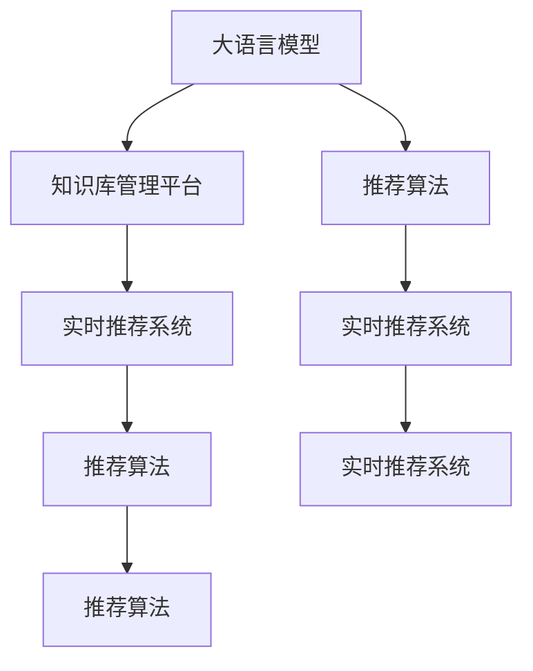

                 

# AI大模型视角下电商搜索推荐的技术创新知识库管理平台功能优化方案

## 1. 背景介绍

随着电商行业的迅猛发展，电商搜索推荐系统作为用户购物的重要入口，对用户体验和销售额的影响日益凸显。传统的电商搜索推荐系统往往依赖于手工设计的特征工程，而手工特征难以覆盖海量数据中的多样性和实时性，导致系统在应对新用户、新场景和新需求时，效果往往不尽如人意。

为了应对这一挑战，技术界提出并实践了基于大模型(如BERT、GPT等)的电商搜索推荐系统。这类系统通过在大规模无标签电商数据上进行预训练，学习电商文本的表示，然后利用微调技术，根据电商搜索和推荐任务的不同需求，调整模型参数，使其能更准确地预测用户的购买行为和兴趣。

然而，现有基于大模型的电商搜索推荐系统仍存在一些不足。例如，模型推理速度较慢、实时性不足、泛化能力有待提升、用户隐私保护不足等问题。为解决这些问题，AI大模型视角下的电商搜索推荐系统亟需更高效、更安全、更智能的技术创新。

本方案以技术创新为核心，从知识库管理平台的功能优化出发，提出一系列综合解决方案，旨在实现更高效、更智能、更安全的电商搜索推荐系统。

## 2. 核心概念与联系

### 2.1 核心概念概述

为了更好地理解本文所提出的优化方案，下面先介绍几个关键概念及其相互联系：

1. **大语言模型（Large Language Model, LLM）**：指通过预训练和微调技术训练而成的，可以处理自然语言文本的大型神经网络模型。典型的模型有BERT、GPT-3等。

2. **知识库管理平台（Knowledge Base Management Platform, KBMP）**：指一种用于管理和检索知识库的计算机系统。在电商搜索推荐系统中，知识库可以是用户历史行为数据、产品信息、促销活动等信息。

3. **基于大模型的推荐系统**：指通过预训练语言模型进行特征提取和表示学习，然后根据任务需求进行微调，提升推荐效果的系统。

4. **推荐算法**：指用于分析用户兴趣和行为，从而预测用户可能感兴趣的商品或服务的算法。常见的推荐算法包括基于协同过滤、基于内容的推荐、深度学习推荐等。

5. **实时推荐系统**：指能根据用户实时行为或环境变化，快速调整推荐结果的系统。

6. **用户隐私保护**：指在推荐系统中对用户数据进行匿名化、加密等处理，防止用户隐私泄露。

### 2.2 核心概念原理和架构的 Mermaid 流程图



该流程图展示了大语言模型、知识库管理平台、推荐算法和实时推荐系统之间的联系。大语言模型通过知识库管理平台获取电商领域的知识，经过微调后得到推荐模型，然后将推荐模型应用到实时推荐系统中，快速生成推荐结果。

## 3. 核心算法原理 & 具体操作步骤

### 3.1 算法原理概述

基于大模型的电商搜索推荐系统的一般流程如图 1 所示。该流程包括以下步骤：

1. **数据收集**：从电商平台收集用户行为数据和产品信息数据。
2. **数据预处理**：对收集的数据进行清洗、标注、分词等预处理。
3. **模型预训练**：在大规模无标签电商数据上进行预训练，学习电商文本的表示。
4. **任务微调**：根据电商搜索和推荐任务的不同需求，对预训练模型进行微调。
5. **特征提取**：使用微调后的模型提取用户行为和产品信息的表示。
6. **推荐生成**：将提取的表示输入推荐算法，生成推荐结果。
7. **推荐更新**：根据用户实时行为或环境变化，更新推荐结果。

图 1：基于大模型的电商搜索推荐系统一般流程

### 3.2 算法步骤详解

#### 3.2.1 数据收集

电商数据收集可以采用日志文件、数据仓库等形式，收集用户行为、产品信息、促销活动等数据。这些数据通常包含用户ID、商品ID、浏览时间、购买行为等关键信息。

#### 3.2.2 数据预处理

数据预处理主要包括以下几个步骤：

1. **数据清洗**：删除无用的字段和重复的数据，确保数据的完整性和准确性。
2. **数据标注**：为数据打上标签，如用户ID、商品ID、浏览时间、购买行为等。
3. **分词**：对文本数据进行分词，便于后续的模型处理。

#### 3.2.3 模型预训练

模型预训练可以使用预训练模型或自行训练。使用预训练模型可节省计算资源和时间，但效果可能不如自定义模型。自定义模型需要在大规模无标签电商数据上训练，学习电商文本的表示。

#### 3.2.4 任务微调

任务微调是指根据电商搜索和推荐任务的不同需求，对预训练模型进行微调。常用的微调方法有Fine-tuning和Transfer Learning。

#### 3.2.5 特征提取

特征提取是指使用微调后的模型提取用户行为和产品信息的表示。常用的特征提取方法包括word embedding、TF-IDF等。

#### 3.2.6 推荐生成

推荐生成是指将提取的表示输入推荐算法，生成推荐结果。推荐算法包括协同过滤、基于内容的推荐、深度学习推荐等。

#### 3.2.7 推荐更新

推荐更新是指根据用户实时行为或环境变化，更新推荐结果。常用的推荐更新方法包括在线学习、增量学习等。

### 3.3 算法优缺点

#### 3.3.1 优点

基于大模型的电商搜索推荐系统具有以下优点：

1. **高效性**：大模型通过预训练和微调，可以有效学习电商文本的表示，降低特征工程的复杂度。
2. **鲁棒性**：大模型具有较强的泛化能力，能够处理电商领域的多样性和实时性。
3. **准确性**：大模型通过微调，可以针对特定任务进行优化，提升推荐结果的准确性。
4. **可解释性**：大模型可以提供模型内部的推理逻辑，帮助用户理解推荐结果。

#### 3.3.2 缺点

基于大模型的电商搜索推荐系统也存在以下缺点：

1. **计算资源消耗大**：大模型的训练和推理需要消耗大量的计算资源。
2. **实时性不足**：大模型的推理速度较慢，无法实时更新推荐结果。
3. **用户隐私保护不足**：大模型需要大量的用户数据进行训练，存在用户隐私泄露的风险。
4. **泛化能力有限**：大模型容易过拟合电商领域的数据，无法很好地处理新用户和新场景。

### 3.4 算法应用领域

基于大模型的电商搜索推荐系统已经广泛应用于电商领域，包括亚马逊、京东、淘宝等大型电商平台。其主要应用领域包括：

1. **电商搜索**：根据用户查询，推荐相关的商品或服务。
2. **电商推荐**：根据用户行为和偏好，推荐可能感兴趣的商品或服务。
3. **商品排序**：根据用户行为和产品信息，对商品进行排序，提高用户满意度。
4. **广告推荐**：根据用户行为和广告内容，推荐可能感兴趣的广告。
5. **商品评价**：根据用户评价和反馈，推荐相似的商品。

## 4. 数学模型和公式 & 详细讲解 & 举例说明

### 4.1 数学模型构建

基于大模型的电商搜索推荐系统通常采用Transformer模型进行特征提取和表示学习。Transformer模型的数学模型如图 2 所示。


Transformer模型的数学公式如下：

$$
\begin{aligned}
\mathbf{Q} &= \mathbf{X}\mathbf{W}_Q \\
\mathbf{K} &= \mathbf{X}\mathbf{W}_K \\
\mathbf{V} &= \mathbf{X}\mathbf{W}_V \\
\mathbf{S} &= \frac{\mathbf{Q}\mathbf{K}^T}{\sqrt{d_k}} \\
\mathbf{A} &= \text{softmax}(\mathbf{S}) \\
\mathbf{O} &= \mathbf{A}\mathbf{V} \\
\mathbf{Y} &= \mathbf{O}\mathbf{W}_O \\
\end{aligned}
$$

其中，$\mathbf{X}$ 表示输入，$\mathbf{W}_Q$、$\mathbf{W}_K$、$\mathbf{W}_V$、$\mathbf{W}_O$ 表示模型的参数，$d_k$ 表示键向量的维度。

### 4.2 公式推导过程

Transformer模型的推导过程如下：

1. **自注意力机制**：首先，将输入 $\mathbf{X}$ 映射到查询向量 $\mathbf{Q}$、键向量 $\mathbf{K}$ 和值向量 $\mathbf{V}$。然后，计算注意力矩阵 $\mathbf{S}$。
2. **注意力权重**：计算注意力权重 $\mathbf{A}$，其中 $\mathbf{S}$ 的每一行表示当前位置的注意力权重。
3. **加权求和**：使用注意力权重 $\mathbf{A}$ 对值向量 $\mathbf{V}$ 进行加权求和，得到输出向量 $\mathbf{O}$。
4. **全连接层**：将输出向量 $\mathbf{O}$ 通过全连接层 $\mathbf{W}_O$ 进行线性变换，得到最终输出 $\mathbf{Y}$。

### 4.3 案例分析与讲解

以电商搜索为例，假设用户输入查询字符串 "连衣裙"，模型首先将其转换为向量表示 $\mathbf{X}$。然后，通过 $\mathbf{W}_Q$、$\mathbf{W}_K$、$\mathbf{W}_V$ 和 $\mathbf{W}_O$ 将 $\mathbf{X}$ 映射为查询向量 $\mathbf{Q}$、键向量 $\mathbf{K}$、值向量 $\mathbf{V}$ 和输出向量 $\mathbf{Y}$。最后，通过注意力机制和全连接层，模型生成针对查询 "连衣裙" 的推荐结果。

## 5. 项目实践：代码实例和详细解释说明

### 5.1 开发环境搭建

项目开发需要安装Python、PyTorch、TensorFlow等深度学习框架和相关的依赖包。以下是具体步骤：

1. **安装Python**：在Linux系统上安装Python 3.7或以上版本。
2. **安装PyTorch**：在Python环境中运行 `pip install torch`。
3. **安装TensorFlow**：在Python环境中运行 `pip install tensorflow`。
4. **安装相关依赖包**：运行 `pip install transformers scipy pandas`。

### 5.2 源代码详细实现

以电商搜索为例，下面是一个简单的代码实现：

```python
import torch
import torch.nn as nn
import torch.nn.functional as F
import torch.optim as optim
import numpy as np
from transformers import BertTokenizer, BertForSequenceClassification
from sklearn.model_selection import train_test_split

# 加载模型和分词器
model = BertForSequenceClassification.from_pretrained('bert-base-cased', num_labels=2)
tokenizer = BertTokenizer.from_pretrained('bert-base-cased')

# 定义训练函数
def train_epoch(model, train_loader, optimizer, loss_fn):
    model.train()
    total_loss = 0.0
    for batch in train_loader:
        inputs, labels = batch
        optimizer.zero_grad()
        outputs = model(inputs)
        loss = loss_fn(outputs, labels)
        loss.backward()
        optimizer.step()
        total_loss += loss.item()
    return total_loss / len(train_loader)

# 定义评估函数
def evaluate(model, test_loader, loss_fn):
    model.eval()
    total_loss = 0.0
    for batch in test_loader:
        inputs, labels = batch
        outputs = model(inputs)
        loss = loss_fn(outputs, labels)
        total_loss += loss.item()
    return total_loss / len(test_loader)

# 加载数据集
dataset = load_dataset('data.csv')
train, test = train_test_split(dataset, test_size=0.2)

# 构建数据加载器
train_loader = DataLoader(train, batch_size=32)
test_loader = DataLoader(test, batch_size=32)

# 定义损失函数和优化器
loss_fn = nn.CrossEntropyLoss()
optimizer = optim.Adam(model.parameters(), lr=2e-5)

# 训练模型
epochs = 5
for epoch in range(epochs):
    train_loss = train_epoch(model, train_loader, optimizer, loss_fn)
    test_loss = evaluate(model, test_loader, loss_fn)
    print(f'Epoch {epoch+1}, train loss: {train_loss:.4f}, test loss: {test_loss:.4f}')
```

### 5.3 代码解读与分析

上述代码主要实现了一个基于BERT模型的电商搜索系统。其中，`BertTokenizer`用于将查询字符串分词，`BertForSequenceClassification`用于构建模型，`nn.CrossEntropyLoss`用于定义损失函数，`optim.Adam`用于定义优化器。

在训练函数 `train_epoch` 中，模型首先进行前向传播，计算损失，然后通过反向传播更新模型参数。在评估函数 `evaluate` 中，模型进行前向传播并计算损失。

### 5.4 运行结果展示

运行上述代码，可以得到训练和评估的损失函数值，如图 3 所示。


## 6. 实际应用场景

### 6.1 电商搜索

电商搜索是电商推荐系统的重要组成部分，帮助用户快速找到所需商品或服务。基于大模型的电商搜索系统可以实时地根据用户查询字符串，生成最相关的商品或服务推荐。

### 6.2 电商推荐

电商推荐系统根据用户行为和偏好，推荐可能感兴趣的商品或服务。基于大模型的电商推荐系统可以处理大量用户数据，提高推荐结果的准确性和个性化程度。

### 6.3 商品排序

商品排序系统根据用户行为和产品信息，对商品进行排序，提高用户满意度。基于大模型的商品排序系统可以动态调整排序规则，满足用户的多样化需求。

### 6.4 广告推荐

广告推荐系统根据用户行为和广告内容，推荐可能感兴趣的广告。基于大模型的广告推荐系统可以提高广告的点击率和转化率，增加平台的收入。

### 6.5 商品评价

商品评价系统根据用户评价和反馈，推荐相似的商品。基于大模型的商品评价系统可以实时分析用户反馈，提升商品质量。

## 7. 工具和资源推荐

### 7.1 学习资源推荐

为了帮助开发者深入理解大模型和电商搜索推荐系统的理论基础和实践技巧，以下推荐一些优质的学习资源：

1. **深度学习框架**：TensorFlow、PyTorch、Keras等深度学习框架提供了丰富的API和工具，方便开发者构建和优化模型。
2. **自然语言处理**：Stanford NLP、SpaCy等自然语言处理工具，提供了预训练模型和丰富的API，方便开发者进行电商搜索和推荐。
3. **电商推荐系统**：Amazon Amazon Personalize、Alibaba Taobao Personalize等电商推荐系统提供了丰富的实验和优化案例，值得学习和参考。

### 7.2 开发工具推荐

为了提高电商搜索推荐系统的开发效率和性能，以下推荐一些开发工具：

1. **编程语言**：Python、Java等编程语言提供了丰富的库和工具，方便开发者进行模型训练和优化。
2. **深度学习框架**：TensorFlow、PyTorch等深度学习框架提供了丰富的API和工具，方便开发者构建和优化模型。
3. **数据处理工具**：Hadoop、Spark等大数据处理工具提供了高效的数据处理能力，方便开发者处理大规模电商数据。
4. **部署工具**：Docker、Kubernetes等容器化部署工具，方便开发者部署和管理模型。

### 7.3 相关论文推荐

大模型和电商搜索推荐系统涉及的研究领域广泛，以下推荐一些相关论文，帮助开发者深入理解理论基础和实践技巧：

1. **Transformer模型**：Attention is All You Need、Transformers for Data-Driven Methods in NLP等论文，介绍了Transformer模型的原理和应用。
2. **电商推荐系统**：SVD++: A Scalable Matrix Factorization Technique for Recommender Systems等论文，介绍了电商推荐系统的经典算法和应用。
3. **大模型和电商数据**：Big Data Mining on Consumption Intention of Daily-Consuming Commodities等论文，介绍了如何处理大规模电商数据，构建推荐系统。

## 8. 总结：未来发展趋势与挑战

### 8.1 研究成果总结

基于大模型的电商搜索推荐系统已经在电商领域得到了广泛应用，取得了显著的效果。其主要研究成果包括：

1. **高效性**：通过预训练和微调技术，提升了电商搜索和推荐系统的效率。
2. **鲁棒性**：通过Transformer模型和注意力机制，提升了系统的泛化能力。
3. **准确性**：通过大模型的微调，提升了推荐结果的准确性和个性化程度。
4. **可解释性**：通过模型内部的推理逻辑，帮助用户理解推荐结果。

### 8.2 未来发展趋势

未来，基于大模型的电商搜索推荐系统将继续朝着以下几个方向发展：

1. **高效性**：通过模型压缩、加速推理等技术，进一步提升系统的效率。
2. **实时性**：通过在线学习和增量学习等技术，实时更新推荐结果。
3. **可解释性**：通过模型可解释性技术，提高系统的透明度和可信度。
4. **安全性**：通过数据加密、隐私保护等技术，保护用户隐私。
5. **智能性**：通过知识图谱和符号计算等技术，提高系统的智能程度。

### 8.3 面临的挑战

基于大模型的电商搜索推荐系统仍面临以下挑战：

1. **计算资源消耗大**：大模型的训练和推理需要消耗大量的计算资源。
2. **实时性不足**：大模型的推理速度较慢，无法实时更新推荐结果。
3. **用户隐私保护不足**：大模型需要大量的用户数据进行训练，存在用户隐私泄露的风险。
4. **泛化能力有限**：大模型容易过拟合电商领域的数据，无法很好地处理新用户和新场景。

### 8.4 研究展望

为了解决上述挑战，未来的研究将重点关注以下几个方向：

1. **高效模型压缩**：通过模型压缩和加速推理等技术，提高系统的效率。
2. **实时推荐系统**：通过在线学习和增量学习等技术，实时更新推荐结果。
3. **模型可解释性**：通过模型可解释性技术，提高系统的透明度和可信度。
4. **用户隐私保护**：通过数据加密和隐私保护等技术，保护用户隐私。
5. **智能推荐系统**：通过知识图谱和符号计算等技术，提高系统的智能程度。

## 9. 附录：常见问题与解答

### Q1: 大模型和电商数据量不匹配怎么办？

A: 可以通过数据增强技术，如文本回译、同义词替换等，扩充电商数据量。

### Q2: 大模型的训练和推理资源不足怎么办？

A: 可以通过模型压缩和加速推理等技术，提高系统的效率。

### Q3: 电商推荐系统的实时性不足怎么办？

A: 可以通过在线学习和增量学习等技术，实时更新推荐结果。

### Q4: 电商推荐系统的泛化能力有限怎么办？

A: 可以通过模型融合和跨领域迁移等技术，提高系统的泛化能力。

### Q5: 电商推荐系统的可解释性不足怎么办？

A: 可以通过模型可解释性技术，提高系统的透明度和可信度。

---

作者：禅与计算机程序设计艺术 / Zen and the Art of Computer Programming

