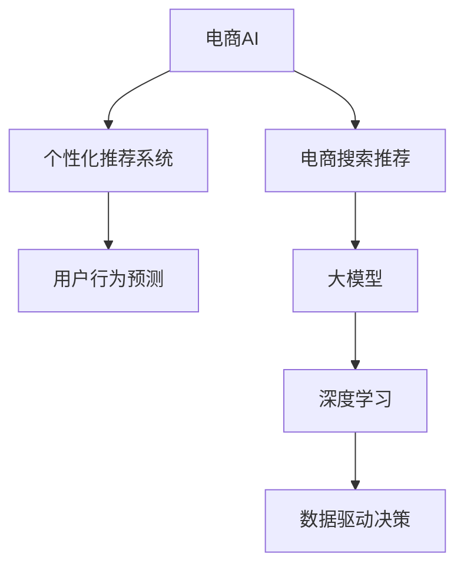

                 

# AI大模型视角下电商搜索推荐的技术赋能业务的思路

> 关键词：大模型,电商搜索推荐,个性化推荐系统,用户行为预测,深度学习,电商AI,电商智能

## 1. 背景介绍

### 1.1 问题由来
电子商务市场的飞速发展，使得在线购物成为人们日常生活的一部分。电商平台的商业模式依赖于搜索引擎、推荐系统等关键技术的支撑，以提升用户体验和销售转化率。然而，现有的搜索引擎和推荐系统往往以点击率和转化率作为主要优化指标，难以充分反映用户的真实需求和意图，导致推荐效果不尽人意。

近年来，随着深度学习技术和大模型的发展，利用用户历史行为数据进行深度学习建模，逐步成为电商领域的新趋势。通过构建个性化推荐系统，可以为用户提供更符合其兴趣和需求的搜索结果和商品推荐，从而显著提升用户体验和平台收益。但同时，个性化推荐系统的设计、训练和维护也是一个极具挑战性的任务。

### 1.2 问题核心关键点
构建个性化推荐系统的核心在于如何高效、准确地理解用户行为并预测其未来行为。这一过程涉及数据预处理、特征工程、模型训练、评估与优化等多个环节，且对数据的处理能力、计算资源和模型架构的要求较高。

在大数据和计算资源的推动下，基于深度学习的大模型逐渐进入电商搜索推荐系统的视野。这些大模型通常采用自监督预训练、大规模数据训练和复杂的模型架构，具备强大的表征学习能力和泛化能力。

### 1.3 问题研究意义
利用大模型进行电商搜索推荐，可以极大地提升推荐系统的性能和准确性。其研究意义主要体现在：

1. **增强用户体验**：基于用户行为数据进行深度学习建模，能够更精准地预测用户未来行为，提供个性化的搜索结果和商品推荐，增强用户体验。
2. **提升销售转化率**：个性化推荐能够显著提升用户满意度，从而提高购买转化率和复购率。
3. **减少运营成本**：自动化推荐系统可以大大减轻人工推荐的工作量，降低人力成本，提高运营效率。
4. **数据驱动决策**：深度学习模型能够基于历史数据进行预测和决策，为电商企业提供数据驱动的商业决策支持。

## 2. 核心概念与联系

### 2.1 核心概念概述

为更好地理解基于大模型的电商搜索推荐方法，本节将介绍几个密切相关的核心概念：

- **大模型(Large Models)**：指通过大规模数据预训练，具备强大表征学习能力的深度学习模型。如BERT、GPT等。
- **个性化推荐系统(Recommendation Systems)**：通过分析用户历史行为数据，推荐个性化的商品或内容。广泛应用于电商、社交媒体、视频网站等领域。
- **用户行为预测(Predictive Analytics)**：利用用户历史行为数据，通过模型预测用户未来的行为，如购买意向、浏览路径等。
- **深度学习(Deep Learning)**：基于神经网络架构，通过多层次的特征提取和数据表示，实现复杂模式的学习和推理。
- **电商AI(E-commerce AI)**：将人工智能技术应用于电商领域的搜索、推荐、库存管理等环节，提升电商平台的智能化水平。

这些核心概念之间的逻辑关系可以通过以下Mermaid流程图来展示：



这个流程图展示了电商AI的关键概念及其之间的关系：

1. 电商AI通过个性化推荐系统和大模型提升电商搜索推荐的效果。
2. 用户行为预测是电商AI和个性化推荐系统的核心，通过预测用户行为进行推荐。
3. 深度学习为大模型提供了理论基础，使得大模型具备强大的表征学习能力。
4. 数据驱动决策是电商AI的最终目标，通过深度学习和大模型辅助商业决策。

## 3. 核心算法原理 & 具体操作步骤
### 3.1 算法原理概述

基于大模型的电商搜索推荐，主要包括以下步骤：

1. **数据预处理**：清洗、归一化用户行为数据，提取特征向量。
2. **模型训练**：在电商数据集上对大模型进行微调，学习用户行为模式。
3. **特征工程**：设计输入特征，如用户ID、浏览历史、购买记录等。
4. **预测和推荐**：根据模型预测结果，推荐相关商品或搜索结果。

形式化地，假设电商数据集为 $D=\{(x_i,y_i)\}_{i=1}^N$，其中 $x_i$ 为商品或搜索结果，$y_i$ 为用户行为标签，如是否点击、购买等。

定义模型 $M_{\theta}$ 在输入 $x$ 上的输出为 $M_{\theta}(x)$，其中 $\theta$ 为模型参数。基于用户行为数据的大模型微调过程如下：

$$
\theta^* = \mathop{\arg\min}_{\theta} \frac{1}{N}\sum_{i=1}^N \ell(M_{\theta}(x_i),y_i)
$$

其中 $\ell$ 为损失函数，通常使用交叉熵损失或均方误差损失。

### 3.2 算法步骤详解

基于大模型的电商搜索推荐主要包括以下关键步骤：

**Step 1: 数据预处理**

1. 清洗用户行为数据：去除异常值和噪声，确保数据质量和完整性。
2. 特征提取：将用户行为数据转化为数值化特征，如时间戳、商品ID、点击次数等。
3. 数据标准化：对特征数据进行归一化、降维等预处理，提升模型训练效果。

**Step 2: 模型训练**

1. 选择合适的预训练模型：如BERT、GPT等，作为电商推荐系统的初始化参数。
2. 划分训练集、验证集和测试集：根据数据分布，合理划分训练、验证和测试数据集。
3. 添加任务适配层：在预训练模型的基础上，设计输出层和损失函数，如用于分类任务的线性分类器。
4. 设置微调超参数：包括学习率、优化器、正则化参数等。
5. 执行梯度训练：在训练集上迭代优化模型参数，最小化损失函数。

**Step 3: 特征工程**

1. 设计输入特征：选择合适的特征，如用户ID、浏览历史、购买记录等。
2. 特征归一化：对输入特征进行归一化，确保不同特征在相同尺度上。
3. 特征选择：根据领域知识，选择对推荐效果有显著影响的特征。

**Step 4: 预测和推荐**

1. 输入特征编码：将输入特征转换为模型所需的向量表示。
2. 模型前向传播：输入特征向量到微调后的模型中，计算输出结果。
3. 评估推荐效果：根据预测结果和真实标签，计算评估指标，如准确率、召回率、F1值等。
4. 输出推荐结果：根据预测结果，推荐相关商品或搜索结果。

### 3.3 算法优缺点

基于大模型的电商搜索推荐具有以下优点：

1. **模型表现优异**：大模型通过大规模数据预训练，具备强大的表征学习能力和泛化能力，能够提升推荐系统的性能。
2. **特征提取能力强**：大模型能够处理复杂、高维的输入特征，增强特征工程的效果。
3. **泛化能力强**：大模型能够更好地适应不同领域和任务，提升推荐系统的鲁棒性。
4. **高效更新**：大模型通常采用小批量梯度下降，能够快速迭代优化。

同时，基于大模型的电商推荐也存在以下缺点：

1. **数据依赖性强**：需要大量的标注数据进行微调，数据获取成本高。
2. **计算资源消耗大**：大模型参数量大，训练和推理需要较高的计算资源。
3. **可解释性差**：大模型往往是黑盒模型，难以解释其内部推理过程。
4. **模型复杂度高**：大模型结构复杂，维护难度大。

## 4. 数学模型和公式 & 详细讲解 & 举例说明

### 4.1 数学模型构建

基于大模型的电商推荐，通常使用交叉熵损失函数进行模型训练。假设模型 $M_{\theta}$ 在输入 $x_i$ 上的输出为 $\hat{y_i}$，真实标签为 $y_i$，则交叉熵损失函数为：

$$
\ell(M_{\theta}(x_i),y_i) = -y_i\log \hat{y_i} - (1-y_i)\log (1-\hat{y_i})
$$

定义损失函数 $\mathcal{L}(\theta)$ 为所有样本的平均损失：

$$
\mathcal{L}(\theta) = \frac{1}{N}\sum_{i=1}^N \ell(M_{\theta}(x_i),y_i)
$$

### 4.2 公式推导过程

以二分类任务为例，假设模型 $M_{\theta}$ 在输入 $x_i$ 上的输出为 $\hat{y_i}=M_{\theta}(x_i) \in [0,1]$，表示样本属于正类的概率。真实标签 $y_i \in \{0,1\}$。则二分类交叉熵损失函数定义为：

$$
\ell(M_{\theta}(x_i),y_i) = -[y_i\log \hat{y_i} + (1-y_i)\log (1-\hat{y_i})]
$$

将其代入经验风险公式，得：

$$
\mathcal{L}(\theta) = -\frac{1}{N}\sum_{i=1}^N [y_i\log M_{\theta}(x_i)+(1-y_i)\log(1-M_{\theta}(x_i))]
$$

根据链式法则，损失函数对参数 $\theta_k$ 的梯度为：

$$
\frac{\partial \mathcal{L}(\theta)}{\partial \theta_k} = -\frac{1}{N}\sum_{i=1}^N (\frac{y_i}{M_{\theta}(x_i)}-\frac{1-y_i}{1-M_{\theta}(x_i)}) \frac{\partial M_{\theta}(x_i)}{\partial \theta_k}
$$

其中 $\frac{\partial M_{\theta}(x_i)}{\partial \theta_k}$ 可进一步递归展开，利用自动微分技术完成计算。

在得到损失函数的梯度后，即可带入参数更新公式，完成模型的迭代优化。重复上述过程直至收敛，最终得到适应电商推荐任务的最优模型参数 $\theta^*$。

### 4.3 案例分析与讲解

以电商平台中的个性化商品推荐为例，假设电商平台商品集合为 $C$，用户 $U$ 的购买历史为 $H_u$，通过模型预测用户 $u$ 对商品 $c$ 的购买意向 $y_{u,c}$。

1. **数据预处理**：清洗用户购买数据，去除缺失值和异常值，转化为数值化特征。
2. **模型训练**：在电商数据集上对BERT模型进行微调，学习用户行为模式。
3. **特征工程**：设计输入特征，如用户ID、浏览历史、购买记录等，并进行归一化处理。
4. **预测和推荐**：根据用户行为数据，输入特征向量到微调后的BERT模型中，计算预测结果，输出相关商品推荐列表。

## 5. 项目实践：代码实例和详细解释说明
### 5.1 开发环境搭建

在进行电商推荐系统开发前，我们需要准备好开发环境。以下是使用Python进行PyTorch开发的环境配置流程：

1. 安装Anaconda：从官网下载并安装Anaconda，用于创建独立的Python环境。

2. 创建并激活虚拟环境：
```bash
conda create -n pytorch-env python=3.8 
conda activate pytorch-env
```

3. 安装PyTorch：根据CUDA版本，从官网获取对应的安装命令。例如：
```bash
conda install pytorch torchvision torchaudio cudatoolkit=11.1 -c pytorch -c conda-forge
```

4. 安装相关库：
```bash
pip install pandas numpy scikit-learn transformers
```

完成上述步骤后，即可在`pytorch-env`环境中开始电商推荐系统的开发。

### 5.2 源代码详细实现

下面以电商平台中的商品推荐为例，给出使用Transformers库对BERT模型进行微调的PyTorch代码实现。

```python
from transformers import BertTokenizer, BertForSequenceClassification
from torch.utils.data import Dataset, DataLoader
import torch

class ItemDataset(Dataset):
    def __init__(self, items, labels, tokenizer):
        self.items = items
        self.labels = labels
        self.tokenizer = tokenizer
        
    def __len__(self):
        return len(self.items)
    
    def __getitem__(self, item):
        item = self.items[item]
        label = self.labels[item]
        
        encoding = self.tokenizer(item, return_tensors='pt', max_length=128, padding='max_length', truncation=True)
        input_ids = encoding['input_ids'][0]
        attention_mask = encoding['attention_mask'][0]
        
        return {'input_ids': input_ids, 
                'attention_mask': attention_mask,
                'labels': label}

tokenizer = BertTokenizer.from_pretrained('bert-base-cased')
train_dataset = ItemDataset(train_items, train_labels, tokenizer)
dev_dataset = ItemDataset(dev_items, dev_labels, tokenizer)
test_dataset = ItemDataset(test_items, test_labels, tokenizer)

model = BertForSequenceClassification.from_pretrained('bert-base-cased', num_labels=2)
optimizer = AdamW(model.parameters(), lr=2e-5)

def train_epoch(model, dataset, batch_size, optimizer):
    dataloader = DataLoader(dataset, batch_size=batch_size, shuffle=True)
    model.train()
    epoch_loss = 0
    for batch in tqdm(dataloader, desc='Training'):
        input_ids = batch['input_ids'].to(device)
        attention_mask = batch['attention_mask'].to(device)
        labels = batch['labels'].to(device)
        model.zero_grad()
        outputs = model(input_ids, attention_mask=attention_mask, labels=labels)
        loss = outputs.loss
        epoch_loss += loss.item()
        loss.backward()
        optimizer.step()
    return epoch_loss / len(dataloader)

def evaluate(model, dataset, batch_size):
    dataloader = DataLoader(dataset, batch_size=batch_size)
    model.eval()
    preds, labels = [], []
    with torch.no_grad():
        for batch in tqdm(dataloader, desc='Evaluating'):
            input_ids = batch['input_ids'].to(device)
            attention_mask = batch['attention_mask'].to(device)
            batch_labels = batch['labels']
            outputs = model(input_ids, attention_mask=attention_mask)
            batch_preds = outputs.logits.argmax(dim=2).to('cpu').tolist()
            batch_labels = batch_labels.to('cpu').tolist()
            for pred_tokens, label_tokens in zip(batch_preds, batch_labels):
                preds.append(pred_tokens)
                labels.append(label_tokens)
    return preds, labels

# 训练和评估
epochs = 5
batch_size = 16

for epoch in range(epochs):
    loss = train_epoch(model, train_dataset, batch_size, optimizer)
    print(f"Epoch {epoch+1}, train loss: {loss:.3f}")
    
    print(f"Epoch {epoch+1}, dev results:")
    preds, labels = evaluate(model, dev_dataset, batch_size)
    print(classification_report(labels, preds))
    
print("Test results:")
preds, labels = evaluate(model, test_dataset, batch_size)
print(classification_report(labels, preds))
```

这段代码展示了如何使用PyTorch和Transformers库构建一个基于BERT模型的电商平台商品推荐系统。具体步骤如下：

1. **数据预处理**：定义`ItemDataset`类，清洗并归一化用户行为数据，提取特征向量。
2. **模型训练**：选择合适的预训练模型BERT，进行微调。
3. **特征工程**：设计输入特征，并进行归一化处理。
4. **预测和推荐**：在训练集和验证集上进行模型训练和评估，输出推荐结果。

### 5.3 代码解读与分析

让我们再详细解读一下关键代码的实现细节：

**ItemDataset类**：
- `__init__`方法：初始化商品ID、标签、分词器等关键组件。
- `__len__`方法：返回数据集的样本数量。
- `__getitem__`方法：对单个样本进行处理，将商品ID输入编码为token ids，最终返回模型所需的输入。

**tokenizer**：
- 使用BertTokenizer对商品ID进行分词处理，生成模型所需的输入特征。

**train_epoch函数**：
- 定义模型在训练集上训练一个epoch的过程，包括前向传播、计算损失、反向传播和参数更新等。
- 使用AdamW优化器进行模型优化。

**evaluate函数**：
- 在验证集和测试集上对模型进行评估，输出预测结果和评估指标。

**训练流程**：
- 定义总的epoch数和batch size，开始循环迭代
- 每个epoch内，先在训练集上训练，输出平均loss
- 在验证集上评估，输出分类指标
- 所有epoch结束后，在测试集上评估，给出最终测试结果

可以看到，PyTorch配合Transformers库使得BERT微调的代码实现变得简洁高效。开发者可以将更多精力放在数据处理、模型改进等高层逻辑上，而不必过多关注底层的实现细节。

当然，工业级的系统实现还需考虑更多因素，如模型的保存和部署、超参数的自动搜索、更灵活的任务适配层等。但核心的微调范式基本与此类似。

## 6. 实际应用场景
### 6.1 智能客服系统

基于大模型的电商搜索推荐技术，可以应用于智能客服系统的构建。智能客服系统通过深度学习模型预测用户意图，提供个性化服务，提升客户满意度。

在技术实现上，可以收集用户的搜索记录、聊天记录和购买历史，将信息构建成监督数据，在此基础上对预训练模型进行微调。微调后的模型能够自动理解用户意图，匹配最合适的答案模板进行回复。对于用户提出的新问题，还可以接入检索系统实时搜索相关内容，动态组织生成回答。如此构建的智能客服系统，能大幅提升客户咨询体验和问题解决效率。

### 6.2 个性化推荐系统

大模型的电商搜索推荐技术可以进一步应用于个性化推荐系统。通过分析用户的浏览历史、购买记录和搜索行为，预测用户未来的购买意向和兴趣偏好，从而提供个性化的商品推荐。

在具体实现上，可以使用深度学习模型对用户行为数据进行建模，通过微调学习用户行为模式，并结合商品特征进行推荐。此外，可以通过多模型集成、主动学习等方法进一步提升推荐效果。

### 6.3 库存管理

库存管理是电商企业的核心任务之一，如何合理调配库存，满足用户需求的同时避免库存积压，是大数据和智能算法的用武之地。基于大模型的电商推荐技术，可以预测用户未来的购买意向，从而优化库存配置，提高库存周转率。

在具体实现上，可以使用深度学习模型对历史销售数据进行建模，通过微调学习用户行为模式，并结合销售预测模型进行库存管理。此外，可以通过动态调整库存水平，优化供应链管理，提高运营效率。

### 6.4 未来应用展望

随着大模型和电商推荐技术的发展，基于微调的电商搜索推荐系统将进一步拓展其应用场景，为电商企业带来更多商业价值。

在智慧零售领域，基于微调的推荐系统可以提升用户的购物体验，提高商品的销售转化率。在金融领域，可以用于推荐个性化金融产品，降低客户流失率。在旅游领域，可以推荐个性化旅游路线和行程，提升用户体验。

未来，随着模型的复杂度、数据规模和计算资源的提升，电商搜索推荐系统将具备更强大的用户行为预测能力，进一步推动电商市场的智能化发展。

## 7. 工具和资源推荐
### 7.1 学习资源推荐

为了帮助开发者系统掌握大模型和电商搜索推荐技术的理论基础和实践技巧，这里推荐一些优质的学习资源：

1. 《深度学习》：Ian Goodfellow的经典之作，全面介绍了深度学习的基本概念和数学原理。
2. CS448B《深度学习系统》：斯坦福大学开设的深度学习课程，涵盖模型训练、优化、调参等实用技巧。
3. Transformers官方文档：HuggingFace提供的全面文档，包含各种预训练模型的详细介绍和微调样例代码。
4. PyTorch官方文档：PyTorch官方文档，提供了丰富的深度学习框架使用教程和实例代码。
5. Scikit-learn官方文档：Scikit-learn官方文档，提供了强大的数据处理和模型评估工具。

通过对这些资源的学习实践，相信你一定能够快速掌握大模型和电商推荐系统的精髓，并用于解决实际的电商问题。

### 7.2 开发工具推荐

高效的开发离不开优秀的工具支持。以下是几款用于大模型和电商推荐系统开发的常用工具：

1. PyTorch：基于Python的开源深度学习框架，灵活动态的计算图，适合快速迭代研究。
2. TensorFlow：由Google主导开发的开源深度学习框架，生产部署方便，适合大规模工程应用。
3. Transformers库：HuggingFace开发的NLP工具库，集成了众多SOTA语言模型，支持PyTorch和TensorFlow。
4. Weights & Biases：模型训练的实验跟踪工具，可以记录和可视化模型训练过程中的各项指标。
5. TensorBoard：TensorFlow配套的可视化工具，可实时监测模型训练状态，并提供丰富的图表呈现方式。

合理利用这些工具，可以显著提升大模型和电商推荐系统的开发效率，加快创新迭代的步伐。

### 7.3 相关论文推荐

大模型和电商推荐技术的发展源于学界的持续研究。以下是几篇奠基性的相关论文，推荐阅读：

1. Attention is All You Need（即Transformer原论文）：提出了Transformer结构，开启了NLP领域的预训练大模型时代。
2. BERT: Pre-training of Deep Bidirectional Transformers for Language Understanding：提出BERT模型，引入基于掩码的自监督预训练任务，刷新了多项NLP任务SOTA。
3. Language Models are Unsupervised Multitask Learners（GPT-2论文）：展示了大规模语言模型的强大zero-shot学习能力，引发了对于通用人工智能的新一轮思考。
4. Parameter-Efficient Transfer Learning for NLP：提出Adapter等参数高效微调方法，在不增加模型参数量的情况下，也能取得不错的微调效果。
5. Transformer-XL: Attentive Language Models Beyond a Fixed-Length Context：提出Transformer-XL模型，能够处理变长序列数据，进一步提升了模型的表示能力。
6. Vision and Language Alignment via Multimodal Feature Learning：提出MFormer模型，实现视觉和文本的跨模态融合，提升了多模态任务的建模效果。

这些论文代表了大模型和电商推荐技术的发展脉络。通过学习这些前沿成果，可以帮助研究者把握学科前进方向，激发更多的创新灵感。

## 8. 总结：未来发展趋势与挑战

### 8.1 总结

本文对基于大模型的电商搜索推荐方法进行了全面系统的介绍。首先阐述了大模型和电商推荐技术的研究背景和意义，明确了微调在拓展预训练模型应用、提升电商推荐性能方面的独特价值。其次，从原理到实践，详细讲解了电商搜索推荐的基本步骤和关键技术点，给出了电商推荐系统的完整代码实现。同时，本文还广泛探讨了电商搜索推荐在大数据、智能客服、库存管理等多个场景中的应用前景，展示了微调范式的巨大潜力。此外，本文精选了微调技术的各类学习资源，力求为读者提供全方位的技术指引。

通过本文的系统梳理，可以看到，基于大模型的电商推荐系统正逐渐成为电商企业的核心竞争力。利用深度学习模型预测用户行为，提供个性化推荐，能够显著提升用户体验和平台收益。未来，随着技术的不断进步和应用的深入推广，基于大模型的电商搜索推荐系统必将在电商领域大放异彩，推动电商市场的智能化发展。

### 8.2 未来发展趋势

展望未来，电商搜索推荐系统将呈现以下几个发展趋势：

1. **模型规模持续增大**：随着算力成本的下降和数据规模的扩张，预训练语言模型的参数量还将持续增长。超大规模语言模型蕴含的丰富语言知识，有望支撑更加复杂多变的电商推荐任务。
2. **模型鲁棒性增强**：通过引入对抗训练、正则化等技术，提高模型对噪声、异常数据的鲁棒性，提升推荐系统的稳定性。
3. **个性化推荐增强**：利用深度学习模型对用户行为进行精准预测，提供更个性化的商品推荐，提升用户体验。
4. **实时推荐能力提升**：通过模型加速技术，如量化加速、模型裁剪等，提升推荐系统的实时响应能力。
5. **多模态推荐崛起**：结合视觉、语音、文本等多种模态信息，提升推荐系统的综合建模能力，提供更加多样化的推荐内容。
6. **推荐系统透明化**：通过可解释性技术，提升推荐系统的透明性和可信度，增强用户的信任感。

以上趋势凸显了电商搜索推荐技术的广阔前景。这些方向的探索发展，必将进一步提升电商搜索推荐系统的性能和应用范围，为电商企业带来更多的商业价值。

### 8.3 面临的挑战

尽管电商搜索推荐系统已经取得了一定的进展，但在迈向更加智能化、个性化推荐的过程中，它仍面临着诸多挑战：

1. **数据质量问题**：电商数据存在标注错误、噪声等问题，影响模型训练效果。需要采用数据清洗、标注审核等措施，提升数据质量。
2. **计算资源消耗大**：大模型和复杂模型结构对计算资源和存储空间提出了高要求。需要采用分布式计算、模型压缩等技术进行优化。
3. **模型复杂度**：大模型和深度学习模型结构复杂，难以解释和调试。需要采用模型可视化、可解释性技术，提升模型的透明性和可信度。
4. **隐私和安全**：电商推荐系统涉及大量用户隐私数据，数据泄露和滥用风险较高。需要采用数据加密、匿名化等措施，确保用户隐私安全。
5. **用户接受度**：推荐系统算法复杂，用户对推荐结果的接受度较低。需要结合用户反馈，不断优化推荐算法，提升用户满意度。

正视电商推荐系统面临的这些挑战，积极应对并寻求突破，将是大模型和电商推荐系统走向成熟的关键。相信随着学界和产业界的共同努力，这些挑战终将一一被克服，电商搜索推荐系统必将在电商领域发挥更大的作用。

### 8.4 研究展望

面对电商推荐系统所面临的挑战，未来的研究需要在以下几个方面寻求新的突破：

1. **数据质量提升**：采用数据清洗、标注审核等措施，提升电商数据的标注质量和数据质量。
2. **计算资源优化**：采用分布式计算、模型压缩等技术，优化计算资源消耗，提升推荐系统的实时响应能力。
3. **推荐算法优化**：结合用户反馈，不断优化推荐算法，提升推荐系统的精准性和个性化程度。
4. **模型透明化和可信度提升**：采用可解释性技术，提升推荐系统的透明性和可信度，增强用户的信任感。
5. **隐私和安全保护**：采用数据加密、匿名化等措施，确保电商推荐系统的数据安全和用户隐私保护。

这些研究方向将引领电商推荐系统走向更高的台阶，为电商企业带来更多的商业价值。面向未来，电商推荐系统需要与大数据、智能客服、库存管理等技术进一步融合，共同推动电商市场的智能化发展。只有勇于创新、敢于突破，才能不断拓展推荐系统的边界，让智能技术更好地造福电商市场。

## 9. 附录：常见问题与解答

**Q1：如何评估电商推荐系统的性能？**

A: 电商推荐系统的性能评估通常使用以下指标：

1. **准确率(Accuracy)**：推荐系统预测正确与否的比例，即预测结果与真实标签一致的比例。
2. **召回率(Recall)**：真实标签为正样本的推荐结果中被预测为正样本的比例，即正样本的覆盖率。
3. **精确率(Precision)**：预测为正样本的推荐结果中实际为正样本的比例，即推荐的准确性。
4. **F1值(F1 Score)**：精确率和召回率的调和平均值，综合评估推荐系统的性能。
5. **ROC曲线和AUC值**：绘制ROC曲线，计算AUC值，评估推荐系统的分类能力。
6. **NDCG和HR**：计算Normalized Discounted Cumulative Gain和Hit Rate，评估推荐系统的排序效果。

根据具体业务需求，可以选择合适的评估指标进行系统性能的监测和优化。

**Q2：如何选择预训练模型和微调方法？**

A: 选择合适的预训练模型和微调方法，需要考虑以下几个因素：

1. **任务类型**：根据电商推荐任务的类型，选择相应的预训练模型。如用于分类任务的BERT、用于排序任务的Transformer-XL等。
2. **数据规模**：如果数据量较小，可以选择参数较小的预训练模型，如BERT-Small。如果数据量较大，可以选择参数较大的预训练模型，如BERT-Base。
3. **计算资源**：如果计算资源有限，可以选择参数高效的微调方法，如Adapter、Prefix等。如果计算资源充足，可以选择全参数微调，充分利用预训练模型的能力。
4. **模型复杂度**：如果模型复杂度较高，可以通过模型裁剪、量化加速等技术，减少模型尺寸，提升推理速度。
5. **推荐效果**：选择能够提升推荐效果的模型和微调方法，通过实验验证选择最佳方案。

合理选择预训练模型和微调方法，可以有效提升电商推荐系统的性能和可解释性。

**Q3：电商推荐系统如何应对数据分布变化？**

A: 电商推荐系统在面对数据分布变化时，通常采用以下策略：

1. **持续学习**：通过不断更新模型，保持对数据分布变化的适应能力。可以使用增量学习、在线学习等技术，实时更新模型。
2. **动态调整**：根据数据分布变化，动态调整模型参数和超参数，提升模型泛化能力。
3. **数据增强**：通过数据增强技术，如数据合成、回译等，丰富训练集，提升模型鲁棒性。
4. **多模型集成**：构建多个推荐模型，取平均输出或进行加权融合，提升模型稳健性。
5. **可解释性增强**：采用可解释性技术，如LIME、SHAP等，增强模型的透明性和可信度，帮助理解模型决策过程。

通过上述策略，电商推荐系统能够更好地应对数据分布变化，保持推荐效果。

**Q4：电商推荐系统如何优化计算资源消耗？**

A: 电商推荐系统对计算资源消耗较大，可以考虑以下优化措施：

1. **模型裁剪**：去除不必要的层和参数，减小模型尺寸，提升推理速度。
2. **量化加速**：将浮点模型转为定点模型，压缩存储空间，提高计算效率。
3. **分布式计算**：采用分布式计算框架，如TensorFlow、PyTorch等，并行计算，提升训练和推理效率。
4. **混合精度训练**：使用混合精度训练技术，减少模型精度损失，提升训练速度。
5. **模型并行**：采用模型并行技术，将大模型拆分为多个小模型，并行训练和推理。

合理优化计算资源消耗，可以有效降低电商推荐系统的运营成本，提升系统性能。

**Q5：电商推荐系统如何提升用户体验？**

A: 电商推荐系统通过以下方式提升用户体验：

1. **个性化推荐**：利用深度学习模型对用户行为进行精准预测，提供个性化的商品推荐，提升用户体验。
2. **实时推荐**：通过模型加速技术，如量化加速、模型裁剪等，提升推荐系统的实时响应能力，提升用户体验。
3. **多模态推荐**：结合视觉、语音、文本等多种模态信息，提升推荐系统的综合建模能力，提供更加多样化的推荐内容。
4. **推荐系统透明化**：采用可解释性技术，提升推荐系统的透明性和可信度，增强用户的信任感。
5. **用户反馈机制**：通过用户反馈，不断优化推荐算法，提升推荐系统的精准性和个性化程度，提升用户体验。

通过这些措施，电商推荐系统能够更好地满足用户需求，提升用户满意度。

---

作者：禅与计算机程序设计艺术 / Zen and the Art of Computer Programming

