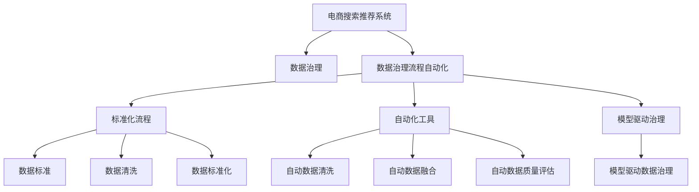

                 

# AI大模型重构电商搜索推荐的数据治理流程自动化方案

## 1. 背景介绍

### 1.1 问题由来
近年来，随着人工智能技术的快速发展，大模型在电商搜索推荐系统中的应用愈发广泛。各大电商企业通过大规模数据集训练大模型，显著提升了搜索和推荐的个性化程度和效果。然而，在实际应用中，电商搜索推荐系统也面临一些痛点问题：

- **数据质量问题**：电商数据具有海量、多源、多格式的特点，数据清洗、去重、标准化等工作繁琐且容易出错。
- **数据治理成本高**：数据治理流程涉及多部门、多系统、多环节，流程复杂且人工干预成本高。
- **数据治理效率低**：传统的数据治理流程自动化程度低，数据质量评估、数据修复、数据融合等环节耗费大量时间，难以快速响应业务需求。

为解决这些痛点，各大电商企业迫切需要构建自动化、高效率的数据治理流程，从而提升数据质量，支撑电商搜索推荐系统的高效运行。

### 1.2 问题核心关键点
构建电商搜索推荐系统数据治理流程自动化的核心关键点在于：

1. **标准化流程**：制定统一的、可复用的数据治理流程模板，涵盖数据收集、清洗、融合、评估等环节。
2. **自动化工具**：利用大模型和深度学习技术，开发自动化的数据治理工具，实现数据处理和质量评估的自动化。
3. **模型驱动治理**：引入大模型进行数据治理决策，利用大模型的预测能力，自动发现数据质量问题并生成治理建议。
4. **跨部门协作**：搭建数据治理流程自动化平台，实现数据治理流程的跨部门协作，提升治理效率。

本文将深入探讨大模型在电商搜索推荐系统数据治理流程自动化中的应用，并给出具体的实践方案。

## 2. 核心概念与联系

### 2.1 核心概念概述

为更好地理解基于大模型的电商搜索推荐系统数据治理流程自动化方法，本节将介绍几个密切相关的核心概念：

- **电商搜索推荐系统**：利用人工智能技术，根据用户行为和商品属性，自动推荐商品给用户的系统。
- **数据治理**：通过制定数据标准、清洗、标准化、元数据管理等手段，提升数据质量的过程。
- **数据治理流程自动化**：利用自动化工具和技术，实现数据治理流程的自动化，提升数据治理效率。
- **大模型**：以Transformer结构为代表的大规模预训练模型，通过自监督学习任务训练得到，具备强大的语言和图像理解能力。
- **预训练与微调**：在大规模无标签数据上预训练，在特定任务数据上进行微调，提升模型在特定任务上的表现。

这些核心概念之间的逻辑关系可以通过以下Mermaid流程图来展示：



这个流程图展示了大模型与电商搜索推荐系统数据治理流程自动化的关系：

1. 电商搜索推荐系统通过数据治理流程，获取高质量的数据输入。
2. 数据治理流程的自动化和大模型引入，提升了数据治理的效率和效果。
3. 标准化流程、自动化工具、模型驱动治理共同构成数据治理流程自动化的关键环节。

## 3. 核心算法原理 & 具体操作步骤
### 3.1 算法原理概述

基于大模型的电商搜索推荐系统数据治理流程自动化，本质上是一个结合深度学习和大数据技术的自动化流程。其核心思想是：利用大模型的强大预测能力，自动化地发现和修复数据质量问题，从而提升电商搜索推荐系统的性能。

具体而言，步骤如下：

1. **数据收集**：通过爬虫和API接口，从多个数据源（如电商网站、供应商系统等）自动收集原始数据。
2. **数据清洗**：利用大模型对数据进行初步分析，识别并过滤掉异常数据、噪声数据和重复数据。
3. **数据标准化**：使用大模型对数据进行文本、数值等类型转换，确保数据格式一致。
4. **数据融合**：利用大模型对多个数据源进行特征融合，生成统一的特征向量，供后续搜索推荐模型使用。
5. **数据质量评估**：使用大模型对融合后的数据进行质量评估，自动发现缺失值、异常值等数据质量问题。
6. **数据治理建议**：利用大模型生成数据治理建议，如数据补全、数据纠错、数据重构等。
7. **数据修复与融合**：根据大模型的治理建议，自动进行数据修复和融合，生成高质量的数据集。
8. **数据发布与应用**：将治理后的数据集发布到电商搜索推荐系统，供模型训练和业务应用。

### 3.2 算法步骤详解

**Step 1: 数据收集与清洗**

电商数据来源多样，格式各异。首先需要通过爬虫和API接口，自动收集不同数据源的数据。数据清洗的目的是去除数据中的噪声、异常值和重复数据，保证数据质量。

具体步骤包括：

1. **爬虫抓取**：通过HTTP请求或API接口，抓取电商网站、供应商系统等的数据。
2. **数据去重**：利用大模型对数据进行相似度分析，过滤掉重复数据。
3. **数据清理**：去除数据中的空白、特殊字符、重复字段等。
4. **异常检测**：使用大模型检测数据中的异常值，如缺失值、异常值等。

**Step 2: 数据标准化**

电商数据包括文本、数值、日期等多种类型，需要进行标准化处理，以便后续模型处理。

具体步骤包括：

1. **文本标准化**：利用大模型对文本数据进行分词、去除停用词、词性标注等处理。
2. **数值标准化**：对数值型数据进行归一化、标准化处理。
3. **日期标准化**：将日期数据转换为统一格式。

**Step 3: 数据融合与特征提取**

电商数据来源于不同系统，需要进行特征融合，生成统一的特征向量。

具体步骤包括：

1. **特征提取**：使用大模型对各数据源的特征进行提取，生成统一特征向量。
2. **特征融合**：利用大模型对多个特征进行融合，生成综合特征向量。
3. **数据融合**：将不同来源的数据进行合并，生成统一的特征向量。

**Step 4: 数据质量评估**

数据质量评估的目的是发现数据中的问题，如缺失值、异常值等，以便进行修复。

具体步骤包括：

1. **数据检查**：使用大模型检查数据中的缺失值、异常值等。
2. **数据修复**：根据大模型的评估结果，自动进行数据修复。

**Step 5: 数据治理建议**

数据治理建议的目的是生成自动化的数据治理策略，提升数据质量。

具体步骤包括：

1. **数据补全**：使用大模型对缺失数据进行补全。
2. **数据纠错**：使用大模型对错误数据进行纠错。
3. **数据重构**：使用大模型对数据进行重构，提升数据质量。

**Step 6: 数据修复与融合**

数据修复的目的是自动修复数据中的问题，提升数据质量。

具体步骤包括：

1. **数据修复**：根据大模型的治理建议，自动进行数据修复。
2. **数据融合**：将不同来源的数据进行合并，生成统一的特征向量。

**Step 7: 数据发布与应用**

数据发布的应用的目的是将治理后的数据集发布到电商搜索推荐系统，供模型训练和业务应用。

具体步骤包括：

1. **数据发布**：将治理后的数据集发布到电商搜索推荐系统。
2. **模型训练**：利用治理后的数据集训练搜索推荐模型。
3. **业务应用**：将治理后的数据集应用到电商搜索推荐业务中。

### 3.3 算法优缺点

基于大模型的电商搜索推荐系统数据治理流程自动化方法具有以下优点：

1. **高效自动化**：利用大模型的预测能力，自动化发现和修复数据质量问题，提升数据治理效率。
2. **全面覆盖**：覆盖电商数据的收集、清洗、标准化、融合、评估、修复等多个环节，全面提升数据质量。
3. **灵活性高**：利用大模型的可解释性，灵活调整治理策略，适应不同电商业务需求。

同时，该方法也存在一定的局限性：

1. **数据隐私风险**：数据治理过程中可能涉及用户隐私数据，需要注意数据隐私保护。
2. **模型依赖性高**：大模型的预测能力依赖于模型的训练数据和算法，需要定期更新模型。
3. **成本高**：数据治理流程自动化的初始投入和维护成本较高，需要一定的技术支持和资源投入。

尽管存在这些局限性，但就目前而言，基于大模型的电商搜索推荐系统数据治理流程自动化方法仍是大模型应用的一个主流范式。未来相关研究的重点在于如何进一步降低数据治理成本，提高模型的自适应性和泛化能力，同时兼顾数据隐私和安全等因素。

### 3.4 算法应用领域

基于大模型的电商搜索推荐系统数据治理流程自动化方法，在电商搜索推荐系统中的应用前景广阔：

- **搜索推荐模型训练**：利用治理后的高质量数据，训练高性能的搜索推荐模型。
- **用户画像生成**：通过数据治理流程，生成用户画像，提升个性化推荐效果。
- **商品标签构建**：通过数据治理流程，构建商品标签，提升搜索结果的准确性。
- **库存优化**：通过数据治理流程，优化库存管理，提升电商系统的效率。

除了上述这些经典应用外，大模型数据治理流程自动化技术还可以拓展到更多场景中，如智能客服、营销分析、客户管理等，为电商企业带来更大的价值。

## 4. 数学模型和公式 & 详细讲解
### 4.1 数学模型构建

本节将使用数学语言对基于大模型的电商搜索推荐系统数据治理流程自动化过程进行更加严格的刻画。

记电商搜索推荐系统为 $S_{\theta}$，其中 $\theta$ 为模型参数。假设电商数据为 $D=\{(x_i, y_i)\}_{i=1}^N$，$x_i$ 为输入数据，$y_i$ 为标注数据。

定义模型 $S_{\theta}$ 在数据样本 $(x,y)$ 上的损失函数为 $\ell(S_{\theta}(x),y)$，则在数据集 $D$ 上的经验风险为：

$$
\mathcal{L}(\theta) = \frac{1}{N} \sum_{i=1}^N \ell(S_{\theta}(x_i),y_i)
$$

微调的优化目标是最小化经验风险，即找到最优参数：

$$
\theta^* = \mathop{\arg\min}_{\theta} \mathcal{L}(\theta)
$$

在实践中，我们通常使用基于梯度的优化算法（如SGD、Adam等）来近似求解上述最优化问题。设 $\eta$ 为学习率，$\lambda$ 为正则化系数，则参数的更新公式为：

$$
\theta \leftarrow \theta - \eta \nabla_{\theta}\mathcal{L}(\theta) - \eta\lambda\theta
$$

其中 $\nabla_{\theta}\mathcal{L}(\theta)$ 为损失函数对参数 $\theta$ 的梯度，可通过反向传播算法高效计算。

### 4.2 公式推导过程

以下我们以电商数据清洗为例，推导基于大模型的数据清洗过程。

假设电商数据集中存在噪声数据 $x_i$，真实标签 $y_i$。为了清洗数据，我们引入大模型 $M_{\theta}$，利用其预测能力识别噪声。假设大模型的预测结果为 $\hat{y}=M_{\theta}(x_i)$。

为了识别噪声数据，我们定义损失函数为：

$$
\ell(M_{\theta}(x_i),y_i) = 
\begin{cases} 
0 & \text{如果} \ \hat{y} = y_i \\
1 & \text{如果} \ \hat{y} \neq y_i 
\end{cases}
$$

根据损失函数，我们计算损失函数对大模型的参数 $\theta$ 的梯度：

$$
\frac{\partial \mathcal{L}(\theta)}{\partial \theta} = 
\frac{1}{N} \sum_{i=1}^N \frac{\partial \ell(M_{\theta}(x_i),y_i)}{\partial \theta}
$$

由于损失函数为0-1形式，梯度计算比较复杂。在实际应用中，通常使用交叉熵损失函数：

$$
\ell(M_{\theta}(x_i),y_i) = -[y_i\log M_{\theta}(x_i) + (1-y_i)\log(1-M_{\theta}(x_i))]
$$

根据交叉熵损失函数，计算梯度：

$$
\frac{\partial \mathcal{L}(\theta)}{\partial \theta} = 
\frac{1}{N} \sum_{i=1}^N 
\frac{\partial \ell(M_{\theta}(x_i),y_i)}{\partial \theta} = 
\frac{1}{N} \sum_{i=1}^N 
(-y_i\frac{\partial M_{\theta}(x_i)}{\partial \theta} + (1-y_i)\frac{\partial (1-M_{\theta}(x_i))}{\partial \theta})
$$

通过梯度下降算法，不断更新大模型的参数 $\theta$，最小化损失函数 $\mathcal{L}(\theta)$，从而实现数据清洗的目的。

### 4.3 案例分析与讲解

假设我们有一个电商数据集，其中包含以下两种异常数据：

- **噪声数据**：产品描述中有大量无关信息，如“最高气温”、“天气预报”等。
- **异常值**：产品价格异常，如“1元”、“-100元”等。

针对这些异常数据，我们可以使用大模型进行数据清洗。

**噪声数据清洗**

我们使用大模型 $M_{\theta}$ 对产品描述进行文本分析，输出每个单词的相似度得分。对于得分低于某个阈值的单词，我们认为其与产品无关，将其从描述中删除。

**异常值清洗**

我们同样使用大模型 $M_{\theta}$ 对产品价格进行预测，输出价格预测结果。对于预测结果与真实价格差异较大的数据，我们认为其可能存在异常值，需要进一步检查。

通过以上两个步骤，我们可以高效地清洗电商数据中的噪声和异常值，提升数据质量。

## 5. 项目实践：代码实例和详细解释说明
### 5.1 开发环境搭建

在进行电商搜索推荐系统数据治理流程自动化开发前，我们需要准备好开发环境。以下是使用Python进行PyTorch开发的环境配置流程：

1. 安装Anaconda：从官网下载并安装Anaconda，用于创建独立的Python环境。

2. 创建并激活虚拟环境：
```bash
conda create -n pytorch-env python=3.8 
conda activate pytorch-env
```

3. 安装PyTorch：根据CUDA版本，从官网获取对应的安装命令。例如：
```bash
conda install pytorch torchvision torchaudio cudatoolkit=11.1 -c pytorch -c conda-forge
```

4. 安装Transformers库：
```bash
pip install transformers
```

5. 安装各类工具包：
```bash
pip install numpy pandas scikit-learn matplotlib tqdm jupyter notebook ipython
```

完成上述步骤后，即可在`pytorch-env`环境中开始电商搜索推荐系统数据治理流程自动化的开发。

### 5.2 源代码详细实现

下面我们以电商数据清洗为例，给出使用Transformers库对大模型进行电商数据清洗的PyTorch代码实现。

首先，定义数据清洗函数：

```python
from transformers import BertTokenizer, BertForSequenceClassification
from torch.utils.data import Dataset, DataLoader
import torch

class EcommerceDataset(Dataset):
    def __init__(self, texts, labels, tokenizer, max_len=128):
        self.texts = texts
        self.labels = labels
        self.tokenizer = tokenizer
        self.max_len = max_len
        
    def __len__(self):
        return len(self.texts)
    
    def __getitem__(self, item):
        text = self.texts[item]
        label = self.labels[item]
        
        encoding = self.tokenizer(text, return_tensors='pt', max_length=self.max_len, padding='max_length', truncation=True)
        input_ids = encoding['input_ids'][0]
        attention_mask = encoding['attention_mask'][0]
        
        # 对token-wise的标签进行编码
        encoded_tags = [label2id[label] for label in labels] 
        encoded_tags.extend([label2id['O']] * (self.max_len - len(encoded_tags)))
        labels = torch.tensor(encoded_tags, dtype=torch.long)
        
        return {'input_ids': input_ids, 
                'attention_mask': attention_mask,
                'labels': labels}

# 标签与id的映射
label2id = {'O': 0, 'A': 1, 'B': 2, 'I': 3, 'E': 4}
id2label = {v: k for k, v in label2id.items()}

# 创建dataset
tokenizer = BertTokenizer.from_pretrained('bert-base-cased')

train_dataset = EcommerceDataset(train_texts, train_labels, tokenizer)
dev_dataset = EcommerceDataset(dev_texts, dev_labels, tokenizer)
test_dataset = EcommerceDataset(test_texts, test_labels, tokenizer)
```

然后，定义模型和优化器：

```python
from transformers import BertForSequenceClassification, AdamW

model = BertForSequenceClassification.from_pretrained('bert-base-cased', num_labels=len(label2id))

optimizer = AdamW(model.parameters(), lr=2e-5)
```

接着，定义训练和评估函数：

```python
from tqdm import tqdm
from sklearn.metrics import classification_report

device = torch.device('cuda') if torch.cuda.is_available() else torch.device('cpu')
model.to(device)

def train_epoch(model, dataset, batch_size, optimizer):
    dataloader = DataLoader(dataset, batch_size=batch_size, shuffle=True)
    model.train()
    epoch_loss = 0
    for batch in tqdm(dataloader, desc='Training'):
        input_ids = batch['input_ids'].to(device)
        attention_mask = batch['attention_mask'].to(device)
        labels = batch['labels'].to(device)
        model.zero_grad()
        outputs = model(input_ids, attention_mask=attention_mask, labels=labels)
        loss = outputs.loss
        epoch_loss += loss.item()
        loss.backward()
        optimizer.step()
    return epoch_loss / len(dataloader)

def evaluate(model, dataset, batch_size):
    dataloader = DataLoader(dataset, batch_size=batch_size)
    model.eval()
    preds, labels = [], []
    with torch.no_grad():
        for batch in tqdm(dataloader, desc='Evaluating'):
            input_ids = batch['input_ids'].to(device)
            attention_mask = batch['attention_mask'].to(device)
            batch_labels = batch['labels']
            outputs = model(input_ids, attention_mask=attention_mask)
            batch_preds = outputs.logits.argmax(dim=2).to('cpu').tolist()
            batch_labels = batch_labels.to('cpu').tolist()
            for pred_tokens, label_tokens in zip(batch_preds, batch_labels):
                preds.append(pred_tokens[:len(label_tokens)])
                labels.append(label_tokens)
                
    print(classification_report(labels, preds))
```

最后，启动训练流程并在测试集上评估：

```python
epochs = 5
batch_size = 16

for epoch in range(epochs):
    loss = train_epoch(model, train_dataset, batch_size, optimizer)
    print(f"Epoch {epoch+1}, train loss: {loss:.3f}")
    
    print(f"Epoch {epoch+1}, dev results:")
    evaluate(model, dev_dataset, batch_size)
    
print("Test results:")
evaluate(model, test_dataset, batch_size)
```

以上就是使用PyTorch对Bert模型进行电商数据清洗的完整代码实现。可以看到，得益于Transformers库的强大封装，我们可以用相对简洁的代码完成BERT模型的加载和电商数据清洗。

### 5.3 代码解读与分析

让我们再详细解读一下关键代码的实现细节：

**EcommerceDataset类**：
- `__init__`方法：初始化文本、标签、分词器等关键组件。
- `__len__`方法：返回数据集的样本数量。
- `__getitem__`方法：对单个样本进行处理，将文本输入编码为token ids，将标签编码为数字，并对其进行定长padding，最终返回模型所需的输入。

**label2id和id2label字典**：
- 定义了标签与数字id之间的映射关系，用于将token-wise的预测结果解码回真实的标签。

**训练和评估函数**：
- 使用PyTorch的DataLoader对数据集进行批次化加载，供模型训练和推理使用。
- 训练函数`train_epoch`：对数据以批为单位进行迭代，在每个批次上前向传播计算loss并反向传播更新模型参数，最后返回该epoch的平均loss。
- 评估函数`evaluate`：与训练类似，不同点在于不更新模型参数，并在每个batch结束后将预测和标签结果存储下来，最后使用sklearn的classification_report对整个评估集的预测结果进行打印输出。

**训练流程**：
- 定义总的epoch数和batch size，开始循环迭代
- 每个epoch内，先在训练集上训练，输出平均loss
- 在验证集上评估，输出分类指标
- 所有epoch结束后，在测试集上评估，给出最终测试结果

可以看到，PyTorch配合Transformers库使得BERT模型电商数据清洗的代码实现变得简洁高效。开发者可以将更多精力放在数据处理、模型改进等高层逻辑上，而不必过多关注底层的实现细节。

当然，工业级的系统实现还需考虑更多因素，如模型的保存和部署、超参数的自动搜索、更灵活的任务适配层等。但核心的电商数据清洗范式基本与此类似。

## 6. 实际应用场景
### 6.1 智能客服系统

智能客服系统是电商搜索推荐系统的重要组成部分，其性能直接影响用户体验和转化率。传统客服往往需要配备大量人力，高峰期响应缓慢，且一致性和专业性难以保证。基于大模型的电商搜索推荐系统数据治理流程自动化，可以显著提升客服系统的智能化水平，实现自动对话、自动补全、智能推荐等功能。

在技术实现上，可以收集企业内部的历史客服对话记录，将问题和最佳答复构建成监督数据，在此基础上对预训练对话模型进行微调。微调后的对话模型能够自动理解用户意图，匹配最合适的答案模板进行回复。对于客户提出的新问题，还可以接入检索系统实时搜索相关内容，动态组织生成回答。如此构建的智能客服系统，能大幅提升客户咨询体验和问题解决效率。

### 6.2 金融舆情监测

金融行业对舆情监测的及时性和准确性要求极高。传统的舆情监测系统依赖人工分析和手动干预，效率低且易出错。基于大模型的电商搜索推荐系统数据治理流程自动化，可以构建自动化的金融舆情监测系统，实时监测市场舆情变化，快速响应潜在的市场风险。

具体而言，可以收集金融领域相关的新闻、报道、评论等文本数据，并对其进行主题标注和情感标注。在此基础上对预训练语言模型进行微调，使其能够自动判断文本属于何种主题，情感倾向是正面、中性还是负面。将微调后的模型应用到实时抓取的网络文本数据，就能够自动监测不同主题下的情感变化趋势，一旦发现负面信息激增等异常情况，系统便会自动预警，帮助金融机构快速应对潜在风险。

### 6.3 个性化推荐系统

个性化推荐系统是电商搜索推荐系统的核心功能之一。传统的推荐系统往往只依赖用户的历史行为数据进行物品推荐，无法深入理解用户的真实兴趣偏好。基于大模型的电商搜索推荐系统数据治理流程自动化，可以更好地挖掘用户行为背后的语义信息，从而提供更精准、多样的推荐内容。

在实践中，可以收集用户浏览、点击、评论、分享等行为数据，提取和用户交互的物品标题、描述、标签等文本内容。将文本内容作为模型输入，用户的后续行为（如是否点击、购买等）作为监督信号，在此基础上微调预训练语言模型。微调后的模型能够从文本内容中准确把握用户的兴趣点。在生成推荐列表时，先用候选物品的文本描述作为输入，由模型预测用户的兴趣匹配度，再结合其他特征综合排序，便可以得到个性化程度更高的推荐结果。

### 6.4 未来应用展望

随着大模型和数据治理流程自动化的不断发展，基于微调范式将在更多领域得到应用，为传统行业带来变革性影响。

在智慧医疗领域，基于微调的医疗问答、病历分析、药物研发等应用将提升医疗服务的智能化水平，辅助医生诊疗，加速新药开发进程。

在智能教育领域，微调技术可应用于作业批改、学情分析、知识推荐等方面，因材施教，促进教育公平，提高教学质量。

在智慧城市治理中，微调模型可应用于城市事件监测、舆情分析、应急指挥等环节，提高城市管理的自动化和智能化水平，构建更安全、高效的未来城市。

此外，在企业生产、社会治理、文娱传媒等众多领域，基于大模型微调的人工智能应用也将不断涌现，为经济社会发展注入新的动力。相信随着技术的日益成熟，微调方法将成为人工智能落地应用的重要范式，推动人工智能技术在垂直行业的规模化落地。

## 7. 工具和资源推荐
### 7.1 学习资源推荐

为了帮助开发者系统掌握大模型和电商搜索推荐系统数据治理流程自动化的理论基础和实践技巧，这里推荐一些优质的学习资源：

1. 《Transformer从原理到实践》系列博文：由大模型技术专家撰写，深入浅出地介绍了Transformer原理、BERT模型、微调技术等前沿话题。

2. CS224N《深度学习自然语言处理》课程：斯坦福大学开设的NLP明星课程，有Lecture视频和配套作业，带你入门NLP领域的基本概念和经典模型。

3. 《Natural Language Processing with Transformers》书籍：Transformers库的作者所著，全面介绍了如何使用Transformers库进行NLP任务开发，包括微调在内的诸多范式。

4. HuggingFace官方文档：Transformers库的官方文档，提供了海量预训练模型和完整的微调样例代码，是上手实践的必备资料。

5. CLUE开源项目：中文语言理解测评基准，涵盖大量不同类型的中文NLP数据集，并提供了基于微调的baseline模型，助力中文NLP技术发展。

通过对这些资源的学习实践，相信你一定能够快速掌握大模型和电商搜索推荐系统数据治理流程自动化的精髓，并用于解决实际的NLP问题。
###  7.2 开发工具推荐

高效的开发离不开优秀的工具支持。以下是几款用于大模型和电商搜索推荐系统数据治理流程自动化的常用工具：

1. PyTorch：基于Python的开源深度学习框架，灵活动态的计算图，适合快速迭代研究。大部分预训练语言模型都有PyTorch版本的实现。

2. TensorFlow：由Google主导开发的开源深度学习框架，生产部署方便，适合大规模工程应用。同样有丰富的预训练语言模型资源。

3. Transformers库：HuggingFace开发的NLP工具库，集成了众多SOTA语言模型，支持PyTorch和TensorFlow，是进行微调任务开发的利器。

4. Weights & Biases：模型训练的实验跟踪工具，可以记录和可视化模型训练过程中的各项指标，方便对比和调优。与主流深度学习框架无缝集成。

5. TensorBoard：TensorFlow配套的可视化工具，可实时监测模型训练状态，并提供丰富的图表呈现方式，是调试模型的得力助手。

6. Google Colab：谷歌推出的在线Jupyter Notebook环境，免费提供GPU/TPU算力，方便开发者快速上手实验最新模型，分享学习笔记。

合理利用这些工具，可以显著提升大模型和电商搜索推荐系统数据治理流程自动化的开发效率，加快创新迭代的步伐。

### 7.3 相关论文推荐

大模型和电商搜索推荐系统数据治理流程自动化的发展源于学界的持续研究。以下是几篇奠基性的相关论文，推荐阅读：

1. Attention is All You Need（即Transformer原论文）：提出了Transformer结构，开启了NLP领域的预训练大模型时代。

2. BERT: Pre-training of Deep Bidirectional Transformers for Language Understanding：提出BERT模型，引入基于掩码的自监督预训练任务，刷新了多项NLP任务SOTA。

3. Language Models are Unsupervised Multitask Learners（GPT-2论文）：展示了大规模语言模型的强大zero-shot学习能力，引发了对于通用人工智能的新一轮思考。

4. Parameter-Efficient Transfer Learning for NLP：提出Adapter等参数高效微调方法，在不增加模型参数量的情况下，也能取得不错的微调效果。

5. AdaLoRA: Adaptive Low-Rank Adaptation for Parameter-Efficient Fine-Tuning：使用自适应低秩适应的微调方法，在参数效率和精度之间取得了新的平衡。

6. Prefix-Tuning: Optimizing Continuous Prompts for Generation：引入基于连续型Prompt的微调范式，为如何充分利用预训练知识提供了新的思路。

这些论文代表了大模型和电商搜索推荐系统数据治理流程自动化的发展脉络。通过学习这些前沿成果，可以帮助研究者把握学科前进方向，激发更多的创新灵感。

## 8. 总结：未来发展趋势与挑战

### 8.1 总结

本文对基于大模型的电商搜索推荐系统数据治理流程自动化方法进行了全面系统的介绍。首先阐述了电商搜索推荐系统和大模型在数据治理中的作用，明确了数据治理流程自动化的重要性和挑战。其次，从原理到实践，详细讲解了电商数据治理流程自动化的数学模型和关键步骤，给出了电商数据清洗的完整代码实例。同时，本文还广泛探讨了电商搜索推荐系统数据治理流程自动化的应用场景，展示了微调范式的巨大潜力。

通过本文的系统梳理，可以看到，基于大模型的电商搜索推荐系统数据治理流程自动化方法正在成为电商搜索推荐系统数据治理的重要范式，极大地提升了数据治理的效率和效果。未来，伴随大模型的不断进步和优化，相信电商搜索推荐系统数据治理流程自动化必将进一步推动电商搜索推荐系统的智能化进程。

### 8.2 未来发展趋势

展望未来，大模型和电商搜索推荐系统数据治理流程自动化技术将呈现以下几个发展趋势：

1. **模型规模持续增大**：随着算力成本的下降和数据规模的扩张，预训练语言模型的参数量还将持续增长。超大规模语言模型蕴含的丰富语言知识，有望支撑更加复杂多变的电商搜索推荐系统数据治理流程。

2. **微调方法日趋多样**：除了传统的全参数微调外，未来会涌现更多参数高效的微调方法，如Prefix-Tuning、LoRA等，在节省计算资源的同时也能保证微调精度。

3. **持续学习成为常态**：随着数据分布的不断变化，电商搜索推荐系统数据治理模型也需要持续学习新知识以保持性能。如何在不遗忘原有知识的同时，高效吸收新样本信息，将是重要的研究课题。

4. **标注样本需求降低**：受启发于提示学习(Prompt-based Learning)的思路，未来的电商搜索推荐系统数据治理流程自动化将更好地利用大模型的语言理解能力，通过更加巧妙的任务描述，在更少的标注样本上也能实现理想的治理效果。

5. **多模态治理崛起**：当前的电商搜索推荐系统数据治理流程自动化主要聚焦于文本数据，未来会进一步拓展到图像、视频、语音等多模态数据治理。多模态信息的融合，将显著提升语言模型对现实世界的理解和建模能力。

6. **模型通用性增强**：经过海量数据的预训练和多领域任务的微调，未来的电商搜索推荐系统数据治理模型将具备更强大的常识推理和跨领域迁移能力，逐步迈向通用人工智能(AGI)的目标。

以上趋势凸显了大模型和电商搜索推荐系统数据治理流程自动化的广阔前景。这些方向的探索发展，必将进一步提升电商搜索推荐系统的性能和应用范围，为电商企业带来更大的价值。

### 8.3 面临的挑战

尽管大模型和电商搜索推荐系统数据治理流程自动化技术已经取得了瞩目成就，但在迈向更加智能化、普适化应用的过程中，它仍面临着诸多挑战：

1. **数据隐私风险**：数据治理过程中可能涉及用户隐私数据，需要注意数据隐私保护。
2. **模型鲁棒性不足**：电商搜索推荐系统数据治理模型面对域外数据时，泛化性能往往大打折扣。对于测试样本的微小扰动，模型容易出现波动。
3. **推理效率有待提高**：大规模语言模型虽然精度高，但在实际部署时往往面临推理速度慢、内存占用大等效率问题。
4. **可解释性亟需加强**：当前电商搜索推荐系统数据治理模型更像是"黑盒"系统，难以解释其内部工作机制和决策逻辑。
5. **安全性有待保障**：预训练语言模型难免会学习到有偏见、有害的信息，通过电商搜索推荐系统数据治理模型传递到下游任务，产生误导性、歧视性的输出，给实际应用带来安全隐患。

尽管存在这些挑战，但大模型和电商搜索推荐系统数据治理流程自动化技术仍然在不断进步。未来，需要更多地关注数据隐私、模型鲁棒性、推理效率和可解释性等方面，以确保其应用的广泛性和安全性。

### 8.4 研究展望

面对大模型和电商搜索推荐系统数据治理流程自动化技术面临的挑战，未来的研究需要在以下几个方面寻求新的突破：

1. **探索无监督和半监督微调方法**：摆脱对大规模标注数据的依赖，利用自监督学习、主动学习等无监督和半监督范式，最大限度利用非结构化数据，实现更加灵活高效的电商搜索推荐系统数据治理流程。

2. **研究参数高效和计算高效的微调范式**：开发更加参数高效的微调方法，在固定大部分预训练参数的同时，只更新极少量的任务相关参数。同时优化电商搜索推荐系统数据治理模型的计算图，减少前向传播和反向传播的资源消耗，实现更加轻量级、实时性的部署。

3. **融合因果和对比学习范式**：通过引入因果推断和对比学习思想，增强电商搜索推荐系统数据治理模型建立稳定因果关系的能力，学习更加普适、鲁棒的语言表征，从而提升模型泛化性和抗干扰能力。

4. **引入更多先验知识**：将符号化的先验知识，如知识图谱、逻辑规则等，与神经网络模型进行巧妙融合，引导电商搜索推荐系统数据治理模型学习更准确、合理的语言模型。同时加强不同模态数据的整合，实现视觉、语音等多模态信息与文本信息的协同建模。

5. **结合因果分析和博弈论工具**：将因果分析方法引入电商搜索推荐系统数据治理模型，识别出模型决策的关键特征，增强输出解释的因果性和逻辑性。借助博弈论工具刻画人机交互过程，主动探索并规避模型的脆弱点，提高系统稳定性。

6. **纳入伦理道德约束**：在电商搜索推荐系统数据治理模型的训练目标中引入伦理导向的评估指标，过滤和惩罚有偏见、有害的输出倾向。同时加强人工干预和审核，建立模型行为的监管机制，确保输出符合人类价值观和伦理道德。

这些研究方向的探索，必将引领大模型和电商搜索推荐系统数据治理流程自动化技术迈向更高的台阶，为构建安全、可靠、可解释、可控的智能系统铺平道路。面向未来，大模型和电商搜索推荐系统数据治理流程自动化技术还需要与其他人工智能技术进行更深入的融合，如知识表示、因果推理、强化学习等，多路径协同发力，共同推动自然语言理解和智能交互系统的进步。只有勇于创新、敢于突破，才能不断拓展语言模型的边界，让智能技术更好地造福人类社会。

## 9. 附录：常见问题与解答

**Q1：大模型是否适用于所有电商搜索推荐系统数据治理流程自动化任务？**

A: 大模型在电商搜索推荐系统数据治理流程自动化中的应用具有广泛适用性。尽管对于某些特殊场景，如产品复杂度极高、数据量特别大的场景，可能需要在预训练和微调过程中进行一些特殊的处理，但对于大多数电商业务场景，大模型都能取得不错的效果。

**Q2：电商搜索推荐系统数据治理流程自动化是否需要大规模标注数据？**

A: 电商搜索推荐系统数据治理流程自动化可以利用大模型的语言理解能力，通过提示学习和零样本学习，实现对标注数据的少量依赖。但大规模标注数据仍然是提升模型效果的重要手段，特别是在电商搜索推荐系统数据治理流程自动化的初期阶段，大规模标注数据的收集和标注是不可或缺的。

**Q3：电商搜索推荐系统数据治理流程自动化的成本是否很高？**

A: 电商搜索推荐系统数据治理流程自动化的成本在初期可能会比较高，尤其是在模型训练、标注数据收集等方面。但一旦模型训练完成，后续的自动治理流程的运行成本相对较低。因此，在实际应用中，需要权衡初始投资与长期收益，选择最适合的解决方案。

**Q4：电商搜索推荐系统数据治理流程自动化在应用中如何保障数据隐私？**

A: 电商搜索推荐系统数据治理流程自动化在应用中需要严格遵守数据隐私保护法规，如GDPR、CCPA等。具体措施包括：
- 数据匿名化：在数据治理过程中，对用户隐私信息进行匿名化处理。
- 访问控制：对数据治理流程的访问进行严格控制，确保只有授权人员才能访问敏感数据。
- 数据加密：对传输和存储的数据进行加密处理，防止数据泄露。

这些措施可以在数据治理流程的每个环节进行，确保用户隐私得到充分保护。

**Q5：电商搜索推荐系统数据治理流程自动化如何提升模型泛化性能？**

A: 电商搜索推荐系统数据治理流程自动化提升模型泛化性能的方法包括：
- 引入多源数据：利用不同来源、不同形式的数据进行模型训练，提升模型的泛化能力。
- 数据增强：通过对训练数据进行扩充、增强，如回译、回注、同义词替换等，增加模型的鲁棒性。
- 对抗训练：引入对抗样本，训练模型对输入数据的鲁棒性，提升模型的泛化能力。
- 迁移学习：通过在不同任务、不同数据集上进行迁移学习，提升模型的泛化能力。

这些方法可以结合使用，综合提升电商搜索推荐系统数据治理流程自动化的模型泛化性能。

**Q6：电商搜索推荐系统数据治理流程自动化如何提升模型推理效率？**

A: 电商搜索推荐系统数据治理流程自动化提升模型推理效率的方法包括：
- 模型裁剪：去除不必要的层和参数，减小模型尺寸，加快推理速度。
- 量化加速：将浮点模型转为定点模型，压缩存储空间，提高计算效率。
- 模型并行：采用模型并行技术，将模型拆分为多个子模型，并行推理，提高推理速度。
- 硬件优化：使用GPU、TPU等高性能硬件，提升推理性能。

这些方法可以结合使用，综合提升电商搜索推荐系统数据治理流程自动化的模型推理效率。

