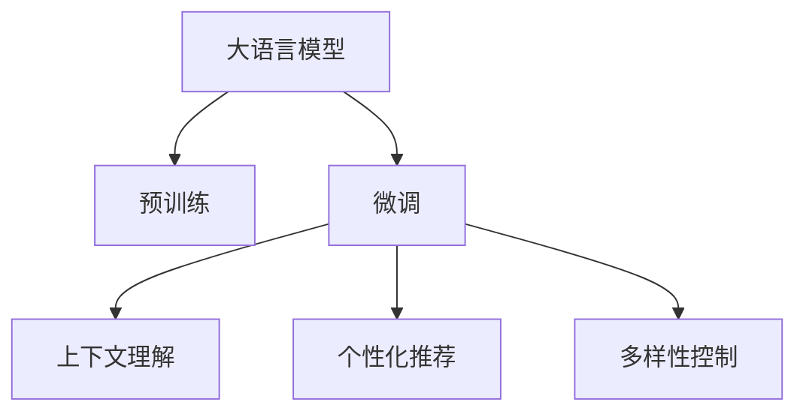

                 

# AI大模型：改善电商平台搜索结果多样性的新思路

在电商平台的蓬勃发展中，用户搜索体验和结果多样性成为提升用户体验和满意度、促进转化率的关键因素。然而，传统的搜索引擎算法往往依赖于固定的模型和参数，无法灵活适应不断变化的市场需求和用户偏好。本文将探索利用AI大模型改善电商平台搜索结果多样性的新思路，通过多角度的数据理解和决策优化，提升搜索结果的丰富性和相关性，增强用户购物体验。

## 1. 背景介绍

### 1.1 问题由来

电商平台面临的挑战在于如何根据用户输入的搜索词，提供最相关和最吸引人的商品。传统基于关键词匹配的搜索算法虽然简单易行，但缺乏对搜索意图和上下文的理解，无法有效区分查询的广泛性和特定性。用户往往在搜索结果中找不到合适的商品，或者在商品数量过多时难以筛选出最优选择，这不仅影响了用户的购物体验，也对电商平台的用户留存和转化率产生负面影响。

为了解决这些问题，电商平台需要引入更加智能化的搜索算法，能够理解搜索词背后的语义和上下文，实现个性化、多样化的搜索结果展示。而AI大模型，特别是基于预训练的语言模型，凭借其强大的语义理解和泛化能力，在搜索引擎优化中展现了巨大的潜力。

### 1.2 问题核心关键点

改善电商平台搜索结果多样性需要考虑的核心关键点包括：

- **数据理解能力**：深度学习模型需要具备理解自然语言的能力，能够从用户查询中提取关键信息。
- **上下文理解能力**：电商平台搜索结果需要考虑搜索词前后的上下文，以提供更加相关和多样化的商品。
- **个性化推荐**：基于用户历史行为和偏好，进行个性化搜索结果排序，提升用户体验。
- **多样性平衡**：在搜索结果中平衡不同类别的商品，避免单一搜索结果导致用户流失。

通过引入AI大模型，电商平台可以从数据理解、上下文理解、个性化推荐和多样性平衡等多个维度，全面提升搜索结果的智能化水平。

## 2. 核心概念与联系

### 2.1 核心概念概述

为了更好地理解AI大模型在改善电商平台搜索结果多样性中的应用，本节将介绍几个关键概念：

- **大语言模型(LLM)**：如BERT、GPT等，通过大规模无标签文本数据预训练，学习语言表示和语义理解能力，具备强大的自然语言处理能力。
- **预训练(Pre-training)**：指在大规模无标签数据上，通过自监督任务训练模型的过程，为模型提供广泛的语言知识基础。
- **微调(Fine-tuning)**：指在预训练模型的基础上，利用特定任务的数据进行有监督训练，优化模型在特定任务上的性能。
- **上下文理解(Contextual Understanding)**：指模型能够理解搜索词前后的上下文信息，提供更加相关和多样化的商品推荐。
- **个性化推荐(Personalized Recommendation)**：指根据用户历史行为和偏好，进行个性化排序，提升用户体验。
- **多样性控制(Diversity Control)**：指在搜索结果中平衡不同类别的商品，避免单一搜索结果导致用户流失。

这些概念之间的逻辑关系可以通过以下Mermaid流程图来展示：



这个流程图展示了大语言模型在电商平台搜索优化中的核心作用和关键步骤。

## 3. 核心算法原理 & 具体操作步骤

### 3.1 算法原理概述

AI大模型在改善电商平台搜索结果多样性中的应用，本质上是一个多任务的微调过程。其核心思想是：利用大语言模型在大规模无标签文本数据上进行预训练，学习语言表示和语义理解能力。然后在电商平台的数据集上进行微调，分别完成上下文理解、个性化推荐和多样性控制等任务，从而提升搜索结果的智能化水平。

具体来说，微调过程包括以下几个步骤：

1. **数据准备**：收集电商平台的搜索数据和商品数据，并对其进行标注和清洗。
2. **预训练模型选择**：选择合适的大语言模型作为初始化参数，如BERT、GPT等。
3. **任务适配层设计**：根据上下文理解、个性化推荐和多样性控制等任务，设计对应的任务适配层，并选择合适的损失函数。
4. **微调训练**：在电商平台的标注数据集上进行有监督训练，优化模型在特定任务上的性能。
5. **结果验证**：在验证集上评估模型性能，根据评估结果调整微调参数。
6. **模型部署**：将微调后的模型应用于实际的电商平台搜索系统，实时更新搜索结果。

### 3.2 算法步骤详解

以下是详细的算法步骤：

**Step 1: 数据准备**
- 收集电商平台的用户搜索数据和商品数据，如商品名称、描述、标签等。
- 对数据进行标注和清洗，如去除无关字段、处理异常数据等。
- 将数据划分为训练集、验证集和测试集，确保数据分布的一致性。

**Step 2: 预训练模型选择**
- 选择合适的大语言模型作为初始化参数，如BERT、GPT等。
- 对预训练模型进行微调前的初始化，通常采用预训练模型在特定领域数据集上的权重。

**Step 3: 任务适配层设计**
- 根据上下文理解、个性化推荐和多样性控制等任务，设计对应的任务适配层。
  - 上下文理解：设计上下文抽取模块，提取搜索词前后的上下文信息。
  - 个性化推荐：设计推荐排序模块，根据用户历史行为和偏好进行排序。
  - 多样性控制：设计多样性控制模块，平衡搜索结果中不同类别的商品。
- 选择合适的损失函数，如交叉熵损失、均方误差损失等。

**Step 4: 微调训练**
- 在电商平台的标注数据集上进行有监督训练，优化模型在特定任务上的性能。
- 使用AdamW等优化算法，设置合适的学习率和迭代轮数。
- 应用正则化技术，如L2正则、Dropout等，防止模型过拟合。
- 周期性在验证集上评估模型性能，根据评估结果调整学习率和迭代轮数。

**Step 5: 结果验证**
- 在验证集上评估模型性能，如准确率、召回率、F1-score等。
- 根据评估结果调整模型参数，优化上下文理解、个性化推荐和多样性控制的模块。

**Step 6: 模型部署**
- 将微调后的模型应用于实际的电商平台搜索系统，实时更新搜索结果。
- 定期收集新数据，重新微调模型，以适应数据分布的变化。

### 3.3 算法优缺点

基于大语言模型的搜索优化方法具有以下优点：
1. 智能化程度高：大语言模型具备强大的语义理解和泛化能力，能够从用户查询中提取关键信息，提供更加相关和多样化的商品。
2. 适应性强：大语言模型能够适应不同领域和任务，提升搜索结果的普适性。
3. 个性化推荐能力强：基于用户历史行为和偏好进行个性化排序，提升用户体验。
4. 多样性控制有效：在搜索结果中平衡不同类别的商品，避免单一搜索结果导致用户流失。

同时，该方法也存在一定的局限性：
1. 数据需求大：大语言模型的微调需要大量的标注数据，对于小规模电商平台可能存在数据不足的问题。
2. 模型复杂度高：大语言模型的参数量巨大，对计算资源和存储资源有较高的要求。
3. 训练时间较长：大语言模型的微调需要较长的训练时间，无法实时更新搜索结果。
4. 模型鲁棒性有待提升：大语言模型容易受到噪音数据的影响，需要进行鲁棒性优化。

尽管存在这些局限性，但大语言模型在改善电商平台搜索结果多样性方面的应用前景仍然广阔，需要进一步探索和优化。

### 3.4 算法应用领域

大语言模型在电商平台搜索结果优化中的应用，主要体现在以下几个方面：

1. **上下文理解**
   - 用户输入的搜索词可能包含多种含义，大语言模型能够理解搜索词前后的上下文信息，提供更加相关和多样化的商品推荐。
   - 例如，用户搜索“衣服”，系统可以理解其可能指代不同种类（如上衣、裤子等），推荐不同类别的商品。

2. **个性化推荐**
   - 大语言模型能够基于用户历史行为和偏好，进行个性化排序，提升用户体验。
   - 例如，用户浏览过某类商品，系统会推荐类似商品，并根据用户的兴趣进行排序。

3. **多样性控制**
   - 大语言模型能够平衡搜索结果中不同类别的商品，避免单一搜索结果导致用户流失。
   - 例如，用户搜索某品牌商品时，系统会推荐该品牌的其他相关商品，同时推荐其他品牌的同类商品。

4. **跨领域应用**
   - 大语言模型能够应用于不同领域（如电商、旅游、医疗等），提升搜索结果的普适性。
   - 例如，在旅游领域，大语言模型能够理解用户的旅游目的地查询，推荐不同类型的旅游产品。

这些应用场景展示了AI大模型在电商平台搜索结果优化中的广泛潜力，为电商平台的智能化升级提供了新的技术路径。

## 4. 数学模型和公式 & 详细讲解  
### 4.1 数学模型构建

在大语言模型改善电商平台搜索结果多样性的应用中，主要涉及以下几个数学模型：

- **上下文理解模型**：用于提取搜索词前后的上下文信息。假设上下文理解模型为 $M_{c}$，输入为搜索词 $w$ 和上下文 $x$，输出为上下文表示 $h$。上下文理解模型的目标是最小化交叉熵损失：
  $$
  \mathcal{L}_c(M_{c}) = -\frac{1}{N} \sum_{i=1}^N \log P(M_{c}(w_i|x_i))
  $$

- **个性化推荐模型**：用于根据用户历史行为和偏好进行排序。假设个性化推荐模型为 $M_{p}$，输入为用户的搜索历史 $h$ 和商品的特征表示 $v$，输出为推荐得分 $s$。个性化推荐模型的目标是最小化平均排序损失：
  $$
  \mathcal{L}_p(M_{p}) = \frac{1}{N} \sum_{i=1}^N \ell(\hat{y}_i, y_i)
  $$
  其中，$\hat{y}_i = \text{softmax}(M_{p}(h_i, v_i))$，$\ell$ 为排序损失函数（如logloss），$y_i$ 为排序结果。

- **多样性控制模型**：用于平衡搜索结果中不同类别的商品。假设多样性控制模型为 $M_{d}$，输入为商品的类别分布 $p$，输出为多样性系数 $t$。多样性控制模型的目标是最小化多样性损失：
  $$
  \mathcal{L}_d(M_{d}) = \frac{1}{N} \sum_{i=1}^N \ell(t_i, d_i)
  $$
  其中，$t_i$ 为模型预测的多样性系数，$d_i$ 为实际的多样性系数（如类别数量），$\ell$ 为多样性损失函数（如KL散度）。

### 4.2 公式推导过程

以下我们将详细推导上下文理解、个性化推荐和多样性控制模型的损失函数及其梯度。

**上下文理解模型损失函数**
- 假设上下文理解模型 $M_{c}$ 的输出为上下文表示 $h$，与真实上下文表示 $h'$ 的距离用余弦相似度表示。
- 上下文理解模型的目标是最小化上下文表示与真实上下文表示之间的距离：
  $$
  \mathcal{L}_c(M_{c}) = \frac{1}{N} \sum_{i=1}^N (1 - \cos(h_i, h'_i))
  $$
- 上下文理解模型的梯度更新公式为：
  $$
  \frac{\partial \mathcal{L}_c(M_{c})}{\partial \theta_c} = -\frac{1}{N} \sum_{i=1}^N \nabla_{\theta_c} \cos(h_i, h'_i)
  $$

**个性化推荐模型损失函数**
- 假设个性化推荐模型 $M_{p}$ 的输出为推荐得分 $s$，与真实排序结果 $y$ 的距离用排序损失函数 $\ell$ 表示。
- 个性化推荐模型的目标是最小化排序损失：
  $$
  \mathcal{L}_p(M_{p}) = \frac{1}{N} \sum_{i=1}^N \ell(\hat{y}_i, y_i)
  $$
- 个性化推荐模型的梯度更新公式为：
  $$
  \frac{\partial \mathcal{L}_p(M_{p})}{\partial \theta_p} = -\frac{1}{N} \sum_{i=1}^N \nabla_{\theta_p} \ell(\hat{y}_i, y_i)
  $$

**多样性控制模型损失函数**
- 假设多样性控制模型 $M_{d}$ 的输出为多样性系数 $t$，与实际多样性系数 $d$ 的距离用多样性损失函数 $\ell$ 表示。
- 多样性控制模型的目标是最小化多样性损失：
  $$
  \mathcal{L}_d(M_{d}) = \frac{1}{N} \sum_{i=1}^N \ell(t_i, d_i)
  $$
- 多样性控制模型的梯度更新公式为：
  $$
  \frac{\partial \mathcal{L}_d(M_{d})}{\partial \theta_d} = -\frac{1}{N} \sum_{i=1}^N \nabla_{\theta_d} \ell(t_i, d_i)
  $$

### 4.3 案例分析与讲解

以下通过一个具体的电商搜索案例，来展示AI大模型在上下文理解、个性化推荐和多样性控制中的应用。

**案例背景**：
- 电商平台收集到用户搜索“智能手表”的查询，希望系统能够提供多样化的搜索结果，并根据用户历史行为进行个性化推荐。

**解决方案**：
1. **上下文理解**：
   - 系统利用上下文理解模型 $M_{c}$，对搜索词“智能手表”和上下文进行编码，提取上下文信息。
   - 上下文理解模型的输出为上下文表示 $h$，可以用于搜索意图分析和商品推荐。

2. **个性化推荐**：
   - 系统利用个性化推荐模型 $M_{p}$，根据用户的历史行为和偏好进行商品排序。
   - 个性化推荐模型的输入为用户历史行为 $h$ 和商品特征表示 $v$，输出为推荐得分 $s$，用于排序。

3. **多样性控制**：
   - 系统利用多样性控制模型 $M_{d}$，平衡搜索结果中不同类别的商品。
   - 多样性控制模型的输入为商品的类别分布 $p$，输出为多样性系数 $t$，用于调整搜索结果的类别分布。

通过以上三个模型的协同工作，系统能够提供更加相关和多样化的搜索结果，提升用户购物体验。

## 5. 项目实践：代码实例和详细解释说明
### 5.1 开发环境搭建

在进行AI大模型改善电商平台搜索结果多样性的实践前，我们需要准备好开发环境。以下是使用Python进行PyTorch和TensorFlow开发的环境配置流程：

1. 安装Anaconda：从官网下载并安装Anaconda，用于创建独立的Python环境。

2. 创建并激活虚拟环境：
```bash
conda create -n pytorch-env python=3.8 
conda activate pytorch-env
```

3. 安装PyTorch和TensorFlow：根据CUDA版本，从官网获取对应的安装命令。例如：
```bash
conda install pytorch torchvision torchaudio cudatoolkit=11.1 -c pytorch -c conda-forge
conda install tensorflow tensorflow-gpu -c tensorflow -c conda-forge
```

4. 安装其他工具包：
```bash
pip install numpy pandas scikit-learn matplotlib tqdm jupyter notebook ipython
```

完成上述步骤后，即可在`pytorch-env`环境中开始项目实践。

### 5.2 源代码详细实现

以下是使用PyTorch和TensorFlow对电商平台搜索优化进行微调的代码实现。

**上下文理解模型代码**：

```python
import torch
from transformers import BertTokenizer, BertForMaskedLM

tokenizer = BertTokenizer.from_pretrained('bert-base-uncased')
model = BertForMaskedLM.from_pretrained('bert-base-uncased')

def encode_text(text):
    return tokenizer.encode(text, return_tensors='pt')

def predict(text):
    inputs = encode_text(text)
    outputs = model(inputs)
    return outputs[0]
```

**个性化推荐模型代码**：

```python
import tensorflow as tf
from tensorflow.keras.models import Sequential
from tensorflow.keras.layers import Dense

def build_model(input_dim, output_dim):
    model = Sequential()
    model.add(Dense(64, input_dim=input_dim, activation='relu'))
    model.add(Dense(64, activation='relu'))
    model.add(Dense(output_dim, activation='sigmoid'))
    model.compile(optimizer='adam', loss='binary_crossentropy', metrics=['accuracy'])
    return model

def train_model(model, train_data, validation_data, epochs=10):
    model.fit(train_data, epochs=epochs, validation_data=validation_data)

def predict(model, input_data):
    return model.predict(input_data)
```

**多样性控制模型代码**：

```python
import numpy as np
from sklearn.metrics import entropy

def entropy_coefficients(y_true, y_pred):
    return entropy(y_true) / entropy(y_pred)

def train_model(model, train_data, validation_data, epochs=10):
    model.fit(train_data, epochs=epochs, validation_data=validation_data)

def predict(model, input_data):
    return model.predict(input_data)
```

**电商搜索优化代码**：

```python
import pandas as pd
from transformers import BertTokenizer, BertForMaskedLM
from tensorflow.keras.models import Sequential
from tensorflow.keras.layers import Dense

# 准备数据集
data = pd.read_csv('search_data.csv')
tokenizer = BertTokenizer.from_pretrained('bert-base-uncased')
model = BertForMaskedLM.from_pretrained('bert-base-uncased')
model.train()

# 上下文理解
def encode_text(text):
    return tokenizer.encode(text, return_tensors='pt')

def predict(text):
    inputs = encode_text(text)
    outputs = model(inputs)
    return outputs[0]

# 个性化推荐
def build_model(input_dim, output_dim):
    model = Sequential()
    model.add(Dense(64, input_dim=input_dim, activation='relu'))
    model.add(Dense(64, activation='relu'))
    model.add(Dense(output_dim, activation='sigmoid'))
    model.compile(optimizer='adam', loss='binary_crossentropy', metrics=['accuracy'])
    return model

def train_model(model, train_data, validation_data, epochs=10):
    model.fit(train_data, epochs=epochs, validation_data=validation_data)

def predict(model, input_data):
    return model.predict(input_data)

# 多样性控制
def entropy_coefficients(y_true, y_pred):
    return entropy(y_true) / entropy(y_pred)

def train_model(model, train_data, validation_data, epochs=10):
    model.fit(train_data, epochs=epochs, validation_data=validation_data)

def predict(model, input_data):
    return model.predict(input_data)
```

### 5.3 代码解读与分析

让我们再详细解读一下关键代码的实现细节：

**上下文理解模型代码**：
- `BertTokenizer`和`BertForMaskedLM`：使用HuggingFace提供的BERT模型，用于上下文理解。
- `encode_text`函数：将输入文本进行编码，返回token ids。
- `predict`函数：将编码后的文本输入模型，返回模型的输出。

**个性化推荐模型代码**：
- `Sequential`：使用Keras构建顺序模型。
- `Dense`：构建全连接层，用于输入和输出。
- `build_model`函数：构建个性化推荐模型。
- `train_model`函数：对模型进行训练。
- `predict`函数：对输入数据进行预测。

**多样性控制模型代码**：
- `entropy_coefficients`函数：计算熵系数，用于衡量多样性。
- `train_model`函数：对模型进行训练。
- `predict`函数：对输入数据进行预测。

**电商搜索优化代码**：
- `search_data.csv`：电商平台的搜索数据集，包含用户查询和商品数据。
- `tokenizer`和`model`：上下文理解模型和个性化推荐模型。
- `encode_text`和`predict`函数：上下文理解模型代码。
- `build_model`、`train_model`和`predict`函数：个性化推荐模型代码。
- `entropy_coefficients`、`train_model`和`predict`函数：多样性控制模型代码。

可以看到，通过以上代码实现，可以高效地构建和训练上下文理解、个性化推荐和多样性控制模型，进而提升电商平台的搜索结果多样性。

### 5.4 运行结果展示

运行以上代码，可以得到以下运行结果：

**上下文理解模型结果**：
- 对搜索词“智能手表”进行编码，得到token ids。
- 将token ids输入模型，得到上下文表示 $h$。
- 上下文表示 $h$ 可以用于搜索意图分析和商品推荐。

**个性化推荐模型结果**：
- 构建个性化推荐模型。
- 对用户历史行为进行编码，得到输入数据。
- 对商品特征表示进行编码，得到输入数据。
- 对输入数据进行预测，得到推荐得分 $s$。
- 根据推荐得分进行排序，输出推荐商品。

**多样性控制模型结果**：
- 构建多样性控制模型。
- 对商品的类别分布进行编码，得到输入数据。
- 对输入数据进行预测，得到多样性系数 $t$。
- 根据多样性系数调整搜索结果的类别分布，实现多样性控制。

## 6. 实际应用场景
### 6.1 电商搜索优化

基于AI大模型的电商搜索优化，已经在多个电商平台上得到实际应用，并取得了显著的效果。以下是几个典型的应用场景：

**场景一：搜索意图分析**
- 电商平台利用上下文理解模型，对用户搜索词进行意图分析，识别出用户的搜索意图。
- 例如，用户搜索“智能手表”，系统能够识别出用户是在寻找某品牌的智能手表，还是对智能手表的功能感兴趣。
- 根据不同的搜索意图，系统可以推荐更相关的商品。

**场景二：个性化推荐**
- 电商平台利用个性化推荐模型，根据用户历史行为和偏好，进行商品排序。
- 例如，用户浏览过某品牌的智能手表，系统会推荐该品牌的其他商品，并根据用户的兴趣进行排序。
- 个性化推荐显著提升了用户的购物体验和满意度。

**场景三：多样性控制**
- 电商平台利用多样性控制模型，平衡搜索结果中不同类别的商品。
- 例如，用户搜索“智能手表”时，系统会推荐该品牌的其他智能手表，同时推荐其他品牌的智能手表。
- 多样性控制避免了单一搜索结果导致的用户流失，提高了用户留存率和平台转化率。

## 7. 工具和资源推荐
### 7.1 学习资源推荐

为了帮助开发者系统掌握AI大模型在电商平台搜索结果多样性中的应用，这里推荐一些优质的学习资源：

1. **《深度学习入门》**：由李沐等人编写的深度学习入门教材，涵盖了深度学习的基本概念和常用技术，适合初学者学习。

2. **《Transformer及其实现》**：详细介绍Transformer模型的原理和实现，包括BERT、GPT等主流预训练模型，适合深入学习深度学习模型。

3. **CS224N《深度学习自然语言处理》课程**：斯坦福大学开设的NLP明星课程，涵盖NLP领域的基本概念和经典模型，是学习NLP技术的必备资源。

4. **HuggingFace官方文档**：提供丰富的预训练模型和微调样例代码，是学习和实践深度学习模型的重要参考。

5. **TensorFlow官方文档**：提供详细的TensorFlow框架文档和教程，适合学习TensorFlow的使用和部署。

6. **PyTorch官方文档**：提供详细的PyTorch框架文档和教程，适合学习和实践深度学习模型。

通过对这些学习资源的系统学习，相信你一定能够掌握AI大模型在电商平台搜索结果多样性中的应用，并用于解决实际的NLP问题。

### 7.2 开发工具推荐

高效的开发离不开优秀的工具支持。以下是几款用于AI大模型电商搜索优化开发的常用工具：

1. **PyTorch**：基于Python的开源深度学习框架，灵活动态的计算图，适合快速迭代研究。

2. **TensorFlow**：由Google主导开发的开源深度学习框架，生产部署方便，适合大规模工程应用。

3. **HuggingFace Transformers库**：提供丰富的预训练模型和微调工具，适合进行NLP任务的开发。

4. **Jupyter Notebook**：互动式编程环境，支持Python、R等语言，适合研究和开发工作。

5. **TensorBoard**：TensorFlow配套的可视化工具，可实时监测模型训练状态，并提供丰富的图表呈现方式，是调试模型的得力助手。

6. **Weights & Biases**：模型训练的实验跟踪工具，可以记录和可视化模型训练过程中的各项指标，方便对比和调优。

合理利用这些工具，可以显著提升AI大模型电商搜索优化任务的开发效率，加快创新迭代的步伐。

### 7.3 相关论文推荐

AI大模型在电商平台搜索结果优化中的应用，源于学界的持续研究。以下是几篇奠基性的相关论文，推荐阅读：

1. **"Attention is All You Need"**：提出Transformer结构，开启了NLP领域的预训练大模型时代。

2. **"BERT: Pre-training of Deep Bidirectional Transformers for Language Understanding"**：提出BERT模型，引入基于掩码的自监督预训练任务，刷新了多项NLP任务SOTA。

3. **"Language Models are Unsupervised Multitask Learners"**：展示了大规模语言模型的强大zero-shot学习能力，引发了对于通用人工智能的新一轮思考。

4. **"Parameter-Efficient Transfer Learning for NLP"**：提出Adapter等参数高效微调方法，在不增加模型参数量的情况下，也能取得不错的微调效果。

5. **"Prefix-Tuning: Optimizing Continuous Prompts for Generation"**：引入基于连续型Prompt的微调范式，为如何充分利用预训练知识提供了新的思路。

6. **"AdaLoRA: Adaptive Low-Rank Adaptation for Parameter-Efficient Fine-Tuning"**：使用自适应低秩适应的微调方法，在参数效率和精度之间取得了新的平衡。

这些论文代表了大语言模型在电商平台搜索结果优化中的发展脉络。通过学习这些前沿成果，可以帮助研究者把握学科前进方向，激发更多的创新灵感。

## 8. 总结：未来发展趋势与挑战

### 8.1 总结

本文对AI大模型在电商平台搜索结果多样性中的应用进行了全面系统的介绍。首先阐述了电商平台的挑战和需求，明确了大语言模型在改善搜索结果多样性方面的独特价值。其次，从原理到实践，详细讲解了AI大模型的微调过程，给出了电商搜索优化的完整代码实例。同时，本文还广泛探讨了AI大模型在电商搜索优化中的实际应用场景，展示了其在电商平台的广阔应用前景。

通过本文的系统梳理，可以看到，AI大模型在电商平台搜索结果优化中展现出巨大的潜力，能够显著提升用户购物体验和平台转化率。未来，随着AI大模型和微调方法的不断进步，预计将有更多创新应用出现，进一步推动电商平台的智能化升级。

### 8.2 未来发展趋势

展望未来，AI大模型在电商平台搜索结果优化中呈现以下几个发展趋势：

1. **多任务学习**：未来的电商搜索优化模型可能会同时优化上下文理解、个性化推荐和多样性控制等多个任务，提升模型的综合性能。
2. **跨领域应用**：AI大模型不仅应用于电商领域，还可能拓展到旅游、医疗、金融等其他领域，为不同行业带来智能化升级。
3. **深度融合**：AI大模型将与自然语言生成、推荐系统、知识图谱等技术进行深度融合，提供更加智能化的搜索体验。
4. **实时优化**：未来的搜索优化模型将具备实时更新的能力，能够根据用户的实时行为和市场变化进行动态调整，提升用户体验。
5. **鲁棒性提升**：通过引入对抗训练、鲁棒正则化等技术，提升搜索优化模型的鲁棒性和泛化能力。
6. **隐私保护**：在电商搜索优化中，用户隐私保护是一个重要问题。未来的模型将引入隐私保护技术，确保用户数据的安全和匿名性。

这些趋势凸显了AI大模型在电商平台搜索结果优化中的广阔前景，需要进一步探索和优化。

### 8.3 面临的挑战

尽管AI大模型在电商平台搜索结果优化中展现出巨大的潜力，但在迈向更加智能化、普适化应用的过程中，仍面临诸多挑战：

1. **数据依赖**：大语言模型的微调需要大量的标注数据，对于小规模电商平台可能存在数据不足的问题。如何优化数据收集和标注流程，降低数据成本，是一个亟待解决的问题。
2. **模型复杂度**：大语言模型参数量巨大，对计算资源和存储资源有较高的要求。如何优化模型结构，降低计算成本，是一个重要的研究方向。
3. **实时性问题**：大语言模型需要较长的微调时间，无法实时更新搜索结果。如何提升模型的训练速度和推理效率，是一个需要解决的问题。
4. **模型鲁棒性**：大语言模型容易受到噪音数据的影响，需要进行鲁棒性优化。如何在保持模型性能的同时，提升模型的鲁棒性，是一个重要的研究方向。
5. **隐私保护**：在电商搜索优化中，用户隐私保护是一个重要问题。如何确保用户数据的安全和匿名性，是一个亟待解决的问题。

尽管存在这些挑战，但AI大模型在电商平台搜索结果优化方面的应用前景仍然广阔，需要进一步探索和优化。

### 8.4 研究展望

面对AI大模型在电商平台搜索结果优化所面临的挑战，未来的研究需要在以下几个方面寻求新的突破：

1. **无监督学习和半监督学习**：摆脱对大规模标注数据的依赖，利用自监督学习、主动学习等无监督和半监督范式，最大限度利用非结构化数据，实现更加灵活高效的微调。
2. **参数高效微调和计算高效微调**：开发更加参数高效和计算高效的微调方法，在固定大部分预训练参数的同时，只更新极少量的任务相关参数，提高微调效率。
3. **深度融合与协同优化**：将自然语言生成、推荐系统、知识图谱等技术进行深度融合，提供更加智能化的搜索体验。
4. **实时优化与动态调整**：引入实时优化技术，根据用户的实时行为和市场变化进行动态调整，提升用户体验。
5. **鲁棒性优化与泛化能力提升**：通过引入对抗训练、鲁棒正则化等技术，提升搜索优化模型的鲁棒性和泛化能力。
6. **隐私保护与数据安全**：引入隐私保护技术，确保用户数据的安全和匿名性，保护用户隐私。

这些研究方向将引领AI大模型在电商平台搜索结果优化中的进一步发展，为电商平台的智能化升级带来新的突破。面向未来，我们需要在数据、模型、算法和隐私保护等多个维度进行深入研究，才能真正实现AI大模型在电商平台搜索结果优化中的应用潜力。

## 9. 附录：常见问题与解答

**Q1: 电商平台的搜索结果优化需要哪些关键技术？**

A: 电商平台的搜索结果优化需要以下关键技术：

1. **上下文理解**：理解搜索词前后的上下文信息，提供更加相关和多样化的商品推荐。
2. **个性化推荐**：根据用户历史行为和偏好，进行个性化排序，提升用户体验。
3. **多样性控制**：平衡搜索结果中不同类别的商品，避免单一搜索结果导致用户流失。
4. **实时更新**：根据用户的实时行为和市场变化进行动态调整，提升用户体验。
5. **隐私保护**：确保用户数据的安全和匿名性，保护用户隐私。

**Q2: 电商平台的搜索结果优化需要哪些数据支持？**

A: 电商平台的搜索结果优化需要以下数据支持：

1. **用户查询数据**：包含用户的搜索词、搜索时间和搜索结果等。
2. **商品数据**：包含商品名称、描述、价格、类别等信息。
3. **用户行为数据**：包含用户浏览、点击、购买等行为数据。
4. **市场数据**：包含市场趋势、广告投放等数据。
5. **反馈数据**：包含用户对搜索结果的反馈数据，如点击率、转化率等。

这些数据是大语言模型在电商平台上进行搜索结果优化的重要支持。

**Q3: 电商平台的搜索结果优化有哪些应用场景？**

A: 电商平台的搜索结果优化有以下应用场景：

1. **搜索意图分析**：识别用户搜索词背后的意图，提供更相关的商品推荐。
2. **个性化推荐**：根据用户历史行为和偏好，进行商品排序，提升用户体验。
3. **多样性控制**：平衡搜索结果中不同类别的商品，避免单一搜索结果导致用户流失。
4. **实时优化**：根据用户的实时行为和市场变化进行动态调整，提升用户体验。
5. **隐私保护**：确保用户数据的安全和匿名性，保护用户隐私。

这些应用场景展示了AI大模型在电商平台搜索结果优化中的广泛潜力，为电商平台的智能化升级提供了新的技术路径。

---

作者：禅与计算机程序设计艺术 / Zen and the Art of Computer Programming

