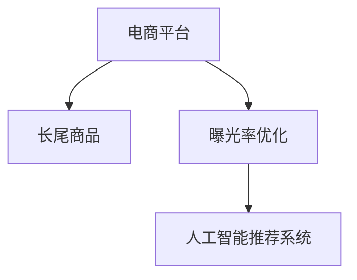

                 

# AI如何优化电商平台的长尾商品曝光

> 关键词：电商平台、长尾商品、曝光优化、人工智能、推荐系统、自然语言处理、图像识别、流量提升、转化率优化

## 1. 背景介绍

### 1.1 问题由来

随着电子商务平台的蓬勃发展，商家在平台上发布的商品数量日益增多，其中不乏一些非热门、销量较低的长尾商品。虽然这些商品总体上对平台的总销售额贡献较小，但它们往往具有较高的利润率，是电商平台利润的重要来源。然而，由于受到各种因素的影响，长尾商品的曝光率较低，用户很难发现这些商品，从而影响了其销售。因此，如何通过技术手段提升长尾商品的曝光率，成为一个亟待解决的问题。

### 1.2 问题核心关键点

- 长尾商品定义：指那些销量低、市场需求小、但多样性丰富、利润率高的商品。
- 曝光率：商品在用户面前出现的频率，直接影响用户的购买决策。
- 优化目标：通过人工智能技术，提升长尾商品的曝光率，增加销量，提升平台整体利润。
- 挑战：长尾商品数量庞大，用户需求复杂多样，市场竞争激烈，传统推荐系统难以全面覆盖。

## 2. 核心概念与联系

### 2.1 核心概念概述

要解决这个问题，需要从以下几个核心概念入手：

- 电商平台：指利用互联网进行商品交易的平台，如淘宝、京东、亚马逊等。
- 长尾商品：指那些销量低、但种类繁多、利润率高的商品，通常与热门商品相比被忽视。
- 曝光率优化：通过技术手段提升长尾商品在用户面前出现的频率，增加销售量。
- 人工智能推荐系统：利用机器学习、深度学习等技术，根据用户行为和商品特征进行智能推荐，提高用户体验和平台收益。

这些概念之间的联系可以通过以下Mermaid流程图来展示：



这个流程图展示了核心概念之间的关系：

1. 电商平台是长尾商品曝光优化的主体。
2. 人工智能推荐系统是曝光优化的技术手段。
3. 通过优化，长尾商品的销量和平台整体利润将得到提升。

## 3. 核心算法原理 & 具体操作步骤
### 3.1 算法原理概述

基于人工智能的电商平台长尾商品曝光优化，主要依赖于推荐系统技术。推荐系统的核心思想是通过用户历史行为和商品属性特征，预测用户对商品可能产生的兴趣，从而提升商品曝光率。其基本流程包括：

1. 数据收集：收集用户历史行为数据、商品属性数据等，形成训练数据集。
2. 模型训练：使用机器学习算法或深度学习模型，训练推荐模型。
3. 推荐输出：根据用户输入和推荐模型，生成推荐结果，输出商品信息。
4. 效果评估：评估推荐效果，不断调整优化模型参数。

### 3.2 算法步骤详解

以下是基于人工智能推荐系统的电商平台长尾商品曝光优化的详细步骤：

**Step 1: 数据收集**

- 用户行为数据：如浏览记录、点击记录、购买记录等，反映用户对商品的兴趣。
- 商品属性数据：如价格、类别、描述、图片等，反映商品的基本特征。
- 互动数据：如评论、评分等，反映用户对商品的评价和反馈。

**Step 2: 数据预处理**

- 清洗数据：去除重复数据、异常数据和噪声数据，确保数据质量。
- 特征工程：提取、构建有意义的特征，如用户年龄、性别、浏览时长等。
- 数据划分：将数据划分为训练集、验证集和测试集。

**Step 3: 模型训练**

- 选择模型：根据问题特点选择适合的模型，如协同过滤、矩阵分解、深度学习等。
- 训练模型：在训练集上训练模型，调整模型参数。
- 交叉验证：在验证集上评估模型效果，避免过拟合。

**Step 4: 推荐输出**

- 生成推荐：根据用户输入和模型，生成推荐结果。
- 用户交互：展示推荐商品给用户，观察用户反馈。
- 动态调整：根据用户反馈，实时调整推荐模型，优化推荐效果。

**Step 5: 效果评估**

- 评估指标：如点击率、转化率、覆盖率等，评估推荐效果。
- 数据可视化：通过图表展示推荐效果，找出问题所在。
- 持续优化：根据评估结果，不断优化模型和算法。

### 3.3 算法优缺点

基于人工智能推荐系统的长尾商品曝光优化有以下优点：

1. 数据驱动：通过大量用户行为和商品属性数据，能够精准预测用户兴趣。
2. 灵活性高：能够快速适应市场变化，调整推荐策略。
3. 效果显著：通过优化曝光率，能够显著提升长尾商品销量。

同时，也存在一些缺点：

1. 数据质量要求高：用户行为和商品属性数据的完整性和准确性直接影响推荐效果。
2. 算法复杂度高：需要大量计算资源进行模型训练和推荐计算。
3. 用户隐私问题：需要处理大量的用户隐私数据，可能面临数据泄露和隐私保护的风险。

### 3.4 算法应用领域

基于人工智能推荐系统的长尾商品曝光优化技术，已经广泛应用于多个电商平台，如淘宝、亚马逊、京东等。通过优化曝光率，电商平台能够显著提升长尾商品的销量，增加整体利润。

在具体应用中，推荐系统还被用于智能客服、个性化推荐、广告投放等多个场景，提升了用户体验和平台效率。

## 4. 数学模型和公式 & 详细讲解 & 举例说明
### 4.1 数学模型构建

本节将使用数学语言对基于人工智能推荐系统的长尾商品曝光优化进行更加严格的刻画。

设电商平台上的用户集合为 $U$，商品集合为 $I$，每个用户 $u$ 对商品 $i$ 的评分表示为 $r_{ui}$，用户与商品之间的互动特征集合为 $\mathcal{F}$。

模型的目标是最大化用户-商品交互的预测准确度，即最大化：

$$
\max_{\theta} \frac{1}{|U|} \sum_{u \in U} \sum_{i \in I} r_{ui} \log \sigma(\theta^\top \phi(u,i))
$$

其中 $\sigma$ 为激活函数，$\phi(u,i)$ 为特征映射函数，$\theta$ 为模型参数。

### 4.2 公式推导过程

设 $u$ 和 $i$ 的特征向量分别为 $\mathbf{u}$ 和 $\mathbf{i}$，模型参数为 $\theta$。则预测用户 $u$ 对商品 $i$ 的评分 $r_{ui}$ 为：

$$
\hat{r}_{ui} = \theta^\top \phi(u,i)
$$

其中 $\phi(u,i) = (\mathbf{u}, \mathbf{i}) \in \mathbb{R}^d$，$d$ 为特征向量的维度。

模型的训练过程采用监督学习，目标函数为：

$$
\min_{\theta} \frac{1}{2|U|} \sum_{u \in U} \sum_{i \in I} (r_{ui} - \hat{r}_{ui})^2
$$

通过梯度下降等优化算法，不断更新模型参数 $\theta$，最小化损失函数，得到最优参数 $\theta^*$。

### 4.3 案例分析与讲解

以协同过滤算法为例，解释推荐系统的基本工作原理。

协同过滤算法通过用户行为数据计算用户和商品之间的相似度，从而预测用户对未交互商品的评分。具体步骤如下：

1. 计算用户相似度：根据用户的历史评分数据，计算用户间的相似度矩阵 $S \in \mathbb{R}^{n \times n}$，其中 $n$ 为用户数。
2. 计算商品相似度：根据商品的历史评分数据，计算商品间的相似度矩阵 $G \in \mathbb{R}^{m \times m}$，其中 $m$ 为商品数。
3. 预测用户评分：根据用户相似度和商品相似度，预测用户对商品的评分：$\hat{r}_{ui} = \sum_j S_{uj} G_{ij}$。

## 5. 项目实践：代码实例和详细解释说明
### 5.1 开发环境搭建

在进行长尾商品曝光优化项目实践前，我们需要准备好开发环境。以下是使用Python进行PyTorch开发的环境配置流程：

1. 安装Anaconda：从官网下载并安装Anaconda，用于创建独立的Python环境。

2. 创建并激活虚拟环境：
```bash
conda create -n pytorch-env python=3.8 
conda activate pytorch-env
```

3. 安装PyTorch：根据CUDA版本，从官网获取对应的安装命令。例如：
```bash
conda install pytorch torchvision torchaudio cudatoolkit=11.1 -c pytorch -c conda-forge
```

4. 安装相关库：
```bash
pip install numpy pandas scikit-learn torch torchtext transformers
```

完成上述步骤后，即可在`pytorch-env`环境中开始项目实践。

### 5.2 源代码详细实现

以下是使用PyTorch实现协同过滤算法的示例代码，用于对长尾商品进行曝光优化。

```python
import torch
from torch import nn
from torch.nn import functional as F

class CollaborativeFiltering(nn.Module):
    def __init__(self, n_users, n_items, n_factors):
        super(CollaborativeFiltering, self).__init__()
        self.user_embed = nn.Embedding(n_users, n_factors)
        self.item_embed = nn.Embedding(n_items, n_factors)
        self.matmul = nn.Linear(n_factors, 1)

    def forward(self, user_idx, item_idx):
        user_embed = self.user_embed(user_idx)
        item_embed = self.item_embed(item_idx)
        pred_score = torch.matmul(user_embed, item_embed.t())
        return F.sigmoid(pred_score)

# 训练数据
user_idx = torch.tensor([0, 1, 2, 3], dtype=torch.long)
item_idx = torch.tensor([0, 1, 2, 3], dtype=torch.long)
r = torch.tensor([4.0, 3.0, 2.0, 1.0], dtype=torch.float)

# 构建模型
model = CollaborativeFiltering(4, 4, 2)

# 定义损失函数
criterion = nn.BCELoss()

# 定义优化器
optimizer = torch.optim.Adam(model.parameters(), lr=0.001)

# 训练模型
for epoch in range(1000):
    # 前向传播
    pred_score = model(user_idx, item_idx)
    loss = criterion(pred_score, r)

    # 反向传播
    optimizer.zero_grad()
    loss.backward()
    optimizer.step()

    if (epoch + 1) % 100 == 0:
        print(f"Epoch {epoch+1}, loss: {loss.item():.4f}")
```

代码中，定义了一个简单的协同过滤模型，包含用户嵌入层、商品嵌入层和线性层。通过训练模型，计算用户对商品的评分预测，最终输出预测结果。

### 5.3 代码解读与分析

让我们再详细解读一下关键代码的实现细节：

**CollaborativeFiltering类**：
- `__init__`方法：初始化用户嵌入层、商品嵌入层和线性层。
- `forward`方法：接收用户ID和商品ID，前向传播计算预测评分。

**训练数据**：
- `user_idx` 和 `item_idx` 分别表示用户ID和商品ID。
- `r` 表示用户对商品的评分。

**模型构建**：
- 创建协同过滤模型实例，并传入用户数、商品数和因子数。

**损失函数和优化器**：
- 定义交叉熵损失函数，用于评估预测评分与实际评分之间的差距。
- 定义Adam优化器，用于更新模型参数。

**训练过程**：
- 循环进行前向传播和反向传播，最小化损失函数。
- 每100个epoch输出一次损失值。

可以看到，使用PyTorch进行长尾商品曝光优化的代码实现相对简洁，只需关注模型构建、损失函数和优化器等关键部分，就可以快速搭建起推荐系统模型。

当然，工业级的系统实现还需考虑更多因素，如模型的保存和部署、超参数的自动搜索、更灵活的任务适配层等。但核心的推荐算法基本与此类似。

## 6. 实际应用场景
### 6.1 智能客服系统

基于长尾商品曝光优化技术的智能客服系统，可以应用于电商平台的用户咨询场景。传统客服往往需要配备大量人力，高峰期响应缓慢，且一致性和专业性难以保证。而使用优化的推荐系统推荐常见问题和答案，可以有效缓解客服压力，提升用户满意度。

在技术实现上，可以收集用户的历史咨询记录，将其转化为监督数据，在此基础上对推荐模型进行微调。优化的推荐模型能够自动理解用户意图，匹配最合适的答案模板进行回复。对于用户提出的新问题，还可以接入检索系统实时搜索相关内容，动态组织生成回答。如此构建的智能客服系统，能大幅提升用户咨询体验和问题解决效率。

### 6.2 个性化推荐系统

当前的推荐系统往往只依赖用户的历史行为数据进行物品推荐，无法深入理解用户的真实兴趣偏好。基于长尾商品曝光优化技术，个性化推荐系统可以更好地挖掘用户行为背后的语义信息，从而提供更精准、多样的推荐内容。

在实践中，可以收集用户浏览、点击、评论、分享等行为数据，提取和用户交互的物品标题、描述、标签等文本内容。将文本内容作为模型输入，用户的后续行为（如是否点击、购买等）作为监督信号，在此基础上微调预训练语言模型。优化的模型能够从文本内容中准确把握用户的兴趣点。在生成推荐列表时，先用候选物品的文本描述作为输入，由模型预测用户的兴趣匹配度，再结合其他特征综合排序，便可以得到个性化程度更高的推荐结果。

### 6.3 广告投放优化

电商平台的广告投放需要有效提升用户点击率和转化率，优化广告预算使用效率。长尾商品曝光优化技术可以为广告投放提供有力的支持。

在实践中，可以将长尾商品作为广告素材，使用优化的推荐模型预测用户的点击概率，优化广告投放策略。同时，对点击转化率较低的广告进行标记和屏蔽，提升广告投放的效果和ROI。

### 6.4 未来应用展望

随着长尾商品曝光优化技术的不断发展，在更多领域得到应用，为传统行业带来变革性影响。

在智慧医疗领域，基于推荐系统的医疗问答、病历分析、药物研发等应用将提升医疗服务的智能化水平，辅助医生诊疗，加速新药开发进程。

在智能教育领域，推荐系统可应用于作业批改、学情分析、知识推荐等方面，因材施教，促进教育公平，提高教学质量。

在智慧城市治理中，推荐模型可应用于城市事件监测、舆情分析、应急指挥等环节，提高城市管理的自动化和智能化水平，构建更安全、高效的未来城市。

此外，在企业生产、社会治理、文娱传媒等众多领域，基于长尾商品曝光优化技术的人工智能应用也将不断涌现，为经济社会发展注入新的动力。相信随着技术的日益成熟，推荐系统必将在更广阔的应用领域大放异彩。

## 7. 工具和资源推荐
### 7.1 学习资源推荐

为了帮助开发者系统掌握长尾商品曝光优化技术的理论基础和实践技巧，这里推荐一些优质的学习资源：

1. 《推荐系统实践》书籍：系统介绍了推荐系统的工作原理和实际应用，包括协同过滤、矩阵分解、深度学习等主流方法。

2. CS280《推荐系统》课程：斯坦福大学开设的推荐系统课程，涵盖了推荐系统的基本概念、算法实现和应用场景。

3. KDD Cup 2021 推荐系统竞赛：面向真实电商数据，结合广告投放优化、商品推荐等实际场景，锻炼推荐系统的实战能力。

4. Weights & Biases：模型训练的实验跟踪工具，可以记录和可视化模型训练过程中的各项指标，方便对比和调优。

5. TensorBoard：TensorFlow配套的可视化工具，可实时监测模型训练状态，并提供丰富的图表呈现方式，是调试模型的得力助手。

通过对这些资源的学习实践，相信你一定能够快速掌握长尾商品曝光优化技术的精髓，并用于解决实际的电商平台问题。
### 7.2 开发工具推荐

高效的开发离不开优秀的工具支持。以下是几款用于长尾商品曝光优化开发的常用工具：

1. PyTorch：基于Python的开源深度学习框架，灵活动态的计算图，适合快速迭代研究。大部分推荐系统都有PyTorch版本的实现。

2. TensorFlow：由Google主导开发的开源深度学习框架，生产部署方便，适合大规模工程应用。同样有丰富的推荐系统资源。

3. Scikit-learn：简单易用的机器学习库，适合快速实现协同过滤、矩阵分解等经典算法。

4. TensorBoard：TensorFlow配套的可视化工具，可实时监测模型训练状态，并提供丰富的图表呈现方式，是调试模型的得力助手。

5. Weights & Biases：模型训练的实验跟踪工具，可以记录和可视化模型训练过程中的各项指标，方便对比和调优。

合理利用这些工具，可以显著提升长尾商品曝光优化任务的开发效率，加快创新迭代的步伐。

### 7.3 相关论文推荐

长尾商品曝光优化技术的发展源于学界的持续研究。以下是几篇奠基性的相关论文，推荐阅读：

1. Collaborative Filtering for Implicit Feedback Datasets（协同过滤经典论文）：提出了协同过滤算法的基本框架，是推荐系统的奠基之作。

2. Factorization Machines for Recommender Systems（FM算法论文）：提出了一种高效的矩阵分解算法，广泛应用于电商推荐系统。

3. Deep Matrix Factorization for Recommender Systems（DeepFM算法论文）：结合深度学习和矩阵分解，提升了推荐系统的预测能力和泛化能力。

4. Attention is All You Need（Transformer论文）：提出了自注意力机制，为推荐系统提供了新的建模思路。

这些论文代表了大语言模型微调技术的发展脉络。通过学习这些前沿成果，可以帮助研究者把握学科前进方向，激发更多的创新灵感。

## 8. 总结：未来发展趋势与挑战
### 8.1 总结

本文对基于人工智能的电商平台长尾商品曝光优化方法进行了全面系统的介绍。首先阐述了长尾商品曝光优化的背景和意义，明确了优化在提升电商平台总体收益方面的独特价值。其次，从原理到实践，详细讲解了长尾商品曝光优化的数学原理和关键步骤，给出了推荐系统任务开发的完整代码实例。同时，本文还广泛探讨了长尾商品曝光优化技术在智能客服、个性化推荐、广告投放等多个场景中的应用前景，展示了技术的多样性和灵活性。此外，本文精选了长尾商品曝光优化技术的各类学习资源，力求为读者提供全方位的技术指引。

通过本文的系统梳理，可以看到，基于人工智能的电商平台长尾商品曝光优化技术正在成为电商推荐系统的重要组成部分，极大地提升了长尾商品的曝光率，增加了销量，提升了平台整体利润。未来，伴随推荐系统的不断进步，长尾商品曝光优化必将在更广泛的电商领域大放异彩。

### 8.2 未来发展趋势

展望未来，长尾商品曝光优化技术将呈现以下几个发展趋势：

1. 数据驱动：随着数据收集和处理技术的进步，能够收集更多用户行为数据，提升推荐模型的准确性。

2. 模型复杂化：随着深度学习技术的不断发展，能够构建更复杂、更深层次的推荐模型，提升预测精度。

3. 多模态融合：结合用户行为、商品属性、社交网络等多模态数据，构建更加全面、准确的推荐模型。

4. 实时优化：结合在线学习、增量学习等技术，使推荐模型能够实时更新，提升推荐效果。

5. 个性化推荐：结合用户画像、行为数据等，实现更加个性化、多样化的推荐。

6. 用户隐私保护：结合差分隐私、联邦学习等技术，保护用户隐私，确保数据安全。

以上趋势凸显了长尾商品曝光优化技术的广阔前景。这些方向的探索发展，必将进一步提升推荐系统的性能和应用范围，为电商平台带来更多的收益。

### 8.3 面临的挑战

尽管长尾商品曝光优化技术已经取得了瞩目成就，但在迈向更加智能化、普适化应用的过程中，它仍面临着诸多挑战：

1. 数据质量瓶颈：用户行为数据的质量直接影响推荐模型的效果，如何获取和处理高质量数据是一大难题。

2. 算法复杂度高：构建复杂的推荐模型需要大量的计算资源，如何在保证效果的同时，提高算法效率，降低资源消耗。

3. 用户隐私问题：推荐系统需要处理大量的用户隐私数据，可能面临数据泄露和隐私保护的风险。

4. 推荐效果差异：不同用户和商品之间的需求差异较大，如何构建能够覆盖广泛需求的推荐模型是一大挑战。

5. 在线实时优化：在线实时优化需要兼顾准确性和实时性，如何在保证效果的同时，提高系统的响应速度。

6. 多模态数据融合：结合多模态数据进行推荐，需要处理不同数据格式和特征表示，提高融合效果是一大难点。

正视长尾商品曝光优化面临的这些挑战，积极应对并寻求突破，将是推动技术进步的重要因素。相信随着学界和产业界的共同努力，这些挑战终将一一被克服，长尾商品曝光优化必将在构建智能电商平台中扮演越来越重要的角色。

### 8.4 研究展望

面对长尾商品曝光优化所面临的种种挑战，未来的研究需要在以下几个方面寻求新的突破：

1. 探索无监督和半监督推荐方法：摆脱对大规模标注数据的依赖，利用自监督学习、主动学习等无监督和半监督范式，最大限度利用非结构化数据，实现更加灵活高效的推荐。

2. 研究多模态数据融合技术：结合用户行为、商品属性、社交网络等多模态数据，构建更加全面、准确的推荐模型。

3. 引入因果推断方法：引入因果推断方法，提升推荐模型的可解释性和可靠性，降低推荐过程中的不确定性。

4. 结合实时流数据处理：结合实时流数据处理技术，提升推荐模型的实时性和动态性。

5. 融合差分隐私技术：结合差分隐私技术，保护用户隐私，确保数据安全。

这些研究方向将引领长尾商品曝光优化技术迈向更高的台阶，为构建智能电商平台提供新的技术支持。面向未来，长尾商品曝光优化技术还需要与其他人工智能技术进行更深入的融合，如知识表示、因果推理、强化学习等，多路径协同发力，共同推动推荐系统的进步。

## 9. 附录：常见问题与解答
**Q1：长尾商品曝光优化技术在电商平台的实际应用中是否只适用于特定领域？**

A: 长尾商品曝光优化技术适用于多个电商平台，如淘宝、亚马逊、京东等。虽然不同平台的用户行为和商品属性有所差异，但基本原理和算法实现可以通用。

**Q2：在长尾商品曝光优化过程中，如何处理数据缺失和噪声问题？**

A: 数据缺失和噪声是长尾商品曝光优化中常见的问题。可以采用以下方法处理：

1. 数据插补：使用插补技术，如均值插补、回归插补等，填补缺失数据。
2. 数据清洗：去除异常数据和噪声数据，确保数据质量。
3. 特征工程：构建有意义的特征，提高数据利用率。

**Q3：在长尾商品曝光优化中，如何平衡模型的精度和效率？**

A: 在长尾商品曝光优化中，平衡模型的精度和效率是一个重要问题。可以采用以下方法：

1. 模型裁剪：去除不必要的层和参数，减小模型尺寸，加快推理速度。
2. 量化加速：将浮点模型转为定点模型，压缩存储空间，提高计算效率。
3. 增量学习：结合在线学习和增量学习技术，使模型能够实时更新，提高效率。

**Q4：在长尾商品曝光优化中，如何保证模型的公平性和透明性？**

A: 在长尾商品曝光优化中，保证模型的公平性和透明性非常重要。可以采用以下方法：

1. 公平性检测：使用公平性检测算法，如Group fairness、Calibration等，检测和纠正模型中的偏差。
2. 可解释性：使用可解释性技术，如LIME、SHAP等，解释模型的决策过程，增强用户信任。

**Q5：在长尾商品曝光优化中，如何评估推荐模型的效果？**

A: 在长尾商品曝光优化中，评估推荐模型的效果可以通过以下指标：

1. 点击率（CTR）：表示用户点击广告的概率。
2. 转化率（CVR）：表示用户点击广告并产生购买行为的概率。
3. 覆盖率：表示不同用户对不同商品的曝光率。
4. 预测准确率：表示模型预测与实际结果的匹配度。

通过对这些指标的评估，可以不断优化推荐模型，提升长尾商品曝光率。

---

作者：禅与计算机程序设计艺术 / Zen and the Art of Computer Programming

