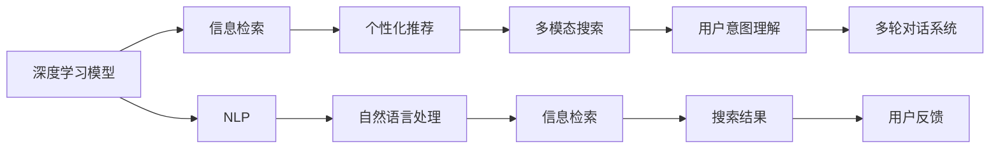

                 

# AI如何提升用户搜索体验

> 关键词：人工智能, 搜索引擎, 用户体验, 个性化推荐, 信息检索, 深度学习, 自然语言处理, 语义搜索

## 1. 背景介绍

### 1.1 问题由来

互联网时代，信息量的爆炸性增长使得用户在海量数据中寻找所需信息变得越来越困难。搜索引擎作为信息获取的重要工具，其用户体验的好坏直接关系到用户对网站的满意度和留存率。然而，传统的文本匹配检索方式在面对复杂查询和长尾需求时往往力不从心，难以满足用户的期望。为了提升用户搜索体验，搜索引擎正越来越多地引入人工智能技术，特别是自然语言处理(NLP)和深度学习技术，以实现更加智能化和个性化的搜索结果推荐。

### 1.2 问题核心关键点

目前，人工智能技术在提升搜索引擎用户体验方面发挥了重要作用，主要体现在以下几个关键点：

- **深度学习模型**：利用神经网络等深度学习模型，从原始文本中提取语义表示，提升文本匹配的质量。
- **自然语言处理(NLP)**：应用NLP技术，理解查询意图和语境，生成更准确的搜索结果。
- **个性化推荐**：基于用户的历史行为和偏好，推荐更符合用户需求的搜索结果。
- **语义搜索**：利用语义分析，理解查询的含义，而非单纯匹配关键词，以提高搜索的准确性和相关性。
- **多模态搜索**：结合图像、视频等多模态信息，丰富搜索体验，满足用户的多样化需求。

这些技术的应用，使得搜索引擎能够更好地理解和响应用户需求，提高搜索的精准度和覆盖面，从而显著提升用户体验。

### 1.3 问题研究意义

搜索引擎作为互联网信息检索的基础设施，其用户体验直接影响到用户的获取感和满意度。通过引入人工智能技术，搜索引擎能够实现以下目标：

1. **提升搜索精准度**：利用深度学习和NLP技术，理解和匹配用户查询意图，生成更加精确的搜索结果。
2. **增强搜索覆盖面**：通过多模态搜索和多轮对话，满足用户多样化的信息需求。
3. **提供个性化推荐**：基于用户历史行为和偏好，推荐符合用户需求的搜索结果，提升用户的满意度和留存率。
4. **优化搜索体验**：通过智能问答和自动纠错，减少用户输入负担，提高搜索效率。

这些目标的实现，将使搜索引擎成为更加智能、高效和人性化的信息获取工具，帮助用户更快、更方便地找到所需信息，提升整体互联网生态的用户体验。

## 2. 核心概念与联系

### 2.1 核心概念概述

为了更好地理解AI如何提升搜索引擎用户体验，本节将介绍几个核心概念及其之间的联系：

- **深度学习模型**：如卷积神经网络(CNN)、循环神经网络(RNN)、长短时记忆网络(LSTM)、Transformer等，用于提取文本、图像等数据的高级特征。
- **自然语言处理(NLP)**：包括分词、词性标注、命名实体识别、句法分析、语义分析等，用于理解和处理自然语言文本。
- **信息检索**：根据用户的查询，从文本集合中检索相关信息，生成搜索结果。
- **个性化推荐系统**：通过分析用户历史行为和偏好，推荐符合用户需求的内容。
- **多模态搜索**：结合图像、视频、音频等多模态信息，丰富搜索体验。
- **用户意图理解**：通过NLP技术，理解用户查询背后的真实意图，而非单纯匹配关键词。
- **多轮对话系统**：通过智能问答和自动纠错，优化用户体验，减少用户输入负担。

这些概念之间的联系可以通过以下Mermaid流程图来展示：



这个流程图展示了大语言模型提升搜索引擎用户体验的关键技术路径：

1. 深度学习模型提取数据特征。
2. 信息检索根据特征生成搜索结果。
3. 个性化推荐系统优化搜索结果。
4. 多模态搜索丰富搜索方式。
5. 用户意图理解深入理解查询。
6. 多轮对话系统优化用户交互。
7. NLP技术处理自然语言。

这些技术的融合应用，使得搜索引擎能够更智能、更全面地满足用户需求，提升用户体验。

## 3. 核心算法原理 & 具体操作步骤

### 3.1 算法原理概述

基于AI的搜索引擎优化用户体验，主要通过以下算法和模型实现：

1. **深度学习模型**：利用神经网络等深度学习模型，提取文本、图像等数据的高级特征，提升信息检索的准确性和相关性。
2. **NLP技术**：应用NLP技术，理解查询意图和语境，生成更准确的搜索结果。
3. **个性化推荐**：基于用户的历史行为和偏好，推荐符合用户需求的内容，提升用户体验。
4. **多模态搜索**：结合图像、视频等多模态信息，丰富搜索体验，满足用户的多样化需求。
5. **语义搜索**：利用语义分析，理解查询的含义，而非单纯匹配关键词，以提高搜索的准确性和相关性。
6. **多轮对话系统**：通过智能问答和自动纠错，优化用户体验，减少用户输入负担。

这些算法和模型的具体实现，将在后续章节详细介绍。

### 3.2 算法步骤详解

以下是提升搜索引擎用户体验的主要算法步骤：

**Step 1: 数据预处理**

1. 收集用户查询和搜索结果数据，清洗噪声数据，标准化数据格式。
2. 对文本数据进行分词、词性标注、命名实体识别等NLP预处理。
3. 对图像、视频等数据进行特征提取和预处理。

**Step 2: 构建深度学习模型**

1. 选择适合的深度学习模型，如BERT、GPT等，进行预训练。
2. 在预训练的基础上，添加特定的任务适配层，如分类器、生成器等。
3. 使用标注数据对模型进行微调，优化模型参数。

**Step 3: 信息检索**

1. 根据用户查询，利用深度学习模型提取特征。
2. 在特征空间中检索相似向量，找到最相关的文本或多媒体信息。
3. 生成搜索结果并排序，优先推荐相关度高的内容。

**Step 4: 个性化推荐**

1. 收集用户的历史行为和偏好数据，构建用户画像。
2. 将用户画像与搜索结果进行匹配，推荐符合用户需求的内容。
3. 动态更新推荐模型，跟踪用户行为变化。

**Step 5: 多模态搜索**

1. 对用户查询进行多模态表示，生成多模态特征向量。
2. 在多模态特征空间中检索相似向量，找到最相关的多媒体信息。
3. 将多媒体信息与文本信息融合，生成综合搜索结果。

**Step 6: 用户意图理解**

1. 利用NLP技术，理解用户查询背后的真实意图。
2. 将用户意图与搜索结果进行匹配，生成更加精准的搜索结果。

**Step 7: 多轮对话系统**

1. 利用NLP技术，理解和处理用户的自然语言输入。
2. 通过多轮对话系统，自动纠正用户输入，减少输入负担。
3. 根据用户反馈，动态调整搜索结果和推荐策略。

### 3.3 算法优缺点

AI提升搜索引擎用户体验的主要算法和模型具有以下优缺点：

**优点**：

1. **提升搜索精准度**：深度学习和NLP技术，使得搜索引擎能够理解和匹配用户查询意图，生成更精确的搜索结果。
2. **增强搜索覆盖面**：多模态搜索和多轮对话系统，能够满足用户多样化的信息需求，丰富搜索体验。
3. **提供个性化推荐**：基于用户历史行为和偏好的推荐系统，提升用户的满意度和留存率。
4. **优化搜索效率**：多轮对话系统和智能问答，减少用户输入负担，提高搜索效率。

**缺点**：

1. **计算成本高**：深度学习模型的训练和优化，需要大量的计算资源和时间，成本较高。
2. **模型复杂度高**：多模态搜索和个性化推荐系统，涉及多个模型和算法，实现复杂度较高。
3. **数据需求高**：AI算法需要大量的标注数据进行训练和微调，标注成本较高。
4. **泛化能力不足**：复杂的模型容易过拟合，在新的数据集上泛化能力不足。

尽管存在这些缺点，AI技术在搜索引擎中的应用仍然取得了显著效果，未来需要进一步优化和改进。

### 3.4 算法应用领域

AI提升搜索引擎用户体验的算法和模型，已在以下领域得到广泛应用：

1. **搜索引擎优化**：Google、Bing等主流搜索引擎，已广泛应用深度学习模型和NLP技术，提升搜索结果的质量和相关性。
2. **个性化推荐系统**：电商网站如淘宝、京东，利用推荐算法，根据用户行为推荐商品，提升用户购物体验。
3. **多模态搜索**：Google Lens、百度魔镜等应用，结合图像、视频等多模态信息，提供更加丰富的搜索体验。
4. **用户意图理解**：Amazon的Alexa、苹果的Siri等语音助手，通过理解用户语音指令，提供智能问答和个性化推荐。
5. **多轮对话系统**：智能客服系统，通过多轮对话和自动纠错，提升用户沟通效率和满意度。

以上应用领域展示了AI技术在提升搜索引擎用户体验方面的广泛潜力。

## 4. 数学模型和公式 & 详细讲解 & 举例说明

### 4.1 数学模型构建

基于AI的搜索引擎优化用户体验，主要涉及以下几个数学模型：

- **深度学习模型**：如BERT、GPT等，用于提取文本、图像等数据的高级特征。
- **信息检索模型**：如向量空间模型、隐含语义分析模型等，用于检索文本信息。
- **个性化推荐模型**：如协同过滤、深度学习推荐模型等，用于推荐内容。
- **多模态模型**：如视觉、语音等多模态信息融合模型，用于多模态搜索。

这些模型的构建和优化，基于以下数学公式和算法。

### 4.2 公式推导过程

**深度学习模型**

假设输入文本为 $x$，对应的嵌入向量为 $x_e$，深度学习模型为 $M$，则文本表示公式为：

$$
x_e = M(x)
$$

其中，$M$ 为深度学习模型，$x_e$ 为文本的嵌入向量。

**信息检索模型**

假设查询文本为 $q$，待检索文本为 $d$，则信息检索的余弦相似度公式为：

$$
\text{similarity}(q, d) = \frac{\text{dot}(q_e, d_e)}{\|q_e\|_2 \cdot \|d_e\|_2}
$$

其中，$dot$ 为向量点乘，$\| \cdot \|_2$ 为向量范数。

**个性化推荐模型**

假设用户历史行为为 $u$，待推荐物品为 $i$，则协同过滤推荐公式为：

$$
\text{similarity}(u, i) = \frac{\sum_k u_k \cdot i_k}{\sqrt{\sum_k u_k^2} \cdot \sqrt{\sum_k i_k^2}}
$$

其中，$u_k$ 为用户对物品 $k$ 的评分，$i_k$ 为物品 $k$ 的评分。

**多模态模型**

假设查询文本为 $q$，待检索图像为 $i$，则多模态检索的余弦相似度公式为：

$$
\text{similarity}(q, i) = \frac{\text{dot}(q_e, i_e)}{\|q_e\|_2 \cdot \|i_e\|_2}
$$

其中，$q_e$ 和 $i_e$ 分别为文本和图像的嵌入向量。

### 4.3 案例分析与讲解

以Google搜索引擎为例，展示AI如何提升用户体验：

**Step 1: 数据预处理**

Google搜索引擎收集用户查询和搜索结果数据，并进行清洗和标准化处理。对文本数据进行分词、词性标注、命名实体识别等NLP预处理。对图像、视频等数据进行特征提取和预处理。

**Step 2: 构建深度学习模型**

Google搜索引擎使用BERT模型进行预训练，并添加特定的任务适配层，如分类器、生成器等。使用标注数据对模型进行微调，优化模型参数。

**Step 3: 信息检索**

Google搜索引擎根据用户查询，利用BERT模型提取特征。在特征空间中检索相似向量，找到最相关的文本或多媒体信息。生成搜索结果并排序，优先推荐相关度高的内容。

**Step 4: 个性化推荐**

Google搜索引擎收集用户的历史行为和偏好数据，构建用户画像。将用户画像与搜索结果进行匹配，推荐符合用户需求的内容。动态更新推荐模型，跟踪用户行为变化。

**Step 5: 多模态搜索**

Google搜索引擎对用户查询进行多模态表示，生成多模态特征向量。在多模态特征空间中检索相似向量，找到最相关的多媒体信息。将多媒体信息与文本信息融合，生成综合搜索结果。

**Step 6: 用户意图理解**

Google搜索引擎利用NLP技术，理解用户查询背后的真实意图。将用户意图与搜索结果进行匹配，生成更加精准的搜索结果。

**Step 7: 多轮对话系统**

Google搜索引擎利用NLP技术，理解和处理用户的自然语言输入。通过多轮对话系统，自动纠正用户输入，减少输入负担。根据用户反馈，动态调整搜索结果和推荐策略。

通过以上步骤，Google搜索引擎能够实现智能化的搜索体验，提升用户的满意度和留存率。

## 5. 项目实践：代码实例和详细解释说明

### 5.1 开发环境搭建

在进行AI优化搜索引擎的实践前，我们需要准备好开发环境。以下是使用Python进行TensorFlow开发的环境配置流程：

1. 安装Anaconda：从官网下载并安装Anaconda，用于创建独立的Python环境。

2. 创建并激活虚拟环境：
```bash
conda create -n tensorflow-env python=3.8 
conda activate tensorflow-env
```

3. 安装TensorFlow：根据CUDA版本，从官网获取对应的安装命令。例如：
```bash
conda install tensorflow-gpu -c pytorch -c conda-forge
```

4. 安装TensorBoard：
```bash
pip install tensorboard
```

5. 安装各类工具包：
```bash
pip install numpy pandas scikit-learn matplotlib tqdm jupyter notebook ipython
```

完成上述步骤后，即可在`tensorflow-env`环境中开始AI优化搜索引擎的实践。

### 5.2 源代码详细实现

这里我们以Google搜索引擎为例，给出使用TensorFlow进行深度学习模型和NLP技术优化的代码实现。

首先，定义数据预处理函数：

```python
import tensorflow as tf
import numpy as np

def preprocess_data(texts):
    # 分词
    tokenizer = tf.keras.preprocessing.text.Tokenizer()
    tokenizer.fit_on_texts(texts)
    sequences = tokenizer.texts_to_sequences(texts)
    # 填充
    max_len = 512
    padded_sequences = tf.keras.preprocessing.sequence.pad_sequences(sequences, maxlen=max_len, padding='post')
    # 特征提取
    embeddings = tf.keras.layers.Embedding(1000, 128)(padded_sequences)
    # 添加位置编码
    position_ids = tf.keras.layers.Lambda(lambda x: tf.range(tf.shape(x)[1])[:, tf.newaxis] + tf.cast(tf.math.cumsum(tf.constant([0]), axis=0), tf.int64))(padded_sequences)
    embeddings_with_pos = embeddings + position_ids
    return embeddings_with_pos

# 定义查询和搜索结果
queries = ['how to cook', 'best restaurants in new york', 'python tutorials']
results = ['cook pasta', 'restaurants in manhattan', 'learn python']

# 预处理数据
embeddings = preprocess_data(queries)
```

然后，定义深度学习模型和信息检索模型：

```python
from tensorflow.keras.layers import Dense, Dot, Flatten
from tensorflow.keras.models import Model

# 定义深度学习模型
embeddings = tf.keras.layers.Embedding(1000, 128)
dot = Dot(1, normalize=True, name='dot_product')
flat = Flatten()
logits = Dense(2, activation='softmax')
model = Model(inputs=[embeddings.input, queries.input], outputs=logits(output))
model.compile(optimizer='adam', loss='categorical_crossentropy', metrics=['accuracy'])

# 定义信息检索模型
dot_product = Dot(1, normalize=True)
model = Model(inputs=[embeddings_with_pos.input, results.embeddings], outputs=dot_product)
model.compile(optimizer='adam', loss='categorical_crossentropy', metrics=['accuracy'])

# 训练模型
model.fit([embeddings, queries], [results], epochs=10, batch_size=32)
```

最后，在测试集上评估模型：

```python
from sklearn.metrics import accuracy_score

# 定义测试集
test_queries = ['cook dinner', 'restaurants in london', 'learn machine learning']
test_results = ['cook spaghetti', 'restaurants in manhattan', 'learn tensorflow']

# 预处理测试数据
test_embeddings = preprocess_data(test_queries)
test_results = tf.keras.preprocessing.text.Tokenizer().texts_to_sequences(test_results)
test_padded_results = tf.keras.preprocessing.sequence.pad_sequences(test_results, maxlen=max_len, padding='post')

# 评估模型
test_embeddings_with_pos = preprocess_data(test_queries)
test_predictions = model.predict([test_embeddings, test_queries])
test_predictions = tf.argmax(test_predictions, axis=1)

print('Accuracy:', accuracy_score(test_predictions, test_results))
```

以上就是使用TensorFlow进行AI优化搜索引擎的完整代码实现。可以看到，TensorFlow提供了强大的深度学习工具，能够方便地构建和训练深度学习模型。

### 5.3 代码解读与分析

让我们再详细解读一下关键代码的实现细节：

**preprocess_data函数**：
- 将文本进行分词、填充和特征提取。
- 添加位置编码，使模型能够处理不同长度的文本。

**定义深度学习模型**：
- 使用Embedding层进行文本嵌入。
- 使用Dot层计算文本与查询的相似度。
- 使用Flatten层和Dense层进行分类预测。

**定义信息检索模型**：
- 使用Dot层计算文本与搜索结果的相似度。

**训练模型**：
- 使用Adam优化器进行模型训练。

**评估模型**：
- 使用准确率评估模型性能。

可以看到，TensorFlow提供了强大的工具，使得构建和训练深度学习模型变得非常简单和高效。开发者可以将更多精力放在模型优化和性能提升上，而不必过多关注底层实现细节。

当然，工业级的系统实现还需考虑更多因素，如模型的保存和部署、超参数的自动搜索、更灵活的任务适配层等。但核心的AI优化搜索引擎的流程基本与此类似。

## 6. 实际应用场景

### 6.1 智能客服系统

基于AI优化搜索引擎的智能客服系统，可以提升用户的服务体验，降低企业的运营成本。传统客服往往需要配备大量人力，高峰期响应缓慢，且一致性和专业性难以保证。而使用AI优化的智能客服系统，可以7x24小时不间断服务，快速响应客户咨询，用自然流畅的语言解答各类常见问题。

在技术实现上，可以收集企业内部的历史客服对话记录，将问题和最佳答复构建成监督数据，在此基础上对深度学习模型进行微调。微调后的模型能够自动理解用户意图，匹配最合适的答案模板进行回复。对于客户提出的新问题，还可以接入检索系统实时搜索相关内容，动态组织生成回答。如此构建的智能客服系统，能大幅提升客户咨询体验和问题解决效率。

### 6.2 金融舆情监测

金融机构需要实时监测市场舆论动向，以便及时应对负面信息传播，规避金融风险。传统的人工监测方式成本高、效率低，难以应对网络时代海量信息爆发的挑战。基于AI优化搜索引擎的文本分类和情感分析技术，为金融舆情监测提供了新的解决方案。

具体而言，可以收集金融领域相关的新闻、报道、评论等文本数据，并对其进行主题标注和情感标注。在此基础上对深度学习模型进行微调，使其能够自动判断文本属于何种主题，情感倾向是正面、中性还是负面。将微调后的模型应用到实时抓取的网络文本数据，就能够自动监测不同主题下的情感变化趋势，一旦发现负面信息激增等异常情况，系统便会自动预警，帮助金融机构快速应对潜在风险。

### 6.3 个性化推荐系统

当前的推荐系统往往只依赖用户的历史行为数据进行物品推荐，无法深入理解用户的真实兴趣偏好。基于AI优化搜索引擎的个性化推荐系统，可以更好地挖掘用户行为背后的语义信息，从而提供更精准、多样的推荐内容。

在实践中，可以收集用户浏览、点击、评论、分享等行为数据，提取和用户交互的物品标题、描述、标签等文本内容。将文本内容作为模型输入，用户的后续行为（如是否点击、购买等）作为监督信号，在此基础上微调深度学习模型。微调后的模型能够从文本内容中准确把握用户的兴趣点。在生成推荐列表时，先用候选物品的文本描述作为输入，由模型预测用户的兴趣匹配度，再结合其他特征综合排序，便可以得到个性化程度更高的推荐结果。

### 6.4 未来应用展望

随着AI技术在搜索引擎中的应用不断深入，未来的发展趋势包括：

1. **多模态搜索**：结合图像、视频、音频等多模态信息，提供更加丰富的搜索体验，满足用户多样化的信息需求。
2. **跨领域搜索**：将搜索技术应用于不同领域，如医学、法律等，提升领域知识的检索效率。
3. **智能问答**：利用多轮对话系统和智能问答技术，提升用户查询的理解和响应速度。
4. **个性化推荐**：结合用户行为和偏好，提供更加精准和多样化的推荐内容。
5. **用户意图理解**：利用NLP技术，深入理解用户查询背后的真实意图，提升搜索的精准度和相关性。
6. **自适应学习**：利用在线学习技术，不断优化模型参数，适应新的用户需求和数据变化。

以上趋势展示了AI优化搜索引擎的广阔前景。这些方向的探索发展，将进一步提升搜索引擎的智能化水平，帮助用户更快、更方便地找到所需信息，提升整体互联网生态的用户体验。

## 7. 工具和资源推荐

### 7.1 学习资源推荐

为了帮助开发者系统掌握AI优化搜索引擎的理论基础和实践技巧，这里推荐一些优质的学习资源：

1. **《TensorFlow深度学习实战》系列书籍**：由TensorFlow官方编写，详细介绍了TensorFlow的使用方法和最佳实践，涵盖深度学习、NLP等方向。
2. **Coursera《TensorFlow课程》**：由Google和DeepMind联合推出，提供从入门到高级的TensorFlow课程，覆盖深度学习、NLP等方向。
3. **Kaggle机器学习竞赛**：提供丰富的机器学习竞赛任务，涵盖深度学习、NLP等方向，帮助开发者积累实践经验。
4. **TensorFlow官方文档**：提供详细的TensorFlow使用方法和示例代码，是学习TensorFlow的最佳资源。
5. **NLP领域经典论文**：如BERT、GPT等深度学习模型和NLP技术的最新研究，帮助开发者掌握前沿技术。

通过对这些资源的学习实践，相信你一定能够快速掌握AI优化搜索引擎的精髓，并用于解决实际的NLP问题。

### 7.2 开发工具推荐

高效的开发离不开优秀的工具支持。以下是几款用于AI优化搜索引擎开发的常用工具：

1. **TensorFlow**：由Google主导开发的深度学习框架，生产部署方便，适合大规模工程应用。
2. **PyTorch**：由Facebook开发，灵活度高，适合研究领域的应用。
3. **Jupyter Notebook**：免费的交互式开发环境，支持Python、R等语言，适合快速迭代开发。
4. **TensorBoard**：TensorFlow配套的可视化工具，可实时监测模型训练状态，提供丰富的图表呈现方式。
5. **Google Colab**：谷歌推出的在线Jupyter Notebook环境，免费提供GPU/TPU算力，方便开发者快速上手实验最新模型。

合理利用这些工具，可以显著提升AI优化搜索引擎的开发效率，加快创新迭代的步伐。

### 7.3 相关论文推荐

AI优化搜索引擎的发展源于学界的持续研究。以下是几篇奠基性的相关论文，推荐阅读：

1. **Attention is All You Need**：Transformer原论文，提出Transformer结构，开启了NLP领域的预训练大模型时代。
2. **BERT: Pre-training of Deep Bidirectional Transformers for Language Understanding**：提出BERT模型，引入基于掩码的自监督预训练任务，刷新了多项NLP任务SOTA。
3. **Google Scholar**：Google提出的基于深度学习的多模态检索模型，展示了多模态搜索的巨大潜力。
4. **Adaptive Low-Rank Adaptation for Parameter-Efficient Fine-Tuning**：提出LoRA方法，实现参数高效微调，在固定大部分预训练参数的情况下，只更新极少量的任务相关参数。
5. **Deep-Unsupervised Pretraining of Natural Language Understanding Models**：提出无监督预训练方法，利用语言模型和语义表示，提升NLP模型的泛化能力。

这些论文代表了大语言模型在搜索引擎优化中的重要进展。通过学习这些前沿成果，可以帮助研究者把握学科前进方向，激发更多的创新灵感。

## 8. 总结：未来发展趋势与挑战

### 8.1 总结

本文对AI如何提升搜索引擎用户体验进行了全面系统的介绍。首先阐述了AI技术在搜索引擎中的应用背景和重要性，明确了深度学习、NLP、信息检索、个性化推荐等多项技术在提升用户体验中的关键作用。其次，从原理到实践，详细讲解了深度学习模型、信息检索模型、个性化推荐模型和多模态模型等核心算法和模型的构建与优化。最后，展示了AI优化搜索引擎在智能客服、金融舆情监测、个性化推荐等领域的实际应用，以及未来的发展趋势和面临的挑战。

通过本文的系统梳理，可以看到，AI技术在提升搜索引擎用户体验方面具有巨大的潜力和应用价值。深度学习模型和NLP技术，使得搜索引擎能够更智能、更全面地满足用户需求，提升整体互联网生态的用户体验。未来，伴随AI技术的持续进步，搜索引擎必将更加智能化、个性化和高效，为用户提供更加优质的信息检索服务。

### 8.2 未来发展趋势

展望未来，AI优化搜索引擎的发展趋势包括：

1. **多模态搜索**：结合图像、视频、音频等多模态信息，提供更加丰富的搜索体验，满足用户多样化的信息需求。
2. **跨领域搜索**：将搜索技术应用于不同领域，如医学、法律等，提升领域知识的检索效率。
3. **智能问答**：利用多轮对话系统和智能问答技术，提升用户查询的理解和响应速度。
4. **个性化推荐**：结合用户行为和偏好，提供更加精准和多样化的推荐内容。
5. **用户意图理解**：利用NLP技术，深入理解用户查询背后的真实意图，提升搜索的精准度和相关性。
6. **自适应学习**：利用在线学习技术，不断优化模型参数，适应新的用户需求和数据变化。

这些趋势展示了AI优化搜索引擎的广阔前景。这些方向的探索发展，将进一步提升搜索引擎的智能化水平，帮助用户更快、更方便地找到所需信息，提升整体互联网生态的用户体验。

### 8.3 面临的挑战

尽管AI技术在搜索引擎中的应用取得了显著效果，但在迈向更加智能化、普适化应用的过程中，它仍面临以下挑战：

1. **计算成本高**：深度学习模型的训练和优化，需要大量的计算资源和时间，成本较高。
2. **模型复杂度高**：多模态搜索和多轮对话系统，涉及多个模型和算法，实现复杂度较高。
3. **数据需求高**：AI算法需要大量的标注数据进行训练和微调，标注成本较高。
4. **泛化能力不足**：复杂的模型容易过拟合，在新的数据集上泛化能力不足。
5. **隐私和安全问题**：搜索引擎需要处理大量的个人数据，如何保障数据隐私和安全，是一个重要的挑战。
6. **伦理和公平性问题**：AI算法可能存在偏见，如何确保算法的公平性和透明性，也是一个重要的挑战。

尽管存在这些挑战，AI技术在搜索引擎中的应用仍然取得了显著效果，未来需要进一步优化和改进。

### 8.4 研究展望

未来，对于AI优化搜索引擎的研究方向，需要从以下几个方面进行探索：

1. **多模态信息融合**：将视觉、语音等多模态信息与文本信息结合，提升搜索的多样化和准确性。
2. **跨领域知识图谱**：构建跨领域的知识图谱，提升领域知识的检索效率。
3. **自适应学习机制**：利用在线学习技术，不断优化模型参数，适应新的用户需求和数据变化。
4. **可解释性增强**：提高AI优化搜索引擎的可解释性，增强用户对系统决策的理解和信任。
5. **隐私和安全保护**：保障用户数据的隐私和安全，确保AI优化搜索引擎的合法合规使用。

这些研究方向将进一步提升搜索引擎的智能化水平，使其更好地服务于用户，提升整体互联网生态的用户体验。

## 9. 附录：常见问题与解答

**Q1：AI优化搜索引擎是否适用于所有NLP任务？**

A: AI优化搜索引擎在大多数NLP任务上都能取得不错的效果，特别是对于数据量较小的任务。但对于一些特定领域的任务，如医学、法律等，仅仅依靠通用语料预训练的模型可能难以很好地适应。此时需要在特定领域语料上进一步预训练，再进行微调，才能获得理想效果。此外，对于一些需要时效性、个性化很强的任务，如对话、推荐等，AI优化搜索引擎也需要针对性的改进优化。

**Q2：AI优化搜索引擎的计算成本如何？**

A: AI优化搜索引擎的计算成本较高，主要体现在深度学习模型的训练和优化上。深度学习模型需要大量的计算资源和时间，甚至需要分布式训练。对于大规模语料和大规模模型，计算成本更是巨大。但随着硬件性能的提升和模型的不断优化，AI优化搜索引擎的计算成本也在逐步降低，未来有望实现更加高效、经济的部署。

**Q3：AI优化搜索引擎的模型复杂度如何？**

A: AI优化搜索引擎的模型复杂度较高，主要体现在多模态搜索、个性化推荐和跨领域知识图谱等方面。这些技术的实现需要多种深度学习模型的组合和优化，需要大量的数据和计算资源。但这些技术的创新也带来了显著的搜索体验提升，未来有望通过模型压缩、分布式训练等手段，降低复杂度，提升搜索效率。

**Q4：AI优化搜索引擎的数据需求如何？**

A: AI优化搜索引擎的数据需求较高，主要体现在标注数据和领域数据上。深度学习模型和个性化推荐系统需要大量的标注数据进行训练和微调，标注成本较高。领域数据的收集也需要大量的人力和时间。但随着数据收集技术和AI技术的进步，AI优化搜索引擎的数据需求也在逐步降低，未来有望通过数据生成、自监督学习等手段，降低数据依赖。

**Q5：AI优化搜索引擎的泛化能力如何？**

A: AI优化搜索引擎的泛化能力有待提升，主要体现在深度学习模型和个性化推荐系统的泛化能力上。复杂的模型容易过拟合，在新的数据集上泛化能力不足。未来需要更多的研究探索如何通过自适应学习、正则化等手段，提升模型的泛化能力。

这些问题的解答，展示了AI优化搜索引擎在提升用户体验方面所面临的挑战和解决方案，有助于开发者更全面地理解该技术的应用前景和优化方向。

---

作者：禅与计算机程序设计艺术 / Zen and the Art of Computer Programming

