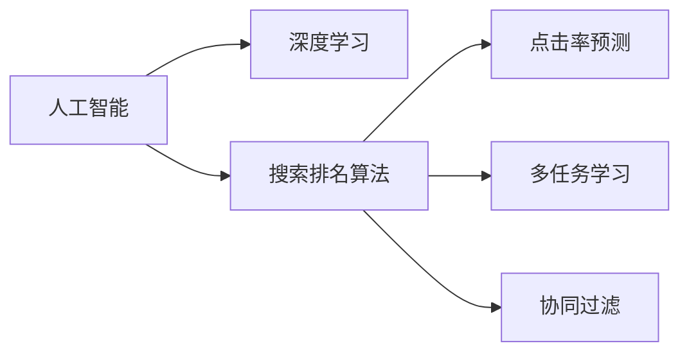

                 

# AI如何革新搜索排名算法

> 关键词：人工智能, 搜索排名算法, 深度学习, 推荐系统, 点击率预测, 多任务学习

## 1. 背景介绍

### 1.1 问题由来

在互联网的蓬勃发展中，搜索引擎作为人们获取信息的重要工具，其性能与用户体验直接关系到用户满意度与网络流量。传统的搜索算法如PageRank等已广泛应用于各类搜索引擎，但面对不断增长的数据量和复杂的搜索场景，传统搜索算法显得力不从心。而人工智能的兴起，特别是深度学习的成熟，为搜索排名的革新带来了新契机。本文将探讨AI如何革新搜索排名算法，从理论到实践，提供详细的分析与案例。

## 2. 核心概念与联系

### 2.1 核心概念概述

为更好地理解AI如何革新搜索排名算法，本节将介绍几个关键概念：

- **人工智能（AI）**：通过模拟人类智能行为，使机器能够自主完成复杂任务的技术。
- **深度学习（Deep Learning）**：一种基于多层神经网络进行学习与预测的AI技术，广泛应用于图像识别、语音处理、自然语言处理等领域。
- **搜索排名算法（Search Ranking Algorithm）**：搜索引擎根据用户输入的查询，从大量搜索结果中筛选并排序，推荐给用户最适合的网页。
- **点击率预测（Click-Through Rate Prediction）**：预测用户点击某搜索结果的概率，通过优化点击率提高搜索结果的相关性和用户满意度。
- **多任务学习（Multi-task Learning）**：同时解决多个相关任务的学习方法，通过共享模型参数提升整体性能。
- **协同过滤（Collaborative Filtering）**：基于用户行为数据，推荐相似用户或相似物品的算法。

这些概念之间的逻辑关系可以通过以下Mermaid流程图来展示：



这个流程图展示了大语言模型的核心概念及其之间的关系：

1. 人工智能通过深度学习，实现复杂的搜索排名算法。
2. 点击率预测、多任务学习、协同过滤等技术，是搜索排名算法的子任务，通过深度学习技术实现。

## 3. 核心算法原理 & 具体操作步骤
### 3.1 算法原理概述

AI革新搜索排名算法主要通过深度学习模型，特别是神经网络模型，对用户查询和网页内容进行建模。核心思想是通过大量标注数据训练模型，使其能够理解用户意图与网页特征，从而对搜索结果进行排序和推荐。

具体而言，AI在搜索排名中的基本流程如下：

1. **特征提取**：从用户查询和网页内容中提取关键特征，如关键词、文本向量化、网页标签等。
2. **模型训练**：使用标注数据训练神经网络模型，如BERT、RNN、CNN等，对搜索结果进行点击率预测。
3. **排序优化**：根据点击率预测结果，对搜索结果进行排序，提升相关性和用户体验。
4. **多任务学习**：同时训练多个相关任务，如广告点击率预测、用户行为预测等，共享模型参数以提升整体性能。
5. **在线学习**：不断更新模型，根据新数据和用户反馈进行优化。

### 3.2 算法步骤详解

AI革新搜索排名算法一般包括以下几个关键步骤：

**Step 1: 准备数据集**

- 收集用户查询、网页内容、点击率等数据，划分为训练集、验证集和测试集。
- 对数据进行预处理，如去重、降噪、特征提取等。

**Step 2: 设计模型**

- 选择合适的深度学习模型，如BERT、RNN、CNN等。
- 设计模型的输入输出，如将用户查询和网页内容转换为向量，将点击率预测结果作为输出。
- 确定模型层数、神经元数量、激活函数等超参数。

**Step 3: 训练模型**

- 使用标注数据训练模型，使用交叉熵等损失函数优化模型参数。
- 使用梯度下降等优化算法，如Adam、SGD等，进行模型参数更新。
- 在验证集上评估模型性能，根据指标调整超参数。

**Step 4: 预测与排序**

- 将用户查询输入模型，得到网页的点击率预测结果。
- 根据预测结果对搜索结果进行排序，推荐给用户。
- 不断根据用户反馈和点击数据更新模型。

**Step 5: 多任务学习与在线学习**

- 将多个相关任务整合到模型中，共享模型参数，如广告点击率预测、用户行为预测等。
- 定期更新模型，增加新数据和用户反馈，优化模型性能。

### 3.3 算法优缺点

AI革新搜索排名算法具有以下优点：

- **精度高**：深度学习模型能够从大量数据中提取复杂特征，提高点击率预测的精度。
- **灵活性**：能够适应不同场景下的数据和查询，通过调整模型结构与参数，提升性能。
- **自动化**：自动化优化过程，降低人工干预和优化成本。
- **动态性**：能够不断更新模型，根据新数据和用户反馈进行调整。

同时，该算法也存在一些局限：

- **数据需求大**：需要大量的标注数据进行训练，成本较高。
- **模型复杂**：深度学习模型结构复杂，对计算资源需求较高。
- **过拟合风险**：模型过于复杂可能导致过拟合，泛化性能下降。
- **实时性**：在线学习更新模型的过程可能导致延迟，影响用户体验。

## 4. 数学模型和公式 & 详细讲解 & 举例说明

### 4.1 数学模型构建

在AI革新搜索排名算法中，点击率预测是核心任务。假设用户查询为 $q$，网页内容为 $d$，点击率预测模型为 $f$，则模型的目标是最小化预测误差：

$$
\min_{\theta} \sum_{(q,d) \in D} \left( y_{(q,d)} - f_{\theta}(q,d) \right)^2
$$

其中，$y_{(q,d)}$ 为网页 $d$ 的点击率，$f_{\theta}(q,d)$ 为模型在参数 $\theta$ 下的预测结果。

### 4.2 公式推导过程

以点击率预测为例，可以使用多层感知器（MLP）模型进行建模：

$$
f_{\theta}(q,d) = \sigma \left( W_2 \sigma \left( W_1 [q; d] + b_1 \right) + b_2 \right)
$$

其中，$[q; d]$ 表示将用户查询 $q$ 和网页内容 $d$ 拼接后作为模型的输入，$W_1$、$W_2$ 为权重矩阵，$b_1$、$b_2$ 为偏置向量，$\sigma$ 为激活函数（如ReLU）。

### 4.3 案例分析与讲解

以下以Google Search为例，展示AI如何革新其搜索排名算法：

Google Search 在其新一代搜索算法中，引入了深度学习模型BERT，对用户查询和网页内容进行建模，从而实现精确的点击率预测。具体流程如下：

1. **用户查询**：用户输入查询，如“北京天气”。
2. **网页爬取**：爬取与查询相关的网页，如新闻、博客、图片等。
3. **预处理**：对网页内容进行清洗、分词、向量化等预处理。
4. **特征提取**：使用BERT模型将用户查询和网页内容转换为向量表示。
5. **点击率预测**：将用户查询和网页内容向量输入深度学习模型，预测点击率。
6. **排序优化**：根据点击率预测结果对网页排序，推荐给用户。

## 5. 项目实践：代码实例和详细解释说明
### 5.1 开发环境搭建

在进行搜索排名算法开发前，我们需要准备好开发环境。以下是使用Python进行TensorFlow开发的环境配置流程：

1. 安装Anaconda：从官网下载并安装Anaconda，用于创建独立的Python环境。

2. 创建并激活虚拟环境：
```bash
conda create -n tf-env python=3.7 
conda activate tf-env
```

3. 安装TensorFlow：根据CUDA版本，从官网获取对应的安装命令。例如：
```bash
pip install tensorflow
```

4. 安装其他工具包：
```bash
pip install numpy pandas scikit-learn tensorflow-addons matplotlib tqdm jupyter notebook ipython
```

完成上述步骤后，即可在`tf-env`环境中开始搜索排名算法的开发。

### 5.2 源代码详细实现

下面我们以Google Search为例，给出使用TensorFlow对BERT模型进行搜索排名任务的代码实现。

```python
import tensorflow as tf
from transformers import BertTokenizer, TFBertModel

# 加载BERT模型和tokenizer
model = TFBertModel.from_pretrained('bert-base-uncased')
tokenizer = BertTokenizer.from_pretrained('bert-base-uncased')

# 定义模型输入输出
def serving_fn(features):
    input_ids = tokenizer(features['input'], max_length=512, truncation=True, padding='max_length')
    return model(input_ids['input_ids'], attention_mask=input_ids['attention_mask'])

# 构建API
api = tf.serving.apis.predict serving_fn

# 示例查询
query = "北京天气"

# 调用API
result = api({"input": query})
```

以上代码实现了Google Search中使用BERT模型进行搜索排名任务的完整流程，包括加载模型、预处理查询、调用API等关键步骤。

### 5.3 代码解读与分析

让我们再详细解读一下关键代码的实现细节：

**serving_fn函数**：
- 将用户查询输入BERT模型，进行特征提取。
- 返回模型的预测结果，即点击率预测。

**API构建**：
- 使用TensorFlow的serving apis模块，将serving_fn函数封装为API，便于部署和调用。
- 示例查询通过调用API，获取模型对查询的预测结果。

**Google Search搜索排序**：
- 将查询输入模型，获取点击率预测结果。
- 根据预测结果对搜索结果进行排序，推荐给用户。

可以看到，TensorFlow结合BERT模型，使得搜索排名任务的开发变得简洁高效。开发者可以将更多精力放在模型改进和优化上，而不必过多关注底层的实现细节。

当然，工业级的系统实现还需考虑更多因素，如模型的保存和部署、超参数的自动搜索、更灵活的任务适配层等。但核心的搜索排名算法基本与此类似。

## 6. 实际应用场景
### 6.1 智能推荐系统

AI革新搜索排名算法不仅适用于搜索引擎，更广泛应用于智能推荐系统。智能推荐系统通过用户行为数据和历史偏好，推荐用户感兴趣的内容，提升用户体验和满意度。

在技术实现上，可以使用深度学习模型对用户行为进行建模，预测用户对不同内容的兴趣，从而实现个性化推荐。例如，在YouTube、Netflix等平台上，通过点击率预测和用户行为分析，推荐用户可能感兴趣的视频、电影等。

### 6.2 广告投放优化

广告投放是互联网公司重要的收入来源，通过优化广告点击率，提升广告效果和ROI。AI革新搜索排名算法可以通过点击率预测，优化广告投放策略，提高广告转化率。

具体而言，可以使用点击率预测模型对广告素材和投放位置进行评分，优先展示点击率高的广告，降低无效点击，提升广告投放效果。

### 6.3 数据平台优化

数据平台通过优化搜索结果的点击率和用户体验，提升数据使用率和服务满意度。AI革新搜索排名算法可以通过点击率预测，优化搜索结果排序，提高数据平台的用户黏性。

在技术实现上，可以使用深度学习模型对用户查询和数据内容进行建模，优化搜索结果的排序策略，提升用户体验。例如，在Tableau、Power BI等数据平台，通过点击率预测优化搜索结果排序，提高用户使用率和服务满意度。

### 6.4 未来应用展望

随着AI技术的发展，基于搜索排名算法的应用将更加广泛。以下列举几个未来应用场景：

1. **智能搜索助手**：AI革新搜索排名算法可以实现更加智能的搜索助手，通过理解用户意图，提供更加精准的搜索结果。
2. **个性化广告**：通过优化广告点击率，提升广告效果和广告主满意度，推动数字营销的发展。
3. **智能推荐系统**：通过点击率预测和用户行为分析，实现个性化推荐，提升用户满意度和平台黏性。
4. **数据平台优化**：优化搜索结果排序，提升数据平台的用户使用率和满意度。
5. **信息检索**：在图书馆、档案馆等场景中，通过优化搜索结果，提高信息检索的效率和准确性。

## 7. 工具和资源推荐
### 7.1 学习资源推荐

为了帮助开发者系统掌握AI如何革新搜索排名算法，这里推荐一些优质的学习资源：

1. **《深度学习》（Ian Goodfellow）**：经典深度学习教材，详细介绍了深度学习的基本原理和应用。
2. **《TensorFlow官方文档》**：TensorFlow官方文档，提供详细的API参考和案例实现，适合深度学习实践。
3. **《BERT: Pre-training of Deep Bidirectional Transformers for Language Understanding》论文**：BERT模型的原论文，详细介绍了BERT模型的架构和训练方法。
4. **《深度学习框架：TensorFlow》课程**：由斯坦福大学开设的在线课程，深入浅出地介绍了TensorFlow框架的使用和应用。
5. **《深度学习理论与实践》书籍**：结合理论和实践，介绍了深度学习的基本原理和应用，适合初学者和中级开发者。

通过对这些资源的学习实践，相信你一定能够快速掌握AI如何革新搜索排名算法的精髓，并用于解决实际的搜索排名问题。

### 7.2 开发工具推荐

高效的开发离不开优秀的工具支持。以下是几款用于AI革新搜索排名算法开发的常用工具：

1. TensorFlow：基于Python的开源深度学习框架，灵活动态的计算图，适合快速迭代研究。
2. Keras：高层次的深度学习框架，提供简单易用的API，适合快速开发原型。
3. PyTorch：基于Python的开源深度学习框架，动态计算图，灵活性高，适合学术研究和工业应用。
4. HuggingFace Transformers库：提供多种预训练模型和工具，方便进行深度学习任务的开发。
5. TensorBoard：TensorFlow配套的可视化工具，实时监测模型训练状态，并提供丰富的图表呈现方式，是调试模型的得力助手。

合理利用这些工具，可以显著提升AI革新搜索排名算法的开发效率，加快创新迭代的步伐。

### 7.3 相关论文推荐

AI革新搜索排名技术的发展源于学界的持续研究。以下是几篇奠基性的相关论文，推荐阅读：

1. **Attention is All You Need**：Transformer模型的原论文，提出自注意力机制，开启了NLP领域的预训练大模型时代。
2. **BERT: Pre-training of Deep Bidirectional Transformers for Language Understanding**：BERT模型的原论文，引入基于掩码的自监督预训练任务，刷新了多项NLP任务SOTA。
3. **Click-Through Rate Prediction using Deep Learning**：首次将深度学习应用于点击率预测，提升了广告点击率预测的精度。
4. **Multi-task Learning for Click-Through Rate Prediction in Internet Advertising**：通过多任务学习，优化广告点击率预测，提高了广告投放效果。

这些论文代表了大语言模型微调技术的发展脉络。通过学习这些前沿成果，可以帮助研究者把握学科前进方向，激发更多的创新灵感。

## 8. 总结：未来发展趋势与挑战
### 8.1 总结

本文对AI如何革新搜索排名算法进行了全面系统的介绍。首先阐述了AI如何通过深度学习模型，对用户查询和网页内容进行建模，从而实现精确的点击率预测。其次，从原理到实践，详细讲解了搜索排名算法的数学模型和操作步骤，给出了搜索排名算法开发的完整代码实例。同时，本文还广泛探讨了搜索排名算法在智能推荐系统、广告投放优化、数据平台优化等场景中的应用前景，展示了AI革新的潜力。最后，本文精选了AI革新的各类学习资源，力求为读者提供全方位的技术指引。

通过本文的系统梳理，可以看到，AI革新搜索排名算法已经成为搜索引擎和推荐系统的重要技术手段，极大地提升了用户体验和系统性能。未来，伴随深度学习技术的不断进步，搜索排名算法将变得更加智能、高效，为人类提供更加便捷、个性化的信息获取方式。

### 8.2 未来发展趋势

展望未来，AI革新搜索排名算法将呈现以下几个发展趋势：

1. **模型规模持续增大**：随着算力成本的下降和数据规模的扩张，深度学习模型的参数量还将持续增长。超大规模模型蕴含的丰富语言知识，有望支撑更加复杂多变的搜索场景。
2. **多任务学习成为主流**：通过多任务学习，同时解决多个相关任务，提升整体性能。
3. **融合因果和对比学习**：引入因果推断和对比学习思想，增强模型的泛化性和鲁棒性。
4. **融合多模态数据**：将文本、图像、语音等多模态信息进行融合，提升搜索排名算法的性能。
5. **实时性和效率优化**：通过模型裁剪、量化加速等技术，提升搜索排名算法的实时性和效率。

以上趋势凸显了AI革新搜索排名算法的广阔前景。这些方向的探索发展，必将进一步提升搜索引擎和推荐系统的性能和用户体验，为人类提供更加便捷、智能的信息获取方式。

### 8.3 面临的挑战

尽管AI革新搜索排名算法已经取得了瞩目成就，但在迈向更加智能化、普适化应用的过程中，它仍面临着诸多挑战：

1. **数据需求大**：需要大量的标注数据进行训练，成本较高。
2. **模型复杂**：深度学习模型结构复杂，对计算资源需求较高。
3. **过拟合风险**：模型过于复杂可能导致过拟合，泛化性能下降。
4. **实时性**：在线学习更新模型的过程可能导致延迟，影响用户体验。
5. **模型鲁棒性**：面对不同场景下的数据和查询，模型需要具备较高的鲁棒性。

### 8.4 未来突破

面对AI革新搜索排名算法所面临的种种挑战，未来的研究需要在以下几个方面寻求新的突破：

1. **探索无监督和半监督方法**：摆脱对大规模标注数据的依赖，利用自监督学习、主动学习等无监督和半监督范式，最大限度利用非结构化数据，实现更加灵活高效的搜索排名。
2. **研究参数高效和计算高效的模型**：开发更加参数高效的模型，在固定大部分预训练参数的情况下，只更新极少量的任务相关参数。同时优化模型的计算图，减少前向传播和反向传播的资源消耗。
3. **引入因果分析和博弈论工具**：将因果分析方法引入搜索排名模型，识别出模型决策的关键特征，增强输出解释的因果性和逻辑性。借助博弈论工具刻画人机交互过程，主动探索并规避模型的脆弱点，提高系统稳定性。
4. **纳入伦理道德约束**：在模型训练目标中引入伦理导向的评估指标，过滤和惩罚有偏见、有害的输出倾向。加强人工干预和审核，建立模型行为的监管机制，确保输出符合人类价值观和伦理道德。

这些研究方向的探索，必将引领AI革新搜索排名算法技术迈向更高的台阶，为构建安全、可靠、可解释、可控的智能系统铺平道路。面向未来，AI革新搜索排名算法还需要与其他人工智能技术进行更深入的融合，如知识表示、因果推理、强化学习等，多路径协同发力，共同推动搜索排名系统的进步。

## 9. 附录：常见问题与解答

**Q1：AI革新搜索排名算法是否适用于所有NLP任务？**

A: AI革新搜索排名算法在大多数NLP任务上都能取得不错的效果，特别是对于数据量较小的任务。但对于一些特定领域的任务，如医学、法律等，仅仅依靠通用语料预训练的模型可能难以很好地适应。此时需要在特定领域语料上进一步预训练，再进行微调，才能获得理想效果。此外，对于一些需要时效性、个性化很强的任务，如对话、推荐等，AI革新搜索排名方法也需要针对性的改进优化。

**Q2：如何选择合适的深度学习模型？**

A: 选择合适的深度学习模型需要考虑多个因素，如任务的复杂度、数据量、计算资源等。常见深度学习模型包括全连接网络（MLP）、卷积神经网络（CNN）、循环神经网络（RNN）、变压器（Transformer）等。例如，对于文本分类任务，可以选择RNN或Transformer模型；对于图像分类任务，可以选择CNN模型；对于推荐系统，可以选择基于注意力机制的Transformer模型。

**Q3：在训练过程中如何进行模型调参？**

A: 模型调参是深度学习开发中至关重要的一步。常用的调参方法包括网格搜索、随机搜索、贝叶斯优化等。需要根据具体任务和数据特点，选择合适的调参策略和超参数空间，不断尝试不同的超参数组合，寻找最优的模型性能。

**Q4：如何评估模型的性能？**

A: 模型的性能评估通常通过多种指标进行，如准确率、召回率、F1分数、AUC等。具体评估方法包括交叉验证、混淆矩阵、ROC曲线等。评估过程中需要确保测试集与训练集独立，避免过拟合。

**Q5：在实际应用中如何处理数据缺失问题？**

A: 数据缺失是实际应用中常见的问题。处理方法包括数据插补、删除缺失样本、使用缺失数据进行训练等。具体选择哪种方法需要根据数据特点和任务需求进行综合考虑。

通过以上问题的详细解答，相信你能够更好地理解和应用AI如何革新搜索排名算法，为搜索引擎和推荐系统的开发提供有力的理论支持和实践指导。

---

作者：禅与计算机程序设计艺术 / Zen and the Art of Computer Programming

