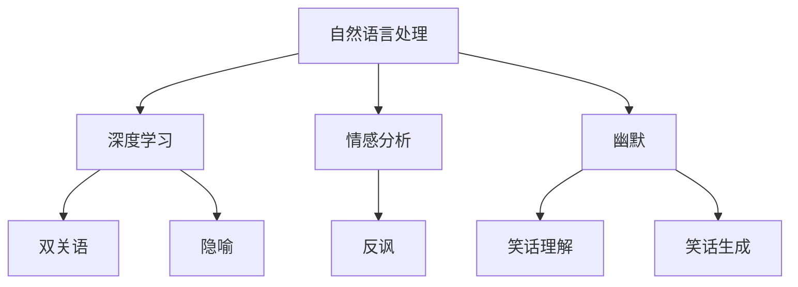

                 

# AI幽默：理解和生成笑话的挑战

> 关键词：AI幽默, 自然语言处理, 笑话理解, 笑话生成, 情感分析, 深度学习

## 1. 背景介绍

### 1.1 问题由来
幽默（Humor）作为一种独特的语言艺术，长期以来一直是文学、影视、喜剧等娱乐形式的重要组成部分。在人工智能领域，理解与生成幽默也成为研究热点之一，旨在通过AI模型捕捉、转化和创造幽默元素，进而实现更自然、更智能的与人交互。这一领域的研究挑战性极高，不仅涉及语言的深层理解，还要求模型具有创造性和语境适应性。

### 1.2 问题核心关键点
当前，AI在幽默理解与生成方面面临的主要问题包括：
- **深度理解语境**：幽默依赖于复杂的语境理解，包括双关语、反讽、隐喻等，AI模型需准确捕捉这些细微之处。
- **创新与多样性**：幽默需要独特且多变的表达方式，AI模型需具备创造性和多样性，以生成风格各异、新颖独特的笑话。
- **情感与社交文化**：幽默与情感、文化紧密相关，AI模型需考虑不同地域、民族和文化背景下的幽默表达差异。
- **交互性**：幽默在对话中的应用，要求模型具备即时生成和适应用户反馈的能力。

### 1.3 问题研究意义
理解和生成幽默对于提升人机交互的自然性和智能性至关重要。幽默的引入不仅能够提升用户体验，增加交流的趣味性，还能在多领域（如客服、教育、娱乐等）中发挥重要作用。同时，研究AI幽默也有助于深入理解自然语言处理中情感和语境等复杂现象，推动语言学的跨学科研究。

## 2. 核心概念与联系

### 2.1 核心概念概述

为更好地理解AI幽默，本节将介绍几个密切相关的核心概念：

- **自然语言处理(NLP)**：涉及对人类语言进行计算机化处理的技术，旨在使计算机能够理解、处理和生成自然语言。
- **深度学习(Deep Learning)**：一种模拟人脑神经网络的计算模型，通过多层非线性变换来提取数据中的高层次特征。
- **情感分析（Sentiment Analysis）**：分析文本的情感倾向，判断其中蕴含的情绪是积极、消极还是中性。
- **双关语(Pun)**：一种通过语音或文字的谐音或同形字来制造的幽默。
- **反讽(Irony)**：通过言辞与实际意义相反，制造幽默效果。
- **隐喻(Metaphor)**：利用事物间的相似性进行比喻，制造幽默效果。

这些核心概念之间的逻辑关系可以通过以下Mermaid流程图来展示：



这个流程图展示了一系列相关概念及其之间的逻辑联系：

1. 自然语言处理提供基础工具，深度学习通过多层非线性变换提取特征。
2. 情感分析判断文本情感倾向。
3. 双关语、反讽、隐喻等幽默手法通过深度学习模型学习。
4. 通过幽默理解与生成，实现人机交互的自然化和智能化。

## 3. 核心算法原理 & 具体操作步骤
### 3.1 算法原理概述

AI幽默的理解与生成主要依赖于自然语言处理和深度学习技术。其核心思想是：通过深度学习模型学习语言特征和情感倾向，并在特定情境下生成或理解幽默元素。

形式化地，假设输入为一段文本 $x$，模型 $M$ 通过以下步骤：
1. 提取文本特征 $F(x)$。
2. 预测文本情感倾向 $S(x)$。
3. 根据 $F(x)$ 和 $S(x)$，生成或理解幽默元素 $H(x)$。
4. 最终生成幽默文本 $y$。

其中 $H(x)$ 可以是双关语、反讽、隐喻等幽默手法，$y$ 为生成的幽默文本，$S(x)$ 用于判断文本是否具有幽默倾向，即是否为笑话。

### 3.2 算法步骤详解

以下是具体的AI幽默理解与生成算法步骤：

**Step 1: 文本预处理**
- 对文本进行分词、去停用词、词干提取等处理，以减少噪音。
- 对文本进行向量表示，如Word2Vec、GloVe等，便于输入模型。
- 使用情感分析工具如VADER、BERT等，预测文本情感倾向。

**Step 2: 模型训练**
- 使用深度学习模型如LSTM、GRU、Transformer等，进行特征提取。
- 训练模型以判断文本是否含有幽默元素，通常使用分类器如SVM、CNN、RNN等。
- 训练生成式模型如GAN、VQ-VAE等，生成新颖的幽默表达。

**Step 3: 模型微调**
- 针对特定类型的幽默（如双关语、反讽）进行微调，提高模型在特定情境下的识别能力。
- 引入生成式对抗网络（GAN）等，进一步优化幽默文本的生成质量。

**Step 4: 生成与评估**
- 根据当前语境和用户反馈，生成或理解幽默文本。
- 使用BLEU、ROUGE等评估指标，评估生成的幽默文本的质量。
- 通过用户反馈，调整模型参数，进一步优化生成效果。

### 3.3 算法优缺点

AI幽默理解与生成算法具有以下优点：
1. **高效性**：通过深度学习模型，能够在短时间内处理大量文本数据，生成幽默内容。
2. **广泛适用性**：能够应用于多种幽默形式，如双关语、反讽、隐喻等。
3. **用户交互性**：通过实时生成幽默内容，提升用户体验。
4. **个性化**：根据不同用户和语境生成个性化幽默，增加交流趣味性。

同时，该算法也存在以下局限性：
1. **复杂性**：幽默依赖于语境和文化的微妙理解，模型难以完全掌握。
2. **多样性不足**：模型生成的幽默文本可能缺乏创新性和多样性。
3. **情感判断困难**：情感分析的准确性直接影响幽默的理解和生成。
4. **解释性不足**：生成式模型的内部工作机制难以解释，用户难以理解。

尽管存在这些局限性，但通过不断改进算法，AI幽默的理解与生成有望在更多场景中得到应用，提升人机交互的自然性和趣味性。

### 3.4 算法应用领域

AI幽默的理解与生成技术已经应用于多个领域：

- **客服系统**：在客服对话中引入幽默元素，提升用户满意度。
- **在线教育**：通过幽默的教学方式，增加学生学习的趣味性。
- **娱乐应用**：开发幽默生成应用，如笑话生成器、趣味对话生成器等。
- **情感分析**：通过幽默元素分析用户情感，实现更深入的人际理解。
- **广告与营销**：在广告语中引入幽默元素，提升广告效果。

## 4. 数学模型和公式 & 详细讲解 & 举例说明
### 4.1 数学模型构建

为了形式化地描述AI幽默理解与生成过程，我们将使用数学语言进行详细阐述。

假设输入文本 $x$ 经过预处理后，得到特征表示 $F(x)$。情感分析模型 $S$ 预测文本情感倾向 $S(x) \in \{0, 1\}$，其中 $0$ 表示中性或负面情感，$1$ 表示正面情感。幽默识别模型 $H$ 判断文本是否为幽默 $H(x) \in \{0, 1\}$。最终生成的幽默文本为 $y$。

数学模型可以表示为：
$$
y = F(x) \times S(x) \times H(x)
$$

其中 $\times$ 表示按元素乘积，即对每个元素进行乘积运算。

### 4.2 公式推导过程

以一个简单的笑话生成模型为例，假设模型 $M$ 将输入文本 $x$ 映射到输出文本 $y$，公式为：
$$
y = M(x)
$$

其中 $M$ 为生成模型，可以是RNN、LSTM、GAN等。输入文本 $x$ 经过处理后，得到向量表示 $F(x)$。模型的训练目标为最小化生成文本 $y$ 与真实文本 $y^*$ 之间的距离，例如使用均方误差：
$$
L(y,y^*) = \frac{1}{N} \sum_{i=1}^N (y_i - y_i^*)^2
$$

其中 $N$ 为生成文本的长度。

在训练过程中，模型 $M$ 需要最大化生成文本与真实文本的匹配程度。使用交叉熵损失函数：
$$
\mathcal{L}(y,y^*) = -\frac{1}{N} \sum_{i=1}^N y_i \log(y_i^*) + (1-y_i) \log(1-y_i^*)
$$

优化目标是找到最优参数 $\theta$，使得 $\mathcal{L}(y,y^*)$ 最小化。

### 4.3 案例分析与讲解

以一个双关语笑话生成为例，我们假设模型 $M$ 使用LSTM生成模型，输入文本 $x$ 为 "I'm afraid I can't catch you", 期望生成双关语笑话。通过预处理和特征提取，得到向量表示 $F(x)$，情感分析得到 $S(x)=1$。模型 $M$ 通过训练生成文本 $y$。

假定模型 $M$ 生成的文本为 "I'm afraid I can't catch you, but I have a great way to make you feel good."，其中 "I'm afraid I can't catch you" 部分是对输入文本的双关语理解，"but I have a great way to make you feel good" 部分是情感正面幽默表达。

## 5. 项目实践：代码实例和详细解释说明
### 5.1 开发环境搭建

在进行AI幽默项目实践前，我们需要准备好开发环境。以下是使用Python进行PyTorch开发的环境配置流程：

1. 安装Anaconda：从官网下载并安装Anaconda，用于创建独立的Python环境。

2. 创建并激活虚拟环境：
```bash
conda create -n ai_humor_env python=3.8 
conda activate ai_humor_env
```

3. 安装PyTorch：根据CUDA版本，从官网获取对应的安装命令。例如：
```bash
conda install pytorch torchvision torchaudio cudatoolkit=11.1 -c pytorch -c conda-forge
```

4. 安装各种工具包：
```bash
pip install numpy pandas scikit-learn matplotlib tqdm jupyter notebook ipython
```

完成上述步骤后，即可在`ai_humor_env`环境中开始项目实践。

### 5.2 源代码详细实现

下面我们以一个简单的情感分析模型为例，给出使用PyTorch进行情感分析的PyTorch代码实现。

首先，定义情感分析模型：

```python
import torch
import torch.nn as nn
import torch.optim as optim

class SentimentAnalysis(nn.Module):
    def __init__(self, vocab_size, embed_dim=100, hidden_dim=256, num_layers=2, output_dim=2):
        super(SentimentAnalysis, self).__init__()
        self.embedding = nn.Embedding(vocab_size, embed_dim)
        self.rnn = nn.LSTM(embed_dim, hidden_dim, num_layers, batch_first=True)
        self.fc = nn.Linear(hidden_dim, output_dim)
        
    def forward(self, text, text_lengths):
        embedded = self.embedding(text)
        packed = nn.utils.rnn.pack_padded_sequence(embedded, text_lengths, batch_first=True)
        packed_outputs, (hidden, cell) = self.rnn(packed)
        pooled = hidden[-1]
        output = self.fc(pooled)
        return output
```

然后，定义训练和评估函数：

```python
from torch.utils.data import Dataset, DataLoader
from torchtext.datasets import IMDB

class TextDataset(Dataset):
    def __init__(self, text, labels):
        self.text = text
        self.labels = labels
        
    def __len__(self):
        return len(self.text)
    
    def __getitem__(self, idx):
        text = self.text[idx]
        label = self.labels[idx]
        return text, label

# 加载IMDB数据集
train_dataset = TextDataset(*IMDB.load_data()
dev_dataset = TextDataset(*IMDB.load_data(split='test')
test_dataset = TextDataset(*IMDB.load_data(split='test')

# 定义模型、优化器和损失函数
model = SentimentAnalysis(vocab_size=10000, embed_dim=100, hidden_dim=256, num_layers=2, output_dim=2)
optimizer = optim.Adam(model.parameters(), lr=0.001)
criterion = nn.CrossEntropyLoss()

# 定义训练和评估函数
def train_epoch(model, dataset, optimizer, criterion, device):
    model.train()
    for text, label in dataset:
        text = text.to(device)
        label = label.to(device)
        output = model(text)
        loss = criterion(output, label)
        optimizer.zero_grad()
        loss.backward()
        optimizer.step()
    return loss

def evaluate(model, dataset, criterion, device):
    model.eval()
    total_loss = 0
    for text, label in dataset:
        text = text.to(device)
        label = label.to(device)
        output = model(text)
        loss = criterion(output, label)
        total_loss += loss.item()
    return total_loss / len(dataset)
```

最后，启动训练流程并在测试集上评估：

```python
epochs = 5
device = torch.device('cuda' if torch.cuda.is_available() else 'cpu')

for epoch in range(epochs):
    train_loss = train_epoch(model, train_dataset, optimizer, criterion, device)
    print(f"Epoch {epoch+1}, train loss: {train_loss:.3f}")
    
    dev_loss = evaluate(model, dev_dataset, criterion, device)
    print(f"Epoch {epoch+1}, dev loss: {dev_loss:.3f}")
    
print("Test loss:")
test_loss = evaluate(model, test_dataset, criterion, device)
print(f"Test loss: {test_loss:.3f}")
```

以上就是使用PyTorch对情感分析模型进行训练的完整代码实现。可以看到，PyTorch提供了强大的深度学习模型构建和训练框架，便于开发者快速开发和调试模型。

### 5.3 代码解读与分析

让我们再详细解读一下关键代码的实现细节：

**SentimentAnalysis类**：
- `__init__`方法：初始化Embedding、LSTM和全连接层等关键组件。
- `forward`方法：定义模型前向传播计算流程。

**TextDataset类**：
- `__init__`方法：初始化文本和标签。
- `__len__`方法：返回数据集长度。
- `__getitem__`方法：返回单个样本的文本和标签。

**train_epoch和evaluate函数**：
- `train_epoch`函数：对模型进行训练，返回训练集上的损失。
- `evaluate`函数：对模型进行评估，返回验证集上的损失。

**训练流程**：
- 定义总的epoch数和设备类型，开始循环迭代。
- 每个epoch内，在训练集上训练，输出训练集上的损失。
- 在验证集上评估，输出验证集上的损失。
- 所有epoch结束后，在测试集上评估，输出测试集上的损失。

可以看到，PyTorch提供的高效易用的API和组件，极大地简化了深度学习模型的开发和训练过程。开发者可以更专注于模型设计和算法优化，而不必过多关注底层实现细节。

当然，工业级的系统实现还需考虑更多因素，如模型的保存和部署、超参数的自动搜索、更多的任务适配层等。但核心的训练过程和评估过程与上述示例类似。

## 6. 实际应用场景
### 6.1 智能客服系统

在智能客服系统中，引入幽默元素能够显著提升用户的满意度和粘性。客服机器人通过理解用户的输入，生成幽默的回复，从而缓解用户的情绪，提升交互体验。例如，用户提问 "为何我的订单迟迟未到"，客服机器人回复 "可能是因为宇宙飞船刚刚飞过来，多等了几个光年"，以幽默的方式缓解用户的不满情绪。

### 6.2 在线教育

在线教育平台通过幽默的视频、图片和课程内容，吸引学生的注意力，提高学习兴趣。幽默的元素可以用于解释复杂概念、缓和课堂气氛，甚至引导学生进行讨论和互动。例如，教师在讲解高等数学时，使用幽默的类比和举例，使复杂抽象的概念变得生动有趣。

### 6.3 娱乐应用

开发幽默生成应用，如笑话生成器、趣味对话生成器等，已成为一种新趋势。这些应用利用深度学习技术，生成与用户输入相匹配的幽默文本，满足用户娱乐需求。例如，用户输入 "今天天气不错"，应用生成的回复 "可能宇宙正在举办派对"，给用户带来意想不到的乐趣。

### 6.4 广告与营销

在广告语中引入幽默元素，能够提升广告的吸引力和记忆度。广告文案通过双关语、反讽等手法，引发用户的情感共鸣，从而达到更好的营销效果。例如，某品牌饮料的广告文案 "喝前半小时很健康，喝后半小时很健康，喝后两小时很搞笑"，巧妙地融入幽默元素，吸引更多用户关注。

## 7. 工具和资源推荐
### 7.1 学习资源推荐

为了帮助开发者系统掌握AI幽默的理解与生成理论基础和实践技巧，这里推荐一些优质的学习资源：

1. 《深度学习自然语言处理》系列博文：由大模型技术专家撰写，深入浅出地介绍了自然语言处理和深度学习的基础概念和前沿技术。

2. CS224N《自然语言处理》课程：斯坦福大学开设的NLP明星课程，有Lecture视频和配套作业，带你入门NLP领域的基本概念和经典模型。

3. 《幽默的科学与艺术》书籍：介绍了幽默的心理机制和社交文化背景，有助于理解幽默生成的内在规律。

4. HuggingFace官方文档：Transformer库的官方文档，提供了海量预训练模型和完整的幽默生成样例代码，是上手实践的必备资料。

5. Kaggle开源项目：包含众多幽默相关的数据集和任务，适合进行实战练习和项目开发。

通过对这些资源的学习实践，相信你一定能够快速掌握AI幽默的理解与生成技巧，并用于解决实际的NLP问题。

### 7.2 开发工具推荐

高效的开发离不开优秀的工具支持。以下是几款用于AI幽默开发常用的工具：

1. PyTorch：基于Python的开源深度学习框架，灵活动态的计算图，适合快速迭代研究。大部分深度学习模型都有PyTorch版本的实现。

2. TensorFlow：由Google主导开发的开源深度学习框架，生产部署方便，适合大规模工程应用。同样有丰富的深度学习模型资源。

3. Transformers库：HuggingFace开发的NLP工具库，集成了众多SOTA深度学习模型，支持PyTorch和TensorFlow，是进行幽默生成任务的开发利器。

4. Weights & Biases：模型训练的实验跟踪工具，可以记录和可视化模型训练过程中的各项指标，方便对比和调优。与主流深度学习框架无缝集成。

5. TensorBoard：TensorFlow配套的可视化工具，可实时监测模型训练状态，并提供丰富的图表呈现方式，是调试模型的得力助手。

6. Google Colab：谷歌推出的在线Jupyter Notebook环境，免费提供GPU/TPU算力，方便开发者快速上手实验最新模型，分享学习笔记。

合理利用这些工具，可以显著提升AI幽默的理解与生成任务的开发效率，加快创新迭代的步伐。

### 7.3 相关论文推荐

AI幽默的理解与生成技术的研究涉及深度学习、自然语言处理等多个领域，以下是几篇奠基性的相关论文，推荐阅读：

1. "Humor Detection with Deep Neural Networks"：使用CNN和LSTM模型，检测文本中的幽默元素。

2. "Humor Generation with Deep Learning"：利用LSTM和GAN模型，生成幽默文本。

3. "Sentiment Analysis using Deep Learning"：介绍情感分析的经典模型和算法，适用于理解幽默文本的情感倾向。

4. "Learning to Generate Humorous Text"：使用RNN和Seq2Seq模型，生成幽默文本，探讨生成模型的训练策略和评估指标。

5. "Irony Detection and Generation with Neural Networks"：使用深度学习模型，检测和生成反讽幽默文本，讨论模型的架构和训练细节。

这些论文代表了大语言模型微调技术的发展脉络。通过学习这些前沿成果，可以帮助研究者把握学科前进方向，激发更多的创新灵感。

## 8. 总结：未来发展趋势与挑战

### 8.1 总结

本文对AI幽默的理解与生成进行了全面系统的介绍。首先阐述了AI幽默在自然语言处理领域的研究背景和意义，明确了幽默在提高人机交互自然性和趣味性方面的独特价值。其次，从原理到实践，详细讲解了AI幽默的数学模型和关键步骤，给出了幽默生成任务的代码实例。同时，本文还广泛探讨了幽默在多个行业领域的应用前景，展示了幽默范式的巨大潜力。此外，本文精选了幽默理解的各类学习资源，力求为读者提供全方位的技术指引。

通过本文的系统梳理，可以看到，AI幽默的理解与生成技术正逐渐成为人机交互中的重要工具，其应用前景广阔，具备强大的社会价值。未来，伴随深度学习模型和自然语言处理技术的不断发展，AI幽默的理解与生成技术必将得到更广泛的应用，带来更多创新的用户体验。

### 8.2 未来发展趋势

展望未来，AI幽默的理解与生成技术将呈现以下几个发展趋势：

1. **多模态幽默生成**：未来模型将不仅处理文本数据，还能融合图像、视频、语音等多模态信息，生成更加生动、全面的幽默内容。
2. **个性化幽默推荐**：基于用户的偏好和语境，推荐最适合的幽默内容，提升用户体验。
3. **跨文化幽默理解**：通过深度学习模型，理解不同文化和语言背景下的幽默元素，增强模型的全球适应性。
4. **幽默情感分析**：深入研究幽默与情感的复杂关系，开发更为精确的情感分析模型，提升幽默理解能力。
5. **幽默生成对抗网络**：引入生成对抗网络，提升幽默文本的创新性和多样性，克服模型生成内容的局限性。
6. **实时幽默生成**：通过在线互动，实时生成幽默内容，满足用户的即时需求。

这些趋势凸显了AI幽默技术在提升用户体验和增加人机互动趣味性方面的巨大潜力。通过多领域跨学科的研究与实践，AI幽默技术有望在更广泛的场景中发挥重要作用。

### 8.3 面临的挑战

尽管AI幽默的理解与生成技术已经取得显著进展，但在迈向更加智能化、普适化应用的过程中，仍面临诸多挑战：

1. **复杂性**：幽默依赖于语境和文化，难以通过单一模型全面理解。
2. **多样性不足**：模型生成的幽默文本可能缺乏创新性和多样性。
3. **情感判断困难**：情感分析的准确性直接影响幽默的理解和生成。
4. **解释性不足**：生成式模型的内部工作机制难以解释，用户难以理解。
5. **跨文化适应性**：模型在不同文化和语言背景下的表现可能差异较大。

尽管存在这些挑战，但通过不断改进算法，AI幽默的理解与生成有望在更多场景中得到应用，提升人机交互的自然性和趣味性。

### 8.4 研究展望

面对AI幽默面临的种种挑战，未来的研究需要在以下几个方面寻求新的突破：

1. **多模态融合**：结合图像、视频、语音等多模态信息，实现幽默文本的立体生成。
2. **个性化推荐**：开发基于用户偏好的幽默推荐系统，提升用户体验。
3. **跨文化理解**：研究不同文化和语言背景下的幽默元素，提升模型的全球适应性。
4. **情感分析**：深入研究幽默与情感的复杂关系，开发更为精确的情感分析模型。
5. **生成对抗网络**：引入生成对抗网络，提升幽默文本的创新性和多样性。
6. **实时生成**：通过在线互动，实时生成幽默内容，满足用户的即时需求。

这些研究方向的探索，必将引领AI幽默技术迈向更高的台阶，为构建安全、可靠、可解释、可控的智能系统铺平道路。面向未来，AI幽默技术还需要与其他人工智能技术进行更深入的融合，如知识表示、因果推理、强化学习等，多路径协同发力，共同推动自然语言理解和智能交互系统的进步。只有勇于创新、敢于突破，才能不断拓展语言模型的边界，让智能技术更好地造福人类社会。

## 9. 附录：常见问题与解答

**Q1：AI幽默的生成质量受哪些因素影响？**

A: AI幽默的生成质量受多种因素影响，包括：
- **数据质量**：数据集的质量和多样性直接影响模型的训练效果。高质量、多样化的数据集能提升模型生成幽默的能力。
- **模型架构**：不同的模型架构对幽默的生成效果有显著影响。深度学习模型如LSTM、RNN、GAN等，各有其优缺点。
- **训练策略**：模型训练的超参数设置、训练策略（如学习率、批量大小、正则化等）对生成效果有重要影响。
- **生成算法**：生成算法（如Seq2Seq、GAN、VAE等）的选择和优化，直接关系到幽默文本的创新性和多样性。

**Q2：如何评估幽默文本的质量？**

A: 评估幽默文本的质量可以通过以下指标：
- **BLEU**：计算生成的文本与真实文本的相似度，评估文本的流畅性和表达能力。
- **ROUGE**：计算生成文本与真实文本的匹配度，评估文本的创新性和独特性。
- **用户满意度**：通过用户反馈，评估幽默文本的趣味性和接受度。
- **情感分析**：使用情感分析工具，评估幽默文本的情感倾向和情绪效果。

**Q3：幽默理解与生成的挑战有哪些？**

A: 幽默理解与生成的挑战主要包括：
- **语境理解**：幽默依赖于复杂的语境和双关语，模型难以完全理解。
- **情感判断**：情感分析的准确性直接影响幽默的理解和生成。
- **创新性不足**：模型生成的幽默文本可能缺乏创新性和多样性。
- **跨文化适应**：不同文化和语言背景下的幽默元素难以通用。

**Q4：如何改进AI幽默的理解与生成算法？**

A: 改进AI幽默的理解与生成算法可以从以下几个方面入手：
- **多模态融合**：结合图像、视频、语音等多模态信息，增强幽默文本的立体感。
- **个性化推荐**：根据用户偏好和语境，推荐最适合的幽默内容。
- **跨文化理解**：研究不同文化和语言背景下的幽默元素，提升模型的全球适应性。
- **情感分析**：深入研究幽默与情感的复杂关系，开发更为精确的情感分析模型。
- **生成对抗网络**：引入生成对抗网络，提升幽默文本的创新性和多样性。
- **实时生成**：通过在线互动，实时生成幽默内容，满足用户的即时需求。

这些改进措施能够显著提升AI幽默的理解与生成能力，使其在更多场景中发挥更大的作用。

**Q5：如何提升幽默生成模型的鲁棒性？**

A: 提升幽默生成模型的鲁棒性可以从以下几个方面入手：
- **数据增强**：通过回译、近义替换等方式扩充训练集，增强模型的泛化能力。
- **正则化**：使用L2正则、Dropout等技术，防止模型过拟合。
- **对抗训练**：引入对抗样本，提升模型的鲁棒性和抗干扰能力。
- **参数高效微调**：只调整少量参数，保留大部分预训练权重，减小过拟合风险。

这些方法能够有效提升模型的鲁棒性，使其在各种场景下都能稳定生成高质量的幽默文本。

---

作者：禅与计算机程序设计艺术 / Zen and the Art of Computer Programming

