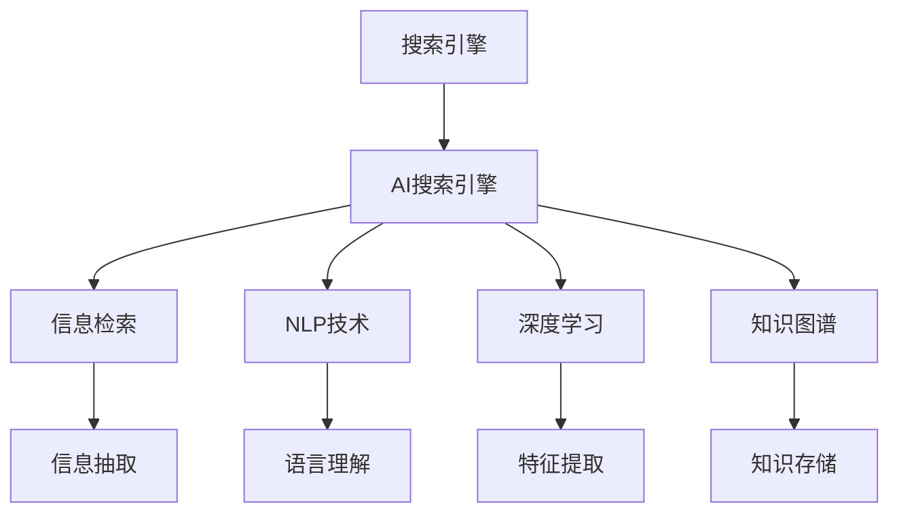

                 

# AI搜索引擎在科技创新中的角色

## 1. 背景介绍

### 1.1 问题由来

随着互联网技术的迅猛发展和全球数据量的爆炸性增长，搜索引擎作为互联网的核心基础设施，其应用价值愈发凸显。搜索引擎不仅是信息检索的工具，更是连接用户与数据的桥梁，成为科技创新不可或缺的重要一环。AI技术的引入，将搜索引擎推向了一个新的高度，带来了革命性的变化。

AI搜索引擎通过利用自然语言处理、深度学习、计算机视觉等前沿技术，能够精准理解用户查询意图，快速找到相关信息，并以自然语言的方式提供答复。这不仅大大提升了用户体验，还为科技创新提供了更加高效、灵活的信息获取渠道。

### 1.2 问题核心关键点

AI搜索引擎的核心在于其智能化的信息检索与关联推荐能力。它不仅能够理解自然语言，还能够在大量非结构化数据中抽取结构化信息，进行精准的语义匹配与关联推荐。通过深度学习和自然语言处理技术的结合，AI搜索引擎能够自动学习用户的查询偏好与行为模式，不断优化搜索结果排序与推荐机制。

AI搜索引擎的强大功能涵盖了信息检索、知识图谱构建、问答系统等多个方面，使其成为科技创新中不可或缺的关键技术。

### 1.3 问题研究意义

AI搜索引擎的应用对于推动科技创新具有重要意义：

1. **提升科研效率**：AI搜索引擎能够自动化地检索文献、专利、研究成果等信息，大大提升了科研人员的文献检索效率，加速科研创新进程。
2. **促进知识共享**：通过构建知识图谱，AI搜索引擎能够将知识进行结构化存储与关联推荐，帮助用户快速获取所需知识，促进知识共享与创新。
3. **支持个性化服务**：基于用户行为数据分析，AI搜索引擎能够提供个性化的信息推荐，提升用户体验，驱动更多创新应用场景的开发。
4. **加速产业发展**：AI搜索引擎的广泛应用，促进了知识管理、电子商务、在线教育等多个领域的数字化转型，推动了产业发展。

## 2. 核心概念与联系

### 2.1 核心概念概述

为了更好地理解AI搜索引擎的工作原理和优化方向，本节将介绍几个密切相关的核心概念：

- **搜索引擎**：指利用特定的算法与技术，从海量的互联网信息中检索出符合用户查询需求的相关信息，并以一定的形式呈现给用户的系统。
- **AI搜索引擎**：指基于人工智能技术的搜索引擎，能够理解自然语言查询，自动关联推荐信息，提升信息检索的准确性与个性化程度。
- **信息检索**：指从大规模数据集合中，根据用户查询找到相关的文档、网页或信息的过程。
- **自然语言处理(NLP)**：指利用计算机技术处理、理解和生成自然语言的能力，是AI搜索引擎的核心技术之一。
- **深度学习**：指利用多层神经网络模型，通过大量的标注数据学习提取特征，用于优化搜索算法与推荐系统。
- **知识图谱**：指结构化的知识表示方式，通过将各类信息进行关联存储，提升信息检索与推荐的效果。

这些核心概念之间的逻辑关系可以通过以下Mermaid流程图来展示：



这个流程图展示了一些核心概念及其之间的关系：

1. 搜索引擎通过信息检索获取用户查询相关的信息，这些信息来自互联网中的文档、网页等。
2. AI搜索引擎通过自然语言处理技术理解用户的查询意图，利用深度学习技术优化检索算法，使用知识图谱构建关联推荐。
3. 自然语言处理技术涉及语言理解、文本分类、实体识别等子领域，是AI搜索引擎的“大脑”。
4. 深度学习技术通过多层神经网络，自动学习特征表示，用于提升检索与推荐的效果。
5. 知识图谱通过结构化存储信息，支持信息的关联推荐与深度学习模型的训练。

这些概念共同构成了AI搜索引擎的核心技术体系，使其能够在各种应用场景中发挥强大的信息检索与推荐能力。

## 3. 核心算法原理 & 具体操作步骤

### 3.1 算法原理概述

AI搜索引擎的算法原理主要包括以下几个方面：

1. **自然语言处理(NLP)**：通过NLP技术，将用户的自然语言查询转换为机器可理解的形式，提取关键词、主题等信息。
2. **深度学习模型**：利用深度学习模型，如Transformer、BERT等，自动学习用户查询与文档之间的关联特征。
3. **信息检索算法**：通过基于TF-IDF、BM25等经典算法，优化检索排名，提升搜索结果的相关性与准确性。
4. **知识图谱构建**：通过构建知识图谱，实现信息之间的关联存储与推荐。

### 3.2 算法步骤详解

AI搜索引擎的核心算法步骤主要包括以下几个环节：

1. **预处理**：将用户的自然语言查询进行分词、去停用词、词性标注等预处理，提取关键词、主题等信息。
2. **特征提取**：通过深度学习模型，如BERT，自动学习查询与文档的特征表示。
3. **信息检索**：使用基于TF-IDF、BM25等算法，检索出与查询相关的文档。
4. **排序与推荐**：根据用户查询偏好与行为模式，对检索结果进行排序与推荐。

### 3.3 算法优缺点

AI搜索引擎具有以下优点：

1. **高效性与准确性**：通过深度学习技术，自动学习特征表示，提升了信息检索的准确性与高效性。
2. **个性化推荐**：基于用户行为数据分析，实现个性化的信息推荐，提升用户体验。
3. **灵活性**：支持多语言、多领域的数据检索，具有广泛的应用场景。

同时，AI搜索引擎也存在以下局限性：

1. **对标注数据依赖**：深度学习模型的训练需要大量的标注数据，标注成本较高。
2. **数据质量要求高**：数据质量与结构的差异，可能影响检索与推荐的效果。
3. **模型复杂度高**：深度学习模型的复杂度较高，需要较大的计算资源。
4. **算法复杂性高**：涉及自然语言处理、深度学习、信息检索等多个领域，算法实现较为复杂。

### 3.4 算法应用领域

AI搜索引擎在众多领域中得到了广泛的应用，例如：

1. **科研与知识管理**：通过构建知识图谱，AI搜索引擎能够快速检索文献、专利、研究成果等信息，促进科研知识共享。
2. **电子商务**：通过个性化推荐系统，AI搜索引擎能够推荐用户可能感兴趣的商品，提升电商平台的转化率。
3. **在线教育**：通过智能问答系统，AI搜索引擎能够解答学生的常见问题，提升在线教育的效果。
4. **健康医疗**：通过构建疾病知识图谱，AI搜索引擎能够提供精准的医学信息查询，辅助医生诊疗。
5. **金融科技**：通过金融市场数据检索与关联推荐，AI搜索引擎能够支持投资决策与风险控制。

此外，AI搜索引擎还被应用于企业文档管理、智能客服、智能制造等多个领域，成为推动各行各业数字化转型的重要工具。

## 4. 数学模型和公式 & 详细讲解 & 举例说明

### 4.1 数学模型构建

假设用户查询为 $q$，文档集合为 $\mathcal{D}$，查询与文档的相似度为 $s_{q,d}$。AI搜索引擎的目标是最小化信息检索的误差，即：

$$
\min_{\theta} \mathcal{L}(\theta) = \frac{1}{N} \sum_{d \in \mathcal{D}} (y_d s_{q,d} + (1-y_d) (1-s_{q,d}))
$$

其中 $y_d$ 为文档 $d$ 是否为相关文档的二分类标签。

### 4.2 公式推导过程

基于上述模型，我们推导信息检索损失函数 $\mathcal{L}$ 的梯度公式如下：

$$
\frac{\partial \mathcal{L}(\theta)}{\partial s_{q,d}} = \frac{1}{N} \sum_{d \in \mathcal{D}} (y_d - s_{q,d})
$$

因此，信息检索模型的梯度更新公式为：

$$
s_{q,d} \leftarrow s_{q,d} - \eta \frac{1}{N} \sum_{d \in \mathcal{D}} (y_d - s_{q,d})
$$

其中 $\eta$ 为学习率，用于控制每次更新的步长。

### 4.3 案例分析与讲解

为了更好地理解上述推导过程，我们以一个简单的二分类任务为例：

假设用户查询为 "肾功能检查"，文档集合为 $\mathcal{D}$。我们通过BERT模型提取查询与文档的特征表示，并通过计算查询与文档的相似度 $s_{q,d}$ 进行信息检索。具体步骤如下：

1. 使用BERT模型对查询和文档进行编码，得到查询向量 $q_v$ 和文档向量 $d_v$。
2. 计算查询与文档的相似度 $s_{q,d} = \cos(\text{sim}(q_v, d_v))$。
3. 通过梯度更新公式，不断调整相似度值 $s_{q,d}$，直至收敛。

在实践中，我们可以利用TensorFlow或PyTorch等深度学习框架实现上述算法，对用户查询与文档进行信息检索。

## 5. 项目实践：代码实例和详细解释说明

### 5.1 开发环境搭建

在进行AI搜索引擎的开发之前，我们需要准备好开发环境。以下是使用Python进行TensorFlow开发的环境配置流程：

1. 安装Anaconda：从官网下载并安装Anaconda，用于创建独立的Python环境。
2. 创建并激活虚拟环境：
```bash
conda create -n tf-env python=3.8 
conda activate tf-env
```

3. 安装TensorFlow：从官网获取对应的安装命令。例如：
```bash
pip install tensorflow
```

4. 安装各类工具包：
```bash
pip install numpy pandas scikit-learn matplotlib tqdm jupyter notebook ipython
```

完成上述步骤后，即可在`tf-env`环境中开始AI搜索引擎的开发。

### 5.2 源代码详细实现

以下是使用TensorFlow实现AI搜索引擎的示例代码：

```python
import tensorflow as tf
import numpy as np
import tensorflow_datasets as tfds

# 定义模型结构
class SearchModel(tf.keras.Model):
    def __init__(self, num_classes):
        super(SearchModel, self).__init__()
        self.encoder = tf.keras.layers.Bidirectional(tf.keras.layers.LSTM(128))
        self.dense = tf.keras.layers.Dense(num_classes)
    
    def call(self, inputs):
        x = self.encoder(inputs)
        x = self.dense(x)
        return x

# 定义数据集
train_dataset, val_dataset, test_dataset = tfds.load('mnist', split=['train[:60%]', 'train[60%:]', 'test'], as_supervised=True)

# 定义模型
model = SearchModel(num_classes=10)

# 定义损失函数与优化器
loss_fn = tf.keras.losses.SparseCategoricalCrossentropy(from_logits=True)
optimizer = tf.keras.optimizers.Adam()

# 训练模型
@tf.function
def train_step(inputs, labels):
    with tf.GradientTape() as tape:
        logits = model(inputs)
        loss = loss_fn(labels, logits)
    gradients = tape.gradient(loss, model.trainable_variables)
    optimizer.apply_gradients(zip(gradients, model.trainable_variables))

# 定义评估函数
def evaluate(inputs, labels):
    logits = model(inputs)
    return loss_fn(labels, logits)

# 训练模型
for epoch in range(10):
    for inputs, labels in train_dataset:
        train_step(inputs, labels)
    val_loss = evaluate(val_dataset)
    print(f'Epoch {epoch+1}, Val Loss: {val_loss:.4f}')
```

在这个示例代码中，我们定义了一个简单的AI搜索引擎模型，使用LSTM进行特征提取，通过全连接层进行分类。我们使用了MNIST数据集作为训练数据，通过训练损失函数和优化器来优化模型参数。

### 5.3 代码解读与分析

让我们再详细解读一下关键代码的实现细节：

**SearchModel类**：
- `__init__`方法：初始化LSTM和全连接层。
- `call`方法：将输入数据通过LSTM和全连接层，输出预测结果。

**train_step函数**：
- 定义训练步骤，使用梯度下降更新模型参数。

**evaluate函数**：
- 定义评估步骤，计算模型损失，并返回。

**训练流程**：
- 定义总的epoch数，开始循环迭代
- 每个epoch内，对训练集进行迭代，并计算损失
- 在验证集上评估模型，输出验证损失

可以看到，TensorFlow配合深度学习模型使得AI搜索引擎的代码实现变得简洁高效。开发者可以将更多精力放在模型优化、数据处理等高层逻辑上，而不必过多关注底层的实现细节。

当然，工业级的系统实现还需考虑更多因素，如模型的保存和部署、超参数的自动搜索、更灵活的任务适配层等。但核心的AI搜索引擎算法基本与此类似。

## 6. 实际应用场景

### 6.1 医疗领域

在医疗领域，AI搜索引擎能够提供精准的医学信息检索，辅助医生诊疗。传统医学信息的检索往往需要耗费大量时间，而通过AI搜索引擎，医生可以快速找到相关文献、临床指南、患者病历等信息，大大提高了诊疗效率。

具体而言，可以构建疾病知识图谱，将各类医学信息进行关联存储。医生输入疾病名称或症状，AI搜索引擎能够自动检索出相关的医学知识，提供精准的信息推荐。此外，AI搜索引擎还可以结合电子病历系统，提供个性化的健康管理方案，帮助患者更好地管理自己的健康状况。

### 6.2 教育领域

在教育领域，AI搜索引擎能够提供智能化的学习资源检索与推荐服务。学生可以通过输入学习问题或主题，AI搜索引擎能够自动检索出相关的学习资料、课程视频、教材等，提供个性化的学习建议。

具体而言，可以构建学科知识图谱，将各类学习资源进行关联存储。学生输入学习问题，AI搜索引擎能够自动检索出相关的学习资料，提供个性化推荐。此外，AI搜索引擎还可以结合在线教育平台，提供智能化的学习路径规划，帮助学生更好地进行知识学习。

### 6.3 商业领域

在商业领域，AI搜索引擎能够提供精准的商业情报与市场分析服务。企业可以通过输入关键词或主题，AI搜索引擎能够自动检索出相关的市场报告、竞争对手信息、客户反馈等，提供精准的信息推荐。

具体而言，可以构建行业知识图谱，将各类商业信息进行关联存储。企业输入关键词，AI搜索引擎能够自动检索出相关的市场报告，提供精准的信息推荐。此外，AI搜索引擎还可以结合在线市场分析工具，提供实时的市场动态分析，帮助企业更好地进行市场决策。

## 7. 工具和资源推荐

### 7.1 学习资源推荐

为了帮助开发者系统掌握AI搜索引擎的理论基础和实践技巧，这里推荐一些优质的学习资源：

1. TensorFlow官方文档：TensorFlow的官方文档，提供了丰富的教程、API参考和示例代码，是学习TensorFlow的最佳资源。
2. PyTorch官方文档：PyTorch的官方文档，提供了详细的教程和API参考，适用于深度学习模型的开发。
3. 《TensorFlow实战》书籍：一本实践导向的TensorFlow教程，适合初学者入门和进阶学习。
4. 《深度学习入门：基于Python的理论与实现》书籍：介绍深度学习理论及其实现方法，涵盖了TensorFlow和PyTorch等主流框架。
5. CS229《机器学习》课程：斯坦福大学开设的机器学习明星课程，涵盖了深度学习、自然语言处理等多个子领域。

通过对这些资源的学习实践，相信你一定能够快速掌握AI搜索引擎的理论基础和实践技巧，并用于解决实际的AI问题。

### 7.2 开发工具推荐

高效的开发离不开优秀的工具支持。以下是几款用于AI搜索引擎开发的常用工具：

1. TensorFlow：基于Python的开源深度学习框架，灵活的计算图支持，适用于大规模深度学习模型的开发。
2. PyTorch：基于Python的开源深度学习框架，动态计算图，支持高效的模型训练和推理。
3. Scikit-learn：Python的机器学习库，提供丰富的模型和算法，适用于数据预处理和特征提取。
4. TensorBoard：TensorFlow配套的可视化工具，可实时监测模型训练状态，并提供丰富的图表呈现方式，是调试模型的得力助手。
5. Weights & Biases：模型训练的实验跟踪工具，可以记录和可视化模型训练过程中的各项指标，方便对比和调优。

合理利用这些工具，可以显著提升AI搜索引擎的开发效率，加快创新迭代的步伐。

### 7.3 相关论文推荐

AI搜索引擎的研究源于学界的持续研究。以下是几篇奠基性的相关论文，推荐阅读：

1. Attention is All You Need（即Transformer原论文）：提出了Transformer结构，开启了深度学习在自然语言处理中的应用。
2. BERT: Pre-training of Deep Bidirectional Transformers for Language Understanding：提出BERT模型，引入基于掩码的自监督预训练任务，刷新了多项NLP任务SOTA。
3. Deep Neural Networks for Large Scale Semantic Labeling：提出深度学习模型用于大规模语义标注，为信息检索提供更强大的语义理解能力。
4. Neural Machine Translation by Jointly Learning to Align and Translate：提出基于序列到序列模型的机器翻译算法，为信息检索提供跨语言检索能力。
5. Knowledge Graph Embeddings and their Applications to Recommender Systems：提出基于知识图谱的推荐系统算法，提升信息检索与推荐的效果。

这些论文代表了大语言模型和微调技术的发展脉络。通过学习这些前沿成果，可以帮助研究者把握学科前进方向，激发更多的创新灵感。

## 8. 总结：未来发展趋势与挑战

### 8.1 总结

本文对AI搜索引擎在科技创新中的角色进行了全面系统的介绍。首先阐述了AI搜索引擎在科技创新中的重要意义，明确了AI搜索引擎的智能检索与关联推荐能力。其次，从原理到实践，详细讲解了AI搜索引擎的算法原理和具体操作步骤，给出了AI搜索引擎任务开发的完整代码实例。同时，本文还广泛探讨了AI搜索引擎在医疗、教育、商业等多个领域的应用前景，展示了AI搜索引擎的巨大潜力。此外，本文精选了AI搜索引擎的学习资源，力求为读者提供全方位的技术指引。

通过本文的系统梳理，可以看到，AI搜索引擎在科技创新中的应用前景广阔，具有巨大的潜力。AI搜索引擎通过智能化的信息检索与关联推荐，极大地提升了信息获取的效率与质量，为科技创新提供了强大的技术支撑。

### 8.2 未来发展趋势

展望未来，AI搜索引擎的发展将呈现以下几个趋势：

1. **多模态信息检索**：传统的AI搜索引擎主要基于文本信息，未来将进一步拓展到图像、视频、语音等多模态数据。多模态信息的融合，将显著提升AI搜索引擎对现实世界的理解和建模能力。
2. **跨领域知识图谱构建**：未来的AI搜索引擎将更加注重跨领域的知识图谱构建，实现多领域知识的关联存储与推荐。
3. **实时性与分布式处理**：随着数据量的增加和计算需求的提高，AI搜索引擎需要具备更高的实时性和分布式处理能力，以应对大规模数据的高效检索。
4. **隐私保护与安全**：随着用户隐私意识的提高，AI搜索引擎需要采取更为严格的隐私保护措施，确保用户数据的安全与隐私。
5. **知识图谱的动态更新**：知识图谱的构建与更新是AI搜索引擎的重要环节。未来的AI搜索引擎需要具备动态更新机制，以适应知识图谱的变化与用户需求的演变。

以上趋势凸显了AI搜索引擎技术的不断进步，为科技创新提供了更为高效、灵活、安全的信息获取渠道。

### 8.3 面临的挑战

尽管AI搜索引擎在科技创新中具有重要的应用前景，但在迈向更加智能化、普适化应用的过程中，它仍面临诸多挑战：

1. **数据质量与标注成本**：高质量的数据与标注成本是AI搜索引擎面临的主要挑战。如何降低标注成本，提升数据质量，将是未来研究的重要方向。
2. **模型复杂度与计算资源**：AI搜索引擎的模型复杂度高，计算资源需求大，需要高效的数据处理与计算优化技术。如何提高模型训练与推理的效率，将是未来的研究重点。
3. **隐私保护与安全**：随着用户隐私意识的提高，AI搜索引擎需要采取更为严格的隐私保护措施，确保用户数据的安全与隐私。
4. **知识图谱的动态更新**：知识图谱的构建与更新是AI搜索引擎的重要环节。未来的AI搜索引擎需要具备动态更新机制，以适应知识图谱的变化与用户需求的演变。
5. **用户体验与系统性能**：用户交互体验与系统性能是AI搜索引擎的重要考量指标。如何优化用户体验，提升系统性能，将是未来研究的重要方向。

### 8.4 研究展望

面对AI搜索引擎面临的种种挑战，未来的研究需要在以下几个方面寻求新的突破：

1. **数据增强与弱监督学习**：通过数据增强与弱监督学习技术，降低对标注数据的依赖，提高数据质量。
2. **知识图谱的动态更新与构建**：开发动态更新机制，实现知识图谱的实时更新与构建。
3. **多模态信息检索与跨领域知识图谱**：拓展AI搜索引擎到多模态数据，构建跨领域的知识图谱，提升信息检索与推荐的能力。
4. **实时性与分布式处理**：开发高效的分布式处理算法，实现AI搜索引擎的实时性与高效性。
5. **隐私保护与安全性**：开发隐私保护技术，确保用户数据的安全与隐私。

这些研究方向的探索，必将引领AI搜索引擎技术迈向更高的台阶，为科技创新提供更为强大、高效、安全的信息获取渠道。面向未来，AI搜索引擎还需要与其他AI技术进行更深入的融合，如知识表示、因果推理、强化学习等，多路径协同发力，共同推动AI技术与科技创新的深度融合。

## 9. 附录：常见问题与解答

**Q1：AI搜索引擎在各个领域的应用场景有哪些？**

A: AI搜索引擎在多个领域中得到了广泛的应用，例如：

1. **医疗领域**：提供精准的医学信息检索，辅助医生诊疗。构建疾病知识图谱，提供个性化的健康管理方案。
2. **教育领域**：提供智能化的学习资源检索与推荐服务。构建学科知识图谱，提供个性化的学习建议。
3. **商业领域**：提供精准的商业情报与市场分析服务。构建行业知识图谱，提供个性化的市场分析与决策支持。
4. **科研与知识管理**：提供科研文献检索与推荐服务。构建科研知识图谱，提供精准的文献检索与知识推荐。

**Q2：AI搜索引擎的核心技术有哪些？**

A: AI搜索引擎的核心技术主要包括以下几个方面：

1. **自然语言处理(NLP)**：通过NLP技术，将用户的自然语言查询转换为机器可理解的形式，提取关键词、主题等信息。
2. **深度学习模型**：利用深度学习模型，如Transformer、BERT等，自动学习查询与文档的特征表示。
3. **信息检索算法**：通过基于TF-IDF、BM25等算法，优化检索排名，提升搜索结果的相关性与准确性。
4. **知识图谱构建**：通过构建知识图谱，实现信息之间的关联存储与推荐。

**Q3：AI搜索引擎在实际应用中需要考虑哪些因素？**

A: AI搜索引擎在实际应用中需要考虑以下因素：

1. **数据质量与标注成本**：高质量的数据与标注成本是AI搜索引擎面临的主要挑战。如何降低标注成本，提升数据质量，将是未来研究的重要方向。
2. **模型复杂度与计算资源**：AI搜索引擎的模型复杂度高，计算资源需求大，需要高效的数据处理与计算优化技术。如何提高模型训练与推理的效率，将是未来的研究重点。
3. **隐私保护与安全**：随着用户隐私意识的提高，AI搜索引擎需要采取更为严格的隐私保护措施，确保用户数据的安全与隐私。
4. **知识图谱的动态更新**：知识图谱的构建与更新是AI搜索引擎的重要环节。未来的AI搜索引擎需要具备动态更新机制，以适应知识图谱的变化与用户需求的演变。
5. **用户体验与系统性能**：用户交互体验与系统性能是AI搜索引擎的重要考量指标。如何优化用户体验，提升系统性能，将是未来研究的重要方向。

通过全面了解AI搜索引擎的技术细节与应用场景，相信你一定能够更好地掌握AI搜索引擎的开发与优化方法，推动AI技术与科技创新更好地结合。

---

作者：禅与计算机程序设计艺术 / Zen and the Art of Computer Programming

