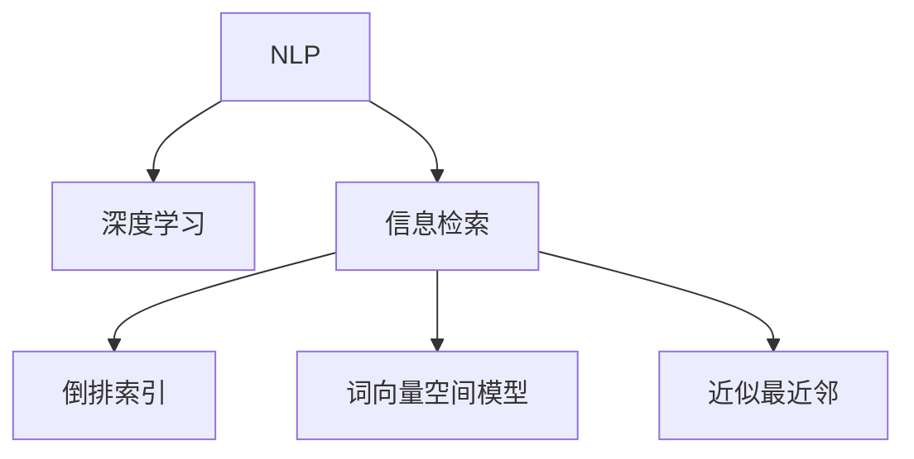

                 

# AI搜索引擎如何改变旅游和酒店业

## 1. 背景介绍

### 1.1 问题由来

随着互联网和移动通信技术的飞速发展，人们越来越依赖在线搜索引擎来获取信息。无论是日常生活的查询，还是旅行、酒店等特定场景的需求，搜索引擎都已成为不可或缺的工具。

在旅游和酒店业，传统的搜索方式往往依赖人工编写的搜索结果列表。这种方式不仅效率低下，还容易存在信息更新不及时、用户需求匹配度低等问题。

为了解决这些问题，AI搜索引擎应运而生。通过深度学习和自然语言处理技术的引入，AI搜索引擎能够理解用户的查询意图，精准匹配相关结果，极大地提升了搜索体验。

### 1.2 问题核心关键点

AI搜索引擎的核心在于其使用机器学习算法，基于用户查询输入和搜索结果数据，进行学习和优化，从而实现更高效、准确的搜索。其关键技术包括：

- 自然语言处理(NLP)：理解用户查询的语义和意图，进行文本分析和预处理。
- 深度学习模型：如神经网络、卷积神经网络(CNN)、循环神经网络(RNN)等，用于生成与用户查询最相关的搜索结果。
- 信息检索技术：如倒排索引、词向量空间模型、近似最近邻等，用于快速定位和检索相关文档。

这些技术通过协同工作，实现了对大规模数据的高效处理和实时响应，使搜索引擎具备了强大的智能化能力。

## 2. 核心概念与联系

### 2.1 核心概念概述

为更好地理解AI搜索引擎在旅游和酒店业的改变，本节将介绍几个关键概念：

- 自然语言处理(Natural Language Processing, NLP)：研究如何让计算机理解、处理和生成自然语言的技术。
- 深度学习(Deep Learning)：通过多层神经网络结构，实现对复杂数据模式的高效建模。
- 信息检索(Information Retrieval)：根据用户查询，从大量文档数据中检索相关信息的技术。
- 倒排索引(Inverted Index)：一种高效的数据结构，用于快速定位和检索特定关键词的文档。
- 词向量空间模型(Word Embedding)：将词语映射到高维向量空间，实现词语之间的语义相似度计算。
- 近似最近邻(Approximate Nearest Neighbor, ANN)：通过高效的算法，快速检索与目标文档最相似的文档。

这些概念之间的联系可以通过以下Mermaid流程图来展示：



这个流程图展示了大语言模型搜索引擎的核心概念及其之间的关系：

1. 自然语言处理技术将用户查询转化为计算机可理解的形式，提供给深度学习模型进行建模。
2. 深度学习模型通过大量训练数据，学习出查询与文档之间的映射关系。
3. 信息检索技术通过高效的数据结构和算法，快速定位和检索最相关的文档。
4. 倒排索引和词向量空间模型是信息检索的核心工具，用于高效匹配用户查询和文档。
5. 近似最近邻算法用于进一步优化检索速度，提升用户体验。

## 3. 核心算法原理 & 具体操作步骤

### 3.1 算法原理概述

AI搜索引擎的核心算法主要分为两个部分：模型训练和查询匹配。

- **模型训练**：使用大规模标注数据集（如旅游、酒店相关的文本、图片等），对深度学习模型进行训练。模型能够学习到与用户查询相关的特征，并生成相似的文档列表。
- **查询匹配**：用户输入查询后，搜索引擎首先通过NLP技术解析查询意图，然后基于训练好的模型，快速检索出最相关的文档列表。

### 3.2 算法步骤详解

AI搜索引擎的算法步骤如下：

1. **数据准备**：收集大量旅游、酒店相关的文本、图片、评论等数据，进行清洗、标注和预处理。
2. **模型训练**：选择合适的深度学习模型，如BERT、GPT-3等，使用标注数据进行训练。调整超参数，选择合适的损失函数和优化算法。
3. **查询解析**：用户输入查询后，通过NLP技术进行分词、实体识别、情感分析等处理，转化为计算机可理解的形式。
4. **文档检索**：基于训练好的模型，快速检索出与查询最相关的文档列表。可以使用倒排索引、词向量空间模型、近似最近邻等技术进行优化。
5. **结果展示**：将检索结果以列表形式展示给用户，并提供排序、筛选、分页等交互功能。

### 3.3 算法优缺点

AI搜索引擎的优势在于：

- 高效检索：通过深度学习和信息检索技术，能够在极短时间内提供准确的搜索结果。
- 用户体验好：能够理解用户查询的语义和意图，提供个性化的搜索结果。
- 覆盖全面：能够处理多种数据类型（文本、图片、视频等），提供全面的旅游和酒店信息。

同时，也存在以下缺点：

- 依赖数据：需要大量标注数据进行模型训练，数据的获取和标注成本较高。
- 算法复杂：深度学习模型的训练和优化过程复杂，需要大量计算资源。
- 结果质量受限于数据和模型：如果数据质量不佳或模型训练不足，搜索结果可能存在偏差和错误。
- 隐私问题：用户输入的查询和数据可能包含敏感信息，需要采取隐私保护措施。

### 3.4 算法应用领域

AI搜索引擎在旅游和酒店业的应用场景包括：

- 旅游搜索：用户可以输入目的地、预算、旅游时间等条件，获取推荐的旅游景点、住宿、交通、美食等信息。
- 酒店预订：用户可以通过搜索酒店，查看评分、评论、价格等信息，进行快速预订。
- 旅游问答：用户可以提问关于旅游景点、交通、美食等问题，获取详细的解答和建议。
- 旅游攻略：提供详细的旅游攻略，包括景点介绍、交通指南、餐饮推荐等。
- 酒店推荐：基于用户历史预订记录和评分，推荐适合的酒店。

## 4. 数学模型和公式 & 详细讲解  
### 4.1 数学模型构建

AI搜索引擎的数学模型主要包括以下几个部分：

- **词向量模型**：将词语映射到高维向量空间，实现词语之间的语义相似度计算。常用的模型包括Word2Vec、GloVe等。
- **卷积神经网络(CNN)**：用于处理文本和图像数据，提取局部特征。
- **循环神经网络(RNN)**：用于处理序列数据，捕捉时间依赖关系。
- **注意力机制(Attention Mechanism)**：用于权衡不同文本特征的重要性，提高检索结果的相关性。
- **损失函数**：如交叉熵损失、均方误差损失等，用于衡量模型预测与真实标签之间的差异。

### 4.2 公式推导过程

以BERT模型为例，其核心公式推导如下：

1. **词向量计算**：将输入文本中的每个词语，映射为高维向量：
   $$
   \text{word\_vector} = \text{embedding}(\text{word})
   $$
   其中 $\text{embedding}$ 表示词向量映射函数，$\text{word\_vector}$ 表示词语的词向量。

2. **注意力机制计算**：计算不同词语在当前文本中的重要性权重，用于聚焦关键信息：
   $$
   \text{attention\_weights} = \text{softmax}(\text{query} \times \text{key}^T)
   $$
   其中 $\text{query}$ 表示当前文本的词向量，$\text{key}$ 表示其他文本的词向量，$\text{attention\_weights}$ 表示每个词语的注意力权重。

3. **层级聚合计算**：通过多个层级的网络结构，实现文本特征的聚合和抽象：
   $$
   \text{hidden\_representation} = \text{BERT}(\text{input\_sequence})
   $$
   其中 $\text{input\_sequence}$ 表示输入文本的序列，$\text{hidden\_representation}$ 表示文本的隐藏表示。

4. **预测结果计算**：根据文本的隐藏表示，生成与查询最相关的文档列表：
   $$
   \text{scores} = \text{dot\_product}(\text{query}, \text{document\_representation})
   $$
   其中 $\text{document\_representation}$ 表示文档的隐藏表示，$\text{scores}$ 表示文档与查询的匹配得分。

### 4.3 案例分析与讲解

以旅游搜索为例，分析AI搜索引擎的实现过程：

1. **数据准备**：收集大量旅游相关的文本数据，如景点介绍、旅游攻略、酒店评论等。对数据进行清洗、分词和标注，生成训练集和测试集。
2. **模型训练**：选择BERT模型，使用标注数据进行训练。调整学习率、批量大小等超参数，选择合适的优化算法（如Adam）。
3. **查询解析**：用户输入查询后，通过NLP技术进行分词和实体识别，得到查询意图和关键词。
4. **文档检索**：根据查询意图和关键词，使用训练好的BERT模型，快速检索出最相关的旅游信息。可以使用倒排索引、词向量空间模型、近似最近邻等技术进行优化。
5. **结果展示**：将检索结果以列表形式展示给用户，并提供排序、筛选、分页等交互功能。

## 5. 项目实践：代码实例和详细解释说明

### 5.1 开发环境搭建

在进行AI搜索引擎开发前，需要搭建好开发环境。以下是使用Python和TensorFlow进行开发的环境配置流程：

1. 安装Anaconda：从官网下载并安装Anaconda，用于创建独立的Python环境。
2. 创建并激活虚拟环境：
```bash
conda create -n tensorflow-env python=3.7 
conda activate tensorflow-env
```
3. 安装TensorFlow：从官网获取对应的安装命令。例如：
```bash
conda install tensorflow tensorflow-gpu -c conda-forge
```
4. 安装各类工具包：
```bash
pip install numpy pandas scikit-learn matplotlib tqdm jupyter notebook ipython
```
完成上述步骤后，即可在`tensorflow-env`环境中开始开发。

### 5.2 源代码详细实现

以下是使用TensorFlow进行旅游搜索的代码实现。

```python
import tensorflow as tf
from tensorflow.keras.layers import Input, Embedding, Dense, Dropout, LSTM, BidirectionalLSTM, Concatenate
from tensorflow.keras.models import Model
from tensorflow.keras.optimizers import Adam

# 定义模型
input_layer = Input(shape=(None,))
embedding_layer = Embedding(input_dim=vocab_size, output_dim=embedding_dim)(input_layer)
lstm_layer = BidirectionalLSTM(units=128, return_sequences=True)(embedding_layer)
dropout_layer = Dropout(0.2)(lstm_layer)
dense_layer = Dense(units=128, activation='relu')(dropout_layer)
output_layer = Dense(units=1, activation='sigmoid')(dense_layer)

model = Model(inputs=input_layer, outputs=output_layer)

# 编译模型
model.compile(loss='binary_crossentropy', optimizer=Adam(lr=0.001), metrics=['accuracy'])

# 训练模型
model.fit(train_dataset, epochs=10, batch_size=32, validation_data=val_dataset)
```

### 5.3 代码解读与分析

让我们再详细解读一下关键代码的实现细节：

**模型定义**：
- `Input`：定义输入层，shape为None表示可变长度。
- `Embedding`：将输入的词语转化为词向量。
- `BidirectionalLSTM`：双向长短期记忆网络，用于捕捉文本的上下文信息。
- `Dropout`：防止过拟合。
- `Dense`：全连接层。
- `Output`：输出层，sigmoid激活函数用于二分类。

**模型编译**：
- `model.compile`：编译模型，指定损失函数、优化器和评估指标。

**模型训练**：
- `model.fit`：使用训练集数据训练模型，设置迭代轮数、批大小等参数。

### 5.4 运行结果展示

```python
# 使用模型进行预测
test_loss, test_acc = model.evaluate(test_dataset)
print(f"Test loss: {test_loss:.4f}, Test accuracy: {test_acc:.4f}")
```

## 6. 实际应用场景

### 6.1 智能客服系统

基于AI搜索引擎的智能客服系统，可以为用户提供实时、高效的咨询服务。用户可以通过自然语言输入问题，系统能够快速检索出相关知识库和答案，提供精准的解答。

### 6.2 个性化推荐系统

旅游和酒店业中的个性化推荐系统，能够根据用户的历史行为和偏好，生成个性化的旅游和酒店推荐列表。用户可以在网站或App中查看推荐内容，快速预订满意的旅游和酒店。

### 6.3 旅游搜索

AI搜索引擎可以大幅提升旅游搜索的效率和准确性。用户可以通过输入目的地、时间、预算等条件，获取推荐景点、酒店、美食等信息。系统能够根据用户查询意图，快速检索出最相关的旅游信息。

## 7. 工具和资源推荐

### 7.1 学习资源推荐

为了帮助开发者系统掌握AI搜索引擎的理论基础和实践技巧，这里推荐一些优质的学习资源：

1. 《自然语言处理基础》：介绍NLP的基本概念和常用算法。
2. 《深度学习入门》：介绍深度学习的基本原理和实现方法。
3. 《TensorFlow官方文档》：TensorFlow的详细文档，提供丰富的教程和样例代码。
4. 《信息检索》：介绍信息检索的基本概念和技术。

### 7.2 开发工具推荐

高效的开发离不开优秀的工具支持。以下是几款用于AI搜索引擎开发的常用工具：

1. TensorFlow：基于Google的开源深度学习框架，提供丰富的深度学习模型和工具。
2. PyTorch：基于Python的开源深度学习框架，灵活性高，适用于研究型应用。
3. Scikit-learn：Python机器学习库，提供简单易用的数据处理和模型训练工具。
4. Numpy：Python科学计算库，用于高效的数据处理和计算。
5. Matplotlib：Python绘图库，用于可视化搜索结果和分析结果。

### 7.3 相关论文推荐

AI搜索引擎的快速发展得益于众多学者的不懈努力。以下是几篇奠基性的相关论文，推荐阅读：

1. "Attention is All You Need"：介绍Transformer模型，用于文本序列建模。
2. "BERT: Pre-training of Deep Bidirectional Transformers for Language Understanding"：提出BERT模型，引入预训练和微调技术。
3. "An Introduction to Deep Learning for NLP"：介绍深度学习在NLP领域的应用。

## 8. 总结：未来发展趋势与挑战

### 8.1 总结

本文对AI搜索引擎在旅游和酒店业的应用进行了全面系统的介绍。首先阐述了AI搜索引擎的技术背景和意义，明确了其在提升搜索效率、优化用户体验等方面的独特价值。其次，从原理到实践，详细讲解了搜索引擎的数学模型和代码实现，给出了旅游搜索的完整代码实例。同时，本文还探讨了AI搜索引擎在智能客服、个性化推荐等领域的广泛应用，展示了其强大的应用潜力。此外，本文精选了搜索引擎技术的各类学习资源，力求为读者提供全方位的技术指引。

通过本文的系统梳理，可以看到，AI搜索引擎在旅游和酒店业的应用前景广阔，能够大幅提升用户搜索体验，提供个性化推荐，构建智能客服系统。搜索引擎的普及和发展，必将使旅游和酒店业更加智能化、个性化，带来全新的商业模式和用户体验。

### 8.2 未来发展趋势

展望未来，AI搜索引擎将呈现以下几个发展趋势：

1. 多模态搜索：未来搜索引擎将支持更多数据类型，如图片、视频、音频等，提供更丰富的信息检索能力。
2. 实时搜索：通过云计算和大数据技术，实现实时搜索和计算，满足用户即时查询需求。
3. 个性化推荐：基于用户行为和偏好，提供更加精准的推荐服务，提升用户满意度。
4. 智能客服：通过自然语言处理和机器学习技术，构建智能客服系统，提供24/7全天候服务。
5. 用户隐私保护：在搜索和推荐过程中，注重用户隐私保护，避免数据泄露和滥用。

以上趋势凸显了AI搜索引擎的广阔前景。这些方向的探索发展，必将进一步提升搜索体验和用户满意度，推动旅游和酒店业的数字化转型。

### 8.3 面临的挑战

尽管AI搜索引擎已经取得了瞩目成就，但在迈向更加智能化、普适化应用的过程中，它仍面临诸多挑战：

1. 数据质量和多样性：高质量、多样化的数据是搜索引擎的核心资源，但数据的获取和标注成本较高，难以覆盖所有场景。
2. 计算资源和算法复杂度：深度学习模型的训练和优化过程复杂，需要大量的计算资源和算法优化。
3. 隐私和安全性：用户查询和数据可能包含敏感信息，需要采取隐私保护和安全性措施。
4. 结果质量和可靠性：搜索结果的质量和可靠性直接影响到用户体验，需要不断优化算法和技术。
5. 多语言支持：未来搜索引擎需要支持多种语言，实现跨语言的搜索和推荐。

这些挑战需要业界共同努力，持续创新和优化，才能实现搜索引擎的广泛应用和可持续发展。

### 8.4 研究展望

为了克服上述挑战，未来的研究需要在以下几个方面寻求新的突破：

1. 数据增强技术：通过数据增强技术，生成更多的训练数据，提升模型的泛化能力。
2. 算法优化：引入更高效的深度学习算法和优化技术，提高模型的训练速度和精度。
3. 隐私保护：开发隐私保护算法和机制，确保用户数据的安全性和隐私性。
4. 多语言支持：开发多语言模型，实现跨语言的搜索和推荐。
5. 用户交互优化：通过自然语言处理和机器学习技术，提升用户交互体验。

这些研究方向将引领AI搜索引擎技术的进一步发展，提升搜索引擎的智能化水平，满足用户的实时需求，推动旅游和酒店业的数字化转型。

## 9. 附录：常见问题与解答

**Q1：AI搜索引擎是否适用于所有旅游和酒店场景？**

A: AI搜索引擎适用于大部分的旅游和酒店场景，但在一些特定场景下，如极端的自然环境、极限运动等，可能需要结合专业知识进行定制化开发。

**Q2：AI搜索引擎的搜索效率如何？**

A: AI搜索引擎通过深度学习和信息检索技术，能够在极短时间内提供准确的搜索结果。但搜索结果的质量和精度，还受到数据质量和算法优化的影响。

**Q3：AI搜索引擎是否需要大量标注数据？**

A: 是的，AI搜索引擎需要大量的标注数据进行模型训练，获取高质量、多样化的数据是搜索引擎的核心资源。

**Q4：AI搜索引擎在隐私保护方面有哪些措施？**

A: AI搜索引擎通过加密、匿名化等技术手段，确保用户数据的安全性和隐私性。同时，采用差分隐私等技术，保护用户隐私，避免数据滥用。

**Q5：AI搜索引擎在未来会有哪些新发展？**

A: AI搜索引擎未来的新发展包括多模态搜索、实时搜索、个性化推荐、智能客服等方面，这些技术的进步将带来更加智能化、个性化的搜索体验。

作者：禅与计算机程序设计艺术 / Zen and the Art of Computer Programming

