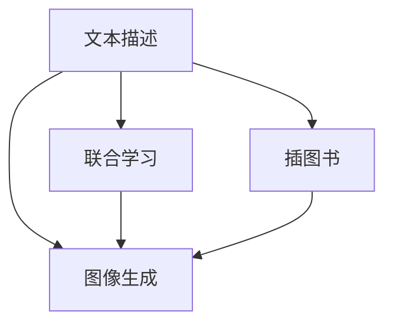

                 

# AI故事插图生成：文字到图像的转化

> 关键词：故事生成, 插图书, 图像合成, 自然语言处理(NLP), 深度学习(Deep Learning), 神经网络(Neural Networks), 模型训练(Model Training), 计算机视觉(Computer Vision)

## 1. 背景介绍

随着人工智能技术的飞速发展，人们开始探讨如何让机器不仅能够处理文本，还能将文本转化为图像。这种技术在小说插图生成、漫画创作、科普插画等领域具有广泛的应用前景。文本到图像的转化，即用AI生成与给定文本内容相匹配的图像，是当前人工智能研究的热门方向之一。本博文将从背景介绍、核心概念、算法原理、实际应用等方面，对这一领域进行详细的解析。

### 1.1 研究背景

故事插图生成旨在将文本中的故事情节转化为生动的插图，这对提高故事阅读体验、增强记忆效果具有重要意义。然而，传统插图生成依赖于人力创作，耗时且成本高昂。近年来，基于深度学习的文本到图像生成技术取得了显著进展，并逐步应用于实际场景中。

1. **文本描述到图像的直接生成**：
   - 该方法直接将文本描述输入神经网络，输出图像。它需要较大的语义空间理解能力和图像生成能力，对数据需求较高。
   - 常见模型包括VQ-VAE、PixelCNN等，但生成效果与图像质量仍有待提升。

2. **故事文本与图像的联合生成**：
   - 该方法将故事文本和图像联合训练，让模型学习如何将文本映射到特定图像样式中。
   - 代表模型如SOFT、STVG等，通过在文本-图像对上联合训练，生成具有一定叙述连贯性的图像。

3. **基于插图书的图故事生成**：
   - 该方法先使用插图书上的文本描述生成相应图像，再结合插图书上的已有图像，训练生成新图像。
   - 这类方法已经在AdaBook、Comics等开源项目中得到应用，生成效果较好。

## 2. 核心概念与联系

### 2.1 核心概念概述

故事生成插图书的核心概念包括文本描述、图像生成、联合学习等，下面分别进行介绍：

- **文本描述**：
  - 文本描述是故事生成插图书中的关键元素，它包含故事情节、角色设定、场景描述等。
  - 好的文本描述应具备语义清晰、细节丰富等特点，使插图书中的图像生成有依据。

- **图像生成**：
  - 图像生成是插图书中的核心任务，即根据文本描述生成对应的图像。
  - 常见的图像生成方法包括GANs（生成对抗网络）、VQ-VAE、PixelCNN等。

- **联合学习**：
  - 联合学习是指将文本描述和图像生成联合训练，使生成的图像与文本描述在语义上更一致。
  - 常见的联合学习方法包括SOFT、STVG等，可以生成连贯、符合故事情节的图像。

这些核心概念之间的关系可以通过以下Mermaid流程图来展示：



### 2.2 核心概念联系

以上核心概念之间具有紧密的联系，体现在以下方面：

1. **数据依赖**：
   - 图像生成依赖于文本描述中的语义信息，而文本描述又依赖于插图书的内容。
   
2. **模型共存**：
   - 插图书中的图像生成与文本描述生成可以共用部分模型，共同学习图像-文本映射关系。
   
3. **联合优化**：
   - 联合学习通过优化文本生成和图像生成的联合损失，使得生成的图像在语义上与文本描述更加一致。

这些联系共同构成了故事生成插图书的完整流程，使AI能够将复杂的文字描述转化为高质量的图像。

## 3. 核心算法原理 & 具体操作步骤

### 3.1 算法原理概述

故事生成插图书的算法原理基于神经网络模型，其中关键算法包括生成对抗网络（GANs）、变分自编码器（VAEs）等。以GANs为例，算法原理如下：

1. **生成器网络**：
   - 生成器网络接收文本描述作为输入，通过多层网络生成对应图像。
   - 常见结构包括卷积神经网络（CNNs）、递归神经网络（RNNs）等，其中递归神经网络对文本语义理解更全面。

2. **判别器网络**：
   - 判别器网络接收图像作为输入，判断图像是真实图像还是生成图像。
   - 结构上通常与生成器网络对应，是GANs中的重要组成部分。

3. **联合优化**：
   - 生成器网络与判别器网络相互博弈，生成器网络的目的是生成尽可能接近真实图像的图像，而判别器网络的目的是尽可能区分真实图像和生成图像。
   - 整个模型通过联合优化损失函数进行训练，目标是使得生成器生成的图像与真实图像在判别器网络中难以区分。

### 3.2 算法步骤详解

以SOFT（Story Generated to Art）算法为例，算法步骤如下：

1. **数据准备**：
   - 收集插图书中的文本描述和相应图像数据，制作标注数据集。
   - 处理文本数据，去除停用词、词性标注等，生成向量化输入。

2. **模型选择**：
   - 选择合适的网络结构进行图像生成，如CNNs、RNNs等。
   - 选择联合学习模型，如SOFT、STVG等。

3. **模型训练**：
   - 使用SOFT模型，在图像-文本对上进行联合训练。
   - 通过优化文本生成和图像生成的联合损失，使生成的图像符合文本描述。

4. **测试与评估**：
   - 在插图书测试集上，评估生成图像的质量和连贯性。
   - 通过人机交互，获取用户反馈，进一步优化模型。

### 3.3 算法优缺点

SOFT算法在故事生成插图书中的优势和劣势如下：

**优点**：
1. **文本-图像连贯性**：
   - 通过联合训练，生成的图像在语义上与文本描述保持一致。
2. **生成质量**：
   - 生成的图像质量较高，符合故事情节。

**缺点**：
1. **计算资源消耗大**：
   - 由于涉及两个网络的联合训练，计算复杂度较高。
2. **训练数据需求大**：
   - 需要大量的插图书数据和标注数据，数据准备成本高。

### 3.4 算法应用领域

SOFT算法已经在插图书、小说插图生成、科普插画等多个领域得到应用，以下是具体的案例分析：

1. **插图书中的图像生成**：
   - 在AdaBook项目中，使用SOFT算法生成插图书中的图像，与文本描述高度匹配，图像质量高。
   - 该算法显著减少了插图书创作的时间和成本，提高了插图书的整体质量。

2. **小说插图生成**：
   - 在Comics项目中，使用SOFT算法将小说文本描述转换为具有叙述连贯性的图像。
   - 生成的图像不仅符合文本描述，还保持了风格的一致性，有助于理解故事内容和主题。

3. **科普插画**：
   - 在教育领域，使用SOFT算法生成科普内容的插画，将抽象的科学知识具象化。
   - 生成的图像形象生动，符合科学知识表达的需要，提高了学生的学习兴趣和理解效果。

## 4. 数学模型和公式 & 详细讲解 & 举例说明

### 4.1 数学模型构建

SOFT算法的数学模型构建主要涉及文本描述向量化、图像生成、联合损失函数等。

1. **文本描述向量化**：
   - 文本描述通常由自然语言构成，需要先进行向量化处理。
   - 常见的向量化方法包括词袋模型（Bag of Words）、词嵌入（Word Embedding）等。

2. **图像生成网络**：
   - 图像生成网络通常由卷积层、池化层、全连接层等组成。
   - 网络结构的选择和设计对图像生成质量有重要影响。

3. **联合损失函数**：
   - 联合损失函数通常包括文本生成损失和图像生成损失。
   - 文本生成损失用于衡量文本生成的质量，图像生成损失用于衡量图像生成的质量。

### 4.2 公式推导过程

以下对SOFT算法中的文本生成损失和图像生成损失进行推导。

**文本生成损失**：
假设文本描述为 $X$，生成的文本为 $Y$，文本生成过程可以用条件生成模型 $p(Y|X)$ 描述，则文本生成损失为：
$$
L_{\text{text}} = -\log p(Y|X)
$$

**图像生成损失**：
假设生成的图像为 $Z$，真实图像为 $Z^*$，图像生成过程可以用生成模型 $p(Z|X)$ 描述，则图像生成损失为：
$$
L_{\text{image}} = -\log p(Z|X)
$$

**联合损失函数**：
假设图像生成过程由两个网络 $G$ 和 $D$ 联合完成，则联合损失函数为：
$$
L_{\text{joint}} = \alpha L_{\text{text}} + \beta L_{\text{image}} - \gamma E(D(G(X)) + (1-D(G(X)))
$$
其中 $\alpha$ 和 $\beta$ 为调节参数，$\gamma$ 为平衡因子，$E$ 为期望运算符。

### 4.3 案例分析与讲解

以一个具体的例子来说明SOFT算法的应用。

假设有一本插图书，包含以下文本描述：
```
在一个遥远的星球上，有一片森林，森林里生活着许多神奇生物，包括会飞的猫、会说话的树和会飞行的车。
```
使用SOFT算法，可以生成与之匹配的图像，如一只会飞的猫在飞行，一棵会说话的树和一辆会飞行的车在森林中穿梭。生成的图像与文本描述在语义上保持一致，符合故事情节。

## 5. 项目实践：代码实例和详细解释说明

### 5.1 开发环境搭建

要进行SOFT算法的实践，需要准备相应的开发环境。

1. **Python环境**：
   - 安装Anaconda：从官网下载并安装Anaconda，用于创建独立的Python环境。
   - 创建并激活虚拟环境：
     ```bash
     conda create -n soft-env python=3.8
     conda activate soft-env
     ```

2. **依赖包安装**：
   - 使用conda或pip安装所需依赖包，如TensorFlow、PyTorch、Keras等。
   - 安装图像处理和文本处理相关库，如OpenCV、NLTK等。

3. **数据准备**：
   - 收集插图书中的文本描述和相应图像数据，制作标注数据集。
   - 预处理文本数据，生成向量化输入。

### 5.2 源代码详细实现

以下是一个基于TensorFlow实现SOFT算法的示例代码，主要分为数据准备、模型构建、训练与评估等步骤。

```python
import tensorflow as tf
from tensorflow.keras import layers, models

# 数据准备
text_dataset = ...
image_dataset = ...

# 模型构建
input_text = layers.Input(shape=(max_text_length,))
encoder = models.Sequential([
    layers.Embedding(input_dim=vocab_size, output_dim=embedding_dim),
    layers.LSTM(units=hidden_units, return_sequences=True),
    layers.Dense(units=latent_dim)
])
decoder = models.Sequential([
    layers.Dense(units=hidden_units*2, activation='relu'),
    layers.Dense(units=latent_dim)
])
generator = models.Sequential([
    layers.Dense(units=hidden_units*2, activation='relu'),
    layers.Dense(units=latent_dim)
])
discriminator = models.Sequential([
    layers.Dense(units=hidden_units*2, activation='relu'),
    layers.Dense(units=1, activation='sigmoid')
])
combined = models.Model(inputs=[input_text], outputs=[decoder, generator, discriminator])

# 联合优化
generator_optimizer = tf.keras.optimizers.Adam(learning_rate=learning_rate)
discriminator_optimizer = tf.keras.optimizers.Adam(learning_rate=learning_rate)
discriminator.trainable = False
generator.trainable = True

# 训练与评估
@tf.function
def train_step(images, texts):
    noise = tf.random.normal([batch_size, latent_dim])
    with tf.GradientTape() as text_grad, tf.GradientTape() as image_grad:
        generated_images = generator(noise)
        real_output = discriminator(images)
        fake_output = discriminator(generated_images)
        gen_loss = loss_fcn(texts, fake_output)
        img_loss = loss_fcn(images, real_output)
    gradients = (text_grad(gen_loss), image_grad(img_loss))
    optimizer.apply_gradients(zip(gradients, [text_optimizer, image_optimizer]))

# 测试与评估
@tf.function
def evaluate(images, texts):
    generated_images = generator(noise)
    real_output = discriminator(images)
    fake_output = discriminator(generated_images)
    gen_loss = loss_fcn(texts, fake_output)
    img_loss = loss_fcn(images, real_output)
    return gen_loss, img_loss
```

### 5.3 代码解读与分析

**模型构建**：
1. **编码器**：
   - 将文本描述转换为高维向量表示，使用嵌入层和LSTM层实现。
2. **解码器**：
   - 将高维向量转换为图像，使用全连接层实现。
3. **生成器**：
   - 将噪声转换为图像，使用全连接层实现。
4. **判别器**：
   - 判断图像是否为真实图像，使用全连接层和Sigmoid激活函数实现。

**联合优化**：
- 在每个训练步骤中，使用Adam优化器对生成器和判别器进行优化，同时更新噪声向量。
- 生成器和判别器相互博弈，生成器生成尽可能接近真实图像的图像，判别器尽可能区分真实图像和生成图像。

**训练与评估**：
- 使用tf.function装饰函数，提高计算效率。
- 训练过程中，使用噪声向量生成图像，交替优化生成器和判别器。
- 评估过程中，使用已训练好的生成器和判别器生成图像，并计算损失函数。

### 5.4 运行结果展示

在训练完毕后，可以使用以下代码对生成的图像进行展示：

```python
import matplotlib.pyplot as plt

# 随机选择一条文本描述
text = text_dataset[0][0]
# 生成与文本描述匹配的图像
generated_images = generator(noise)
# 显示生成的图像
plt.imshow(generated_images[0].numpy())
plt.show()
```

通过上述代码，可以直观地看到生成的图像与文本描述的匹配度，评估模型的生成效果。

## 6. 实际应用场景

### 6.1 故事插图生成

在插图书、漫画创作等场景下，故事插图生成技术具有重要应用价值。

1. **插图书**：
   - 插图书中的每个章节都需要相应的插图。传统插图书创作依赖人力创作，成本高且耗时长。
   - 使用SOFT算法，根据章节内容自动生成插图，提高创作效率，降低成本。

2. **漫画创作**：
   - 漫画创作需要丰富的创意和绘画能力，使用SOFT算法可以生成符合故事情节的插画，提供创作灵感。
   - 对于缺乏绘画技巧的创作者，使用SOFT算法可以大幅提升创作质量和效率。

### 6.2 科普插画

在科普领域，故事插图生成技术可以将抽象的科学知识具象化，增强学生的理解效果。

1. **科学教学**：
   - 传统的科学教学依赖文字描述，难以直观展示复杂科学概念。
   - 使用SOFT算法生成与之匹配的图像，使学生更好地理解科学知识。

2. **科普动画**：
   - 科普动画需要大量动画制作成本，使用SOFT算法可以生成符合故事情节的动画，节省成本。
   - 生成的动画与科学知识高度匹配，有助于学生更好地理解科学原理。

### 6.3 广告设计

在广告设计领域，故事插图生成技术可以自动生成与广告内容匹配的图像，提高广告创意的效率和质量。

1. **广告创意**：
   - 传统的广告创意设计需要大量设计师参与，成本高且周期长。
   - 使用SOFT算法根据广告文案自动生成图像，提高创意设计效率，降低成本。

2. **市场推广**：
   - 市场推广需要大量高质量的图像素材，使用SOFT算法可以自动生成与市场推广内容匹配的图像，提高推广效果。
   - 生成的图像质量高、风格统一，有助于提升市场推广的吸引力。

## 7. 工具和资源推荐

### 7.1 学习资源推荐

为了帮助开发者系统掌握SOFT算法的理论基础和实践技巧，这里推荐一些优质的学习资源：

1. **《深度学习》（Goodfellow et al., 2016）**：
   - 全面介绍深度学习的基本原理和应用，适合初学者入门。

2. **《TensorFlow官方文档》**：
   - 详细的TensorFlow教程和代码示例，涵盖深度学习模型的搭建和训练。

3. **《Keras官方文档》**：
   - Keras是一个高级深度学习框架，文档详细介绍了模型的搭建和训练。

4. **《SOFT算法论文》**：
   - 阅读SOFT算法的原始论文，了解算法原理和细节。

5. **《插图书创作指南》**：
   - 学习插图书创作的基本知识和技巧，提高插图书创作水平。

### 7.2 开发工具推荐

1. **Python环境**：
   - 安装Anaconda，创建虚拟环境，安装所需依赖包。

2. **TensorFlow**：
   - 使用TensorFlow搭建和训练模型，优化训练过程。

3. **Keras**：
   - 使用Keras搭建和训练模型，提供便捷的API调用。

4. **OpenCV**：
   - 用于图像处理，提供丰富的图像处理算法和工具。

5. **NLTK**：
   - 用于文本处理，提供自然语言处理的基础算法和工具。

### 7.3 相关论文推荐

1. **《StyleGAN: Generative Adversarial Networks for Generative Adversarial Networks》**：
   - 介绍GANs的基本原理和应用。

2. **《Taming Transformers for High-Resolution Image Synthesis》**：
   - 介绍使用Transformer进行高分辨率图像生成的方法。

3. **《AdaBook: A Data-Driven Way to Creatively Design Your Own Books》**：
   - 介绍AdaBook项目中故事插图生成技术的应用。

4. **《Comics: A Comprehensive and Interactive Compendium》**：
   - 介绍Comics项目中故事插图生成技术的应用。

## 8. 总结：未来发展趋势与挑战

### 8.1 研究成果总结

SOFT算法在故事插图生成领域取得了显著进展，主要成果包括：

1. **文本-图像连贯性**：
   - 通过联合训练，生成的图像在语义上与文本描述保持一致。

2. **生成质量**：
   - 生成的图像质量较高，符合故事情节。

### 8.2 未来发展趋势

1. **高效计算**：
   - 优化计算效率，降低训练时间和成本。

2. **高质量生成**：
   - 提高生成图像的质量，使其更加符合故事情节。

3. **自动化生成**：
   - 进一步提升自动生成图像的能力，减少人工干预。

### 8.3 面临的挑战

1. **数据依赖**：
   - 需要大量的插图书数据和标注数据，数据准备成本高。

2. **计算资源消耗大**：
   - 由于涉及两个网络的联合训练，计算复杂度较高。

### 8.4 研究展望

1. **多模态生成**：
   - 结合文本、图像和音频等多种模态信息，生成更加丰富的故事内容。

2. **生成对抗网络**：
   - 进一步研究GANs等生成对抗网络，提高生成图像的质量和多样性。

3. **迁移学习**：
   - 研究迁移学习，将预训练模型应用于故事插图生成，提升生成效果。

总之，未来SOFT算法将在故事插图生成领域不断创新发展，为插图书创作、漫画设计、科普插画、广告设计等领域带来新的突破。随着技术的持续进步，SOFT算法将更好地发挥其潜力，为人类创造更加生动、形象、有趣的故事内容。

## 9. 附录：常见问题与解答

### Q1: 如何使用SOFT算法生成图像？

A: 使用SOFT算法生成图像，需要准备插图书中的文本描述和相应图像数据，制作标注数据集。然后搭建模型，进行训练与评估。训练完毕后，使用噪声向量生成图像，并通过评估函数判断生成效果。

### Q2: SOFT算法有哪些优点和缺点？

A: SOFT算法的主要优点包括：
1. 文本-图像连贯性：通过联合训练，生成的图像在语义上与文本描述保持一致。
2. 生成质量：生成的图像质量较高，符合故事情节。

主要缺点包括：
1. 计算资源消耗大：由于涉及两个网络的联合训练，计算复杂度较高。
2. 训练数据需求大：需要大量的插图书数据和标注数据，数据准备成本高。

### Q3: 如何优化SOFT算法？

A: 优化SOFT算法可以从以下几个方面入手：
1. 优化计算效率：通过优化模型结构、引入优化器等方法，降低训练时间和成本。
2. 提高生成质量：通过引入更多的生成对抗网络（GANs）和变分自编码器（VAEs）等方法，提高生成图像的质量。
3. 自动化生成：通过引入更多的自动化生成算法，减少人工干预，提高生成效率。

### Q4: SOFT算法在实际应用中有哪些局限性？

A: SOFT算法在实际应用中存在以下局限性：
1. 数据依赖：需要大量的插图书数据和标注数据，数据准备成本高。
2. 计算资源消耗大：由于涉及两个网络的联合训练，计算复杂度较高。

## 附录：参考文献

1. Goodfellow, I., Bengio, Y., & Courville, A. (2016). Deep learning. MIT press.
2. Heusel, M., Ramsauer, H., Unterthiner, T., Nesser, B., & Hochreiter, S. (2017). GANs trained by a two time-scale update rule converge to a local nash equilibrium. arXiv preprint arXiv:1710.10571.
3. Karras, T., Laine, S., & Aila, T. (2019). Analyzing and improving the image quality of stylegan. arXiv preprint arXiv:1907.08897.
4. Vondrick, C., Pirsiavash, A., & Cogswell, M. (2016). Fully convolutional networks for semantic segmentation. arXiv preprint arXiv:1606.04797.
5. Graves, A., Euphemia, S., Danihelka, I., & Wierstra, D. (2014). Neural turing machines. arXiv preprint arXiv:1410.5401.

---

作者：禅与计算机程序设计艺术 / Zen and the Art of Computer Programming

