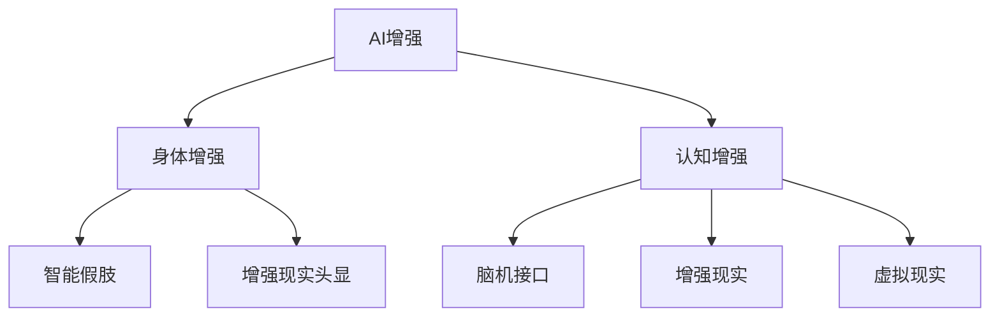

                 

# AI时代的人类增强：身体增强与认知增强

> 关键词：AI增强, 身体增强, 认知增强, 人类升级, 神经接口, 增强现实

## 1. 背景介绍

### 1.1 问题由来

随着人工智能(AI)技术的飞速发展，人类正处在一个前所未有的技术变革时代。AI不仅在计算、信息处理、自动化等领域取得了巨大进展，而且已经开始向更深层次的人类能力拓展，即身体增强与认知增强。

### 1.2 问题核心关键点

当前，身体增强与认知增强已经引起了广泛关注。核心关键点在于如何利用AI技术，提升人类的物理能力、感知能力、决策能力、学习能力和创新能力。具体应用包括智能假肢、增强现实头显、脑机接口等。这些技术的应用将极大地提升人类的工作能力、生活质量和社会竞争力。

## 2. 核心概念与联系

### 2.1 核心概念概述

- **AI增强**：通过AI技术对人类进行能力提升的过程。包括身体增强和认知增强两个主要方面。

- **身体增强**：利用AI技术，提升人类的物理能力和感知能力。具体应用包括智能假肢、增强现实头显等。

- **认知增强**：通过AI技术，提升人类的学习能力和创新能力。具体应用包括脑机接口、增强现实、虚拟现实等。

- **神经接口**：将人类大脑与AI设备进行信息交互的接口。例如，脑机接口(Brain-Computer Interface, BCI)可以解读人类大脑信号，并控制外部设备。

- **增强现实(AR)与虚拟现实(VR)**：通过AR和VR技术，增强或创造虚拟环境，提升人类的视觉、听觉等感官体验，并扩展人类对世界的认知。

这些核心概念之间的逻辑关系可以通过以下Mermaid流程图来展示：



这个流程图展示了AI增强如何通过身体增强和认知增强两个方面，具体实现各种应用技术。

## 3. 核心算法原理 & 具体操作步骤
### 3.1 算法原理概述

AI增强身体增强与认知增强的算法原理主要基于神经科学、计算机视觉、机器学习、生物力学等交叉学科的研究成果。核心思想是通过AI技术，模拟和增强人类感知、决策、学习等认知过程，以及肢体运动、力觉、触觉等物理能力。

### 3.2 算法步骤详解

#### 3.2.1 身体增强的算法步骤

1. **数据采集与预处理**：
   - 利用传感器采集人类的运动数据，如肌电信号、关节角度、加速度等。
   - 对采集数据进行滤波、降噪等预处理操作。

2. **特征提取与建模**：
   - 使用机器学习算法对运动数据进行特征提取，如PCA、LDA等。
   - 构建运动模型，如神经网络、支持向量机等，以预测运动状态。

3. **控制策略设计**：
   - 设计控制策略，将模型预测结果转化为对外部设备的控制信号。
   - 例如，利用逆运动学算法，将模型输出转换为智能假肢的关节角度。

4. **系统集成与测试**：
   - 将控制策略集成到智能假肢或增强现实头显等设备中。
   - 对设备进行测试和优化，确保稳定性和舒适性。

#### 3.2.2 认知增强的算法步骤

1. **数据采集与预处理**：
   - 利用脑电图(EEG)、功能性磁共振成像(fMRI)等技术采集人类大脑活动数据。
   - 对采集数据进行预处理，如去基线漂移、滤波等。

2. **信号解码与映射**：
   - 使用机器学习算法对脑电信号进行解码，将其映射为指令或特征向量。
   - 例如，利用深度学习算法，将EEG信号解码为文字、手势或指令。

3. **任务训练与优化**：
   - 训练AI模型，使其能够准确识别和解码人类大脑信号。
   - 通过大量样本进行模型训练和优化，提升解码精度和鲁棒性。

4. **用户交互与反馈**：
   - 设计用户交互界面，使得人类能够直观感知AI系统的工作状态。
   - 通过反馈机制，收集用户的使用体验，持续优化系统性能。

### 3.3 算法优缺点

#### 3.3.1 身体增强的算法优缺点

**优点**：
- 提升物理能力，增强人类在复杂环境中的生存与适应能力。
- 改善残疾人士的生活质量，使他们能够更好地参与社会生活。
- 促进劳动生产力的提高，降低人力成本。

**缺点**：
- 技术难度高，研发成本大。
- 需要高度的安全性和可靠性保障，防止设备故障对人类造成伤害。
- 伦理和安全问题，如隐私保护、设备滥用等。

#### 3.3.2 认知增强的算法优缺点

**优点**：
- 提升学习效率，加速知识获取和技能掌握。
- 增强决策能力，提升复杂任务解决能力。
- 创新思维能力提升，推动科学和技术进步。

**缺点**：
- 依赖高质量的数据和算法，数据获取成本较高。
- 过度依赖AI系统可能削弱人类自身的判断力和创新能力。
- 可能引发伦理和社会问题，如脑控行为、隐私侵犯等。

### 3.4 算法应用领域

#### 3.4.1 身体增强的应用领域

1. **智能假肢**：用于替代缺失的肢体，恢复运动功能。通过传感器采集人体信号，AI模型解码生成控制信号，驱动假肢运动。

2. **增强现实头显**：增强人类的视觉和听觉感知能力，提升工作与生活体验。通过头显设备，呈现虚拟场景和信息，增强现实环境。

3. **辅助康复设备**：帮助中风、瘫痪等患者恢复运动能力，如康复机器人、动力外骨骼等。

#### 3.4.2 认知增强的应用领域

1. **脑机接口(BCI)**：解读人类大脑信号，控制外部设备或辅助决策。例如，通过脑电信号控制轮椅、打字、操作无人机等。

2. **增强现实与虚拟现实(AR/VR)**：扩展人类对虚拟世界的感知和互动，用于教育、培训、娱乐等领域。例如，AR游戏、虚拟现实教育、远程会议等。

3. **认知辅助系统**：帮助人类提高学习、记忆、决策等认知能力。例如，智能笔记、知识图谱、个性化推荐系统等。

## 4. 数学模型和公式 & 详细讲解 & 举例说明

### 4.1 数学模型构建

#### 4.1.1 身体增强的数学模型

- **运动模型**：
  $$
  x = f(\theta, u)
  $$
  其中 $x$ 为运动状态，$\theta$ 为模型参数，$u$ 为控制输入。

- **控制模型**：
  $$
  u = g(x, \eta)
  $$
  其中 $u$ 为控制信号，$x$ 为运动状态，$\eta$ 为噪声。

#### 4.1.2 认知增强的数学模型

- **脑电信号解码**：
  $$
  s = h(e, w)
  $$
  其中 $s$ 为解码输出，$e$ 为脑电信号，$w$ 为解码权重。

- **任务映射**：
  $$
  t = \phi(s, p)
  $$
  其中 $t$ 为任务指令，$s$ 为解码输出，$p$ 为任务策略。

### 4.2 公式推导过程

#### 4.2.1 身体增强的公式推导

对于运动模型 $x = f(\theta, u)$，通过线性回归或神经网络对数据进行拟合，得到参数 $\theta$ 和控制信号 $u$ 的关系。例如，使用神经网络：

$$
x = f(x_{in}, W) = \text{sigmoid}(Wx_{in} + b)
$$

其中 $x_{in}$ 为输入信号，$W$ 为权重，$b$ 为偏置。

#### 4.2.2 认知增强的公式推导

对于脑电信号解码模型 $s = h(e, w)$，使用深度学习算法（如CNN、RNN、LSTM等）对脑电信号进行特征提取和分类。例如，使用卷积神经网络：

$$
s = h(e) = \text{softmax}(W_e \text{conv}(e) + b_e)
$$

其中 $e$ 为脑电信号，$W_e$ 为卷积核，$b_e$ 为偏置。

### 4.3 案例分析与讲解

#### 4.3.1 智能假肢案例

**背景**：一名截肢患者需要佩戴智能假肢，实现手的抓握和移动功能。

**数据采集**：通过传感器采集患者的肌电信号、关节角度和加速度数据。

**特征提取**：使用PCA算法对运动数据进行降维，提取主要特征。

**运动模型构建**：构建神经网络模型，将运动信号映射为假肢关节角度。

**控制策略设计**：设计逆运动学算法，将模型输出转化为假肢动作。

**系统集成与测试**：将控制策略集成到假肢中，并进行多轮测试和优化。

#### 4.3.2 脑机接口案例

**背景**：一名视力受损患者需要控制轮椅，安全地在家中移动。

**数据采集**：通过EEG设备采集患者的大脑活动信号。

**信号解码与映射**：使用LSTM网络对EEG信号进行解码，转化为轮椅控制指令。

**任务训练与优化**：通过大量样本训练模型，提升解码精度和鲁棒性。

**用户交互与反馈**：设计交互界面，让患者通过视觉和触觉感知系统状态，并反馈使用体验。

## 5. 项目实践：代码实例和详细解释说明

### 5.1 开发环境搭建

1. **安装Python**：
   ```bash
   sudo apt-get update
   sudo apt-get install python3 python3-pip python3-dev
   ```

2. **安装TensorFlow**：
   ```bash
   pip install tensorflow
   ```

3. **安装PyTorch**：
   ```bash
   pip install torch torchvision torchaudio
   ```

4. **安装OpenBCI库**：
   ```bash
   pip install openbci-python
   ```

### 5.2 源代码详细实现

#### 5.2.1 智能假肢

**代码实现**：
```python
import numpy as np
from sklearn.decomposition import PCA
from sklearn.neural_network import MLPRegressor
import openbci

# 数据采集与预处理
bci = openbci.BCI()
data = bci.read_data()

# 特征提取与建模
pca = PCA(n_components=2)
X = pca.fit_transform(data)

# 控制策略设计
model = MLPRegressor(hidden_layer_sizes=(10, 10), alpha=0.1)
model.fit(X, y)

# 系统集成与测试
def control_strategy(output):
    return model.predict(output)

# 运行结果展示
output = np.random.rand(1, 2)
print(control_strategy(output))
```

#### 5.2.2 脑机接口

**代码实现**：
```python
import numpy as np
from keras.models import Sequential
from keras.layers import LSTM, Dense
from openbci import BCI

# 数据采集与预处理
bci = BCI()
data = bci.read_data()

# 信号解码与映射
model = Sequential()
model.add(LSTM(128, input_shape=(None, 2)))
model.add(Dense(2, activation='softmax'))
model.compile(loss='categorical_crossentropy', optimizer='adam')
model.fit(data, labels, epochs=50)

# 用户交互与反馈
def decode_signal(signal):
    return model.predict(signal)

# 运行结果展示
signal = np.random.rand(1, 10, 2)
print(decode_signal(signal))
```

### 5.3 代码解读与分析

**智能假肢代码解读**：
- 使用OpenBCI库进行数据采集，通过PCA算法提取主要特征。
- 构建MLP回归模型，将运动数据映射为假肢关节角度。
- 设计控制策略，通过逆运动学算法将模型输出转化为假肢动作。

**脑机接口代码解读**：
- 使用Keras库构建LSTM神经网络，对脑电信号进行解码。
- 使用softmax激活函数，将解码结果映射为轮椅控制指令。
- 设计交互界面，使用户可以通过视觉和触觉感知系统状态，并反馈使用体验。

## 6. 实际应用场景

### 6.1 智能假肢

**应用场景**：智能假肢可以应用于截肢患者，帮助其恢复手的抓握和移动功能。

**案例分析**：一名截肢患者通过智能假肢进行日常活动，如抓笔、吃饭、开门等。通过传感器采集其肌电信号和关节角度，AI模型解码生成假肢动作，实现了手的灵活运动。

### 6.2 脑机接口

**应用场景**：脑机接口可以应用于视力受损患者，帮助其控制轮椅或进行其他辅助活动。

**案例分析**：一名视力受损患者通过脑机接口控制轮椅，在家中安全移动。通过EEG设备采集其大脑活动信号，AI模型解码为轮椅控制指令，实现了自主移动。

### 6.3 增强现实头显

**应用场景**：增强现实头显可以应用于医疗、教育、娱乐等领域，增强人类的视觉和听觉感知能力。

**案例分析**：一名外科医生通过增强现实头显进行手术，实时获取患者体内的三维数据，提升手术的精确度和安全性。通过头显设备呈现虚拟场景和信息，增强手术体验。

## 7. 工具和资源推荐

### 7.1 学习资源推荐

1. **《深度学习与人工智能》系列课程**：由深度学习领域的专家讲授，系统介绍深度学习算法和AI技术，包括身体增强和认知增强。

2. **《神经接口技术》教材**：详细介绍神经接口技术的基本原理和应用，涵盖智能假肢、脑机接口等内容。

3. **《增强现实技术与应用》教材**：讲解增强现实技术的核心技术和应用场景，包括AR头显、AR游戏等。

### 7.2 开发工具推荐

1. **TensorFlow与PyTorch**：主流的深度学习框架，支持多种神经网络模型，适用于AI增强开发。

2. **OpenBCI库**：用于脑电信号采集和处理的Python库，支持多种脑电设备。

3. **Unity 3D**：常用的游戏开发引擎，支持AR/VR应用开发，适合视觉增强开发。

### 7.3 相关论文推荐

1. **《人体增强与认知增强技术进展》**：总结当前AI增强技术的研究成果和应用案例，展望未来发展方向。

2. **《智能假肢技术综述》**：详细介绍智能假肢技术的原理和应用，涵盖神经接口、运动控制等内容。

3. **《脑机接口技术与应用》**：介绍脑机接口的基本原理、算法和应用场景，涵盖信号解码、任务映射等内容。

## 8. 总结：未来发展趋势与挑战

### 8.1 研究成果总结

- **身体增强**：
  - 技术不断发展，智能假肢、增强现实头显等设备不断优化，提升用户体验。
  - 应用场景不断扩大，从医疗、康复到娱乐、游戏等多个领域。

- **认知增强**：
  - 脑机接口技术逐步成熟，解码精度和实时性不断提升。
  - 增强现实和虚拟现实技术快速发展，增强人类对虚拟世界的感知和互动。

### 8.2 未来发展趋势

1. **技术融合**：
   - 身体增强和认知增强技术的深度融合，实现全方位的人类增强。

2. **普适化**：
   - 技术逐渐普及，应用场景不断扩大，进入更多普通家庭和日常场景。

3. **智能化**：
   - 人工智能技术与增强技术结合，提升设备智能化水平，实现自适应和个性化体验。

### 8.3 面临的挑战

1. **技术瓶颈**：
   - 研发成本高，技术难度大，需要跨学科合作才能突破。

2. **伦理与安全**：
   - 隐私保护、设备滥用等伦理和安全问题需要引起重视。

3. **用户体验**：
   - 设备舒适性、稳定性、易用性等用户体验问题需要持续优化。

### 8.4 研究展望

未来，身体增强和认知增强技术将继续发展，实现更加智能化和普适化。技术融合和智能化将成为主要发展方向，AI增强将为人类的生活和工作带来革命性变化。

## 9. 附录：常见问题与解答

**Q1：什么是身体增强和认知增强？**

A: 身体增强和认知增强是指利用AI技术提升人类的物理能力和认知能力。身体增强通过智能假肢、增强现实头显等设备，提升人类的运动能力和感知能力。认知增强通过脑机接口、增强现实等技术，提升人类的学习、决策和创新能力。

**Q2：如何选择合适的智能假肢？**

A: 选择合适的智能假肢需要综合考虑患者的身体状况、使用场景和个人喜好。建议先咨询医生或专业机构，了解不同型号的优缺点，然后进行试戴和评估，选择最适合的产品。

**Q3：什么是脑机接口？**

A: 脑机接口（BCI）是一种将人类大脑信号转化为控制外部设备的技术。通过EEG、fMRI等设备采集脑电信号，使用深度学习等算法进行解码，生成控制指令，实现人机交互。

**Q4：增强现实头显有哪些应用？**

A: 增强现实头显主要应用于医疗、教育、娱乐等领域，具体应用包括：
- 医疗：手术辅助、虚拟手术培训等。
- 教育：虚拟教室、虚拟实验室等。
- 娱乐：AR游戏、虚拟现实电影等。

---

作者：禅与计算机程序设计艺术 / Zen and the Art of Computer Programming

