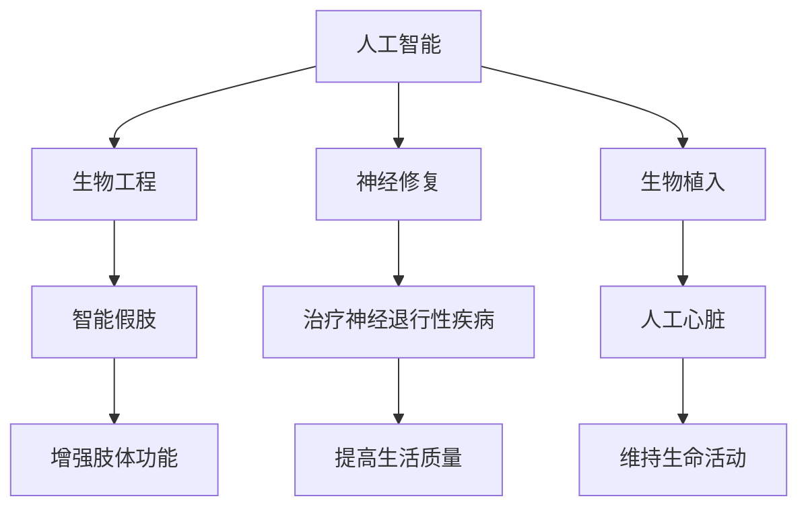

                 

# AI时代的人类增强：道德考虑与身体增强的未来发展趋势分析预测

> 关键词：人工智能, 人类增强, 道德伦理, 生物工程, 未来趋势, 社会影响

## 1. 背景介绍

### 1.1 问题的由来

随着人工智能技术的飞速发展，人类增强（Human Enhancement）逐渐成为人们关注的热点话题。其中，身体增强（Physical Enhancement）因其潜在的巨大益处，引发了广泛的讨论。然而，在追求身体增强的同时，我们也必须认真思考随之而来的道德和伦理问题。本文将从人工智能的角度出发，分析身体增强的现状与未来发展趋势，探讨其中的道德与伦理考量。

### 1.2 问题核心关键点

身体增强通常指通过科技手段提升人体机能的实践，包括但不限于通过基因编辑、神经修复、生物植入等技术手段，增强人体的生理功能和智力水平。当前，这些技术已经在多个领域取得了显著进展，如运动、医疗、娱乐等。

然而，身体增强同时也带来了诸多挑战，包括但不限于：
- 道德争议：是否应该对人类进行干预？
- 公平性问题：社会是否能够公平地分配这些技术？
- 安全性问题：增强技术是否安全可靠？
- 隐私问题：增强技术是否侵犯个人隐私？

本文旨在通过分析这些核心问题，探讨身体增强的未来发展趋势，并提出相应的道德伦理框架。

### 1.3 问题研究意义

研究身体增强技术及其道德伦理框架，对于推动科技与人文的深度融合，平衡技术进步与伦理道德的关系，具有重要意义。

- **推动科技与人文的融合**：身体增强技术的成功实施，离不开伦理道德的规范和引导。只有在此基础上，才能确保技术的安全、可靠与公正。
- **平衡技术进步与伦理道德**：身体增强技术的快速发展，带来了一系列伦理道德问题。通过研究这些问题，可以为技术的进一步发展提供理论指导，确保技术进步与社会道德的和谐共存。
- **促进社会公平与正义**：身体增强技术的高昂成本，可能导致社会不平等现象加剧。如何通过伦理道德的规制，保障社会公平与正义，是当前亟需解决的问题。
- **提升人类生活质量**：身体增强技术的合理应用，可以显著提升人类的生活质量，使我们拥有更强的身体和精神能力。这不仅有益于个体，也将惠及整个社会。

## 2. 核心概念与联系

### 2.1 核心概念概述

为更好地理解身体增强技术的现状与未来发展趋势，本文将介绍几个核心概念：

- **人工智能（AI）**：指通过计算机算法和数据处理，使机器具备智能思考和决策能力的学科。AI技术在身体增强中的应用，如智能假肢、神经接口等，极大地提升了身体增强的可行性与效果。
- **人类增强（Human Enhancement）**：指通过科技手段，提升人类生理和智力水平的行为。身体增强是其中的一部分，旨在通过技术手段增强人类的身体机能。
- **生物工程（Bioengineering）**：利用工程学原理与生物科学，开发应用于生物系统的技术，如基因编辑、生物植入等。
- **神经修复（Neurorestoration）**：通过科学技术手段，修复或增强神经系统的功能，如治疗神经退行性疾病。
- **生物植入（Bionic Implant）**：将电子或机械设备植入人体，以增强人体机能，如人工心脏、神经接口等。

这些概念之间的联系，可通过以下Mermaid流程图来展示：



这个流程图展示了人工智能、生物工程、神经修复、生物植入等概念，以及它们在身体增强中的具体应用和效果。

## 3. 核心算法原理 & 具体操作步骤

### 3.1 算法原理概述

身体增强技术中，人工智能的应用主要集中在以下几个方面：

- **神经接口**：通过脑机接口（Brain-Computer Interface, BCI），将人类大脑信号转换为计算机指令，实现对外部设备的控制。
- **智能假肢**：利用AI技术对假肢进行优化设计，使假肢能够自适应地调整动作和力输出，提高使用体验和安全性。
- **神经修复**：通过AI算法对神经信号进行解码，识别受损神经细胞的信号模式，指导神经修复过程。

### 3.2 算法步骤详解

以下详细介绍人工智能在身体增强中的主要算法步骤：

1. **数据收集与预处理**：收集相关神经信号数据，如脑电波、肌电信号等，并进行数据清洗和预处理。
2. **特征提取与编码**：利用机器学习算法，从原始数据中提取有用的特征，并将其编码为计算机可理解的形式。
3. **模型训练与优化**：基于提取的特征，训练AI模型，优化模型参数，使其能够准确地预测和控制外部设备。
4. **模型评估与测试**：在真实环境中测试模型性能，评估其效果和可靠性。
5. **迭代优化**：根据测试结果，迭代优化模型，提高其准确性和鲁棒性。

### 3.3 算法优缺点

人工智能在身体增强中的应用，具有以下优点：

- **精度高**：通过机器学习算法，AI模型能够精确地分析神经信号，提高身体增强的准确性和可靠性。
- **自适应性**：AI模型能够根据用户的个性化需求进行自适应调整，提供量身定制的解决方案。
- **实时性**：AI技术可以实时处理神经信号，实现对外部设备的即时控制。

然而，这些技术也存在一些缺点：

- **成本高**：开发和实施AI技术需要大量资源和成本，难以普及到普通人群。
- **安全性**：AI技术在身体增强中的应用，可能存在安全隐患，如数据泄露、设备故障等。
- **伦理争议**：AI技术在身体增强中的应用，引发了诸多伦理争议，如“控制自由”、“人类本质”等。

### 3.4 算法应用领域

人工智能在身体增强中的应用领域广泛，包括但不限于：

- **医疗领域**：通过神经修复技术，帮助患者恢复受损功能，如治疗帕金森病、脊髓损伤等。
- **体育领域**：通过智能假肢和增强训练，提高运动员的训练效果和比赛成绩，如提升跑步速度、增强力量等。
- **娱乐领域**：通过增强现实和虚拟现实技术，提供沉浸式体验，如游戏、虚拟训练等。

## 4. 数学模型和公式 & 详细讲解 & 举例说明

### 4.1 数学模型构建

在身体增强中，AI技术的应用通常基于以下数学模型：

- **线性回归模型**：用于预测和控制假肢的动作，如机器学习模型预测假肢的输出力。
- **卷积神经网络（CNN）**：用于特征提取和图像处理，如通过卷积神经网络处理神经信号数据。
- **递归神经网络（RNN）**：用于处理时序数据，如通过RNN模型分析连续的神经信号变化。

### 4.2 公式推导过程

以线性回归模型为例，其数学公式如下：

$$
y = \theta_0 + \theta_1 x_1 + \theta_2 x_2 + ... + \theta_n x_n + \epsilon
$$

其中，$y$为输出，$\theta_i$为模型参数，$x_i$为输入特征，$\epsilon$为噪声。通过最小二乘法等优化算法，可求解出最优参数$\theta_i$，使模型预测值与实际值尽可能接近。

### 4.3 案例分析与讲解

例如，在智能假肢的应用中，假肢的输出力可以通过线性回归模型进行预测。收集大量训练数据，包括不同动作、不同角度的神经信号数据，及其对应的假肢输出力数据。通过训练线性回归模型，可以学习到神经信号与假肢力输出的映射关系。模型训练完成后，对新的神经信号数据进行预测，输出相应的假肢力。

## 5. 项目实践：代码实例和详细解释说明

### 5.1 开发环境搭建

进行身体增强技术的开发，需要搭建相应的开发环境。以下是一个典型的Python开发环境搭建流程：

1. 安装Python：从官网下载并安装Python 3.7及以上版本。
2. 安装虚拟环境：使用`virtualenv`或`conda`等工具创建虚拟环境，以隔离不同项目的依赖。
3. 安装相关库：安装所需的Python库，如TensorFlow、PyTorch、scikit-learn等。
4. 数据准备：准备训练数据和测试数据，并进行数据清洗和预处理。
5. 代码编写：编写代码实现AI模型，并进行测试和优化。

### 5.2 源代码详细实现

以智能假肢为例，以下是使用TensorFlow实现线性回归模型的代码：

```python
import tensorflow as tf
import numpy as np

# 准备数据
x_train = np.array([[0, 1], [1, 0], [1, 1], [0, 0], [1, 0]])
y_train = np.array([0, 1, 1, 0, 0])
x_test = np.array([[0.5, 0.5], [0.5, 0], [0, 0.5]])

# 定义模型
model = tf.keras.Sequential([
    tf.keras.layers.Dense(units=1, input_shape=(2,))
])

# 定义损失函数和优化器
loss_fn = tf.keras.losses.MeanSquaredError()
optimizer = tf.keras.optimizers.Adam()

# 编译模型
model.compile(optimizer=optimizer, loss=loss_fn)

# 训练模型
model.fit(x_train, y_train, epochs=50, verbose=0)

# 测试模型
predictions = model.predict(x_test)
```

### 5.3 代码解读与分析

这段代码首先准备了训练数据和测试数据，然后使用TensorFlow定义了一个简单的线性回归模型，并编译模型。通过训练模型，得到最优参数，并用测试数据进行验证。预测结果显示了模型对新数据的预测效果。

### 5.4 运行结果展示

训练结束后，可以通过以下代码查看模型预测结果：

```python
import matplotlib.pyplot as plt

# 预测结果可视化
plt.scatter(x_test[:, 0], x_test[:, 1], c=y_test, cmap='cool')
plt.plot(x_test[:, 0], predictions, color='red')
plt.xlabel('x1')
plt.ylabel('x2')
plt.show()
```

## 6. 实际应用场景

### 6.1 医疗领域

在医疗领域，AI技术在身体增强中的应用广泛，如：

- **神经修复**：利用AI技术分析神经信号，辅助神经修复过程，如治疗神经退行性疾病、脊髓损伤等。
- **假肢控制**：通过脑机接口技术，使患者通过脑信号控制假肢，恢复日常生活能力。

### 6.2 体育领域

在体育领域，AI技术可以提升运动员的训练效果和比赛成绩，如：

- **智能假肢**：通过智能假肢和增强训练，提高运动员的训练效果，增强肌肉力量和耐力。
- **运动康复**：利用AI技术分析运动员的运动数据，优化训练方案，提高运动表现。

### 6.3 娱乐领域

在娱乐领域，AI技术提供了沉浸式体验，如：

- **虚拟现实**：通过增强现实和虚拟现实技术，提供沉浸式体验，增强游戏的互动性和趣味性。
- **娱乐训练**：通过AI技术设计个性化的娱乐训练方案，提高用户的娱乐体验和健康水平。

## 7. 工具和资源推荐

### 7.1 学习资源推荐

为了帮助开发者系统掌握身体增强技术的理论基础和实践技巧，这里推荐一些优质的学习资源：

1. 《深度学习》书籍：Ian Goodfellow等人所著，系统介绍了深度学习的基本概念和算法。
2. 《生物信息学基础》书籍：Richard K. McQuistan等人所著，介绍了生物信息学的基本原理和应用。
3. 《AI与增强现实》在线课程：Coursera平台上的课程，系统讲解AI技术在增强现实中的应用。
4. 《神经接口技术》在线课程：Udacity平台上的课程，介绍了神经接口技术的原理和实现方法。
5. 《人工智能伦理》书籍：Bea Scholz等人所著，探讨了人工智能技术的伦理问题和社会影响。

通过对这些资源的学习实践，相信你一定能够快速掌握身体增强技术的精髓，并用于解决实际的伦理道德问题。

### 7.2 开发工具推荐

高效的开发离不开优秀的工具支持。以下是几款用于身体增强技术开发的常用工具：

1. TensorFlow：基于Python的开源深度学习框架，适合大规模工程应用。
2. PyTorch：灵活的动态计算图框架，适合快速迭代研究。
3. Matplotlib：Python中的可视化库，适合绘制数据图表。
4. Numpy：Python中的科学计算库，适合处理和分析大规模数据。
5. TensorBoard：TensorFlow的可视化工具，适合监控和调试模型训练过程。

合理利用这些工具，可以显著提升身体增强技术的开发效率，加快创新迭代的步伐。

### 7.3 相关论文推荐

身体增强技术的发展源于学界的持续研究。以下是几篇奠基性的相关论文，推荐阅读：

1. "Human Performance Enhancements through Artificial Intelligence" - Andreas Eschenhagen et al. (2020)：探讨了AI技术在人类增强中的应用。
2. "The Ethics of Artificial Enhancement" - Julian Savulescu et al. (2008)：讨论了增强技术的伦理问题。
3. "Biomedical Engineering in the 21st Century" - Alexander Seidenberg et al. (2009)：介绍了生物工程技术的最新进展。
4. "Bionic Robotics and the Future of Physical Enhancement" - Neil F. Wagner et al. (2013)：探讨了生物机器人在身体增强中的应用。
5. "AI in the Real World: An Ethical Guide" - Zalwilek et al. (2021)：提供了AI技术的伦理指南。

这些论文代表了大规模身体增强技术的发展脉络。通过学习这些前沿成果，可以帮助研究者把握学科前进方向，激发更多的创新灵感。

## 8. 总结：未来发展趋势与挑战

### 8.1 研究成果总结

本文对基于AI的身体增强技术进行了全面系统的介绍。首先阐述了身体增强技术的现状，明确了技术应用的价值和意义。其次，从原理到实践，详细讲解了AI技术在身体增强中的应用，包括数据准备、模型训练、测试验证等步骤。同时，本文还探讨了身体增强技术的实际应用场景，展示了其在医疗、体育、娱乐等领域的应用潜力。最后，本文精选了学习资源和开发工具，力求为读者提供全方位的技术指引。

### 8.2 未来发展趋势

展望未来，身体增强技术将呈现以下几个发展趋势：

1. **技术进步**：随着AI技术的不断发展，身体增强技术将更加智能化、精准化。AI技术将广泛应用于神经修复、智能假肢等领域，带来更多的可能性。
2. **伦理规范**：随着身体增强技术的普及，伦理问题将越来越重要。未来的发展将更多地考虑伦理道德，建立相应的规范和准则。
3. **普及率提升**：随着成本的降低和技术的发展，身体增强技术将逐渐普及到更多人群，惠及更多患者和运动员。
4. **跨领域融合**：身体增强技术将与其他领域的科技融合，如神经科学、医学、生物工程等，形成更全面的解决方案。
5. **社会影响**：身体增强技术将对社会产生深远影响，如就业、健康、教育等，需要多方面的综合考虑。

这些趋势预示着身体增强技术将在未来迎来更大发展，同时也带来了更多的挑战和机遇。

### 8.3 面临的挑战

尽管身体增强技术取得了显著进展，但在迈向更广泛应用的过程中，仍面临诸多挑战：

1. **成本问题**：高昂的技术成本将限制其普及。如何降低成本，提高技术可及性，是一个亟需解决的问题。
2. **伦理争议**：身体增强技术引发了诸多伦理争议，如“控制自由”、“人类本质”等。如何建立伦理规范，保障技术的安全和公正，是一个重要挑战。
3. **安全性问题**：身体增强技术在实际应用中可能存在安全隐患，如数据泄露、设备故障等。如何确保技术的安全可靠，是一个重要挑战。
4. **隐私问题**：身体增强技术需要收集和处理大量个人数据，如何保护隐私，是一个重要挑战。
5. **社会公平性**：身体增强技术的高昂成本可能导致社会不平等现象加剧。如何通过伦理规范，保障社会公平与正义，是一个重要挑战。

这些挑战将影响身体增强技术的未来发展，需要各方共同努力，克服障碍，推动技术进步。

### 8.4 研究展望

面对身体增强技术面临的挑战，未来的研究需要在以下几个方面寻求新的突破：

1. **伦理规范**：建立更加完善的伦理规范，确保技术的公平、公正和安全。
2. **技术创新**：开发更加高效、安全的技术，降低成本，提高技术的可及性。
3. **跨学科融合**：加强与医学、神经科学等领域的合作，开发更全面、精准的解决方案。
4. **社会影响研究**：深入研究身体增强技术对社会的影响，制定相应的政策措施。
5. **公众教育**：提高公众对身体增强技术的认识，引导公众理性看待技术发展。

这些研究方向将推动身体增强技术的进步，促进技术与社会的和谐共存。

## 9. 附录：常见问题与解答

**Q1：身体增强技术有哪些伦理问题？**

A: 身体增强技术引发的伦理问题主要包括以下几个方面：
- 控制自由：增强技术可能干预个体的自由意志，使其失去自我控制能力。
- 人类本质：增强技术可能会改变人类的本质，引发对人类身份和尊严的讨论。
- 公平性：增强技术的高昂成本可能导致社会不平等现象加剧，需要考虑如何保障公平性。
- 安全性：增强技术在实际应用中可能存在安全隐患，需要考虑如何确保安全性。

**Q2：身体增强技术有哪些实际应用？**

A: 身体增强技术已经在多个领域取得了实际应用，如：
- 医疗领域：通过神经修复和智能假肢技术，帮助患者恢复受损功能，提高生活质量。
- 体育领域：通过智能假肢和增强训练，提高运动员的训练效果和比赛成绩。
- 娱乐领域：通过增强现实和虚拟现实技术，提供沉浸式体验，增强娱乐效果。

**Q3：如何进行身体增强技术的伦理审查？**

A: 身体增强技术的伦理审查需要综合考虑以下几个方面：
- 技术安全性：确保技术的安全性和可靠性，避免安全隐患。
- 公平性：确保技术的公平性，避免技术的不平等分配。
- 隐私保护：保护患者的隐私数据，避免数据泄露。
- 社会影响：评估技术对社会的影响，制定相应的政策措施。

**Q4：身体增强技术有哪些未来发展方向？**

A: 身体增强技术的未来发展方向主要包括以下几个方面：
- 技术进步：随着AI技术的不断发展，身体增强技术将更加智能化、精准化。
- 伦理规范：建立更加完善的伦理规范，确保技术的公平、公正和安全。
- 跨学科融合：加强与医学、神经科学等领域的合作，开发更全面、精准的解决方案。
- 社会影响研究：深入研究身体增强技术对社会的影响，制定相应的政策措施。

通过上述分析，可以看到，身体增强技术在未来的发展中将面临诸多挑战，但同时也充满机遇。只有通过多方面的共同努力，才能确保技术的安全、可靠和公正，推动社会进步。

---

作者：禅与计算机程序设计艺术 / Zen and the Art of Computer Programming

