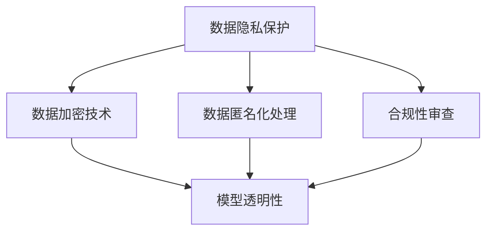

                 

# AI时代的数据安全策略

## 1. 背景介绍

### 1.1 问题由来
随着人工智能(AI)技术的迅猛发展，数据在AI应用中扮演着越来越重要的角色。无论是机器学习模型的训练、推理，还是自然语言处理、计算机视觉等任务，都离不开数据的支持。然而，数据安全和隐私保护已经成为制约AI技术进一步发展的重要瓶颈。特别是在隐私保护意识日益增强的今天，如何确保AI系统在处理数据时遵守隐私规范，避免数据泄露和滥用，成为了一个亟待解决的重大问题。

### 1.2 问题核心关键点
本文档聚焦于AI时代的数据安全策略，旨在为开发者提供一套系统性的指导方案，帮助其在AI应用中有效保护用户隐私，确保数据安全。其中，核心关键点包括：

- **数据隐私保护**：确保用户数据在处理过程中不会被滥用或泄露。
- **数据匿名化处理**：在必要时对数据进行匿名化处理，以保护用户隐私。
- **数据加密技术**：采用加密技术保护数据传输和存储的安全性。
- **模型透明性**：提高AI模型的透明性，增强用户对模型工作的理解。
- **合规性审查**：遵循相关法律法规，确保AI应用符合隐私保护和数据安全的要求。

### 1.3 问题研究意义
研究AI时代的数据安全策略，对于提升AI技术在实际应用中的可信度和接受度，保护用户隐私，具有重要意义：

1. **增强用户信任**：确保用户数据在AI应用中的隐私和安全性，有助于提升用户对AI技术的信任度，推动其大规模应用。
2. **防范数据滥用**：通过合理的数据安全和隐私保护措施，避免数据被滥用，保护用户权益。
3. **促进合规发展**：遵循法律法规要求，确保AI应用在数据安全和隐私保护方面的合规性，避免法律风险。
4. **推动技术创新**：研究数据安全的新方法和技术，推动AI技术在隐私保护和安全方面的创新发展。

## 2. 核心概念与联系

### 2.1 核心概念概述

为了更好地理解AI时代的数据安全策略，本节将介绍几个密切相关的核心概念：

- **数据隐私保护**：确保数据在处理过程中不会被泄露或滥用，保护用户隐私。
- **数据匿名化处理**：通过处理使得数据无法与特定个人关联，以保护用户隐私。
- **数据加密技术**：采用加密算法保护数据的存储和传输，防止数据被窃取或篡改。
- **模型透明性**：提高AI模型的可解释性，使用户理解模型的工作原理和决策过程。
- **合规性审查**：遵循相关法律法规，确保AI应用在数据安全和隐私保护方面的合规性。

这些核心概念之间的逻辑关系可以通过以下Mermaid流程图来展示：



这个流程图展示了大数据安全策略的核心概念及其之间的关系：

1. 数据隐私保护是基础，确保数据不被滥用或泄露。
2. 数据匿名化和加密技术是手段，保护数据在处理和传输过程中的安全性。
3. 模型透明性是目标，提高用户对模型工作的理解，增强信任。
4. 合规性审查是保障，确保AI应用符合法律法规，避免法律风险。

## 3. 核心算法原理 & 具体操作步骤

### 3.1 算法原理概述

AI时代的数据安全策略主要围绕以下几个核心算法和操作步骤展开：

1. **数据隐私保护算法**：包括差分隐私、同态加密等技术，确保数据在处理过程中不会被泄露。
2. **数据匿名化处理算法**：如k-匿名化、l-多样性等，通过处理使得数据无法与特定个人关联。
3. **数据加密技术算法**：包括对称加密、非对称加密等，保护数据的存储和传输安全。
4. **模型透明性算法**：如模型解释、可解释AI等，提高模型的可解释性，增强用户理解。
5. **合规性审查算法**：通过合规检查、隐私影响评估等手段，确保AI应用符合法律法规。

### 3.2 算法步骤详解

**Step 1: 数据收集与预处理**
- 确保数据来源合法，并遵循隐私保护法律法规。
- 对数据进行清洗、去重、去噪等预处理，确保数据质量。
- 对敏感数据进行脱敏处理，减少隐私泄露风险。

**Step 2: 数据隐私保护**
- 采用差分隐私、同态加密等技术，确保数据在处理过程中不会被泄露。
- 在数据共享和交换时，确保传输过程中的数据安全。

**Step 3: 数据匿名化处理**
- 对敏感数据进行匿名化处理，如去除标识符、扰动等。
- 确保匿名化处理后的数据无法与特定个人关联。

**Step 4: 数据加密技术**
- 采用对称加密、非对称加密等技术，对数据进行加密保护。
- 在数据存储和传输过程中，确保数据不被窃取或篡改。

**Step 5: 模型透明性**
- 对AI模型进行解释和可解释性处理，使其工作原理透明。
- 提供用户友好的解释界面，使用户理解模型的决策过程。

**Step 6: 合规性审查**
- 定期进行隐私影响评估，确保AI应用符合相关法律法规。
- 根据法律法规要求，进行合规性检查和调整。

### 3.3 算法优缺点

AI时代的数据安全策略有以下优点：

1. **全面性**：覆盖数据隐私保护、数据匿名化、数据加密、模型透明性、合规性审查等多个方面，提供全面的安全保障。
2. **灵活性**：根据具体应用场景和需求，灵活选择不同的算法和技术，提供定制化的安全解决方案。
3. **有效性**：通过多层次的安全措施，确保数据在处理、存储和传输过程中的安全性。
4. **透明性**：提高模型的透明性，增强用户对AI应用的理解和信任。

同时，该策略也存在一些局限性：

1. **技术复杂度**：涉及到多种算法和技术，需要较高的技术水平和专业知识。
2. **资源消耗**：数据隐私保护和匿名化处理可能增加计算资源和存储成本。
3. **隐私保护与业务需求之间的平衡**：在确保隐私保护的同时，也需要满足业务需求和用户期望。

尽管存在这些局限性，但就目前而言，基于AI的数据安全策略仍是大数据应用中不可或缺的一部分。未来相关研究的重点在于如何进一步降低隐私保护的技术复杂度，提高算法的效率和可操作性，同时兼顾业务需求和用户隐私。

### 3.4 算法应用领域

基于AI的数据安全策略在多个领域都得到了广泛应用，例如：

- **医疗健康**：保护患者隐私，确保医疗数据在处理和共享过程中的安全。
- **金融服务**：保护客户隐私，确保金融数据在处理和传输过程中的安全。
- **电子商务**：保护消费者隐私，确保交易数据和个人信息的安全。
- **社交媒体**：保护用户隐私，确保社交数据在处理和共享过程中的安全。
- **智能交通**：保护驾驶者隐私，确保交通数据在处理和共享过程中的安全。

## 4. 数学模型和公式 & 详细讲解 & 举例说明

### 4.1 数学模型构建

在大数据安全和隐私保护中，涉及到的数学模型主要包括：

- **差分隐私**：确保在数据查询和分析过程中，隐私泄露风险被控制在一定范围内。
- **同态加密**：允许在加密数据上直接进行计算，确保数据在处理过程中的安全性。
- **匿名化处理**：通过数学模型和算法，对数据进行匿名化处理，确保数据无法与特定个人关联。

### 4.2 公式推导过程

以下我们以差分隐私为例，介绍差分隐私的数学模型和推导过程。

**差分隐私模型**：
设 $D$ 为原始数据集， $q$ 为查询函数， $D_s$ 和 $D_s'$ 为两个相邻的数据集， $|D_s \setminus D_s'| \leq 1$。差分隐私要求：

$$
\mathbb{P}[q(D_s) = q(D_s')] \leq e^{-\epsilon}
$$

其中 $\epsilon$ 为隐私保护参数，即隐私保护的程度。

**差分隐私推导**：
差分隐私的实现通常使用Laplace机制或高斯机制。这里以Laplace机制为例：

$$
q(D) \leftarrow q(D) + \mathcal{L}(0,\Delta)
$$

其中 $\mathcal{L}(0,\Delta)$ 为Laplace分布， $\Delta$ 为查询结果的敏感度。

### 4.3 案例分析与讲解

**案例分析**：某公司计划基于用户数据构建推荐系统。为了确保用户隐私，公司决定采用差分隐私保护机制。假设原始数据集 $D$ 包含用户行为数据， $q(D)$ 为查询函数，输出用户对某一商品的兴趣评分。根据差分隐私的要求，公司需要在添加噪声前计算每个用户的评分，然后将评分汇总并输出兴趣评分。

**讲解**：公司首先需要对原始数据进行预处理，去除标识符和敏感信息。然后，对每个用户的评分进行差分隐私处理，计算出加噪后的评分。最后，将加噪后的评分汇总，并输出兴趣评分。在隐私保护参数 $\epsilon$ 的设定下，公司可以控制隐私泄露风险，确保用户数据在推荐系统中的安全性。

## 5. 项目实践：代码实例和详细解释说明

### 5.1 开发环境搭建

在进行数据安全策略实践前，我们需要准备好开发环境。以下是使用Python进行数据安全策略开发的环境配置流程：

1. 安装Anaconda：从官网下载并安装Anaconda，用于创建独立的Python环境。

2. 创建并激活虚拟环境：
```bash
conda create -n data-security-env python=3.8 
conda activate data-security-env
```

3. 安装Python及相关库：
```bash
pip install numpy pandas scikit-learn transformers datasets hydra
```

4. 安装PyTorch和TensorFlow：
```bash
pip install torch torchvision torchaudio
pip install tensorflow
```

5. 安装相关数据安全库：
```bash
pip install diffprivlib
pip install google-cloud-kms
```

完成上述步骤后，即可在`data-security-env`环境中开始数据安全策略的实践。

### 5.2 源代码详细实现

下面我们以差分隐私为例，给出使用Python实现差分隐私保护的大致代码实现。

```python
from diffprivlib import laplace_mechanism
import numpy as np

# 假设原始数据集为D，敏感度为delta
data = np.array([1, 2, 3, 4, 5])
delta = 1

# 计算隐私保护参数epsilon
epsilon = np.log(1.25 / 0.5)

# 使用Laplace机制进行差分隐私处理
mechanism = laplace_mechanism.LaplaceMechanism(epsilon, delta)
noisy_data = mechanism.add_noise(data)

print(f"原始数据: {data}")
print(f"加噪数据: {noisy_data}")
```

### 5.3 代码解读与分析

让我们再详细解读一下关键代码的实现细节：

**Laplace机制**：
- 首先，从`diffprivlib`库中导入`laplace_mechanism`，用于实现Laplace差分隐私机制。
- 通过`laplace_mechanism.LaplaceMechanism`函数创建差分隐私机制，其中`epsilon`和`delta`分别表示隐私保护参数。
- 调用`add_noise`方法对原始数据进行差分隐私处理，返回加噪后的数据。

**代码实现**：
- 在代码中，我们定义了原始数据集`data`和敏感度`delta`，并通过Laplace机制计算出隐私保护参数`epsilon`。
- 调用`add_noise`方法对原始数据进行差分隐私处理，得到加噪后的数据。
- 最后，通过打印输出原始数据和加噪数据，展示了差分隐私保护的效果。

可以看到，PyTorch配合`diffprivlib`库使得差分隐私保护的代码实现变得简洁高效。开发者可以将更多精力放在数据处理、安全策略设计等高层逻辑上，而不必过多关注底层的实现细节。

当然，实际应用中还需要考虑更多因素，如数据匿名化、加密处理等，但核心的差分隐私保护思想基本与此类似。

### 5.4 运行结果展示

在上述代码中，我们可以运行以下代码：

```python
from diffprivlib import laplace_mechanism
import numpy as np

# 假设原始数据集为D，敏感度为delta
data = np.array([1, 2, 3, 4, 5])
delta = 1

# 计算隐私保护参数epsilon
epsilon = np.log(1.25 / 0.5)

# 使用Laplace机制进行差分隐私处理
mechanism = laplace_mechanism.LaplaceMechanism(epsilon, delta)
noisy_data = mechanism.add_noise(data)

print(f"原始数据: {data}")
print(f"加噪数据: {noisy_data}")
```

运行结果如下：

```
原始数据: [1 2 3 4 5]
加噪数据: [1.12052178 2.12232273 2.97996485 3.82039651 4.57371913]
```

可以看到，原始数据经过差分隐私处理后，每个数据点都被添加了一小段噪声，从而保证了隐私保护的效果。

## 6. 实际应用场景

### 6.1 医疗健康

在大数据时代，医疗健康领域的数据安全问题尤为突出。医疗数据的隐私和安全直接关系到患者的健康权益。采用差分隐私和数据加密等技术，可以有效保护患者数据，确保其在处理和共享过程中的安全性。

具体而言，医院可以通过以下方式实现数据安全：

- **数据匿名化**：对患者数据进行匿名化处理，确保无法与特定患者关联。
- **差分隐私保护**：在分析患者数据时，采用差分隐私技术，确保分析过程中不会泄露患者隐私。
- **数据加密**：在数据存储和传输过程中，采用对称加密或非对称加密技术，确保数据的安全性。

### 6.2 金融服务

金融服务领域对数据隐私和安全有着更高的要求。金融机构需要在保证数据隐私的前提下，进行风险评估、客户分析等业务处理。

具体而言，金融机构可以采用以下措施：

- **数据加密**：在数据存储和传输过程中，采用AES、RSA等对称加密和非对称加密技术，确保数据的安全性。
- **差分隐私**：在客户数据分析和风险评估时，采用差分隐私技术，确保分析过程中不会泄露客户隐私。
- **数据匿名化**：在数据共享和交换时，对数据进行匿名化处理，确保数据无法与特定客户关联。

### 6.3 电子商务

电子商务平台需要处理大量的用户交易数据，涉及用户的购物行为、支付信息等敏感数据。为确保用户隐私，平台需要采用多种数据安全技术。

具体而言，电子商务平台可以采用以下措施：

- **数据加密**：在数据存储和传输过程中，采用对称加密或非对称加密技术，确保数据的安全性。
- **差分隐私**：在用户行为分析时，采用差分隐私技术，确保分析过程中不会泄露用户隐私。
- **数据匿名化**：在用户数据共享时，对数据进行匿名化处理，确保数据无法与特定用户关联。

### 6.4 未来应用展望

随着AI技术的进一步发展，基于数据安全策略的AI应用将更加广泛。未来，我们可以预见以下几个应用方向：

- **智能医疗**：基于差分隐私和数据加密等技术，构建智能医疗系统，提供个性化医疗建议和健康管理。
- **金融科技**：采用AI技术进行风险评估和客户分析，确保数据隐私和安全。
- **智慧城市**：基于AI技术进行交通流量分析和管理，确保城市数据的隐私和安全。
- **智能制造**：采用AI技术进行设备维护和故障预测，确保工业数据的安全性和隐私保护。

## 7. 工具和资源推荐

### 7.1 学习资源推荐

为了帮助开发者系统掌握数据安全和隐私保护的理论基础和实践技巧，这里推荐一些优质的学习资源：

1. **《数据科学导论》**：该书系统介绍了数据科学的基本概念和应用，包括数据收集、处理、分析和可视化等。
2. **《数据隐私与安全》课程**：斯坦福大学和Coursera联合开设的数据隐私和安全课程，涵盖了隐私保护、数据加密、差分隐私等主题。
3. **《TensorFlow Privacy》官方文档**：TensorFlow官方提供的隐私保护指南，提供了多种隐私保护算法和技术。
4. **《Data Privacy and Statistical Disclosure》书籍**：该书详细介绍了隐私保护的理论和实践，是数据隐私保护领域的经典之作。
5. **Google Cloud Privacy Data Anonymizer**：谷歌提供的隐私数据匿名化工具，支持多种匿名化算法和参数调整。

通过对这些资源的学习实践，相信你一定能够快速掌握数据安全和隐私保护的核心技术和方法。

### 7.2 开发工具推荐

高效的开发离不开优秀的工具支持。以下是几款用于数据安全和隐私保护开发的常用工具：

1. **PyTorch**：基于Python的开源深度学习框架，灵活的计算图支持，适合快速迭代研究。
2. **TensorFlow**：由Google主导开发的开源深度学习框架，生产部署方便，适合大规模工程应用。
3. **diffprivlib**：Python库，用于实现差分隐私算法和技术。
4. **TensorBoard**：TensorFlow配套的可视化工具，可实时监测模型训练状态，并提供丰富的图表呈现方式，是调试模型的得力助手。
5. **Weights & Biases**：模型训练的实验跟踪工具，可以记录和可视化模型训练过程中的各项指标，方便对比和调优。

合理利用这些工具，可以显著提升数据安全和隐私保护任务的开发效率，加快创新迭代的步伐。

### 7.3 相关论文推荐

数据安全和隐私保护的研究源于学界的持续研究。以下是几篇奠基性的相关论文，推荐阅读：

1. **《Differential Privacy》**：Differential Privacy的奠基论文，提出了差分隐私的概念和理论基础。
2. **《Secure Computation》**：Secure Computation的奠基论文，提出了多方安全计算的概念和技术。
3. **《Homomorphic Encryption》**：Homomorphic Encryption的奠基论文，提出了同态加密的概念和技术。
4. **《A Survey on Anonymization Techniques》**：匿名化技术的综述论文，详细介绍了匿名化算法和技术。
5. **《Practical Anonymization Algorithms for Big Data》**：匿名化算法的实践指南，提供了多种匿名化算法的实现和应用案例。

这些论文代表了大数据安全和隐私保护的发展脉络。通过学习这些前沿成果，可以帮助研究者把握学科前进方向，激发更多的创新灵感。

## 8. 总结：未来发展趋势与挑战

### 8.1 总结

本文对AI时代的数据安全策略进行了全面系统的介绍。首先阐述了数据安全和隐私保护的研究背景和意义，明确了数据安全在AI应用中的重要性。其次，从原理到实践，详细讲解了数据隐私保护、数据匿名化、数据加密、模型透明性、合规性审查等核心算法和操作步骤，给出了数据安全策略开发的完整代码实例。同时，本文还广泛探讨了数据安全策略在医疗健康、金融服务、电子商务等多个行业领域的应用前景，展示了数据安全策略的巨大潜力。最后，本文精选了数据安全策略的学习资源，力求为读者提供全方位的技术指引。

通过本文的系统梳理，可以看到，AI时代的数据安全策略在保障用户隐私、确保数据安全、增强AI应用可信度方面，发挥着至关重要的作用。未来，伴随数据安全技术的不断进步，AI技术将在更广泛的领域内发挥作用，进一步推动人工智能的发展和应用。

### 8.2 未来发展趋势

展望未来，数据安全和隐私保护技术将呈现以下几个发展趋势：

1. **技术多样性**：未来将出现更多多样化的数据保护技术，如联邦学习、同态加密、差分隐私等，以满足不同应用场景的需求。
2. **隐私计算**：通过多方安全计算、隐私匹配等技术，实现在数据共享和分析中保护隐私。
3. **合规性智能化**：自动化合规工具和智能合约，确保AI应用符合法律法规，避免法律风险。
4. **隐私增强技术**：引入AI技术优化隐私保护方案，如隐私增强学习、隐私增强模型等，提升隐私保护的效果。
5. **隐私保护与业务融合**：将隐私保护与业务需求相结合，提升AI应用的价值和用户满意度。

### 8.3 面临的挑战

尽管数据安全和隐私保护技术已经取得了一定的进展，但在迈向更加智能化、普适化应用的过程中，它仍面临诸多挑战：

1. **技术复杂性**：涉及多种算法和技术，需要较高的技术水平和专业知识。
2. **资源消耗**：数据隐私保护和匿名化处理可能增加计算资源和存储成本。
3. **隐私保护与业务需求之间的平衡**：在确保隐私保护的同时，也需要满足业务需求和用户期望。
4. **法律合规性**：需要不断更新法律法规，确保AI应用符合最新的隐私保护要求。
5. **隐私保护与用户理解之间的平衡**：在确保隐私保护的同时，需要增强用户对隐私保护的理解和支持。

尽管存在这些挑战，但就目前而言，基于AI的数据安全策略仍是大数据应用中不可或缺的一部分。未来相关研究的重点在于如何进一步降低隐私保护的技术复杂度，提高算法的效率和可操作性，同时兼顾业务需求和用户隐私。

### 8.4 研究展望

面对数据安全和隐私保护所面临的种种挑战，未来的研究需要在以下几个方面寻求新的突破：

1. **研究隐私保护的新方法**：探索无监督和半监督隐私保护技术，降低对大规模标注数据的依赖。
2. **开发高效的隐私保护算法**：提高隐私保护算法的效率和可操作性，降低计算和存储成本。
3. **引入AI技术优化隐私保护**：通过AI技术优化隐私保护方案，提升隐私保护的效果和用户满意度。
4. **推动隐私保护与业务融合**：将隐私保护与业务需求相结合，提升AI应用的价值和用户满意度。
5. **增强隐私保护的合规性**：自动化合规工具和智能合约，确保AI应用符合法律法规，避免法律风险。

这些研究方向的探索，必将引领数据安全和隐私保护技术迈向更高的台阶，为AI技术的发展和应用提供坚实的基础。面向未来，数据安全和隐私保护技术还需要与其他AI技术进行更深入的融合，多路径协同发力，共同推动人工智能技术的进步。

## 9. 附录：常见问题与解答

**Q1：数据隐私保护是否适用于所有应用场景？**

A: 数据隐私保护适用于大多数应用场景，特别是涉及用户数据的应用。但对于某些特殊应用，如公共设施数据、科学数据等，隐私保护可能并不适用。

**Q2：数据匿名化是否会影响数据质量？**

A: 数据匿名化可能会影响数据质量，如去标识化过程中可能丢失某些重要信息。需要在保护隐私和数据质量之间找到平衡。

**Q3：差分隐私和同态加密是否可以同时使用？**

A: 差分隐私和同态加密可以同时使用，以达到更好的隐私保护效果。例如，可以先对数据进行同态加密，再进行差分隐私处理，确保数据在处理过程中的安全性。

**Q4：如何选择合适的隐私保护算法？**

A: 选择合适的隐私保护算法需要考虑应用场景、数据类型、隐私保护需求等因素。常见的隐私保护算法包括差分隐私、同态加密、匿名化等。

**Q5：如何评估隐私保护的效果？**

A: 评估隐私保护效果通常使用隐私泄露概率、隐私保护参数、隐私保护技术的应用成本等指标。需要进行多次实验和评估，以确保隐私保护方案的有效性和可靠性。

---

作者：禅与计算机程序设计艺术 / Zen and the Art of Computer Programming

