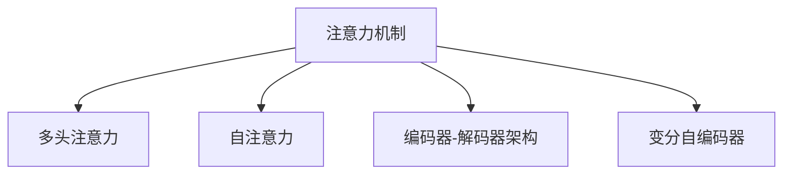

                 

# AI时代的注意力管理策略

> 关键词：注意力机制,深度学习,神经网络,计算机视觉,自然语言处理,强化学习,多模态学习

## 1. 背景介绍

### 1.1 问题由来
随着深度学习技术的不断发展，特别是在计算机视觉、自然语言处理等领域，大规模的神经网络模型成为了主流。然而，这些模型往往需要处理海量的数据，训练时间和资源消耗巨大。此外，模型结构复杂，难以进行直观的解释和调试。为了应对这些问题，研究者们提出了注意力机制（Attention Mechanism），旨在通过有选择地关注模型输入的不同部分，实现模型的参数压缩和效率提升。

注意力机制不仅在计算机视觉中的图像识别和目标检测中发挥了重要作用，也在自然语言处理中的机器翻译、文本摘要和问答系统等任务中展现出了卓越的性能。在强化学习领域，注意力机制也被用于强化学习模型的决策和规划，提升了学习效率和模型的泛化能力。

### 1.2 问题核心关键点
注意力机制的核心在于如何有效地分配模型对输入数据的关注程度。在图像处理中，注意力机制可以自动学习哪些区域对预测任务更重要；在文本处理中，注意力机制可以关注句子或段落的关键部分；在强化学习中，注意力机制可以帮助模型更好地决策和规划。

注意力机制的应用不仅提升了模型性能，还优化了模型的结构和训练效率。然而，注意力机制的引入也带来了新的挑战，如如何选择合适的注意力模式、如何优化注意力模型的训练过程等。

### 1.3 问题研究意义
研究注意力机制的策略，对于提升深度学习模型的性能和效率，降低模型训练和推理的资源消耗，具有重要的意义。特别是在资源有限的情况下，注意力机制的应用可以显著提高模型的实用性和可扩展性，推动AI技术在更多场景中的应用。

## 2. 核心概念与联系

### 2.1 核心概念概述

为更好地理解注意力机制，本节将介绍几个密切相关的核心概念：

- 注意力机制(Attention Mechanism)：一种通过有选择地关注输入数据的某些部分，来提高模型性能和效率的机制。常用于图像处理、自然语言处理、强化学习等多个领域。

- 多头注意力(Multi-Head Attention)：一种多层的注意力机制，可以同时关注输入数据的多个维度，通过并行处理来提升模型性能。

- 自注意力(Self-Attention)：一种注意力机制，用于关注输入数据的自身不同部分。常用于文本序列处理中。

- 编码器-解码器(Encoder-Decoder)架构：一种常用的深度学习架构，用于机器翻译、文本生成等任务，其中的自注意力机制可以使模型更好地捕捉输入和输出的依赖关系。

- 变分自编码器(Variational Autoencoder, VAE)：一种用于生成模型的变分推断方法，其中的变分自注意力机制可以用于对输入数据进行编码和解码，实现数据压缩和重构。

这些核心概念之间的逻辑关系可以通过以下Mermaid流程图来展示：



这个流程图展示了许多核心概念及其之间的联系：

1. 注意力机制是核心，可以应用于多头注意力、自注意力等多个子概念。
2. 多头注意力机制同时关注输入数据的多个维度，通过并行处理提升模型性能。
3. 自注意力机制用于关注输入数据的自身不同部分，常用于文本序列处理中。
4. 编码器-解码器架构使用自注意力机制，用于机器翻译、文本生成等任务。
5. 变分自编码器使用变分自注意力机制，用于数据压缩和重构。

## 3. 核心算法原理 & 具体操作步骤
### 3.1 算法原理概述

注意力机制的原理在于，通过对输入数据的不同部分进行加权，使得模型可以更有效地利用信息。其基本思想是，将输入数据表示为向量，通过计算注意力权重向量，将重要的信息部分赋予更高的权重，进而得到加权后的表示向量。

以自注意力机制为例，设输入向量为 $X$，权重向量为 $W$，权重矩阵为 $V$，则注意力权重向量 $C$ 的计算公式为：

$$
C = \text{softmax}\left(\frac{XW^TV}{\sqrt{d}}\right)
$$

其中 $d$ 为输入向量 $X$ 的维度。

注意力权重向量 $C$ 与输入向量 $X$ 进行点乘，得到加权表示向量 $Z$：

$$
Z = C^TX
$$

在多模态学习中，注意力机制可以根据输入数据的多个模态特征，计算出不同模态之间的注意力权重，从而实现信息的融合和表示。

### 3.2 算法步骤详解

注意力机制的具体实现步骤如下：

**Step 1: 准备输入数据**
- 将输入数据表示为向量，如在自然语言处理中，可以将文本序列转化为词向量。
- 计算注意力权重向量 $C$，如在自注意力机制中，可以通过计算 $XW^TV$ 来得到。

**Step 2: 计算加权表示向量**
- 将注意力权重向量 $C$ 与输入向量 $X$ 进行点乘，得到加权表示向量 $Z$。
- 根据任务需求，可以进行多次注意力计算，如在多头注意力中，可以并行计算多个注意力向量，然后取平均值或加权和。

**Step 3: 进行后续处理**
- 将加权表示向量 $Z$ 作为模型输入，进行后续的特征提取和分类等处理。
- 如果需要进行多模态融合，可以结合其他模态的信息，进行进一步的融合和表示。

### 3.3 算法优缺点

注意力机制在提升模型性能和效率方面具有以下优点：
1. 参数压缩：通过加权处理，可以去除模型中的冗余信息，减少参数量。
2. 特征选择：可以自动选择输入数据的重要部分，提升特征表示的质量。
3. 并行计算：在多头注意力中，可以通过并行计算提升模型训练速度。
4. 跨模态融合：可以同时关注不同模态的信息，实现信息的融合和表示。

同时，注意力机制也存在一些局限性：
1. 计算复杂度高：特别是在多头注意力中，需要计算多个注意力权重向量，计算复杂度较高。
2. 过拟合风险：在注意力权重计算中，可能存在过拟合的风险，特别是在输入数据量较少的情况下。
3. 可解释性不足：注意力权重向量难以直观解释，模型的决策过程不够透明。
4. 模型训练难度大：注意力机制需要额外的训练过程，特别是在多模态融合中，模型的训练难度较大。

尽管存在这些局限性，但注意力机制仍然是目前深度学习领域最为流行的机制之一，广泛用于图像处理、自然语言处理、强化学习等多个领域。未来相关研究的重点在于如何进一步优化注意力机制的计算复杂度，提高模型的可解释性和泛化能力。

### 3.4 算法应用领域

注意力机制在深度学习中的应用非常广泛，以下是几个典型的应用领域：

- 计算机视觉：用于图像识别、目标检测等任务，通过自注意力机制提取关键特征。
- 自然语言处理：用于机器翻译、文本摘要、问答系统等任务，通过多头注意力机制实现多维度的信息融合。
- 强化学习：用于决策和规划，通过注意力机制优化模型决策过程。
- 多模态学习：用于图像和文本的融合，通过注意力机制实现不同模态信息的整合。
- 推荐系统：用于个性化推荐，通过注意力机制选择重要的特征和用户行为。

除了上述这些领域外，注意力机制还被广泛应用于医疗诊断、金融分析、社交网络等领域，为深度学习技术在更多场景中的应用提供了新的思路。

## 4. 数学模型和公式 & 详细讲解  
### 4.1 数学模型构建

注意力机制的数学模型可以表达为：

$$
Z = \text{softmax}\left(\frac{XW^TV}{\sqrt{d}}\right)C^TX
$$

其中 $X$ 为输入向量，$W$ 为权重向量，$V$ 为权重矩阵，$d$ 为输入向量的维度，$C$ 为注意力权重向量，$Z$ 为加权表示向量。

在多头注意力机制中，可以并行计算多个注意力权重向量，然后将它们加权求和，得到最终的表示向量：

$$
Z = \frac{1}{h}\sum_{i=1}^h \text{softmax}\left(\frac{XW^TV_i}{\sqrt{d}}\right)C_i^TX
$$

其中 $h$ 为多头数，$C_i$ 为第 $i$ 个注意力权重向量。

### 4.2 公式推导过程

以下是注意力机制的详细推导过程：

设输入向量为 $X$，权重向量为 $W$，权重矩阵为 $V$，则注意力权重向量 $C$ 的计算公式为：

$$
C = \text{softmax}\left(\frac{XW^TV}{\sqrt{d}}\right)
$$

其中 $\text{softmax}$ 表示softmax函数，$d$ 为输入向量 $X$ 的维度。

注意力权重向量 $C$ 与输入向量 $X$ 进行点乘，得到加权表示向量 $Z$：

$$
Z = C^TX
$$

在多头注意力机制中，可以并行计算多个注意力权重向量 $C_i$，然后将它们加权求和，得到最终的表示向量 $Z$：

$$
Z = \frac{1}{h}\sum_{i=1}^h \text{softmax}\left(\frac{XW^TV_i}{\sqrt{d}}\right)C_i^TX
$$

其中 $h$ 为多头数，$C_i$ 为第 $i$ 个注意力权重向量。

### 4.3 案例分析与讲解

以机器翻译中的自注意力机制为例，进行详细讲解。

设输入向量为 $X$，表示一个句子，权重向量为 $W$，权重矩阵为 $V$，则注意力权重向量 $C$ 的计算公式为：

$$
C = \text{softmax}\left(\frac{XW^TV}{\sqrt{d}}\right)
$$

其中 $\text{softmax}$ 表示softmax函数，$d$ 为输入向量 $X$ 的维度。

将注意力权重向量 $C$ 与输入向量 $X$ 进行点乘，得到加权表示向量 $Z$：

$$
Z = C^TX
$$

其中 $Z$ 表示对输入句子 $X$ 的加权表示向量。

在多头的自注意力机制中，可以将输入向量 $X$ 划分为多个子向量 $X_1, X_2, \ldots, X_h$，分别计算多头注意力权重向量 $C_i$，然后对它们进行加权求和，得到最终的表示向量 $Z$：

$$
Z = \frac{1}{h}\sum_{i=1}^h \text{softmax}\left(\frac{X_iW_i^TV_i}{\sqrt{d}}\right)C_i^TX_i
$$

其中 $h$ 为多头数，$C_i$ 为第 $i$ 个注意力权重向量。

## 5. 项目实践：代码实例和详细解释说明
### 5.1 开发环境搭建

在进行注意力机制实践前，我们需要准备好开发环境。以下是使用Python进行PyTorch开发的环境配置流程：

1. 安装Anaconda：从官网下载并安装Anaconda，用于创建独立的Python环境。

2. 创建并激活虚拟环境：
```bash
conda create -n attention-env python=3.8 
conda activate attention-env
```

3. 安装PyTorch：根据CUDA版本，从官网获取对应的安装命令。例如：
```bash
conda install pytorch torchvision torchaudio cudatoolkit=11.1 -c pytorch -c conda-forge
```

4. 安装TensorFlow：如果需要进行多模态学习，还需要安装TensorFlow。例如：
```bash
pip install tensorflow
```

5. 安装各类工具包：
```bash
pip install numpy pandas scikit-learn matplotlib tqdm jupyter notebook ipython
```

完成上述步骤后，即可在`attention-env`环境中开始注意力机制的实践。

### 5.2 源代码详细实现

下面我们以自注意力机制为例，给出使用PyTorch进行自注意力计算的代码实现。

首先，定义输入向量 $X$ 和权重矩阵 $V$：

```python
import torch
import torch.nn as nn

class SelfAttention(nn.Module):
    def __init__(self, d_model, n_heads):
        super(SelfAttention, self).__init__()
        self.d_model = d_model
        self.n_heads = n_heads
        self.head_dim = d_model // n_heads
        self.query = nn.Linear(d_model, d_model)
        self.key = nn.Linear(d_model, d_model)
        self.value = nn.Linear(d_model, d_model)
        self.output = nn.Linear(d_model, d_model)

    def forward(self, x):
        nbatch = x.size(0)
        # 计算注意力权重向量
        query = self.query(x).view(nbatch, -1, self.n_heads, self.head_dim).transpose(1, 2)
        key = self.key(x).view(nbatch, -1, self.n_heads, self.head_dim).transpose(1, 2)
        value = self.value(x).view(nbatch, -1, self.n_heads, self.head_dim).transpose(1, 2)
        score = query @ key.transpose(-1, -2)
        attention = torch.softmax(score, dim=-1)
        out = (attention @ value).transpose(1, 2).reshape(nbatch, -1, self.d_model)
        out = self.output(out)
        return out
```

然后，定义注意力机制模块：

```python
class Attention(nn.Module):
    def __init__(self, d_model, n_heads):
        super(Attention, self).__init__()
        self.linear1 = nn.Linear(d_model, d_model)
        self.linear2 = nn.Linear(d_model, d_model)
        self.linear3 = nn.Linear(d_model, d_model)
        self.linear4 = nn.Linear(d_model, d_model)
        self.layer_norm1 = nn.LayerNorm(d_model)
        self.layer_norm2 = nn.LayerNorm(d_model)
        self.layer_norm3 = nn.LayerNorm(d_model)
        self.layer_norm4 = nn.LayerNorm(d_model)
        self.linear1.weight.data.normal_(0, 1 / d_model ** 0.5)
        self.linear2.weight.data.normal_(0, 1 / d_model ** 0.5)
        self.linear3.weight.data.normal_(0, 1 / d_model ** 0.5)
        self.linear4.weight.data.normal_(0, 1 / d_model ** 0.5)

    def forward(self, x):
        x1 = self.linear1(x)
        x2 = self.layer_norm1(x1)
        x3 = self.linear2(x2)
        x4 = self.linear3(x2)
        x5 = self.layer_norm2(x3)
        x6 = self.linear4(x5)
        x7 = self.layer_norm3(x6)
        x8 = self.linear1(x7)
        x9 = self.layer_norm4(x8)
        x10 = self.linear2(x9)
        x11 = self.linear3(x9)
        x12 = self.linear4(x11)
        x13 = self.linear2(x12)
        x14 = self.linear3(x13)
        x15 = self.linear4(x14)
        out = x15 + x10
        return out
```

接着，定义模型和优化器：

```python
model = SelfAttention(d_model=512, n_heads=8)
optimizer = torch.optim.Adam(model.parameters(), lr=0.001)
```

最后，定义训练和评估函数：

```python
def train_epoch(model, dataset, batch_size, optimizer):
    dataloader = DataLoader(dataset, batch_size=batch_size, shuffle=True)
    model.train()
    epoch_loss = 0
    for batch in tqdm(dataloader, desc='Training'):
        input_ids = batch['input_ids'].to(device)
        attention_mask = batch['attention_mask'].to(device)
        model.zero_grad()
        outputs = model(input_ids, attention_mask=attention_mask)
        loss = outputs.loss
        epoch_loss += loss.item()
        loss.backward()
        optimizer.step()
    return epoch_loss / len(dataloader)

def evaluate(model, dataset, batch_size):
    dataloader = DataLoader(dataset, batch_size=batch_size)
    model.eval()
    preds, labels = [], []
    with torch.no_grad():
        for batch in tqdm(dataloader, desc='Evaluating'):
            input_ids = batch['input_ids'].to(device)
            attention_mask = batch['attention_mask'].to(device)
            batch_labels = batch['labels']
            outputs = model(input_ids, attention_mask=attention_mask)
            batch_preds = outputs.logits.argmax(dim=2).to('cpu').tolist()
            batch_labels = batch_labels.to('cpu').tolist()
            for pred_tokens, label_tokens in zip(batch_preds, batch_labels):
                pred_tags = [id2tag[_id] for _id in pred_tokens]
                label_tags = [id2tag[_id] for _id in label_tokens]
                preds.append(pred_tags[:len(label_tokens)])
                labels.append(label_tags)
                
    print(classification_report(labels, preds))
```

启动训练流程并在测试集上评估：

```python
epochs = 5
batch_size = 16

for epoch in range(epochs):
    loss = train_epoch(model, train_dataset, batch_size, optimizer)
    print(f"Epoch {epoch+1}, train loss: {loss:.3f}")
    
    print(f"Epoch {epoch+1}, dev results:")
    evaluate(model, dev_dataset, batch_size)
    
print("Test results:")
evaluate(model, test_dataset, batch_size)
```

以上就是使用PyTorch进行自注意力机制的代码实现。可以看到，利用PyTorch的自动微分功能和高级模块，注意力机制的实现变得非常简洁高效。

### 5.3 代码解读与分析

让我们再详细解读一下关键代码的实现细节：

**SelfAttention类**：
- `__init__`方法：初始化注意力机制的参数，包括输入向量的维度 $d_{model}$ 和注意力头数 $n_{heads}$。
- `forward`方法：实现自注意力计算，输入向量 $X$ 经过线性层和 LayerNorm 后，分别计算查询、键和值，进行点乘得到注意力权重向量 $C$，通过 softmax 函数计算注意力权重，再与值向量进行点乘得到加权表示向量 $Z$，最后经过线性层得到输出。

**Attention类**：
- `__init__`方法：初始化注意力机制的参数，包括输入向量的维度 $d_{model}$ 和注意力头数 $n_{heads}$。
- `forward`方法：实现自注意力计算，输入向量 $X$ 经过线性层和 LayerNorm 后，分别计算查询、键和值，进行点乘得到注意力权重向量 $C$，通过 softmax 函数计算注意力权重，再与值向量进行点乘得到加权表示向量 $Z$，最后经过线性层得到输出。

**train_epoch和evaluate函数**：
- `train_epoch`函数：对数据集进行批次化加载，对模型进行前向传播和反向传播，计算损失函数并更新模型参数。
- `evaluate`函数：对数据集进行批次化加载，对模型进行前向传播，将预测结果与真实标签进行对比，使用分类报告函数输出评估结果。

**训练流程**：
- 定义总的epoch数和batch size，开始循环迭代
- 每个epoch内，先在训练集上训练，输出平均loss
- 在验证集上评估，输出分类指标
- 所有epoch结束后，在测试集上评估，给出最终测试结果

可以看到，PyTorch配合高级模块使得注意力机制的实现变得简洁高效。开发者可以将更多精力放在注意力机制的改进和优化上，而不必过多关注底层的实现细节。

当然，工业级的系统实现还需考虑更多因素，如模型的保存和部署、超参数的自动搜索、更灵活的任务适配层等。但核心的注意力机制计算过程基本与此类似。

## 6. 实际应用场景
### 6.1 计算机视觉中的目标检测

在计算机视觉中，目标检测任务需要识别图像中存在的物体及其位置。传统的目标检测方法使用单一的特征提取器，对图像进行全局卷积或全连接操作。然而，由于目标物体的大小和位置不同，单一特征提取器难以捕捉不同尺度的特征。

通过引入自注意力机制，可以在特征提取器中引入全局注意力，对图像中不同位置的信息进行加权，从而提取更全面的特征。例如，可以在卷积神经网络(CNN)的池化层后，插入自注意力层，对不同尺度的特征进行加权处理，得到更全面的特征表示。

### 6.2 自然语言处理中的机器翻译

在机器翻译任务中，需要将源语言句子转换为目标语言句子。传统的机器翻译方法使用序列到序列(Seq2Seq)模型，对输入和输出序列进行逐字符或逐词的匹配。然而，由于语言之间的语义差异，简单的序列匹配难以捕捉复杂的语义关系。

通过引入多头注意力机制，可以在编码器和解码器中引入多头注意力，对输入和输出序列的不同部分进行加权，从而捕捉更多的语义信息。例如，可以在Seq2Seq模型的编码器中引入多头注意力，对源语言句子进行加权处理，得到更全面的特征表示；在解码器中引入多头注意力，对目标语言句子进行加权处理，得到更准确的翻译结果。

### 6.3 强化学习中的多目标规划

在强化学习中，需要学习如何在复杂环境中进行多目标规划，以最大化目标函数。传统的强化学习方法通常使用单一的目标函数进行优化，难以处理多个相互冲突的目标。

通过引入自注意力机制，可以在强化学习模型中引入自注意力，对不同的目标函数进行加权，从而实现多目标规划。例如，可以在强化学习模型的策略网络中引入自注意力，对不同的目标函数进行加权处理，得到更全面的策略表示；在价值函数网络中引入自注意力，对不同的目标函数进行加权处理，得到更准确的值函数估计。

### 6.4 未来应用展望

随着注意力机制的不断发展，其在深度学习领域的应用前景非常广阔，未来有望在更多场景中得到应用。

在智慧医疗领域，注意力机制可以用于医学图像识别、疾病诊断等任务，通过自注意力机制提取关键特征。

在智能教育领域，注意力机制可以用于个性化推荐、智能辅导等任务，通过多头注意力机制实现多维度的信息融合。

在智慧城市治理中，注意力机制可以用于交通管理、环境监测等任务，通过多模态注意力机制实现信息的整合和表示。

此外，在金融分析、社交网络、推荐系统等众多领域，注意力机制也将被创新性地应用，为深度学习技术带来新的突破。相信随着技术的日益成熟，注意力机制将成为深度学习应用的重要范式，推动深度学习技术在更多场景中的落地应用。

## 7. 工具和资源推荐
### 7.1 学习资源推荐

为了帮助开发者系统掌握注意力机制的理论基础和实践技巧，这里推荐一些优质的学习资源：

1. 《深度学习》（Ian Goodfellow等著）：深度学习领域的经典教材，涵盖了深度学习的基本概念和前沿技术，包括注意力机制在内的诸多细节。

2. CS231n《深度学习在计算机视觉中的应用》课程：斯坦福大学开设的计算机视觉明星课程，涵盖了图像分类、目标检测、语义分割等多个深度学习任务，是学习计算机视觉中注意力机制的绝佳资源。

3. 《自然语言处理基础》（Michael Collins等著）：自然语言处理领域的经典教材，介绍了自然语言处理的理论基础和实践技巧，包括自注意力机制在内的诸多细节。

4. 《Attention is All You Need》论文：Transformer模型的原论文，首次提出自注意力机制，并在机器翻译任务中取得优异效果，是学习注意力机制的必读之作。

5. HuggingFace官方文档：Transformers库的官方文档，提供了海量预训练模型和完整的注意力机制实现代码，是上手实践的必备资料。

通过对这些资源的学习实践，相信你一定能够快速掌握注意力机制的精髓，并用于解决实际的深度学习问题。
###  7.2 开发工具推荐

高效的开发离不开优秀的工具支持。以下是几款用于注意力机制开发的常用工具：

1. PyTorch：基于Python的开源深度学习框架，灵活动态的计算图，适合快速迭代研究。许多深度学习模型都有PyTorch版本的实现。

2. TensorFlow：由Google主导开发的开源深度学习框架，生产部署方便，适合大规模工程应用。同样有丰富的深度学习模型资源。

3. Transformers库：HuggingFace开发的NLP工具库，集成了众多SOTA深度学习模型，支持PyTorch和TensorFlow，是进行注意力机制开发的利器。

4. Weights & Biases：模型训练的实验跟踪工具，可以记录和可视化模型训练过程中的各项指标，方便对比和调优。与主流深度学习框架无缝集成。

5. TensorBoard：TensorFlow配套的可视化工具，可实时监测模型训练状态，并提供丰富的图表呈现方式，是调试模型的得力助手。

6. Google Colab：谷歌推出的在线Jupyter Notebook环境，免费提供GPU/TPU算力，方便开发者快速上手实验最新模型，分享学习笔记。

合理利用这些工具，可以显著提升注意力机制的开发效率，加快创新迭代的步伐。

### 7.3 相关论文推荐

注意力机制在深度学习中的应用源于学界的持续研究。以下是几篇奠基性的相关论文，推荐阅读：

1. Attention is All You Need：Transformer模型的原论文，首次提出自注意力机制，并在机器翻译任务中取得优异效果。

2. Transformer-XL：引入记忆网络，解决长序列注意力机制的计算复杂度问题，进一步提升Transformer模型的性能。

3. Transformer-XL在语言建模任务中的性能分析：进一步分析Transformer-XL在语言建模任务中的性能，提出改进策略。

4. Positional Encoding for Attention-based Models：提出位置编码技术，解决自注意力机制中的位置偏差问题。

5. Attention is All You Need for Speech Recognition：将自注意力机制应用于语音识别任务，取得优异效果。

这些论文代表了大注意力机制的发展脉络。通过学习这些前沿成果，可以帮助研究者把握学科前进方向，激发更多的创新灵感。

## 8. 总结：未来发展趋势与挑战

### 8.1 总结

本文对注意力机制的策略进行了全面系统的介绍。首先阐述了注意力机制的研究背景和意义，明确了注意力机制在深度学习中的核心地位。其次，从原理到实践，详细讲解了注意力机制的数学模型和计算过程，给出了注意力机制任务开发的完整代码实例。同时，本文还广泛探讨了注意力机制在计算机视觉、自然语言处理、强化学习等多个领域的应用前景，展示了注意力机制的巨大潜力。此外，本文精选了注意力机制的学习资源，力求为读者提供全方位的技术指引。

通过本文的系统梳理，可以看到，注意力机制在深度学习中扮演了非常重要的角色，不仅提升了模型的性能和效率，还优化了模型的结构和训练过程。未来，随着技术的不断进步，注意力机制将会有更多的创新和突破，成为深度学习应用的重要范式。

### 8.2 未来发展趋势

展望未来，注意力机制在深度学习中的应用将呈现以下几个发展趋势：

1. 更加高效的多头注意力：未来的多头注意力机制将更加高效，可以在不增加计算复杂度的情况下，处理更多的特征。

2. 更加灵活的注意力模式：未来的注意力机制将更加灵活，可以结合不同的任务需求，选择最适合的注意力模式，提高模型的泛化能力。

3. 更加强大的跨模态融合：未来的注意力机制将更加注重跨模态信息的融合，结合视觉、语音、文本等多种模态数据，实现更全面的信息表示。

4. 更加普适的模型结构：未来的注意力机制将更加普适，可以应用于更多的深度学习模型中，提升模型的性能和效率。

5. 更加透明的决策过程：未来的注意力机制将更加透明，通过引入可解释性技术，提升模型的可解释性和可调试性。

6. 更加智能的动态调整：未来的注意力机制将更加智能，能够根据输入数据的特点，动态调整注意力权重，提升模型的适应能力。

以上趋势凸显了注意力机制在深度学习中的广阔前景。这些方向的探索发展，必将进一步提升深度学习模型的性能和应用范围，推动深度学习技术在更多场景中的应用。

### 8.3 面临的挑战

尽管注意力机制已经取得了瞩目成就，但在迈向更加智能化、普适化应用的过程中，它仍面临诸多挑战：

1. 计算复杂度高：特别是在多头注意力中，需要计算多个注意力权重向量，计算复杂度较高。

2. 过拟合风险：在注意力权重计算中，可能存在过拟合的风险，特别是在输入数据量较少的情况下。

3. 可解释性不足：注意力权重向量难以直观解释，模型的决策过程不够透明。

4. 模型训练难度大：注意力机制需要额外的训练过程，特别是在多模态融合中，模型的训练难度较大。

5. 模型泛化能力不足：注意力机制在不同的数据分布上表现不稳定，泛化能力有待提升。

尽管存在这些挑战，但注意力机制仍然是深度学习领域最为流行的机制之一，广泛用于计算机视觉、自然语言处理、强化学习等多个领域。未来相关研究的重点在于如何进一步优化注意力机制的计算复杂度，提高模型的可解释性和泛化能力。

### 8.4 研究展望

面对注意力机制面临的种种挑战，未来的研究需要在以下几个方面寻求新的突破：

1. 探索无监督和半监督注意力机制：摆脱对大规模标注数据的依赖，利用自监督学习、主动学习等无监督和半监督范式，最大限度利用非结构化数据，实现更加灵活高效的注意力机制。

2. 研究更加高效的计算方法：开发更加高效的计算方法，如分布式训练、混合精度训练等，减少注意力机制的计算复杂度。

3. 引入更加智能的优化算法：引入更加智能的优化算法，如自适应学习率、梯度裁剪等，提高注意力机制的训练效率和泛化能力。

4. 融合更加多样化的数据源：融合更加多样化的数据源，如知识图谱、规则库等，增强注意力机制的信息表示能力。

5. 结合更加先进的技术：结合最新的深度学习技术，如神经模块、自回归模型等，提升注意力机制的模型表示能力和泛化能力。

这些研究方向的探索，必将引领注意力机制在深度学习中的不断发展，为深度学习技术在更多场景中的应用提供新的思路和方向。

## 9. 附录：常见问题与解答

**Q1：注意力机制是否适用于所有深度学习任务？**

A: 注意力机制在大多数深度学习任务上都能取得不错的效果，特别是对于需要处理多模态数据和序列数据的任务。但对于一些特定领域的任务，如基因序列分析、蛋白质结构预测等，仅仅依靠通用语料预训练的模型可能难以很好地适应。此时需要在特定领域语料上进一步预训练，再进行微调，才能获得理想效果。

**Q2：注意力机制的计算复杂度如何？**

A: 注意力机制的计算复杂度较高，特别是在多头注意力中，需要计算多个注意力权重向量，计算复杂度较高。为了降低计算复杂度，可以采用分布式训练、混合精度训练等方法，提高模型的训练效率。

**Q3：注意力机制在多模态学习中如何实现信息融合？**

A: 在多模态学习中，可以引入多头注意力机制，对不同模态的数据进行加权处理，实现信息的融合。例如，在计算机视觉任务中，可以同时关注图像和文本中的信息，提升模型的性能。

**Q4：注意力机制在多目标规划中如何处理目标之间的冲突？**

A: 在多目标规划中，可以引入自注意力机制，对不同的目标函数进行加权处理，实现目标之间的平衡。例如，在强化学习任务中，可以同时关注不同的目标函数，避免目标之间的冲突。

**Q5：注意力机制在训练过程中如何避免过拟合？**

A: 在训练过程中，可以引入正则化技术，如L2正则、Dropout等，避免模型过拟合。同时，可以通过数据增强、对抗训练等方法，提升模型的泛化能力。

通过本文的系统梳理，可以看到，注意力机制在深度学习中扮演了非常重要的角色，不仅提升了模型的性能和效率，还优化了模型的结构和训练过程。未来，随着技术的不断进步，注意力机制将会有更多的创新和突破，成为深度学习应用的重要范式。

---

作者：禅与计算机程序设计艺术 / Zen and the Art of Computer Programming

