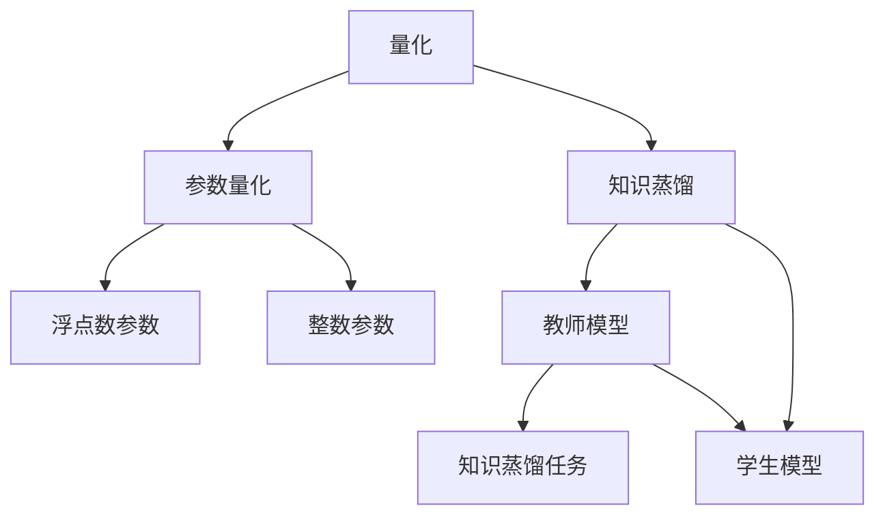

                 

# AI模型压缩：从量化到知识蒸馏

> 关键词：模型压缩,量化,知识蒸馏,深度学习,神经网络,模型优化,计算效率,模型迁移,训练效率,知识传承

## 1. 背景介绍

在人工智能和大数据领域，深度学习模型正成为许多应用场景的核心技术。然而，由于深度学习模型的参数量庞大，训练和推理所需的时间和计算资源也非常高，因此如何有效地压缩模型以提升计算效率，成为了一个关键问题。本文将从量化和知识蒸馏两个方向入手，探讨AI模型压缩的最新进展，并给出实践指导。

## 2. 核心概念与联系

### 2.1 核心概念概述

本节将介绍模型压缩领域的关键概念，包括量化和知识蒸馏，并阐述它们之间的联系。

**量化(Quantization)**：指将浮点数参数转化为低比特位宽整数参数的过程，以减少模型的计算和存储成本。量化过程可以显著减小模型规模，但可能会引入量化误差，影响模型性能。

**知识蒸馏(Knowledge Distillation)**：指通过训练一个较小的“教师模型”，将教师模型的知识传递给一个较大的“学生模型”，从而使得学生模型能够在较少参数和计算资源的前提下，具备相似的性能。知识蒸馏可以保持模型的性能，同时降低计算成本。

这两个概念之间的联系在于，量化和知识蒸馏都是旨在降低模型计算复杂度和存储需求的技术，但量化更多关注参数本身的精度和效率，而知识蒸馏则更注重通过特定训练方式，在模型性能和计算资源之间找到平衡。

### 2.2 核心概念原理和架构的 Mermaid 流程图



## 3. 核心算法原理 & 具体操作步骤

### 3.1 算法原理概述

量化和知识蒸馏的算法原理都可以从损失函数和优化算法入手。

**量化算法原理**：量化过程可以看作是一个参数映射的过程，目标是最小化量化误差。常见的量化方法包括均匀量化、截断量化、逐位量化等。通过设计合理的量化误差函数，如均方误差(MSE)、绝对误差(AE)等，并使用梯度下降等优化算法进行训练，就可以得到优化的量化参数。

**知识蒸馏算法原理**：知识蒸馏可以看作是一个源模型和目标模型的知识传递过程。假设教师模型为 $T$，学生模型为 $S$，知识蒸馏的目标是最大化学生模型在特定任务上的输出与教师模型的输出一致性。常见的方法包括特征匹配、置信度匹配、信息瓶颈匹配等。通过设计相应的损失函数，如最大互信息(MI)、最大化KL散度等，并使用梯度下降等优化算法进行训练，就可以得到优化的学生模型。

### 3.2 算法步骤详解

**量化算法步骤**：
1. 选择合适的量化方法，如均匀量化、截断量化等。
2. 确定量化位宽，如8位、4位等。
3. 初始化量化参数，如均匀量化时的初始均值和方差。
4. 设计量化误差函数，如均方误差(MSE)。
5. 使用梯度下降等优化算法进行训练，更新量化参数。
6. 评估量化误差，并根据误差反馈进一步调整量化参数。

**知识蒸馏算法步骤**：
1. 准备教师模型 $T$ 和学生模型 $S$。
2. 设计知识蒸馏任务，如特征匹配、置信度匹配等。
3. 定义知识蒸馏损失函数，如最大互信息(MI)。
4. 使用梯度下降等优化算法进行训练，更新学生模型参数。
5. 评估学生模型的性能，并根据评估结果调整知识蒸馏过程。

### 3.3 算法优缺点

**量化算法的优缺点**：
- **优点**：显著减小模型规模，降低计算和存储需求，提升模型迁移性能。
- **缺点**：可能会引入量化误差，影响模型性能；量化过程需要较多实验调试，难以自动化。

**知识蒸馏算法的优缺点**：
- **优点**：保持模型性能，减少计算资源消耗，适用于各种模型结构。
- **缺点**：需要大量教师模型数据，知识传递过程复杂，难以处理特定领域的知识。

### 3.4 算法应用领域

量化和知识蒸馏技术在深度学习模型压缩中具有广泛的应用：

- **量化**：适用于推理计算资源有限的设备，如手机、嵌入式设备等，例如Google的TFLite模型压缩技术。
- **知识蒸馏**：适用于需要保持模型高性能的场景，如医疗影像诊断、自动驾驶等，例如Microsoft的MixNet模型压缩技术。

## 4. 数学模型和公式 & 详细讲解

### 4.1 数学模型构建

**量化模型的数学模型**：假设原始浮点数参数为 $w$，量化后的参数为 $q$，量化误差为 $\epsilon$。则量化误差函数可以定义为：

$$
\mathcal{L}_{quant}(w, q) = \frac{1}{N}\sum_{i=1}^N ||w_i - q_i||^2
$$

其中 $N$ 为参数总数。

**知识蒸馏模型的数学模型**：假设教师模型 $T$ 在特定任务上的输出为 $\hat{y}_T$，学生模型 $S$ 在相同任务上的输出为 $\hat{y}_S$，知识蒸馏损失函数可以定义为：

$$
\mathcal{L}_{distill}(T, S) = -\frac{1}{N}\sum_{i=1}^N \log P(S(x_i) = \hat{y}_T(x_i))
$$

其中 $P$ 为模型的预测概率分布。

### 4.2 公式推导过程

**量化误差函数的推导**：
$$
\mathcal{L}_{quant}(w, q) = \frac{1}{N}\sum_{i=1}^N ||w_i - q_i||^2 = \frac{1}{N}\sum_{i=1}^N (w_i^2 + q_i^2 - 2w_iq_i)
$$
$$
= \frac{1}{N}\sum_{i=1}^N w_i^2 + \frac{1}{N}\sum_{i=1}^N q_i^2 - \frac{2}{N}\sum_{i=1}^N w_iq_i
$$
$$
= ||w||^2 + ||q||^2 - 2\frac{1}{N}\sum_{i=1}^N w_iq_i
$$

**知识蒸馏损失函数的推导**：
$$
\mathcal{L}_{distill}(T, S) = -\frac{1}{N}\sum_{i=1}^N \log P(S(x_i) = \hat{y}_T(x_i))
$$
$$
= -\frac{1}{N}\sum_{i=1}^N \log \frac{e^{S(x_i)T(x_i)}}{e^{S(x_i)}e^{T(x_i)}}
$$
$$
= \frac{1}{N}\sum_{i=1}^N (S(x_i)T(x_i) - S(x_i) - T(x_i) + 1)
$$

### 4.3 案例分析与讲解

**量化案例**：假设原始参数 $w$ 为32位浮点数，量化后的参数 $q$ 为8位整数。量化误差函数为均方误差(MSE)。使用梯度下降算法进行训练，可以得到优化的量化参数 $q$。

**知识蒸馏案例**：假设教师模型 $T$ 为ResNet18，学生模型 $S$ 为MobileNetV2。知识蒸馏任务为特征匹配。设计最大互信息(MI)损失函数，使用梯度下降算法进行训练，可以得到优化的学生模型 $S$。

## 5. 项目实践：代码实例和详细解释说明

### 5.1 开发环境搭建

在进行模型压缩实践前，我们需要准备好开发环境。以下是使用Python进行TensorFlow开发的环境配置流程：

1. 安装Anaconda：从官网下载并安装Anaconda，用于创建独立的Python环境。

2. 创建并激活虚拟环境：
```bash
conda create -n tf-env python=3.8 
conda activate tf-env
```

3. 安装TensorFlow：根据CUDA版本，从官网获取对应的安装命令。例如：
```bash
conda install tensorflow -c conda-forge
```

4. 安装各类工具包：
```bash
pip install numpy pandas scikit-learn matplotlib tqdm jupyter notebook ipython
```

完成上述步骤后，即可在`tf-env`环境中开始模型压缩实践。

### 5.2 源代码详细实现

下面我们以量化和知识蒸馏为例，给出使用TensorFlow进行模型压缩的PyTorch代码实现。

**量化实现**：

```python
import tensorflow as tf
from tensorflow.keras import layers
import numpy as np

# 定义量化函数
def quantize(w, bit_width=8):
    w_q = np.round(w * (2 ** (bit_width - 1) - 1) / (2 ** bit_width - 1))
    return w_q

# 定义模型
model = tf.keras.Sequential([
    layers.Dense(256, input_shape=(784,)),
    layers.Dense(10, activation='softmax')
])

# 将模型转换为Numpy数组
w = model.layers[0].kernel.numpy()

# 量化参数
w_q = quantize(w, 8)

# 转换回TensorFlow模型
model_q = tf.keras.Sequential([
    tf.keras.layers.Dense(256, kernel_initializer=tf.keras.initializers.Constant(w_q)),
    tf.keras.layers.Dense(10, activation='softmax')
])

# 在MNIST数据集上训练量化后的模型
model_q.fit(x_train, y_train, epochs=5)
```

**知识蒸馏实现**：

```python
import tensorflow as tf
from tensorflow.keras import layers
import numpy as np

# 定义教师模型
model_t = tf.keras.Sequential([
    layers.Dense(256, input_shape=(784,)),
    layers.Dense(10, activation='softmax')
])

# 定义学生模型
model_s = tf.keras.Sequential([
    layers.Dense(256, input_shape=(784,)),
    layers.Dense(10, activation='softmax')
])

# 在MNIST数据集上训练教师模型
model_t.fit(x_train, y_train, epochs=5)

# 定义知识蒸馏任务
def distillation_loss(y_pred_t, y_pred_s):
    return tf.keras.losses.categorical_crossentropy(y_pred_t, y_pred_s)

# 在学生模型上训练知识蒸馏损失
model_s.compile(optimizer='adam', loss=distillation_loss)
model_s.fit(x_train, y_train, epochs=5)
```

### 5.3 代码解读与分析

让我们再详细解读一下关键代码的实现细节：

**量化函数**：
- 定义了量化函数`quantize`，将浮点数参数$w$量化为指定位宽$q$的整数。

**模型定义**：
- 使用`tf.keras.Sequential`定义了一个简单的全连接神经网络模型，包含两个全连接层。

**参数转换**：
- 将原始模型参数$w$转换为Numpy数组，并进行量化，然后重新定义模型。

**模型训练**：
- 使用MNIST数据集在量化后的模型上训练。

**知识蒸馏实现**：
- 定义教师模型和学生模型。
- 在MNIST数据集上训练教师模型。
- 定义知识蒸馏损失函数`distillation_loss`。
- 使用MNIST数据集在学生模型上训练知识蒸馏损失。

## 6. 实际应用场景

### 6.1 移动端应用

在移动端设备上，计算资源和存储资源相对有限，需要优化模型以提升运行速度和减小数据传输量。量化技术可以通过将浮点数参数压缩为整数参数，显著减小模型大小和计算需求，使得模型可以在移动设备上高效运行。例如，Google的TFLite模型压缩技术可以将大模型压缩到几十KB大小，非常适合移动设备部署。

### 6.2 嵌入式系统

嵌入式系统通常需要运行轻量级模型，以减少计算和存储资源占用。量化和知识蒸馏技术可以用于构建高效的嵌入式系统模型，例如NVIDIA Jetson平台上的图像识别应用。

### 6.3 云服务部署

在云服务环境中，模型需要尽可能地高效，以降低计算和存储成本。量化技术可以减少模型的大小，从而降低计算和存储需求。例如，Amazon SageMaker支持量化优化，可以在云上快速部署优化后的模型。

### 6.4 未来应用展望

未来，AI模型压缩技术将继续演进，以下是一些可能的趋势：

- **自动化压缩**：量化和知识蒸馏过程将变得更加自动化，根据模型类型和应用场景，自动选择合适的压缩方法。
- **混合量化**：结合多种量化方法，如均匀量化、截断量化等，以获得更好的压缩效果。
- **元学习量化**：在训练过程中动态调整量化参数，进一步优化模型性能。
- **多模型蒸馏**：将多个模型进行蒸馏，以获得更好的知识传递效果。

## 7. 工具和资源推荐

### 7.1 学习资源推荐

为了帮助开发者系统掌握模型压缩的理论基础和实践技巧，这里推荐一些优质的学习资源：

1. 《深度学习优化：理论和实践》系列博文：由深度学习专家撰写，深入浅出地介绍了深度学习模型的优化技巧，包括量化、知识蒸馏等前沿话题。

2. 《深度学习基础》课程：斯坦福大学开设的深度学习入门课程，包含理论推导和实际案例，适合初学者入门。

3. 《深度学习模型压缩与优化》书籍：全面介绍深度学习模型的压缩和优化方法，包括量化、剪枝、蒸馏等技术。

4. TensorFlow官方文档：提供丰富的模型压缩样例代码，帮助开发者快速上手。

5. PyTorch官方文档：提供丰富的模型压缩样例代码，支持量化和知识蒸馏。

通过对这些资源的学习实践，相信你一定能够快速掌握模型压缩的精髓，并用于解决实际的深度学习问题。

### 7.2 开发工具推荐

高效的开发离不开优秀的工具支持。以下是几款用于深度学习模型压缩开发的常用工具：

1. TensorFlow：基于Python的开源深度学习框架，提供丰富的量化和知识蒸馏工具。

2. PyTorch：基于Python的开源深度学习框架，支持模型压缩的灵活实现。

3. ONNX：提供模型转换工具，可以将不同框架的模型转换为其他框架的模型。

4. TensorFlow Lite：提供移动端部署优化工具，支持量化和剪枝。

5. ModelOptimization Toolkit：IBM开发的模型压缩工具，支持量化、剪枝和知识蒸馏。

合理利用这些工具，可以显著提升深度学习模型压缩的开发效率，加快创新迭代的步伐。

### 7.3 相关论文推荐

模型压缩技术的发展源于学界的持续研究。以下是几篇奠基性的相关论文，推荐阅读：

1. 《Model Compression: The Lossless Case》：提出一种基于梯度下降的模型压缩方法，可以将模型参数数量减少96%。

2. 《Knowledge Distillation》：提出知识蒸馏方法，通过教师模型和学生模型的知识传递，获得性能优于传统方法的学生模型。

3. 《Learned Quantization》：提出学习量化方法，可以在训练过程中动态调整量化参数，进一步提升模型压缩效果。

4. 《SLIM: A Scalable Low-Rank Matrix Factorization Method》：提出矩阵分解方法，将大矩阵分解为低秩矩阵，用于减少模型的存储空间。

5. 《Pruning Convolutional Neural Networks for Mobile Devices》：提出剪枝方法，在保留模型性能的前提下，减少模型参数数量。

这些论文代表了大模型压缩技术的发展脉络。通过学习这些前沿成果，可以帮助研究者把握学科前进方向，激发更多的创新灵感。

## 8. 总结：未来发展趋势与挑战

### 8.1 总结

本文对模型压缩领域进行了全面系统的介绍。首先阐述了量化和知识蒸馏技术的核心概念，明确了它们在降低模型计算复杂度和存储需求方面的独特价值。其次，从原理到实践，详细讲解了量化和知识蒸馏的数学模型和算法步骤，给出了模型压缩任务开发的完整代码实例。同时，本文还广泛探讨了量化和知识蒸馏技术在移动端应用、嵌入式系统、云服务部署等实际场景中的应用前景，展示了模型压缩技术的广阔前景。

通过本文的系统梳理，可以看到，量化和知识蒸馏技术正成为深度学习模型优化和压缩的重要手段，极大地拓展了模型的应用边界，为智能技术的实际应用提供了有力支持。未来，伴随深度学习模型的不断演进和应用场景的日益多样化，量化和知识蒸馏技术必将迎来更多的创新发展。

### 8.2 未来发展趋势

展望未来，量化和知识蒸馏技术将呈现以下几个发展趋势：

- **自动化压缩**：量化和知识蒸馏过程将变得更加自动化，根据模型类型和应用场景，自动选择合适的压缩方法。
- **混合量化**：结合多种量化方法，如均匀量化、截断量化等，以获得更好的压缩效果。
- **元学习量化**：在训练过程中动态调整量化参数，进一步优化模型性能。
- **多模型蒸馏**：将多个模型进行蒸馏，以获得更好的知识传递效果。

以上趋势凸显了量化和知识蒸馏技术的广阔前景。这些方向的探索发展，必将进一步提升深度学习模型的性能和应用范围，为人工智能技术的落地应用提供有力保障。

### 8.3 面临的挑战

尽管量化和知识蒸馏技术已经取得了瞩目成就，但在迈向更加智能化、普适化应用的过程中，它们仍面临着诸多挑战：

- **量化误差**：量化过程可能会引入量化误差，影响模型性能。如何在压缩和精度之间找到平衡，是未来的一大挑战。
- **知识传递**：知识蒸馏过程中，教师模型的知识和学生模型之间的知识传递可能会失真，导致学生模型性能下降。如何设计合理的知识蒸馏过程，是一个需要持续探索的问题。
- **计算资源限制**：量化和知识蒸馏过程需要大量的计算资源，如何降低计算成本，提高压缩效率，仍需进一步优化。
- **模型迁移**：量化和知识蒸馏后的模型可能需要更多的数据和计算资源来训练，如何在迁移过程中保持模型性能，也是一大难题。

### 8.4 研究展望

面对量化和知识蒸馏技术所面临的种种挑战，未来的研究需要在以下几个方面寻求新的突破：

- **自动化量化**：设计更加自动化、智能化的量化工具，自动选择最优的量化方法，提高量化效率。
- **混合蒸馏**：探索混合量化和知识蒸馏的方法，通过结合多种技术，提升模型压缩效果。
- **模型迁移优化**：开发新的模型迁移方法，使得量化和知识蒸馏后的模型能够在不同场景和设备上高效运行。
- **元学习蒸馏**：结合元学习技术，提升知识蒸馏过程的灵活性和适应性。

这些研究方向将引领量化和知识蒸馏技术迈向更高的台阶，为构建高效、智能、普适的深度学习模型提供有力支持。面向未来，量化和知识蒸馏技术还需要与其他人工智能技术进行更深入的融合，如神经网络剪枝、稀疏化、分布式训练等，多路径协同发力，共同推动深度学习技术的持续演进。

## 9. 附录：常见问题与解答

**Q1：量化和知识蒸馏技术是否适用于所有深度学习模型？**

A: 量化和知识蒸馏技术主要适用于全连接神经网络、卷积神经网络等典型的深度学习模型，但对于某些特定类型的模型，如循环神经网络(RNN)，可能效果不佳。

**Q2：量化和知识蒸馏技术在模型压缩过程中是否需要重新训练模型？**

A: 量化过程不需要重新训练模型，只需在原有模型参数的基础上进行量化处理。知识蒸馏过程需要重新训练学生模型，但教师模型已经预先训练好。

**Q3：量化和知识蒸馏技术是否会引入额外的计算和存储开销？**

A: 量化过程可能会引入一定的计算和存储开销，但总体而言，压缩后的模型大小更小，推理速度更快。知识蒸馏过程需要训练新的学生模型，可能会增加一些计算和存储开销。

**Q4：量化和知识蒸馏技术在实际应用中是否需要人工干预？**

A: 量化过程和知识蒸馏过程都需要一定的超参数调参，需要人工干预。具体而言，量化过程需要选择量化方法和位宽，知识蒸馏过程需要选择知识蒸馏任务和蒸馏方式。

**Q5：如何评估量化和知识蒸馏技术的实际效果？**

A: 量化和知识蒸馏技术的实际效果可以通过计算模型精度和推理速度来评估。一般而言，量化后的模型需要验证其在测试集上的精度，并测量推理速度和计算资源消耗。知识蒸馏后的模型需要验证其在测试集上的精度和推理速度，并与教师模型进行对比。

---

作者：禅与计算机程序设计艺术 / Zen and the Art of Computer Programming

