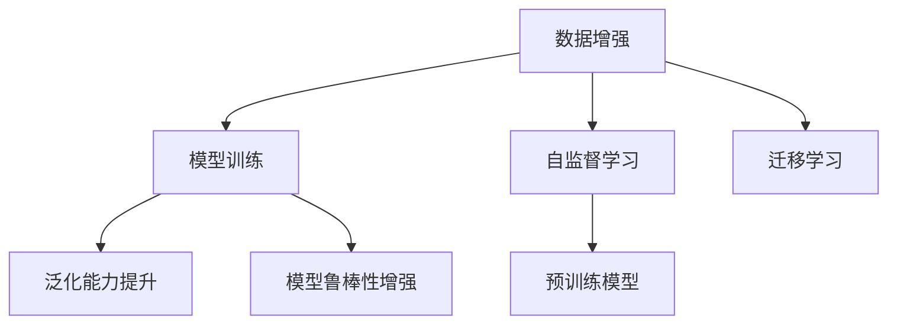

                 

# AI生成的数据增强：改善模型泛化能力

> 关键词：数据增强，泛化能力，AI生成，迁移学习，自监督学习，模型鲁棒性，深度学习

## 1. 背景介绍

在深度学习模型训练中，数据增强是一种重要的技术手段，通过引入数据扰动或生成额外数据来提高模型泛化能力。特别是随着大模型和自监督学习的兴起，数据增强技术变得更加关键。本文将深入探讨AI生成的数据增强方法，以及其对模型泛化能力提升的原理和应用。

## 2. 核心概念与联系

### 2.1 核心概念概述

数据增强（Data Augmentation）是指通过对训练数据集进行变换或生成新样本，从而增加数据多样性，减少模型过拟合，提升泛化能力的技术。AI生成的数据增强则是指利用人工智能技术，如生成对抗网络（GANs）、变分自编码器（VAEs）等，生成模拟真实数据分布的新数据。这种技术可以应用于图像、文本、音频等多种模态数据，通过引入新数据，提高模型的鲁棒性和泛化性能。

**相关概念和联系**：
- **迁移学习**：通过将在大规模数据集上预训练的模型迁移到特定任务上，从而减少训练成本和提高模型性能。
- **自监督学习**：利用未标注数据，通过自监督任务（如掩码语言模型、自回归预测等）预训练模型，使其具备通用的语言表示。
- **模型鲁棒性**：模型应对输入数据扰动、分布变化等的能力，是模型泛化能力的重要指标。
- **深度学习**：数据增强技术通常应用于深度学习模型中，特别是卷积神经网络（CNNs）和自回归模型。

### 2.2 核心概念原理和架构的 Mermaid 流程图



## 3. 核心算法原理 & 具体操作步骤

### 3.1 算法原理概述

AI生成的数据增强通过生成新的数据样本，扩展训练集，提高模型的泛化能力和鲁棒性。其核心原理基于以下两个假设：

1. 数据增强过程中引入的扰动或生成的新数据具有与真实数据相似的分布。
2. 模型在更多样化的数据上进行训练，能够更好地泛化到未见过的数据。

基于以上假设，AI生成的数据增强技术可以显著减少模型的过拟合，提升模型在不同分布上的性能表现。其原理可以从以下几个角度展开：

- **增加数据多样性**：通过数据增强技术，引入更多样化的数据，使模型能够学习到更丰富的特征表示。
- **减少过拟合**：更多的数据有助于模型更好地捕捉数据中的统计特征，从而减少对训练数据的过度依赖。
- **提升泛化性能**：在更广泛的数据分布上进行训练，模型能够更好地适应未知的数据分布。

### 3.2 算法步骤详解

AI生成的数据增强步骤主要包括以下几个方面：

1. **数据收集与预处理**：收集多样化的训练数据集，并进行预处理，如归一化、标准化等。
2. **生成新数据**：利用AI技术生成与真实数据分布相似的新数据。
3. **数据增强融合**：将生成的数据与原始数据混合，形成增强后的训练集。
4. **模型训练与评估**：在增强后的训练集上训练模型，并在验证集和测试集上评估模型性能。
5. **模型微调与优化**：根据评估结果，微调模型参数，优化模型性能。

具体步骤示例如下：

**步骤 1: 数据收集与预处理**

```python
import os
from torchvision import datasets, transforms
from torch.utils.data import DataLoader

# 数据集加载
data_dir = 'path/to/dataset'
train_dataset = datasets.ImageFolder(root=data_dir, transform=transforms.Compose([
    transforms.RandomResizedCrop(224),
    transforms.RandomHorizontalFlip(),
    transforms.ToTensor(),
    transforms.Normalize(mean=[0.485, 0.456, 0.406], std=[0.229, 0.224, 0.225])
]))

# 数据加载器
train_loader = DataLoader(train_dataset, batch_size=64, shuffle=True)
```

**步骤 2: 生成新数据**

```python
import torch
from torchvision.transforms import functional as F

# 生成新数据
def generate_data(sample):
    # 随机裁剪和翻转
    w, h = sample.size
    crop_size = int(max(w, h) * 0.3)
    i = random.randint(0, w - crop_size)
    j = random.randint(0, h - crop_size)
    crop = F.crop(sample, i, j, crop_size, crop_size)
    flip = F.hflip(crop)
    return [crop, flip]

# 增强数据
train_augmented = [generate_data(sample) for sample in train_dataset]
```

**步骤 3: 数据增强融合**

```python
# 增强数据混合
train_augmented = []
for sample in train_dataset:
    train_augmented.append(sample)
    for aug in generate_data(sample):
        train_augmented.append(aug)

# 数据加载器
train_loader = DataLoader(train_augmented, batch_size=64, shuffle=True)
```

**步骤 4: 模型训练与评估**

```python
# 模型定义
model = YourModel()

# 优化器定义
optimizer = torch.optim.SGD(model.parameters(), lr=0.01)

# 训练循环
for epoch in range(num_epochs):
    for inputs, labels in train_loader:
        # 前向传播
        outputs = model(inputs)
        # 计算损失
        loss = criterion(outputs, labels)
        # 反向传播
        optimizer.zero_grad()
        loss.backward()
        optimizer.step()
```

**步骤 5: 模型微调与优化**

```python
# 模型微调
model = model.train()

# 优化器微调
optimizer = torch.optim.SGD(model.parameters(), lr=0.001)

# 训练循环
for epoch in range(num_epochs):
    for inputs, labels in train_loader:
        # 前向传播
        outputs = model(inputs)
        # 计算损失
        loss = criterion(outputs, labels)
        # 反向传播
        optimizer.zero_grad()
        loss.backward()
        optimizer.step()

# 评估
val_loader = DataLoader(val_dataset, batch_size=64)
val_loss = 0
val_correct = 0
for inputs, labels in val_loader:
    # 前向传播
    outputs = model(inputs)
    # 计算损失
    val_loss += criterion(outputs, labels).item()
    # 计算准确率
    val_correct += outputs.argmax(dim=1).eq(labels).sum().item()

print(f"Val Loss: {val_loss/len(val_loader)}")
print(f"Val Accuracy: {val_correct/len(val_loader)}")
```

### 3.3 算法优缺点

**优点**：
- **提升泛化性能**：通过引入更多样化的数据，模型能够更好地泛化到未见过的数据。
- **减少过拟合**：更多的数据有助于模型更好地捕捉数据中的统计特征，从而减少对训练数据的过度依赖。
- **提高模型鲁棒性**：增强后的数据集具有更广泛的数据分布，有助于提高模型的鲁棒性。

**缺点**：
- **计算成本较高**：生成新数据需要消耗额外的计算资源和时间。
- **过度拟合风险**：生成的新数据可能过于简单化或不够多样化，导致模型过度拟合生成数据的特征。
- **需要合适的生成策略**：生成的数据需要与真实数据具有相似的分布，否则可能降低模型性能。

### 3.4 算法应用领域

AI生成的数据增强广泛应用于各种深度学习任务中，包括图像分类、目标检测、自然语言处理等。其应用领域主要包括以下几个方面：

- **图像处理**：利用生成对抗网络（GANs）生成新的图像数据，用于图像分类、目标检测等任务。
- **自然语言处理**：利用变分自编码器（VAEs）生成新的文本数据，用于文本分类、情感分析等任务。
- **信号处理**：利用生成模型生成新的音频或语音数据，用于语音识别、情感分析等任务。
- **医疗数据增强**：利用生成模型生成新的医疗图像或数据，用于疾病诊断、药物研发等任务。

## 4. 数学模型和公式 & 详细讲解 & 举例说明

### 4.1 数学模型构建

AI生成的数据增强模型的数学模型可以表示为：

$$
\hat{y} = f(\mathcal{D}_{augmented}(x))
$$

其中，$\hat{y}$ 表示增强后的数据，$x$ 表示原始数据，$f$ 表示数据增强的函数，$\mathcal{D}_{augmented}$ 表示增强后的数据集。

### 4.2 公式推导过程

以图像分类任务为例，数据增强的推导过程如下：

1. **随机裁剪和翻转**：
   $$
   I_{aug} = F.crop(I, i, j, crop_size, crop_size)
   $$
   $$
   I_{flip} = F.hflip(I_{crop})
   $$

2. **数据增强融合**：
   $$
   \hat{I} = \{I, I_{aug}, I_{flip}\}
   $$

3. **模型训练**：
   $$
   \hat{y} = f(\hat{I})
   $$

   其中，$f$ 可以表示为卷积神经网络（CNN）或其他深度学习模型。

### 4.3 案例分析与讲解

以自然语言处理（NLP）为例，通过变分自编码器（VAEs）生成新的文本数据，提升模型的泛化性能。具体步骤如下：

1. **生成新文本数据**：
   $$
   \hat{X} = VAE(X)
   $$

   其中，$X$ 表示原始文本数据，$\hat{X}$ 表示生成的新文本数据。

2. **数据增强融合**：
   $$
   \hat{Y} = \{X, \hat{X}\}
   $$

3. **模型训练**：
   $$
   \hat{y} = f(\hat{Y})
   $$

   其中，$f$ 可以表示为序列到序列模型（Seq2Seq）或其他NLP模型。

## 5. 项目实践：代码实例和详细解释说明

### 5.1 开发环境搭建

要进行AI生成的数据增强实践，需要安装相关的深度学习框架和库。以下是Python环境下的一般步骤：

1. **安装Python**：
   ```bash
   sudo apt-get install python3
   ```

2. **安装TensorFlow**：
   ```bash
   pip install tensorflow
   ```

3. **安装PyTorch**：
   ```bash
   pip install torch torchvision
   ```

4. **安装其他库**：
   ```bash
   pip install pandas numpy matplotlib scikit-learn
   ```

5. **配置环境变量**：
   ```bash
   export PYTHONPATH=$PYTHONPATH:/path/to/your/project
   ```

### 5.2 源代码详细实现

以图像分类任务为例，使用PyTorch实现数据增强和模型训练。代码示例如下：

```python
import torch
import torchvision.transforms as transforms
from torchvision.datasets import CIFAR10
from torchvision.models import resnet18
from torch.optim import SGD
import matplotlib.pyplot as plt

# 数据增强
train_transform = transforms.Compose([
    transforms.RandomResizedCrop(224),
    transforms.RandomHorizontalFlip(),
    transforms.ToTensor(),
    transforms.Normalize(mean=[0.485, 0.456, 0.406], std=[0.229, 0.224, 0.225])
])

# 加载数据集
train_dataset = CIFAR10(root='data', train=True, transform=train_transform, download=True)
test_dataset = CIFAR10(root='data', train=False, transform=transforms.ToTensor(), download=True)

# 模型定义
model = resnet18(pretrained=False)

# 优化器定义
optimizer = SGD(model.parameters(), lr=0.01, momentum=0.9)

# 训练循环
for epoch in range(num_epochs):
    model.train()
    for inputs, labels in train_loader:
        # 前向传播
        outputs = model(inputs)
        # 计算损失
        loss = criterion(outputs, labels)
        # 反向传播
        optimizer.zero_grad()
        loss.backward()
        optimizer.step()
    
    # 评估
    model.eval()
    val_loss = 0
    val_correct = 0
    with torch.no_grad():
        for inputs, labels in val_loader:
            # 前向传播
            outputs = model(inputs)
            # 计算损失
            val_loss += criterion(outputs, labels).item()
            # 计算准确率
            val_correct += outputs.argmax(dim=1).eq(labels).sum().item()
    
    print(f"Epoch {epoch+1}, Val Loss: {val_loss/len(val_loader)}, Val Accuracy: {val_correct/len(val_loader)}")
```

### 5.3 代码解读与分析

上述代码中，我们使用了CIFAR-10数据集，定义了数据增强变换，并使用了ResNet-18模型进行训练。具体解读如下：

1. **数据增强**：使用`transforms.Compose`函数，组合了随机裁剪、随机翻转、归一化等变换，形成数据增强链。
2. **加载数据集**：使用`CIFAR10`加载数据集，并应用数据增强链。
3. **模型定义**：使用`resnet18`定义模型。
4. **优化器定义**：使用`SGD`定义优化器，设置学习率、动量等参数。
5. **训练循环**：在训练集上训练模型，并在验证集上评估模型性能。

## 6. 实际应用场景

### 6.1 智能医疗

在智能医疗领域，AI生成的数据增强可以应用于医学图像识别、疾病诊断等任务。例如，利用生成对抗网络（GANs）生成新的医学图像，用于训练模型，提升模型对新病例的识别能力。

### 6.2 自动驾驶

在自动驾驶领域，AI生成的数据增强可以应用于道路场景生成、物体检测等任务。例如，利用生成对抗网络（GANs）生成新的道路场景，用于训练模型，提升模型对复杂场景的理解和处理能力。

### 6.3 金融风控

在金融风控领域，AI生成的数据增强可以应用于交易数据生成、欺诈检测等任务。例如，利用生成对抗网络（GANs）生成新的交易数据，用于训练模型，提升模型对新交易的识别能力。

### 6.4 未来应用展望

未来，AI生成的数据增强技术将应用于更多领域，带来以下展望：

1. **跨模态数据增强**：将生成技术应用于跨模态数据增强，如文本生成图像、音频生成视频等，提升模型的泛化能力。
2. **生成式对抗网络（GANs）的优化**：优化GANs的生成性能，提升生成的数据质量，增强模型的泛化能力。
3. **多任务生成增强**：生成多个任务的数据，提升模型在多个任务上的性能表现。
4. **实时数据增强**：实现实时数据增强，提升模型的动态适应能力。

## 7. 工具和资源推荐

### 7.1 学习资源推荐

1. **《深度学习》课程**：由斯坦福大学开设的深度学习课程，涵盖深度学习的基础理论和应用实践，包括数据增强技术。
2. **《Python深度学习》书籍**：涵盖深度学习的基本原理和应用实践，包括数据增强的实现方法。
3. **Arxiv预印本**：关注最新的深度学习研究论文，了解前沿技术进展。
4. **Kaggle竞赛**：参加Kaggle数据科学竞赛，实践和提升数据增强技术的应用。

### 7.2 开发工具推荐

1. **PyTorch**：开源深度学习框架，支持动态计算图，适用于深度学习模型训练和推理。
2. **TensorFlow**：由Google主导的深度学习框架，支持静态计算图，适用于大规模模型训练和部署。
3. **Keras**：高层次神经网络API，易于上手和调试深度学习模型。
4. **Transformers**：用于NLP任务的预训练模型库，支持各种NLP任务的数据增强。

### 7.3 相关论文推荐

1. **《ImageNet大规模视觉识别挑战》**：介绍大规模图像识别数据集ImageNet，包含数据增强技术的广泛应用。
2. **《Attention is All You Need》**：介绍Transformer模型，并讨论其在数据增强中的应用。
3. **《Fine-tune transformers for sequential data with data augmentation》**：介绍在序列数据上使用数据增强技术，提升模型性能。

## 8. 总结：未来发展趋势与挑战

### 8.1 研究成果总结

AI生成的数据增强技术已经在大规模深度学习模型中得到了广泛应用，显著提升了模型的泛化能力和鲁棒性。其主要成果包括：

1. **提升泛化性能**：通过引入更多样化的数据，模型能够更好地泛化到未见过的数据。
2. **减少过拟合**：更多的数据有助于模型更好地捕捉数据中的统计特征，从而减少对训练数据的过度依赖。
3. **提高模型鲁棒性**：增强后的数据集具有更广泛的数据分布，有助于提高模型的鲁棒性。

### 8.2 未来发展趋势

未来，AI生成的数据增强技术将继续在深度学习模型中发挥重要作用，主要趋势包括：

1. **生成模型的优化**：生成对抗网络（GANs）和变分自编码器（VAEs）的性能提升，将进一步推动数据增强技术的发展。
2. **跨模态数据增强**：将生成技术应用于跨模态数据增强，如文本生成图像、音频生成视频等，提升模型的泛化能力。
3. **实时数据增强**：实现实时数据增强，提升模型的动态适应能力。
4. **多任务生成增强**：生成多个任务的数据，提升模型在多个任务上的性能表现。

### 8.3 面临的挑战

尽管AI生成的数据增强技术取得了显著进展，但仍面临以下挑战：

1. **生成质量不稳定**：生成的数据质量不稳定，可能出现过于简单化或过于复杂化的情况。
2. **计算成本高**：生成新数据需要消耗额外的计算资源和时间。
3. **过度拟合风险**：生成的新数据可能过于简单化或不够多样化，导致模型过度拟合生成数据的特征。

### 8.4 研究展望

未来，AI生成的数据增强技术需要进一步改进和优化，以应对上述挑战，主要研究方向包括：

1. **生成模型的优化**：提高生成模型的质量，使其生成的数据更加多样化、高质量。
2. **优化生成策略**：研究更好的生成策略，避免生成数据的过度拟合和过拟合风险。
3. **多任务生成增强**：生成多个任务的数据，提升模型在多个任务上的性能表现。
4. **实时数据增强**：实现实时数据增强，提升模型的动态适应能力。

## 9. 附录：常见问题与解答

**Q1: 数据增强为何可以提升模型的泛化能力？**

A: 数据增强通过引入更多样化的数据，使模型能够学习到更丰富的特征表示。更多的数据有助于模型更好地捕捉数据中的统计特征，从而减少对训练数据的过度依赖，提高模型的泛化性能。

**Q2: 如何选择合适的生成策略？**

A: 选择合适的生成策略需要考虑以下因素：
1. 生成数据的质量：生成的数据应与真实数据具有相似的分布，否则可能降低模型性能。
2. 生成数据的数量：生成的数据应足够多样化，以覆盖更多种类的输入。
3. 计算资源的消耗：生成的数据应考虑到计算资源的消耗，避免过度的计算开销。

**Q3: 数据增强是否适用于所有深度学习模型？**

A: 数据增强技术可以应用于大多数深度学习模型中，特别是卷积神经网络（CNNs）和自回归模型。但在一些特殊的模型结构中，可能需要针对性的优化策略。

**Q4: 数据增强是否可以提升模型鲁棒性？**

A: 数据增强可以提高模型鲁棒性，因为增强后的数据集具有更广泛的数据分布，有助于提高模型的鲁棒性。模型在更多样化的数据上进行训练，能够更好地适应未知的数据分布，提升模型鲁棒性。

**Q5: 如何评估数据增强的效果？**

A: 评估数据增强的效果需要综合考虑以下几个指标：
1. 模型准确率：在测试集上的准确率，可以反映模型对新数据的泛化能力。
2. 过拟合程度：生成的数据是否导致模型过拟合，可以通过验证集的损失和准确率来评估。
3. 计算成本：生成的数据是否消耗过多的计算资源和时间，需要综合考虑计算成本和模型性能。

---

作者：禅与计算机程序设计艺术 / Zen and the Art of Computer Programming

