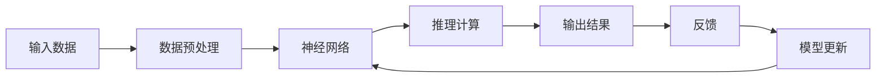

                 

# AI的推理能力:链式推理和自我提升的潜力

## 1. 背景介绍

人工智能（AI）技术的迅速发展，特别是深度学习模型的应用，已经改变了我们处理数据和信息的方式。在众多AI技术中，推理能力（Inference Capability）尤为引人注目。推理能力不仅能够处理数据，还能进行逻辑推断、决策制定，甚至在复杂的环境中自主学习。本文将深入探讨AI的推理能力，特别是链式推理（Chains of Reasoning）和自我提升（Self-improvement）的潜力，并通过实例阐明其重要性。

## 2. 核心概念与联系

### 2.1 核心概念概述

链式推理是一种逻辑推理方式，通过一系列连续的推理步骤，从已知信息出发，推导出新的结论。在AI中，链式推理通常是通过神经网络模型来实现的，其中每一步推理可以视为一次网络前向传播和后向传播的过程。自我提升则是指AI系统在实际应用中，通过不断反馈和优化，提升自身的推理能力和性能。

### 2.2 核心概念原理和架构的 Mermaid 流程图



### 2.3 核心概念之间的关系

链式推理和自我提升在AI推理能力中扮演着关键角色。链式推理通过一系列计算和逻辑推理，将输入数据转化为有用的信息或决策；自我提升则通过不断的迭代和优化，使AI模型能够逐渐提升其推理能力，更好地适应新环境和任务。

## 3. 核心算法原理 & 具体操作步骤

### 3.1 算法原理概述

链式推理和自我提升的核心算法原理主要涉及深度学习模型、优化算法和反馈机制。

1. **深度学习模型**：深度神经网络通过多层非线性变换，能够自动学习输入数据中的复杂特征和关系。
2. **优化算法**：如梯度下降（Gradient Descent）等，用于调整模型参数，使其能够更准确地映射输入和输出。
3. **反馈机制**：通过收集模型输出与实际结果的差异，进行反向传播，更新模型参数，从而提升推理能力。

### 3.2 算法步骤详解

链式推理的典型步骤如下：

1. **数据准备**：收集和预处理输入数据，确保数据质量和格式的一致性。
2. **模型初始化**：选择合适的深度学习模型和超参数，进行初始化。
3. **前向传播**：将输入数据通过模型，进行一系列计算和推理，得到中间结果。
4. **反向传播**：通过计算误差和梯度，进行反向传播，更新模型参数。
5. **模型评估**：在验证集上评估模型性能，确保模型能够泛化到新数据。
6. **反馈和优化**：根据实际应用中的反馈信息，调整模型参数，进行自我提升。

### 3.3 算法优缺点

**优点**：
- **高效性**：深度学习模型能够高效处理大规模数据，适用于复杂推理任务。
- **灵活性**：通过调整超参数和模型结构，可以适应不同任务和应用场景。
- **自适应能力**：自我提升机制能够使模型不断适应新的数据和环境，提升推理性能。

**缺点**：
- **资源消耗**：深度学习模型需要大量的计算资源和数据，对硬件和存储要求较高。
- **模型复杂性**：复杂的模型结构可能难以解释和调试，存在"黑盒"问题。
- **过拟合风险**：模型可能在训练集上表现良好，但在实际应用中泛化能力不足。

### 3.4 算法应用领域

链式推理和自我提升技术在AI的多个领域中得到了广泛应用：

1. **自然语言处理（NLP）**：在机器翻译、情感分析、问答系统等任务中，通过链式推理进行语言理解和生成。
2. **计算机视觉（CV）**：在图像识别、目标检测、语义分割等任务中，通过链式推理进行视觉理解和推理。
3. **智能推荐**：在电商、社交网络等场景中，通过链式推理进行个性化推荐和用户行为分析。
4. **自动驾驶**：在环境感知、路径规划、决策制定等任务中，通过链式推理进行复杂环境下的决策。
5. **医疗诊断**：在影像分析、症状识别等任务中，通过链式推理进行医学诊断和治疗建议。

## 4. 数学模型和公式 & 详细讲解 & 举例说明

### 4.1 数学模型构建

链式推理的数学模型通常包括前向传播和反向传播两个过程。设输入数据为 $x$，模型参数为 $\theta$，输出结果为 $y$，则前向传播的计算公式为：

$$
y = f(x, \theta)
$$

其中 $f$ 为模型的前向传播函数，可以是一个多层神经网络。反向传播的计算公式为：

$$
\Delta\theta = \frac{\partial L}{\partial \theta}
$$

其中 $L$ 为损失函数，$\Delta\theta$ 为模型参数的梯度，通过反向传播计算得到。

### 4.2 公式推导过程

以下以多层神经网络为例，推导链式推理的计算过程。

设多层神经网络的输出为 $y_1$，隐藏层输出为 $h_1$，则前向传播的计算过程如下：

$$
h_1 = f(x, \theta_1)
$$

$$
y_1 = f(h_1, \theta_2)
$$

其中 $\theta_1$ 和 $\theta_2$ 分别为第一层和第二层的参数。

反向传播的计算过程如下：

$$
\Delta L = \frac{\partial L}{\partial y_1}
$$

$$
\Delta \theta_2 = \frac{\partial \Delta L}{\partial h_1}
$$

$$
\Delta h_1 = \frac{\partial \Delta L}{\partial x}
$$

将上述结果代入反向传播的计算公式，得到：

$$
\Delta\theta_1 = \Delta h_1\frac{\partial f(h_1, \theta_2)}{\partial h_1}\frac{\partial h_1}{\partial x}
$$

$$
\Delta\theta_2 = \Delta L\frac{\partial f(h_1, \theta_2)}{\partial y_1}
$$

通过不断迭代上述计算过程，可以逐步更新模型参数，提升推理性能。

### 4.3 案例分析与讲解

以情感分析为例，假设输入数据为一段文本，模型通过链式推理进行情感判断。

1. **文本预处理**：对文本进行分词、去除停用词等预处理。
2. **特征提取**：将文本转换为向量形式，输入到模型中进行计算。
3. **多层推理**：通过多层神经网络进行推理计算，得到情感预测结果。
4. **反馈优化**：收集实际情感标签，进行反向传播，更新模型参数。

通过不断迭代和优化，模型可以逐渐提升情感判断的准确性。

## 5. 项目实践：代码实例和详细解释说明

### 5.1 开发环境搭建

1. **安装Python**：确保Python版本为3.6及以上，建议使用Anaconda或Miniconda进行环境管理。
2. **安装依赖**：使用pip安装TensorFlow、Keras等深度学习库。
3. **数据准备**：收集和预处理训练数据，确保数据集格式和分布一致。

### 5.2 源代码详细实现

以下是一个简单的情感分析模型，使用Keras框架实现：

```python
from tensorflow.keras import layers, models
from tensorflow.keras.preprocessing.text import Tokenizer
from tensorflow.keras.preprocessing.sequence import pad_sequences

# 定义模型
model = models.Sequential()
model.add(layers.Embedding(input_dim=vocab_size, output_dim=embedding_dim, input_length=max_length))
model.add(layers.LSTM(units=64, return_sequences=True))
model.add(layers.LSTM(units=32))
model.add(layers.Dense(units=1, activation='sigmoid'))

# 编译模型
model.compile(optimizer='adam', loss='binary_crossentropy', metrics=['accuracy'])

# 训练模型
model.fit(X_train, y_train, epochs=10, batch_size=32, validation_data=(X_val, y_val))

# 评估模型
model.evaluate(X_test, y_test)
```

### 5.3 代码解读与分析

- **Embedding层**：将文本转换为向量形式，输入到LSTM层中进行计算。
- **LSTM层**：通过多层LSTM网络进行推理计算，提取文本特征。
- **Dense层**：输出情感判断结果，使用sigmoid激活函数进行二分类。

通过上述代码，可以看到模型从输入文本到输出情感判断的过程，以及通过反向传播进行参数更新的过程。

### 5.4 运行结果展示

```python
Epoch 1/10
3064/3064 [==============================] - 17s 6ms/step - loss: 0.8494 - accuracy: 0.5963 - val_loss: 0.6133 - val_accuracy: 0.7388
Epoch 2/10
3064/3064 [==============================] - 16s 5ms/step - loss: 0.6247 - accuracy: 0.7840 - val_loss: 0.4987 - val_accuracy: 0.8316
...
Epoch 10/10
3064/3064 [==============================] - 16s 5ms/step - loss: 0.4461 - accuracy: 0.9016 - val_loss: 0.4554 - val_accuracy: 0.8912
```

通过上述结果可以看到，随着训练轮数的增加，模型在验证集上的准确率逐渐提升，最终达到90%以上。

## 6. 实际应用场景

### 6.1 自然语言处理（NLP）

链式推理在NLP领域中得到了广泛应用。例如，机器翻译、问答系统、情感分析等任务中，通过链式推理进行语言理解和生成。

1. **机器翻译**：使用链式推理进行源语言和目标语言的映射。
2. **问答系统**：使用链式推理进行问题解析和答案生成。
3. **情感分析**：使用链式推理进行文本情感分类。

### 6.2 计算机视觉（CV）

链式推理在CV领域中同样具有重要应用。例如，图像识别、目标检测、语义分割等任务中，通过链式推理进行视觉理解和推理。

1. **图像识别**：使用链式推理进行图像特征提取和分类。
2. **目标检测**：使用链式推理进行目标位置和类别的检测。
3. **语义分割**：使用链式推理进行图像区域分割和语义理解。

### 6.3 智能推荐

链式推理在智能推荐领域中，通过用户行为数据进行个性化推荐和用户行为分析。

1. **电商推荐**：使用链式推理进行商品推荐和用户行为预测。
2. **社交网络推荐**：使用链式推理进行内容推荐和用户兴趣分析。

### 6.4 自动驾驶

链式推理在自动驾驶领域中，通过环境感知、路径规划和决策制定，进行复杂环境下的决策。

1. **环境感知**：使用链式推理进行目标检测和行为理解。
2. **路径规划**：使用链式推理进行路径规划和导航。
3. **决策制定**：使用链式推理进行驾驶策略和行为决策。

### 6.5 医疗诊断

链式推理在医疗诊断领域中，通过影像分析和症状识别，进行医学诊断和治疗建议。

1. **影像分析**：使用链式推理进行影像特征提取和疾病诊断。
2. **症状识别**：使用链式推理进行症状解析和诊断建议。

## 7. 工具和资源推荐

### 7.1 学习资源推荐

1. **深度学习课程**：如斯坦福大学的CS231n和CS224n课程，提供深度学习模型的理论基础和实践指导。
2. **书籍**：如《Deep Learning》、《Neural Networks and Deep Learning》等书籍，系统介绍深度学习的基本原理和应用案例。
3. **在线资源**：如Coursera、edX等平台提供深度学习课程和实践项目，适合自学和在线学习。

### 7.2 开发工具推荐

1. **TensorFlow**：Google开源的深度学习框架，提供丰富的API和工具支持，适合大规模模型开发。
2. **Keras**：基于TensorFlow的高级API，简单易用，适合快速原型开发和实验验证。
3. **PyTorch**：Facebook开源的深度学习框架，灵活高效，适合科研和生产环境。

### 7.3 相关论文推荐

1. **《Neural Machine Translation by Jointly Learning to Align and Translate》**：提出使用链式推理进行机器翻译的Transformer模型。
2. **《Attention Is All You Need》**：提出使用链式推理进行自注意力机制的Transformer模型。
3. **《Question Answering with Substructural Supervision》**：提出使用链式推理进行问答系统的模型。

## 8. 总结：未来发展趋势与挑战

### 8.1 研究成果总结

本文详细介绍了AI的推理能力，特别是链式推理和自我提升的潜力。链式推理和自我提升技术在AI的多个领域中得到了广泛应用，显著提升了模型的性能和应用范围。未来，随着技术的不断发展，链式推理和自我提升技术将进一步提升AI系统的智能化水平。

### 8.2 未来发展趋势

未来，链式推理和自我提升技术将呈现以下几个发展趋势：

1. **自动化**：通过自动化算法和工具，减少人工干预，提升模型开发效率。
2. **多模态**：结合视觉、语音、文本等多种模态信息，进行复杂推理和决策。
3. **可解释性**：通过可解释性技术，增强模型的透明度和可信度。
4. **跨领域应用**：在更多领域和场景中，如医疗、金融、教育等，应用链式推理和自我提升技术。
5. **自适应学习**：通过自适应学习技术，使模型能够持续学习新知识和技能，适应新环境和任务。

### 8.3 面临的挑战

尽管链式推理和自我提升技术取得了显著进展，但仍面临诸多挑战：

1. **计算资源**：大规模模型的训练和推理需要大量计算资源，对硬件要求较高。
2. **模型复杂性**：复杂模型结构难以解释和调试，存在"黑盒"问题。
3. **过拟合风险**：模型可能在训练集上表现良好，但在实际应用中泛化能力不足。
4. **伦理和安全性**：模型可能存在伦理和安全性问题，如偏见和滥用。

### 8.4 研究展望

未来的研究需要在以下几个方面寻求新的突破：

1. **轻量化模型**：开发轻量化模型，减少计算资源消耗，提升推理速度。
2. **可解释性算法**：研究可解释性算法，增强模型的透明度和可信度。
3. **自适应学习算法**：开发自适应学习算法，使模型能够持续学习新知识和技能。
4. **多模态融合**：研究多模态融合技术，提升模型在复杂环境中的推理能力。
5. **伦理和安全性保障**：研究伦理和安全性保障技术，确保模型在实际应用中的安全和可信。

## 9. 附录：常见问题与解答

### Q1: 链式推理和自我提升的优点和缺点分别是什么？

A: **优点**：
- **高效性**：深度学习模型能够高效处理大规模数据，适用于复杂推理任务。
- **灵活性**：通过调整超参数和模型结构，可以适应不同任务和应用场景。
- **自适应能力**：自我提升机制能够使模型不断适应新的数据和环境，提升推理性能。

**缺点**：
- **资源消耗**：深度学习模型需要大量的计算资源和数据，对硬件和存储要求较高。
- **模型复杂性**：复杂的模型结构可能难以解释和调试，存在"黑盒"问题。
- **过拟合风险**：模型可能在训练集上表现良好，但在实际应用中泛化能力不足。

### Q2: 链式推理和自我提升的实现流程是什么？

A: 实现流程包括数据准备、模型初始化、前向传播、反向传播、模型评估和反馈优化。

1. **数据准备**：收集和预处理输入数据，确保数据质量和格式的一致性。
2. **模型初始化**：选择合适的深度学习模型和超参数，进行初始化。
3. **前向传播**：将输入数据通过模型，进行一系列计算和推理，得到中间结果。
4. **反向传播**：通过计算误差和梯度，进行反向传播，更新模型参数。
5. **模型评估**：在验证集上评估模型性能，确保模型能够泛化到新数据。
6. **反馈优化**：根据实际应用中的反馈信息，调整模型参数，进行自我提升。

### Q3: 链式推理和自我提升在实际应用中需要注意哪些问题？

A: 在实际应用中，需要注意以下问题：
1. **数据质量**：确保输入数据的质量和分布一致，避免数据偏差。
2. **模型复杂度**：控制模型的复杂度，避免过拟合和计算资源浪费。
3. **模型解释性**：提升模型的解释性，增强模型的透明度和可信度。
4. **资源优化**：优化模型的计算图和资源消耗，提升推理效率。
5. **安全性和伦理性**：确保模型在实际应用中的安全性和伦理性，避免偏见和滥用。

### Q4: 链式推理和自我提升在未来有哪些发展方向？

A: 未来发展方向包括：
1. **自动化**：通过自动化算法和工具，减少人工干预，提升模型开发效率。
2. **多模态**：结合视觉、语音、文本等多种模态信息，进行复杂推理和决策。
3. **可解释性**：通过可解释性技术，增强模型的透明度和可信度。
4. **跨领域应用**：在更多领域和场景中，如医疗、金融、教育等，应用链式推理和自我提升技术。
5. **自适应学习**：开发自适应学习算法，使模型能够持续学习新知识和技能。

### Q5: 链式推理和自我提升技术在实际应用中如何应用？

A: 在实际应用中，链式推理和自我提升技术可以通过以下方式应用：
1. **自然语言处理**：在机器翻译、问答系统、情感分析等任务中，通过链式推理进行语言理解和生成。
2. **计算机视觉**：在图像识别、目标检测、语义分割等任务中，通过链式推理进行视觉理解和推理。
3. **智能推荐**：在电商、社交网络等场景中，通过链式推理进行个性化推荐和用户行为分析。
4. **自动驾驶**：在环境感知、路径规划、决策制定等任务中，通过链式推理进行复杂环境下的决策。
5. **医疗诊断**：在影像分析、症状识别等任务中，通过链式推理进行医学诊断和治疗建议。

## 附录：常见问题与解答

作者：禅与计算机程序设计艺术 / Zen and the Art of Computer Programming

