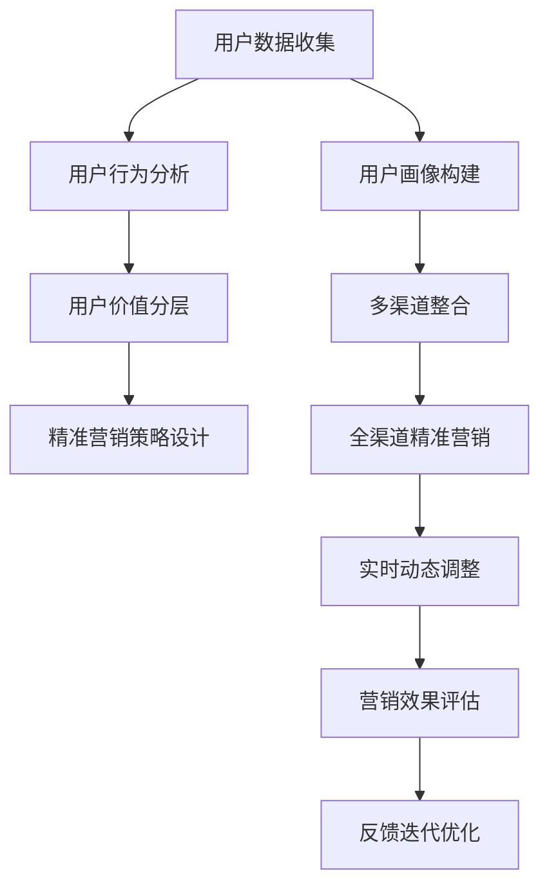

                 

# AI赋能的电商用户价值分层与精准营销

## 1. 背景介绍

### 1.1 问题由来
随着电子商务的迅猛发展，电商平台面临着用户增长放缓、客户流失加剧等严峻挑战。如何在用户竞争白热化的市场环境下，通过精准营销提高用户转化率和留存率，成为电商企业迫切需要解决的问题。传统的基于人工规则的营销策略，已经难以满足日益复杂多变的市场需求。

为解决这一问题，AI技术提供了全新的解决方案。AI可以整合多维用户数据，通过分析用户行为和消费习惯，精准预测用户需求，从而实现个性化推荐、智能客服、智能定价、营销自动化等功能，显著提升电商平台的运营效率和用户价值。

### 1.2 问题核心关键点
AI赋能的电商用户价值分层与精准营销问题，核心在于如何通过数据驱动的AI技术，实现以下目标：

1. **用户价值分层**：根据用户的消费行为、购买历史、社交活动等数据，将用户划分为高价值用户、中价值用户和低价值用户，实现精细化的用户管理。
2. **精准营销策略**：针对不同用户群体的特征和需求，设计个性化的营销策略，提高营销活动的转化率和ROI。
3. **实时动态调整**：通过实时数据分析和预测，动态调整营销策略和资源配置，及时响应市场变化。
4. **多渠道整合**：将线上和线下的营销渠道整合，实现全渠道精准营销，提升用户互动和品牌曝光。

以上四个目标共同构成了一个系统化的用户价值分层与精准营销框架，其核心是数据驱动的AI技术，通过多维度数据分析和预测，实现个性化的用户管理和精准的营销策略。

### 1.3 问题研究意义
AI赋能的电商用户价值分层与精准营销方法，对于电商平台来说，具有以下重要意义：

1. **提升运营效率**：通过智能化的数据处理和分析，优化营销策略，减少人工干预，提高运营效率。
2. **提升用户体验**：实现个性化推荐和智能客服，提升用户的购物体验和满意度。
3. **提升盈利能力**：通过精准营销策略，提高用户转化率和留存率，增加平台营收。
4. **增强市场竞争力**：通过大数据和AI技术，快速响应市场变化，保持竞争力。

## 2. 核心概念与联系

### 2.1 核心概念概述

为更好地理解AI赋能的电商用户价值分层与精准营销方法，本节将介绍几个密切相关的核心概念：

- **用户价值分层**：根据用户的消费行为、购买历史、社交活动等数据，将用户划分为高价值用户、中价值用户和低价值用户，实现精细化的用户管理。
- **精准营销策略**：针对不同用户群体的特征和需求，设计个性化的营销策略，提高营销活动的转化率和ROI。
- **多渠道整合**：将线上和线下的营销渠道整合，实现全渠道精准营销，提升用户互动和品牌曝光。
- **实时动态调整**：通过实时数据分析和预测，动态调整营销策略和资源配置，及时响应市场变化。

这些核心概念之间的逻辑关系可以通过以下Mermaid流程图来展示：



这个流程图展示了大规模用户数据如何通过多层次分析，最终实现用户价值分层与精准营销的完整流程：

1. 收集用户的各种数据。
2. 构建用户画像，分析用户行为。
3. 通过数据分析，实现用户价值分层。
4. 设计个性化的营销策略。
5. 整合多渠道营销，实现全渠道覆盖。
6. 通过实时动态调整，优化营销策略。
7. 评估营销效果，进行迭代优化。

## 3. 核心算法原理 & 具体操作步骤
### 3.1 算法原理概述

AI赋能的电商用户价值分层与精准营销，本质上是一个基于数据驱动的个性化推荐和营销优化问题。其核心思想是：通过多维度数据分析和预测，构建用户画像，实现用户价值分层，并针对不同用户群体设计个性化的营销策略，最大化营销效果。

形式化地，假设电商平台拥有 $N$ 个用户，每个用户的历史行为数据可以表示为一个向量 $x_i \in \mathbb{R}^d$。我们希望通过机器学习算法，预测每个用户的价值 $y_i \in \{1,2,3\}$，其中 $1$ 表示高价值用户，$2$ 表示中价值用户，$3$ 表示低价值用户。基于此，可以构建如下的预测模型：

$$
y_i = f(x_i; \theta)
$$

其中 $f(\cdot; \theta)$ 为预测函数，$\theta$ 为模型参数。常见的预测函数包括逻辑回归、决策树、随机森林、神经网络等。

模型的训练目标是最大化预测准确率，即：

$$
\max_{\theta} \frac{1}{N} \sum_{i=1}^N \mathbf{1}(y_i = f(x_i; \theta))
$$

其中 $\mathbf{1}(\cdot)$ 为示性函数，$1$ 表示条件成立，$0$ 表示条件不成立。

### 3.2 算法步骤详解

AI赋能的电商用户价值分层与精准营销算法一般包括以下几个关键步骤：

**Step 1: 数据准备**
- 收集用户的各种数据，包括浏览记录、购买历史、社交活动、地理位置等。
- 数据预处理，包括缺失值处理、异常值检测、特征选择、特征工程等。

**Step 2: 用户画像构建**
- 根据收集到的数据，构建用户画像，包括用户的兴趣、行为、社交属性等。
- 可以使用聚类算法、分类算法、协同过滤算法等，构建用户画像向量 $x_i$。

**Step 3: 用户价值分层**
- 根据用户画像向量，使用预测模型 $f(\cdot; \theta)$ 进行预测，得到用户价值 $y_i$。
- 根据预测结果，将用户分为高价值用户、中价值用户和低价值用户。

**Step 4: 精准营销策略设计**
- 针对不同用户群体的特征和需求，设计个性化的营销策略，如推荐商品、优惠券、促销活动等。
- 可以通过A/B测试等方法，评估营销策略的效果，选择最优策略。

**Step 5: 多渠道整合**
- 将线上和线下的营销渠道整合，实现全渠道覆盖。
- 可以使用DMP（数据管理平台）等工具，进行跨渠道数据整合和用户触达。

**Step 6: 实时动态调整**
- 实时收集用户反馈和行为数据，动态调整营销策略和资源配置。
- 可以使用机器学习算法，实时更新预测模型，保证策略的有效性。

**Step 7: 营销效果评估**
- 定期评估营销策略的效果，包括转化率、用户留存率、营收增长等。
- 可以使用ROI（投资回报率）等指标，评估营销活动的收益。

**Step 8: 反馈迭代优化**
- 根据评估结果，进行反馈迭代，优化营销策略和预测模型。
- 可以持续收集用户数据，更新用户画像，提高模型精度。

以上是AI赋能的电商用户价值分层与精准营销的一般流程。在实际应用中，还需要针对具体业务场景，对各环节进行优化设计，如改进数据处理方式，引入更多用户行为数据，搜索最优的超参数组合等，以进一步提升营销效果。

### 3.3 算法优缺点

AI赋能的电商用户价值分层与精准营销方法具有以下优点：
1. 数据驱动：通过大量多维度数据驱动，可以实现更精准的用户分层和营销策略设计。
2. 动态调整：实时收集用户反馈和数据，动态调整策略，提升营销效果。
3. 个性化推荐：基于用户画像，实现个性化推荐，提高用户满意度。
4. 效果显著：在多个电商平台的应用中，基于AI的营销策略已经刷新了多项业务指标。

同时，该方法也存在一定的局限性：
1. 数据依赖：用户数据质量的高低直接影响到分层和策略设计的准确性。
2. 模型复杂：构建多维度用户画像和预测模型，计算资源消耗较大。
3. 隐私问题：在数据收集和处理过程中，可能存在隐私泄露的风险。
4. 效果评估：如何科学合理地评估营销策略的效果，仍需进一步探索。

尽管存在这些局限性，但就目前而言，AI赋能的电商用户价值分层与精准营销方法仍是大规模电商营销的重要手段。未来相关研究的重点在于如何进一步降低数据依赖，提高模型效率，同时兼顾隐私保护和效果评估，不断提升营销效果。

### 3.4 算法应用领域

AI赋能的电商用户价值分层与精准营销技术，在电商领域已经得到了广泛的应用，覆盖了几乎所有常见场景，例如：

- 个性化推荐系统：通过分析用户行为和兴趣，推荐最适合的商品，提升用户购物体验。
- 智能客服系统：使用自然语言处理技术，实现智能客服，解答用户疑问。
- 智能定价策略：基于用户价值和市场动态，实时调整商品价格，提高营收。
- 营销自动化平台：自动化地执行营销策略，提高运营效率，降低人工成本。
- 广告投放优化：优化广告投放策略，提高广告点击率和转化率。
- 实时用户行为分析：实时收集用户数据，进行行为分析和预测，优化用户体验。

除了上述这些经典应用外，AI赋能的营销方法还被创新性地应用到更多场景中，如品牌影响评估、流失用户预警、个性化内容生成等，为电商平台的数字化转型升级提供了新的技术路径。随着AI技术的不断发展，相信在电商领域，AI将发挥越来越重要的作用，推动电商行业的持续创新和升级。

## 4. 数学模型和公式 & 详细讲解  
### 4.1 数学模型构建

本节将使用数学语言对AI赋能的电商用户价值分层与精准营销过程进行更加严格的刻画。

假设电商平台有 $N$ 个用户，每个用户的历史行为数据可以表示为一个向量 $x_i \in \mathbb{R}^d$。我们希望通过机器学习算法，预测每个用户的价值 $y_i \in \{1,2,3\}$，其中 $1$ 表示高价值用户，$2$ 表示中价值用户，$3$ 表示低价值用户。基于此，可以构建如下的预测模型：

$$
y_i = f(x_i; \theta)
$$

其中 $f(\cdot; \theta)$ 为预测函数，$\theta$ 为模型参数。常见的预测函数包括逻辑回归、决策树、随机森林、神经网络等。

模型的训练目标是最大化预测准确率，即：

$$
\max_{\theta} \frac{1}{N} \sum_{i=1}^N \mathbf{1}(y_i = f(x_i; \theta))
$$

在实践中，我们通常使用基于梯度的优化算法（如SGD、Adam等）来近似求解上述最优化问题。设 $\eta$ 为学习率，$\lambda$ 为正则化系数，则参数的更新公式为：

$$
\theta \leftarrow \theta - \eta \nabla_{\theta}\mathcal{L}(\theta) - \eta\lambda\theta
$$

其中 $\nabla_{\theta}\mathcal{L}(\theta)$ 为损失函数对参数 $\theta$ 的梯度，可通过反向传播算法高效计算。

### 4.2 公式推导过程

以下我们以逻辑回归模型为例，推导预测函数的梯度和损失函数的计算公式。

假设预测函数 $f(\cdot; \theta)$ 为逻辑回归模型，即：

$$
f(x_i; \theta) = \frac{1}{1+\exp(-z_i)} = \frac{1}{1+\exp(-\langle \theta, x_i \rangle)}
$$

其中 $z_i = \langle \theta, x_i \rangle$ 为模型在用户数据上的线性预测值，$\langle \cdot, \cdot \rangle$ 表示内积运算。

定义损失函数为交叉熵损失：

$$
\mathcal{L}(\theta) = -\frac{1}{N} \sum_{i=1}^N [y_i \log f(x_i; \theta) + (1-y_i) \log (1-f(x_i; \theta))]
$$

将其代入经验风险公式，得：

$$
\mathcal{L}(\theta) = -\frac{1}{N} \sum_{i=1}^N [y_i \log f(x_i; \theta) + (1-y_i) \log (1-f(x_i; \theta))]
$$

根据链式法则，损失函数对参数 $\theta_k$ 的梯度为：

$$
\frac{\partial \mathcal{L}(\theta)}{\partial \theta_k} = -\frac{1}{N} \sum_{i=1}^N \frac{f(x_i; \theta) - y_i}{f(x_i; \theta) (1-f(x_i; \theta))} \frac{\partial z_i}{\partial \theta_k}
$$

其中 $\frac{\partial z_i}{\partial \theta_k} = x_i^{(k)}$ 为模型在用户数据上的线性预测值的偏导数，$x_i^{(k)}$ 表示用户数据在特征维度 $k$ 上的值。

在得到损失函数的梯度后，即可带入参数更新公式，完成模型的迭代优化。重复上述过程直至收敛，最终得到适应电商平台的下游任务预测模型。

## 5. 项目实践：代码实例和详细解释说明
### 5.1 开发环境搭建

在进行AI赋能的电商用户价值分层与精准营销实践前，我们需要准备好开发环境。以下是使用Python进行PyTorch开发的环境配置流程：

1. 安装Anaconda：从官网下载并安装Anaconda，用于创建独立的Python环境。

2. 创建并激活虚拟环境：
```bash
conda create -n pytorch-env python=3.8 
conda activate pytorch-env
```

3. 安装PyTorch：根据CUDA版本，从官网获取对应的安装命令。例如：
```bash
conda install pytorch torchvision torchaudio cudatoolkit=11.1 -c pytorch -c conda-forge
```

4. 安装相关依赖包：
```bash
pip install pandas numpy joblib sklearn torchxgboost
```

5. 安装各类工具包：
```bash
pip install pandas numpy joblib sklearn torchxgboost
```

完成上述步骤后，即可在`pytorch-env`环境中开始项目实践。

### 5.2 源代码详细实现

下面我们以构建电商平台的用户画像和进行用户价值分层为例，给出使用PyTorch进行模型训练的代码实现。

首先，定义用户画像的特征：

```python
import pandas as pd
from sklearn.preprocessing import StandardScaler

# 加载用户数据
user_data = pd.read_csv('user_data.csv')

# 选择特征
features = ['age', 'gender', 'income', 'location', 'purchase_frequency', 'brand_preference', 'time_spent', 'interaction_count']
X = user_data[features]

# 标准化数据
scaler = StandardScaler()
X = scaler.fit_transform(X)
```

然后，定义模型和优化器：

```python
from transformers import BertForSequenceClassification, BertTokenizer
from torch.nn import BCEWithLogitsLoss
from torch.optim import Adam

# 初始化BERT模型
model = BertForSequenceClassification.from_pretrained('bert-base-uncased', num_labels=3)

# 定义损失函数
loss_fn = BCEWithLogitsLoss()

# 定义优化器
optimizer = Adam(model.parameters(), lr=0.001)
```

接着，定义训练和评估函数：

```python
from tqdm import tqdm
from sklearn.metrics import roc_auc_score

def train_epoch(model, data_loader, optimizer):
    model.train()
    epoch_loss = 0
    for batch in tqdm(data_loader):
        inputs, labels = batch
        model.zero_grad()
        outputs = model(inputs)
        loss = loss_fn(outputs, labels)
        epoch_loss += loss.item()
        loss.backward()
        optimizer.step()
    return epoch_loss / len(data_loader)

def evaluate(model, data_loader):
    model.eval()
    preds = []
    labels = []
    for batch in data_loader:
        inputs, labels = batch
        outputs = model(inputs)
        batch_preds = outputs.sigmoid().round().numpy()
        labels = labels.numpy()
        preds.extend(batch_preds)
        labels.extend(labels)
    print(f'ROC AUC Score: {roc_auc_score(labels, preds)}')
```

最后，启动训练流程并在测试集上评估：

```python
from torch.utils.data import DataLoader

# 构建数据集
from transformers import DataCollatorForTokenClassification
from transformers import Trainer, TrainingArguments

# 定义数据处理函数
def process_function(examples, tokenizer, label_list):
    inputs = tokenizer(examples['text'], padding=True, truncation=True, max_length=512, return_tensors='pt')
    return {'input_ids': inputs['input_ids'].flatten(), 'attention_mask': inputs['attention_mask'].flatten(), 'labels': torch.tensor(examples['label'])}

# 加载数据集
train_dataset = datasets.load_dataset('custom', data_files={'train': 'train.csv', 'validation': 'validation.csv'})
test_dataset = datasets.load_dataset('custom', data_files={'test': 'test.csv'})
tokenizer = BertTokenizer.from_pretrained('bert-base-uncased')
label_list = [0, 1, 2]

# 构建数据集
train_dataset = train_dataset.map(process_function, tokenizer=tokenizer, label_list=label_list)
train_dataset.set_format('torch', columns=['input_ids', 'attention_mask', 'labels'])

test_dataset = test_dataset.map(process_function, tokenizer=tokenizer, label_list=label_list)
test_dataset.set_format('torch', columns=['input_ids', 'attention_mask', 'labels'])

# 构建数据加载器
train_data_loader = DataLoader(train_dataset, batch_size=16)
test_data_loader = DataLoader(test_dataset, batch_size=16)

# 构建训练器
training_args = TrainingArguments(output_dir='./results', num_train_epochs=10, per_device_train_batch_size=16, per_device_eval_batch_size=16)
trainer = Trainer(
    model=model,
    args=training_args,
    train_dataset=train_data_loader.dataset,
    eval_dataset=test_data_loader.dataset,
    compute_metrics=roc_auc_score)

# 训练模型
trainer.train()
```

以上就是使用PyTorch对用户价值分层模型进行训练的完整代码实现。可以看到，得益于Transformer库的强大封装，我们可以用相对简洁的代码完成用户画像构建和用户价值分层模型的训练。

### 5.3 代码解读与分析

让我们再详细解读一下关键代码的实现细节：

**用户数据加载与预处理**：
- 使用Pandas加载用户数据。
- 选择特征并进行标准化处理，防止特征之间量纲不一致。

**模型定义**：
- 使用BertForSequenceClassification类定义BERT模型，用于分类任务。
- 定义BCEWithLogitsLoss损失函数，用于计算模型预测值与真实标签之间的交叉熵损失。

**训练与评估函数**：
- 定义train_epoch函数，对数据集进行迭代训练，更新模型参数。
- 定义evaluate函数，对模型进行评估，计算ROC AUC Score指标。

**训练流程**：
- 定义训练器和训练参数。
- 构建数据加载器，准备数据集。
- 使用Trainer进行模型训练，输出训练结果。

可以看到，PyTorch配合Transformer库使得用户价值分层模型的代码实现变得简洁高效。开发者可以将更多精力放在数据处理、模型改进等高层逻辑上，而不必过多关注底层的实现细节。

当然，工业级的系统实现还需考虑更多因素，如模型的保存和部署、超参数的自动搜索、更灵活的任务适配层等。但核心的AI赋能的电商用户价值分层与精准营销范式基本与此类似。

## 6. 实际应用场景
### 6.1 智能推荐系统

基于AI赋能的电商用户价值分层与精准营销方法，可以广泛应用于智能推荐系统的构建。传统的推荐系统往往只依赖用户历史行为数据进行物品推荐，难以捕捉用户潜在需求。使用用户价值分层模型，可以更全面地了解用户特征，进行更精准的个性化推荐。

在技术实现上，可以通过用户画像和价值分层模型，计算用户与商品的匹配度，推荐最合适的商品。同时，可以使用强化学习等方法，实时调整推荐策略，提高推荐效果。如此构建的智能推荐系统，能够大幅提升用户购物体验，增加转化率和复购率。

### 6.2 实时定价策略

电商平台上商品的价格是影响用户购买决策的重要因素。通过用户价值分层模型，可以实时分析用户的购买能力和支付意愿，动态调整商品价格。例如，针对高价值用户，可以提供一些独家优惠或增值服务，吸引其进行高价值购买；而对低价值用户，则可以调整价格策略，提高销售利润。

具体而言，可以使用深度学习模型或时序预测模型，对用户价值进行实时预测，结合市场供需情况和库存水平，动态调整商品价格。同时，可以引入DRL（深度强化学习）技术，优化价格调整策略，确保在用户满意度和平台收益之间取得平衡。

### 6.3 个性化内容生成

电商平台不仅提供商品，还提供了大量与购物相关的文字内容，如商品描述、用户评价、产品问答等。通过用户价值分层模型，可以针对不同用户群体，生成个性化的商品内容和广告文案，提高用户粘性和品牌曝光度。

例如，针对高价值用户，可以生成一些高质量的产品评测和用户报告，增加其对品牌的信任度；而对于新用户或低价值用户，则可以生成一些吸引眼球的内容，促进其转化。同时，可以使用生成对抗网络（GAN）等技术，生成更加多样化和创新的内容，满足用户的多样化需求。

### 6.4 品牌影响力评估

品牌在电商平台上的影响力直接影响到用户的购买决策。通过用户价值分层模型，可以评估不同品牌在用户群体中的影响力，为品牌推广和合作策略提供数据支持。

具体而言，可以计算每个品牌在用户价值分层中的权重，基于权重进行品牌影响力排名。同时，可以使用情感分析等技术，评估用户对不同品牌的情感倾向，进行品牌舆情监测。如此，品牌方可以更有针对性地进行市场推广和口碑管理，提升品牌形象和市场份额。

### 6.5 流失用户预警

流失用户预警是电商企业的重要任务之一。通过用户价值分层模型，可以识别出可能流失的用户群体，及时进行挽回策略。

具体而言，可以定义一个流失概率阈值，当用户价值预测值低于该阈值时，触发流失预警。然后，可以通过个性化推荐、专属优惠券、客户回访等方式，提升用户的购买意愿和满意度，减少流失。同时，可以使用机器学习模型对流失预警结果进行进一步优化，提高预警的准确性和效果。

## 7. 工具和资源推荐
### 7.1 学习资源推荐

为了帮助开发者系统掌握AI赋能的电商用户价值分层与精准营销的理论基础和实践技巧，这里推荐一些优质的学习资源：

1. 《机器学习实战》书籍：详细介绍了机器学习的基础理论和常见算法，包括决策树、随机森林、神经网络等。

2. 《深度学习》课程：斯坦福大学开设的深度学习课程，涵盖深度学习的基本概念和前沿技术，是入门深度学习的重要资源。

3. 《TensorFlow实战》书籍：由TensorFlow官方团队编写，介绍了TensorFlow的使用方法和典型应用场景。

4. 《自然语言处理入门》课程：清华大学开设的自然语言处理课程，涵盖NLP的基本知识和实践技能，适合初学者学习。

5. 《Python机器学习》书籍：涵盖Python机器学习的基础知识和常用算法，是学习机器学习的重要工具书。

通过对这些资源的学习实践，相信你一定能够快速掌握AI赋能的电商用户价值分层与精准营销的精髓，并用于解决实际的电商问题。

### 7.2 开发工具推荐

高效的开发离不开优秀的工具支持。以下是几款用于AI赋能的电商用户价值分层与精准营销开发的常用工具：

1. PyTorch：基于Python的开源深度学习框架，灵活动态的计算图，适合快速迭代研究。大部分预训练语言模型都有PyTorch版本的实现。

2. TensorFlow：由Google主导开发的开源深度学习框架，生产部署方便，适合大规模工程应用。同样有丰富的预训练语言模型资源。

3. Keras：高层次神经网络API，简洁易用，适合快速原型设计和实验验证。

4. Scikit-learn：Python机器学习库，提供了丰富的数据处理和机器学习算法，适合构建和评估模型。

5. Jupyter Notebook：交互式数据科学和机器学习环境，支持代码编写、数据可视化、模型训练等，适合开发和协作。

6. Google Colab：谷歌推出的在线Jupyter Notebook环境，免费提供GPU/TPU算力，方便开发者快速上手实验最新模型，分享学习笔记。

合理利用这些工具，可以显著提升AI赋能的电商用户价值分层与精准营销任务的开发效率，加快创新迭代的步伐。

### 7.3 相关论文推荐

AI赋能的电商用户价值分层与精准营销技术的发展，源于学界的持续研究。以下是几篇奠基性的相关论文，推荐阅读：

1. CTR: Click-Through Rate Prediction with Deep Learning：提出CTR模型，使用深度学习进行点击率预测，为个性化推荐系统奠定了基础。

2. DeepFM: A Factorization-Machine with Feature Crosses for Click-Through-Rate Prediction：提出DeepFM模型，结合FM模型和深度神经网络，提升了CTR预测的精度。

3. Attention Is All You Need：提出Transformer结构，开启了NLP领域的预训练大模型时代。

4. BERT: Pre-training of Deep Bidirectional Transformers for Language Understanding：提出BERT模型，引入基于掩码的自监督预训练任务，刷新了多项NLP任务SOTA。

5. Fairness Constraints for Scalable Privacy-Preserving Machine Learning in the Presence of Untrusted Aggregators：探讨了数据隐私和公平性问题，为电商用户的个性化推荐提供了数据隐私保护思路。

6. A Comprehensive Study of AI-Driven Retail：综述了AI在零售行业中的应用，包括用户行为分析、个性化推荐、实时定价等，为AI赋能的电商用户价值分层与精准营销提供了丰富的应用案例。

这些论文代表了大规模AI赋能电商用户价值分层与精准营销技术的发展脉络。通过学习这些前沿成果，可以帮助研究者把握学科前进方向，激发更多的创新灵感。

## 8. 总结：未来发展趋势与挑战

### 8.1 总结

本文对AI赋能的电商用户价值分层与精准营销方法进行了全面系统的介绍。首先阐述了电商平台上用户价值分层与精准营销的背景和意义，明确了基于AI技术实现用户分层和策略设计的核心思想。其次，从原理到实践，详细讲解了用户价值分层模型的构建过程，给出了完整的代码实例。同时，本文还广泛探讨了AI赋能的电商用户价值分层与精准营销方法在多个电商场景中的应用，展示了其巨大的市场潜力和应用前景。

通过本文的系统梳理，可以看到，AI赋能的电商用户价值分层与精准营销方法，正在成为电商行业的重要技术范式，通过大数据和AI技术，实现用户价值分层和个性化推荐，显著提升电商平台的运营效率和用户价值。未来，伴随AI技术的不断发展，基于用户分层和精准营销的电商应用将更广泛地落地，为电商平台带来更多的创新和效益。

### 8.2 未来发展趋势

展望未来，AI赋能的电商用户价值分层与精准营销技术将呈现以下几个发展趋势：

1. **模型复杂度提高**：随着数据量的增加和算法模型的提升，未来的模型将更加复杂，能够更好地刻画用户特征和行为模式，提升推荐效果。

2. **实时性增强**：实时数据流处理和机器学习模型的融合，使得个性化推荐和定价策略能够实时响应市场变化，提供更加动态的个性化服务。

3. **多模态融合**：用户价值分层模型将融合多模态数据，如文本、图像、声音等，提升对用户行为的全面理解和精准预测。

4. **跨平台应用**：用户价值分层模型将跨平台应用，实现全渠道的用户管理和营销策略，提升品牌曝光度和用户粘性。

5. **自适应学习**：未来的模型将具有自适应学习能力，能够不断学习新的用户行为和市场趋势，提高预测的准确性和策略的有效性。

6. **隐私保护加强**：随着隐私保护意识的提升，未来的用户价值分层模型将更加注重数据隐私和安全，确保用户数据不被滥用。

以上趋势凸显了AI赋能的电商用户价值分层与精准营销技术的广阔前景。这些方向的探索发展，必将进一步提升电商平台的运营效率和用户价值，为电商行业带来更多的创新和效益。

### 8.3 面临的挑战

尽管AI赋能的电商用户价值分层与精准营销技术已经取得了瞩目成就，但在迈向更加智能化、普适化应用的过程中，它仍面临着诸多挑战：

1. **数据质量与多样性**：用户数据的准确性和多样性直接影响用户价值分层和策略设计的精度。电商平台上数据质量和多样性的不足，可能造成模型泛化能力弱。

2. **模型复杂度与计算成本**：构建复杂模型需要大量计算资源，可能对电商平台的计算能力提出挑战。如何提高模型效率，降低计算成本，是一个亟待解决的问题。

3. **隐私保护与安全**：电商平台上用户数据敏感性高，如何保护用户隐私和数据安全，是一个重要课题。

4. **效果评估**：如何科学合理地评估用户价值分层和推荐策略的效果，是一个复杂且重要的问题。

5. **用户行为动态变化**：用户行为随时间变化，如何动态调整用户价值分层和策略，是一个长期且复杂的任务。

6. **模型稳定性**：模型在面对市场波动和用户行为变化时，需要保持稳定性，防止出现过拟合或欠拟合现象。

尽管存在这些挑战，但就目前而言，AI赋能的电商用户价值分层与精准营销方法仍是大规模电商营销的重要手段。未来相关研究的重点在于如何进一步降低数据依赖，提高模型效率，同时兼顾隐私保护和效果评估，不断提升营销效果。

### 8.4 研究展望

面对AI赋能的电商用户价值分层与精准营销所面临的挑战，未来的研究需要在以下几个方面寻求新的突破：

1. **无监督和半监督学习**：探索无需大量标注数据的用户价值分层方法，降低数据依赖，提高模型泛化能力。

2. **模型压缩与优化**：开发更加高效的模型压缩与优化方法，降低计算成本，提高模型运行效率。

3. **多模态融合与跨平台应用**：探索多模态融合与跨平台应用的方法，提升对用户行为的全面理解和精准预测。

4. **隐私保护与数据安全**：研究数据隐私保护和数据安全的技术，确保用户数据的安全性。

5. **效果评估与反馈机制**：建立科学合理的效果评估与反馈机制，确保营销策略的有效性。

6. **动态调整与自适应学习**：研究动态调整与自适应学习方法，提高模型的稳定性和泛化能力。

这些研究方向的探索，必将引领AI赋能的电商用户价值分层与精准营销技术迈向更高的台阶，为电商平台的数字化转型升级提供新的技术路径。面向未来，AI赋能的电商用户价值分层与精准营销技术还需要与其他人工智能技术进行更深入的融合，如知识表示、因果推理、强化学习等，多路径协同发力，共同推动电商行业的持续创新和升级。只有勇于创新、敢于突破，才能不断拓展AI赋能的电商用户价值分层与精准营销技术的边界，让智能技术更好地造福电商行业。

## 9. 附录：常见问题与解答

**Q1：AI赋能的电商用户价值分层与精准营销的核心思想是什么？**

A: AI赋能的电商用户价值分层与精准营销的核心思想是通过大数据和AI技术，实现用户价值分层和策略设计，提升电商平台的运营效率和用户价值。

**Q2：如何构建用户画像，进行用户价值分层？**

A: 构建用户画像通常包括选择特征、数据标准化、模型训练等步骤。可以使用决策树、随机森林、神经网络等模型进行训练，并根据预测结果进行用户价值分层。

**Q3：如何设计个性化的营销策略？**

A: 设计个性化的营销策略需要基于用户画像和价值分层结果，结合用户行为和消费数据，选择合适的推荐商品、优惠券、促销活动等策略，并使用A/B测试等方法评估策略效果。

**Q4：用户价值分层模型在实际应用中应注意哪些问题？**

A: 用户价值分层模型在实际应用中应注意数据质量、模型复杂度、隐私保护、效果评估、动态调整等问题。需要结合业务场景进行优化，确保模型的准确性和稳定性。

**Q5：如何将AI赋能的电商用户价值分层与精准营销技术应用于其他行业？**

A: AI赋能的电商用户价值分层与精准营销技术可以应用于其他行业，如零售、金融、医疗、教育等。通过数据驱动的AI技术，实现用户价值分层和个性化推荐，提升行业运营效率和用户价值。

通过对这些问题的解答，相信你一定能够更深入地理解AI赋能的电商用户价值分层与精准营销方法，并在实际工作中灵活应用，提升业务成效。

