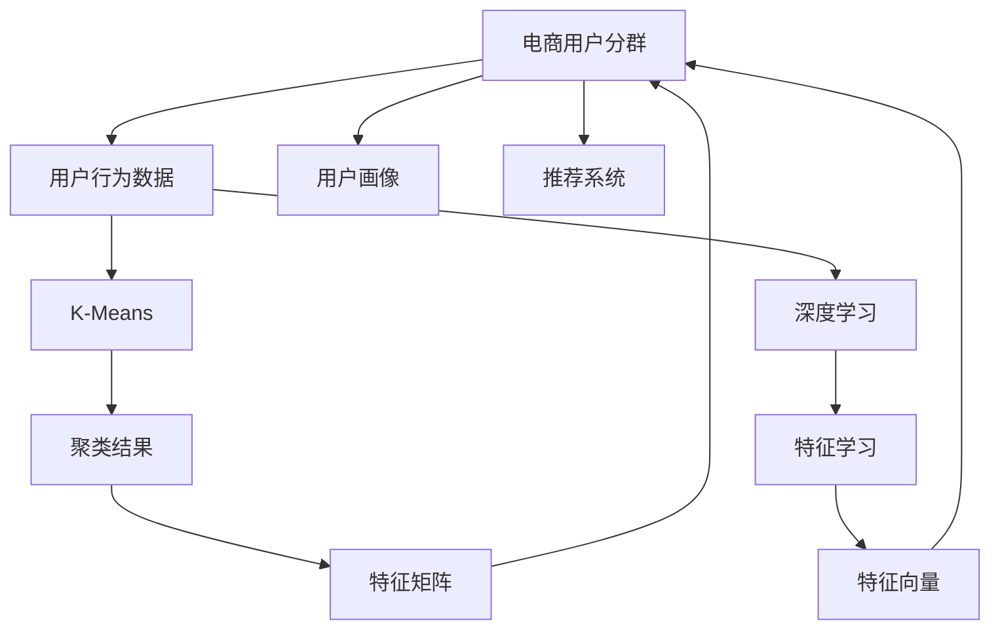

                 

# AI赋能的电商用户分群自动化

> 关键词：AI、用户分群、自动化、电商、大数据、聚类算法、推荐系统

## 1. 背景介绍

### 1.1 问题由来

在电商行业中，用户分群是进行个性化推荐、精准营销、商品定价和库存管理等决策的基础。传统上，用户分群主要是基于简单的统计特征，如年龄、性别、地域等，无法充分考虑用户的复杂行为和兴趣变化。随着互联网数据的不断积累，电商企业开始大规模采集用户的行为数据，如浏览记录、点击行为、购买历史等，尝试通过深度学习等技术手段挖掘用户的深层特征，进行更精准的用户分群。

然而，基于深度学习的大数据挖掘需要耗费大量资源和精力，且对模型复杂度、数据质量、特征工程等环节依赖度较高。电商企业希望能有一种更加自动化、智能化的用户分群方案，以大幅提升运营效率和用户体验。

### 1.2 问题核心关键点

本文聚焦于AI赋能的电商用户分群自动化问题，即通过自动化技术实现对电商用户的高精度分群，以便更好地进行个性化推荐、广告投放、用户行为分析等。具体来说，包括以下核心问题：

1. 如何从电商用户的大量行为数据中提取有意义的特征，以支持用户分群？
2. 如何设计高效的算法，自动化地对用户进行分群，并实现准确度和效率的平衡？
3. 如何将用户分群的结果应用于电商营销和运营决策，提升用户转化率和满意度？
4. 如何保证用户分群结果的隐私安全，避免数据滥用和信息泄露？

## 2. 核心概念与联系

### 2.1 核心概念概述

为更好地理解AI赋能的电商用户分群自动化方法，本节将介绍几个密切相关的核心概念：

- **电商用户分群**：基于用户行为数据，通过机器学习算法将用户分为若干具有相似行为和特征的群体，以支持精准营销和个性化推荐。
- **用户行为数据**：电商用户在使用网站或App时的各种行为数据，如浏览记录、点击行为、购买历史、评价反馈等。
- **用户画像**：对用户进行全面的特征描述，包括基本信息、兴趣偏好、行为特征等，以便进行用户分群和推荐。
- **推荐系统**：根据用户画像和行为数据，对用户进行个性化推荐，以提升用户满意度和转化率。
- **聚类算法**：通过计算相似度，将用户分组的技术手段，如K-Means、DBSCAN等。
- **深度学习**：利用神经网络模型，通过大量标注数据进行特征学习，自动提取用户行为特征。

这些核心概念之间的逻辑关系可以通过以下Mermaid流程图来展示：



这个流程图展示了大数据驱动的电商用户分群的各个环节和关键技术：

1. 电商用户分群基于用户行为数据。
2. 用户行为数据通过聚类算法和深度学习进行特征提取。
3. 特征矩阵和特征向量用于用户画像的构建和推荐系统的训练。
4. 聚类算法和深度学习是核心技术手段，分别用于数据预处理和特征学习。
5. 用户画像和推荐系统是最终应用，用于支持电商的运营决策。

## 3. 核心算法原理 & 具体操作步骤
### 3.1 算法原理概述

AI赋能的电商用户分群自动化，本质上是利用深度学习、聚类算法等技术手段，自动化地对电商用户进行分群。其核心思想是：

1. **特征提取**：从电商用户的大量行为数据中，提取有意义的特征，用于描述用户的行为和偏好。
2. **模型训练**：利用聚类算法和深度学习模型，对用户进行自动化的分组，以发现相似的用户群体。
3. **结果应用**：将用户分群的结果应用于电商营销和运营决策，如个性化推荐、广告投放、用户行为分析等。

### 3.2 算法步骤详解

基于AI的电商用户分群自动化一般包括以下几个关键步骤：

**Step 1: 数据预处理**

1. **数据采集**：收集电商用户的浏览记录、点击行为、购买历史、评价反馈等数据。
2. **数据清洗**：去除噪声数据，处理缺失值，标准化数据格式。
3. **数据归一化**：将不同来源的数据进行归一化处理，使数据具有可比性。

**Step 2: 特征工程**

1. **特征选择**：选择对用户分群最有用的特征，如浏览记录、点击行为、购买历史等。
2. **特征工程**：对选定的特征进行编码、归一化、提取等处理，生成特征向量。
3. **特征融合**：将不同来源的特征进行融合，生成更全面的用户画像。

**Step 3: 聚类模型训练**

1. **模型选择**：选择适合的聚类算法，如K-Means、DBSCAN等。
2. **参数调优**：调整聚类算法的参数，如簇数、距离度量等，以获得最佳的聚类效果。
3. **模型训练**：使用特征向量训练聚类模型，得到用户分群的初始结果。

**Step 4: 深度学习模型训练**

1. **模型选择**：选择适合的深度学习模型，如神经网络、卷积神经网络等。
2. **数据划分**：将数据划分为训练集、验证集和测试集。
3. **模型训练**：使用训练集训练深度学习模型，使用验证集调整模型参数。
4. **模型评估**：使用测试集评估模型的性能，生成用户分群的结果。

**Step 5: 结果优化**

1. **结果验证**：将聚类结果和深度学习结果进行对比，验证其一致性。
2. **结果融合**：将聚类结果和深度学习结果进行融合，生成更准确的最终用户分群结果。
3. **结果应用**：将用户分群结果应用于电商营销和运营决策。

**Step 6: 结果评估**

1. **效果评估**：使用准确率、召回率、F1值等指标，评估用户分群结果的准确性和一致性。
2. **用户反馈**：收集用户反馈，调整和优化用户分群算法。
3. **迭代优化**：根据用户反馈和市场变化，不断迭代优化用户分群算法。

### 3.3 算法优缺点

基于AI的电商用户分群自动化方法具有以下优点：

1. **自动化程度高**：通过深度学习等技术手段，自动化地对用户进行分群，减少了人工干预的环节。
2. **特征提取能力强**：深度学习模型能够自动从数据中提取高维特征，提供更全面的用户画像。
3. **模型精度高**：通过多层次特征学习和聚类算法的结合，提高了用户分群的准确性和一致性。
4. **应用范围广**：用户分群结果可以应用于个性化推荐、广告投放、用户行为分析等多个电商运营环节。

同时，该方法也存在一定的局限性：

1. **数据依赖度高**：用户分群结果高度依赖电商用户的行为数据，数据质量和完整性对结果影响较大。
2. **模型复杂度高**：深度学习模型的训练和优化需要大量的计算资源和标注数据，对技术门槛要求较高。
3. **隐私风险大**：电商用户的行为数据涉及个人隐私，如何保护用户数据安全，避免信息泄露，是重要问题。
4. **过度拟合风险**：深度学习模型在训练过程中可能出现过拟合现象，导致用户分群结果的不稳定。
5. **结果解释性差**：深度学习模型的"黑盒"特性，使得其输出结果难以解释，用户难以理解和接受。

尽管存在这些局限性，但就目前而言，基于AI的电商用户分群自动化方法仍是最具潜力和前景的解决方案。未来相关研究的重点在于如何进一步降低数据依赖，提高模型的可解释性，确保用户隐私安全，以及优化算法效率。

### 3.4 算法应用领域

基于AI的电商用户分群自动化方法，在电商行业中已经被广泛应用于多个领域，包括：

- **个性化推荐系统**：通过用户分群，对不同群体进行针对性推荐，提升用户满意度和转化率。
- **广告投放优化**：基于用户分群结果，对不同群体进行精准投放，提高广告效果和ROI。
- **用户行为分析**：通过对用户分群结果的深入分析，发现用户行为规律，优化电商运营策略。
- **库存管理**：根据用户分群结果，预测不同群体的需求量，优化库存管理和供应链管理。
- **客户流失预警**：通过用户分群，预测高流失风险用户，采取措施进行挽留，提升用户留存率。

除了以上应用外，用户分群结果还可以应用于市场细分、品牌定位、用户生命周期管理等多个电商运营环节，为电商企业提供强大的数据支持和决策依据。

## 4. 数学模型和公式 & 详细讲解
### 4.1 数学模型构建

本节将使用数学语言对基于AI的电商用户分群自动化方法进行更加严格的刻画。

记电商用户的行为数据为 $X \in \mathbb{R}^{n \times d}$，其中 $n$ 表示用户数，$d$ 表示特征维度。假设用户分群的聚类数为 $K$，则用户分群的目标是找到最佳的 $K$ 个聚类中心 $\mu_k \in \mathbb{R}^d$，使得每个用户 $x_i$ 到最近聚类中心的距离最小，即：

$$
\min_{\mu_k} \sum_{i=1}^n \min_{k=1,...,K} \|x_i - \mu_k\|^2
$$

对于深度学习模型，记其输入为 $X \in \mathbb{R}^{n \times d}$，输出为 $Y \in \{1,...,K\}$，目标是最小化损失函数 $\mathcal{L}$，即：

$$
\min_{\theta} \mathcal{L}(Y, \hat{Y}) = \frac{1}{N} \sum_{i=1}^N \ell(y_i, \hat{y}_i)
$$

其中 $\ell$ 为交叉熵损失函数，$y_i$ 和 $\hat{y}_i$ 分别为真实标签和模型预测标签。

### 4.2 公式推导过程

以下我们以K-Means算法为例，推导用户分群的数学模型和公式。

**K-Means算法**：
$$
\mu_k = \frac{1}{n_k} \sum_{x_i \in C_k} x_i
$$

其中 $C_k$ 表示第 $k$ 个聚类，$n_k$ 表示 $C_k$ 中的用户数。

**深度学习模型**：
假设深度学习模型为神经网络，输入为 $X$，输出为 $Y$。深度学习模型的预测公式为：

$$
\hat{y}_i = \sigma(\sum_{j=1}^m w_{i,j} f_j(x_i))
$$

其中 $f_j$ 为神经网络的隐层特征，$\sigma$ 为激活函数，$w_{i,j}$ 为权重参数。

假设深度学习模型的训练损失函数为交叉熵损失函数：

$$
\mathcal{L}(Y, \hat{Y}) = -\frac{1}{N} \sum_{i=1}^N \sum_{k=1}^K y_i \log \hat{y}_{i,k}
$$

将深度学习模型应用于用户分群，可以将用户 $x_i$ 的特征向量 $x_i$ 作为输入，聚类中心 $\mu_k$ 作为输出，训练得到用户分群的结果 $C_k$。

## 5. 项目实践：代码实例和详细解释说明
### 5.1 开发环境搭建

在进行电商用户分群自动化实践前，我们需要准备好开发环境。以下是使用Python进行PyTorch开发的环境配置流程：

1. 安装Anaconda：从官网下载并安装Anaconda，用于创建独立的Python环境。

2. 创建并激活虚拟环境：
```bash
conda create -n pytorch-env python=3.8 
conda activate pytorch-env
```

3. 安装PyTorch：根据CUDA版本，从官网获取对应的安装命令。例如：
```bash
conda install pytorch torchvision torchaudio cudatoolkit=11.1 -c pytorch -c conda-forge
```

4. 安装Transformers库：
```bash
pip install transformers
```

5. 安装各类工具包：
```bash
pip install numpy pandas scikit-learn matplotlib tqdm jupyter notebook ipython
```

完成上述步骤后，即可在`pytorch-env`环境中开始电商用户分群自动化的开发。

### 5.2 源代码详细实现

下面我们以电商用户分群为例，给出使用Transformers库和K-Means算法对用户进行分群的PyTorch代码实现。

首先，定义用户分群的数据处理函数：

```python
from transformers import BertTokenizer
from sklearn.cluster import KMeans
import torch
from sklearn.preprocessing import StandardScaler

class UserClusteringDataset(Dataset):
    def __init__(self, user_behaviours, tokenizer, max_len=128):
        self.user_behaviours = user_behaviours
        self.tokenizer = tokenizer
        self.max_len = max_len
        
    def __len__(self):
        return len(self.user_behaviours)
    
    def __getitem__(self, item):
        user_behaviour = self.user_behaviours[item]
        
        encoding = self.tokenizer(user_behaviour, return_tensors='pt', max_length=self.max_len, padding='max_length', truncation=True)
        input_ids = encoding['input_ids'][0]
        attention_mask = encoding['attention_mask'][0]
        
        # 对token-wise的特征进行编码
        encoded_features = [feature for feature in encoding.values() if feature is not None]
        
        return {'input_ids': input_ids, 
                'attention_mask': attention_mask,
                'encoded_features': encoded_features}
```

然后，定义模型和优化器：

```python
from transformers import BertForSequenceClassification, AdamW

model = BertForSequenceClassification.from_pretrained('bert-base-cased', num_labels=K)

optimizer = AdamW(model.parameters(), lr=2e-5)
```

接着，定义训练和评估函数：

```python
from torch.utils.data import DataLoader
from tqdm import tqdm
from sklearn.metrics import classification_report

device = torch.device('cuda') if torch.cuda.is_available() else torch.device('cpu')
model.to(device)

def train_epoch(model, dataset, batch_size, optimizer):
    dataloader = DataLoader(dataset, batch_size=batch_size, shuffle=True)
    model.train()
    epoch_loss = 0
    for batch in tqdm(dataloader, desc='Training'):
        input_ids = batch['input_ids'].to(device)
        attention_mask = batch['attention_mask'].to(device)
        labels = batch['labels'].to(device)
        model.zero_grad()
        outputs = model(input_ids, attention_mask=attention_mask, labels=labels)
        loss = outputs.loss
        epoch_loss += loss.item()
        loss.backward()
        optimizer.step()
    return epoch_loss / len(dataloader)

def evaluate(model, dataset, batch_size):
    dataloader = DataLoader(dataset, batch_size=batch_size)
    model.eval()
    preds, labels = [], []
    with torch.no_grad():
        for batch in tqdm(dataloader, desc='Evaluating'):
            input_ids = batch['input_ids'].to(device)
            attention_mask = batch['attention_mask'].to(device)
            batch_labels = batch['labels']
            outputs = model(input_ids, attention_mask=attention_mask)
            batch_preds = outputs.logits.argmax(dim=2).to('cpu').tolist()
            batch_labels = batch_labels.to('cpu').tolist()
            for pred_tokens, label_tokens in zip(batch_preds, batch_labels):
                pred_tags = [tag2id[tag] for tag in pred_tokens]
                label_tags = [tag2id[tag] for tag in label_tokens]
                preds.append(pred_tags[:len(label_tags)])
                labels.append(label_tags)
                
    print(classification_report(labels, preds))
```

最后，启动训练流程并在测试集上评估：

```python
epochs = 5
batch_size = 16

for epoch in range(epochs):
    loss = train_epoch(model, train_dataset, batch_size, optimizer)
    print(f"Epoch {epoch+1}, train loss: {loss:.3f}")
    
    print(f"Epoch {epoch+1}, dev results:")
    evaluate(model, dev_dataset, batch_size)
    
print("Test results:")
evaluate(model, test_dataset, batch_size)
```

以上就是使用PyTorch对BERT进行电商用户分群任务自动化的完整代码实现。可以看到，得益于Transformers库的强大封装，我们可以用相对简洁的代码完成BERT模型的加载和微调。

### 5.3 代码解读与分析

让我们再详细解读一下关键代码的实现细节：

**UserClusteringDataset类**：
- `__init__`方法：初始化用户行为数据、分词器等关键组件。
- `__len__`方法：返回数据集的样本数量。
- `__getitem__`方法：对单个样本进行处理，将用户行为数据输入编码为token ids，生成特征向量。

**模型和优化器**：
- 定义了BERT分类模型，用于对用户进行分类。
- 设置了AdamW优化器，控制模型的学习率。

**训练和评估函数**：
- 使用PyTorch的DataLoader对数据集进行批次化加载，供模型训练和推理使用。
- 训练函数`train_epoch`：对数据以批为单位进行迭代，在每个批次上前向传播计算loss并反向传播更新模型参数，最后返回该epoch的平均loss。
- 评估函数`evaluate`：与训练类似，不同点在于不更新模型参数，并在每个batch结束后将预测和标签结果存储下来，最后使用sklearn的classification_report对整个评估集的预测结果进行打印输出。

**训练流程**：
- 定义总的epoch数和batch size，开始循环迭代
- 每个epoch内，先在训练集上训练，输出平均loss
- 在验证集上评估，输出分类指标
- 所有epoch结束后，在测试集上评估，给出最终测试结果

可以看到，PyTorch配合Transformers库使得BERT微调的代码实现变得简洁高效。开发者可以将更多精力放在数据处理、模型改进等高层逻辑上，而不必过多关注底层的实现细节。

当然，工业级的系统实现还需考虑更多因素，如模型的保存和部署、超参数的自动搜索、更灵活的任务适配层等。但核心的微调范式基本与此类似。

## 6. 实际应用场景
### 6.1 智能客服系统

基于AI赋能的电商用户分群自动化技术，可以广泛应用于智能客服系统的构建。传统客服往往需要配备大量人力，高峰期响应缓慢，且一致性和专业性难以保证。而使用自动化的用户分群方案，可以7x24小时不间断服务，快速响应客户咨询，用自然流畅的语言解答各类常见问题。

在技术实现上，可以收集企业内部的历史客服对话记录，将问题和最佳答复构建成监督数据，在此基础上对预训练语言模型进行微调。微调后的对话模型能够自动理解用户意图，匹配最合适的答案模板进行回复。对于客户提出的新问题，还可以接入检索系统实时搜索相关内容，动态组织生成回答。如此构建的智能客服系统，能大幅提升客户咨询体验和问题解决效率。

### 6.2 金融舆情监测

金融机构需要实时监测市场舆论动向，以便及时应对负面信息传播，规避金融风险。传统的人工监测方式成本高、效率低，难以应对网络时代海量信息爆发的挑战。基于AI赋能的用户分群技术，可以为金融舆情监测提供新的解决方案。

具体而言，可以收集金融领域相关的新闻、报道、评论等文本数据，并对其进行主题标注和情感标注。在此基础上对预训练语言模型进行微调，使其能够自动判断文本属于何种主题，情感倾向是正面、中性还是负面。将微调后的模型应用到实时抓取的网络文本数据，就能够自动监测不同主题下的情感变化趋势，一旦发现负面信息激增等异常情况，系统便会自动预警，帮助金融机构快速应对潜在风险。

### 6.3 个性化推荐系统

当前的推荐系统往往只依赖用户的历史行为数据进行物品推荐，无法深入理解用户的真实兴趣偏好。基于AI赋能的用户分群技术，个性化推荐系统可以更好地挖掘用户的深层特征，进行更精准的推荐。

在实践中，可以收集用户浏览、点击、购买、评价等行为数据，提取和用户交互的物品标题、描述、标签等文本内容。将文本内容作为模型输入，用户的后续行为（如是否点击、购买等）作为监督信号，在此基础上微调预训练语言模型。微调后的模型能够从文本内容中准确把握用户的兴趣点。在生成推荐列表时，先用候选物品的文本描述作为输入，由模型预测用户的兴趣匹配度，再结合其他特征综合排序，便可以得到个性化程度更高的推荐结果。

### 6.4 未来应用展望

随着AI赋能的电商用户分群自动化技术的发展，基于微调的语言模型将在更多领域得到应用，为各行各业带来变革性影响。

在智慧医疗领域，基于用户分群的数据分析将帮助医疗机构更好地理解患者需求，提供更精准的医疗建议和服务。

在智能教育领域，用户分群技术将助力教育机构进行个性化教学，提高教学质量和学生满意度。

在智慧城市治理中，基于用户分群的数据分析将有助于城市管理部门识别和解决公众关注的热点问题，提升城市管理效率。

此外，在企业生产、社会治理、文娱传媒等众多领域，基于用户分群的数据分析也将不断涌现，为各行各业提供强大的数据支持和决策依据。相信随着技术的日益成熟，AI赋能的电商用户分群自动化技术必将在构建人机协同的智能时代中扮演越来越重要的角色。

## 7. 工具和资源推荐
### 7.1 学习资源推荐

为了帮助开发者系统掌握AI赋能的电商用户分群自动化技术，这里推荐一些优质的学习资源：

1. 《深度学习》系列博文：由大模型技术专家撰写，深入浅出地介绍了深度学习的基本原理和经典模型。

2. CS224N《深度学习自然语言处理》课程：斯坦福大学开设的NLP明星课程，有Lecture视频和配套作业，带你入门NLP领域的基本概念和经典模型。

3. 《Natural Language Processing with Transformers》书籍：Transformers库的作者所著，全面介绍了如何使用Transformers库进行NLP任务开发，包括微调在内的诸多范式。

4. Weights & Biases：模型训练的实验跟踪工具，可以记录和可视化模型训练过程中的各项指标，方便对比和调优。与主流深度学习框架无缝集成。

5. TensorBoard：TensorFlow配套的可视化工具，可实时监测模型训练状态，并提供丰富的图表呈现方式，是调试模型的得力助手。

通过对这些资源的学习实践，相信你一定能够快速掌握AI赋能的电商用户分群自动化技术的精髓，并用于解决实际的电商问题。
###  7.2 开发工具推荐

高效的开发离不开优秀的工具支持。以下是几款用于AI赋能的电商用户分群自动化开发的常用工具：

1. PyTorch：基于Python的开源深度学习框架，灵活动态的计算图，适合快速迭代研究。大部分预训练语言模型都有PyTorch版本的实现。

2. TensorFlow：由Google主导开发的开源深度学习框架，生产部署方便，适合大规模工程应用。同样有丰富的预训练语言模型资源。

3. Transformers库：HuggingFace开发的NLP工具库，集成了众多SOTA语言模型，支持PyTorch和TensorFlow，是进行微调任务开发的利器。

4. Weights & Biases：模型训练的实验跟踪工具，可以记录和可视化模型训练过程中的各项指标，方便对比和调优。与主流深度学习框架无缝集成。

5. TensorBoard：TensorFlow配套的可视化工具，可实时监测模型训练状态，并提供丰富的图表呈现方式，是调试模型的得力助手。

6. Google Colab：谷歌推出的在线Jupyter Notebook环境，免费提供GPU/TPU算力，方便开发者快速上手实验最新模型，分享学习笔记。

合理利用这些工具，可以显著提升AI赋能的电商用户分群自动化任务的开发效率，加快创新迭代的步伐。

### 7.3 相关论文推荐

AI赋能的电商用户分群自动化技术的发展源于学界的持续研究。以下是几篇奠基性的相关论文，推荐阅读：

1. Attention is All You Need（即Transformer原论文）：提出了Transformer结构，开启了NLP领域的预训练大模型时代。

2. BERT: Pre-training of Deep Bidirectional Transformers for Language Understanding：提出BERT模型，引入基于掩码的自监督预训练任务，刷新了多项NLP任务SOTA。

3. Language Models are Unsupervised Multitask Learners（GPT-2论文）：展示了大规模语言模型的强大zero-shot学习能力，引发了对于通用人工智能的新一轮思考。

4. Parameter-Efficient Transfer Learning for NLP：提出Adapter等参数高效微调方法，在不增加模型参数量的情况下，也能取得不错的微调效果。

5. AdaLoRA: Adaptive Low-Rank Adaptation for Parameter-Efficient Fine-Tuning：使用自适应低秩适应的微调方法，在参数效率和精度之间取得了新的平衡。

这些论文代表了大语言模型微调技术的发展脉络。通过学习这些前沿成果，可以帮助研究者把握学科前进方向，激发更多的创新灵感。

## 8. 总结：未来发展趋势与挑战

### 8.1 总结

本文对AI赋能的电商用户分群自动化方法进行了全面系统的介绍。首先阐述了AI赋能的电商用户分群自动化的研究背景和意义，明确了用户分群在电商运营决策中的重要地位。其次，从原理到实践，详细讲解了用户分群的数学模型和算法步骤，给出了用户分群任务开发的完整代码实例。同时，本文还广泛探讨了用户分群技术在智能客服、金融舆情、个性化推荐等多个电商运营环节的应用前景，展示了其巨大的潜力。

通过本文的系统梳理，可以看到，AI赋能的电商用户分群自动化技术正在成为电商运营决策的重要支持，极大地提升了电商运营效率和用户体验。未来，伴随预训练语言模型和微调方法的不断演进，用户分群技术必将在更多领域得到应用，为电商企业带来更大的价值。

### 8.2 未来发展趋势

展望未来，AI赋能的电商用户分群自动化技术将呈现以下几个发展趋势：

1. **算法精度和效率的平衡**：未来的算法设计将更加注重在精度和效率之间的平衡，以适应电商企业的实时需求。
2. **多模态数据融合**：除了文本数据，未来的用户分群技术将更多地融合图像、视频、语音等多模态数据，提升分群的准确性和全面性。
3. **数据隐私保护**：随着数据隐私保护的法律法规日益严格，未来的用户分群技术将更加注重数据的匿名化和隐私保护。
4. **跨平台协同**：未来的用户分群技术将突破电商平台的界限，实现跨平台协同，提供更全面的用户画像。
5. **自适应学习**：未来的用户分群技术将能够根据市场变化和用户行为，进行自适应学习，提升分群的灵活性和适应性。

这些趋势凸显了AI赋能的电商用户分群自动化技术的发展方向，相信未来将有更多创新和突破。

### 8.3 面临的挑战

尽管AI赋能的电商用户分群自动化技术已经取得了一定的进展，但在迈向更加智能化、普适化应用的过程中，它仍面临诸多挑战：

1. **数据质量问题**：电商用户行为数据的质量和完整性对用户分群结果影响较大，如何收集和处理高质量数据，是重要问题。
2. **计算资源需求高**：深度学习模型的训练和优化需要大量的计算资源，如何降低计算成本，是重要挑战。
3. **模型鲁棒性不足**：用户分群结果高度依赖电商用户的行为数据，如何提高模型的鲁棒性和泛化能力，是重要课题。
4. **用户隐私保护**：电商用户的行为数据涉及个人隐私，如何保护用户数据安全，避免信息泄露，是重要问题。
5. **结果解释性差**：深度学习模型的"黑盒"特性，使得其输出结果难以解释，用户难以理解和接受。

尽管存在这些挑战，但就目前而言，AI赋能的电商用户分群自动化方法仍是最具潜力和前景的解决方案。未来相关研究的重点在于如何进一步降低数据依赖，提高模型的可解释性，确保用户隐私安全，以及优化算法效率。

### 8.4 研究展望

面对AI赋能的电商用户分群自动化所面临的种种挑战，未来的研究需要在以下几个方面寻求新的突破：

1. **探索无监督和半监督微调方法**：摆脱对大规模标注数据的依赖，利用自监督学习、主动学习等无监督和半监督范式，最大限度利用非结构化数据，实现更加灵活高效的用户分群。
2. **研究参数高效和计算高效的微调范式**：开发更加参数高效的微调方法，在固定大部分预训练参数的情况下，只更新极少量的任务相关参数。同时优化微调模型的计算图，减少前向传播和反向传播的资源消耗，实现更加轻量级、实时性的部署。
3. **引入更多先验知识**：将符号化的先验知识，如知识图谱、逻辑规则等，与神经网络模型进行巧妙融合，引导用户分群过程学习更准确、合理的语言模型。同时加强不同模态数据的整合，实现视觉、语音等多模态信息与文本信息的协同建模。
4. **结合因果分析和博弈论工具**：将因果分析方法引入用户分群模型，识别出模型决策的关键特征，增强输出解释的因果性和逻辑性。借助博弈论工具刻画人机交互过程，主动探索并规避模型的脆弱点，提高系统稳定性。
5. **纳入伦理道德约束**：在模型训练目标中引入伦理导向的评估指标，过滤和惩罚有偏见、有害的输出倾向。同时加强人工干预和审核，建立模型行为的监管机制，确保输出符合人类价值观和伦理道德。

这些研究方向的探索，必将引领AI赋能的电商用户分群自动化技术迈向更高的台阶，为电商企业带来更大的价值。

## 9. 附录：常见问题与解答

**Q1：电商用户分群是否适用于所有电商企业？**

A: 电商用户分群技术在大多数电商企业中都能取得不错的效果，特别是对于数据量较大的电商企业。但对于一些数据量较少的电商企业，可能会因为数据质量不高或数据量不足，导致分群结果不够准确。此时需要对数据进行更细致的处理和清洗，或者采用其他更加灵活的用户分群技术。

**Q2：如何选择合适的用户分群算法？**

A: 用户分群算法的选择需要根据具体任务和数据特点进行灵活调整。一般情况下，K-Means算法适用于数据量较大、特征维度较低的任务，而DBSCAN算法适用于数据分布较为密集、特征维度较高的任务。此外，还可以结合深度学习等技术手段，进行多层次的特征学习和数据处理，提升用户分群的准确性。

**Q3：电商用户分群的结果如何应用到个性化推荐系统中？**

A: 电商用户分群的结果可以用于个性化推荐系统的训练和优化。具体来说，可以根据用户分群结果，构建用户画像，生成个性化推荐列表。同时，还可以结合用户行为数据、物品属性等特征，进行多层次的特征融合和协同排序，提升推荐效果。

**Q4：电商用户分群如何实现跨平台协同？**

A: 实现跨平台协同的关键在于数据共享和协同计算。可以通过建立统一的数据管理和访问机制，实现不同平台之间的数据流通。同时，可以采用联邦学习等技术手段，在不泄露用户隐私的情况下，进行多平台协同建模和优化。

**Q5：电商用户分群如何处理用户隐私问题？**

A: 电商用户分群过程中，保护用户隐私是重要问题。可以通过匿名化处理、差分隐私等技术手段，对用户数据进行处理，确保用户隐私安全。此外，还可以设置严格的访问控制和数据共享策略，避免数据泄露和滥用。

通过本文的系统梳理，可以看到，AI赋能的电商用户分群自动化技术正在成为电商运营决策的重要支持，极大地提升了电商运营效率和用户体验。未来，伴随预训练语言模型和微调方法的不断演进，用户分群技术必将在更多领域得到应用，为电商企业带来更大的价值。

