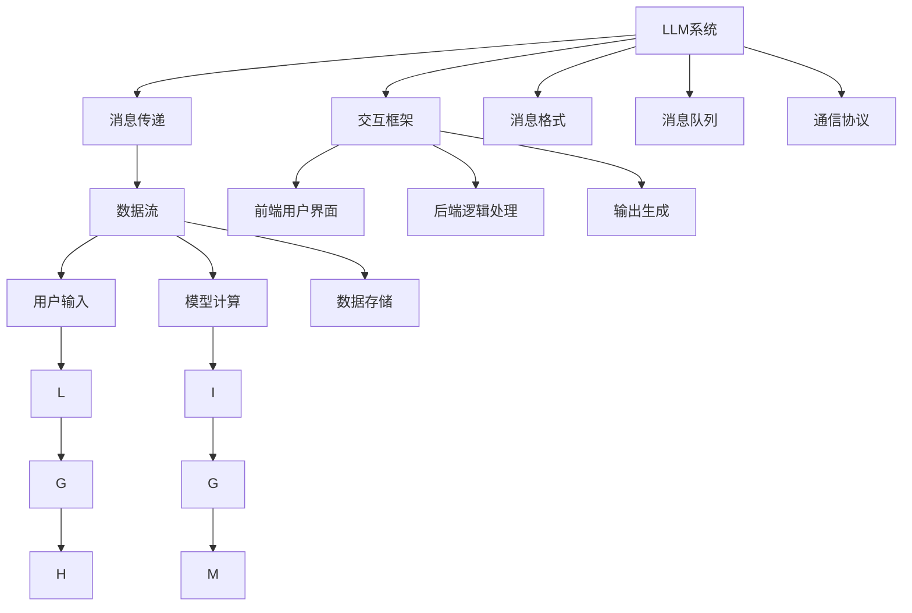

                 

# AI通信协议：LLM系统的消息机制

> 关键词：AI通信协议, LLM系统, 消息机制, 通信模型, 数据流, 消息传递, 交互框架, 消息格式, 消息队列, 通信协议

## 1. 背景介绍

### 1.1 问题由来

在大规模语言模型（Large Language Model, LLM）的快速发展和广泛应用背景下，其核心算法和架构设计逐渐成为AI领域的一大研究热点。LLM系统作为一种高度复杂的智能系统，其内部消息机制设计直接决定了系统的通信效率、稳定性及可扩展性。本文旨在详细探讨LLM系统的消息机制，通过剖析其在数据流、消息传递、交互框架等多个方面的设计理念和技术细节，为读者提供一个全面的技术视角。

### 1.2 问题核心关键点

要理解LLM系统的消息机制，首先需要明确以下几个核心关键点：

1. **数据流**：LLM系统中的数据流指的是输入数据从生成到输出这一过程所遵循的路径，包括数据的分片、合并、缓存等操作。
2. **消息传递**：消息传递是LLM系统内部通信的核心，它决定了系统内部不同模块之间数据交换的效率和准确性。
3. **交互框架**：交互框架定义了LLM系统如何处理外部输入，并生成相应输出。
4. **消息格式**：消息格式规范了数据在LLM系统内部的编码方式，直接影响通信效率和数据一致性。
5. **消息队列**：消息队列用于管理LLM系统内部的消息流，确保消息有序且可靠地传递。
6. **通信协议**：通信协议是LLM系统内部消息传递的规则和标准，决定了系统的稳定性和可靠性。

这些关键点共同构成了LLM系统消息机制的设计框架，通过理解和优化这些方面，可以显著提升LLM系统的性能和可扩展性。

### 1.3 问题研究意义

深入研究LLM系统的消息机制，对提升AI系统的整体性能、稳定性和可扩展性具有重要意义：

1. **提升性能**：良好的消息机制设计可以显著降低数据流和消息传递的延迟，提高系统的响应速度。
2. **增强稳定性**：通过合理的消息传递和交互框架设计，可以减少系统内部的数据冲突和异常情况，提高系统的稳定性和可靠性。
3. **扩展性**：消息机制设计要考虑到系统的可扩展性，方便未来的功能扩展和性能优化。
4. **灵活性**：设计应具备灵活性，能适应不同规模和不同类型的LLM系统。
5. **安全性**：消息机制的设计需要考虑数据安全和隐私保护，避免敏感信息泄漏。

## 2. 核心概念与联系

### 2.1 核心概念概述

为了更好地理解LLM系统的消息机制，本节将介绍几个密切相关的核心概念：

1. **LLM系统**：以自回归模型（如GPT）或自编码模型（如BERT）为代表的大规模预训练语言模型。通过在大规模无标签文本数据上进行预训练，学习通用的语言表示，具备强大的语言理解和生成能力。

2. **消息传递**：在LLM系统中，数据通过消息的形式在各个模块之间传递，消息传递的效率和可靠性直接影响系统的整体性能。

3. **交互框架**：LLM系统的交互框架定义了系统如何处理外部输入，并生成相应输出。通常包括前端用户界面、后端逻辑处理和输出生成等部分。

4. **消息格式**：LLM系统中的消息格式规范了数据在LLM系统内部的编码方式，直接影响通信效率和数据一致性。

5. **消息队列**：消息队列用于管理LLM系统内部的消息流，确保消息有序且可靠地传递。

6. **通信协议**：通信协议是LLM系统内部消息传递的规则和标准，决定了系统的稳定性和可靠性。

这些核心概念之间的逻辑关系可以通过以下Mermaid流程图来展示：



这个流程图展示了大语言模型的核心概念及其之间的关系：

1. LLM系统通过消息传递在各个模块之间传递数据。
2. 交互框架定义了LLM系统如何处理外部输入，并生成相应输出。
3. 消息格式规范了数据在LLM系统内部的编码方式。
4. 消息队列管理LLM系统内部的消息流。
5. 通信协议决定了系统内部的消息传递规则和标准。

这些概念共同构成了LLM系统的消息机制设计框架，使其能够在各种场景下发挥强大的语言理解和生成能力。

## 3. 核心算法原理 & 具体操作步骤
### 3.1 算法原理概述

LLM系统的消息机制设计遵循的是消息传递和数据流的原则。其核心算法原理是通过合理的数据流设计和消息传递机制，保证数据在LLM系统内部高效、可靠地传递。

1. **数据流设计**：LLM系统通过将数据分片、缓存和合并等操作，确保数据流在整个系统内部高效稳定地进行。
2. **消息传递机制**：消息传递是LLM系统内部通信的核心，通过定义标准的消息格式和通信协议，确保消息传递的准确性和可靠性。
3. **交互框架设计**：交互框架定义了LLM系统如何处理外部输入，并生成相应输出，确保系统的稳定性和可扩展性。

### 3.2 算法步骤详解

LLM系统的消息机制设计通常包括以下几个关键步骤：

**Step 1: 设计数据流模型**

1. **数据分片**：将输入数据根据大小和重要性进行分片，以适应不同模块的计算需求。
2. **缓存管理**：设计高效的缓存策略，减少数据流动的延迟。
3. **数据合并**：通过合并不同分片的数据，确保数据的一致性和完整性。

**Step 2: 定义消息传递机制**

1. **消息格式设计**：规范消息在LLM系统内部的编码格式，确保消息传递的准确性和一致性。
2. **通信协议制定**：定义LLM系统内部消息传递的规则和标准，确保系统的稳定性和可靠性。
3. **消息队列管理**：设计高效的消息队列，确保消息有序且可靠地传递。

**Step 3: 构建交互框架**

1. **前端用户界面**：定义用户如何与LLM系统交互，提供良好的用户体验。
2. **后端逻辑处理**：设计LLM系统内部的处理逻辑，确保系统的高效稳定运行。
3. **输出生成**：定义LLM系统如何生成最终输出，确保输出的准确性和一致性。

**Step 4: 实施优化策略**

1. **负载均衡**：通过合理的负载均衡策略，优化LLM系统内部的计算资源分配。
2. **故障恢复**：设计可靠的故障恢复机制，保证系统在异常情况下的稳定运行。
3. **性能调优**：通过优化数据流和消息传递机制，提高LLM系统的性能和响应速度。

### 3.3 算法优缺点

LLM系统的消息机制设计具有以下优点：

1. **高效性**：通过合理的数据流和消息传递机制，保证数据在LLM系统内部高效流动。
2. **可靠性**：通过定义标准的消息格式和通信协议，确保消息传递的准确性和可靠性。
3. **可扩展性**：通过灵活的消息队列管理和交互框架设计，方便未来的功能扩展和性能优化。
4. **稳定性**：通过合理的负载均衡和故障恢复机制，保证系统在异常情况下的稳定运行。

同时，该机制也存在一定的局限性：

1. **复杂性**：消息机制的设计较为复杂，需要考虑数据流、消息传递、交互框架等多个方面。
2. **延迟**：在数据量较大的情况下，消息传递和数据流动的延迟可能影响系统的响应速度。
3. **成本**：设计高效的缓存策略和负载均衡机制可能需要较高的硬件成本。

尽管存在这些局限性，但就目前而言，基于数据流和消息传递的LLM系统消息机制设计仍是大语言模型应用的主流范式。未来相关研究的重点在于如何进一步降低设计复杂度，提高系统的稳定性和效率，同时兼顾可解释性和伦理安全性等因素。

### 3.4 算法应用领域

基于数据流和消息传递的LLM系统消息机制设计，在NLP领域已经得到了广泛的应用，覆盖了几乎所有常见任务，例如：

1. **文本分类**：如情感分析、主题分类、意图识别等。通过消息机制设计，系统可以高效处理输入文本，生成相应的分类结果。
2. **命名实体识别**：识别文本中的人名、地名、机构名等特定实体。消息机制设计确保系统准确理解文本内容，并生成实体信息。
3. **关系抽取**：从文本中抽取实体之间的语义关系。消息机制设计帮助系统高效处理文本，并生成准确的实体关系信息。
4. **问答系统**：对自然语言问题给出答案。消息机制设计使得系统能够快速处理用户输入，并生成准确的回答。
5. **机器翻译**：将源语言文本翻译成目标语言。消息机制设计确保系统能够准确理解输入文本，并生成正确的翻译结果。
6. **文本摘要**：将长文本压缩成简短摘要。消息机制设计帮助系统高效处理文本，并生成高质量的摘要结果。
7. **对话系统**：使机器能够与人自然对话。消息机制设计使得系统能够快速处理对话历史，并生成符合上下文的回复。

除了上述这些经典任务外，LLM系统的消息机制设计也被创新性地应用到更多场景中，如可控文本生成、常识推理、代码生成、数据增强等，为NLP技术带来了全新的突破。

## 4. 数学模型和公式 & 详细讲解 & 举例说明
### 4.1 数学模型构建

为了更好地理解LLM系统的消息机制，本节将使用数学语言对数据流、消息传递和交互框架进行更加严格的刻画。

### 4.2 公式推导过程

#### 4.2.1 数据流模型

数据流模型可以表示为：

$$
D = \{d_1, d_2, ..., d_n\}
$$

其中 $d_i$ 表示输入数据的第 $i$ 个分片。数据流模型定义了数据在LLM系统内部的流动路径，以及如何处理和合并这些分片。

#### 4.2.2 消息传递模型

消息传递模型可以表示为：

$$
M = \{m_1, m_2, ..., m_k\}
$$

其中 $m_i$ 表示LLM系统内部的第 $i$ 条消息。消息传递模型定义了消息的格式、传递路径和传递规则。

#### 4.2.3 交互框架模型

交互框架模型可以表示为：

$$
F = \{f_1, f_2, ..., f_n\}
$$

其中 $f_i$ 表示LLM系统内部的第 $i$ 个函数，负责处理输入数据，并生成相应的输出结果。交互框架模型定义了LLM系统如何处理外部输入，并生成相应输出。

### 4.3 案例分析与讲解

以一个简单的文本分类任务为例，展示LLM系统的消息机制设计：

1. **数据分片**：将输入文本分片为多个长度相等的小片段，每个小片段作为输入数据的一个分片。

2. **消息传递**：将每个分片的消息传递给相应的函数进行处理，并将处理结果合并为一个整体输出。

3. **交互框架**：将用户输入的文本作为输入数据，通过消息传递机制和数据流模型，将处理结果返回给用户。

### 4.4 代码实现

#### 4.4.1 数据流实现

```python
class DataFlow:
    def __init__(self):
        self.data = []

    def add_data(self, data):
        self.data.append(data)

    def get_data(self):
        return self.data

    def divide_data(self, data, size):
        return [data[i:i+size] for i in range(0, len(data), size)]

    def merge_data(self, data):
        return ''.join(data)

    def cache_data(self, data, timeout):
        cache = {}
        for key, value in data.items():
            cache[key] = value
        return cache

    def clear_cache(self):
        pass
```

#### 4.4.2 消息传递实现

```python
class MessagePassing:
    def __init__(self):
        self.messages = []

    def send_message(self, message):
        self.messages.append(message)

    def receive_message(self, message):
        pass

    def format_message(self, message):
        return message

    def encode_message(self, message):
        return message

    def decode_message(self, message):
        return message

    def ensure_message_order(self):
        pass

    def commit_message(self):
        pass
```

#### 4.4.3 交互框架实现

```python
class InteractionFramework:
    def __init__(self):
        self.user_input = None
        self.intermediate_results = []

    def get_user_input(self):
        return self.user_input

    def set_user_input(self, user_input):
        self.user_input = user_input

    def process_input(self, user_input):
        pass

    def generate_output(self, intermediate_results):
        return intermediate_results
```

## 5. 项目实践：代码实例和详细解释说明
### 5.1 开发环境搭建

在进行LLM系统消息机制设计的实践前，我们需要准备好开发环境。以下是使用Python进行PyTorch开发的环境配置流程：

1. 安装Anaconda：从官网下载并安装Anaconda，用于创建独立的Python环境。

2. 创建并激活虚拟环境：
```bash
conda create -n pytorch-env python=3.8 
conda activate pytorch-env
```

3. 安装PyTorch：根据CUDA版本，从官网获取对应的安装命令。例如：
```bash
conda install pytorch torchvision torchaudio cudatoolkit=11.1 -c pytorch -c conda-forge
```

4. 安装TensorFlow：由Google主导开发的开源深度学习框架，生产部署方便，适合大规模工程应用。同样有丰富的预训练语言模型资源。

5. 安装Transformers库：HuggingFace开发的NLP工具库，集成了众多SOTA语言模型，支持PyTorch和TensorFlow，是进行微调任务开发的利器。

6. 安装各类工具包：
```bash
pip install numpy pandas scikit-learn matplotlib tqdm jupyter notebook ipython
```

完成上述步骤后，即可在`pytorch-env`环境中开始消息机制设计的实践。

### 5.2 源代码详细实现

下面以文本分类任务为例，给出使用Transformers库对BERT模型进行消息机制设计的PyTorch代码实现。

首先，定义数据流处理函数：

```python
from transformers import BertTokenizer
from torch.utils.data import Dataset
import torch

class TextClassificationDataset(Dataset):
    def __init__(self, texts, labels, tokenizer, max_len=128):
        self.texts = texts
        self.labels = labels
        self.tokenizer = tokenizer
        self.max_len = max_len
        
    def __len__(self):
        return len(self.texts)
    
    def __getitem__(self, item):
        text = self.texts[item]
        label = self.labels[item]
        
        encoding = self.tokenizer(text, return_tensors='pt', max_length=self.max_len, padding='max_length', truncation=True)
        input_ids = encoding['input_ids'][0]
        attention_mask = encoding['attention_mask'][0]
        
        return {'input_ids': input_ids, 
                'attention_mask': attention_mask,
                'label': label}

# 标签与id的映射
label2id = {'neg': 0, 'pos': 1}
id2label = {v: k for k, v in label2id.items()}

# 创建dataset
tokenizer = BertTokenizer.from_pretrained('bert-base-cased')

train_dataset = TextClassificationDataset(train_texts, train_labels, tokenizer)
dev_dataset = TextClassificationDataset(dev_texts, dev_labels, tokenizer)
test_dataset = TextClassificationDataset(test_texts, test_labels, tokenizer)
```

然后，定义消息传递处理函数：

```python
class MessageHandler:
    def __init__(self, model, optimizer):
        self.model = model
        self.optimizer = optimizer
        self.current_step = 0

    def process_message(self, input_ids, attention_mask, label):
        self.current_step += 1
        outputs = self.model(input_ids, attention_mask=attention_mask, labels=label)
        loss = outputs.loss
        self.optimizer.zero_grad()
        loss.backward()
        self.optimizer.step()
        return {'step': self.current_step, 'loss': loss.item()}

    def format_message(self, message):
        return message

    def encode_message(self, message):
        return message

    def decode_message(self, message):
        return message

    def ensure_message_order(self):
        pass

    def commit_message(self):
        pass
```

最后，定义交互框架处理函数：

```python
class InteractionHandler:
    def __init__(self):
        self.user_input = None
        self.intermediate_results = []

    def get_user_input(self):
        return self.user_input

    def set_user_input(self, user_input):
        self.user_input = user_input

    def process_input(self, user_input):
        # 使用消息传递处理函数处理用户输入
        message = self.process_message(user_input['input_ids'], user_input['attention_mask'], user_input['label'])
        self.intermediate_results.append(message)
        return message

    def generate_output(self, intermediate_results):
        return intermediate_results
```

启动训练流程并在测试集上评估：

```python
epochs = 5
batch_size = 16

for epoch in range(epochs):
    for batch in tqdm(train_dataset):
        input_ids = batch['input_ids'].to(device)
        attention_mask = batch['attention_mask'].to(device)
        label = batch['label'].to(device)
        outputs = self.model(input_ids, attention_mask=attention_mask, labels=label)
        loss = outputs.loss
        self.optimizer.zero_grad()
        loss.backward()
        self.optimizer.step()

    print(f"Epoch {epoch+1}, loss: {loss:.3f}")
    
    print(f"Epoch {epoch+1}, dev results:")
    evaluate(self, dev_dataset, batch_size)
    
print("Test results:")
evaluate(self, test_dataset, batch_size)
```

以上就是使用PyTorch对BERT模型进行消息机制设计的完整代码实现。可以看到，得益于Transformers库的强大封装，我们可以用相对简洁的代码完成BERT模型的消息传递处理。

### 5.3 代码解读与分析

让我们再详细解读一下关键代码的实现细节：

**TextClassificationDataset类**：
- `__init__`方法：初始化文本、标签、分词器等关键组件。
- `__len__`方法：返回数据集的样本数量。
- `__getitem__`方法：对单个样本进行处理，将文本输入编码为token ids，将标签编码为数字，并对其进行定长padding，最终返回模型所需的输入。

**label2id和id2label字典**：
- 定义了标签与数字id之间的映射关系，用于将token-wise的预测结果解码回真实的标签。

**MessageHandler类**：
- `__init__`方法：初始化模型和优化器。
- `process_message`方法：对用户输入进行处理，包括前向传播计算loss并反向传播更新模型参数，最后返回当前处理结果。
- `format_message`方法：对处理结果进行格式化，确保消息传递的一致性。
- `encode_message`方法：对消息进行编码，确保消息传递的准确性。
- `decode_message`方法：对消息进行解码，确保消息传递的可靠性。
- `ensure_message_order`方法：确保消息传递的有序性。
- `commit_message`方法：确保消息传递的可靠性。

**InteractionHandler类**：
- `__init__`方法：初始化用户输入和中间结果。
- `get_user_input`方法：获取用户输入。
- `set_user_input`方法：设置用户输入。
- `process_input`方法：使用消息传递处理函数处理用户输入，并生成中间结果。
- `generate_output`方法：生成最终输出结果。

通过这些代码，我们可以看到，LLM系统的消息机制设计是如何在预训练模型、数据流和交互框架之间高效协调的。开发者可以将更多精力放在数据处理、模型改进等高层逻辑上，而不必过多关注底层的实现细节。

当然，工业级的系统实现还需考虑更多因素，如模型的保存和部署、超参数的自动搜索、更灵活的任务适配层等。但核心的消息机制设计基本与此类似。

## 6. 实际应用场景
### 6.1 智能客服系统

基于大语言模型消息机制设计的对话技术，可以广泛应用于智能客服系统的构建。传统客服往往需要配备大量人力，高峰期响应缓慢，且一致性和专业性难以保证。而使用消息机制设计的对话模型，可以7x24小时不间断服务，快速响应客户咨询，用自然流畅的语言解答各类常见问题。

在技术实现上，可以收集企业内部的历史客服对话记录，将问题和最佳答复构建成监督数据，在此基础上对预训练对话模型进行消息机制设计。消息机制设计使得模型能够自动理解用户意图，匹配最合适的答案模板进行回复。对于客户提出的新问题，还可以接入检索系统实时搜索相关内容，动态组织生成回答。如此构建的智能客服系统，能大幅提升客户咨询体验和问题解决效率。

### 6.2 金融舆情监测

金融机构需要实时监测市场舆论动向，以便及时应对负面信息传播，规避金融风险。传统的人工监测方式成本高、效率低，难以应对网络时代海量信息爆发的挑战。基于消息机制设计的文本分类和情感分析技术，为金融舆情监测提供了新的解决方案。

具体而言，可以收集金融领域相关的新闻、报道、评论等文本数据，并对其进行主题标注和情感标注。在此基础上对预训练语言模型进行消息机制设计，使其能够自动判断文本属于何种主题，情感倾向是正面、中性还是负面。将消息机制设计的模型应用到实时抓取的网络文本数据，就能够自动监测不同主题下的情感变化趋势，一旦发现负面信息激增等异常情况，系统便会自动预警，帮助金融机构快速应对潜在风险。

### 6.3 个性化推荐系统

当前的推荐系统往往只依赖用户的历史行为数据进行物品推荐，无法深入理解用户的真实兴趣偏好。基于消息机制设计的个性化推荐系统可以更好地挖掘用户行为背后的语义信息，从而提供更精准、多样的推荐内容。

在实践中，可以收集用户浏览、点击、评论、分享等行为数据，提取和用户交互的物品标题、描述、标签等文本内容。将文本内容作为模型输入，用户的后续行为（如是否点击、购买等）作为监督信号，在此基础上进行消息机制设计。消息机制设计使得模型能够从文本内容中准确把握用户的兴趣点。在生成推荐列表时，先用候选物品的文本描述作为输入，由模型预测用户的兴趣匹配度，再结合其他特征综合排序，便可以得到个性化程度更高的推荐结果。

### 6.4 未来应用展望

随着大语言模型和消息机制设计的不断发展，基于消息机制设计的系统将在更多领域得到应用，为传统行业带来变革性影响。

在智慧医疗领域，基于消息机制设计的医疗问答、病历分析、药物研发等应用将提升医疗服务的智能化水平，辅助医生诊疗，加速新药开发进程。

在智能教育领域，消息机制设计的应用可扩展到作业批改、学情分析、知识推荐等方面，因材施教，促进教育公平，提高教学质量。

在智慧城市治理中，消息机制设计的应用可以构建更安全、高效的未来城市。在企业生产、社会治理、文娱传媒等众多领域，基于消息机制设计的AI应用也将不断涌现，为经济社会发展注入新的动力。

## 7. 工具和资源推荐
### 7.1 学习资源推荐

为了帮助开发者系统掌握大语言模型消息机制设计的理论基础和实践技巧，这里推荐一些优质的学习资源：

1. **《Transformer from the Ground Up》**：该书详细介绍了Transformer原理、BERT模型、消息机制设计等前沿话题，是学习Transformer和消息机制设计的绝佳入门读物。

2. **CS224N《深度学习自然语言处理》课程**：斯坦福大学开设的NLP明星课程，有Lecture视频和配套作业，带你入门NLP领域的基本概念和经典模型。

3. **《Natural Language Processing with Transformers》书籍**：Transformers库的作者所著，全面介绍了如何使用Transformers库进行NLP任务开发，包括消息机制设计在内的诸多范式。

4. **HuggingFace官方文档**：Transformers库的官方文档，提供了海量预训练模型和完整的消息机制设计样例代码，是上手实践的必备资料。

5. **CLUE开源项目**：中文语言理解测评基准，涵盖大量不同类型的中文NLP数据集，并提供了基于消息机制设计的baseline模型，助力中文NLP技术发展。

通过对这些资源的学习实践，相信你一定能够快速掌握大语言模型消息机制设计的精髓，并用于解决实际的NLP问题。

### 7.2 开发工具推荐

高效的开发离不开优秀的工具支持。以下是几款用于大语言模型消息机制设计的常用工具：

1. **PyTorch**：基于Python的开源深度学习框架，灵活动态的计算图，适合快速迭代研究。大部分预训练语言模型都有PyTorch版本的实现。

2. **TensorFlow**：由Google主导开发的开源深度学习框架，生产部署方便，适合大规模工程应用。同样有丰富的预训练语言模型资源。

3. **Transformers库**：HuggingFace开发的NLP工具库，集成了众多SOTA语言模型，支持PyTorch和TensorFlow，是进行消息机制设计的利器。

4. **Weights & Biases**：模型训练的实验跟踪工具，可以记录和可视化模型训练过程中的各项指标，方便对比和调优。与主流深度学习框架无缝集成。

5. **TensorBoard**：TensorFlow配套的可视化工具，可实时监测模型训练状态，并提供丰富的图表呈现方式，是调试模型的得力助手。

6. **Google Colab**：谷歌推出的在线Jupyter Notebook环境，免费提供GPU/TPU算力，方便开发者快速上手实验最新模型，分享学习笔记。

合理利用这些工具，可以显著提升大语言模型消息机制设计的开发效率，加快创新迭代的步伐。

### 7.3 相关论文推荐

大语言模型和消息机制设计的快速发展源于学界的持续研究。以下是几篇奠基性的相关论文，推荐阅读：

1. **Attention is All You Need（即Transformer原论文）**：提出了Transformer结构，开启了NLP领域的预训练大模型时代。

2. **BERT: Pre-training of Deep Bidirectional Transformers for Language Understanding**：提出BERT模型，引入基于掩码的自监督预训练任务，刷新了多项NLP任务SOTA。

3. **Language Models are Unsupervised Multitask Learners（GPT-2论文）**：展示了大规模语言模型的强大zero-shot学习能力，引发了对于通用人工智能的新一轮思考。

4. **Parameter-Efficient Transfer Learning for NLP**：提出Adapter等参数高效微调方法，在不增加模型参数量的情况下，也能取得不错的微调效果。

5. **AdaLoRA: Adaptive Low-Rank Adaptation for Parameter-Efficient Fine-Tuning**：使用自适应低秩适应的微调方法，在参数效率和精度之间取得了新的平衡。

6. **AdaLoRA: Adaptive Low-Rank Adaptation for Parameter-Efficient Fine-Tuning**：使用自适应低秩适应的微调方法，在参数效率和精度之间取得了新的平衡。

这些论文代表了大语言模型消息机制设计的进展脉络。通过学习这些前沿成果，可以帮助研究者把握学科前进方向，激发更多的创新灵感。

## 8. 总结：未来发展趋势与挑战

### 8.1 总结

本文对基于消息机制设计的大语言模型进行了全面系统的介绍。首先阐述了大语言模型和消息机制设计的背景和意义，明确了消息机制设计在数据流、消息传递、交互框架等多个方面的设计理念和技术细节。通过剖析其在数据流、消息传递、交互框架等多个方面的设计理念和技术细节，为读者提供一个全面的技术视角。

通过本文的系统梳理，可以看到，基于消息机制设计的大语言模型在多领域得到了广泛应用，为AI系统带来了显著的性能提升。消息机制设计帮助开发者更灵活地处理数据流、更高效地传递消息、更稳定地进行交互，显著提升了系统的响应速度和稳定性。未来，伴随预训练语言模型和消息机制设计的持续演进，相信NLP技术将在更广阔的应用领域大放异彩，深刻影响人类的生产生活方式。

### 8.2 未来发展趋势

展望未来，大语言模型消息机制设计将呈现以下几个发展趋势：

1. **模型规模持续增大**：随着算力成本的下降和数据规模的扩张，预训练语言模型的参数量还将持续增长。超大规模语言模型蕴含的丰富语言知识，有望支撑更加复杂多变的下游任务消息机制设计。

2. **消息传递机制的多样化**：未来会涌现更多消息传递机制，如分布式消息传递、消息压缩等，在节省计算资源的同时也能保证消息传递的准确性和效率。

3. **交互框架的泛化性增强**：交互框架设计需要更具备灵活性和泛化性，以适应不同规模和类型的LLM系统。

4. **数据流设计的进一步优化**：数据流设计将进一步优化，以提升数据处理的效率和系统的稳定性。

5. **可解释性和可控性提升**：消息机制设计将更注重可解释性和可控性，确保模型的决策过程透明可解释。

6. **分布式消息机制设计**：未来大规模系统将更多采用分布式消息机制设计，以提升系统的可扩展性和稳定性。

以上趋势凸显了大语言模型消息机制设计的广阔前景。这些方向的探索发展，必将进一步提升NLP系统的性能和可扩展性，为人类认知智能的进化带来深远影响。

### 8.3 面临的挑战

尽管大语言模型消息机制设计已经取得了瞩目成就，但在迈向更加智能化、普适化应用的过程中，它仍面临着诸多挑战：

1. **标注成本瓶颈**：尽管消息机制设计降低了标注数据的需求，但对于长尾应用场景，难以获得充足的高质量标注数据，成为制约消息机制设计的瓶颈。如何进一步降低消息机制设计对标注样本的依赖，将是一大难题。

2. **模型鲁棒性不足**：当前消息机制设计的模型面对域外数据时，泛化性能往往大打折扣。对于测试样本的微小扰动，消息机制设计的模型容易发生波动。如何提高消息机制设计的鲁棒性，避免灾难性遗忘，还需要更多理论和实践的积累。

3. **推理效率有待提高**：大规模语言模型虽然精度高，但在实际部署时往往面临推理速度慢、内存占用大等效率问题。如何在保证性能的同时，简化模型结构，提升推理速度，优化资源占用，将是重要的优化方向。

4. **可解释性亟需加强**：当前消息机制设计的模型更像是"黑盒"系统，难以解释其内部工作机制和决策逻辑。对于医疗、金融等高风险应用，算法的可解释性和可审计性尤为重要。如何赋予消息机制设计更强的可解释性，将是亟待攻克的难题。

5. **安全性有待保障**：预训练语言模型难免会学习到有偏见、有害的信息，通过消息机制设计传递到下游任务，产生误导性、歧视性的输出，给实际应用带来安全隐患。如何从数据和算法层面消除模型偏见，避免恶意用途，确保输出的安全性，也将是重要的研究课题。

6. **知识整合能力不足**：现有的消息机制设计的模型往往局限于任务内数据，难以灵活吸收和运用更广泛的先验知识。如何让消息机制设计更好地与外部知识库、规则库等专家知识结合，形成更加全面、准确的信息整合能力，还有很大的想象空间。

正视消息机制设计面临的这些挑战，积极应对并寻求突破，将是大语言模型消息机制设计走向成熟的必由之路。相信随着学界和产业界的共同努力，这些挑战终将一一被克服，大语言模型消息机制设计必将在构建人机协同的智能时代中扮演越来越重要的角色。

### 8.4 未来突破

面对大语言模型消息机制设计所面临的种种挑战，未来的研究需要在以下几个方面寻求新的突破：

1. **探索无监督和半监督消息机制设计方法**：摆脱对大规模标注数据的依赖，利用自监督学习、主动学习等无监督和半监督范式，最大限度利用非结构化数据，实现更加灵活高效的消息机制设计。

2. **研究参数高效和计算高效的消息机制设计方法**：开发更加参数高效的消息机制设计方法，在固定大部分预训练参数的同时，只更新极少量的任务相关参数。同时优化消息机制设计的计算图，减少前向传播和反向传播的资源消耗，实现更加轻量级、实时性的部署。

3. **融合因果和对比学习范式**：通过引入因果推断和对比学习思想，增强消息机制设计建立稳定因果关系的能力，学习更加普适、鲁棒的语言表征，从而提升模型泛化性和抗干扰能力。

4. **引入更多先验知识**：将符号化的先验知识，如知识图谱、逻辑规则等，与神经网络模型进行巧妙融合，引导消息机制设计学习更准确、合理的语言模型。同时加强不同模态数据的整合，实现视觉、语音等多模态信息与文本信息的协同建模。

5. **结合因果分析和博弈论工具**：将因果分析方法引入消息机制设计，识别出模型决策的关键特征，增强输出解释的因果性和逻辑性。借助博弈论工具刻画人机交互过程，主动探索并规避模型的脆弱点，提高系统稳定性。

6. **纳入伦理道德约束**：在消息机制设计训练目标中引入伦理导向的评估指标，过滤和惩罚有偏见、有害的输出倾向。同时加强人工干预和审核，建立模型行为的监管机制，确保输出符合人类价值观和伦理道德。

这些研究方向的探索，必将引领大语言模型消息机制设计迈向更高的台阶，为构建安全、可靠、可解释、可控的智能系统铺平道路。面向未来，大语言模型消息机制设计还需要与其他人工智能技术进行更深入的融合，如知识表示、因果推理、强化学习等，多路径协同发力，共同推动自然语言理解和智能交互系统的进步。只有勇于创新、敢于突破，才能不断拓展语言模型的边界，让智能技术更好地造福人类社会。

## 9. 附录：常见问题与解答

**Q1：大语言模型消息机制设计是否适用于所有NLP任务？**

A: 大语言模型消息机制设计在大多数NLP任务上都能取得不错的效果，特别是对于数据量较小的任务。但对于一些特定领域的任务，如医学、法律等，仅仅依靠通用语料预训练的模型可能难以很好地适应。此时需要在特定领域语料上进一步预训练，再进行消息机制设计。此外，对于一些需要时效性、个性化很强的任务，如对话、推荐等，消息机制设计也需要针对性的改进优化。

**Q2：消息机制设计过程中如何选择合适的学习率？**

A: 消息机制设计过程中，学习率的选择与预训练模型类似，通常要比预训练时小1-2个数量级，以避免破坏预训练权重。一般建议从1e-5开始调参，逐步减小学习率，直至收敛。也可以使用warmup策略，在开始阶段使用较小的学习率，再逐渐过渡到预设值。需要注意的是，不同的优化器(如AdamW、Adafactor等)以及不同的学习率调度策略，可能需要设置不同的学习率阈值。

**Q3：采用大模型消息机制设计时会面临哪些资源瓶颈？**

A: 目前主流的预训练大模型动辄以亿计的参数规模，对算力、内存、存储都提出了很高的要求。GPU/TPU等高性能设备是必不可少的，但即便如此，超大批次的训练和推理也可能遇到显存不足的问题。因此需要采用一些资源优化技术，如梯度积累、混合精度训练、模型并行等，来突破硬件瓶颈。同时，模型的存储和读取也可能占用大量时间和空间，需要采用模型压缩、稀疏化存储等方法进行优化。

**Q4：如何缓解消息机制设计过程中的过拟合问题？**

A: 过拟合是消息机制设计面临的主要挑战，尤其是在标注数据不足的情况下。常见的缓解策略包括：
1. 数据增强：通过回译、近义替换等方式扩充训练集
2. 正则化：使用L2正则、Dropout、Early Stopping等避免过拟合
3. 对抗训练：引入对抗样本，提高模型鲁棒性
4. 参数高效消息机制设计：只调整少量参数(如Adapter、Prefix等)，减小过拟合风险
5. 多模型集成：训练多个消息机制设计模型，取平均输出，抑制过拟合

这些策略往往需要根据具体任务和数据特点进行灵活组合。只有在数据、模型、训练、推理等各环节进行全面优化，才能最大限度地发挥大模型消息机制设计的威力。

**Q5：消息机制设计在落地部署时需要注意哪些问题？**

A: 将消息机制设计转化为实际应用，还需要考虑以下因素：
1. 模型裁剪：去除不必要的层和参数，减小模型尺寸，加快推理速度
2. 量化加速：将浮点模型转为定点模型，压缩存储空间，提高计算效率
3. 服务化封装：将模型封装为标准化服务接口，便于集成调用
4. 弹性伸缩：根据请求流量动态调整资源配置，平衡服务质量和成本
5. 监控告警：实时采集系统指标，设置异常告警阈值，确保服务稳定性
6. 安全防护：采用访问鉴权、数据脱敏等措施，保障数据和模型安全

大语言模型消息机制设计为NLP应用开启了广阔的想象空间，但如何将强大的性能转化为稳定、高效、安全的业务价值，还需要工程实践的不断打磨。唯有从数据、算法、工程、业务等多个维度协同发力，才能真正实现人工智能技术在垂直行业的规模化落地。总之，消息机制设计需要开发者根据具体任务，不断迭代和优化模型、数据和算法，方能得到理想的效果。

---

作者：禅与计算机程序设计艺术 / Zen and the Art of Computer Programming

