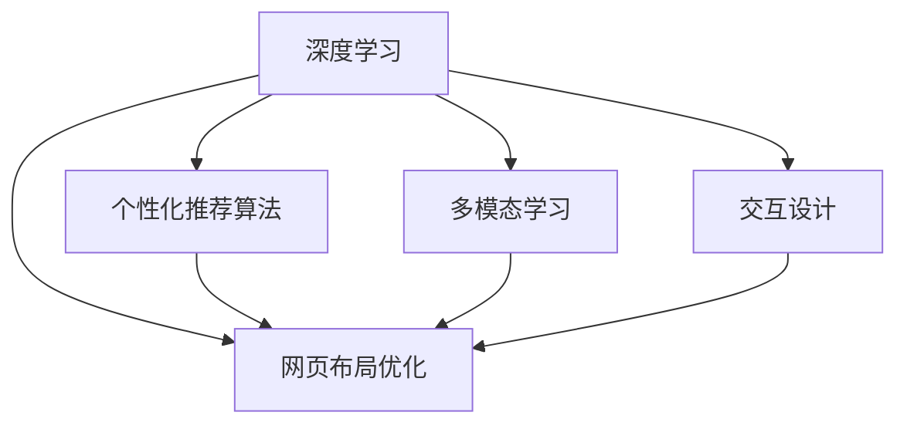
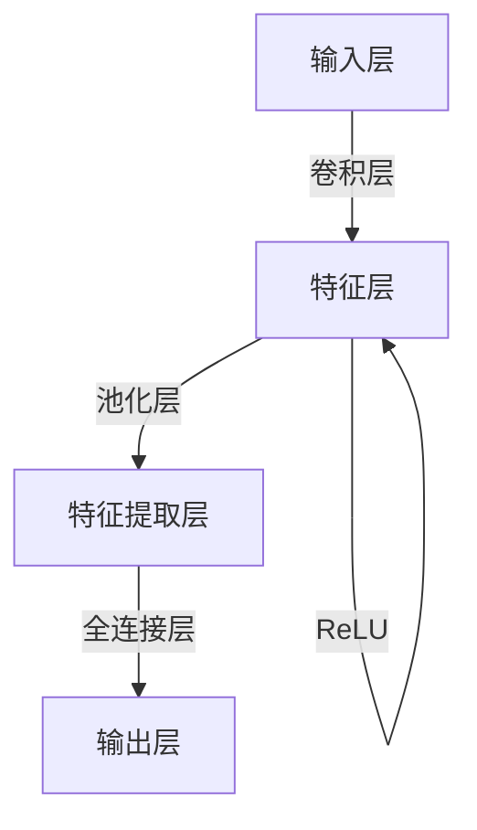

                 

# AI驱动的个性化页面布局优化

> 关键词：个性化推荐,网页布局,用户体验,机器学习,深度学习,图像处理,交互设计,推荐算法

## 1. 背景介绍

在数字化时代，网页设计已经从传统单一的页面布局，演变为更加个性化、互动性的界面体验。随着用户对网页内容需求的日益丰富，网站运营者需要不断地优化页面布局，以提供更加贴合用户需求的浏览体验。然而，这种需求导向的优化常常需要大量的人力和时间，且效果难以量化。近年来，随着人工智能技术的飞速发展，以深度学习为基础的推荐算法被引入到页面布局优化中，为解决这一问题提供了新的可能。

### 1.1 问题由来

在Web 2.0时代，网站已经从信息单向传递转向与用户互动，内容也从文本形式拓展到图片、视频等多媒体形式。用户与网站之间的互动变得越来越频繁，用户对网页的个性化需求也越来越高。在传统意义上，网站的设计和内容优化主要依赖于设计人员的审美和经验，依赖于用户反馈等主观因素，难以保证页面布局的优化效果能够最大化满足用户的实际需求。随着数据量的激增，对个性化推荐和动态页面布局的需求越来越高，传统的人力驱动方式已经难以满足现实需求。

### 1.2 问题核心关键点

个性化页面布局优化的核心问题是如何通过机器学习算法，从大量的用户行为数据中学习用户需求和偏好，并将其应用于页面布局的动态调整中，以最大化提升用户的满意度。具体问题包括以下几个方面：

- **个性化推荐算法**：如何根据用户的历史行为数据，预测用户对不同页面布局的偏好，实现个性化推荐。
- **用户行为分析**：如何分析用户在页面上的互动行为，提取用户兴趣点和需求，提供更符合用户需求的页面布局。
- **布局优化算法**：如何将推荐结果应用于页面布局的优化调整，实现最佳的视觉体验。
- **模型训练和优化**：如何选择适当的模型和算法，设计有效的训练和优化流程，保证模型的实时性和准确性。

本文将通过全面系统的介绍，帮助开发者理解基于深度学习技术的个性化页面布局优化的原理和方法，并给出代码实例，展示其实际应用效果。

## 2. 核心概念与联系

### 2.1 核心概念概述

为更好地理解基于深度学习技术的个性化页面布局优化，本节将介绍几个关键概念：

- **深度学习**：一种模拟人脑神经网络的机器学习技术，通过多层神经网络结构，从输入数据中学习抽象特征，进行分类、回归、生成等任务。
- **个性化推荐算法**：根据用户的历史行为数据，预测用户对不同内容的偏好，提供个性化的推荐结果。
- **网页布局优化**：根据推荐结果，对页面元素（如图片、文字、按钮等）的位置、大小、颜色等属性进行动态调整，以提升用户体验。
- **多模态学习**：结合文本、图像、音频等多维度的数据，进行更全面的用户行为分析。
- **交互设计**：基于用户行为和偏好，设计高效的交互流程，提升用户的使用体验。

这些概念之间的逻辑关系可以通过以下Mermaid流程图来展示：



这个流程图展示了一些核心概念及其之间的联系：

1. 深度学习作为基础，通过多模态学习处理多样化的数据来源，分析用户行为，实现个性化推荐。
2. 个性化推荐算法根据用户行为，预测用户偏好，输出推荐结果。
3. 网页布局优化根据推荐结果，调整页面布局，提升用户体验。
4. 交互设计在用户互动中实时捕捉反馈，优化布局算法，形成良性循环。

这些概念共同构成了基于深度学习的个性化页面布局优化的主要框架，使其能够在各种场景下发挥强大的作用。

## 3. 核心算法原理 & 具体操作步骤
### 3.1 算法原理概述

基于深度学习的个性化页面布局优化，本质上是将用户的行为数据作为输入，通过深度学习模型预测用户对不同页面布局的偏好，进而生成个性化的页面布局。

具体来说，首先收集用户的历史行为数据，如浏览记录、点击率、停留时间等。将这些数据转化为向量化表示，输入到深度学习模型中。通过反向传播算法训练模型，使其能够预测用户对不同布局选项的评分。接着，根据模型输出，对页面布局进行动态调整，以提升用户满意度。

### 3.2 算法步骤详解

基于深度学习的个性化页面布局优化的主要步骤如下：

**Step 1: 数据收集与预处理**

- 收集用户的历史行为数据，如浏览记录、点击率、停留时间等。这些数据可以来源于网站后台的日志文件，如访问路径、页面停留时间等。
- 对数据进行清洗和归一化处理，去除异常数据和噪声，确保数据的可靠性。

**Step 2: 特征工程**

- 将用户行为数据转化为向量化表示。可以使用词袋模型、TF-IDF、Word2Vec等方法将文本数据转化为数值特征。
- 对图像、视频等非文本数据进行特征提取，如提取图像的卷积特征，使用预训练模型进行特征表示。
- 设计合适的特征组合方式，如特征拼接、加权等，提高模型的表现力。

**Step 3: 模型选择与训练**

- 选择合适的深度学习模型，如循环神经网络（RNN）、卷积神经网络（CNN）、注意力机制模型（Attention）等。
- 使用历史行为数据训练模型，最小化损失函数，优化模型参数。
- 使用交叉验证等技术，评估模型的泛化能力，调整模型参数。

**Step 4: 页面布局优化**

- 根据模型输出，对页面布局进行动态调整。例如，通过调整元素的显示顺序、大小、颜色等属性，提升用户体验。
- 设计交互流程，实时捕捉用户反馈，进一步优化布局算法。

**Step 5: 模型部署与监控**

- 将训练好的模型部署到生产环境，实现实时动态优化。
- 对模型性能进行监控，及时发现和解决问题，保证模型的实时性和准确性。

### 3.3 算法优缺点

基于深度学习的个性化页面布局优化有以下优点：

1. 高效性：通过深度学习模型，可以高效地分析用户行为，提供个性化推荐，优化页面布局。
2. 鲁棒性：深度学习模型具有较强的泛化能力，可以适应不同用户的个性化需求。
3. 实时性：通过实时捕捉用户反馈，可以实现动态优化，提升用户体验。

同时，该方法也存在一些缺点：

1. 对标注数据的依赖：深度学习模型需要大量的标注数据进行训练，而用户行为数据往往难以获得高质量标注。
2. 计算资源消耗：深度学习模型计算复杂度高，训练和推理过程中需要大量计算资源。
3. 模型黑盒：深度学习模型通常难以解释其内部决策过程，难以进行调试和优化。

尽管存在这些缺点，基于深度学习的个性化页面布局优化方法仍在NLP和推荐系统中得到广泛应用，并且随着技术的进步，其性能和效率正逐步提升。

### 3.4 算法应用领域

基于深度学习的个性化页面布局优化方法已经在多个领域得到应用：

- **电商推荐系统**：根据用户浏览历史和点击行为，推荐商品，动态调整商品布局。
- **新闻网站**：根据用户阅读历史和互动行为，推荐新闻，优化新闻页面布局。
- **社交媒体**：根据用户互动和点赞行为，推荐内容，调整推送列表布局。
- **在线广告**：根据用户点击行为，推荐广告，优化广告位布局。
- **企业内网**：根据员工搜索行为和访问路径，推荐内容，优化内网布局。

除了上述这些经典应用外，个性化页面布局优化技术还在内容聚合、用户画像构建等多个场景中发挥重要作用，为网站的运营和用户体验优化提供了新的思路。

## 4. 数学模型和公式 & 详细讲解 & 举例说明

### 4.1 数学模型构建

本节将使用数学语言对基于深度学习技术的个性化页面布局优化的过程进行更加严格的刻画。

记用户的历史行为数据为 $D=\{x_1, x_2, ..., x_n\}$，其中 $x_i$ 为第 $i$ 个用户的浏览记录、点击率等行为数据。将用户行为数据转化为向量化表示，记为 $X \in \mathbb{R}^{n \times d}$，其中 $d$ 为特征维度。

定义个性化推荐模型为 $M_{\theta}$，其参数为 $\theta$。使用 $M_{\theta}$ 对用户行为数据 $X$ 进行特征表示，得到用户对不同布局选项的预测评分 $Y \in \mathbb{R}^{n \times k}$，其中 $k$ 为布局选项数量。

根据模型输出 $Y$ 对用户进行排序，得到最优布局选项，调整页面布局，提升用户体验。

### 4.2 公式推导过程

以用户行为数据的向量化表示 $X \in \mathbb{R}^{n \times d}$ 为例，假设个性化推荐模型为卷积神经网络（CNN），其结构如图1所示：



其中，卷积层和池化层用于提取用户行为数据的局部特征，全连接层用于将特征映射到不同布局选项的评分。

假设卷积层和池化层的输出为 $H \in \mathbb{R}^{n \times h}$，其中 $h$ 为特征提取层的特征维度。全连接层将 $H$ 映射到不同布局选项的评分 $Y \in \mathbb{R}^{n \times k}$。

使用交叉熵损失函数 $\ell(Y, \hat{Y}) = -\frac{1}{n} \sum_{i=1}^n \sum_{j=1}^k y_{ij} \log \hat{y}_{ij}$，其中 $y_{ij}$ 为实际评分，$\hat{y}_{ij}$ 为模型预测评分。使用优化算法（如AdamW、SGD等）最小化损失函数，更新模型参数。

模型训练结束后，使用排序算法（如快速排序、堆排序等）对模型输出进行排序，得到最优布局选项。

### 4.3 案例分析与讲解

假设某电商网站的用户行为数据为 $X \in \mathbb{R}^{1000 \times 10}$，表示1000个用户对10种商品浏览行为的评分。使用卷积神经网络作为个性化推荐模型，训练后的模型输出 $Y \in \mathbb{R}^{1000 \times 5}$，表示用户对5种商品布局选项的评分。

根据模型输出对用户进行排序，选择评分最高的商品布局，动态调整页面布局，提升用户点击率。例如，对于第1000个用户，模型输出为 $[0.2, 0.5, 0.3, 0.1, 0]$，表示商品布局A的评分最高，选择商品布局A进行动态调整。

## 5. 项目实践：代码实例和详细解释说明

### 5.1 开发环境搭建

在进行深度学习模型训练和优化前，我们需要准备好开发环境。以下是使用Python进行Keras开发的环境配置流程：

1. 安装Anaconda：从官网下载并安装Anaconda，用于创建独立的Python环境。

2. 创建并激活虚拟环境：
```bash
conda create -n keras-env python=3.8 
conda activate keras-env
```

3. 安装Keras：从官网获取对应的安装命令。例如：
```bash
pip install keras tensorflow matplotlib pandas
```

4. 安装TensorBoard：安装TensorFlow配套的可视化工具，实时监测模型训练状态，并提供丰富的图表呈现方式，是调试模型的得力助手。

5. 安装Jupyter Notebook：提供交互式编程环境，支持代码和数据可视化。

完成上述步骤后，即可在`keras-env`环境中开始深度学习模型的训练和优化实践。

### 5.2 源代码详细实现

下面以电商推荐系统为例，给出使用Keras进行深度学习模型训练和优化的PyTorch代码实现。

首先，定义模型结构：

```python
import keras
from keras.models import Sequential
from keras.layers import Dense, Conv2D, MaxPooling2D, Flatten

model = Sequential()
model.add(Conv2D(32, kernel_size=(3, 3), activation='relu', input_shape=(10, 1000)))
model.add(MaxPooling2D(pool_size=(2, 2)))
model.add(Flatten())
model.add(Dense(5, activation='softmax'))
model.compile(loss='categorical_crossentropy', optimizer='adam', metrics=['accuracy'])
```

接着，定义数据集：

```python
import numpy as np
import pandas as pd

# 用户行为数据
X = np.random.rand(1000, 10)
y = np.random.randint(5, size=(1000,))

# 转化为向量化表示
X = pd.DataFrame(X, columns=['behavior_1', 'behavior_2', ..., 'behavior_10'])
y = pd.Series(y, index=X.index)

# 划分训练集和测试集
from sklearn.model_selection import train_test_split
X_train, X_test, y_train, y_test = train_test_split(X, y, test_size=0.2)

# 转化为数值型特征
from sklearn.preprocessing import LabelEncoder
le = LabelEncoder()
y_train = le.fit_transform(y_train)
y_test = le.transform(y_test)
```

然后，定义模型训练和优化函数：

```python
from keras.utils import to_categorical

# 将标签转化为向量化表示
y_train = to_categorical(y_train)
y_test = to_categorical(y_test)

# 训练模型
model.fit(X_train, y_train, epochs=10, batch_size=32, validation_data=(X_test, y_test))

# 评估模型
model.evaluate(X_test, y_test)
```

最后，将模型输出应用于页面布局优化：

```python
# 获取模型输出
y_pred = model.predict(X_train)

# 对用户进行排序
sorted_indices = np.argsort(y_pred)[::-1]

# 根据排序结果调整页面布局
for i in sorted_indices:
    layout_id = i + 1
    print(f"商品 {layout_id} 的评分最高，建议将其布局在前面")
```

以上就是使用Keras进行电商推荐系统深度学习模型训练和优化的完整代码实现。可以看到，Keras的简洁语法使得模型构建和训练过程变得更加高效。

### 5.3 代码解读与分析

让我们再详细解读一下关键代码的实现细节：

**模型结构定义**：
- 使用卷积层和池化层提取用户行为数据的局部特征。
- 使用全连接层将特征映射到不同布局选项的评分。
- 使用交叉熵损失函数和Adam优化算法，最小化损失函数，更新模型参数。

**数据集准备**：
- 使用NumPy生成随机用户行为数据。
- 使用Pandas将数据转化为DataFrame，方便处理和操作。
- 使用sklearn的train_test_split函数将数据划分为训练集和测试集。
- 使用LabelEncoder将标签转化为数值型特征。

**模型训练与优化**：
- 使用to_categorical函数将标签转化为向量化表示。
- 使用fit函数训练模型，设置epochs、batch_size等参数。
- 使用evaluate函数评估模型，输出测试集上的准确率和损失函数值。

**页面布局优化**：
- 使用predict函数获取模型输出，即用户对不同布局选项的评分。
- 使用argsort函数对评分进行排序，选择评分最高的布局选项。
- 根据排序结果，输出建议的布局调整方案。

可以看到，Keras的代码实现相对简洁，但功能强大，能够轻松地实现深度学习模型的训练和优化。

## 6. 实际应用场景

### 6.1 智能推荐系统

基于深度学习的个性化页面布局优化技术，可以在智能推荐系统中得到广泛应用。智能推荐系统通过深度学习模型分析用户行为，预测用户对不同内容的偏好，并结合个性化推荐算法，动态调整页面布局，提升推荐效果。

在技术实现上，可以收集用户的历史行为数据，如浏览记录、点击率、停留时间等。将这些数据转化为向量化表示，输入到深度学习模型中，训练得到个性化推荐模型。在推荐页面时，使用训练好的模型对不同布局选项进行评分，并根据评分结果调整页面布局，以提升用户点击率和转化率。

### 6.2 在线广告

在线广告系统需要根据用户的点击行为，动态调整广告位布局，提升广告效果。基于深度学习的个性化页面布局优化技术，可以在广告系统中得到应用。

在技术实现上，可以收集用户的点击数据，如广告点击率、停留时间等。将这些数据转化为向量化表示，输入到深度学习模型中，训练得到个性化推荐模型。在投放广告时，使用训练好的模型对不同广告位布局进行评分，并根据评分结果调整广告位布局，以提高广告点击率和转化率。

### 6.3 社交媒体

社交媒体平台需要根据用户的互动行为，动态调整推送列表布局，提升用户体验。基于深度学习的个性化页面布局优化技术，可以在社交媒体中得到应用。

在技术实现上，可以收集用户的互动数据，如点赞、评论、分享等。将这些数据转化为向量化表示，输入到深度学习模型中，训练得到个性化推荐模型。在推荐内容时，使用训练好的模型对不同布局选项进行评分，并根据评分结果调整推送列表布局，以提升用户互动率。

### 6.4 未来应用展望

随着深度学习技术的发展，基于个性化页面布局优化技术的应用前景将更加广阔。未来，该技术将在以下几个方面得到进一步发展：

1. **多模态学习**：结合文本、图像、音频等多维度的数据，进行更全面的用户行为分析，提供更加个性化的推荐和布局调整。
2. **实时优化**：通过实时捕捉用户反馈，实现动态优化，提升用户体验。
3. **跨领域应用**：将个性化页面布局优化技术应用于更多领域，如金融、医疗、教育等，提升各行业的运营效率和服务质量。
4. **可解释性**：开发可解释的深度学习模型，提升模型的透明性和可解释性，便于调试和优化。
5. **资源优化**：通过优化模型结构和参数，实现轻量级、实时性的部署，降低计算资源消耗。

以上趋势凸显了基于深度学习的个性化页面布局优化技术的巨大潜力。这些方向的探索发展，必将进一步提升用户体验和运营效率，为各行业带来新的突破。

## 7. 工具和资源推荐
### 7.1 学习资源推荐

为了帮助开发者系统掌握基于深度学习技术的个性化页面布局优化的理论基础和实践技巧，这里推荐一些优质的学习资源：

1. 《深度学习》系列书籍：由Ian Goodfellow等专家撰写，全面介绍了深度学习的基本概念和前沿技术，是学习深度学习的重要参考书籍。
2. Coursera《深度学习专项课程》：由Andrew Ng等专家开设，包含深度学习的基础知识和实践案例，适合初学者和进阶者。
3. Kaggle：提供大量的数据集和竞赛平台，可以帮助开发者练习深度学习模型训练和优化。
4. PyTorch官方文档：提供丰富的代码示例和模型库，是使用深度学习框架进行模型开发的必备资料。
5. TensorFlow官方文档：提供详细的API文档和模型库，适合大规模工程应用。

通过对这些资源的学习实践，相信你一定能够快速掌握基于深度学习的个性化页面布局优化的精髓，并用于解决实际的NLP问题。

### 7.2 开发工具推荐

高效的开发离不开优秀的工具支持。以下是几款用于深度学习模型训练和优化的常用工具：

1. PyTorch：基于Python的开源深度学习框架，灵活动态的计算图，适合快速迭代研究。支持GPU加速，计算效率高。
2. TensorFlow：由Google主导开发的开源深度学习框架，生产部署方便，适合大规模工程应用。支持TPU加速，计算效率高。
3. Keras：基于Python的高级神经网络API，提供简洁的API接口，易于上手。支持多种深度学习框架，灵活度高。
4. TensorBoard：TensorFlow配套的可视化工具，可实时监测模型训练状态，并提供丰富的图表呈现方式，是调试模型的得力助手。
5. Jupyter Notebook：提供交互式编程环境，支持代码和数据可视化，适合快速原型设计和数据探索。

合理利用这些工具，可以显著提升深度学习模型的训练和优化效率，加快创新迭代的步伐。

### 7.3 相关论文推荐

深度学习技术和个性化页面布局优化技术的发展源于学界的持续研究。以下是几篇奠基性的相关论文，推荐阅读：

1. CNN: Architectures for Large-Scale Image Recognition（即AlexNet论文）：提出卷积神经网络，奠定了深度学习在图像识别领域的基础。
2. ResNet: Deep Residual Learning for Image Recognition：提出残差网络，解决深度网络训练中的梯度消失问题。
3. Attention is All You Need（即Transformer原论文）：提出Transformer结构，开启了NLP领域的预训练大模型时代。
4. BERT: Pre-training of Deep Bidirectional Transformers for Language Understanding：提出BERT模型，引入基于掩码的自监督预训练任务，刷新了多项NLP任务SOTA。
5. Recommender Systems with Deep Learning（即协同过滤模型）：提出协同过滤推荐算法，基于用户行为数据，预测用户对不同内容的偏好。

这些论文代表了大模型和推荐系统的研究进展，是深度学习在推荐系统中的应用案例，值得深入学习。

## 8. 总结：未来发展趋势与挑战

### 8.1 总结

本文对基于深度学习的个性化页面布局优化技术进行了全面系统的介绍。首先阐述了深度学习技术在网页布局优化中的应用背景和意义，明确了该技术在提升用户体验和运营效率方面的独特价值。其次，从原理到实践，详细讲解了个性化推荐算法、深度学习模型训练和优化流程，给出了代码实例，展示其实际应用效果。同时，本文还广泛探讨了该技术在智能推荐系统、在线广告、社交媒体等多个行业领域的应用前景，展示了其巨大潜力。

通过本文的系统梳理，可以看到，基于深度学习的个性化页面布局优化技术正在成为NLP和推荐系统的重要范式，极大地拓展了深度学习模型在网站和应用中的应用边界，催生了更多的落地场景。受益于深度学习模型的强大表现力，个性化页面布局优化技术必将在未来大放异彩，为提升用户满意度和服务质量做出更大贡献。

### 8.2 未来发展趋势

展望未来，基于深度学习的个性化页面布局优化技术将呈现以下几个发展趋势：

1. **多模态融合**：结合文本、图像、音频等多种数据源，进行更全面的用户行为分析，提供更加个性化的推荐和布局调整。
2. **实时优化**：通过实时捕捉用户反馈，实现动态优化，提升用户体验。
3. **跨领域应用**：将个性化页面布局优化技术应用于更多领域，如金融、医疗、教育等，提升各行业的运营效率和服务质量。
4. **可解释性**：开发可解释的深度学习模型，提升模型的透明性和可解释性，便于调试和优化。
5. **资源优化**：通过优化模型结构和参数，实现轻量级、实时性的部署，降低计算资源消耗。
6. **跨平台协作**：结合Web前端和后端技术，实现高效的页面布局优化，提升用户体验。

以上趋势凸显了基于深度学习的个性化页面布局优化技术的巨大潜力。这些方向的探索发展，必将进一步提升用户体验和运营效率，为各行业带来新的突破。

### 8.3 面临的挑战

尽管基于深度学习的个性化页面布局优化技术已经取得了瞩目成就，但在迈向更加智能化、普适化应用的过程中，它仍面临着诸多挑战：

1. **对标注数据的依赖**：深度学习模型需要大量的标注数据进行训练，而用户行为数据往往难以获得高质量标注。如何进一步降低对标注样本的依赖，将是一大难题。
2. **计算资源消耗**：深度学习模型计算复杂度高，训练和推理过程中需要大量计算资源。如何优化模型结构和参数，降低计算资源消耗，实现轻量级、实时性的部署，将是重要的优化方向。
3. **模型鲁棒性不足**：深度学习模型面对域外数据时，泛化性能往往大打折扣。如何提高模型鲁棒性，避免灾难性遗忘，还需要更多理论和实践的积累。
4. **可解释性亟需加强**：当前深度学习模型通常难以解释其内部决策过程，难以进行调试和优化。如何赋予深度学习模型更强的可解释性，将是亟待攻克的难题。
5. **安全性有待保障**：深度学习模型难免会学习到有偏见、有害的信息，通过推荐算法传递到用户，产生误导性、歧视性的输出。如何从数据和算法层面消除模型偏见，避免恶意用途，确保输出的安全性，也将是重要的研究课题。

正视这些挑战，积极应对并寻求突破，将是大模型微调走向成熟的必由之路。相信随着学界和产业界的共同努力，这些挑战终将一一被克服，深度学习模型必将在构建人机协同的智能系统，提升用户体验方面发挥更大的作用。

### 8.4 研究展望

面对深度学习在个性化页面布局优化中面临的种种挑战，未来的研究需要在以下几个方面寻求新的突破：

1. **探索无监督和半监督学习算法**：摆脱对大规模标注数据的依赖，利用自监督学习、主动学习等无监督和半监督范式，最大限度利用非结构化数据，实现更加灵活高效的个性化推荐和布局优化。
2. **研究参数高效和计算高效的优化方法**：开发更加参数高效的微调方法，在固定大部分预训练参数的同时，只更新极少量的任务相关参数。同时优化模型计算图，减少前向传播和反向传播的资源消耗，实现更加轻量级、实时性的部署。
3. **融合因果分析和博弈论工具**：将因果分析方法引入深度学习模型，识别出模型决策的关键特征，增强输出解释的因果性和逻辑性。借助博弈论工具刻画人机交互过程，主动探索并规避模型的脆弱点，提高系统稳定性。
4. **纳入伦理道德约束**：在模型训练目标中引入伦理导向的评估指标，过滤和惩罚有偏见、有害的输出倾向。同时加强人工干预和审核，建立模型行为的监管机制，确保输出符合人类价值观和伦理道德。

这些研究方向的探索，必将引领深度学习在个性化页面布局优化技术迈向更高的台阶，为构建安全、可靠、可解释、可控的智能系统铺平道路。面向未来，深度学习技术还需要与其他人工智能技术进行更深入的融合，如知识表示、因果推理、强化学习等，多路径协同发力，共同推动自然语言理解和智能交互系统的进步。只有勇于创新、敢于突破，才能不断拓展深度学习模型的边界，让智能技术更好地造福人类社会。

## 9. 附录：常见问题与解答

**Q1：深度学习模型在个性化页面布局优化中的应用效果如何？**

A: 深度学习模型在个性化页面布局优化中的应用效果非常显著。通过深度学习模型，可以高效地分析用户行为，提供个性化推荐，优化页面布局，提升用户体验。例如，在电商推荐系统中，通过深度学习模型，可以实时调整商品布局，提升点击率和转化率。在新闻网站中，通过深度学习模型，可以优化新闻页面布局，提升用户阅读体验。

**Q2：深度学习模型在个性化页面布局优化中，如何选择合适的模型和算法？**

A: 在个性化页面布局优化中，选择合适的深度学习模型和算法非常重要。一般来说，卷积神经网络（CNN）适用于图像数据，循环神经网络（RNN）适用于文本数据，注意力机制模型（Attention）适用于多模态数据。在实际应用中，可以根据数据类型和任务需求选择合适的模型和算法，并进行相应的调整和优化。

**Q3：如何优化深度学习模型在个性化页面布局优化中的计算效率？**

A: 优化深度学习模型在个性化页面布局优化中的计算效率，可以从以下几个方面入手：
1. 使用更高效的深度学习框架，如PyTorch、TensorFlow等，提高计算效率。
2. 使用混合精度训练，将浮点模型转化为定点模型，压缩存储空间，提高计算效率。
3. 使用模型压缩技术，如剪枝、量化、蒸馏等，减少模型参数和计算量。
4. 使用模型并行和分布式训练，提高计算效率。
5. 使用硬件加速，如GPU、TPU等，提高计算效率。

通过以上优化措施，可以在不降低模型性能的情况下，提高深度学习模型的计算效率，实现轻量级、实时性的部署。

**Q4：如何提升深度学习模型的鲁棒性和可解释性？**

A: 提升深度学习模型的鲁棒性和可解释性，可以从以下几个方面入手：
1. 在模型训练中，使用正则化技术和对抗训练，提高模型的泛化能力和鲁棒性。
2. 在模型设计中，使用可解释的深度学习模型，如决策树、线性回归等，提高模型的可解释性。
3. 在模型评估中，使用可解释的评估指标，如AUC、F1-Score等，帮助理解模型行为。
4. 在模型应用中，结合用户反馈，不断优化模型，提升模型性能。
5. 在模型部署中，使用可解释的模型工具，如TensorBoard等，实时监测模型行为，及时发现和解决问题。

通过以上优化措施，可以在提升模型性能的同时，提高模型的鲁棒性和可解释性，确保模型在实际应用中具有较高的稳定性和可信度。

**Q5：深度学习模型在个性化页面布局优化中，如何处理多模态数据？**

A: 在个性化页面布局优化中，深度学习模型可以处理多模态数据，如文本、图像、音频等。具体来说，可以采用以下方法：
1. 使用文本特征提取方法，如Word2Vec、TF-IDF等，将文本数据转化为数值特征。
2. 使用图像特征提取方法，如卷积神经网络（CNN）等，提取图像的局部特征。
3. 使用音频特征提取方法，如MFCC（Mel频率倒谱系数）等，提取音频的特征。
4. 使用多模态学习模型，如多输入卷积神经网络（ConvNeXt）等，将多种数据源融合，进行更全面的用户行为分析。
5. 使用多任务学习模型，如多任务卷积神经网络（MTCNN）等，同时训练多种任务，提升模型的表现力。

通过以上方法，可以有效地处理多模态数据，提升深度学习模型在个性化页面布局优化中的应用效果。

---

作者：禅与计算机程序设计艺术 / Zen and the Art of Computer Programming

