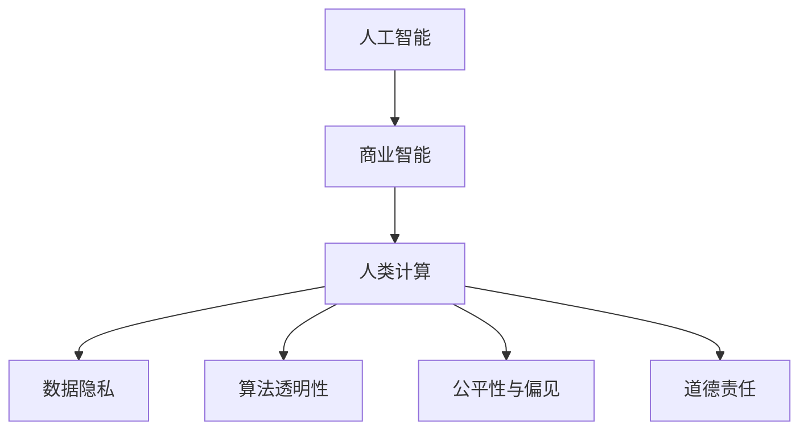

                 

# AI驱动的创新：人类计算在商业中的道德考虑因素与应用场景

## 1. 背景介绍

### 1.1 问题由来
在当今数字化时代，AI技术在商业中的应用越来越广泛，从智能客服、个性化推荐、自动驾驶到风险评估，几乎所有商业领域都受益于AI的深度学习、大数据分析和自然语言处理能力。然而，AI的发展同时也带来了一系列道德与伦理问题，这些问题直接影响到人类社会的公平、正义与隐私。因此，如何在商业应用中兼顾技术创新与伦理道德，成为当前研究的一个重点。

### 1.2 问题核心关键点
本文主要探讨以下关键点：

- **人类计算**：利用AI技术处理海量数据，提升商业决策的效率与准确性。
- **道德与伦理问题**：涉及数据隐私、算法透明、歧视性偏见和人工智能在决策过程中的作用。
- **应用场景**：如智能客服、推荐系统、自动驾驶和风险评估等。
- **技术挑战**：如数据采集与隐私保护、模型透明性与可解释性、公平性与偏见等。
- **未来展望**：如何在AI技术的推动下，实现商业创新与道德责任的平衡。

## 2. 核心概念与联系

### 2.1 核心概念概述

为更好地理解人类计算在商业中的道德考虑因素与应用场景，本节将介绍几个密切相关的核心概念：

- **人工智能(AI)**：涉及机器学习、深度学习、自然语言处理、计算机视觉等技术，能够自主学习、理解、推理和生成数据。
- **商业智能(BI)**：利用数据处理、统计分析和数据可视化技术，辅助商业决策和优化。
- **人类计算**：利用AI技术处理和分析海量数据，提供决策支持。
- **数据隐私**：涉及个人数据的收集、存储和使用，保护用户隐私权益。
- **算法透明性**：要求算法的决策过程公开透明，用户能够理解并信任其工作机制。
- **公平性与偏见**：AI模型需要避免系统性偏见，确保在各种背景下的决策公平。
- **道德责任**：AI开发者和使用者需要承担的道德和法律责任。

这些核心概念之间的逻辑关系可以通过以下Mermaid流程图来展示：



这个流程图展示了一些关键概念及其之间的关系：

1. 人工智能提供基础能力。
2. 商业智能通过AI技术实现数据驱动的决策支持。
3. 人类计算则是将AI处理的数据应用到实际商业场景中。
4. 数据隐私和算法透明性是确保AI应用的合法性和公平性的重要因素。
5. 公平性和偏见是评价AI系统是否合理的关键指标。
6. 道德责任是AI应用的法律和伦理保障。

这些概念共同构成了AI在商业应用中的工作框架，使我们能够全面分析其潜在的道德挑战和应用价值。

## 3. 核心算法原理 & 具体操作步骤

### 3.1 算法原理概述

人类计算的算法原理主要基于机器学习和大数据处理技术，通过AI模型对海量数据进行高效处理和分析，辅助商业决策。核心算法包括：

- 监督学习(Supervised Learning)：利用有标签数据训练模型，预测新数据标签。
- 无监督学习(Unsupervised Learning)：无需标签数据，从数据中发现潜在模式。
- 半监督学习(Semi-supervised Learning)：结合少量标签数据和大量无标签数据，提升模型性能。
- 强化学习(Reinforcement Learning)：通过试错过程优化决策策略。

### 3.2 算法步骤详解

人类计算的核心算法步骤如下：

1. **数据预处理**：清洗、去重、转换数据，准备输入模型。
2. **模型训练**：选择合适的算法和模型，利用数据集进行训练。
3. **模型评估**：通过验证集评估模型性能，调整参数。
4. **模型应用**：将训练好的模型应用于实际业务场景。
5. **反馈优化**：根据业务反馈调整模型和算法，持续改进。

### 3.3 算法优缺点

人类计算的主要优点包括：

- 高效处理海量数据，提升决策速度和准确性。
- 能够发现数据中隐含的模式和关联，提供深度洞察。
- 利用AI技术，自动化和智能化商业流程。

同时，这些算法也存在一定的局限性：

- 对数据质量和数量要求高，需要大量有标签数据。
- 模型复杂度高，难以解释其决策过程。
- 需要较高的计算资源和时间成本。
- 可能存在偏见和歧视，影响决策公平性。

### 3.4 算法应用领域

人类计算广泛应用于以下商业场景：

- **智能客服**：利用NLP和机器学习技术，提供24/7自动客服服务。
- **推荐系统**：基于用户行为和物品特征，推荐个性化商品和服务。
- **风险评估**：通过分析历史数据，预测金融和保险风险。
- **自动驾驶**：利用计算机视觉和深度学习，实现智能驾驶。
- **自然语言处理(NLP)**：处理文本数据，辅助理解与生成。

这些应用场景展示了AI技术在商业中的广泛应用，同时也揭示了其潜在的道德问题。

## 4. 数学模型和公式 & 详细讲解 & 举例说明

### 4.1 数学模型构建

在人类计算中，常用的数学模型包括回归模型、分类模型和聚类模型。这里以线性回归为例，展示其构建和应用。

线性回归的数学模型为：

$$
y = \beta_0 + \beta_1 x_1 + \beta_2 x_2 + ... + \beta_n x_n + \epsilon
$$

其中，$y$ 为因变量，$x_1, x_2, ..., x_n$ 为自变量，$\beta_0, \beta_1, ..., \beta_n$ 为回归系数，$\epsilon$ 为误差项。

### 4.2 公式推导过程

在线性回归中，最小二乘法的目标是使预测值与真实值之间的误差最小，即：

$$
\min_{\beta} \sum_{i=1}^n (y_i - (\beta_0 + \beta_1 x_{i1} + \beta_2 x_{i2} + ... + \beta_n x_{in}))^2
$$

对该目标函数求偏导，得到：

$$
\frac{\partial}{\partial \beta_0} \sum_{i=1}^n (y_i - (\beta_0 + \beta_1 x_{i1} + \beta_2 x_{i2} + ... + \beta_n x_{in}))^2 = -2 \sum_{i=1}^n (y_i - (\beta_0 + \beta_1 x_{i1} + \beta_2 x_{i2} + ... + \beta_n x_{in}))
$$

依此类推，可以得到所有回归系数的估计值。

### 4.3 案例分析与讲解

以一个电商平台为例，利用线性回归模型预测用户购买行为。

设用户特征包括年龄、性别、浏览时长、购物车数量等，因变量为是否购买商品。模型训练后，可以预测新用户是否会购买，辅助电商平台进行个性化推荐和营销策略优化。

## 5. 项目实践：代码实例和详细解释说明

### 5.1 开发环境搭建

在进行人类计算项目开发前，需要准备好开发环境。以下是使用Python进行Scikit-learn开发的环境配置流程：

1. 安装Anaconda：从官网下载并安装Anaconda，用于创建独立的Python环境。

2. 创建并激活虚拟环境：
```bash
conda create -n pytorch-env python=3.8 
conda activate pytorch-env
```

3. 安装Scikit-learn：
```bash
pip install scikit-learn
```

4. 安装各类工具包：
```bash
pip install numpy pandas scikit-learn matplotlib tqdm jupyter notebook ipython
```

完成上述步骤后，即可在`pytorch-env`环境中开始人类计算实践。

### 5.2 源代码详细实现

以下是一个使用Scikit-learn进行线性回归分析的Python代码实现：

```python
from sklearn.linear_model import LinearRegression
from sklearn.model_selection import train_test_split
from sklearn.metrics import mean_squared_error

# 准备数据
X = df[['age', 'gender', 'browsing_time', 'cart_items']]
y = df['purchase']

# 划分训练集和测试集
X_train, X_test, y_train, y_test = train_test_split(X, y, test_size=0.2, random_state=42)

# 创建模型并训练
model = LinearRegression()
model.fit(X_train, y_train)

# 评估模型
y_pred = model.predict(X_test)
mse = mean_squared_error(y_test, y_pred)

print(f"MSE: {mse}")
```

### 5.3 代码解读与分析

让我们再详细解读一下关键代码的实现细节：

**数据预处理**：
- `df`：数据框，包含用户特征和购买行为。
- `X` 和 `y`：特征集和因变量。

**模型训练**：
- `LinearRegression()`：创建线性回归模型。
- `fit()`：训练模型，使用训练集数据。

**模型评估**：
- `predict()`：预测测试集数据。
- `mean_squared_error()`：计算均方误差，评估模型性能。

**训练流程**：
- `train_test_split()`：将数据划分为训练集和测试集。
- 训练模型。
- 评估模型性能。

可以看到，Scikit-learn提供了简单易用的API，使得线性回归模型的开发变得高效便捷。开发者可以更加专注于业务逻辑和模型优化。

当然，在实际应用中，还需要根据具体业务需求进行模型改进，如引入正则化、交叉验证等技术，进一步提高模型精度和鲁棒性。

## 6. 实际应用场景

### 6.1 智能客服系统

利用人类计算技术，智能客服系统可以通过分析用户对话内容，自动判断用户需求，并提供快速响应。系统能够理解自然语言，根据用户问题给出最合适的答案。例如，银行客服系统可以识别用户账户异常，自动进行安全验证和账户恢复。

### 6.2 推荐系统

推荐系统利用人类计算技术，通过分析用户行为和物品特征，推荐个性化商品和服务。例如，电商网站根据用户浏览历史，推荐可能感兴趣的商品，提高用户转化率。

### 6.3 自动驾驶

自动驾驶技术通过人类计算处理传感器数据，实现环境感知和决策规划。系统能够分析实时路况信息，生成最优驾驶路径。例如，智能汽车能够自动避障、绕行，保障行车安全。

### 6.4 风险评估

风险评估系统利用人类计算技术，通过分析历史数据，预测金融和保险风险。例如，保险公司根据用户健康数据，评估保险风险，制定个性化保费策略。

## 7. 工具和资源推荐

### 7.1 学习资源推荐

为了帮助开发者系统掌握人类计算的理论基础和实践技巧，这里推荐一些优质的学习资源：

1. **《机器学习实战》系列博文**：由大模型技术专家撰写，深入浅出地介绍了机器学习原理、算法和应用。

2. **Coursera《机器学习》课程**：由斯坦福大学教授Andrew Ng开设，涵盖机器学习基础和深度学习内容。

3. **《Python机器学习》书籍**：Sebastian Raschka等人所著，全面介绍了使用Python进行机器学习的各种技术。

4. **Kaggle竞赛平台**：全球最大的数据科学竞赛平台，提供丰富的数据集和挑战，提升实践能力。

5. **机器之心**：国内知名的机器学习和技术资讯网站，提供最新研究动态和实战案例。

通过对这些资源的学习实践，相信你一定能够快速掌握人类计算的精髓，并用于解决实际的商业问题。

### 7.2 开发工具推荐

高效的开发离不开优秀的工具支持。以下是几款用于人类计算开发的常用工具：

1. **Scikit-learn**：基于Python的机器学习库，提供丰富的模型和算法实现。
2. **TensorFlow**：由Google主导开发的深度学习框架，生产部署方便，适合大规模工程应用。
3. **PyTorch**：基于Python的深度学习库，灵活动态的计算图，适合快速迭代研究。
4. **Keras**：高层次的深度学习API，易于上手，适合快速原型设计。
5. **Weights & Biases**：模型训练的实验跟踪工具，可以记录和可视化模型训练过程中的各项指标，方便对比和调优。
6. **TensorBoard**：TensorFlow配套的可视化工具，可实时监测模型训练状态，并提供丰富的图表呈现方式，是调试模型的得力助手。

合理利用这些工具，可以显著提升人类计算任务的开发效率，加快创新迭代的步伐。

### 7.3 相关论文推荐

人类计算技术的发展源于学界的持续研究。以下是几篇奠基性的相关论文，推荐阅读：

1. **《神经网络与深度学习》**：Ian Goodfellow等人所著，详细介绍了神经网络和深度学习的原理与应用。

2. **《机器学习》**：Tom Mitchell所著，介绍了机器学习的基本概念和算法。

3. **《模式识别与机器学习》**：Christopher Bishop所著，介绍了模式识别和机器学习的基本理论和算法。

4. **《深度学习》**：Ian Goodfellow等人所著，全面介绍了深度学习的原理与应用。

5. **《强化学习》**：Richard S. Sutton等人所著，介绍了强化学习的基本概念和算法。

这些论文代表了大模型人类计算技术的发展脉络。通过学习这些前沿成果，可以帮助研究者把握学科前进方向，激发更多的创新灵感。

## 8. 总结：未来发展趋势与挑战

### 8.1 总结

本文对人类计算在商业应用中的道德考虑因素进行了全面系统的介绍。首先阐述了人类计算的算法原理和关键步骤，明确了其在商业决策支持中的应用价值。其次，从技术、伦理和社会多个维度，深入探讨了人类计算在商业中可能面临的挑战与风险。最后，通过案例分析和工具推荐，展示了人类计算技术的广泛应用前景。

通过本文的系统梳理，可以看到，人类计算技术在提升商业决策效率和智能化水平的同时，也带来了数据隐私、算法透明性和公平性等道德问题。如何在商业创新中平衡技术进步与伦理责任，是一个需要长期关注和持续探讨的话题。

### 8.2 未来发展趋势

展望未来，人类计算技术将呈现以下几个发展趋势：

1. **自动化和智能化**：随着AI技术的不断进步，人类计算将越来越自动化和智能化，实现更高效和精准的商业决策。
2. **数据驱动与知识集成**：利用大数据分析和知识图谱等技术，实现数据驱动和知识驱动的协同。
3. **实时计算与云服务**：通过云计算平台和实时计算技术，实现高效、灵活的商业应用。
4. **跨领域应用**：人类计算技术将不断扩展到更多领域，如医疗、金融、教育等，形成跨学科的融合应用。
5. **隐私保护与数据安全**：在数据隐私保护和数据安全方面取得突破，保障用户权益。
6. **道德与法律合规**：制定AI道德准则和法律规范，确保人类计算技术的合法合规使用。

这些趋势展示了人类计算技术的广阔前景。通过技术创新和伦理规范的双轮驱动，人类计算将在商业和社会中发挥更大的作用，提升人类社会的整体福祉。

### 8.3 面临的挑战

尽管人类计算技术已经取得了显著成就，但在迈向更加智能化、普适化应用的过程中，它仍面临以下挑战：

1. **数据隐私与安全**：如何在保护用户隐私的同时，充分利用数据进行商业决策，是一个亟待解决的问题。
2. **算法透明性与可解释性**：人类计算模型通常较为复杂，难以解释其决策过程，用户难以理解和信任。
3. **公平性与偏见**：AI模型可能存在系统性偏见，影响决策公平性，需进一步优化和改进。
4. **资源与成本**：大规模数据的处理和存储需要高昂的计算资源和时间成本，如何降低这些成本是一个重要课题。
5. **法律与伦理**：人类计算技术的应用需要遵守相关法律法规，确保道德合规性。

### 8.4 研究展望

未来，人类计算技术的研究将在以下几个方面继续深化：

1. **隐私保护技术**：开发高效的数据隐私保护技术，如差分隐私、联邦学习等，保护用户隐私。
2. **模型解释性**：研究可解释的AI模型，增强模型透明性与可解释性。
3. **公平性算法**：开发公平性算法，消除系统性偏见，提升决策公平性。
4. **资源优化技术**：优化数据处理和模型训练算法，降低计算成本。
5. **道德与法律框架**：制定AI道德准则和法律规范，确保技术应用的合规性。

这些研究方向的探索，必将引领人类计算技术迈向更高的台阶，为商业和社会带来更大的价值。

## 9. 附录：常见问题与解答

**Q1：人类计算在商业中的应用有哪些？**

A: 人类计算在商业中的应用非常广泛，包括但不限于：

- 智能客服：通过自然语言处理技术，自动解答用户咨询。
- 推荐系统：利用机器学习算法，推荐个性化商品和服务。
- 风险评估：通过数据分析，预测金融和保险风险。
- 供应链优化：利用数据挖掘技术，优化供应链管理和库存控制。
- 客户细分：利用聚类算法，识别不同客户群体。

**Q2：人类计算在商业应用中如何保护用户隐私？**

A: 人类计算在商业应用中保护用户隐私的方法包括：

- 数据匿名化：对用户数据进行去标识化处理，保护用户隐私。
- 差分隐私：在数据处理和分析中引入噪声，保护用户隐私。
- 数据访问控制：限制数据访问权限，确保数据安全。
- 用户同意：在数据收集和使用前，获取用户同意，保护用户隐私权益。

**Q3：人类计算在商业应用中如何提高模型透明性？**

A: 提高模型透明性的方法包括：

- 可解释性模型：使用可解释性较强的模型，如决策树、线性回归等。
- 模型可视化：使用可视化工具，展示模型内部结构和工作机制。
- 交互式界面：通过交互式界面，让用户能够直观理解模型输出。
- 公开算法：在合适情况下，公开算法细节，增加透明度。

**Q4：人类计算在商业应用中如何应对偏见问题？**

A: 应对偏见问题的方法包括：

- 公平性算法：开发公平性算法，消除系统性偏见。
- 数据平衡：确保训练数据平衡，避免数据偏见。
- 多样性数据：收集多样性数据，减少模型偏见。
- 模型评估：定期评估模型性能，检测和纠正偏见。

**Q5：人类计算在商业应用中如何平衡创新与伦理？**

A: 平衡创新与伦理的方法包括：

- 制定道德准则：制定AI道德准则，引导开发者和用户行为。
- 法律合规：确保技术应用符合相关法律法规，保护用户权益。
- 伦理审核：在技术开发和应用中引入伦理审核机制，防止伦理风险。
- 用户参与：鼓励用户参与技术设计，增强用户信任。

---

作者：禅与计算机程序设计艺术 / Zen and the Art of Computer Programming

