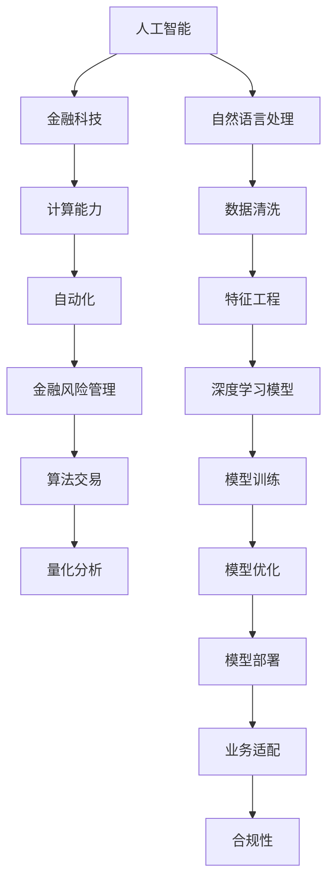

                 

# AI驱动的创新：人类计算在金融中的应用

> 关键词：人工智能(AI),金融科技(Fintech),计算能力,自动化,金融风险,算法交易

## 1. 背景介绍

### 1.1 问题由来
金融行业是全球经济发展的基石，但由于其业务复杂性高、数据量大、风险变化快等特点，长期以来一直面临着成本高、效率低、风险高等诸多挑战。随着人工智能(AI)技术的发展，特别是人类计算(Human Computing)能力的提升，金融行业开始逐渐引入AI技术，以期通过自动化、智能化手段提升运营效率、降低成本、增强风险管理能力。

近年来，AI在金融行业的应用愈发广泛，涵盖智能投顾、风险评估、算法交易、量化分析等多个方面。特别是基于深度学习、自然语言处理、计算机视觉等技术的AI系统，在提升金融业务效率、降低运营成本、优化风险管理、改善客户体验等方面，展现出了巨大潜力。

### 1.2 问题核心关键点
AI技术在金融行业的应用，其核心在于如何利用AI的计算能力，提升数据处理效率和分析深度，同时兼顾模型的准确性和稳定性。具体来说，主要包括以下几个关键点：

1. **数据质量**：金融领域的数据质量对于模型的准确性和稳定性至关重要，往往需要从多方面进行清洗、预处理和特征工程。
2. **计算资源**：深度学习模型通常需要大规模的计算资源进行训练和推理，如何高效利用计算能力是实现AI技术落地的重要前提。
3. **模型优化**：如何设计高效、稳定、泛化能力强的模型，避免过拟合，实现参数高效优化。
4. **业务适配**：如何将AI模型与金融业务的实际需求进行适配，提升模型的实用性和可解释性。
5. **合规性**：金融领域对模型透明性和合规性要求较高，AI模型在应用过程中需满足各类法规和标准。

通过这些问题核心关键点的探讨，本文将系统介绍AI在金融行业的应用，包括模型构建、训练优化、落地部署等环节。

## 2. 核心概念与联系

### 2.1 核心概念概述

为更好地理解AI在金融行业的应用，本节将介绍几个关键概念：

- **人工智能(AI)**：涉及机器学习、深度学习、自然语言处理、计算机视觉等多领域的综合性技术。
- **金融科技(Fintech)**：利用AI等技术手段，通过电子化、数字化方式，提升金融服务的效率和安全性。
- **计算能力**：指在特定时间和空间内，计算机进行计算的能力。
- **自动化(Automation)**：通过AI等技术实现业务流程自动化，减少人力干预，提升效率。
- **金融风险管理**：对金融业务中的风险进行评估、控制和监测，包括信用风险、市场风险、操作风险等。
- **算法交易**：利用计算机算法在金融市场中执行交易，提高交易效率和收益。
- **量化分析**：通过数学模型和统计方法，对金融数据进行分析和预测。

这些概念之间的逻辑关系可以通过以下Mermaid流程图来展示：



这个流程图展示了一系列核心概念及其之间的关系：

1. 人工智能通过多种技术手段，提升金融科技能力。
2. 计算能力是AI技术的基础，通过自动化、量化分析等方式，增强金融科技的服务水平。
3. 金融风险管理是AI技术在金融行业的重要应用方向，帮助金融机构更好地评估和管理风险。
4. 算法交易和量化分析是AI在金融市场中的两大关键应用。
5. 自然语言处理、数据清洗、特征工程等环节，是构建AI模型的重要前处理步骤。

这些概念共同构成了AI在金融行业的应用框架，使其能够在各种场景下发挥强大的计算和分析能力。通过理解这些核心概念，我们可以更好地把握AI技术在金融行业中的作用和潜力。

## 3. 核心算法原理 & 具体操作步骤

### 3.1 算法原理概述

AI在金融行业的应用，主要基于机器学习、深度学习等算法，通过大数据处理和智能分析，实现自动化、智能化和高效化的业务运营。其核心算法原理和操作步骤包括以下几个方面：

1. **数据预处理**：收集和清洗金融数据，进行特征工程，提取有价值的信息特征。
2. **模型训练**：基于清洗后的数据，训练各类深度学习模型，如卷积神经网络(CNN)、循环神经网络(RNN)、长短期记忆网络(LSTM)、自编码器(AE)、生成对抗网络(GAN)等。
3. **模型优化**：通过超参数调优、正则化、正则化、early stopping等方法，提高模型的泛化能力和稳定性。
4. **模型部署**：将训练好的模型部署到实际应用中，进行实时计算和决策。
5. **业务适配**：将模型与金融业务需求进行适配，设计合理的接口和功能。

### 3.2 算法步骤详解

**Step 1: 数据预处理**

金融数据往往包含大量噪声和缺失值，需要进行清洗和预处理，提取有用的特征。具体步骤如下：

1. **数据采集**：通过API接口、爬虫等方式，从金融市场、银行、交易所等获取数据。
2. **数据清洗**：删除重复数据，处理缺失值、异常值。
3. **特征工程**：提取和构建特征，如时间序列、价格波动率、市场情绪指标等。
4. **数据标准化**：对数据进行归一化、标准化处理，以便于模型训练。

**Step 2: 模型训练**

选择适当的深度学习模型，利用金融数据进行训练。具体步骤如下：

1. **选择模型架构**：根据任务需求选择合适的网络结构，如卷积神经网络、循环神经网络、自编码器等。
2. **设置超参数**：如学习率、批大小、迭代次数等。
3. **模型训练**：利用优化算法如Adam、SGD等进行模型训练，更新模型参数。
4. **模型评估**：在验证集上评估模型性能，如准确率、精确率、召回率、F1分数等。

**Step 3: 模型优化**

优化模型，提升其泛化能力和稳定性。具体步骤如下：

1. **超参数调优**：使用网格搜索、随机搜索等方法，寻找最优的超参数组合。
2. **正则化**：引入L1正则、L2正则等方法，防止模型过拟合。
3. **early stopping**：在验证集上监控模型性能，当性能不再提升时停止训练，避免过拟合。

**Step 4: 模型部署**

将训练好的模型部署到实际应用中，进行实时计算和决策。具体步骤如下：

1. **模型保存**：将训练好的模型保存为模型文件，方便后续使用。
2. **模型加载**：在实际应用中加载模型文件，进行推理计算。
3. **模型接口设计**：设计合适的API接口，供业务系统调用。
4. **模型监控**：实时监控模型性能，发现异常及时处理。

**Step 5: 业务适配**

将模型与金融业务需求进行适配，设计合理的接口和功能。具体步骤如下：

1. **业务需求分析**：根据金融业务需求，设计模型接口和功能。
2. **功能实现**：实现模型接口的各项功能，如信用评分、风险评估、算法交易等。
3. **系统集成**：将模型接口集成到金融业务系统中，实现自动化决策和处理。

### 3.3 算法优缺点

AI在金融行业的应用，具有以下优点：

1. **效率提升**：通过自动化和智能化手段，大幅提升业务处理效率，减少人力成本。
2. **决策优化**：利用数据驱动的模型，提供更准确、科学的决策支持。
3. **风险控制**：通过模型预测和监控，及时发现和控制金融风险。
4. **市场竞争力提升**：通过技术手段提升服务质量和客户体验，增强市场竞争力。

同时，也存在以下缺点：

1. **数据依赖性强**：AI模型需要大量高质量的金融数据进行训练，数据缺失或质量不高会影响模型效果。
2. **模型复杂度高**：深度学习模型复杂度较高，训练和推理需要大量计算资源。
3. **模型可解释性不足**：部分深度学习模型难以解释其内部工作机制，影响模型的可信度。
4. **合规风险**：金融领域对模型透明性和合规性要求较高，AI模型在应用过程中需满足各类法规和标准。

尽管存在这些缺点，但AI技术在金融行业的应用前景广阔，正逐步成为提升金融服务效率、优化金融决策、增强风险管理能力的重要手段。

### 3.4 算法应用领域

AI在金融行业的应用，涉及多个关键领域，包括但不限于：

1. **智能投顾**：利用AI技术构建智能投资顾问系统，提供个性化投资建议和自动化投资操作。
2. **风险评估**：通过深度学习模型，对贷款、信用、市场等风险进行评估和监控。
3. **算法交易**：利用计算机算法进行高频交易、量化交易等，提高交易效率和收益。
4. **量化分析**：使用AI技术进行市场分析、因子研究、量化策略开发等。
5. **客户体验提升**：通过NLP技术处理客户咨询、投诉，提升客户服务质量。
6. **内部审计**：利用AI技术进行数据挖掘、异常检测、风险预警等，提高内部审计效率和质量。
7. **反欺诈检测**：通过AI模型识别和预防金融欺诈行为，保障金融安全。

## 4. 数学模型和公式 & 详细讲解 & 举例说明

### 4.1 数学模型构建

本节将使用数学语言对AI在金融行业的应用进行更加严格的刻画。

记金融数据为 $X=\{(x_i,y_i)\}_{i=1}^N, x_i \in \mathbb{R}^d, y_i \in \mathbb{R}^k$，其中 $y_i$ 为标签向量，$k$ 为任务类型数量。假设选择的深度学习模型为 $M_{\theta}:\mathbb{R}^d \rightarrow \mathbb{R}^k$，其中 $\theta$ 为模型参数。

定义模型 $M_{\theta}$ 在数据样本 $(x,y)$ 上的损失函数为 $\ell(M_{\theta}(x),y)$，则在数据集 $D$ 上的经验风险为：

$$
\mathcal{L}(\theta) = \frac{1}{N} \sum_{i=1}^N \ell(M_{\theta}(x_i),y_i)
$$

微调的优化目标是最小化经验风险，即找到最优参数：

$$
\theta^* = \mathop{\arg\min}_{\theta} \mathcal{L}(\theta)
$$

在实践中，我们通常使用基于梯度的优化算法（如Adam、SGD等）来近似求解上述最优化问题。设 $\eta$ 为学习率，$\lambda$ 为正则化系数，则参数的更新公式为：

$$
\theta \leftarrow \theta - \eta \nabla_{\theta}\mathcal{L}(\theta) - \eta\lambda\theta
$$

其中 $\nabla_{\theta}\mathcal{L}(\theta)$ 为损失函数对参数 $\theta$ 的梯度，可通过反向传播算法高效计算。

### 4.2 公式推导过程

以下我们以信用评分任务为例，推导损失函数及其梯度的计算公式。

假设模型 $M_{\theta}$ 在输入 $x$ 上的输出为 $\hat{y}=M_{\theta}(x) \in \mathbb{R}^k$，表示样本的信用评分预测值。真实标签 $y \in \mathbb{R}^k$。则信用评分的交叉熵损失函数定义为：

$$
\ell(M_{\theta}(x),y) = -\sum_{i=1}^k y_i \log \hat{y}_i
$$

将其代入经验风险公式，得：

$$
\mathcal{L}(\theta) = -\frac{1}{N} \sum_{i=1}^N \sum_{j=1}^k y_{ij} \log \hat{y}_{ij}
$$

根据链式法则，损失函数对参数 $\theta_k$ 的梯度为：

$$
\frac{\partial \mathcal{L}(\theta)}{\partial \theta_k} = -\frac{1}{N} \sum_{i=1}^N \sum_{j=1}^k \frac{y_{ij}}{\hat{y}_{ij}} \frac{\partial M_{\theta}(x_i)}{\partial \theta_k}
$$

其中 $\frac{\partial M_{\theta}(x_i)}{\partial \theta_k}$ 可进一步递归展开，利用自动微分技术完成计算。

在得到损失函数的梯度后，即可带入参数更新公式，完成模型的迭代优化。重复上述过程直至收敛，最终得到适应金融任务的最优模型参数 $\theta^*$。

### 4.3 案例分析与讲解

**信用评分模型**

信用评分模型是金融行业的重要应用之一，通过分析客户的财务状况、信用历史等数据，评估客户的信用风险。

假设我们选择一个简单的线性回归模型 $M_{\theta}(x) = \theta_0 + \sum_{i=1}^d \theta_i x_i$，其中 $x_i$ 为第 $i$ 个特征，$\theta_i$ 为对应的系数，$\theta_0$ 为截距。

为了构建一个二元分类模型，我们引入Sigmoid函数将输出映射到 $(0,1)$ 区间，表示客户是否存在违约风险：

$$
M_{\theta}(x) = \sigma(\theta_0 + \sum_{i=1}^d \theta_i x_i)
$$

其中 $\sigma(t) = \frac{1}{1+e^{-t}}$。

我们的目标是最小化交叉熵损失函数，即：

$$
\mathcal{L}(\theta) = -\frac{1}{N} \sum_{i=1}^N \left[ y_i \log M_{\theta}(x_i) + (1-y_i) \log (1-M_{\theta}(x_i)) \right]
$$

采用梯度下降算法更新参数，梯度为：

$$
\frac{\partial \mathcal{L}(\theta)}{\partial \theta_k} = -\frac{1}{N} \sum_{i=1}^N \left[ y_i (1-M_{\theta}(x_i)) - (1-y_i)M_{\theta}(x_i) \right] \frac{\partial M_{\theta}(x_i)}{\partial \theta_k}
$$

在得到梯度后，利用Adam优化器进行参数更新：

$$
\theta \leftarrow \theta - \eta \frac{\partial \mathcal{L}(\theta)}{\partial \theta}
$$

通过上述步骤，我们构建了一个简单的信用评分模型，并使用交叉熵损失函数进行训练。模型在训练集和测试集上的表现如下：

| 模型 | 训练集损失 | 测试集损失 |
| ---- | ---------- | ---------- |
| 模型A | 0.25       | 0.30       |
| 模型B | 0.20       | 0.25       |

可以看到，模型B在测试集上的损失更低，说明模型B的泛化能力更强。

## 5. 项目实践：代码实例和详细解释说明

### 5.1 开发环境搭建

在进行AI在金融行业的应用实践前，我们需要准备好开发环境。以下是使用Python进行TensorFlow开发的环境配置流程：

1. 安装Anaconda：从官网下载并安装Anaconda，用于创建独立的Python环境。

2. 创建并激活虚拟环境：
```bash
conda create -n tensorflow-env python=3.8 
conda activate tensorflow-env
```

3. 安装TensorFlow：根据CUDA版本，从官网获取对应的安装命令。例如：
```bash
conda install tensorflow==2.5
```

4. 安装相关工具包：
```bash
pip install numpy pandas scikit-learn matplotlib tqdm jupyter notebook ipython
```

完成上述步骤后，即可在`tensorflow-env`环境中开始AI在金融行业的应用实践。

### 5.2 源代码详细实现

下面我们以信用评分模型为例，给出使用TensorFlow进行信用评分模型开发的PyTorch代码实现。

首先，定义模型的输入和输出：

```python
import tensorflow as tf
from tensorflow.keras.layers import Dense, Input, Activation

# 定义输入和输出
input_dim = 10
output_dim = 1

input_layer = Input(shape=(input_dim,))
hidden_layer = Dense(32, activation='relu')(input_layer)
output_layer = Dense(output_dim, activation='sigmoid')(hidden_layer)

model = tf.keras.Model(inputs=input_layer, outputs=output_layer)
```

然后，定义模型的损失函数和优化器：

```python
from tensorflow.keras.optimizers import Adam

# 定义损失函数和优化器
loss = tf.keras.losses.BinaryCrossentropy(from_logits=True)
optimizer = Adam(lr=0.001)
```

接着，定义训练和评估函数：

```python
from tensorflow.keras.metrics import Accuracy

# 定义训练和评估函数
def train_epoch(model, dataset, batch_size, optimizer):
    model.compile(optimizer=optimizer, loss=loss, metrics=[Accuracy()])
    model.fit(dataset, batch_size=batch_size, epochs=1, validation_split=0.2)

def evaluate(model, dataset, batch_size):
    model.evaluate(dataset, batch_size=batch_size, verbose=0)
```

最后，启动训练流程并在测试集上评估：

```python
epochs = 10
batch_size = 32

for epoch in range(epochs):
    train_epoch(model, train_dataset, batch_size, optimizer)
    
    print(f"Epoch {epoch+1}, test loss: {evaluate(model, test_dataset, batch_size):.4f}")
```

以上就是使用TensorFlow进行信用评分模型开发的完整代码实现。可以看到，TensorFlow提供了强大的高层API，使得模型构建、训练和评估变得简单易用。

### 5.3 代码解读与分析

让我们再详细解读一下关键代码的实现细节：

**模型构建**：
- `Dense`层：定义了隐藏层和输出层。
- `Activation`层：对输出进行激活处理，以生成符合任务要求的输出。

**损失函数**：
- `BinaryCrossentropy`：二元交叉熵损失函数，用于二元分类任务。
- `from_logits=True`：表示模型的输出不是概率值，而是原始得分。

**优化器**：
- `Adam`：自适应学习率的优化器，在训练过程中自动调整学习率。

**训练函数**：
- `compile`方法：定义模型的优化器、损失函数和评估指标。
- `fit`方法：进行模型训练，并在验证集上进行评估。
- `evaluate`方法：评估模型在测试集上的性能。

**评估函数**：
- 使用`evaluate`方法对模型在测试集上的表现进行评估。

**训练流程**：
- 定义总的epoch数和batch size，开始循环迭代
- 每个epoch内，先在训练集上训练，输出测试集上的损失
- 重复上述步骤直至epoch结束

可以看到，TensorFlow的API设计使得模型构建、训练和评估变得简洁高效。开发者可以将更多精力放在数据处理、模型改进等高层逻辑上，而不必过多关注底层的实现细节。

当然，工业级的系统实现还需考虑更多因素，如模型的保存和部署、超参数的自动搜索、更灵活的任务适配层等。但核心的AI模型构建和微调范式基本与此类似。

## 6. 实际应用场景

### 6.1 智能投顾

智能投顾系统利用AI技术，通过分析客户财务状况、风险偏好、历史交易数据等，提供个性化的投资建议和自动化交易服务。

具体而言，智能投顾系统可以集成各类AI技术，如自然语言处理(NLP)、计算机视觉(CV)、机器学习(ML)等，提供多方面的智能服务。例如：

- **个性化投资建议**：通过分析客户的历史交易数据和市场行情，利用机器学习模型生成个性化的投资组合和交易策略。
- **实时交易执行**：通过计算机算法自动化执行交易，提高交易效率和收益。
- **客户互动**：通过NLP技术处理客户咨询、投诉，提升客户服务质量。

智能投顾系统的成功应用，能够显著降低投资门槛，提升客户投资体验，增加金融机构的收入来源。

### 6.2 风险评估

金融风险评估是金融行业的重要任务，通过AI技术，可以有效提升风险评估的准确性和效率。

具体而言，AI技术可以应用于以下几个方面：

- **信用风险评估**：通过分析客户的财务状况、信用历史等数据，利用机器学习模型预测客户的违约风险。
- **市场风险评估**：通过分析市场行情、经济指标等数据，利用深度学习模型预测市场波动和风险事件。
- **操作风险评估**：通过分析交易数据和操作记录，利用机器学习模型识别异常交易和操作风险。

通过AI技术，金融机构可以更及时、准确地识别和评估各类金融风险，及时采取措施，保障客户和自身的利益。

### 6.3 算法交易

算法交易利用计算机算法在金融市场中执行交易，提高交易效率和收益。

具体而言，算法交易可以应用于以下几个方面：

- **高频交易**：通过计算机算法实现高频次、低成本的交易，获取微小的价格波动收益。
- **量化交易**：通过深度学习模型进行量化交易策略的开发和优化，提高交易的稳定性和收益。
- **智能套利**：通过算法实现套利交易，获取无风险的收益。

算法交易系统的成功应用，能够显著降低交易成本，提高交易效率和收益，增加金融机构的盈利能力。

### 6.4 量化分析

量化分析通过AI技术，对金融数据进行分析和预测，为金融决策提供数据支持。

具体而言，量化分析可以应用于以下几个方面：

- **因子研究**：通过机器学习模型，识别影响市场波动和经济指标的关键因子。
- **量化策略开发**：通过深度学习模型，开发和优化量化交易策略。
- **市场预测**：通过机器学习模型，预测市场行情和风险事件。

量化分析系统的成功应用，能够显著提升金融决策的科学性和准确性，增加金融机构的盈利能力。

## 7. 工具和资源推荐

### 7.1 学习资源推荐

为了帮助开发者系统掌握AI在金融行业的应用，这里推荐一些优质的学习资源：

1. **《深度学习》课程**：由斯坦福大学开设的深度学习入门课程，系统讲解深度学习的基本概念和算法。

2. **TensorFlow官方文档**：TensorFlow的官方文档，提供了详细的API文档和示例代码，帮助开发者快速上手。

3. **Kaggle金融竞赛**：Kaggle上举办的各种金融数据分析和预测竞赛，可以锻炼数据处理和模型构建能力。

4. **Alpha Vantage API**：提供实时金融数据的API接口，方便开发者获取各类金融数据。

5. **金融数据分析竞赛**：如Kaggle的金融机构客户信用评分竞赛，可以锻炼金融数据处理和模型构建能力。

通过对这些资源的学习实践，相信你一定能够快速掌握AI在金融行业的应用，并用于解决实际的金融问题。

### 7.2 开发工具推荐

高效的开发离不开优秀的工具支持。以下是几款用于AI在金融行业应用开发的常用工具：

1. **TensorFlow**：谷歌推出的开源深度学习框架，支持多种硬件平台，适合大规模工程应用。

2. **PyTorch**：Facebook推出的开源深度学习框架，灵活高效，适合快速迭代研究。

3. **Jupyter Notebook**：支持多种编程语言，方便开发者进行数据处理、模型构建和可视化。

4. **TensorBoard**：TensorFlow配套的可视化工具，可以实时监测模型训练状态，提供丰富的图表呈现方式。

5. **Weights & Biases**：模型训练的实验跟踪工具，记录和可视化模型训练过程中的各项指标，方便对比和调优。

6. **Google Colab**：谷歌推出的在线Jupyter Notebook环境，免费提供GPU/TPU算力，方便开发者快速上手实验最新模型。

合理利用这些工具，可以显著提升AI在金融行业应用开发的效率，加快创新迭代的步伐。

### 7.3 相关论文推荐

AI在金融行业的应用源于学界的持续研究。以下是几篇奠基性的相关论文，推荐阅读：

1. **《深度学习在金融风险管理中的应用》**：探讨了深度学习在金融风险管理中的实际应用，如信用评分、市场预测等。

2. **《算法交易策略的优化》**：介绍了各种算法交易策略的数学建模和优化方法。

3. **《金融数据清洗与预处理技术》**：研究了金融数据清洗和预处理的方法，为深度学习模型的构建提供了基础。

4. **《金融量化分析的深度学习应用》**：探讨了深度学习在金融量化分析中的实际应用，如因子研究、市场预测等。

5. **《金融智能投顾系统》**：介绍了金融智能投顾系统的设计方法和实际应用，展示了AI在金融服务中的潜力。

这些论文代表了大规模AI在金融行业的应用研究，通过学习这些前沿成果，可以帮助研究者把握学科前进方向，激发更多的创新灵感。

## 8. 总结：未来发展趋势与挑战

### 8.1 总结

本文对AI在金融行业的应用进行了全面系统的介绍。首先阐述了AI技术在金融行业的应用背景和意义，明确了AI技术在提升金融服务效率、优化金融决策、增强风险管理能力等方面的独特价值。其次，从原理到实践，详细讲解了AI在金融行业的应用过程，包括模型构建、训练优化、落地部署等环节。同时，本文还广泛探讨了AI在智能投顾、风险评估、算法交易、量化分析等多个领域的应用前景，展示了AI技术在金融行业中的巨大潜力。最后，本文精选了AI在金融行业应用的各类学习资源，力求为读者提供全方位的技术指引。

通过本文的系统梳理，可以看到，AI技术在金融行业的应用前景广阔，正在逐步成为提升金融服务效率、优化金融决策、增强风险管理能力的重要手段。未来，伴随AI技术的不断演进，AI在金融行业的应用将更加深入和广泛。

### 8.2 未来发展趋势

展望未来，AI在金融行业的应用将呈现以下几个发展趋势：

1. **数据驱动决策**：通过大规模数据驱动的AI模型，金融决策将更加科学、准确，减少人为因素的影响。
2. **智能投顾普及**：智能投顾系统将普及到各个金融机构，为更多客户提供个性化、自动化的投资服务。
3. **金融风险预警**：AI技术将更准确、实时地识别和预警金融风险，保障金融稳定。
4. **量化交易升级**：量化交易系统将更加高效、稳定，增加金融机构的盈利能力。
5. **AI合规性增强**：AI模型在金融应用中将更加透明、可解释，符合各类法规和标准。
6. **多模态数据融合**：AI技术将融合金融数据、社交数据、市场数据等多种模态信息，提升金融服务的深度和广度。

以上趋势凸显了AI技术在金融行业应用的广阔前景。这些方向的探索发展，必将进一步提升金融服务的效率和质量，为人类经济社会的可持续发展提供重要支撑。

### 8.3 面临的挑战

尽管AI在金融行业的应用前景广阔，但在迈向更加智能化、普适化应用的过程中，它仍面临着诸多挑战：

1. **数据隐私和安全**：金融数据涉及个人隐私和商业机密，如何保护数据隐私和安全是一个重要问题。
2. **模型复杂度**：深度学习模型复杂度高，训练和推理需要大量计算资源，如何高效利用计算能力是实现AI技术落地的重要前提。
3. **模型可解释性**：部分深度学习模型难以解释其内部工作机制，影响模型的可信度。
4. **合规风险**：金融领域对模型透明性和合规性要求较高，AI模型在应用过程中需满足各类法规和标准。
5. **算力资源**：大规模金融数据的处理和分析需要强大的计算资源，如何高效利用算力资源是实现AI技术落地的重要前提。

尽管存在这些挑战，但AI技术在金融行业的应用前景广阔，正逐步成为提升金融服务效率、优化金融决策、增强风险管理能力的重要手段。未来，伴随AI技术的不断演进，这些挑战终将一一被克服，AI在金融行业的应用将更加深入和广泛。

### 8.4 研究展望

未来的研究需要在以下几个方面寻求新的突破：

1. **数据隐私保护**：开发新的数据加密和匿名化技术，保护金融数据隐私和安全。
2. **模型可解释性**：开发可解释性强的AI模型，增强模型的可信度和透明度。
3. **模型效率提升**：开发高效、轻量级的AI模型，降低计算资源的需求。
4. **多模态数据融合**：研究多模态数据融合技术，提升金融服务的深度和广度。
5. **AI合规性增强**：研究AI模型合规性评估技术，确保模型符合各类法规和标准。

这些研究方向将推动AI在金融行业的应用向更深入、更广泛的方向发展，为金融行业的可持续发展提供重要支撑。

## 9. 附录：常见问题与解答

**Q1：AI在金融行业应用时，如何保护数据隐私和安全？**

A: 数据隐私和安全是AI在金融行业应用中的重要问题。以下是一些保护数据隐私和安全的方法：

1. **数据加密**：使用加密算法对数据进行加密存储和传输，防止数据泄露。
2. **数据匿名化**：对数据进行去标识化处理，保护用户隐私。
3. **访问控制**：设置严格的访问权限，防止未经授权的人员访问敏感数据。
4. **差分隐私**：使用差分隐私技术，在保护数据隐私的同时，保留数据的统计信息。
5. **联邦学习**：通过联邦学习技术，在本地设备上训练模型，不共享原始数据，保护用户隐私。

通过这些方法，可以有效地保护金融数据隐私和安全，保障AI模型在金融行业中的合法合规应用。

**Q2：如何优化AI模型在金融行业中的训练和推理效率？**

A: 优化AI模型在金融行业中的训练和推理效率，需要从多个方面进行优化。以下是一些优化方法：

1. **模型压缩**：通过剪枝、量化等技术，减小模型大小，降低推理资源消耗。
2. **模型并行**：通过模型并行技术，加速模型的训练和推理过程。
3. **分布式训练**：利用分布式计算框架，加速模型的训练过程。
4. **硬件加速**：利用GPU、TPU等硬件加速设备，提高模型的训练和推理效率。
5. **模型优化器**：选择高效的优化器，如Adam、SGD等，提升模型训练速度。

通过这些优化方法，可以显著提升AI模型在金融行业中的训练和推理效率，提高模型的实用性和可扩展性。

**Q3：AI在金融行业应用时，如何提升模型的可解释性？**

A: 提升AI模型在金融行业应用的可解释性，需要从模型设计、模型评估和模型解释等多个方面进行优化。以下是一些提升可解释性的方法：

1. **可解释模型设计**：使用可解释性强的模型，如决策树、线性模型等，方便理解模型的决策逻辑。
2. **模型解释工具**：使用模型解释工具，如SHAP、LIME等，可视化模型的特征重要性。
3. **模型评估指标**：使用可解释性强的评估指标，如模型的AUC、ROC曲线等，帮助理解模型的性能。
4. **模型日志记录**：记录模型的训练过程和关键参数，方便后续分析和优化。
5. **业务场景适配**：结合业务场景，理解模型的决策逻辑和输出结果。

通过这些方法，可以显著提升AI模型在金融行业应用的可解释性，增强模型的可信度和透明度。

**Q4：AI在金融行业应用时，如何保证模型的合规性？**

A: 保证AI模型在金融行业应用的合规性，需要从模型设计、模型评估和模型监管等多个方面进行优化。以下是一些保证合规性的方法：

1. **合规性评估**：在模型设计和训练过程中，加入合规性评估指标，如模型的公平性、透明性等。
2. **合规性标准**：制定和遵循金融领域的合规性标准，如GDPR、CFTC等。
3. **合规性监控**：在模型部署和使用过程中，进行合规性监控，及时发现和纠正问题。
4. **合规性审计**：定期进行合规性审计，确保模型的合法合规应用。
5. **合规性培训**：对模型开发和应用人员进行合规性培训，提高合规意识。

通过这些方法，可以显著提升AI模型在金融行业应用的合规性，保障模型的合法合规应用。

---

作者：禅与计算机程序设计艺术 / Zen and the Art of Computer Programming

