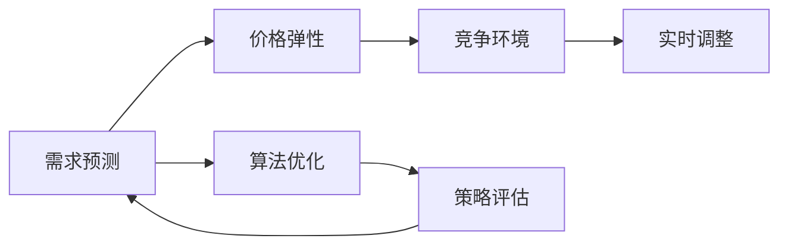

                 

# AI驱动的动态定价策略在电商中的实施

> 关键词：人工智能,动态定价,电商平台,机器学习,算法优化,需求预测,价格弹性

## 1. 背景介绍

### 1.1 问题由来

在当今竞争激烈的电商行业中，价格策略是提升竞争力和实现营收增长的关键因素。传统的静态定价策略已无法满足动态市场环境的要求，难以应对竞争对手的降价、促销活动和季节性需求变化。因此，电商企业迫切需要一种能够实时响应市场变化，自动调整产品价格的智能策略。

人工智能（AI）技术的迅猛发展为动态定价策略的实施提供了可能。AI算法可以分析大量历史数据，预测市场需求和价格弹性，从而实现更精细、更灵活的定价方案。

### 1.2 问题核心关键点

动态定价策略的核心在于如何利用AI技术，根据市场反馈和用户行为实时调整产品价格，以最大化企业收益。该策略的主要难点包括：

- 需求预测：准确预测市场需求和价格弹性，是制定动态定价策略的前提。
- 算法优化：优化算法需要考虑多维度因素，如竞争环境、用户行为、库存状态等，以制定合理的定价策略。
- 实时调整：在实时市场环境中，价格调整需迅速响应，以保证策略的有效性。
- 策略评估：动态定价策略的效果评估需要综合考虑多方面指标，如营收增长、市场份额、客户满意度等。

## 2. 核心概念与联系

### 2.1 核心概念概述

为了深入理解AI驱动的动态定价策略，我们首先需要明确几个核心概念及其关系：

- **需求预测**：通过分析历史数据和市场趋势，预测未来需求量和价格弹性。
- **价格弹性**：衡量产品价格变动对需求量的影响程度，是动态定价策略的重要依据。
- **竞争环境**：分析竞争对手的定价策略、促销活动和市场份额，以优化自身的定价策略。
- **实时调整**：利用实时市场数据和反馈，自动调整价格，实现策略的灵活性。
- **算法优化**：采用机器学习算法，优化定价策略，提升模型的准确性和效率。
- **策略评估**：综合评估定价策略的效果，调整和优化策略，以持续改进。

这些概念之间的逻辑关系可以通过以下Mermaid流程图来展示：



这个流程图展示了需求预测、价格弹性、竞争环境、实时调整、算法优化和策略评估之间的联系：

1. 需求预测和价格弹性是定价策略的基础。
2. 竞争环境对定价策略的制定有重要影响。
3. 实时调整使策略能够迅速应对市场变化。
4. 算法优化提升策略的准确性和效率。
5. 策略评估提供反馈，指导策略的改进。

## 3. 核心算法原理 & 具体操作步骤
### 3.1 算法原理概述

AI驱动的动态定价策略主要基于机器学习和数据挖掘技术，通过分析历史销售数据、市场趋势和竞争环境，预测市场需求和价格弹性，并据此实时调整产品价格。

该策略的算法原理可以概括为以下几步：

1. 数据收集：收集历史销售数据、市场趋势、竞争对手的定价策略和促销活动等信息。
2. 需求预测：利用机器学习模型预测未来的需求量和价格弹性。
3. 竞争分析：分析竞争对手的定价策略和市场份额，以优化自身的定价策略。
4. 实时调整：根据市场反馈和用户行为，实时调整产品价格，以实现最优定价。
5. 策略评估：综合评估策略效果，调整和优化定价策略。

### 3.2 算法步骤详解

以下将详细介绍每个步骤的详细步骤：

**Step 1: 数据收集**
- 收集电商平台的销售数据，包括交易量、价格、时间、季节性因素等。
- 获取市场趋势数据，如经济指标、季节性消费等。
- 分析竞争对手的定价策略和促销活动，收集其产品定价、折扣信息等。

**Step 2: 需求预测**
- 使用时间序列分析、回归分析等统计方法，建立需求预测模型。
- 采用机器学习算法，如ARIMA、LSTM、神经网络等，进行需求预测。
- 考虑季节性因素，使用分解模型（如STL）对需求进行分解，识别出周期性变化。

**Step 3: 竞争分析**
- 使用聚类分析、分类分析等方法，识别竞争对手的定价策略和市场份额。
- 分析竞争对手的促销活动，评估其对自身定价策略的影响。
- 通过竞争分析，优化自身的定价策略，以应对市场竞争。

**Step 4: 实时调整**
- 实时监测市场数据，如销售量、价格、库存等，以评估当前定价策略的效果。
- 根据市场反馈，自动调整产品价格，确保策略的及时性和灵活性。
- 使用强化学习算法，根据市场反馈不断优化定价策略。

**Step 5: 策略评估**
- 综合评估定价策略的效果，如营收增长、市场份额、客户满意度等。
- 利用A/B测试、因果推断等方法，评估策略的实际效果。
- 根据评估结果，调整和优化定价策略，确保策略的有效性。

### 3.3 算法优缺点

动态定价策略具有以下优点：

1. **提升收益**：通过实时调整价格，最大化企业收益。
2. **灵活性**：能够迅速响应市场变化，保持竞争力。
3. **自动化**：利用AI技术自动调整价格，减少人工干预。

同时，该策略也存在一些缺点：

1. **复杂性**：需要综合考虑多维度因素，算法复杂。
2. **数据需求**：对历史数据和实时市场数据的需求较高。
3. **市场响应**：过度频繁的价格调整可能影响市场稳定。
4. **算法鲁棒性**：算法需要经过严格的测试和验证，以确保鲁棒性。

尽管如此，动态定价策略在电商中的应用已展现出显著的优势，成为许多电商企业提升竞争力、实现营收增长的重要手段。

### 3.4 算法应用领域

动态定价策略在电商领域有着广泛的应用场景，例如：

- **产品定价**：根据市场需求和价格弹性，实时调整产品价格。
- **促销活动**：结合市场需求和价格策略，制定最佳的促销方案。
- **库存管理**：根据需求预测和库存状态，优化库存水平。
- **市场分析**：分析竞争对手和市场趋势，制定竞争策略。

动态定价策略不仅提升了电商企业的运营效率，还提高了用户的购物体验，成为电商行业的重要技术突破。

## 4. 数学模型和公式 & 详细讲解 & 举例说明

### 4.1 数学模型构建

动态定价策略的数学模型主要包括需求预测模型、价格弹性模型和竞争分析模型。

- **需求预测模型**：基于时间序列分析的ARIMA模型、LSTM等。
- **价格弹性模型**：基于线性回归、逻辑回归等统计模型。
- **竞争分析模型**：基于聚类分析、分类分析等机器学习算法。

### 4.2 公式推导过程

以下将以LSTM模型为例，介绍需求预测模型的公式推导过程。

LSTM模型是一种基于长短期记忆网络的预测模型，其基本形式如下：

$$
\begin{aligned}
i_t &= \sigma(W_i \cdot [h_{t-1},x_t] + b_i) \\
f_t &= \sigma(W_f \cdot [h_{t-1},x_t] + b_f) \\
o_t &= \sigma(W_o \cdot [h_{t-1},x_t] + b_o) \\
g_t &= \tanh(W_g \cdot [h_{t-1},x_t] + b_g) \\
h_t &= o_t \cdot g_t + (1 - o_t) \cdot h_{t-1}
\end{aligned}
$$

其中，$i_t,f_t,o_t$ 是LSTM的三个门控单元，$g_t$ 是LSTM的输出，$h_t$ 是当前时刻的隐藏状态，$W_i,W_f,W_o,W_g$ 是模型参数，$\sigma$ 是sigmoid激活函数，$\tanh$ 是tanh激活函数。

LSTM模型的输出可以表示为：

$$
y_t = W_y \cdot h_t + b_y
$$

其中，$y_t$ 是模型的预测值，$W_y$ 是输出层的权重矩阵，$b_y$ 是偏置向量。

### 4.3 案例分析与讲解

假设我们要对一家电商平台的日销售额进行预测，可以使用LSTM模型。

首先，收集历史销售数据，包括每天的销售额、促销活动等信息。将销售数据分成训练集和测试集。

然后，使用LSTM模型进行训练，调整模型参数以最小化预测误差。训练完成后，使用测试集对模型进行评估。

最后，根据历史数据和实时市场反馈，利用LSTM模型进行需求预测，实时调整产品价格，实现动态定价策略。

## 5. 项目实践：代码实例和详细解释说明

### 5.1 开发环境搭建

进行项目实践前，需要准备以下开发环境：

1. 安装Python 3.x版本
2. 安装TensorFlow、Keras、Pandas、Numpy等库
3. 安装相关数据集，如Kaggle上的电商销售数据集

### 5.2 源代码详细实现

以下是一个基于LSTM模型的动态定价策略的Python代码实现：

```python
import pandas as pd
import numpy as np
from tensorflow.keras.models import Sequential
from tensorflow.keras.layers import LSTM, Dense, Dropout

# 加载数据集
data = pd.read_csv('sales_data.csv')

# 处理数据
data['weekday'] = data['date'].dt.weekday
data['month'] = data['date'].dt.month
data['day_of_month'] = data['date'].dt.day
data['hour'] = data['date'].dt.hour

# 分割数据集
train_data = data[:'2019-12-31']
test_data = data['2020-01-01':]

# 创建LSTM模型
model = Sequential()
model.add(LSTM(128, input_shape=(train_data.shape[1], 1)))
model.add(Dense(1))
model.compile(optimizer='adam', loss='mse')

# 训练模型
model.fit(train_data.drop(['amount', 'date'], axis=1), train_data['amount'], epochs=50, batch_size=64)

# 测试模型
test_predictions = model.predict(test_data.drop(['amount', 'date'], axis=1))

# 实时预测和定价
def predict_sales(sales_data):
    data['weekday'] = data['date'].dt.weekday
    data['month'] = data['date'].dt.month
    data['day_of_month'] = data['date'].dt.day
    data['hour'] = data['date'].dt.hour
    data['amount'] = data['amount'].astype(float)
    data['price'] = 100 * data['amount']
    data['price'].fillna(0, inplace=True)
    data['amount'].fillna(0, inplace=True)
    test_data = data[['weekday', 'month', 'day_of_month', 'hour', 'amount']]
    predictions = model.predict(test_data)
    return predictions
```

### 5.3 代码解读与分析

上述代码中，我们首先处理了电商销售数据，提取了影响销售的关键特征。然后，使用LSTM模型对销售数据进行训练和预测。最后，定义了一个实时预测和定价函数。

该函数接受销售数据作为输入，进行特征提取和模型预测，然后根据预测结果调整产品价格，实现动态定价策略。

## 6. 实际应用场景

### 6.1 电商平台

在电商平台中，动态定价策略可以应用于以下几个场景：

- **新上市产品**：根据市场需求预测，制定合理的价格，吸引用户购买。
- **促销活动**：结合市场需求和价格策略，设计最佳的促销方案，提高销售额。
- **库存管理**：根据需求预测和库存状态，优化库存水平，减少成本。
- **季节性销售**：考虑季节性因素，制定全年价格策略，提升全年营收。

### 6.2 零售业

动态定价策略在零售业中的应用也非常广泛，例如：

- **商品定价**：根据市场需求和价格弹性，实时调整商品价格。
- **库存管理**：优化库存水平，避免过剩和缺货。
- **促销活动**：设计最佳的促销方案，提升销售量。

### 6.3 航空业

动态定价策略在航空业中也得到了应用，例如：

- **机票定价**：根据市场需求和季节性因素，实时调整机票价格。
- **座位管理**：优化座位分配，提升上座率。
- **机场运营**：根据市场需求，调整机场运营策略。

### 6.4 未来应用展望

未来，随着AI技术的进一步发展，动态定价策略将会在更多领域得到应用，如医疗、物流、交通等。该策略能够提升企业的运营效率，提高用户的购物体验，成为各行业数字化转型的重要工具。

## 7. 工具和资源推荐

### 7.1 学习资源推荐

为了帮助开发者系统掌握动态定价策略的实现，这里推荐一些优质的学习资源：

1. 《深度学习入门：基于Python的理论与实现》书籍：该书详细介绍了深度学习的基本概念和算法，包括LSTM模型的实现。
2. Coursera上的《深度学习专项课程》：由斯坦福大学教授Andrew Ng主讲，涵盖了深度学习的多个方面。
3. Kaggle上的相关数据集和竞赛：Kaggle是一个数据科学社区，提供了大量的电商销售数据集和相关竞赛，可以用于实践和研究。

### 7.2 开发工具推荐

进行动态定价策略的开发，需要以下工具：

1. Python 3.x：广泛用于深度学习开发和数据分析。
2. TensorFlow：一个流行的深度学习框架，提供了丰富的API和工具。
3. Keras：一个高层次的神经网络API，简化了深度学习模型的构建。
4. Jupyter Notebook：一个交互式编程环境，方便代码调试和共享。
5. GitHub：一个代码托管平台，可以方便地进行版本控制和协作开发。

### 7.3 相关论文推荐

以下是几篇关于动态定价策略的奠基性论文，推荐阅读：

1. Price Optimization in Dynamic Environments Using Deep Learning：探讨了使用深度学习进行动态定价的方法。
2. Dynamic Pricing and Inventory Management with Seasonal Demand and Competition：研究了在季节性需求和竞争环境中进行动态定价和库存管理的方法。
3. A Machine Learning Approach for Dynamic Pricing in E-commerce：提出了一种基于机器学习的动态定价方法，并应用于电商领域。

这些论文代表了动态定价策略的研究方向，可以帮助研究者深入理解该策略的理论基础和实现方法。

## 8. 总结：未来发展趋势与挑战

### 8.1 研究成果总结

动态定价策略在电商和其他领域的应用已经取得了显著的效果，主要研究成果包括：

1. 基于深度学习的动态定价模型，提升了预测准确性和实时响应能力。
2. 多维度因素的考虑，提升了定价策略的全面性和灵活性。
3. 实时调整和策略评估，提升了定价策略的效率和有效性。

### 8.2 未来发展趋势

未来，动态定价策略的发展趋势包括：

1. **多模态融合**：将多个数据源（如社交媒体、用户评价等）融合到定价策略中，提升预测准确性。
2. **实时数据处理**：利用实时数据流处理技术，实现更快速的定价调整。
3. **自适应学习**：通过强化学习等方法，实现定价策略的自动优化。
4. **模型解释性**：提升模型的可解释性，帮助用户理解定价策略的决策过程。

### 8.3 面临的挑战

尽管动态定价策略在应用中取得了显著效果，但仍然面临以下挑战：

1. **数据质量**：历史数据和实时数据的准确性和完整性，直接影响定价策略的效果。
2. **模型鲁棒性**：在动态环境中，模型需要具备良好的鲁棒性，以应对数据分布变化。
3. **计算资源**：实时调整定价需要大量的计算资源，如何优化资源使用是重要问题。
4. **市场响应**：过度频繁的价格调整可能影响市场稳定，需要合理控制调整频率。

### 8.4 研究展望

未来的研究方向包括：

1. **模型优化**：提升模型的预测准确性和实时响应能力。
2. **多数据源融合**：利用更多数据源，提升定价策略的全面性和鲁棒性。
3. **实时数据处理**：提升数据处理的效率和实时性，支持更快速的定价调整。
4. **模型可解释性**：提升模型的可解释性，帮助用户理解定价策略的决策过程。

## 9. 附录：常见问题与解答

**Q1: 动态定价策略是否适用于所有产品？**

A: 动态定价策略适用于大多数产品，特别是那些需求弹性较大的产品。但对于一些标准化程度高、竞争激烈的产品，需要考虑更多的市场因素和消费者行为。

**Q2: 如何保证动态定价策略的实时性？**

A: 实时性是动态定价策略的关键。可以通过以下方法保证实时性：
1. 利用分布式计算和流处理技术，实现实时数据处理。
2. 使用内存数据库和缓存技术，提升数据访问速度。
3. 采用微服务架构，实现快速响应和灵活调整。

**Q3: 如何评估动态定价策略的效果？**

A: 动态定价策略的效果评估需要综合考虑多个指标，如营收增长、市场份额、客户满意度等。可以通过以下方法进行评估：
1. 利用A/B测试，对比不同定价策略的效果。
2. 使用因果推断方法，评估策略的实际影响。
3. 定期进行策略评估，及时调整和优化。

**Q4: 在实现动态定价策略时，如何处理市场竞争的影响？**

A: 处理市场竞争的影响需要考虑以下因素：
1. 分析竞争对手的定价策略和促销活动，优化自身的定价策略。
2. 利用市场份额和价格弹性模型，评估竞争环境的影响。
3. 结合实时数据和市场反馈，动态调整定价策略，保持竞争力。

通过以上问题的解答，我们可以更好地理解动态定价策略的实现和应用，解决在实际落地中可能遇到的问题。

---

作者：禅与计算机程序设计艺术 / Zen and the Art of Computer Programming

